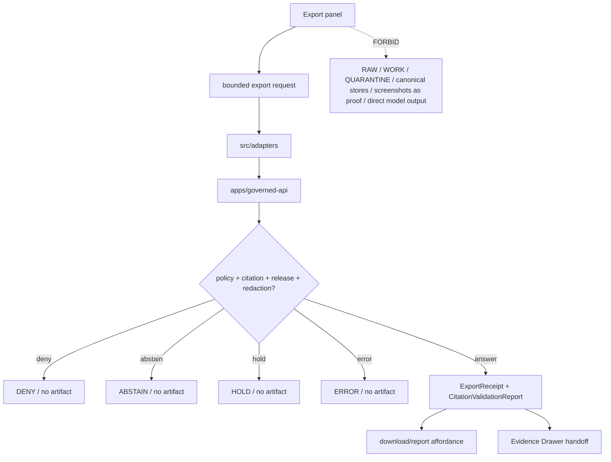

<!-- [KFM_META_BLOCK_V2]
doc_id: kfm://app/explorer-web/src/features/export/readme
title: Explorer Web Export Feature README
type: app-readme
version: v0.2
status: draft
owners: OWNER_TBD — Apps steward · UI steward · Export steward · Governed API steward · Policy steward · Evidence steward · Release steward · Accessibility steward · Docs steward
created: 2026-06-16
updated: 2026-07-09
policy_label: public
related:
  - ../README.md
  - ../../README.md
  - ../../adapters/README.md
  - ../../../README.md
  - ../../../../README.md
  - ../../../../governed-api/README.md
  - ../../../../../docs/doctrine/directory-rules.md
  - ../../../../../docs/architecture/ui/COMPARE_AND_EXPORT.md
  - ../../../../../docs/architecture/ui/EVIDENCE_DRAWER.md
  - ../../../../../packages/ui/README.md
  - ../../../../../packages/maplibre/README.md
  - ../../../../../policy/access/README.md
  - ../../../../../policy/decision/README.md
  - ../../../../../policy/export/README.md
  - ../../../../../release/README.md
  - ../../../../../data/README.md
tags: [kfm, apps, explorer-web, features, export, export-receipt, citation-validation, release-manifest, rollback, public-safe-carrier, governed-export]
notes:
  - "Replaces the greenfield Export feature stub with a governed feature README."
  - "Export UI features may submit governed export requests and render finite outcomes, but they must not publish, bypass policy, emit uncited artifacts, treat screenshots as proof, or package unreleased lifecycle/canonical material."
  - "Feature implementation files, route wiring, tests, fixtures, governed API envelopes, ExportReceipt emission, CitationValidationReport support, policy/export wiring, accessibility behavior, telemetry, and package scripts remain NEEDS VERIFICATION."
  - "policy/export/README.md is referenced by architecture doctrine but was not found during this revision; placement and executable wiring remain NEEDS VERIFICATION."
  - "v0.2 refreshes the evidence basis, aligns truth posture with current GitHub evidence, adds a minimum safe implementation slice, adds runtime anti-bypass checks, and strengthens receipt/accessibility/telemetry review gates without claiming runtime maturity."
[/KFM_META_BLOCK_V2] -->

<a id="top"></a>

<div align="center">

# Explorer Web Export Feature

`apps/explorer-web/src/features/export/`

**App-local Explorer Web feature boundary for governed public-safe export workflows: scope/format selection, citation validation, evidence-reference coverage, rights/sensitivity checks, release pinning, redaction/generalization preservation, ExportReceipt display, rollback targeting, finite outcomes, accessibility, and safe outbound carriers.**


[Evidence](#0-evidence-basis-for-this-revision) · [Purpose](#1-purpose) · [Repo fit](#2-repo-fit) · [Boundary](#3-authority-boundary) · [Inputs](#5-inputs) · [Exclusions](#6-exclusions) · [Feature map](#7-export-feature-map) · [Minimum slice](#8-minimum-safe-implementation-slice) · [Definition of done](#16-definition-of-done)

</div>

---

> [!IMPORTANT]
> **Status:** draft / `NEEDS VERIFICATION`  
> **Owners:** `OWNER_TBD` — Apps steward · UI steward · Export steward · Governed API steward · Policy steward · Evidence steward · Release steward · Accessibility steward · Docs steward  
> **Path:** `apps/explorer-web/src/features/export/README.md`  
> **Responsibility root:** `apps/` — deployable application surfaces  
> **Directory Rules basis:** deployable application feature code belongs under `apps/`; Export is an app-local UI composition surface, not a new root, policy home, release home, receipt/proof home, schema home, contract home, source registry, publication authority, or lifecycle-data lane.  
> **Truth posture:** CONFIRMED current GitHub README path / CONFIRMED parent feature-boundary README posture / CONFIRMED Compare-and-Export architecture doc exists / CONFIRMED `policy/export/README.md` is not present on `main` in this revision / PROPOSED feature contract / UNKNOWN implementation files, route wiring, tests, fixtures, schemas, package scripts, governed API envelopes, receipt emission, accessibility behavior, telemetry, and runtime behavior

> [!CAUTION]
> Export is an outbound trust surface. A screenshot, browser download, copied map, ad hoc GeoJSON, debug dump, generated report, or model-produced narrative is not a KFM export unless it went through the governed Export path and carries the required citations, evidence references, redactions, release references, receipt, policy decision, and rollback target.

---

## Quick jump

- [0. Evidence basis for this revision](#0-evidence-basis-for-this-revision)
- [1. Purpose](#1-purpose)
- [2. Repo fit](#2-repo-fit)
- [3. Authority boundary](#3-authority-boundary)
- [4. Default posture](#4-default-posture)
- [5. Inputs](#5-inputs)
- [6. Exclusions](#6-exclusions)
- [7. Export feature map](#7-export-feature-map)
- [8. Minimum safe implementation slice](#8-minimum-safe-implementation-slice)
- [9. Diagram](#9-diagram)
- [10. Export UI obligations](#10-export-ui-obligations)
- [11. Per-view contract](#11-per-view-contract)
- [12. Runtime anti-bypass matrix](#12-runtime-anti-bypass-matrix)
- [13. Inspection path](#13-inspection-path)
- [14. Validation expectations](#14-validation-expectations)
- [15. Safe change pattern](#15-safe-change-pattern)
- [16. Definition of done](#16-definition-of-done)
- [17. Open verification items](#17-open-verification-items)

---

## 0. Evidence basis for this revision

This README is a documentation boundary, not runtime proof. The 2026-07-09 revision updates an existing README and keeps implementation maturity bounded while aligning the feature contract with current repository evidence.

| Evidence item | Status | What it supports | What it does not prove |
|---|---|---|---|
| `apps/explorer-web/src/features/export/README.md` exists on `main`. | CONFIRMED | This is an existing README update, not a new path proposal. | It does not prove export components, hooks, routes, tests, fixtures, schemas, receipt emission, or runtime behavior exist. |
| `apps/explorer-web/src/features/README.md` exists and defines feature modules as UI composition surfaces. | CONFIRMED | Export belongs under the Explorer Web feature boundary when it is app-local UI composition. | It does not prove Export is wired into routes or launch surfaces. |
| `docs/doctrine/directory-rules.md` confirms `apps/` as the deployable-application responsibility root. | CONFIRMED | The target path is within the correct responsibility root for app-local feature code. | It does not decide whether the feature is complete or release-ready. |
| `docs/architecture/ui/COMPARE_AND_EXPORT.md` exists and describes Compare and Export as derivative public-safe carriers, not authorities. | CONFIRMED document presence and doctrine posture | Export UI must package only governed, cited, released, policy-safe material. | It does not prove implementation, schema wiring, or tests. |
| `docs/architecture/ui/EVIDENCE_DRAWER.md` exists. | CONFIRMED document presence | Export should preserve proof-inspection handoffs when exported claims need evidence review. | It does not prove Export/Evidence Drawer integration. |
| `policy/export/README.md` was not found on `main` during this revision. | CONFIRMED absence from GitHub fetch attempt | Export policy wiring must remain `NEEDS VERIFICATION`. | It does not prove no export policy will exist, or that another accepted policy home is absent. |

[Back to top](#top)

---

## 1. Purpose

`apps/explorer-web/src/features/export/` is the proposed app-local feature boundary for Export source modules inside Explorer Web.

It may eventually hold route modules, panels, view models, hooks, finite-state renderers, request builders, receipt displays, accessibility behavior, telemetry guards, and feature orchestration for:

- choosing an export scope, format, time state, layer set, feature set, audience, destination, and citation bundle;
- submitting governed export requests through the governed API;
- rendering finite outcomes: `ANSWER`, `ABSTAIN`, `DENY`, `ERROR`, and `HOLD` where accepted by the runtime contract;
- displaying citation validation results and evidence-reference coverage;
- preserving redaction, generalization, geoprivacy, aggregation, rights, sensitivity, sovereignty, review, and release-state obligations;
- surfacing `ExportReceipt`, `CitationValidationReport`, `PolicyDecision`, `ReleaseManifest`, `RollbackCard`, `CorrectionNotice`, and correction-lineage references;
- denying screenshots, copied canvases, ad hoc browser downloads, local debug dumps, or direct model narratives as proof-bearing KFM artifacts;
- handing exported artifacts to download/report views only after governed approval.

This directory is not proof that any export component, route, hook, adapter, schema, fixture, test, package script, governed API route, receipt emission, telemetry behavior, accessibility behavior, or download behavior is implemented.

[Back to top](#top)

---

## 2. Repo fit

| Concern | Owning root | Expected relationship |
|---|---|---|
| Export feature source | `apps/explorer-web/src/features/export/` | App-local export feature modules, if implemented and tested |
| Feature boundary | `apps/explorer-web/src/features/` | Parent feature/root contract |
| Adapter boundary | `apps/explorer-web/src/adapters/` | Governed API, evidence, layer, map, export, and diagnostics adapters |
| Explorer Web app | `apps/explorer-web/` | Map-first public/semi-public shell |
| Governed API | `apps/governed-api/` | Trust membrane and normal export request path |
| Export architecture | `docs/architecture/ui/COMPARE_AND_EXPORT.md` | UI subsystem doctrine and export posture |
| Evidence Drawer architecture | `docs/architecture/ui/EVIDENCE_DRAWER.md` | Proof inspection and evidence handoff posture |
| Export policy | `policy/export/` | PROPOSED / NEEDS VERIFICATION; `policy/export/README.md` not found on `main` in this revision |
| Shared UI components | `packages/ui/` | Reusable panels, badges, receipt cards, forms, accordions, tables, and accessibility primitives when shared |
| Renderer wrapper | `packages/maplibre/` | Renderer behavior stays behind adapter/wrapper boundaries |
| Policy gates | `policy/` | Access, sensitivity, rights, release, and decision policy |
| Release authority | `release/` | Publication, correction, supersession, rollback control |
| Lifecycle artifacts | `data/` | Receipts, proofs, registry, catalog, triplets, published artifacts |
| Contracts and schemas | `contracts/`, `schemas/contracts/v1/` | Object meaning and machine shape; this feature references, not owns |

## 3. Authority boundary

This feature renders governed Export UI and submits export requests. It does not own publication, evidence truth, source admission, citation validation, policy decisions, redaction decisions, release decisions, rollback approval, correction approval, schemas, contracts, lifecycle artifacts, renderer authority, telemetry truth, or AI output.

```text
apps/explorer-web/src/features/export/ = app-local Export UI feature
apps/explorer-web/src/features/        = feature boundary
apps/explorer-web/src/adapters/        = adapter boundary
apps/governed-api/                     = trust membrane and export request path
docs/architecture/ui/COMPARE_AND_EXPORT.md = Export architecture doctrine
docs/architecture/ui/EVIDENCE_DRAWER.md    = proof-inspection doctrine
packages/ui/                           = shared UI primitives
packages/maplibre/                     = renderer wrapper
policy/                                = finite policy decisions
release/                               = publication, correction, rollback authority
data/                                  = lifecycle artifacts, receipts, proofs, registries
schemas/contracts/v1/                  = machine-readable shape
contracts/                             = object meaning
```

## 4. Default posture

Export feature modules should fail closed, require citation validation, preserve redaction and release state, and never emit or present a KFM artifact when the governed API returns `ABSTAIN`, `DENY`, `ERROR`, or `HOLD`.

An export view should not emit or present a downloadable KFM artifact when any of these are unresolved:

- governed API envelope and response validation;
- export request contract and allowed format/scope;
- `DecisionEnvelope` outcome;
- evidence references for every claim-bearing layer, badge, annotation, caption, legend, table row, or text summary;
- citation validation result;
- rights, sensitivity, sovereignty, CARE, living-person, DNA, rare-species, archaeology, infrastructure, private-property, or other restricted-lane posture;
- redaction, generalization, aggregation, geoprivacy, suppression, or transformation state;
- `ReleaseManifest` reference for every exported layer or artifact;
- rollback target and correction lineage;
- `ExportReceipt`, `CitationValidationReport`, and relevant policy/redaction receipt persistence;
- stale-state, freshness, review-state, or hold-state posture;
- public audience, purpose, destination, or redistribution boundary.

## 5. Inputs

| Input family | Examples | Required posture |
|---|---|---|
| Export scope | current view, selected layers, selected features, bounds, time window, story snapshot, compare result, domain feature selection | Bounded and contract-validated |
| Format state | PDF, PNG, GeoJSON, CSV, report, atlas slice, PMTiles/COG slice, Story Node embed | Allowed by policy and scope |
| API envelope | export request, export response, `DecisionEnvelope`, finite outcome | Runtime-validated before render |
| Evidence state | `evidence_refs[]`, bundle refs, citations, proof coverage | Required for every citable claim |
| Policy state | rights, sensitivity, audience, purpose, redactions, restrictions | Preserved from governed API/policy |
| Release state | `release_refs[]`, release manifest, correction lineage, rollback target | Required for every exported layer/artifact |
| Receipt state | `ExportReceipt`, `CitationValidationReport`, `PolicyDecision`, `RedactionReceipt`, `AggregationReceipt` | Required for successful `ANSWER` export where applicable |
| UI state | loading, queued, answered, held, denied, abstained, error, stale, expired, cancelled, empty | Finite and tested states |
| Accessibility state | keyboard path, ARIA labels, focus management, reduced motion, non-color trust badges | Required for trust-bearing export UI |
| Telemetry state | export opened, request submitted, denial shown, receipt viewed, download started | Non-secret, policy-safe, no protected export content |

## 6. Exclusions

| Does not belong here | Correct home |
|---|---|
| Governed API export implementation | `apps/governed-api/` |
| Export policy bundles or policy decisions | `policy/export/`, `policy/decision/`, `policy/` |
| Citation validation implementation | governed API / validation packages, not browser UI |
| EvidenceBundle construction or canonical resolver authority | `packages/evidence-resolver/`, governed API, evidence services — exact home `NEEDS VERIFICATION` |
| Release manifests, rollback cards, correction notices | `release/`, `data/receipts/`, `data/proofs/` as accepted |
| Export receipts and citation validation reports | `data/receipts/`, `data/proofs/`, or accepted receipt home |
| Schemas and contracts | `schemas/contracts/v1/receipts/`, `schemas/contracts/v1/ui/`, `contracts/` |
| Renderer wrapper authority | `packages/maplibre/` |
| Shared reusable UI primitives | `packages/ui/` |
| Lifecycle artifacts, receipts, proofs, catalog, triplets | `data/` |
| Direct source acquisition | `connectors/` |
| Direct model runtime behavior | `runtime/` behind governed API only |
| Raw screenshots, copied canvases, ad hoc downloads, local debug dumps, or model output as KFM artifacts | Forbidden unless routed through governed Export and receipt chain |
| Secrets, credentials, tokens, private keys | Secret manager / deployment environment |

## 7. Export feature map

Exact modules remain `NEEDS VERIFICATION`. Candidate modules should be introduced only with route inventory, fixtures, tests, and accepted contract/policy posture.

| Candidate module | Purpose | Required safeguard | Status |
|---|---|---|---|
| `export-panel` | Export scope, format, and confirmation UI | Finite outcome and policy state required | PROPOSED |
| `request-builder` | Build governed export request | Contract validation and bounded scope | PROPOSED |
| `format-selector` | Select PDF/PNG/GeoJSON/CSV/report/etc. | Policy-entitled formats only | PROPOSED |
| `citation-check` | Show citation validation state | Display API result; no browser recomputation | PROPOSED |
| `policy-summary` | Show rights, sensitivity, redaction, release, and review labels | Text and ARIA labels required | PROPOSED |
| `receipt-viewer` | Show `ExportReceipt` and `CitationValidationReport` references | No artifact without receipt | PROPOSED |
| `rollback-summary` | Show rollback target and correction lineage | No hidden lineage breaks | PROPOSED |
| `negative-state-panel` | Show uncited, rights/sensitivity, unreleased, stale, malformed, hold states | No silent export | PROPOSED |
| `download-affordance` | Present artifact link after `ANSWER` | Only after governed receipt confirmation | PROPOSED |
| `telemetry-safe-events` | Record non-content UI events | No raw export payloads | PROPOSED |
| `evidence-drawer-handoff` | Let users inspect exported claim support | Drawer opens governed evidence projection only | PROPOSED |

> [!WARNING]
> Candidate module names are not implementation proof. Do not document an export module as runnable until files, route wiring, tests, fixtures, package scripts, governed API envelopes, receipt emission, policies, schemas, and accessibility checks confirm it.

## 8. Minimum safe implementation slice

A smallest useful Export slice should prove the trust membrane and artifact integrity before adding format breadth.

| Slice item | Minimum requirement | Why it is required |
|---|---|---|
| Bounded request contract | Scope, format, audience, time state, and destination are explicit | Prevents ad hoc or accidental bulk export |
| Envelope parser | Validate governed API envelope and finite outcome | Prevents malformed responses becoming downloadable artifacts |
| Citation gate | Require citation validation for every claim-bearing exported item | Enforces cite-or-abstain |
| Release gate | Require release refs and rollback target for exported artifacts | Keeps publication and rollback inspectable |
| Redaction preservation | Preserve redaction/generalization/aggregation/suppression metadata | Prevents sensitive-data re-exposure |
| Negative states | Render denied, abstained, held, stale, malformed, and empty states with no artifact | Prevents silent export failure |
| Receipt display | Show or link `ExportReceipt` and `CitationValidationReport` after `ANSWER` | Makes outbound artifact auditable |
| Screenshot denial | Label browser screenshots/copy/canvas capture as non-KFM artifacts | Prevents false proof carriers |
| Accessibility path | Keyboard, focus, ARIA labels, non-color status, and reduced-motion behavior | Makes export trust usable |
| Telemetry guard | Emit non-secret event metadata only | Prevents logs from becoming leakage paths |
| Lifecycle denial test | Prove browser code does not import/read lifecycle roots or canonical stores | Preserves public-client boundary |

This slice is still `PROPOSED` until files, fixtures, tests, route wiring, and accepted contracts are verified.

## 9. Diagram



## 10. Export UI obligations

| Obligation | Example effect |
|---|---|
| `governed_api_only` | Export request goes through governed API envelopes |
| `no_uncited_export` | Any uncited claim routes to `ABSTAIN`, not artifact emission |
| `release_manifest_required` | Every exported layer/artifact has `release_refs[]` |
| `receipt_required` | Successful export displays or links `ExportReceipt` and `CitationValidationReport` |
| `redaction_preserved` | Redactions, generalizations, aggregations, geoprivacy, rights restrictions, and transformations survive export packaging |
| `rollback_visible` | Rollback target and correction lineage are pinned and inspectable |
| `screenshots_not_proof` | Browser screenshots/captures are not KFM artifacts unless exported through the governed path |
| `finite_states_required` | `ANSWER`, `ABSTAIN`, `DENY`, `ERROR`, and `HOLD` are explicit UI states where accepted |
| `telemetry_safe` | Telemetry records UI behavior only, never export contents or raw payloads |
| `accessibility_required` | Export status, denial, and receipt state are available without mouse or color-only cues |
| `no_authority_fork` | Feature code does not redefine evidence, citation, policy, release, correction, schema, contract, or renderer authority |

## 11. Per-view contract

Every long-lived Export view should document or encode:

- export scope, format, audience, purpose, and destination;
- governed API envelope dependency;
- export request/response schema dependency;
- finite outcomes and negative state behavior;
- evidence refs and citation validation behavior;
- rights, sensitivity, review, release, correction, redaction, aggregation, generalization, and rollback behavior;
- format-specific restrictions and disclaimers;
- download gating and receipt display behavior;
- loading, queued, cancelled, held, denied, abstained, stale, malformed, error, empty, and answered states;
- Evidence Drawer, Compare, Story, Focus Mode, and domain-feature handoffs, if present;
- telemetry behavior, if present;
- accessibility behavior for keyboard, screen reader, focus management, reduced motion, and non-color trust badges;
- tests and fixtures proving trust-membrane, citation, policy, release, receipt, telemetry, and accessibility boundaries.

## 12. Runtime anti-bypass matrix

| Bypass risk | Required behavior | Review signal |
|---|---|---|
| Browser reads lifecycle/canonical data directly | Deny at import/build/test review; route through governed API | No direct `data/` or canonical-store imports/fetches |
| Screenshot or copied canvas treated as export | Label as non-KFM artifact unless governed Export produced receipt | Screenshot/canvas paths never emit proof language |
| Uncited layer exported | Route to `ABSTAIN`; no artifact link | Fixture proves missing citation blocks export |
| Unreleased layer exported | Route to `DENY` or `HOLD`; no artifact link | Fixture proves missing release refs blocks export |
| Redactions dropped by format conversion | Preserve redaction/generalization metadata or deny format | Format fixtures prove sensitive fields remain protected |
| Client recomputes policy/citation validity | Render governed result only | No browser-side policy/citation authority fork |
| Export receipt hidden | Receipt/ref is shown or linked for successful export | `ANSWER` fixture includes visible receipt |
| Telemetry captures payload | Emit non-secret event metadata only | Telemetry fixture excludes raw export contents and protected identifiers |
| AI text packaged as authoritative report | Require evidence/citation/release support for any claim-bearing text | AI narrative cannot bypass export receipt chain |

## 13. Inspection path

Export implementation files, route wiring, tests, fixtures, governed API envelopes, schema bindings, receipt emission, accessibility behavior, telemetry, package scripts, and Evidence Drawer/Compare/Story/Focus/domain handoffs remain `NEEDS VERIFICATION`.

```bash
find apps/explorer-web/src/features/export -maxdepth 5 -type f | sort
find apps/explorer-web/src apps/governed-api docs/architecture/ui packages/ui packages/maplibre schemas contracts policy release data tests fixtures -maxdepth 6 -type f 2>/dev/null | grep -Ei 'export|ExportReceipt|StorySnapshot|CitationValidationReport|ReleaseManifest|RollbackCard|CorrectionNotice|RedactionReceipt|AggregationReceipt|PolicyDecision|DecisionEnvelope|citation|release|rollback|redaction|screenshot|download|a11y|accessibility|telemetry' | sort
find data/raw data/work data/quarantine data/processed data/catalog data/triplets data/published data/receipts data/proofs -maxdepth 2 -type f 2>/dev/null | sort
```

## 14. Validation expectations

Useful validation for this feature boundary should cover:

- no Export feature imports or reads lifecycle/canonical data roots directly;
- export requests consume governed API envelopes only;
- malformed requests render `ERROR`, never partial artifacts;
- uncited claim, missing evidence, or stale-without-alternative routes to `ABSTAIN`;
- rights, sensitivity, release-state, or restricted-lane violations route to `DENY`;
- pending review routes to `HOLD` and emits no export;
- every `ANSWER` export surfaces `ExportReceipt`, `CitationValidationReport`, `release_refs[]`, redaction/generalization state, and rollback target;
- screenshots, copied map canvases, debug dumps, and browser-only downloads are not treated as KFM artifacts;
- telemetry never includes raw export contents, protected values, secret URLs, or private identifiers;
- accessibility tests cover keyboard, focus management, screen-reader labels, reduced motion, and non-color trust badges.

## 15. Safe change pattern

For Export feature changes:

1. Add or update route inventory and per-view contract.
2. Add fixtures for `ANSWER`, `ABSTAIN`, `DENY`, `ERROR`, `HOLD`, uncited claim, rights denied, sensitivity denied, unreleased content, stale evidence, malformed request, pending review, loading, cancelled, empty, telemetry-denied, screenshot-denied, and redaction-preserved states.
3. Test lifecycle/canonical-data denial and governed API-only behavior.
4. Preserve evidence refs, citations, policy state, release refs, redactions, correction lineage, rollback targets, and receipt refs through UI state.
5. Test keyboard/screen-reader/reduced-motion paths before claiming trust-bearing export usability.
6. Update this README, parent `features/README.md`, Compare/Export architecture docs, Evidence Drawer docs, policy/export docs when they exist, and parent app README when public behavior changes.

## 16. Definition of done

- [ ] Owners are confirmed and `OWNER_TBD` is replaced.
- [ ] Evidence basis is refreshed when parent README, Compare/Export docs, Evidence Drawer docs, export policy, governed API, schema, release, telemetry, receipt, or fixture evidence changes.
- [ ] Export feature file inventory and route ownership are documented.
- [ ] Governed API and adapter dependencies are explicit.
- [ ] Export request/response schema binding is verified.
- [ ] `DecisionEnvelope` outcomes and negative states are represented in UI fixtures.
- [ ] Direct lifecycle/canonical-data import/read checks are covered.
- [ ] `ExportReceipt`, `CitationValidationReport`, `release_refs[]`, redaction/generalization state, and rollback target are preserved on success.
- [ ] Screenshot/browser-capture/debug-dump denial posture is tested.
- [ ] Telemetry is tested as non-secret and policy-safe if present.
- [ ] Accessibility behavior is tested for keyboard, focus, ARIA, reduced motion, and non-color badges.
- [ ] Evidence Drawer, Compare, Story, Focus Mode, and domain-feature launch/export paths use the same governed export contract when applicable.

## 17. Open verification items

| Item | Why it matters |
|---|---|
| Confirm Export implementation files beyond README | Prevents overclaiming feature maturity |
| Confirm route inventory and launch surfaces | Required for public/semi-public UI boundary review |
| Confirm governed API export endpoint or equivalent | Required for trust membrane enforcement |
| Confirm export request/response schemas and fixtures | Required before claim-bearing export UI claims |
| Confirm `ExportReceipt` and `CitationValidationReport` emission | Required before artifact-download claims |
| Confirm `policy/export/` placement or replacement | Required before executable policy wiring claims |
| Confirm screenshot/browser-download/debug-dump denial tests | Required to protect artifact integrity |
| Confirm redaction/generalization preservation tests | Required before sensitive or restricted exports |
| Confirm accessibility tests | Required because outbound trust signals must be accessible |
| Confirm telemetry is safe and non-secret | Required before diagnostics/observability claims |
| Confirm package scripts beyond TODO | Required before build/test claims |
| Confirm architecture-doc links and relative paths after recursive inventory | Required before treating all related paths as current implementation evidence |

<details>
<summary>Appendix A — no-loss preservation note</summary>

The previous README already contained a strong governed Export feature contract. This revision preserves that contract, refreshes metadata, adds a current evidence-basis section, strengthens outbound artifact integrity, screenshot-denial, telemetry, accessibility, and anti-bypass safeguards, and keeps implementation claims bounded. It does not claim export components, routes, hooks, adapters, fixtures, tests, package scripts, governed API envelopes, schemas, receipt emission, accessibility behavior, telemetry, Evidence Drawer handoff, Compare handoff, Story handoff, Focus handoff, domain-feature handoff, or download behavior are implemented.

</details>

## Status summary

`apps/explorer-web/src/features/export/` should contain Export feature modules only after route contracts, governed API envelopes, schema bindings, negative-state fixtures, receipt emission, accessibility tests, telemetry constraints, redaction-preservation tests, and downstream handoffs are verified.

It must preserve the trust membrane and outbound-carrier boundary: Export may request and display governed artifacts, but it must not publish on its own authority, emit uncited artifacts, bypass policy, package unreleased content, treat screenshots or debug dumps as proof, drop redactions, lose release refs, hide correction lineage, hide rollback targets, or become a direct model-output surface.

<p align="right"><a href="#top">Back to top</a></p>
