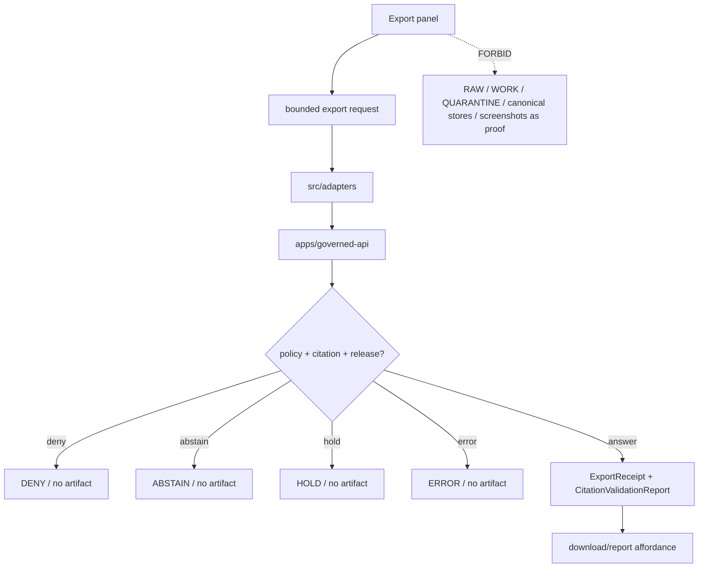

<!-- [KFM_META_BLOCK_V2]
doc_id: kfm://app/explorer-web/src/features/export/readme
title: Explorer Web Export Feature README
type: app-readme
version: v0.1
status: draft
owners: OWNER_TBD — Apps steward · UI steward · Export steward · Governed API steward · Policy steward · Evidence steward · Release steward · Docs steward
created: 2026-06-16
updated: 2026-06-16
policy_label: public
related:
  - ../README.md
  - ../../README.md
  - ../../adapters/README.md
  - ../../../README.md
  - ../../../../README.md
  - ../../../../governed-api/README.md
  - ../../../../../docs/architecture/ui/COMPARE_AND_EXPORT.md
  - ../../../../../docs/architecture/ui/EVIDENCE_DRAWER.md
  - ../../../../../packages/ui/README.md
  - ../../../../../packages/maplibre/README.md
  - ../../../../../policy/access/README.md
  - ../../../../../policy/decision/README.md
  - ../../../../../policy/export/README.md
  - ../../../../../release/README.md
  - ../../../../../data/README.md
tags: [kfm, apps, explorer-web, features, export, export-receipt, citation-validation, release-manifest, rollback, public-safe-carrier]
notes:
  - "Replaces the greenfield Export feature stub with a governed feature README."
  - "Export UI features may submit governed export requests and render finite outcomes, but they must not publish, bypass policy, emit uncited artifacts, treat screenshots as proof, or package unreleased lifecycle/canonical material."
  - "Feature implementation files, route wiring, tests, fixtures, governed API envelopes, ExportReceipt emission, CitationValidationReport support, policy/export wiring, accessibility behavior, telemetry, and package scripts remain NEEDS VERIFICATION."
  - "policy/export/README.md is referenced by architecture doctrine but was not found during this authoring pass; placement remains NEEDS VERIFICATION."
[/KFM_META_BLOCK_V2] -->

<a id="top"></a>

<div align="center">

# Explorer Web Export Feature

`apps/explorer-web/src/features/export/`

**App-local Explorer Web feature boundary for governed public-safe export workflows: format/scope selection, citation validation, rights/sensitivity checks, release pinning, redaction/generalization preservation, ExportReceipt display, rollback targeting, finite outcomes, and safe outbound carriers.**


[Purpose](#1-purpose) · [Repo fit](#2-repo-fit) · [Boundary](#3-authority-boundary) · [Inputs](#5-inputs) · [Exclusions](#6-exclusions) · [Feature map](#7-export-feature-map) · [Definition of done](#14-definition-of-done)

</div>

---

> [!IMPORTANT]
> **Status:** draft / `NEEDS VERIFICATION`  
> **Owners:** `OWNER_TBD` — Apps steward · UI steward · Export steward · Governed API steward · Policy steward · Evidence steward · Release steward · Docs steward  
> **Path:** `apps/explorer-web/src/features/export/README.md`  
> **Responsibility root:** `apps/` — deployable application surfaces  
> **Truth posture:** CONFIRMED README path / CONFIRMED Compare-and-Export architecture doctrine / PROPOSED feature contract / UNKNOWN implementation files, route wiring, tests, fixtures, schemas, and runtime behavior

> [!CAUTION]
> Export is an outbound trust surface. A screenshot, browser download, copied map, ad hoc GeoJSON, or developer dump is not a KFM export unless it went through the governed Export path and carries the required citations, evidence references, redactions, release references, receipt, and rollback target.

---

## Quick jump

- [1. Purpose](#1-purpose)
- [2. Repo fit](#2-repo-fit)
- [3. Authority boundary](#3-authority-boundary)
- [4. Default posture](#4-default-posture)
- [5. Inputs](#5-inputs)
- [6. Exclusions](#6-exclusions)
- [7. Export feature map](#7-export-feature-map)
- [8. Diagram](#8-diagram)
- [9. Export UI obligations](#9-export-ui-obligations)
- [10. Per-view contract](#10-per-view-contract)
- [11. Inspection path](#11-inspection-path)
- [12. Validation expectations](#12-validation-expectations)
- [13. Safe change pattern](#13-safe-change-pattern)
- [14. Definition of done](#14-definition-of-done)
- [15. Open verification items](#15-open-verification-items)

---

## 1. Purpose

`apps/explorer-web/src/features/export/` is the proposed app-local feature boundary for Export source modules inside Explorer Web.

It may eventually hold route modules, panels, view models, hooks, finite-state renderers, request builders, receipt displays, and feature orchestration for:

- choosing an export scope, format, time state, layer set, and citation bundle;
- submitting governed export requests through the governed API;
- rendering finite outcomes: `ANSWER`, `ABSTAIN`, `DENY`, `ERROR`, and `HOLD`;
- displaying citation validation results and evidence-reference coverage;
- preserving redaction, generalization, geoprivacy, rights, sensitivity, review, and release-state obligations;
- surfacing `ExportReceipt`, `CitationValidationReport`, `ReleaseManifest`, `RollbackCard`, and correction lineage references;
- denying screenshots or browser-only captures as proof-bearing KFM artifacts;
- handing exported artifacts to download/report views only after governed approval.

This directory is not proof that any export component, route, hook, adapter, schema, fixture, test, package script, governed API route, receipt emission, or accessibility behavior is implemented.

[Back to top](#top)

---

## 2. Repo fit

| Concern | Owning root | Expected relationship |
|---|---|---|
| Export feature source | `apps/explorer-web/src/features/export/` | App-local export feature modules, if implemented and tested |
| Feature boundary | `apps/explorer-web/src/features/` | Parent feature/root contract |
| Adapter boundary | `apps/explorer-web/src/adapters/` | Governed API, evidence, layer, map, export, and diagnostics adapters |
| Explorer Web app | `apps/explorer-web/` | Map-first public/semi-public shell |
| Governed API | `apps/governed-api/` | Trust membrane and normal export request path |
| Export architecture | `docs/architecture/ui/COMPARE_AND_EXPORT.md` | UI subsystem doctrine and export posture |
| Evidence Drawer architecture | `docs/architecture/ui/EVIDENCE_DRAWER.md` | Proof inspection and evidence handoff posture |
| Export policy | `policy/export/` | PROPOSED / NEEDS VERIFICATION; not found in this pass |
| Shared UI components | `packages/ui/` | Reusable panels, badges, receipt cards, forms, accordions, tables, and accessibility primitives when shared |
| Renderer wrappers | `packages/maplibre/`, `packages/cesium/` | Renderer behavior stays behind adapter/wrapper boundaries |
| Policy gates | `policy/` | Access, sensitivity, rights, release, and decision policy |
| Release authority | `release/` | Publication, correction, supersession, rollback control |
| Lifecycle artifacts | `data/` | Receipts, proofs, registry, catalog, triplets, published artifacts |

## 3. Authority boundary

This feature renders governed Export UI and submits export requests. It does not own publication, evidence truth, source admission, citation validation, policy decisions, redaction decisions, release decisions, rollback approval, correction approval, schemas, contracts, lifecycle artifacts, renderer authority, telemetry truth, or AI output.

```text
apps/explorer-web/src/features/export/ = app-local Export UI feature
apps/explorer-web/src/features/        = feature boundary
apps/explorer-web/src/adapters/        = adapter boundary
apps/governed-api/                     = trust membrane and export request path
docs/architecture/ui/COMPARE_AND_EXPORT.md = Export architecture doctrine
packages/ui/                           = shared UI primitives
policy/                                = finite policy decisions
release/                               = publication, correction, rollback authority
data/                                  = lifecycle artifacts, receipts, proofs, registries
```

## 4. Default posture

Export feature modules should fail closed, require citation validation, preserve redaction and release state, and never emit an artifact when the governed API returns `ABSTAIN`, `DENY`, `ERROR`, or `HOLD`.

An export view should not emit or present a downloadable KFM artifact when any of these are unresolved:

- governed API envelope and response validation;
- export request contract and allowed format/scope;
- `DecisionEnvelope` outcome;
- evidence references for every claim-bearing layer, badge, annotation, caption, or text summary;
- citation validation result;
- rights, sensitivity, sovereignty, CARE, living-person, rare-species, archaeology, infrastructure, or other restricted-lane posture;
- redaction, generalization, aggregation, geoprivacy, or suppression state;
- `ReleaseManifest` reference for every exported layer or artifact;
- rollback target and correction lineage;
- `ExportReceipt` and `CitationValidationReport` persistence;
- stale-state, freshness, review-state, or hold-state posture;
- public audience or export destination.

## 5. Inputs

| Input family | Examples | Required posture |
|---|---|---|
| Export scope | current view, selected layers, selected features, bounds, time window, story snapshot, compare result | Bounded and contract-validated |
| Format state | PDF, PNG, GeoJSON, CSV, report, atlas slice, PMTiles/COG slice, Story Node embed | Allowed by policy and scope |
| API envelope | export request, export response, `DecisionEnvelope`, finite outcome | Runtime-validated before render |
| Evidence state | `evidence_refs[]`, bundle refs, citations, proof coverage | Required for every citable claim |
| Policy state | rights, sensitivity, audience, purpose, redactions, restrictions | Preserved from governed API/policy |
| Release state | `release_refs[]`, release manifest, correction lineage, rollback target | Required for every exported layer/artifact |
| Receipt state | `ExportReceipt`, `CitationValidationReport`, `PolicyDecision`, `RedactionReceipt` | Required for successful `ANSWER` export |
| UI state | loading, queued, answered, held, denied, abstained, error, stale, expired, cancelled | Finite and tested states |
| Accessibility state | keyboard path, ARIA labels, focus management, non-color trust badges | Required for trust-bearing export UI |

## 6. Exclusions

| Does not belong here | Correct home |
|---|---|
| Governed API export implementation | `apps/governed-api/` |
| Export policy bundles or policy decisions | `policy/export/`, `policy/decision/`, `policy/` |
| Citation validation implementation | governed API / validation packages, not browser UI |
| EvidenceBundle construction or canonical resolver authority | `packages/evidence-resolver/`, governed API, evidence services — exact home `NEEDS VERIFICATION` |
| Release manifests, rollback cards, correction notices | `release/`, `data/receipts/`, `data/proofs/` as accepted |
| Export receipts and citation validation reports | `data/receipts/`, `data/proofs/`, or accepted receipt home |
| Schemas and contracts | `schemas/contracts/v1/receipts/`, `schemas/contracts/v1/ui/`, `contracts/` |
| Renderer wrapper authority | `packages/maplibre/`, `packages/cesium/` |
| Shared reusable UI primitives | `packages/ui/` |
| Lifecycle artifacts, receipts, proofs, catalog, triplets | `data/` |
| Direct source acquisition | `connectors/` |
| Direct model runtime behavior | `runtime/` behind governed API only |
| Raw screenshots or browser-only downloads as KFM artifacts | Forbidden unless routed through governed Export and receipt chain |
| Secrets, credentials, tokens, private keys | Secret manager / deployment environment |

## 7. Export feature map

Exact modules remain `NEEDS VERIFICATION`. Candidate modules should be introduced only with route inventory, fixtures, and tests.

| Candidate module | Purpose | Required safeguard | Status |
|---|---|---|---|
| `export-panel` | Export scope, format, and confirmation UI | Finite outcome and policy state required | PROPOSED |
| `request-builder` | Build governed export request | Contract validation and bounded scope | PROPOSED |
| `format-selector` | Select PDF/PNG/GeoJSON/CSV/report/etc. | Policy-entitled formats only | PROPOSED |
| `citation-check` | Show citation validation state | Display API result; no browser recomputation | PROPOSED |
| `policy-summary` | Show rights, sensitivity, redaction, release, and review labels | Text and ARIA labels required | PROPOSED |
| `receipt-viewer` | Show `ExportReceipt` and `CitationValidationReport` references | No artifact without receipt | PROPOSED |
| `rollback-summary` | Show rollback target and correction lineage | No hidden lineage breaks | PROPOSED |
| `negative-state-panel` | Show uncited, rights/sensitivity, unreleased, stale, malformed, hold states | No silent export | PROPOSED |
| `download-affordance` | Present artifact link after `ANSWER` | Only after governed receipt confirmation | PROPOSED |
| `telemetry-safe-events` | Record non-content UI events | No raw export payloads | PROPOSED |

> [!WARNING]
> Candidate module names are not implementation proof. Do not document an export module as runnable until files, route wiring, tests, fixtures, package scripts, governed API envelopes, receipt emission, and schemas confirm it.

## 8. Diagram



## 9. Export UI obligations

| Obligation | Example effect |
|---|---|
| `governed_api_only` | Export request goes through governed API envelopes |
| `no_uncited_export` | Any uncited claim routes to `ABSTAIN`, not artifact emission |
| `release_manifest_required` | Every exported layer/artifact has `release_refs[]` |
| `receipt_required` | Successful export displays or links `ExportReceipt` and `CitationValidationReport` |
| `redaction_preserved` | Redactions, generalizations, geoprivacy, rights restrictions, and transformations survive export packaging |
| `rollback_visible` | Rollback target and correction lineage are pinned and inspectable |
| `screenshots_not_proof` | Browser screenshots/captures are not KFM artifacts unless exported through the governed path |
| `finite_states_required` | `ANSWER`, `ABSTAIN`, `DENY`, `ERROR`, and `HOLD` are explicit UI states |
| `telemetry_safe` | Telemetry records UI behavior only, never export contents or raw payloads |
| `no_authority_fork` | Feature code does not redefine evidence, citation, policy, release, correction, schema, contract, or renderer authority |

## 10. Per-view contract

Every long-lived Export view should document or encode:

- export scope, format, and destination;
- governed API envelope dependency;
- export request/response schema dependency;
- finite outcomes and negative state behavior;
- evidence refs and citation validation behavior;
- rights, sensitivity, review, release, correction, redaction, and rollback behavior;
- format-specific restrictions and disclaimers;
- download gating and receipt display behavior;
- loading, queued, cancelled, held, denied, abstained, stale, malformed, error, and answered states;
- Evidence Drawer and Compare handoffs, if present;
- accessibility behavior for keyboard, screen reader, focus management, reduced motion, and non-color trust badges;
- tests and fixtures proving trust-membrane, citation, policy, release, receipt, and accessibility boundaries.

## 11. Inspection path

Export implementation files, route wiring, tests, fixtures, governed API envelopes, schema bindings, receipt emission, accessibility behavior, telemetry, package scripts, and Evidence Drawer/Compare handoffs remain `NEEDS VERIFICATION`.

```bash
find apps/explorer-web/src/features/export -maxdepth 5 -type f | sort
find apps/explorer-web/src apps/governed-api docs/architecture/ui packages/ui packages/maplibre schemas contracts policy release data tests fixtures -maxdepth 6 -type f 2>/dev/null | grep -Ei 'export|ExportReceipt|StorySnapshot|CitationValidationReport|ReleaseManifest|RollbackCard|CorrectionNotice|RedactionReceipt|PolicyDecision|DecisionEnvelope|citation|release|rollback|redaction|screenshot|download|a11y|accessibility' | sort
find data/raw data/work data/quarantine data/processed data/catalog data/triplets data/published data/receipts data/proofs -maxdepth 2 -type f 2>/dev/null | sort
```

## 12. Validation expectations

Useful validation for this feature boundary should cover:

- no Export feature imports or reads lifecycle/canonical data roots directly;
- export requests consume governed API envelopes only;
- malformed requests render `ERROR`, never partial artifacts;
- uncited claim, missing evidence, or stale-without-alternative routes to `ABSTAIN`;
- rights, sensitivity, release-state, or restricted-lane violations route to `DENY`;
- pending review routes to `HOLD` and emits no export;
- every `ANSWER` export surfaces `ExportReceipt`, `CitationValidationReport`, `release_refs[]`, `redactions[]`, and rollback target;
- screenshots, copied map canvases, and browser-only downloads are not treated as KFM artifacts;
- telemetry never includes raw export contents;
- accessibility tests cover keyboard, focus management, screen-reader labels, reduced motion, and non-color trust badges.

## 13. Safe change pattern

For Export feature changes:

1. Add or update route inventory and per-view contract.
2. Add fixtures for `ANSWER`, `ABSTAIN`, `DENY`, `ERROR`, `HOLD`, uncited claim, rights denied, sensitivity denied, unreleased content, stale evidence, malformed request, pending review, loading, cancelled, and empty states.
3. Test lifecycle/canonical-data denial and governed API-only behavior.
4. Preserve evidence refs, citations, policy state, release refs, redactions, correction lineage, rollback targets, and receipt refs through UI state.
5. Test keyboard/screen-reader/reduced-motion paths before claiming trust-bearing export usability.
6. Update this README, parent `features/README.md`, Compare/Export architecture docs, and parent app README when public behavior changes.

## 14. Definition of done

- [ ] Owners are confirmed and `OWNER_TBD` is replaced.
- [ ] Export feature file inventory and route ownership are documented.
- [ ] Governed API and adapter dependencies are explicit.
- [ ] Export request/response schema binding is verified.
- [ ] `DecisionEnvelope` outcomes and negative states are represented in UI fixtures.
- [ ] Direct lifecycle/canonical-data import/read checks are covered.
- [ ] `ExportReceipt`, `CitationValidationReport`, `release_refs[]`, `redactions[]`, and rollback target are preserved on success.
- [ ] Screenshot/browser-capture denial posture is tested.
- [ ] Accessibility behavior is tested for keyboard, focus, ARIA, reduced motion, and non-color badges.
- [ ] Evidence Drawer, Compare, Story, and domain-feature launch/export paths use the same governed export contract when applicable.

## 15. Open verification items

| Item | Why it matters |
|---|---|
| Confirm Export implementation files beyond README | Prevents overclaiming feature maturity |
| Confirm route inventory and launch surfaces | Required for public/semi-public UI boundary review |
| Confirm governed API export endpoint or equivalent | Required for trust membrane enforcement |
| Confirm export request/response schemas and fixtures | Required before claim-bearing export UI claims |
| Confirm `ExportReceipt` and `CitationValidationReport` emission | Required before artifact-download claims |
| Confirm `policy/export/` placement or replacement | Required before executable policy wiring claims |
| Confirm screenshot/browser-download denial tests | Required to protect artifact integrity |
| Confirm accessibility tests | Required because outbound trust signals must be accessible |
| Confirm telemetry is safe and non-secret | Required before diagnostics/observability claims |
| Confirm package scripts beyond TODO | Required before build/test claims |

<details>
<summary>Appendix A — no-loss preservation note</summary>

The previous README was a greenfield stub. This replacement adds a bounded Export feature contract without claiming export components, routes, hooks, adapters, fixtures, tests, package scripts, governed API envelopes, schemas, receipt emission, accessibility behavior, telemetry, Evidence Drawer handoff, Compare handoff, Story handoff, or download behavior are implemented.

</details>

## Status summary

`apps/explorer-web/src/features/export/` should contain Export feature modules only after route contracts, governed API envelopes, schema bindings, negative-state fixtures, receipt emission, accessibility tests, telemetry constraints, and downstream handoffs are verified.

It must preserve the trust membrane and outbound-carrier boundary: Export may request and display governed artifacts, but it must not publish on its own authority, emit uncited artifacts, bypass policy, package unreleased content, treat screenshots as proof, drop redactions, lose release refs, hide correction lineage, or become a direct model-output surface.

<p align="right"><a href="#top">Back to top</a></p>
