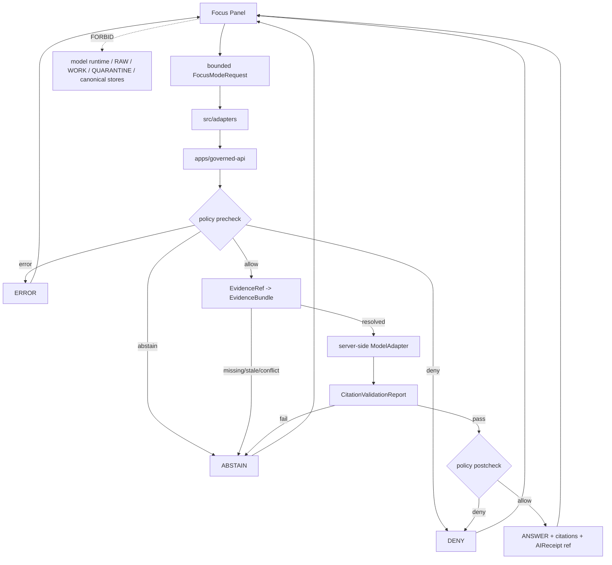

<!-- [KFM_META_BLOCK_V2]
doc_id: kfm://app/explorer-web/src/features/focus_panel/readme
title: Explorer Web Focus Panel Feature README
type: app-readme
version: v0.1
status: draft
owners: OWNER_TBD — Apps steward · UI steward · Focus Mode steward · Governed AI steward · Governed API steward · Policy steward · Evidence steward · Docs steward
created: 2026-06-16
updated: 2026-06-16
policy_label: public
related:
  - ../README.md
  - ../../README.md
  - ../../adapters/README.md
  - ../../../README.md
  - ../../../../README.md
  - ../../../../governed-api/README.md
  - ../../../../../docs/architecture/governed-ai/FOCUS_FLOW.md
  - ../../../../../docs/architecture/governed-ai/README.md
  - ../../../../../docs/architecture/ui/EVIDENCE_DRAWER.md
  - ../../../../../policy/focus/README.md
  - ../../../../../packages/ui/README.md
  - ../../../../../packages/maplibre/README.md
  - ../../../../../policy/access/README.md
  - ../../../../../policy/decision/README.md
  - ../../../../../release/README.md
  - ../../../../../data/README.md
tags: [kfm, apps, explorer-web, features, focus-panel, focus-mode, governed-ai, evidence-bounded, finite-outcomes, ai-receipt]
notes:
  - "Replaces the greenfield Focus Panel feature stub with a governed feature README."
  - "Focus Panel UI features may compose bounded FocusModeRequest and RuntimeResponseEnvelope state, but they must not call model runtimes, read lifecycle/canonical stores, fabricate evidence, bypass policy, or render direct model output as truth."
  - "Feature implementation files, route wiring, tests, fixtures, governed API envelopes, FocusModeRequest/Response schemas, AIReceipt support, accessibility behavior, telemetry, and package scripts remain NEEDS VERIFICATION."
[/KFM_META_BLOCK_V2] -->

<a id="top"></a>

<div align="center">

# Explorer Web Focus Panel Feature

`apps/explorer-web/src/features/focus_panel/`

**App-local Explorer Web feature boundary for Focus Mode UI: bounded question entry, map/evidence scope display, finite outcome rendering, citation-linked answers, denial/abstention/error states, AIReceipt references, Evidence Drawer handoffs, and governed-AI request/response surfaces.**


[Purpose](#1-purpose) · [Repo fit](#2-repo-fit) · [Boundary](#3-authority-boundary) · [Inputs](#5-inputs) · [Exclusions](#6-exclusions) · [Feature map](#7-focus-panel-feature-map) · [Definition of done](#14-definition-of-done)

</div>

---

> [!IMPORTANT]
> **Status:** draft / `NEEDS VERIFICATION`  
> **Owners:** `OWNER_TBD` — Apps steward · UI steward · Focus Mode steward · Governed AI steward · Governed API steward · Policy steward · Evidence steward · Docs steward  
> **Path:** `apps/explorer-web/src/features/focus_panel/README.md`  
> **Responsibility root:** `apps/` — deployable application surfaces  
> **Truth posture:** CONFIRMED README path / CONFIRMED Focus Flow doctrine / PROPOSED feature contract / UNKNOWN implementation files, route wiring, tests, fixtures, schemas, and runtime behavior

> [!CAUTION]
> Focus Panel is an evidence-bounded UI surface, not a browser model client and not an authority source. It must never call OpenAI, Ollama, local models, vector stores, graph stores, RAW/WORK/QUARANTINE, unpublished candidates, or canonical/internal stores directly. Focus Mode answer text is downstream of EvidenceBundle, policy, release state, and citation validation.

---

## Quick jump

- [1. Purpose](#1-purpose)
- [2. Repo fit](#2-repo-fit)
- [3. Authority boundary](#3-authority-boundary)
- [4. Default posture](#4-default-posture)
- [5. Inputs](#5-inputs)
- [6. Exclusions](#6-exclusions)
- [7. Focus Panel feature map](#7-focus-panel-feature-map)
- [8. Diagram](#8-diagram)
- [9. Focus Panel UI obligations](#9-focus-panel-ui-obligations)
- [10. Per-view contract](#10-per-view-contract)
- [11. Inspection path](#11-inspection-path)
- [12. Validation expectations](#12-validation-expectations)
- [13. Safe change pattern](#13-safe-change-pattern)
- [14. Definition of done](#14-definition-of-done)
- [15. Open verification items](#15-open-verification-items)

---

## 1. Purpose

`apps/explorer-web/src/features/focus_panel/` is the proposed app-local feature boundary for Focus Mode source modules inside Explorer Web.

It may eventually hold route modules, panels, view models, hooks, finite-state renderers, request builders, evidence-scope summaries, answer cards, and feature orchestration for:

- bounded question input tied to map, time, layer, selected feature, Evidence Drawer, or non-map context;
- displaying `MapContextEnvelope` scope as scope only, never proof;
- submitting `FocusModeRequest` objects through the governed API;
- rendering finite outcomes: `ANSWER`, `ABSTAIN`, `DENY`, and `ERROR`;
- showing cited answer text only after evidence resolution, policy precheck, model adapter response, citation validation, policy postcheck, and envelope assembly pass;
- showing denial, abstention, citation-failure, stale-evidence, conflict, and infrastructure-error states without inventing fallback claims;
- linking answer spans back to Evidence Drawer and EvidenceBundle-derived support;
- surfacing `AIReceipt` references as process memory, not release proof;
- preserving accessibility for prompt forms, answer cards, citations, badges, keyboard flow, and non-color trust labels.

This directory is not proof that any Focus Panel component, route, hook, adapter, schema, fixture, test, package script, governed API route, AIReceipt emission, or accessibility behavior is implemented.

[Back to top](#top)

---

## 2. Repo fit

| Concern | Owning root | Expected relationship |
|---|---|---|
| Focus Panel feature source | `apps/explorer-web/src/features/focus_panel/` | App-local Focus Mode UI feature modules, if implemented and tested |
| Feature boundary | `apps/explorer-web/src/features/` | Parent feature/root contract |
| Adapter boundary | `apps/explorer-web/src/adapters/` | Governed API, evidence, layer, map, export, and diagnostics adapters |
| Explorer Web app | `apps/explorer-web/` | Map-first public/semi-public shell |
| Governed API | `apps/governed-api/` | Trust membrane and normal Focus request path |
| Focus Flow architecture | `docs/architecture/governed-ai/FOCUS_FLOW.md` | Governed AI request-to-envelope doctrine |
| Evidence Drawer architecture | `docs/architecture/ui/EVIDENCE_DRAWER.md` | Evidence resolution and answer support inspection |
| Focus policy | `policy/focus/` | Current repo has greenfield stub; executable policy remains `NEEDS VERIFICATION` |
| Shared UI components | `packages/ui/` | Reusable prompt forms, outcome cards, badges, citation lists, and accessibility primitives when shared |
| Renderer wrappers | `packages/maplibre/`, `packages/cesium/` | Renderer behavior stays behind adapter/wrapper boundaries |
| Policy gates | `policy/` | Access, sensitivity, rights, release, and decision policy |
| Release authority | `release/` | Publication, correction, supersession, rollback control |
| Lifecycle artifacts | `data/` | Receipts, proofs, registry, catalog, triplets, published artifacts |

## 3. Authority boundary

This feature renders governed Focus Mode UI and submits bounded Focus requests. It does not own model invocation, prompt authority, evidence truth, source admission, citation validation, policy decisions, release decisions, schemas, contracts, lifecycle artifacts, canonical stores, vector indexes, graph stores, renderer authority, telemetry truth, or AI output truth.

```text
apps/explorer-web/src/features/focus_panel/ = app-local Focus Mode UI feature
apps/explorer-web/src/features/             = feature boundary
apps/explorer-web/src/adapters/             = adapter boundary
apps/governed-api/                          = trust membrane and Focus request path
docs/architecture/governed-ai/FOCUS_FLOW.md = Focus Mode doctrine
policy/focus/                               = proposed Focus policy lane; current stub only
packages/ui/                                = shared UI primitives
policy/                                     = finite policy decisions
data/                                       = lifecycle artifacts, receipts, proofs, registries
release/                                    = publication, correction, rollback authority
```

## 4. Default posture

Focus Panel feature modules should fail closed, show finite bounded states, and never treat fluent generated text as authority.

A Focus view should not render a substantive answer when any of these are unresolved:

- governed API envelope and response validation;
- `FocusModeRequest` and `FocusModeResponse` schema validation;
- `RuntimeResponseEnvelope` or `DecisionEnvelope` outcome;
- bounded `question`, user role, requested transform, and scope;
- `MapContextEnvelope` time/version lock and released context posture;
- EvidenceRef-to-EvidenceBundle resolution;
- source role and source authority support;
- citation validation result;
- policy precheck and policy postcheck;
- rights, sensitivity, sovereignty/CARE, living-person, DNA, rare-species, archaeology, infrastructure, or other restricted-lane posture;
- release, review, correction, freshness, stale-state, or rollback posture;
- AIReceipt reference, output digest, context hash, adapter version, and citation report reference;
- accessibility state for keyboard, screen reader, focus, non-color labels, and reduced motion.

## 5. Inputs

| Input family | Examples | Required posture |
|---|---|---|
| Prompt state | bounded question, selected transform, answer style preference | Length-capped and schema-validated |
| Scope state | `MapContextEnvelope`, clicked feature, visible layers, time/version lock, selected evidence refs | Scope only; never proof by itself |
| API envelope | `FocusModeRequest`, `FocusModeResponse`, `RuntimeResponseEnvelope`, `DecisionEnvelope` | Runtime-validated before render |
| Evidence state | `evidence_refs[]`, bundle refs, citations, Evidence Drawer links | Required for claim-bearing answers |
| Policy state | role, rights, sensitivity, audience, release state, redaction/generalization obligations | Preserved from governed API/policy |
| Adapter state | provider label, adapter version, mock/provider mode, context hash | Server-side only; surfaced as metadata if allowed |
| Receipt state | `AIReceipt`, `CitationValidationReport`, `PolicyDecision` | Required for answer auditability |
| UI state | drafting, validating, answered, denied, abstained, error, stale, conflict, cancelled | Finite and tested states |
| Accessibility state | prompt labels, keyboard path, ARIA labels, citation navigation, non-color trust badges | Required for trust-bearing Focus UI |

## 6. Exclusions

| Does not belong here | Correct home |
|---|---|
| Governed API Focus implementation | `apps/governed-api/` |
| Model adapter implementation or provider wiring | server-side governed AI runtime / adapter package — exact home `NEEDS VERIFICATION` |
| Direct browser-to-model calls | Forbidden; all model calls must be server-side behind governed API |
| EvidenceBundle construction or canonical resolver authority | `packages/evidence-resolver/`, governed API, evidence services — exact home `NEEDS VERIFICATION` |
| Citation validation implementation | governed API / validation packages, not browser UI |
| Focus policy bundles or policy decisions | `policy/focus/`, `policy/decision/`, `policy/` |
| AIReceipts and runtime receipts | `data/receipts/ai/`, `data/receipts/`, or accepted receipt home |
| Release manifests, rollback cards, correction notices | `release/`, `data/receipts/`, `data/proofs/` as accepted |
| Schemas and contracts | `schemas/contracts/v1/focus/`, `schemas/contracts/v1/runtime/`, `contracts/` |
| Renderer wrapper authority | `packages/maplibre/`, `packages/cesium/` |
| Shared reusable UI primitives | `packages/ui/` |
| Lifecycle artifacts, receipts, proofs, catalog, triplets | `data/` |
| RAW, WORK, QUARANTINE, unpublished candidates, canonical stores, graph/vector stores | Forbidden from browser Focus path |
| Direct model runtime behavior | `runtime/` behind governed API only |
| Secrets, credentials, tokens, private keys | Secret manager / deployment environment |

## 7. Focus Panel feature map

Exact modules remain `NEEDS VERIFICATION`. Candidate modules should be introduced only with route inventory, fixtures, and tests.

| Candidate module | Purpose | Required safeguard | Status |
|---|---|---|---|
| `focus-panel` | Shell, prompt form, answer area, finite states | Keyboard and state coverage | PROPOSED |
| `request-builder` | Build `FocusModeRequest` | Bounded scope, schema validation, no raw bundles | PROPOSED |
| `scope-summary` | Show map/time/layer/feature/evidence scope | Scope is not proof label | PROPOSED |
| `outcome-renderer` | Render `ANSWER`, `ABSTAIN`, `DENY`, `ERROR` | Closed enum coverage | PROPOSED |
| `citation-list` | Render validated citations and answer spans | Display API result; no browser validation override | PROPOSED |
| `evidence-links` | Link spans to Evidence Drawer | EvidenceBundle-derived support only | PROPOSED |
| `receipt-summary` | Show `AIReceipt` and validation refs | Process memory, not release proof | PROPOSED |
| `negative-state-panel` | Show policy deny, evidence unresolved, stale, conflict, citation fail, schema error | No fallback claims | PROPOSED |
| `sensitive-boundary` | Explain restricted lane denial safely | No exposure hints | PROPOSED |
| `telemetry-safe-events` | Record non-content UI events | No prompts, raw evidence, or restricted geometry | PROPOSED |

> [!WARNING]
> Candidate module names are not implementation proof. Do not document a Focus module as runnable until files, route wiring, tests, fixtures, package scripts, governed API envelopes, AIReceipt emission, and schemas confirm it.

## 8. Diagram



## 9. Focus Panel UI obligations

| Obligation | Example effect |
|---|---|
| `governed_api_only` | Focus request goes through governed API envelopes |
| `no_browser_model_client` | Browser never calls OpenAI, Ollama, local provider, or any model runtime directly |
| `scope_not_proof` | Map camera, layers, clicked features, and UI selections scope the request but do not prove claims |
| `evidence_required` | Claim-bearing answer text requires resolved EvidenceBundle support |
| `citation_validation_required` | Failed citation validation renders `ABSTAIN`, not a partial answer |
| `policy_pre_and_postcheck` | Policy runs before evidence/model and again after generation |
| `finite_states_required` | `ANSWER`, `ABSTAIN`, `DENY`, and `ERROR` are explicit UI states |
| `ai_receipt_ref_required` | Answer surfaces include an AIReceipt reference when provided; receipt is process memory, not release proof |
| `telemetry_safe` | Telemetry records UI behavior only, never raw prompts, raw evidence, restricted geometry, or secrets |
| `no_authority_fork` | Feature code does not redefine evidence, citation, policy, release, schema, contract, model, or runtime authority |

## 10. Per-view contract

Every long-lived Focus Panel view should document or encode:

- prompt, transform, and scope controls;
- governed API envelope dependency;
- `FocusModeRequest` and `FocusModeResponse` schema dependency;
- finite outcomes and negative state behavior;
- EvidenceRef, EvidenceBundle, citation, policy, release, review, correction, and limitation behavior;
- AIReceipt reference behavior and safe receipt display;
- sensitive-lane denial and no-exposure-hint behavior;
- loading, validating, answered, denied, abstained, stale, conflict, citation-failed, schema-error, cancelled, and error states;
- Evidence Drawer handoff behavior;
- accessibility behavior for keyboard, screen reader, focus management, reduced motion, and non-color trust badges;
- tests and fixtures proving trust-membrane, evidence, citation, policy, model-adapter, receipt, telemetry, and accessibility boundaries.

## 11. Inspection path

Focus Panel implementation files, route wiring, tests, fixtures, governed API envelopes, schema bindings, AIReceipt emission, accessibility behavior, telemetry, package scripts, and Evidence Drawer handoffs remain `NEEDS VERIFICATION`.

```bash
find apps/explorer-web/src/features/focus_panel -maxdepth 5 -type f | sort
find apps/explorer-web/src apps/governed-api docs/architecture/governed-ai docs/architecture/ui packages/ui packages/maplibre schemas contracts policy release data tests fixtures -maxdepth 6 -type f 2>/dev/null | grep -Ei 'focus|FocusModeRequest|FocusModeResponse|RuntimeResponseEnvelope|DecisionEnvelope|MapContextEnvelope|EvidenceBundle|EvidenceRef|AIReceipt|CitationValidationReport|PolicyDecision|model.?adapter|governed.?ai|citation|release|rollback|a11y|accessibility' | sort
find data/raw data/work data/quarantine data/processed data/catalog data/triplets data/published data/receipts data/proofs -maxdepth 2 -type f 2>/dev/null | sort
```

## 12. Validation expectations

Useful validation for this feature boundary should cover:

- no Focus Panel feature imports or reads lifecycle/canonical data roots directly;
- no browser-side model runtime calls or provider SDK use;
- Focus requests consume governed API envelopes only;
- malformed requests render `ERROR`, never partial answers;
- policy precheck denial renders `DENY` before evidence/model processing;
- missing, stale, conflicting, or unresolved evidence renders `ABSTAIN`;
- adapter contract violations render `ERROR`;
- failed citation validation renders `ABSTAIN`;
- policy postcheck denial renders `DENY` after generation;
- every `ANSWER` preserves citations, Evidence Drawer links, policy state, limitation fields, and AIReceipt reference;
- telemetry never includes raw prompt text, raw evidence, restricted geometry, secrets, or full bundle copies;
- accessibility tests cover prompt labels, keyboard, focus management, screen-reader labels, reduced motion, and non-color trust badges.

## 13. Safe change pattern

For Focus Panel feature changes:

1. Add or update route inventory and per-view contract.
2. Add fixtures for `ANSWER`, `ABSTAIN`, `DENY`, `ERROR`, policy-denied, evidence-unresolved, evidence-stale, source-conflict, citation-failed, schema-invalid, adapter-error, loading, cancelled, and empty states.
3. Test lifecycle/canonical-data denial, no-browser-model behavior, and governed API-only behavior.
4. Preserve evidence refs, citations, policy state, release state, limitations, AIReceipt refs, and Evidence Drawer links through UI state.
5. Test keyboard/screen-reader/reduced-motion paths before claiming trust-bearing Focus usability.
6. Update this README, parent `features/README.md`, Focus Flow architecture docs, and parent app README when public behavior changes.

## 14. Definition of done

- [ ] Owners are confirmed and `OWNER_TBD` is replaced.
- [ ] Focus Panel feature file inventory and route ownership are documented.
- [ ] Governed API and adapter dependencies are explicit.
- [ ] `FocusModeRequest` / `FocusModeResponse` schema binding is verified.
- [ ] `RuntimeResponseEnvelope` and finite outcomes are represented in UI fixtures.
- [ ] Direct lifecycle/canonical-data import/read checks are covered.
- [ ] Browser model-runtime denial is tested.
- [ ] Evidence unresolved, policy denied, citation failed, and adapter-error states are tested.
- [ ] `AIReceipt`, citation, policy, limitation, and Evidence Drawer links are preserved on success.
- [ ] Accessibility behavior is tested for keyboard, focus, ARIA, reduced motion, and non-color badges.

## 15. Open verification items

| Item | Why it matters |
|---|---|
| Confirm Focus Panel implementation files beyond README | Prevents overclaiming feature maturity |
| Confirm route inventory and launch surfaces | Required for public/semi-public UI boundary review |
| Confirm governed API Focus endpoint or equivalent | Required for trust membrane enforcement |
| Confirm Focus request/response schemas and fixtures | Required before claim-bearing Focus UI claims |
| Confirm `policy/focus/` executable bundle beyond stub | Required before policy wiring claims |
| Confirm AIReceipt emission and safe receipt display | Required before answer audit claims |
| Confirm no-browser-model tests | Required to protect the trust membrane |
| Confirm Evidence Drawer handoff | Required before answer-support inspection claims |
| Confirm accessibility tests | Required because AI trust signals must be accessible |
| Confirm telemetry is safe and non-secret | Required before diagnostics/observability claims |
| Confirm package scripts beyond TODO | Required before build/test claims |

<details>
<summary>Appendix A — no-loss preservation note</summary>

The previous README was a greenfield stub. This replacement adds a bounded Focus Panel feature contract without claiming Focus components, routes, hooks, adapters, fixtures, tests, package scripts, governed API envelopes, schemas, AIReceipt emission, accessibility behavior, telemetry, Evidence Drawer handoff, or model-adapter integration are implemented.

</details>

## Status summary

`apps/explorer-web/src/features/focus_panel/` should contain Focus Panel feature modules only after route contracts, governed API envelopes, schema bindings, negative-state fixtures, no-browser-model tests, AIReceipt support, accessibility tests, telemetry constraints, and Evidence Drawer handoffs are verified.

It must preserve the trust membrane and governed-AI boundary: Focus Panel may request and display governed AI outputs, but it must not call model runtimes, invent evidence, emit uncited claims, bypass policy, package unreleased content, hide citation failures, treat fluent generated text as authority, persist private chain-of-thought as truth, or become a direct model-output surface.

<p align="right"><a href="#top">Back to top</a></p>
