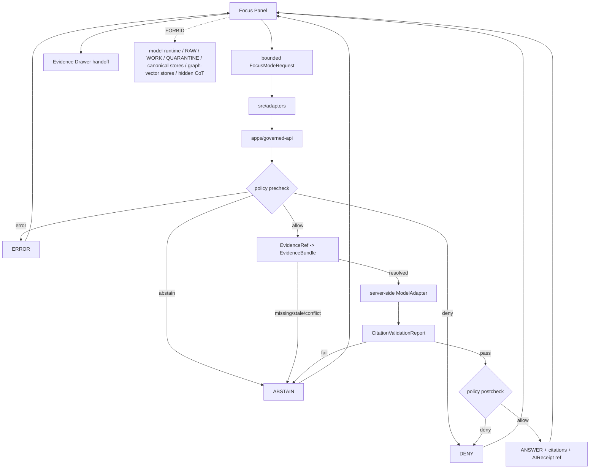

<!-- [KFM_META_BLOCK_V2]
doc_id: kfm://app/explorer-web/src/features/focus_panel/readme
title: Explorer Web Focus Panel Feature README
type: app-readme
version: v0.2
status: draft
owners: OWNER_TBD — Apps steward · UI steward · Focus Mode steward · Governed AI steward · Governed API steward · Policy steward · Evidence steward · Accessibility steward · Docs steward
created: 2026-06-16
updated: 2026-07-09
policy_label: public
related:
  - ../README.md
  - ../../README.md
  - ../../adapters/README.md
  - ../../../README.md
  - ../../../../README.md
  - ../../../../governed-api/README.md
  - ../../../../../docs/doctrine/directory-rules.md
  - ../../../../../docs/architecture/governed-ai/FOCUS_FLOW.md
  - ../../../../../docs/architecture/governed-ai/README.md
  - ../../../../../docs/architecture/ui/EVIDENCE_DRAWER.md
  - ../../../../../policy/focus/README.md
  - ../../../../../packages/ui/README.md
  - ../../../../../packages/maplibre/README.md
  - ../../../../../policy/access/README.md
  - ../../../../../policy/decision/README.md
  - ../../../../../release/README.md
  - ../../../../../data/README.md
tags: [kfm, apps, explorer-web, features, focus-panel, focus-mode, governed-ai, evidence-bounded, finite-outcomes, ai-receipt, no-browser-model]
notes:
  - "Replaces the greenfield Focus Panel feature stub with a governed feature README."
  - "Focus Panel UI features may compose bounded FocusModeRequest and RuntimeResponseEnvelope state, but they must not call model runtimes, read lifecycle/canonical stores, fabricate evidence, bypass policy, or render direct model output as truth."
  - "Feature implementation files, route wiring, tests, fixtures, governed API envelopes, FocusModeRequest/Response schemas, AIReceipt support, accessibility behavior, telemetry, and package scripts remain NEEDS VERIFICATION."
  - "policy/focus/README.md currently exists as a greenfield bundle stub; executable policy wiring remains NEEDS VERIFICATION."
  - "v0.2 refreshes the evidence basis, aligns truth posture with current GitHub evidence, adds a minimum safe implementation slice, adds runtime anti-bypass checks, and strengthens no-browser-model, no-chain-of-thought, accessibility, and telemetry review gates without claiming runtime maturity."
[/KFM_META_BLOCK_V2] -->

<a id="top"></a>

<div align="center">

# Explorer Web Focus Panel Feature

`apps/explorer-web/src/features/focus_panel/`

**App-local Explorer Web feature boundary for Focus Mode UI: bounded question entry, map/evidence scope display, finite outcome rendering, citation-linked answers, denial/abstention/error states, AIReceipt references, Evidence Drawer handoffs, accessibility, telemetry safeguards, and governed-AI request/response surfaces.**


[Evidence](#0-evidence-basis-for-this-revision) · [Purpose](#1-purpose) · [Repo fit](#2-repo-fit) · [Boundary](#3-authority-boundary) · [Inputs](#5-inputs) · [Exclusions](#6-exclusions) · [Feature map](#7-focus-panel-feature-map) · [Minimum slice](#8-minimum-safe-implementation-slice) · [Definition of done](#16-definition-of-done)

</div>

---

> [!IMPORTANT]
> **Status:** draft / `NEEDS VERIFICATION`  
> **Owners:** `OWNER_TBD` — Apps steward · UI steward · Focus Mode steward · Governed AI steward · Governed API steward · Policy steward · Evidence steward · Accessibility steward · Docs steward  
> **Path:** `apps/explorer-web/src/features/focus_panel/README.md`  
> **Responsibility root:** `apps/` — deployable application surfaces  
> **Directory Rules basis:** deployable application feature code belongs under `apps/`; Focus Panel is an app-local UI composition surface, not a browser model runtime, prompt authority, policy home, evidence store, schema home, contract home, release home, source registry, vector/graph store, or lifecycle-data lane.  
> **Truth posture:** CONFIRMED current GitHub README path / CONFIRMED parent feature-boundary README posture / CONFIRMED Focus Flow architecture doc exists / CONFIRMED Evidence Drawer architecture doc exists / CONFIRMED `policy/focus/README.md` exists as greenfield stub / PROPOSED feature contract / UNKNOWN implementation files, route wiring, tests, fixtures, schemas, package scripts, governed API envelopes, AIReceipt emission, accessibility behavior, telemetry, and runtime behavior

> [!CAUTION]
> Focus Panel is an evidence-bounded UI surface, not a browser model client and not an authority source. It must never call OpenAI, Ollama, local models, vector stores, graph stores, RAW/WORK/QUARANTINE, unpublished candidates, or canonical/internal stores directly. Focus Mode answer text is downstream of EvidenceBundle, policy, release state, citation validation, and governed envelopes.

---

## Quick jump

- [0. Evidence basis for this revision](#0-evidence-basis-for-this-revision)
- [1. Purpose](#1-purpose)
- [2. Repo fit](#2-repo-fit)
- [3. Authority boundary](#3-authority-boundary)
- [4. Default posture](#4-default-posture)
- [5. Inputs](#5-inputs)
- [6. Exclusions](#6-exclusions)
- [7. Focus Panel feature map](#7-focus-panel-feature-map)
- [8. Minimum safe implementation slice](#8-minimum-safe-implementation-slice)
- [9. Diagram](#9-diagram)
- [10. Focus Panel UI obligations](#10-focus-panel-ui-obligations)
- [11. Per-view contract](#11-per-view-contract)
- [12. Runtime anti-bypass matrix](#12-runtime-anti-bypass-matrix)
- [13. Inspection path](#13-inspection-path)
- [14. Validation expectations](#14-validation-expectations)
- [15. Safe change pattern](#15-safe-change-pattern)
- [16. Definition of done](#16-definition-of-done)
- [17. Open verification items](#17-open-verification-items)

---

## 0. Evidence basis for this revision

This README is a documentation boundary, not runtime proof. The 2026-07-09 revision updates an existing README and keeps implementation maturity bounded while aligning the feature contract with current repository evidence.

| Evidence item | Status | What it supports | What it does not prove |
|---|---|---|---|
| `apps/explorer-web/src/features/focus_panel/README.md` exists on `main`. | CONFIRMED | This is an existing README update, not a new path proposal. | It does not prove Focus components, hooks, routes, tests, fixtures, schemas, AIReceipt emission, model-adapter integration, or runtime behavior exist. |
| `apps/explorer-web/src/features/README.md` exists and defines feature modules as UI composition surfaces. | CONFIRMED | Focus Panel belongs under the Explorer Web feature boundary when it is app-local UI composition. | It does not prove Focus Panel is wired into routes or launch surfaces. |
| `docs/doctrine/directory-rules.md` confirms `apps/` as the deployable-application responsibility root. | CONFIRMED | The target path is within the correct responsibility root for app-local feature code. | It does not decide whether the feature is complete or release-ready. |
| `docs/architecture/governed-ai/FOCUS_FLOW.md` exists and defines the governed Focus path. | CONFIRMED document presence and doctrine posture | Focus Panel must remain downstream of policy, evidence, citation validation, model-adapter response, postcheck, and envelope assembly. | It does not prove implementation, schema wiring, or tests. |
| `docs/architecture/ui/EVIDENCE_DRAWER.md` exists and defines the drawer as the trust panel for evidence inspection. | CONFIRMED document presence | Focus answer citations should hand off to governed Evidence Drawer support inspection. | It does not prove Focus/Evidence Drawer integration. |
| `policy/focus/README.md` exists as a greenfield bundle stub. | CONFIRMED placeholder state | Focus policy wiring must remain `NEEDS VERIFICATION`. | It does not prove executable policy bundles or policy runtime wiring exist. |

[Back to top](#top)

---

## 1. Purpose

`apps/explorer-web/src/features/focus_panel/` is the proposed app-local feature boundary for Focus Mode source modules inside Explorer Web.

It may eventually hold route modules, panels, view models, hooks, finite-state renderers, request builders, evidence-scope summaries, answer cards, accessibility behavior, telemetry guards, and feature orchestration for:

- bounded question input tied to map, time, layer, selected feature, Evidence Drawer, domain feature, or non-map context;
- displaying `MapContextEnvelope` scope as scope only, never proof;
- submitting `FocusModeRequest` objects through the governed API;
- rendering finite outcomes: `ANSWER`, `ABSTAIN`, `DENY`, and `ERROR` where accepted by the runtime contract;
- showing cited answer text only after evidence resolution, policy precheck, model adapter response, citation validation, policy postcheck, and envelope assembly pass;
- showing denial, abstention, citation-failure, stale-evidence, conflict, schema-error, adapter-error, and infrastructure-error states without inventing fallback claims;
- linking answer spans back to Evidence Drawer and EvidenceBundle-derived support;
- surfacing `AIReceipt` references as process memory, not release proof;
- avoiding display, storage, or export of private chain-of-thought or hidden model scratchpad content;
- preserving accessibility for prompt forms, answer cards, citations, badges, keyboard flow, and non-color trust labels.

This directory is not proof that any Focus Panel component, route, hook, adapter, schema, fixture, test, package script, governed API route, AIReceipt emission, telemetry behavior, accessibility behavior, Evidence Drawer integration, or model-adapter integration is implemented.

[Back to top](#top)

---

## 2. Repo fit

| Concern | Owning root | Expected relationship |
|---|---|---|
| Focus Panel feature source | `apps/explorer-web/src/features/focus_panel/` | App-local Focus Mode UI feature modules, if implemented and tested |
| Feature boundary | `apps/explorer-web/src/features/` | Parent feature/root contract |
| Adapter boundary | `apps/explorer-web/src/adapters/` | Governed API, evidence, layer, map, export, and diagnostics adapters |
| Explorer Web app | `apps/explorer-web/` | Map-first public/semi-public shell |
| Governed API | `apps/governed-api/` | Trust membrane and normal Focus request path |
| Focus Flow architecture | `docs/architecture/governed-ai/FOCUS_FLOW.md` | Governed AI request-to-envelope doctrine |
| Evidence Drawer architecture | `docs/architecture/ui/EVIDENCE_DRAWER.md` | Evidence resolution and answer support inspection |
| Focus policy | `policy/focus/` | Current repo has greenfield stub; executable policy remains `NEEDS VERIFICATION` |
| Shared UI components | `packages/ui/` | Reusable prompt forms, outcome cards, badges, citation lists, and accessibility primitives when shared |
| Renderer wrapper | `packages/maplibre/` | Renderer behavior stays behind adapter/wrapper boundaries |
| Policy gates | `policy/` | Access, sensitivity, rights, release, and decision policy |
| Release authority | `release/` | Publication, correction, supersession, rollback control |
| Lifecycle artifacts | `data/` | Receipts, proofs, registry, catalog, triplets, published artifacts |
| Contracts and schemas | `contracts/`, `schemas/contracts/v1/` | Object meaning and machine shape; this feature references, not owns |

## 3. Authority boundary

This feature renders governed Focus Mode UI and submits bounded Focus requests. It does not own model invocation, prompt authority, hidden chain-of-thought, evidence truth, source admission, citation validation, policy decisions, release decisions, schemas, contracts, lifecycle artifacts, canonical stores, vector indexes, graph stores, renderer authority, telemetry truth, or AI output truth.

```text
apps/explorer-web/src/features/focus_panel/ = app-local Focus Mode UI feature
apps/explorer-web/src/features/             = feature boundary
apps/explorer-web/src/adapters/             = adapter boundary
apps/governed-api/                          = trust membrane and Focus request path
docs/architecture/governed-ai/FOCUS_FLOW.md = Focus Mode doctrine
docs/architecture/ui/EVIDENCE_DRAWER.md     = proof-inspection doctrine
policy/focus/                               = proposed Focus policy lane; current stub only
packages/ui/                                = shared UI primitives
packages/maplibre/                          = renderer wrapper
policy/                                     = finite policy decisions
schemas/contracts/v1/                       = machine-readable shape
contracts/                                  = object meaning
data/                                       = lifecycle artifacts, receipts, proofs, registries
release/                                    = publication, correction, rollback authority
```

## 4. Default posture

Focus Panel feature modules should fail closed, show finite bounded states, and never treat fluent generated text as authority.

A Focus view should not render a substantive answer when any of these are unresolved:

- governed API envelope and response validation;
- `FocusModeRequest` and `FocusModeResponse` schema validation;
- `RuntimeResponseEnvelope` or `DecisionEnvelope` outcome;
- bounded `question`, user role, requested transform, purpose, and scope;
- `MapContextEnvelope` time/version lock and released/review-authorized context posture;
- EvidenceRef-to-EvidenceBundle resolution;
- source role and source authority support;
- citation validation result;
- policy precheck and policy postcheck;
- rights, sensitivity, sovereignty/CARE, living-person, DNA, rare-species, archaeology, infrastructure, private-property, or other restricted-lane posture;
- release, review, correction, freshness, stale-state, or rollback posture;
- AIReceipt reference, output digest, context hash, adapter version, and citation report reference;
- safe chain-of-thought posture: no hidden reasoning, private scratchpad, provider trace, or raw prompt bundle is surfaced as public truth;
- accessibility state for keyboard, screen reader, focus, non-color labels, and reduced motion.

## 5. Inputs

| Input family | Examples | Required posture |
|---|---|---|
| Prompt state | bounded question, selected transform, answer style preference, purpose | Length-capped and schema-validated |
| Scope state | `MapContextEnvelope`, clicked feature, visible layers, time/version lock, selected evidence refs | Scope only; never proof by itself |
| API envelope | `FocusModeRequest`, `FocusModeResponse`, `RuntimeResponseEnvelope`, `DecisionEnvelope` | Runtime-validated before render |
| Evidence state | `evidence_refs[]`, bundle refs, citations, Evidence Drawer links | Required for claim-bearing answers |
| Policy state | role, rights, sensitivity, audience, release state, redaction/generalization obligations | Preserved from governed API/policy |
| Adapter state | provider label, adapter version, mock/provider mode, context hash | Server-side only; surfaced as metadata if allowed |
| Receipt state | `AIReceipt`, `CitationValidationReport`, `PolicyDecision` | Required for answer auditability |
| UI state | drafting, validating, answered, denied, abstained, error, stale, conflict, cancelled, empty | Finite and tested states |
| Accessibility state | prompt labels, keyboard path, ARIA labels, citation navigation, non-color trust badges | Required for trust-bearing Focus UI |
| Telemetry state | panel opened, request submitted, denial shown, citation opened, answer copied | Non-secret, policy-safe, no raw prompt/evidence/restricted geometry |

## 6. Exclusions

| Does not belong here | Correct home |
|---|---|
| Governed API Focus implementation | `apps/governed-api/` |
| Model adapter implementation or provider wiring | server-side governed AI runtime / adapter package — exact home `NEEDS VERIFICATION` |
| Direct browser-to-model calls | Forbidden; all model calls must be server-side behind governed API |
| EvidenceBundle construction or canonical resolver authority | `packages/evidence-resolver/`, governed API, evidence services — exact home `NEEDS VERIFICATION` |
| Citation validation implementation | governed API / validation packages, not browser UI |
| Focus policy bundles or policy decisions | `policy/focus/`, `policy/decision/`, `policy/` |
| AIReceipts and runtime receipts | `data/receipts/ai/`, `data/receipts/`, or accepted receipt home |
| Release manifests, rollback cards, correction notices | `release/`, `data/receipts/`, `data/proofs/` as accepted |
| Schemas and contracts | `schemas/contracts/v1/focus/`, `schemas/contracts/v1/runtime/`, `contracts/` |
| Renderer wrapper authority | `packages/maplibre/` |
| Shared reusable UI primitives | `packages/ui/` |
| Lifecycle artifacts, receipts, proofs, catalog, triplets | `data/` |
| RAW, WORK, QUARANTINE, unpublished candidates, canonical stores, graph/vector stores | Forbidden from browser Focus path |
| Private chain-of-thought, provider traces, hidden reasoning, or raw prompt bundles as user-facing truth | Forbidden from public Focus Panel output |
| Direct model runtime behavior | `runtime/` behind governed API only |
| Secrets, credentials, tokens, private keys | Secret manager / deployment environment |

## 7. Focus Panel feature map

Exact modules remain `NEEDS VERIFICATION`. Candidate modules should be introduced only with route inventory, fixtures, tests, and accepted contract/policy posture.

| Candidate module | Purpose | Required safeguard | Status |
|---|---|---|---|
| `focus-panel` | Shell, prompt form, answer area, finite states | Keyboard and state coverage | PROPOSED |
| `request-builder` | Build `FocusModeRequest` | Bounded scope, schema validation, no raw bundles | PROPOSED |
| `scope-summary` | Show map/time/layer/feature/evidence scope | Scope is not proof label | PROPOSED |
| `outcome-renderer` | Render `ANSWER`, `ABSTAIN`, `DENY`, `ERROR` | Closed enum coverage | PROPOSED |
| `citation-list` | Render validated citations and answer spans | Display API result; no browser validation override | PROPOSED |
| `evidence-links` | Link spans to Evidence Drawer | EvidenceBundle-derived support only | PROPOSED |
| `receipt-summary` | Show `AIReceipt` and validation refs | Process memory, not release proof | PROPOSED |
| `negative-state-panel` | Show policy deny, evidence unresolved, stale, conflict, citation fail, schema error | No fallback claims | PROPOSED |
| `sensitive-boundary` | Explain restricted lane denial safely | No exposure hints | PROPOSED |
| `telemetry-safe-events` | Record non-content UI events | No prompts, raw evidence, restricted geometry, or secrets | PROPOSED |
| `cot-guard` | Prevent hidden reasoning/provider traces from becoming UI output | No chain-of-thought display/export/storage as truth | PROPOSED |

> [!WARNING]
> Candidate module names are not implementation proof. Do not document a Focus module as runnable until files, route wiring, tests, fixtures, package scripts, governed API envelopes, AIReceipt emission, policies, schemas, and accessibility checks confirm it.

## 8. Minimum safe implementation slice

A smallest useful Focus Panel slice should prove the governed-AI trust membrane before adding advanced answer UX.

| Slice item | Minimum requirement | Why it is required |
|---|---|---|
| Bounded request contract | Question, scope, purpose, transform, audience, and time/version context are explicit | Prevents free-form browser prompting as authority |
| Envelope parser | Validate governed API envelope and finite outcome | Prevents malformed responses becoming answers |
| No-browser-model guard | Prove browser code cannot call provider SDKs, local models, or model runtimes | Preserves governed AI boundary |
| Evidence gate | Require EvidenceRef / EvidenceBundle support for claim-bearing text | Enforces cite-or-abstain |
| Citation gate | Failed citation validation renders `ABSTAIN` | Prevents uncited generated claims |
| Policy pre/post states | Render precheck and postcheck `DENY` safely | Prevents sensitive or restricted answer leakage |
| Negative states | Render denied, abstained, error, stale, conflict, schema-invalid, adapter-error, and empty states | Prevents fallback hallucination |
| AIReceipt display | Show safe AIReceipt reference and digest metadata where allowed | Makes process memory inspectable without making it proof |
| Chain-of-thought guard | Never show/export hidden reasoning, private scratchpads, or provider traces as truth | Preserves AI boundary and user trust |
| Evidence Drawer handoff | Link answer spans/citations to governed Evidence Drawer support | Keeps evidence inspectable at point of use |
| Accessibility path | Keyboard, focus, ARIA labels, non-color status, reduced-motion behavior | Makes AI trust usable |
| Telemetry guard | Emit non-secret event metadata only | Prevents logs from capturing prompts, evidence, restricted geometry, or secrets |
| Lifecycle denial test | Prove browser code does not import/read lifecycle roots, canonical stores, vector stores, or graph stores | Preserves public-client boundary |

This slice is still `PROPOSED` until files, fixtures, tests, route wiring, and accepted contracts are verified.

## 9. Diagram



## 10. Focus Panel UI obligations

| Obligation | Example effect |
|---|---|
| `governed_api_only` | Focus request goes through governed API envelopes |
| `no_browser_model_client` | Browser never calls OpenAI, Ollama, local provider, vector store, graph store, or any model runtime directly |
| `scope_not_proof` | Map camera, layers, clicked features, and UI selections scope the request but do not prove claims |
| `evidence_required` | Claim-bearing answer text requires resolved EvidenceBundle support |
| `citation_validation_required` | Failed citation validation renders `ABSTAIN`, not a partial answer |
| `policy_pre_and_postcheck` | Policy runs before evidence/model and again after generation |
| `finite_states_required` | `ANSWER`, `ABSTAIN`, `DENY`, and `ERROR` are explicit UI states |
| `ai_receipt_ref_required` | Answer surfaces include an AIReceipt reference when provided; receipt is process memory, not release proof |
| `no_chain_of_thought_surface` | Hidden reasoning, provider traces, and private scratchpad content are not displayed, exported, or treated as truth |
| `telemetry_safe` | Telemetry records UI behavior only, never raw prompts, raw evidence, restricted geometry, hidden reasoning, or secrets |
| `accessibility_required` | Prompt, denial, citation, and receipt states are available without mouse or color-only cues |
| `no_authority_fork` | Feature code does not redefine evidence, citation, policy, release, schema, contract, model, or runtime authority |

## 11. Per-view contract

Every long-lived Focus Panel view should document or encode:

- prompt, transform, purpose, audience, and scope controls;
- governed API envelope dependency;
- `FocusModeRequest`, `FocusModeResponse`, and runtime envelope schema dependency;
- finite outcomes and negative state behavior;
- EvidenceRef, EvidenceBundle, citation, policy, release, review, correction, and limitation behavior;
- AIReceipt reference behavior and safe receipt display;
- sensitive-lane denial and no-exposure-hint behavior;
- hidden chain-of-thought / provider trace denial behavior;
- loading, validating, answered, denied, abstained, stale, conflict, citation-failed, schema-error, adapter-error, cancelled, empty, and error states;
- Evidence Drawer handoff behavior;
- telemetry behavior, if present;
- accessibility behavior for keyboard, screen reader, focus management, reduced motion, and non-color trust badges;
- tests and fixtures proving trust-membrane, evidence, citation, policy, model-adapter, receipt, telemetry, no-chain-of-thought, and accessibility boundaries.

## 12. Runtime anti-bypass matrix

| Bypass risk | Required behavior | Review signal |
|---|---|---|
| Browser calls model/provider directly | Deny at import/build/test review; route through governed API | No provider SDK/model runtime imports in browser feature |
| Browser reads lifecycle/canonical data directly | Deny at import/build/test review; route through governed API | No direct `data/`, canonical, graph, or vector-store imports/fetches |
| Map scope treated as proof | Use only as request scope; resolve claims through evidence | MapContextEnvelope fixture cannot render answer alone |
| Generated text treated as authority | Require evidence, citation, policy, and envelope support | No answer fixture without citations and evidence support |
| Citation validation fails | Render `ABSTAIN`; no partial answer | Citation-failed fixture exists |
| Policy postcheck denies generated answer | Render `DENY`; no answer text leakage | Postcheck-denied fixture hides sensitive detail |
| Hidden chain-of-thought leaks | Do not render/export/store provider scratchpad as truth | No UI field for hidden reasoning/provider trace |
| AIReceipt treated as release proof | Show as process memory only; release state remains separate | Receipt label is not publication proof |
| Telemetry captures prompt/evidence | Emit non-secret event metadata only | Telemetry fixture excludes raw prompts, raw evidence, restricted geometry, hidden reasoning, and secrets |

## 13. Inspection path

Focus Panel implementation files, route wiring, tests, fixtures, governed API envelopes, schema bindings, AIReceipt emission, accessibility behavior, telemetry, package scripts, no-browser-model checks, no-chain-of-thought checks, and Evidence Drawer handoffs remain `NEEDS VERIFICATION`.

```bash
find apps/explorer-web/src/features/focus_panel -maxdepth 5 -type f | sort
find apps/explorer-web/src apps/governed-api docs/architecture/governed-ai docs/architecture/ui packages/ui packages/maplibre schemas contracts policy release data tests fixtures -maxdepth 6 -type f 2>/dev/null | grep -Ei 'focus|FocusModeRequest|FocusModeResponse|RuntimeResponseEnvelope|DecisionEnvelope|MapContextEnvelope|EvidenceBundle|EvidenceRef|AIReceipt|CitationValidationReport|PolicyDecision|model.?adapter|governed.?ai|citation|release|rollback|chain|thought|cot|telemetry|a11y|accessibility' | sort
find data/raw data/work data/quarantine data/processed data/catalog data/triplets data/published data/receipts data/proofs -maxdepth 2 -type f 2>/dev/null | sort
```

## 14. Validation expectations

Useful validation for this feature boundary should cover:

- no Focus Panel feature imports or reads lifecycle/canonical data roots directly;
- no browser-side model runtime calls, provider SDK use, local model calls, vector store calls, or graph store calls;
- Focus requests consume governed API envelopes only;
- malformed requests render `ERROR`, never partial answers;
- policy precheck denial renders `DENY` before evidence/model processing;
- missing, stale, conflicting, or unresolved evidence renders `ABSTAIN`;
- adapter contract violations render `ERROR`;
- failed citation validation renders `ABSTAIN`;
- policy postcheck denial renders `DENY` after generation without leaking sensitive generated text;
- every `ANSWER` preserves citations, Evidence Drawer links, policy state, limitation fields, release/review state, and AIReceipt reference;
- AIReceipt is labeled as process memory, not publication proof;
- hidden chain-of-thought, provider traces, and raw prompt bundles are not rendered, exported, or logged as truth;
- telemetry never includes raw prompt text, raw evidence, restricted geometry, hidden reasoning, secrets, or full bundle copies;
- accessibility tests cover prompt labels, keyboard, focus management, screen-reader labels, reduced motion, and non-color trust badges.

## 15. Safe change pattern

For Focus Panel feature changes:

1. Add or update route inventory and per-view contract.
2. Add fixtures for `ANSWER`, `ABSTAIN`, `DENY`, `ERROR`, policy-denied, postcheck-denied, evidence-unresolved, evidence-stale, source-conflict, citation-failed, schema-invalid, adapter-error, no-browser-model, chain-of-thought-denied, telemetry-denied, loading, cancelled, and empty states.
3. Test lifecycle/canonical-data denial, no-browser-model behavior, no-chain-of-thought behavior, and governed API-only behavior.
4. Preserve evidence refs, citations, policy state, release state, limitations, AIReceipt refs, and Evidence Drawer links through UI state.
5. Test keyboard/screen-reader/reduced-motion paths before claiming trust-bearing Focus usability.
6. Update this README, parent `features/README.md`, Focus Flow architecture docs, Evidence Drawer docs, focus policy docs, and parent app README when public behavior changes.

## 16. Definition of done

- [ ] Owners are confirmed and `OWNER_TBD` is replaced.
- [ ] Evidence basis is refreshed when parent README, Focus Flow docs, Evidence Drawer docs, focus policy, governed API, schema, release, telemetry, receipt, or fixture evidence changes.
- [ ] Focus Panel feature file inventory and route ownership are documented.
- [ ] Governed API and adapter dependencies are explicit.
- [ ] `FocusModeRequest` / `FocusModeResponse` schema binding is verified.
- [ ] `RuntimeResponseEnvelope` and finite outcomes are represented in UI fixtures.
- [ ] Direct lifecycle/canonical-data import/read checks are covered.
- [ ] Browser model-runtime/provider/vector/graph denial is tested.
- [ ] Evidence unresolved, policy denied, citation failed, postcheck denied, and adapter-error states are tested.
- [ ] Hidden chain-of-thought/provider-trace denial posture is tested.
- [ ] `AIReceipt`, citation, policy, limitation, release/review state, and Evidence Drawer links are preserved on success.
- [ ] Telemetry is tested as non-secret and policy-safe if present.
- [ ] Accessibility behavior is tested for keyboard, focus, ARIA, reduced motion, and non-color badges.

## 17. Open verification items

| Item | Why it matters |
|---|---|
| Confirm Focus Panel implementation files beyond README | Prevents overclaiming feature maturity |
| Confirm route inventory and launch surfaces | Required for public/semi-public UI boundary review |
| Confirm governed API Focus endpoint or equivalent | Required for trust membrane enforcement |
| Confirm Focus request/response schemas and fixtures | Required before claim-bearing Focus UI claims |
| Confirm `policy/focus/` executable bundle beyond stub | Required before policy wiring claims |
| Confirm AIReceipt emission and safe receipt display | Required before answer audit claims |
| Confirm no-browser-model tests | Required to protect the trust membrane |
| Confirm no-chain-of-thought/provider-trace tests | Required to prevent hidden reasoning from becoming UI truth |
| Confirm Evidence Drawer handoff | Required before answer-support inspection claims |
| Confirm accessibility tests | Required because AI trust signals must be accessible |
| Confirm telemetry is safe and non-secret | Required before diagnostics/observability claims |
| Confirm package scripts beyond TODO | Required before build/test claims |
| Confirm architecture-doc links and relative paths after recursive inventory | Required before treating all related paths as current implementation evidence |

<details>
<summary>Appendix A — no-loss preservation note</summary>

The previous README already contained a strong governed Focus Panel feature contract. This revision preserves that contract, refreshes metadata, adds a current evidence-basis section, strengthens no-browser-model, no-chain-of-thought, telemetry, accessibility, and anti-bypass safeguards, and keeps implementation claims bounded. It does not claim Focus components, routes, hooks, adapters, fixtures, tests, package scripts, governed API envelopes, schemas, AIReceipt emission, accessibility behavior, telemetry, Evidence Drawer handoff, model-adapter integration, vector/graph integration, or runtime behavior are implemented.

</details>

## Status summary

`apps/explorer-web/src/features/focus_panel/` should contain Focus Panel feature modules only after route contracts, governed API envelopes, schema bindings, negative-state fixtures, no-browser-model tests, no-chain-of-thought tests, AIReceipt support, accessibility tests, telemetry constraints, and Evidence Drawer handoffs are verified.

It must preserve the trust membrane and governed-AI boundary: Focus Panel may request and display governed AI outputs, but it must not call model runtimes, invent evidence, emit uncited claims, bypass policy, package unreleased content, hide citation failures, expose hidden reasoning, treat fluent generated text as authority, persist private chain-of-thought as truth, or become a direct model-output surface.

<p align="right"><a href="#top">Back to top</a></p>
