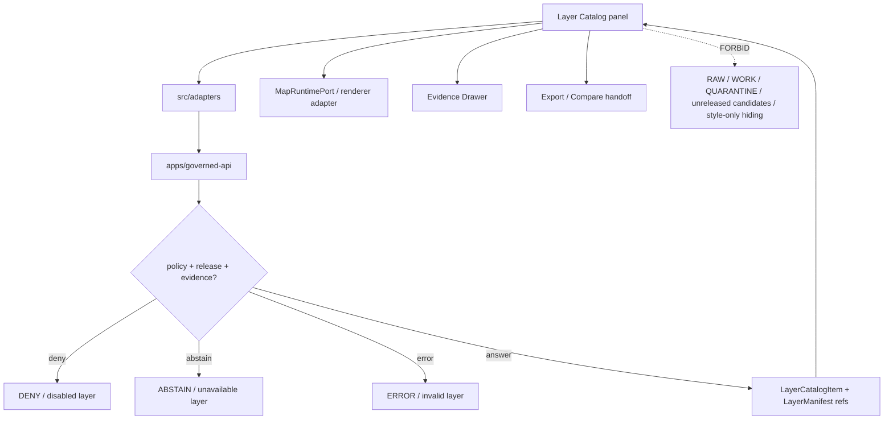

<!-- [KFM_META_BLOCK_V2]
doc_id: kfm://app/explorer-web/src/features/layer_catalog/readme
title: Explorer Web Layer Catalog Feature README
type: app-readme
version: v0.1
status: draft
owners: OWNER_TBD — Apps steward · UI steward · Layer steward · Map steward · Governed API steward · Policy steward · Release steward · Docs steward
created: 2026-06-16
updated: 2026-06-16
policy_label: public
related:
  - ../README.md
  - ../../README.md
  - ../../adapters/README.md
  - ../../../README.md
  - ../../../../README.md
  - ../../../../governed-api/README.md
  - ../../../../../docs/architecture/ui/README.md
  - ../../../../../docs/architecture/ui/LAYERING.md
  - ../../../../../docs/architecture/ui/EVIDENCE_DRAWER.md
  - ../../../../../docs/architecture/ui/COMPARE_AND_EXPORT.md
  - ../../../../../policy/layers/README.md
  - ../../../../../packages/ui/README.md
  - ../../../../../packages/maplibre/README.md
  - ../../../../../policy/access/README.md
  - ../../../../../policy/decision/README.md
  - ../../../../../release/README.md
  - ../../../../../data/README.md
tags: [kfm, apps, explorer-web, features, layer-catalog, layers, layer-manifest, layer-descriptor, trust-badges, map-first]
notes:
  - "Replaces the greenfield Layer Catalog feature stub with a governed feature README."
  - "Layer Catalog UI features may render released or bounded-safe layer listings and trust badges, but they must not publish layers, load unreleased tiles, hide sensitive geometry with style filters, or treat renderer/source properties as truth."
  - "Feature implementation files, route wiring, tests, fixtures, governed API envelopes, layer schema bindings, policy/layers wiring, accessibility behavior, telemetry, and package scripts remain NEEDS VERIFICATION."
  - "policy/layers/README.md exists as a greenfield bundle stub in this pass; executable layer policy remains NEEDS VERIFICATION."
[/KFM_META_BLOCK_V2] -->

<a id="top"></a>

<div align="center">

# Explorer Web Layer Catalog Feature

`apps/explorer-web/src/features/layer_catalog/`

**App-local Explorer Web feature boundary for governed layer discovery: released layer catalog listings, layer trust badges, legends, filter/search state, manifest summaries, finite layer states, Evidence Drawer launch points, Compare/Export handoffs, and release-aware map-layer selection.**


[Purpose](#1-purpose) · [Repo fit](#2-repo-fit) · [Boundary](#3-authority-boundary) · [Inputs](#5-inputs) · [Exclusions](#6-exclusions) · [Feature map](#7-layer-catalog-feature-map) · [Definition of done](#14-definition-of-done)

</div>

---

> [!IMPORTANT]
> **Status:** draft / `NEEDS VERIFICATION`  
> **Owners:** `OWNER_TBD` — Apps steward · UI steward · Layer steward · Map steward · Governed API steward · Policy steward · Release steward · Docs steward  
> **Path:** `apps/explorer-web/src/features/layer_catalog/README.md`  
> **Responsibility root:** `apps/` — deployable application surfaces  
> **Truth posture:** CONFIRMED README path / CONFIRMED UI layering doctrine / PROPOSED feature contract / UNKNOWN implementation files, route wiring, tests, fixtures, schemas, and runtime behavior

> [!CAUTION]
> The Layer Catalog is a discovery and selection surface, not a publication gate, evidence resolver, policy engine, style-based redaction system, or renderer authority. A layer may be listed or toggled only when its governed release, manifest, evidence, rights, sensitivity, review, freshness, and rollback posture allow that surface.

---

## Quick jump

- [1. Purpose](#1-purpose)
- [2. Repo fit](#2-repo-fit)
- [3. Authority boundary](#3-authority-boundary)
- [4. Default posture](#4-default-posture)
- [5. Inputs](#5-inputs)
- [6. Exclusions](#6-exclusions)
- [7. Layer Catalog feature map](#7-layer-catalog-feature-map)
- [8. Diagram](#8-diagram)
- [9. Layer Catalog UI obligations](#9-layer-catalog-ui-obligations)
- [10. Per-view contract](#10-per-view-contract)
- [11. Inspection path](#11-inspection-path)
- [12. Validation expectations](#12-validation-expectations)
- [13. Safe change pattern](#13-safe-change-pattern)
- [14. Definition of done](#14-definition-of-done)
- [15. Open verification items](#15-open-verification-items)

---

## 1. Purpose

`apps/explorer-web/src/features/layer_catalog/` is the proposed app-local feature boundary for Layer Catalog source modules inside Explorer Web.

It may eventually hold route modules, panels, view models, hooks, finite-state renderers, filter/search controls, trust-badge components, layer-card state, and feature orchestration for:

- listing released or bounded-safe layers returned by governed API layer catalog endpoints;
- rendering `LayerCatalogItem`, `LayerDescriptor`, `LayerManifest`, `KFMGeoManifest`, and legend summaries where verified;
- showing source role, rights, sensitivity, review, release, freshness, stale/degraded state, correction lineage, and rollback posture at the point of layer selection;
- blocking unreleased, denied, abstained, stale-without-alternative, invalid, or sensitive-without-transform layers from normal public loading;
- launching the Evidence Drawer from layer cards, trust badges, and selected features;
- handing selected released layer state to Compare, Export, Story, and Focus Mode without bypassing the trust membrane;
- preserving accessibility for search, filters, badge labels, keyboard layer toggles, reduced motion, and non-color trust indicators.

This directory is not proof that any Layer Catalog component, route, hook, adapter, schema, fixture, test, package script, governed API route, or accessibility behavior is implemented.

[Back to top](#top)

---

## 2. Repo fit

| Concern | Owning root | Expected relationship |
|---|---|---|
| Layer Catalog feature source | `apps/explorer-web/src/features/layer_catalog/` | App-local catalog feature modules, if implemented and tested |
| Feature boundary | `apps/explorer-web/src/features/` | Parent feature/root contract |
| Adapter boundary | `apps/explorer-web/src/adapters/` | Governed API, evidence, layer, map, export, and diagnostics adapters |
| Explorer Web app | `apps/explorer-web/` | Map-first public/semi-public shell |
| Governed API | `apps/governed-api/` | Trust membrane and normal layer-manifest path |
| Layering architecture | `docs/architecture/ui/LAYERING.md` | Layer semantics, object families, lifecycle, and policy posture |
| UI architecture | `docs/architecture/ui/README.md` | UI subsystem doctrine and feature-surface posture |
| Layer policy | `policy/layers/` | Current repo has greenfield stub; executable policy remains `NEEDS VERIFICATION` |
| Shared UI components | `packages/ui/` | Reusable cards, badges, filters, accordions, tables, legends, and accessibility primitives when shared |
| Renderer wrappers | `packages/maplibre/`, `packages/cesium/` | Renderer behavior stays behind adapter/wrapper boundaries |
| Policy gates | `policy/` | Access, sensitivity, rights, release, and decision policy |
| Release authority | `release/` | Publication, correction, supersession, rollback control |
| Lifecycle artifacts | `data/` | Receipts, proofs, registry, catalog, triplets, published artifacts |

## 3. Authority boundary

This feature renders governed Layer Catalog UI and selected-layer state. It does not own layer publication, evidence truth, source admission, citation validation, policy decisions, sensitivity transforms, release decisions, schemas, contracts, lifecycle artifacts, renderer authority, tile hosting authority, telemetry truth, or AI output.

```text
apps/explorer-web/src/features/layer_catalog/ = app-local Layer Catalog UI feature
apps/explorer-web/src/features/               = feature boundary
apps/explorer-web/src/adapters/               = adapter boundary
apps/governed-api/                            = trust membrane and layer manifest path
docs/architecture/ui/LAYERING.md              = layer semantics and lifecycle doctrine
policy/layers/                                = proposed layer admissibility policy; current stub only
packages/ui/                                  = shared UI primitives
packages/maplibre/                            = renderer wrapper boundary
policy/                                       = finite policy decisions
data/                                         = lifecycle artifacts, receipts, proofs, registries
release/                                      = publication, correction, rollback authority
```

## 4. Default posture

Layer Catalog feature modules should fail closed, render finite layer states, and never allow layer selection to become publication.

A catalog view should not list, enable, load, compare, export, or Focus-scope a claim-bearing layer when any of these are unresolved:

- governed API envelope and response validation;
- `LayerCatalogItem`, `LayerDescriptor`, `LayerManifest`, `KFMGeoManifest`, or `LegendDescriptor` schema validation;
- source role, source authority, source rights, and license posture;
- EvidenceRef resolvability and EvidenceBundle support;
- citation, proof, catalog, registry, or manifest integrity state;
- rights, sensitivity, CARE/sovereignty, review, freshness, correction, release, and rollback posture;
- geometry transform, redaction, aggregation, generalization, delayed-release, or denial state for sensitive layers;
- release manifest, promotion decision, rollback target, and correction lineage;
- renderer support, plugin-admission state, tile/raster digest, style manifest, or asset URL integrity;
- accessibility state for keyboard toggles, screen readers, non-color trust badges, and reduced motion.

## 5. Inputs

| Input family | Examples | Required posture |
|---|---|---|
| Catalog item | layer title, domain, summary, scale range, source role, tags, trust badges | Governed API projection only |
| Layer descriptor | renderer-facing layer/source refs, style refs, asset refs, release refs | Validated before adapter receives it |
| Layer manifest | valid time, freshness, provenance, release state, evidence refs, policy labels | Required for released layer display |
| Geo manifest | PMTiles, COG, GeoParquet, MVT, MLT, 3D Tiles, Zarr candidate/released artifact refs | Digest/signature state visible where material |
| Legend state | classes, colorbar, units, scale dependencies, uncertainty, limitations | Evidence-aware and accessible |
| Policy state | rights, sensitivity, review, CARE/sovereignty, release, correction, denial reason | Text labels required; color is secondary |
| UI state | search, filter, group, selected layer, enabled/disabled, stale/degraded/denied/abstain/error | Finite and tested states |
| Handoff state | selected layer refs to map adapter, Evidence Drawer, Compare, Export, Focus, Story | Governed refs only; no raw layer data |

## 6. Exclusions

| Does not belong here | Correct home |
|---|---|
| Governed API layer catalog / manifest implementation | `apps/governed-api/` |
| Layer publication, promotion, release, rollback decisions | `release/` |
| Layer policy bundles or policy decisions | `policy/layers/`, `policy/decision/`, `policy/` |
| Layer schemas and contracts | `schemas/contracts/v1/layers/`, `schemas/contracts/v1/evidence/`, `contracts/` |
| Source descriptors, catalogs, registries, and source acquisition | `data/registry/`, `data/catalog/`, `connectors/` |
| EvidenceBundle construction or canonical resolver authority | `packages/evidence-resolver/`, governed API, evidence services — exact home `NEEDS VERIFICATION` |
| Renderer implementation and plugin imports | `packages/maplibre/`, `packages/maplibre-runtime/`, `packages/cesium/` as accepted |
| Shared reusable UI primitives | `packages/ui/` |
| Lifecycle artifacts, receipts, proofs, published layer artifacts | `data/` |
| Sensitive-geometry hiding by style filters | Forbidden; use policy-backed transform/generalize/delay/redact/deny before public tile generation |
| RAW, WORK, QUARANTINE, unpublished candidates, canonical stores, graph/vector stores | Forbidden from browser Layer Catalog path |
| Direct model runtime behavior | `runtime/` behind governed API only |
| Secrets, credentials, tokens, private keys | Secret manager / deployment environment |

## 7. Layer Catalog feature map

Exact modules remain `NEEDS VERIFICATION`. Candidate modules should be introduced only with route inventory, fixtures, and tests.

| Candidate module | Purpose | Required safeguard | Status |
|---|---|---|---|
| `layer-catalog-panel` | Catalog shell, search, filter, group, and layer list | Governed catalog projection only | PROPOSED |
| `layer-card` | Per-layer title, summary, domain, source role, enabled state | Manifest and release refs required | PROPOSED |
| `trust-badges` | Rights, sensitivity, review, freshness, release, correction, source role | Text/ARIA labels required | PROPOSED |
| `legend-summary` | Layer legend, units, scale, uncertainty, limitations | Accessible, evidence-aware legend | PROPOSED |
| `layer-state-renderer` | Released, stale, degraded, denied, abstain, error, withdrawn | Finite state coverage | PROPOSED |
| `manifest-summary` | LayerManifest/KFMGeoManifest refs, hashes, release ids | No raw artifact display | PROPOSED |
| `evidence-launch` | Open Evidence Drawer from catalog card/badge | EvidenceBundle-derived support only | PROPOSED |
| `map-toggle` | Enable/disable layer through adapter boundary | Validated LayerDescriptor only | PROPOSED |
| `compare-export-handoff` | Pass selected released layer refs to Compare/Export | Release refs and citations preserved | PROPOSED |
| `telemetry-safe-events` | Record non-content UI events | No raw layer payloads or restricted geometry | PROPOSED |

> [!WARNING]
> Candidate module names are not implementation proof. Do not document a Layer Catalog module as runnable until files, route wiring, tests, fixtures, package scripts, governed API envelopes, layer schemas, and policy gates confirm it.

## 8. Diagram



## 9. Layer Catalog UI obligations

| Obligation | Example effect |
|---|---|
| `governed_api_only` | Catalog state comes through governed API envelopes |
| `released_layers_only` | Normal public selection uses released or release-equivalent layer manifests only |
| `layer_is_derived_surface` | Layer cards do not claim source truth or policy authority |
| `trust_badges_visible` | Source role, freshness, review, rights, sensitivity, release, and correction state are visible at point of use |
| `no_style_filter_redaction` | Sensitive geometry is transformed/generalized/delayed/redacted/denied before public tiles, not hidden by style |
| `finite_states_required` | Released, stale, degraded, denied, abstain, error, withdrawn, and rolled-back states are explicit |
| `map_adapter_boundary` | Feature code passes validated descriptors to adapter; it does not import renderer APIs directly |
| `evidence_drawer_launch` | Material claims open the Evidence Drawer rather than relying on popups or badges alone |
| `safe_handoffs` | Compare, Export, Story, and Focus receive governed layer refs, not raw layer payloads |
| `no_authority_fork` | Feature code does not redefine layer schema, policy, evidence, release, renderer, or source authority |

## 10. Per-view contract

Every long-lived Layer Catalog view should document or encode:

- catalog endpoint or governed API envelope dependency;
- layer object families consumed;
- finite layer states and negative-state behavior;
- source-role, rights, sensitivity, review, freshness, release, correction, and rollback badge behavior;
- manifest, digest, signature, artifact, style, and legend behavior;
- layer enable/disable behavior through the renderer adapter boundary;
- Evidence Drawer, Compare, Export, Story, and Focus handoff behavior;
- loading, empty, stale, degraded, denied, abstained, invalid, withdrawn, rolled-back, and error states;
- accessibility behavior for search, filters, cards, legends, toggles, screen readers, reduced motion, and non-color trust badges;
- tests and fixtures proving trust-membrane, layer-release, sensitive-geometry, renderer-boundary, handoff, and accessibility constraints.

## 11. Inspection path

Layer Catalog implementation files, route wiring, tests, fixtures, governed API envelopes, schema bindings, layer policy gates, accessibility behavior, telemetry, package scripts, and handoffs remain `NEEDS VERIFICATION`.

```bash
find apps/explorer-web/src/features/layer_catalog -maxdepth 5 -type f | sort
find apps/explorer-web/src apps/governed-api docs/architecture/ui packages/ui packages/maplibre packages/maplibre-runtime schemas contracts policy release data tests fixtures -maxdepth 6 -type f 2>/dev/null | grep -Ei 'layer.?catalog|LayerCatalogItem|LayerDescriptor|LayerManifest|KFMGeoManifest|LegendDescriptor|MapReleaseManifest|LayerManifest|ReleaseManifest|PolicyDecision|EvidenceBundle|EvidenceRef|trust.?badge|legend|mapruntime|maplibre|release|rollback|redaction|accessibility|a11y' | sort
find data/raw data/work data/quarantine data/processed data/catalog data/triplets data/published data/receipts data/proofs -maxdepth 2 -type f 2>/dev/null | sort
```

## 12. Validation expectations

Useful validation for this feature boundary should cover:

- no Layer Catalog feature imports or reads lifecycle/canonical data roots directly;
- no direct renderer API imports from feature code;
- catalog state consumes governed API envelopes only;
- malformed layer catalog payloads render `ERROR`, never partial layer toggles;
- unreleased or missing-ReleaseManifest layers render `DENY` or `ABSTAIN` and cannot load;
- stale, degraded, withdrawn, corrected, and rolled-back states remain visible;
- sensitive geometry cannot be made public by style filters or client-side hiding;
- trust badges preserve text labels and ARIA labels for source role, rights, sensitivity, review, freshness, release, correction, and policy state;
- Evidence Drawer launches from material claims and badges; popups do not substitute for evidence resolution;
- Compare, Export, Story, and Focus handoffs carry governed refs, release refs, and evidence refs only.

## 13. Safe change pattern

For Layer Catalog feature changes:

1. Add or update route inventory and per-view contract.
2. Add fixtures for released, stale, degraded, denied, abstained, error, withdrawn, rolled-back, corrected, loading, empty, sensitive-generalized, and sensitive-denied states.
3. Test lifecycle/canonical-data denial, renderer-boundary behavior, and governed API-only behavior.
4. Preserve layer refs, evidence refs, release refs, policy state, source role, rights, sensitivity, review, freshness, correction, rollback, and legend metadata through UI state.
5. Test keyboard/screen-reader/reduced-motion paths before claiming trust-bearing catalog usability.
6. Update this README, parent `features/README.md`, Layering architecture docs, and parent app README when public behavior changes.

## 14. Definition of done

- [ ] Owners are confirmed and `OWNER_TBD` is replaced.
- [ ] Layer Catalog feature file inventory and route ownership are documented.
- [ ] Governed API and adapter dependencies are explicit.
- [ ] `LayerCatalogItem`, `LayerDescriptor`, and `LayerManifest` schema bindings are verified.
- [ ] Layer finite states and negative states are represented in UI fixtures.
- [ ] Direct lifecycle/canonical-data import/read checks are covered.
- [ ] Direct renderer import denial is tested.
- [ ] Sensitive-geometry style-filter denial is tested.
- [ ] Evidence Drawer, Compare, Export, Story, and Focus handoffs are tested for safe governed refs.
- [ ] Accessibility behavior is tested for keyboard, focus, ARIA, reduced motion, legends, filters, and non-color badges.

## 15. Open verification items

| Item | Why it matters |
|---|---|
| Confirm Layer Catalog implementation files beyond README | Prevents overclaiming feature maturity |
| Confirm route inventory and launch surfaces | Required for public/semi-public UI boundary review |
| Confirm governed API layer catalog / manifest endpoint | Required for trust membrane enforcement |
| Confirm layer schemas and fixtures | Required before claim-bearing layer UI claims |
| Confirm `policy/layers/` executable bundle beyond stub | Required before layer admissibility claims |
| Confirm renderer adapter import allowlist | Required to protect the MapRuntime boundary |
| Confirm sensitive-geometry negative tests | Required to prevent style-filter leakage |
| Confirm Evidence Drawer / Compare / Export / Focus handoffs | Required before downstream workflow claims |
| Confirm accessibility tests | Required because layer trust signals must be accessible |
| Confirm telemetry is safe and non-secret | Required before diagnostics/observability claims |
| Confirm package scripts beyond TODO | Required before build/test claims |

<details>
<summary>Appendix A — no-loss preservation note</summary>

The previous README was a greenfield stub. This replacement adds a bounded Layer Catalog feature contract without claiming catalog components, routes, hooks, adapters, fixtures, tests, package scripts, governed API envelopes, schemas, layer policy, accessibility behavior, telemetry, renderer integration, or downstream handoffs are implemented.

</details>

## Status summary

`apps/explorer-web/src/features/layer_catalog/` should contain Layer Catalog feature modules only after route contracts, governed API envelopes, schema bindings, negative-state fixtures, renderer-boundary tests, layer-policy support, accessibility tests, telemetry constraints, and downstream handoffs are verified.

It must preserve the trust membrane and layer-boundary posture: Layer Catalog may show released layer metadata, trust badges, manifests, legends, and governed selection state, but it must not publish, load unreleased artifacts, hide sensitive geometry with style filters, read lifecycle/canonical stores, bypass the renderer adapter, bypass policy, substitute popups for evidence, or become a direct model-output surface.

<p align="right"><a href="#top">Back to top</a></p>
