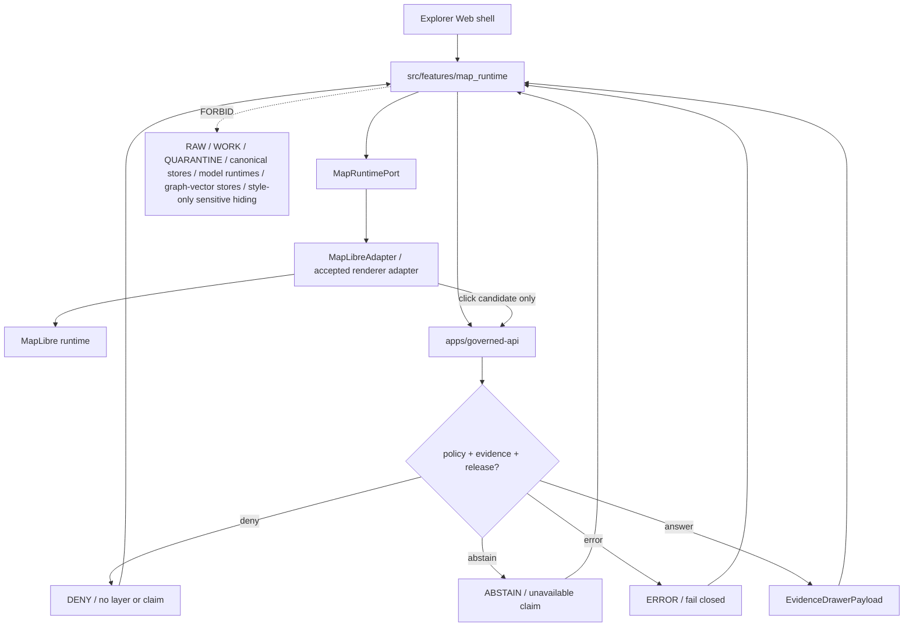

<!-- [KFM_META_BLOCK_V2]
doc_id: kfm://app/explorer-web/src/features/map_runtime/readme
title: Explorer Web Map Runtime Feature README
type: app-readme
version: v0.2
status: draft
owners: OWNER_TBD — Apps steward · UI steward · Map steward · MapLibre runtime steward · Governed API steward · Policy steward · Release steward · Accessibility steward · Docs steward
created: 2026-06-16
updated: 2026-07-09
policy_label: public
related:
  - ../README.md
  - ../../README.md
  - ../../adapters/README.md
  - ../../../README.md
  - ../../../../README.md
  - ../../../../governed-api/README.md
  - ../../../../../docs/doctrine/directory-rules.md
  - ../../../../../docs/architecture/ui/README.md
  - ../../../../../docs/architecture/ui/MAP_RUNTIME_BOUNDARY.md
  - ../../../../../docs/architecture/ui/LAYERING.md
  - ../../../../../docs/architecture/ui/EVIDENCE_DRAWER.md
  - ../../../../../packages/ui/README.md
  - ../../../../../packages/maplibre/README.md
  - ../../../../../packages/maplibre-runtime/README.md
  - ../../../../../policy/layers/README.md
  - ../../../../../policy/access/README.md
  - ../../../../../policy/decision/README.md
  - ../../../../../release/README.md
  - ../../../../../data/README.md
tags: [kfm, apps, explorer-web, features, map-runtime, mapruntimeport, maplibreadapter, maplibre, renderer-boundary, trust-membrane, click-resolution]
notes:
  - "Replaces the greenfield Map Runtime feature stub with a governed feature README."
  - "Map Runtime UI features may compose the browser-side map port and adapter boundary, but they must not become evidence resolver, policy engine, source registry, publication authority, citation authority, AI authority, lifecycle storage, or raw/canonical data path."
  - "Feature implementation files, route wiring, tests, fixtures, MapRuntimePort contracts, MapLibreAdapter import allowlist, governed API envelopes, accessibility behavior, telemetry, and package scripts remain NEEDS VERIFICATION."
  - "packages/maplibre/README.md exists as a bounded helper-package README; packages/maplibre-runtime/README.md was not found on main during this revision, so runtime-package specifics remain NEEDS VERIFICATION."
  - "v0.2 refreshes the evidence basis, aligns truth posture with current GitHub evidence, adds a minimum safe implementation slice, adds runtime anti-bypass checks, and strengthens renderer-boundary, click-candidate, style-redaction, accessibility, and telemetry review gates without claiming runtime maturity."
[/KFM_META_BLOCK_V2] -->

<a id="top"></a>

<div align="center">

# Explorer Web Map Runtime Feature

`apps/explorer-web/src/features/map_runtime/`

**App-local Explorer Web feature boundary for the map runtime seam: `MapRuntimePort`, renderer-adapter handoff, validated layer loading, camera/time synchronization, click-candidate forwarding, negative map states, accessibility-safe map controls, telemetry safeguards, and trust-preserving interaction events.**


[Evidence](#0-evidence-basis-for-this-revision) · [Purpose](#1-purpose) · [Repo fit](#2-repo-fit) · [Boundary](#3-authority-boundary) · [Inputs](#5-inputs) · [Exclusions](#6-exclusions) · [Feature map](#7-map-runtime-feature-map) · [Minimum slice](#8-minimum-safe-implementation-slice) · [Definition of done](#16-definition-of-done)

</div>

---

> [!IMPORTANT]
> **Status:** draft / `NEEDS VERIFICATION`  
> **Owners:** `OWNER_TBD` — Apps steward · UI steward · Map steward · MapLibre runtime steward · Governed API steward · Policy steward · Release steward · Accessibility steward · Docs steward  
> **Path:** `apps/explorer-web/src/features/map_runtime/README.md`  
> **Responsibility root:** `apps/` — deployable application surfaces  
> **Directory Rules basis:** deployable application feature code belongs under `apps/`; Map Runtime is an app-local UI composition and renderer-port surface, not a renderer package, evidence resolver, policy home, schema home, contract home, publication authority, source registry, AI runtime, tile host, or lifecycle-data lane.  
> **Truth posture:** CONFIRMED current GitHub README path / CONFIRMED parent feature-boundary README posture / CONFIRMED Map Runtime Boundary doc exists / CONFIRMED Layering architecture doc exists / CONFIRMED `packages/maplibre/README.md` exists as bounded helper-package README / CONFIRMED `packages/maplibre-runtime/README.md` not found on `main` in this revision / PROPOSED feature contract / UNKNOWN implementation files, route wiring, tests, fixtures, port contracts, adapter allowlist, package scripts, governed API envelopes, accessibility behavior, telemetry, and runtime behavior

> [!CAUTION]
> The map runtime is downstream of trust. Feature code must speak through a stable map-runtime seam and must not read RAW, WORK, QUARANTINE, canonical stores, graph/vector stores, object stores, model runtimes, unpublished candidates, credentials, or internal service handles. Map features and tiles can launch governed resolution; they are not proof.

---

## Quick jump

- [0. Evidence basis for this revision](#0-evidence-basis-for-this-revision)
- [1. Purpose](#1-purpose)
- [2. Repo fit](#2-repo-fit)
- [3. Authority boundary](#3-authority-boundary)
- [4. Default posture](#4-default-posture)
- [5. Inputs](#5-inputs)
- [6. Exclusions](#6-exclusions)
- [7. Map Runtime feature map](#7-map-runtime-feature-map)
- [8. Minimum safe implementation slice](#8-minimum-safe-implementation-slice)
- [9. Diagram](#9-diagram)
- [10. Map Runtime UI obligations](#10-map-runtime-ui-obligations)
- [11. Per-module contract](#11-per-module-contract)
- [12. Runtime anti-bypass matrix](#12-runtime-anti-bypass-matrix)
- [13. Inspection path](#13-inspection-path)
- [14. Validation expectations](#14-validation-expectations)
- [15. Safe change pattern](#15-safe-change-pattern)
- [16. Definition of done](#16-definition-of-done)
- [17. Open verification items](#17-open-verification-items)

---

## 0. Evidence basis for this revision

This README is a documentation boundary, not runtime proof. The 2026-07-09 revision updates an existing README and keeps implementation maturity bounded while aligning the feature contract with current repository evidence.

| Evidence item | Status | What it supports | What it does not prove |
|---|---|---|---|
| `apps/explorer-web/src/features/map_runtime/README.md` exists on `main`. | CONFIRMED | This is an existing README update, not a new path proposal. | It does not prove map runtime components, hooks, routes, tests, fixtures, port contracts, adapter allowlists, or runtime behavior exist. |
| `apps/explorer-web/src/features/README.md` exists and defines feature modules as UI composition surfaces. | CONFIRMED | Map Runtime belongs under the Explorer Web feature boundary when it is app-local UI composition. | It does not prove Map Runtime is wired into routes or launch surfaces. |
| `docs/doctrine/directory-rules.md` confirms `apps/` as the deployable-application responsibility root. | CONFIRMED | The target path is within the correct responsibility root for app-local feature code. | It does not decide whether the feature is complete or release-ready. |
| `docs/architecture/ui/MAP_RUNTIME_BOUNDARY.md` exists and defines `MapRuntimePort` / `MapLibreAdapter` doctrine. | CONFIRMED document presence and doctrine posture | Map Runtime must keep renderer APIs isolated behind the accepted adapter and treat clicks as claim-resolution candidates. | It does not prove implementation, import allowlists, or tests. |
| `docs/architecture/ui/LAYERING.md` exists and describes layers as derived surfaces downstream of trust. | CONFIRMED document presence and doctrine posture | Map Runtime layer loading must stay downstream of release, policy, evidence, manifest, and sensitive-geometry gates. | It does not prove implementation, schema wiring, or tests. |
| `packages/maplibre/README.md` exists as a bounded helper-package README. | CONFIRMED README presence | Shared MapLibre helper code is distinct from app-local Map Runtime feature code. | It does not prove package source files, import namespace, tests, or runtime bindings. |
| `packages/maplibre-runtime/README.md` was not found on `main` during this revision. | CONFIRMED absence from GitHub fetch attempt | Runtime-package references remain `NEEDS VERIFICATION`. | It does not prove no runtime package will exist, or that another accepted runtime package home is absent. |

[Back to top](#top)

---

## 1. Purpose

`apps/explorer-web/src/features/map_runtime/` is the proposed app-local feature boundary for Explorer Web map runtime source modules.

It may eventually hold adapter-facing view models, hooks, state bridges, finite-state renderers, runtime event handlers, import allowlist helpers, accessibility controls, telemetry guards, and feature orchestration for:

- the `MapRuntimePort` seam used by other feature surfaces;
- validated layer loading and removal;
- camera, bounds, zoom, pitch, bearing, and time-context synchronization;
- renderer event conversion into governed click-candidate events;
- forwarding feature selections to governed claim resolution without treating feature properties as claims;
- stale, denied, abstained, conflict, invalid-payload, degraded, withdrawn, rolled-back, and error states;
- map accessibility affordances, keyboard alternatives, non-map lists, focus management, and reduced-motion behavior;
- safe handoffs to Layer Catalog, Evidence Drawer, Focus Panel, Compare, Export, Story, Settings, and Diagnostics.

This directory is not proof that any map runtime component, port, adapter, route, hook, schema, fixture, test, package script, governed API route, import allowlist, telemetry behavior, accessibility behavior, renderer integration, or downstream handoff is implemented.

[Back to top](#top)

---

## 2. Repo fit

| Concern | Owning root | Expected relationship |
|---|---|---|
| Map Runtime feature source | `apps/explorer-web/src/features/map_runtime/` | App-local map-runtime feature modules, if implemented and tested |
| Feature boundary | `apps/explorer-web/src/features/` | Parent feature/root contract |
| Adapter boundary | `apps/explorer-web/src/adapters/` | Governed API, evidence, layer, map, export, and diagnostics adapters |
| Explorer Web app | `apps/explorer-web/` | Map-first public/semi-public shell |
| Governed API | `apps/governed-api/` | Trust membrane and normal claim-resolution/layer-manifest path |
| Map Runtime doctrine | `docs/architecture/ui/MAP_RUNTIME_BOUNDARY.md` | MapRuntimePort / MapLibreAdapter doctrine and forbidden paths |
| Layering doctrine | `docs/architecture/ui/LAYERING.md` | Layer descriptor, manifest, lifecycle, and trust-badge posture |
| Evidence Drawer architecture | `docs/architecture/ui/EVIDENCE_DRAWER.md` | Proof inspection and clicked-feature support posture |
| Shared UI components | `packages/ui/` | Reusable map controls, banners, badges, state cards, and accessibility primitives when shared |
| Renderer helper package | `packages/maplibre/` | Bounded MapLibre helper code, if implementation is verified |
| Renderer runtime package | `packages/maplibre-runtime/` | Referenced by earlier docs, but README not found on `main` in this revision; `NEEDS VERIFICATION` |
| Layer policy | `policy/layers/` | Layer admissibility policy; current repo evidence may still be stub-level |
| Policy gates | `policy/` | Access, sensitivity, rights, release, and decision policy |
| Release authority | `release/` | Publication, correction, supersession, rollback control |
| Lifecycle artifacts | `data/` | Receipts, proofs, registry, catalog, triplets, published artifacts |
| Contracts and schemas | `contracts/`, `schemas/contracts/v1/` | Object meaning and machine shape; this feature references, not owns |

## 3. Authority boundary

This feature composes the browser-side map runtime seam. It does not own MapLibre doctrine, canonical evidence, source registry records, layer publication, policy decisions, sensitivity transforms, release decisions, citation validation, schemas, contracts, lifecycle artifacts, tile hosting authority, model invocation, graph/vector indexes, telemetry truth, or AI output.

```text
apps/explorer-web/src/features/map_runtime/  = app-local map runtime feature
apps/explorer-web/src/features/              = feature boundary
apps/explorer-web/src/adapters/              = adapter boundary
apps/governed-api/                           = trust membrane and claim/layer path
docs/architecture/ui/MAP_RUNTIME_BOUNDARY.md = map runtime doctrine
docs/architecture/ui/LAYERING.md             = layer semantics and lifecycle doctrine
packages/maplibre/                           = renderer helper package, if implementation is verified
packages/maplibre-runtime/                   = referenced runtime package, not found on main in this revision
packages/ui/                                 = shared UI primitives
policy/                                      = finite policy decisions
schemas/contracts/v1/                        = machine-readable shape
contracts/                                   = object meaning
data/                                        = lifecycle artifacts, receipts, proofs, registries
release/                                     = publication, correction, rollback authority
```

## 4. Default posture

Map Runtime feature modules should fail closed, preserve the renderer boundary, and treat all map interactions as requests for governed resolution rather than proof.

A map runtime path should not load, display as authoritative, or claim from a layer when any of these are unresolved:

- governed API envelope and response validation;
- `LayerDescriptor`, `LayerManifest`, `KFMGeoManifest`, or `LegendDescriptor` validation;
- release state, release manifest, artifact digest, signature, and rollback target;
- source role, source authority, source rights, license, and policy labels;
- EvidenceRef resolvability and EvidenceBundle support;
- sensitive-geometry transform, redaction, aggregation, generalization, delay, suppression, or denial state;
- review, freshness, correction, stale, degraded, withdrawn, or rollback posture;
- MapRuntimePort contract and adapter import allowlist;
- renderer plugin admission, 3D admission, style manifest, tile/raster asset, protocol integrity, or asset URL safety;
- accessibility state for keyboard controls, screen readers, non-map alternatives, focus behavior, and reduced motion;
- safe telemetry posture.

## 5. Inputs

| Input family | Examples | Required posture |
|---|---|---|
| Port inputs | camera, bounds, zoom, pitch, bearing, layer id, visible flag, screen point, time context | Runtime-validated and bounded |
| Layer inputs | `LayerDescriptor`, `LayerManifest`, `KFMGeoManifest`, style/legend refs | Released or bounded-safe only |
| Time inputs | valid time, observed time, source time, retrieval time, release time, correction time, freshness window | Distinct where material |
| Click candidate | feature id, layer id, geometry, screen point, time context, query result id | Candidate only; not claim proof |
| API envelope | claim-resolution response, `DecisionEnvelope`, `EvidenceDrawerPayload`, finite outcome | Governed API projection only |
| Trust state | rights, sensitivity, review, release, correction, stale, degraded, denied, abstain, error | Visible and finite |
| Renderer state | source/layer lifecycle, asset load state, style load state, plugin admission, protocol status | Adapter-owned, surfaced safely |
| UI state | loading, ready, denied, abstained, stale, conflict, invalid, withdrawn, rolled-back, error, destroyed | Finite and tested states |
| Accessibility state | keyboard map controls, focus behavior, control labels, alternative feature list, reduced motion | Required for public map UI |
| Telemetry state | map initialized, layer loaded, click forwarded, denied state shown, adapter error | Non-secret, policy-safe, no raw evidence/restricted geometry/prompts |

## 6. Exclusions

| Does not belong here | Correct home |
|---|---|
| Governed API claim-resolution or layer-manifest implementation | `apps/governed-api/` |
| Canonical evidence and EvidenceBundle resolution | governed API / evidence resolver / `data/proofs/` as accepted |
| Layer publication, promotion, release, rollback decisions | `release/` |
| Layer policy bundles or policy decisions | `policy/layers/`, `policy/decision/`, `policy/` |
| Layer schemas and contracts | `schemas/contracts/v1/layers/`, `schemas/contracts/v1/evidence/`, `contracts/` |
| Renderer implementation and plugin imports | `packages/maplibre/`, `packages/maplibre-runtime/`, or accepted runtime package |
| Shared reusable UI primitives | `packages/ui/` |
| Source descriptors, catalogs, registries, and source acquisition | `data/registry/`, `data/catalog/`, `connectors/` |
| Lifecycle artifacts, receipts, proofs, published layer artifacts | `data/` |
| Sensitive-geometry hiding by style filters | Forbidden; use policy-backed transform/generalize/delay/redact/suppress/deny before public tile generation |
| RAW, WORK, QUARANTINE, unpublished candidates, canonical stores, graph/vector stores | Forbidden from browser map runtime path |
| Direct browser-to-model calls | Forbidden; model calls belong server-side behind governed API |
| Secrets, credentials, tokens, private keys | Secret manager / deployment environment |

## 7. Map Runtime feature map

Exact modules remain `NEEDS VERIFICATION`. Candidate modules should be introduced only with route inventory, fixtures, tests, and accepted port/adapter contracts.

| Candidate module | Purpose | Required safeguard | Status |
|---|---|---|---|
| `map-runtime-port` | Stable interface consumed by feature code | Contract tests and no renderer imports | PROPOSED |
| `map-runtime-provider` | App-level provider for map runtime state | Governed descriptors only | PROPOSED |
| `camera-time-sync` | Synchronize camera and time state | Time-kind anti-collapse | PROPOSED |
| `validated-layer-loader` | Load/unload released layer descriptors | Release/digest/policy checks | PROPOSED |
| `feature-click-resolver` | Convert clicks to governed claim-resolution requests | Candidate only; no feature-prop truth | PROPOSED |
| `negative-state-renderer` | Surface denied, abstain, stale, conflict, invalid, error, degraded states | No silent blank map | PROPOSED |
| `adapter-import-guard` | Guard against renderer imports outside adapter | Repo-wide import scan | PROPOSED |
| `map-a11y-controls` | Keyboard, focus, reduced motion, non-map alternatives | Accessibility tests | PROPOSED |
| `telemetry-safe-events` | Record non-content map runtime events | No raw evidence, prompts, restricted geometry, or secret URLs | PROPOSED |
| `mock-runtime` | No-op/static fallback for rollback/dev fixtures | Stable port retained | PROPOSED |

> [!WARNING]
> Candidate module names are not implementation proof. Do not document a Map Runtime module as runnable until files, route wiring, tests, fixtures, package scripts, governed API envelopes, port contracts, adapter import rules, release fixtures, and accessibility checks confirm it.

## 8. Minimum safe implementation slice

A smallest useful Map Runtime slice should prove the renderer boundary before adding interaction breadth.

| Slice item | Minimum requirement | Why it is required |
|---|---|---|
| Stable port | Feature code consumes `MapRuntimePort`, not raw MapLibre objects | Prevents renderer authority leaks |
| Adapter import isolation | Only the accepted adapter imports MapLibre/runtime plugin APIs | Keeps renderer implementation behind one seam |
| Validated layer loader | Load only released or bounded-safe `LayerDescriptor` / manifest-backed layers | Prevents unpublished artifact loading |
| Envelope parser | Validate governed API envelopes and finite outcomes before rendering trust content | Prevents malformed data becoming map truth |
| Click-candidate bridge | Convert rendered clicks into governed claim-resolution requests | Prevents feature props from becoming proof |
| Sensitive geometry guard | Deny style-only hiding for sensitive geometry | Prevents client-side leakage |
| Negative states | Render denied, abstained, stale, degraded, conflict, invalid, withdrawn, rolled-back, destroyed, and error states | Prevents silent blank maps |
| Time-kind preservation | Keep valid/source/observed/retrieval/release/correction/freshness time distinct where material | Prevents temporal truth collapse |
| Accessibility path | Keyboard controls, focus, ARIA labels, non-map alternatives, reduced-motion behavior | Makes map trust usable |
| Telemetry guard | Emit non-secret event metadata only | Prevents logs from capturing raw evidence, restricted geometry, prompts, or secrets |
| Lifecycle denial test | Prove browser code does not import/read lifecycle roots, canonical stores, graph stores, vector stores, or model runtimes | Preserves public-client boundary |

This slice is still `PROPOSED` until files, fixtures, tests, route wiring, and accepted contracts are verified.

## 9. Diagram



## 10. Map Runtime UI obligations

| Obligation | Example effect |
|---|---|
| `port_only_for_features` | Feature code speaks to `MapRuntimePort`, not raw renderer APIs |
| `adapter_import_isolated` | Only the accepted adapter imports MapLibre or renderer/plugin APIs |
| `released_artifacts_only` | Normal public renderer path accepts released or release-equivalent descriptors only |
| `click_is_request_to_resolve` | Rendered feature clicks become governed claim-resolution requests, not proof |
| `feature_props_not_truth` | Feature properties may scope a request but cannot supply claim authority |
| `negative_states_visible` | Denied, abstain, stale, degraded, conflict, invalid, withdrawn, rolled-back, destroyed, and error states are first-class |
| `no_style_filter_redaction` | Sensitive geometry is transformed/generalized/delayed/redacted/suppressed/denied before public tiles |
| `time_kind_preserved` | Valid, observed, source, retrieval, release, correction, and freshness time stay distinct where material |
| `safe_telemetry` | Telemetry records runtime behavior only, never prompts, raw evidence, restricted geometry, secret URLs, or full feature payloads |
| `accessibility_required` | Map controls and trust states are usable without mouse, motion, or color-only cues |
| `no_authority_fork` | Feature code does not redefine evidence, citation, policy, release, renderer, schema, contract, or source authority |

## 11. Per-module contract

Every long-lived Map Runtime module should document or encode:

- whether it is port, provider, adapter-facing, state bridge, event bridge, import guard, or UI control;
- governed API envelope dependency, if any;
- accepted layer descriptor/manifest dependencies;
- renderer adapter dependency and import allowlist behavior;
- camera/time/freshness/stale-state behavior;
- click-candidate-to-claim-resolution behavior;
- negative-state behavior;
- sensitive-geometry, rights, release, correction, and rollback behavior;
- time-kind preservation behavior;
- Evidence Drawer, Layer Catalog, Focus, Compare, Export, Story, Settings, and Diagnostics handoffs;
- telemetry behavior, if present;
- accessibility behavior for keyboard, screen reader, focus management, reduced motion, non-map alternatives, and non-color trust badges;
- tests and fixtures proving trust-membrane, renderer-boundary, layer-release, click-resolution, sensitive-geometry, telemetry, rollback, and accessibility constraints.

## 12. Runtime anti-bypass matrix

| Bypass risk | Required behavior | Review signal |
|---|---|---|
| Feature code imports MapLibre/runtime APIs directly | Route through `MapRuntimePort` and accepted adapter only | Import scan proves renderer imports are isolated |
| Browser reads lifecycle/canonical data directly | Deny at import/build/test review; route through governed API | No direct `data/`, canonical, graph, vector, or object-store imports/fetches |
| Unreleased layer loads | Render `DENY`, `ABSTAIN`, or unavailable state; no map load | Fixture proves missing release refs blocks layer load |
| Feature properties treated as proof | Use as click-candidate scope only; resolve through governed API | Click fixture proves feature props alone cannot open answer content |
| Style filter hides sensitive geometry | Deny style-only hiding; require upstream transform/generalization/redaction/suppression | Sensitive fixture proves no raw geometry reaches public renderer path |
| Renderer event bypasses Evidence Drawer | Click launches governed resolution and drawer payload only after allowed response | Click-to-drawer fixture exists |
| Time kinds collapse | Preserve valid/source/observed/retrieval/release/correction/freshness distinctions | Time-state fixture keeps labels distinct |
| Telemetry captures feature payload or geometry | Emit non-secret event metadata only | Telemetry fixture excludes raw features, restricted geometry, prompts, and secret URLs |
| Model output changes map truth | Model output may discuss released map context only through governed Focus/AI envelopes | Map state does not depend on model text |

## 13. Inspection path

Map Runtime implementation files, route wiring, tests, fixtures, governed API envelopes, port contracts, adapter import allowlist, renderer package boundaries, accessibility behavior, telemetry, package scripts, and downstream handoffs remain `NEEDS VERIFICATION`.

```bash
find apps/explorer-web/src/features/map_runtime -maxdepth 5 -type f | sort
find apps/explorer-web/src apps/governed-api docs/architecture/ui packages/ui packages/maplibre packages/maplibre-runtime schemas contracts policy release data tests fixtures tools -maxdepth 6 -type f 2>/dev/null | grep -Ei 'map.?runtime|MapRuntimePort|MapLibreAdapter|maplibre|LayerDescriptor|LayerManifest|KFMGeoManifest|EvidenceDrawerPayload|DecisionEnvelope|claim.?resolve|release|rollback|redaction|generalization|suppression|style.?filter|telemetry|a11y|accessibility' | sort
find data/raw data/work data/quarantine data/processed data/catalog data/triplets data/published data/receipts data/proofs -maxdepth 2 -type f 2>/dev/null | sort
```

## 14. Validation expectations

Useful validation for this feature boundary should cover:

- no Map Runtime feature imports or reads lifecycle/canonical data roots directly;
- no browser-side model runtime calls or provider SDK use;
- renderer APIs are imported only by the accepted adapter implementation;
- feature code consumes `MapRuntimePort` rather than raw renderer objects;
- malformed layer descriptors render `ERROR`, never partial layer loads;
- unreleased or missing-ReleaseManifest layers render `DENY` or `ABSTAIN` and cannot load;
- click candidates route through governed claim resolution before Evidence Drawer content appears;
- feature properties never substitute for EvidenceBundle resolution;
- stale, denied, abstain, conflict, invalid payload, withdrawn, rolled-back, destroyed, and degraded states remain visible;
- sensitive geometry cannot be made public by style filters or client-side hiding;
- time-kind fields stay distinct through camera/time synchronization;
- telemetry never includes raw prompts, raw evidence, restricted geometry, secret URLs, full feature payloads, or full bundle copies;
- accessibility tests cover keyboard controls, focus management, screen-reader labels, reduced motion, non-color trust badges, and non-map alternatives.

## 15. Safe change pattern

For Map Runtime feature changes:

1. Add or update port/module inventory and per-module contract.
2. Add fixtures for released, stale, degraded, denied, abstained, conflict, invalid payload, withdrawn, rolled-back, sensitive-generalized, sensitive-redacted, sensitive-suppressed, sensitive-denied, style-filter-denied, renderer-import-denied, telemetry-denied, loading, destroyed, and error states.
3. Test lifecycle/canonical-data denial, no-browser-model behavior, adapter import isolation, style-redaction denial, time-kind preservation, and governed API-only claim resolution.
4. Preserve layer refs, evidence refs, release refs, policy state, source role, rights, sensitivity, review, freshness, correction, rollback, time-kind, manifest, digest, and legend metadata through UI state.
5. Test keyboard/screen-reader/reduced-motion paths before claiming trust-bearing map runtime usability.
6. Update this README, parent `features/README.md`, Map Runtime Boundary docs, Layering docs, Evidence Drawer docs, layer policy docs, and parent app README when public behavior changes.

## 16. Definition of done

- [ ] Owners are confirmed and `OWNER_TBD` is replaced.
- [ ] Evidence basis is refreshed when parent README, Map Runtime Boundary docs, Layering docs, maplibre package docs, renderer package evidence, governed API, schema, release, telemetry, or fixture evidence changes.
- [ ] Map Runtime feature file inventory and route/module ownership are documented.
- [ ] `MapRuntimePort` and adapter dependencies are explicit.
- [ ] Adapter import isolation is verified.
- [ ] `LayerDescriptor`, `LayerManifest`, `KFMGeoManifest`, and click-resolution envelope bindings are verified.
- [ ] Layer finite states and negative states are represented in UI fixtures.
- [ ] Direct lifecycle/canonical-data import/read checks are covered.
- [ ] Browser model-runtime denial is tested.
- [ ] Sensitive-geometry style-filter denial is tested.
- [ ] Time-kind preservation is tested.
- [ ] Telemetry is tested as non-secret and policy-safe if present.
- [ ] Evidence Drawer, Layer Catalog, Focus, Compare, Export, Story, Settings, and Diagnostics handoffs are tested for safe governed refs.
- [ ] Accessibility behavior is tested for keyboard, focus, ARIA, reduced motion, map controls, non-map alternatives, and non-color badges.

## 17. Open verification items

| Item | Why it matters |
|---|---|
| Confirm Map Runtime implementation files beyond README | Prevents overclaiming feature maturity |
| Confirm `MapRuntimePort` and adapter implementation names | Required before port/API claims |
| Confirm renderer adapter import allowlist | Required to protect the renderer boundary |
| Confirm `packages/maplibre-runtime/` placement or replacement | Required before runtime-package claims |
| Confirm governed API claim-resolution and layer-manifest endpoints | Required for trust membrane enforcement |
| Confirm layer schemas and negative fixtures | Required before layer-load claims |
| Confirm sensitive-geometry negative tests | Required to prevent style-filter leakage |
| Confirm click-to-Evidence-Drawer path | Required before map-click claim-resolution claims |
| Confirm no-browser-model tests | Required to protect governed-AI boundary |
| Confirm time-kind preservation tests | Required to prevent temporal truth collapse |
| Confirm accessibility tests | Required because map trust signals must be accessible |
| Confirm telemetry is safe and non-secret | Required before diagnostics/observability claims |
| Confirm package scripts beyond TODO | Required before build/test claims |
| Confirm architecture-doc links and relative paths after recursive inventory | Required before treating all related paths as current implementation evidence |

<details>
<summary>Appendix A — no-loss preservation note</summary>

The previous README already contained a strong governed Map Runtime feature contract. This revision preserves that contract, refreshes metadata, adds a current evidence-basis section, strengthens renderer-boundary, click-candidate, style-redaction, time-kind, telemetry, accessibility, and anti-bypass safeguards, and keeps implementation claims bounded. It does not claim map runtime components, ports, adapters, hooks, fixtures, tests, package scripts, governed API envelopes, schemas, renderer integration, accessibility behavior, telemetry, click-resolution, Evidence Drawer handoff, Layer Catalog handoff, Focus handoff, Compare/Export handoff, Story handoff, Settings handoff, Diagnostics handoff, or runtime behavior are implemented.

</details>

## Status summary

`apps/explorer-web/src/features/map_runtime/` should contain Map Runtime feature modules only after route/module contracts, `MapRuntimePort` contracts, adapter import isolation, governed API envelopes, schema bindings, negative-state fixtures, no-browser-model tests, sensitive-geometry tests, time-kind tests, accessibility tests, telemetry constraints, and downstream handoffs are verified.

It must preserve the trust membrane and renderer boundary: Map Runtime may display released artifacts and forward bounded click candidates, but it must not become source truth, evidence resolver, policy engine, publication authority, citation authority, review authority, AI authority, lifecycle storage, raw/canonical data path, style-only sensitive-geometry hiding mechanism, or telemetry leakage path.

<p align="right"><a href="#top">Back to top</a></p>
