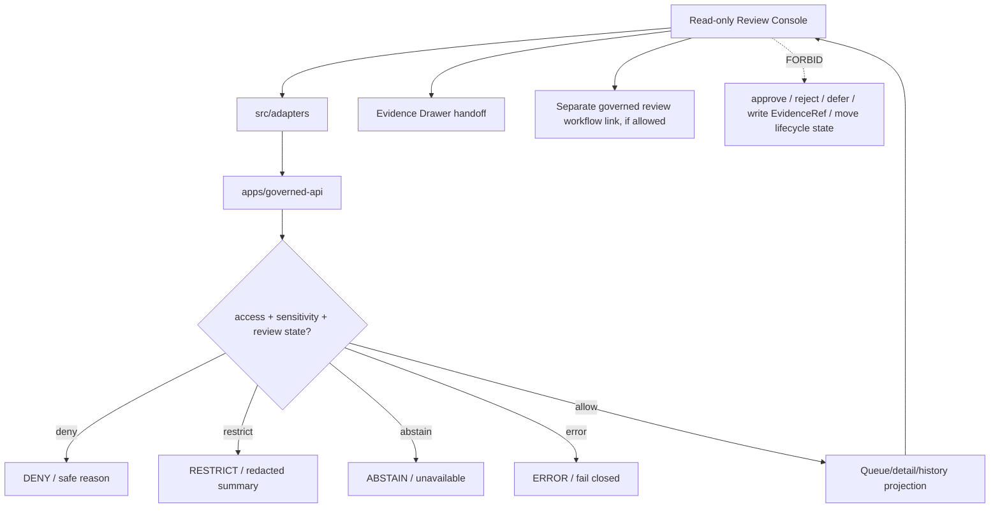

<!-- [KFM_META_BLOCK_V2]
doc_id: kfm://app/explorer-web/src/features/review_console_readonly/readme
title: Explorer Web Read-Only Review Console Feature README
type: app-readme
version: v0.1
status: draft
owners: OWNER_TBD — Apps steward · UI steward · Review steward · Evidence steward · Governed API steward · Policy steward · Audit steward · Docs steward
created: 2026-06-16
updated: 2026-06-16
policy_label: public
related:
  - ../README.md
  - ../../README.md
  - ../../adapters/README.md
  - ../../../README.md
  - ../../../../README.md
  - ../../../../governed-api/README.md
  - ../../../../../docs/architecture/ui/README.md
  - ../../../../../docs/architecture/ui/REVIEW_CONSOLE.md
  - ../../../../../docs/architecture/ui/EVIDENCE_DRAWER.md
  - ../../../../../docs/governance/REVIEW_DUTIES.md
  - ../../../../../packages/ui/README.md
  - ../../../../../packages/maplibre/README.md
  - ../../../../../policy/access/README.md
  - ../../../../../policy/decision/README.md
  - ../../../../../release/README.md
  - ../../../../../data/README.md
tags: [kfm, apps, explorer-web, features, review-console, readonly, review-records, quarantine, evidencebundle, audit, provenance]
notes:
  - "Replaces the greenfield read-only review console feature stub with a governed feature README."
  - "This feature is explicitly read-only. It may display governed review queue/detail/history/provenance projections, but it must not approve, reject, defer, annotate, retire, override, promote, publish, route, mutate lifecycle state, or write EvidenceRef records."
  - "Feature implementation files, route wiring, tests, fixtures, governed API envelopes, review schemas, audit/provenance handoffs, accessibility behavior, telemetry, and package scripts remain NEEDS VERIFICATION."
  - "Mutating review-console behavior described in architecture doctrine belongs behind a separate governed decision-recorder path, not this read-only Explorer Web feature."
[/KFM_META_BLOCK_V2] -->

<a id="top"></a>

<div align="center">

# Explorer Web Read-Only Review Console Feature

`apps/explorer-web/src/features/review_console_readonly/`

**App-local Explorer Web feature boundary for read-only review visibility: quarantine/review queue projections, item-detail inspection, validator report summaries, EvidenceBundle/EvidenceRef references, policy labels, reviewer history, provenance/audit summaries, finite negative states, and safe links to governed review workflows without mutating pipeline state.**


[Purpose](#1-purpose) · [Repo fit](#2-repo-fit) · [Boundary](#3-authority-boundary) · [Inputs](#5-inputs) · [Exclusions](#6-exclusions) · [Feature map](#7-read-only-review-console-feature-map) · [Definition of done](#14-definition-of-done)

</div>

---

> [!IMPORTANT]
> **Status:** draft / `NEEDS VERIFICATION`  
> **Owners:** `OWNER_TBD` — Apps steward · UI steward · Review steward · Evidence steward · Governed API steward · Policy steward · Audit steward · Docs steward  
> **Path:** `apps/explorer-web/src/features/review_console_readonly/README.md`  
> **Responsibility root:** `apps/` — deployable application surfaces  
> **Truth posture:** CONFIRMED README path / CONFIRMED Review Console architecture doctrine / PROPOSED read-only feature contract / UNKNOWN implementation files, route wiring, tests, fixtures, schemas, and runtime behavior

> [!CAUTION]
> This feature is **read-only by design**. It must not submit review decisions, write `EvidenceRef`s, edit quarantined payloads, move lifecycle items, approve promotions, publish artifacts, retire items, override decisions, or mutate audit/provenance state. Any future mutating path belongs behind a separate governed review/decision-recorder authority with explicit policy, provenance, tests, and separation-of-duty review.

---

## Quick jump

- [1. Purpose](#1-purpose)
- [2. Repo fit](#2-repo-fit)
- [3. Authority boundary](#3-authority-boundary)
- [4. Default posture](#4-default-posture)
- [5. Inputs](#5-inputs)
- [6. Exclusions](#6-exclusions)
- [7. Read-Only Review Console feature map](#7-read-only-review-console-feature-map)
- [8. Diagram](#8-diagram)
- [9. Read-Only Review Console UI obligations](#9-read-only-review-console-ui-obligations)
- [10. Per-view contract](#10-per-view-contract)
- [11. Inspection path](#11-inspection-path)
- [12. Validation expectations](#12-validation-expectations)
- [13. Safe change pattern](#13-safe-change-pattern)
- [14. Definition of done](#14-definition-of-done)
- [15. Open verification items](#15-open-verification-items)

---

## 1. Purpose

`apps/explorer-web/src/features/review_console_readonly/` is the proposed app-local feature boundary for read-only review visibility inside Explorer Web.

It may eventually hold route modules, panels, view models, hooks, finite-state renderers, queue filters, audit-history cards, evidence-reference tables, and feature orchestration for:

- viewing review queue summaries returned by governed API endpoints;
- inspecting quarantined item metadata without exposing raw payloads to the browser;
- displaying validator report summaries, not raw validator internals;
- showing `EvidenceBundle` and `EvidenceRef` references as governed projections;
- viewing source, policy, role, sensitivity, rights, review, stale, release, and audit state;
- showing item history, prior review outcomes, audit/provenance entries, and routing-signal summaries;
- linking to Evidence Drawer, diagnostics, and steward/admin review workflows where allowed;
- rendering denied, restricted, abstained, unavailable, stale, malformed, and error states safely;
- preserving accessibility for queue filtering, item inspection, provenance tables, keyboard flow, and non-color trust labels.

This directory is not proof that any review console component, route, hook, adapter, schema, fixture, test, package script, governed API route, audit/provenance handoff, or accessibility behavior is implemented.

[Back to top](#top)

---

## 2. Repo fit

| Concern | Owning root | Expected relationship |
|---|---|---|
| Read-only review feature source | `apps/explorer-web/src/features/review_console_readonly/` | App-local read-only review UI modules, if implemented and tested |
| Feature boundary | `apps/explorer-web/src/features/` | Parent feature/root contract |
| Adapter boundary | `apps/explorer-web/src/adapters/` | Governed API, evidence, layer, map, export, and diagnostics adapters |
| Explorer Web app | `apps/explorer-web/` | Map-first public/semi-public shell; review views require access policy |
| Governed API | `apps/governed-api/` | Trust membrane and normal review-summary path |
| Review Console architecture | `docs/architecture/ui/REVIEW_CONSOLE.md` | Review queue/detail/decision/provenance doctrine; mutating decision path is not this feature |
| Evidence Drawer architecture | `docs/architecture/ui/EVIDENCE_DRAWER.md` | Proof inspection and evidence handoff posture |
| Governance review duties | `docs/governance/REVIEW_DUTIES.md` | Human-role and review-duty context, if verified |
| Shared UI components | `packages/ui/` | Reusable queue tables, badges, cards, accordions, provenance tables, and accessibility primitives when shared |
| Renderer wrappers | `packages/maplibre/` | Spatial preview remains behind governed renderer boundary, if present |
| Policy gates | `policy/` | Access, reviewer role, sensitivity, rights, and decision policy |
| Release authority | `release/` | Publication, correction, supersession, rollback control |
| Lifecycle artifacts | `data/` | Receipts, proofs, registry, catalog, triplets, published artifacts; not browser-readable directly |

## 3. Authority boundary

This feature renders governed, read-only review visibility. It does not own review decision recording, quarantine storage, workflow routing, evidence truth, source admission, citation validation, policy decisions, release decisions, schemas, contracts, lifecycle artifacts, canonical stores, audit-log writes, PROV writes, renderer authority, telemetry truth, or AI output.

```text
apps/explorer-web/src/features/review_console_readonly/ = app-local read-only review UI feature
apps/explorer-web/src/features/                        = feature boundary
apps/explorer-web/src/adapters/                        = adapter boundary
apps/governed-api/                                     = trust membrane and review-summary path
docs/architecture/ui/REVIEW_CONSOLE.md                 = review console architecture doctrine
packages/ui/                                           = shared UI primitives
policy/                                                = finite policy decisions
data/                                                  = lifecycle artifacts, receipts, proofs, registries
release/                                               = publication, correction, rollback authority
```

## 4. Default posture

Read-only Review Console feature modules should fail closed, hide unavailable or restricted review details, and never downgrade missing provenance into a visible claim.

A read-only review view should not render or link claim-bearing review content when any of these are unresolved:

- governed API envelope and response validation;
- review queue/item/detail/history response schema validation;
- user role, reviewer identity, clearance, and item `policy_label` compatibility;
- item lifecycle state and quarantine/work/published boundary;
- validator report summary availability and redaction state;
- EvidenceRef and EvidenceBundle reference support;
- policy, sensitivity, rights, review, release, correction, rollback, stale, or hold state;
- audit/provenance reference support;
- whether a displayed field is read-only summary vs mutating decision input;
- accessibility state for keyboard, screen reader, focus, non-color labels, and reduced motion;
- safe telemetry posture.

## 5. Inputs

| Input family | Examples | Required posture |
|---|---|---|
| Queue state | item id, validator category, age, source summary, policy label, status, priority | Governed summary projection only |
| Item detail | normalized preview fields, reason flagged, validator summary, related refs | Redacted and access-controlled |
| Evidence state | EvidenceRef list, EvidenceBundle reference summary, source refs | Reference/projection only; no raw bundle copy |
| Policy state | reviewer role, clearance, policy label, sensitivity, rights, denial reason | Text labels required; color is secondary |
| Audit/provenance state | review history, decision refs, PROV activity summary, routing signal summary | Read-only and immutable in this feature |
| Spatial state | reference geometry, bounds, related released layers | Context only; not proof; no raw quarantined geometry unless governed |
| API envelope | queue response, item response, history response, `DecisionEnvelope`, finite outcome | Runtime-validated before render |
| UI state | loading, ready, denied, restricted, abstained, empty, stale, malformed, error | Finite and tested states |
| Accessibility state | keyboard queue navigation, filter labels, table headers, focus return, non-color trust badges | Required for review-bearing UI |

## 6. Exclusions

| Does not belong here | Correct home |
|---|---|
| Review decision recording | governed review API / decision recorder, not read-only UI |
| Approve/reject/defer/annotate/retire/override actions | Mutating review console or admin/steward workflow, not this feature |
| Direct `EvidenceRef` writes | Decision recorder / evidence service, never read-only browser feature |
| Direct edits to quarantined item payloads | Pipeline/governed review authority; in-console payload editing is out of scope |
| Quarantine, WORK, RAW, PROCESSED, CATALOG/TRIPLET, or PUBLISHED storage reads | Governed API projections only |
| Policy evaluation and RBAC decisions | `policy/`, governed API policy runtime |
| Audit-log or PROV writes | governed review/decision recorder and accepted audit/provenance homes |
| Schemas and contracts | `schemas/contracts/v1/review/`, `schemas/contracts/v1/evidence/`, `contracts/` — exact homes `NEEDS VERIFICATION` |
| Release manifests, rollback cards, correction notices | `release/`, `data/receipts/`, `data/proofs/` as accepted |
| Renderer wrapper authority | `packages/maplibre/`, `packages/cesium/` as accepted |
| Shared reusable UI primitives | `packages/ui/` |
| Source acquisition, source registry, catalog records | `connectors/`, `data/registry/`, `data/catalog/` |
| Direct model runtime behavior | `runtime/` behind governed API only |
| Secrets, credentials, tokens, private keys | Secret manager / deployment environment |

## 7. Read-Only Review Console feature map

Exact modules remain `NEEDS VERIFICATION`. Candidate modules should be introduced only with route inventory, fixtures, and tests.

| Candidate module | Purpose | Required safeguard | Status |
|---|---|---|---|
| `review-queue-readonly` | Queue list, filters, sort, status summary | Governed summary only | PROPOSED |
| `review-item-summary` | Item detail and validator summary | Redacted, role-aware projection only | PROPOSED |
| `evidence-reference-panel` | EvidenceRef/EvidenceBundle summaries | No raw bundle copy | PROPOSED |
| `policy-access-panel` | Show policy labels, role, clearance, deny/restrict reason | No hidden clearance leak | PROPOSED |
| `audit-history-panel` | Show immutable review/audit/provenance history | Read-only; no write affordance | PROPOSED |
| `spatial-context-panel` | Map/geometry context for review item | Context only; governed geometry only | PROPOSED |
| `negative-state-panel` | Show denied, restricted, abstained, stale, malformed, error states | No fallback claims | PROPOSED |
| `handoff-links` | Open Evidence Drawer, diagnostics, or steward/admin route where allowed | Explicit external workflow boundary | PROPOSED |
| `telemetry-safe-events` | Record non-content UI events | No raw payloads, restricted geometry, or reviewer rationale | PROPOSED |
| `readonly-guard` | Blocks local mutation affordances and form submissions | Enforced by tests | PROPOSED |

> [!WARNING]
> Candidate module names are not implementation proof. Do not document a read-only review module as runnable until files, route wiring, tests, fixtures, package scripts, governed API envelopes, schemas, access policy, and audit/provenance fixtures confirm it.

## 8. Diagram



## 9. Read-Only Review Console UI obligations

| Obligation | Example effect |
|---|---|
| `governed_api_only` | Queue, item, evidence, and history state comes through governed API envelopes |
| `readonly_only` | No approve/reject/defer/annotate/retire/override form or mutation path exists here |
| `no_payload_editing` | The UI cannot alter quarantined item payloads |
| `no_lifecycle_moves` | UI cannot move RAW/QUARANTINE/WORK/PROCESSED/CATALOG/PUBLISHED state |
| `evidence_refs_readonly` | EvidenceRef and EvidenceBundle references are displayed, not written |
| `audit_visible_not_writable` | Audit/PROV history is inspectable but immutable from this feature |
| `policy_access_visible` | Role, clearance, policy label, and redaction state are visible where allowed |
| `finite_states_required` | Allowed, restricted, denied, abstained, stale, malformed, loading, empty, and error states are explicit |
| `safe_handoff_boundary` | Links to mutating review/admin workflows are clearly outside this read-only feature |
| `no_authority_fork` | Feature code does not redefine review policy, evidence, provenance, release, schema, contract, or lifecycle authority |

## 10. Per-view contract

Every long-lived read-only Review Console view should document or encode:

- governed API envelope dependency;
- queue/item/history object families consumed;
- role, clearance, policy label, sensitivity, and redaction behavior;
- evidence-reference and Evidence Drawer handoff behavior;
- audit/provenance display behavior;
- exact absence of mutating form actions;
- external workflow handoff behavior, if any;
- loading, empty, denied, restricted, abstained, stale, malformed, and error states;
- accessibility behavior for queue tables, filters, badges, keyboard navigation, screen readers, reduced motion, and non-color labels;
- tests and fixtures proving trust-membrane, read-only, no-lifecycle-mutation, no-EvidenceRef-write, policy, audit/provenance, handoff, and accessibility boundaries.

## 11. Inspection path

Read-only Review Console implementation files, route wiring, tests, fixtures, governed API envelopes, schema bindings, access-policy behavior, audit/provenance handoffs, telemetry, package scripts, and external workflow links remain `NEEDS VERIFICATION`.

```bash
find apps/explorer-web/src/features/review_console_readonly -maxdepth 5 -type f | sort
find apps/explorer-web/src apps/governed-api docs/architecture/ui docs/governance packages/ui packages/maplibre schemas contracts policy release data tests fixtures -maxdepth 6 -type f 2>/dev/null | grep -Ei 'review.?console|review|readonly|read.?only|quarantine|validator|EvidenceBundle|EvidenceRef|ReviewRecord|DecisionRecord|PolicyDecision|audit|prov|provenance|approval|reject|defer|route|a11y|accessibility' | sort
find data/raw data/work data/quarantine data/processed data/catalog data/triplets data/published data/receipts data/proofs -maxdepth 2 -type f 2>/dev/null | sort
```

## 12. Validation expectations

Useful validation for this feature boundary should cover:

- no read-only review feature imports or reads lifecycle/canonical data roots directly;
- queue/item/history state consumes governed API envelopes only;
- no local mutation affordance for approve, reject, defer, annotate, retire, override, promote, publish, route, or write EvidenceRef;
- malformed review payloads render `ERROR`, never partial sensitive detail;
- insufficient role/clearance renders `DENY` or restricted summary without exposure hints;
- restricted item fields are redacted before browser render;
- audit/provenance records are visible only as allowed, and no audit/provenance writes originate here;
- external workflow links clearly leave this read-only feature and do not share raw payloads;
- telemetry never includes raw item payloads, restricted geometry, reviewer rationale, secrets, or full EvidenceBundle copies;
- accessibility tests cover queue filters, table headers, focus management, screen-reader labels, reduced motion, and non-color trust badges.

## 13. Safe change pattern

For Read-Only Review Console feature changes:

1. Add or update route inventory and per-view contract.
2. Add fixtures for allowed, restricted, denied, abstained, stale, malformed, loading, empty, audit-unavailable, and external-handoff states.
3. Test lifecycle/canonical-data denial, read-only guard behavior, and governed API-only behavior.
4. Preserve policy labels, role/clearance state, evidence refs, audit refs, review status, redaction state, release/correction/rollback refs, and provenance summaries through UI state.
5. Test keyboard/screen-reader/reduced-motion paths before claiming review-bearing UI usability.
6. Update this README, parent `features/README.md`, Review Console architecture docs, and parent app README when public or steward-facing behavior changes.

## 14. Definition of done

- [ ] Owners are confirmed and `OWNER_TBD` is replaced.
- [ ] Read-only Review Console feature file inventory and route ownership are documented.
- [ ] Governed API and adapter dependencies are explicit.
- [ ] Queue/item/history schemas and fixtures are verified.
- [ ] Read-only guard is tested against all mutating verbs and UI affordances.
- [ ] Direct lifecycle/canonical-data import/read checks are covered.
- [ ] Policy role/clearance denial and redaction states are tested.
- [ ] EvidenceRef display is tested as read-only; no EvidenceRef write originates here.
- [ ] Audit/provenance display is tested as read-only; no audit/provenance write originates here.
- [ ] Evidence Drawer, diagnostics, and external steward/admin handoffs are tested for safe governed refs if present.
- [ ] Accessibility behavior is tested for keyboard, focus, ARIA, reduced motion, queue tables, filters, and non-color badges.

## 15. Open verification items

| Item | Why it matters |
|---|---|
| Confirm read-only Review Console implementation files beyond README | Prevents overclaiming feature maturity |
| Confirm route inventory and launch surfaces | Required for UI boundary review |
| Confirm governed API queue/item/history endpoints | Required for trust membrane enforcement |
| Confirm review schemas and fixtures | Required before claim-bearing review UI claims |
| Confirm read-only guard tests | Required to keep this feature non-mutating |
| Confirm role/clearance policy bundle | Required before reviewer-access claims |
| Confirm audit/provenance references and display behavior | Required before provenance UI claims |
| Confirm Evidence Drawer handoff | Required before evidence-support inspection claims |
| Confirm external steward/admin workflow separation | Required before linking to mutating review actions |
| Confirm accessibility tests | Required because review signals must be accessible |
| Confirm telemetry is safe and non-secret | Required before diagnostics/observability claims |
| Confirm package scripts beyond TODO | Required before build/test claims |

<details>
<summary>Appendix A — no-loss preservation note</summary>

The previous README was a greenfield stub. This replacement adds a bounded read-only Review Console feature contract without claiming review components, routes, hooks, adapters, fixtures, tests, package scripts, governed API envelopes, schemas, access policy, audit/provenance rendering, telemetry, Evidence Drawer handoff, or external workflow links are implemented.

</details>

## Status summary

`apps/explorer-web/src/features/review_console_readonly/` should contain read-only Review Console feature modules only after route contracts, governed API envelopes, schema bindings, negative-state fixtures, read-only guard tests, access-policy checks, audit/provenance display checks, accessibility tests, telemetry constraints, and external handoffs are verified.

It must preserve the trust membrane and review separation: this feature may show governed review queue/detail/history/evidence/provenance projections, but it must not approve, reject, defer, annotate, retire, override, promote, publish, route, write EvidenceRefs, write audit records, mutate lifecycle state, edit payloads, bypass policy, or become a direct model-output surface.

<p align="right"><a href="#top">Back to top</a></p>
