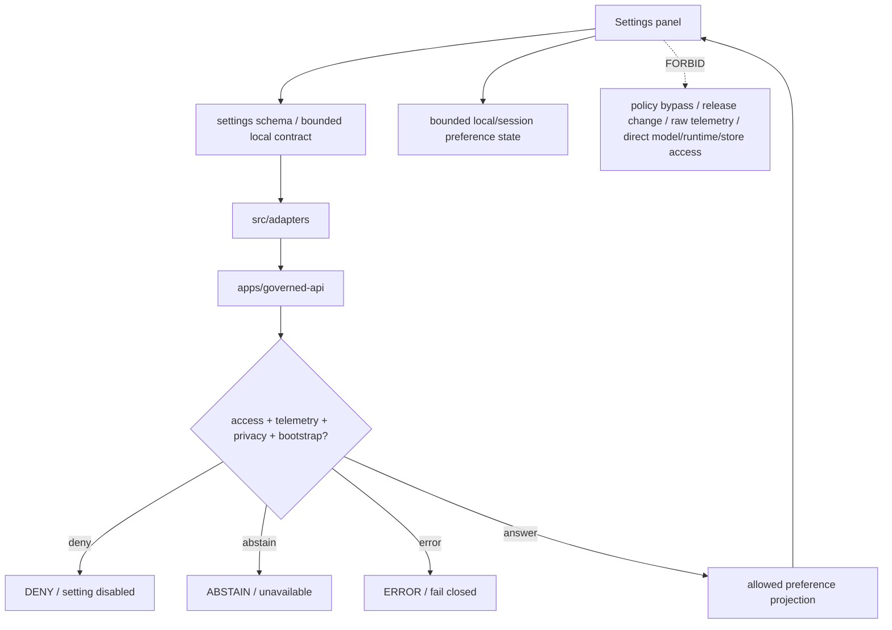

<!-- [KFM_META_BLOCK_V2]
doc_id: kfm://app/explorer-web/src/features/settings/readme
title: Explorer Web Settings Feature README
type: app-readme
version: v0.1
status: draft
owners: OWNER_TBD — Apps steward · UI steward · Settings steward · Accessibility steward · Privacy steward · Governed API steward · Policy steward · Docs steward
created: 2026-06-16
updated: 2026-06-16
policy_label: public
related:
  - ../README.md
  - ../../README.md
  - ../../adapters/README.md
  - ../../../README.md
  - ../../../../README.md
  - ../../../../governed-api/README.md
  - ../../../../../docs/architecture/ui/README.md
  - ../../../../../docs/architecture/ui/GOVERNED_SHELL.md
  - ../../../../../docs/architecture/ui/ACCESSIBILITY.md
  - ../../../../../docs/architecture/ui/TELEMETRY.md
  - ../../../../../docs/architecture/ui/STATE_OWNERSHIP.md
  - ../../../../../packages/ui/README.md
  - ../../../../../packages/maplibre/README.md
  - ../../../../../policy/access/README.md
  - ../../../../../policy/decision/README.md
  - ../../../../../policy/telemetry/README.md
  - ../../../../../release/README.md
  - ../../../../../data/README.md
tags: [kfm, apps, explorer-web, features, settings, preferences, accessibility, telemetry, privacy, feature-flags, safe-ui]
notes:
  - "Replaces the greenfield Settings feature stub with a governed feature README."
  - "Settings UI features may render and update user-facing preferences through governed envelopes, but they must not alter evidence, policy, release state, source truth, layer manifests, review decisions, telemetry contents, or sensitive-domain access."
  - "Feature implementation files, route wiring, tests, fixtures, governed API envelopes, settings schemas, persistence behavior, accessibility behavior, telemetry policy wiring, and package scripts remain NEEDS VERIFICATION."
[/KFM_META_BLOCK_V2] -->

<a id="top"></a>

<div align="center">

# Explorer Web Settings Feature

`apps/explorer-web/src/features/settings/`

**App-local Explorer Web feature boundary for governed user-facing settings: accessibility preferences, display density, map interaction preferences, reduced-motion behavior, unit/time display preferences, safe telemetry choices, feature-flag visibility, local UI state reset, and bounded preference persistence without weakening the trust membrane.**


[Purpose](#1-purpose) · [Repo fit](#2-repo-fit) · [Boundary](#3-authority-boundary) · [Inputs](#5-inputs) · [Exclusions](#6-exclusions) · [Feature map](#7-settings-feature-map) · [Definition of done](#14-definition-of-done)

</div>

---

> [!IMPORTANT]
> **Status:** draft / `NEEDS VERIFICATION`  
> **Owners:** `OWNER_TBD` — Apps steward · UI steward · Settings steward · Accessibility steward · Privacy steward · Governed API steward · Policy steward · Docs steward  
> **Path:** `apps/explorer-web/src/features/settings/README.md`  
> **Responsibility root:** `apps/` — deployable application surfaces  
> **Truth posture:** CONFIRMED README path / CONFIRMED UI shell doctrine / PROPOSED feature contract / UNKNOWN implementation files, route wiring, tests, fixtures, schemas, and runtime behavior

> [!CAUTION]
> Settings are preferences, not authority. A setting may change how an allowed UI surface is displayed, but it must never weaken policy, bypass release gates, reveal restricted geometry, suppress required trust badges, hide finite outcomes, disable citation requirements, silence correction/rollback state, or turn telemetry into a raw-payload channel.

---

## Quick jump

- [1. Purpose](#1-purpose)
- [2. Repo fit](#2-repo-fit)
- [3. Authority boundary](#3-authority-boundary)
- [4. Default posture](#4-default-posture)
- [5. Inputs](#5-inputs)
- [6. Exclusions](#6-exclusions)
- [7. Settings feature map](#7-settings-feature-map)
- [8. Diagram](#8-diagram)
- [9. Settings UI obligations](#9-settings-ui-obligations)
- [10. Per-setting contract](#10-per-setting-contract)
- [11. Inspection path](#11-inspection-path)
- [12. Validation expectations](#12-validation-expectations)
- [13. Safe change pattern](#13-safe-change-pattern)
- [14. Definition of done](#14-definition-of-done)
- [15. Open verification items](#15-open-verification-items)

---

## 1. Purpose

`apps/explorer-web/src/features/settings/` is the proposed app-local feature boundary for Settings source modules inside Explorer Web.

It may eventually hold route modules, panels, view models, hooks, finite-state renderers, preference forms, reset controls, and feature orchestration for:

- accessibility preferences such as reduced motion, contrast, text size, focus visibility, keyboard-first controls, and map-control alternatives;
- map display preferences such as basemap display mode, label density, measurement units, time display, and layer-panel density;
- safe telemetry preference display and opt-state summaries without exposing telemetry payloads;
- feature-flag visibility and environment/status display as read-only governed bootstrap state;
- local UI state reset, cache-reset, and layout reset controls that do not touch lifecycle artifacts or released data;
- persisted preference read/write requests through a governed API or bounded local storage contract;
- finite settings outcomes: saved, reset, denied, abstained, unavailable, invalid, stale, conflict, and error states;
- accessibility-safe form labeling, keyboard flow, ARIA labels, error messages, and non-color trust indicators.

This directory is not proof that any settings component, route, hook, adapter, schema, fixture, test, package script, governed API route, persistence behavior, or accessibility behavior is implemented.

[Back to top](#top)

---

## 2. Repo fit

| Concern | Owning root | Expected relationship |
|---|---|---|
| Settings feature source | `apps/explorer-web/src/features/settings/` | App-local Settings UI modules, if implemented and tested |
| Feature boundary | `apps/explorer-web/src/features/` | Parent feature/root contract |
| Adapter boundary | `apps/explorer-web/src/adapters/` | Governed API, evidence, layer, map, export, diagnostics, and settings adapters |
| Explorer Web app | `apps/explorer-web/` | Map-first public/semi-public shell |
| Governed API | `apps/governed-api/` | Trust membrane and normal bootstrap/preference path |
| UI architecture | `docs/architecture/ui/README.md` | UI subsystem doctrine and surface list |
| Governed shell architecture | `docs/architecture/ui/GOVERNED_SHELL.md` | Shell ownership, trust membrane, finite outcomes, bootstrap posture |
| Accessibility doctrine | `docs/architecture/ui/ACCESSIBILITY.md` | Accessibility expectations, if verified |
| Telemetry doctrine | `docs/architecture/ui/TELEMETRY.md` | Safe UI telemetry expectations, if verified |
| Shared UI components | `packages/ui/` | Reusable settings forms, toggles, badges, cards, notices, and accessibility primitives when shared |
| Renderer wrappers | `packages/maplibre/` | Map display changes stay behind renderer boundaries when relevant |
| Policy gates | `policy/` | Access, privacy, telemetry, sensitivity, rights, release, and decision policy |
| Release authority | `release/` | Publication, correction, supersession, rollback control |
| Lifecycle artifacts | `data/` | Receipts, proofs, registry, catalog, triplets, and published artifacts; not browser-readable directly |

## 3. Authority boundary

This feature renders and updates bounded user-facing preferences. It does not own accessibility doctrine, telemetry policy, policy decisions, sensitivity decisions, release decisions, feature-flag authority, layer manifests, source registry records, evidence truth, citation validation, schemas, contracts, lifecycle artifacts, renderer authority, model invocation, audit truth, or AI output.

```text
apps/explorer-web/src/features/settings/ = app-local Settings UI feature
apps/explorer-web/src/features/          = feature boundary
apps/explorer-web/src/adapters/          = adapter boundary
apps/governed-api/                       = trust membrane and preference/bootstrap path
docs/architecture/ui/GOVERNED_SHELL.md   = shell trust and finite-outcome doctrine
packages/ui/                             = shared UI primitives
policy/                                  = finite policy decisions
data/                                    = lifecycle artifacts, receipts, proofs, registries
release/                                 = publication, correction, rollback authority
```

## 4. Default posture

Settings feature modules should fail closed, keep user preference separate from governance authority, and preserve mandatory trust, accessibility, and policy signals.

A Settings view should not read, write, persist, or apply a setting when any of these are unresolved:

- governed API envelope or bounded local-storage contract validation;
- setting key, owner, type, default, persistence tier, and allowed values;
- whether the setting is display-only, local-only, profile-bound, session-bound, or server-backed;
- policy restrictions on telemetry, privacy, sensitive domains, release state, or feature flags;
- accessibility baseline obligations that cannot be disabled;
- whether the setting affects map rendering, layer visibility, Evidence Drawer, Focus Mode, export, review, telemetry, or diagnostics;
- stale/conflict handling between local preference and server/bootstrap preference;
- audit/privacy posture for preference changes, if server-backed;
- telemetry safety: no raw prompts, raw evidence, restricted geometry, feature properties, secrets, or full EvidenceBundle copies;
- finite outcome rendering for save, reset, deny, abstain, invalid, conflict, unavailable, and error states.

## 5. Inputs

| Input family | Examples | Required posture |
|---|---|---|
| Bootstrap settings | feature flags, available routes, policy posture, settings schema refs | Governed bootstrap projection only |
| User preferences | theme, density, units, time display, reduced motion, map interaction behavior | Schema-validated allowed values |
| Accessibility preferences | text size, contrast, focus-visible, keyboard-first, reduced motion, non-map alternatives | May enhance baseline, not remove required accessibility |
| Map preferences | label density, measurement units, default basemap class, interaction sensitivity | Display preference only; no release/policy bypass |
| Telemetry preferences | safe telemetry notice, opt state, diagnostic sharing state | No raw payloads or sensitive content |
| Persistence state | local storage, session storage, profile setting, server-backed setting | Explicit persistence tier and reset path |
| API envelope | read response, update response, reset response, `DecisionEnvelope`, finite outcome | Runtime-validated before render |
| UI state | loading, saved, reset, denied, abstained, invalid, conflict, stale, error | Finite and tested states |
| Accessibility state | form labels, field descriptions, validation messages, focus return, keyboard path | Required for Settings UI |

## 6. Exclusions

| Does not belong here | Correct home |
|---|---|
| Policy decisions, sensitivity rules, access control, or release gates | `policy/`, governed API policy runtime, `release/` |
| Feature-flag authority | Governed bootstrap/config service, not client-side Settings UI |
| EvidenceBundle construction, citation validation, or Evidence Drawer truth | governed API / evidence resolver / Evidence Drawer feature |
| Layer publication, layer manifest editing, source registry editing | `release/`, `data/registry/`, governed source/layer pipelines |
| Changing required trust badges, finite outcomes, correction/rollback labels, or policy labels | Forbidden from settings |
| Raw telemetry payload collection | Forbidden; telemetry must be safe UI telemetry only |
| RAW, WORK, QUARANTINE, canonical stores, graph/vector stores, object stores, unpublished candidates | Forbidden from browser Settings path |
| Direct browser-to-model calls | Forbidden; model calls belong server-side behind governed API |
| Renderer implementation and plugin imports | `packages/maplibre/`, `packages/maplibre-runtime/`, or accepted runtime package |
| Shared reusable UI primitives | `packages/ui/` |
| Schemas and contracts | `schemas/contracts/v1/ui/`, `schemas/contracts/v1/settings/`, `contracts/` — exact homes `NEEDS VERIFICATION` |
| Lifecycle artifacts, receipts, proofs, published artifacts | `data/` |
| Secrets, credentials, tokens, private keys | Secret manager / deployment environment |

## 7. Settings feature map

Exact modules remain `NEEDS VERIFICATION`. Candidate modules should be introduced only with route inventory, fixtures, and tests.

| Candidate module | Purpose | Required safeguard | Status |
|---|---|---|---|
| `settings-panel` | Settings shell, sections, navigation, finite states | Governed schema or bounded local contract | PROPOSED |
| `accessibility-settings` | Reduced motion, contrast, text size, focus/keyboard preferences | Cannot disable baseline accessibility | PROPOSED |
| `map-display-settings` | Units, label density, default display preferences | No policy/release bypass | PROPOSED |
| `telemetry-settings` | Show safe telemetry opt state and diagnostics choices | No raw payload telemetry | PROPOSED |
| `privacy-notices` | Explain local/server persistence and data handling | Clear persistence tier labels | PROPOSED |
| `feature-flag-summary` | Show available feature flags from bootstrap | Read-only; no client authority | PROPOSED |
| `reset-local-state` | Reset local layout/cache/preference state | No lifecycle/release mutation | PROPOSED |
| `negative-state-panel` | Show denied, abstained, conflict, invalid, stale, unavailable, error states | No silent fallback |
| `telemetry-safe-events` | Record non-content settings UI events | No raw preferences if sensitive | PROPOSED |
| `settings-schema-guard` | Validate keys/types/defaults/allowed values | Fails closed on unknown setting | PROPOSED |

> [!WARNING]
> Candidate module names are not implementation proof. Do not document a Settings module as runnable until files, route wiring, tests, fixtures, package scripts, governed API envelopes, schemas, access policy, persistence behavior, and accessibility fixtures confirm it.

## 8. Diagram



## 9. Settings UI obligations

| Obligation | Example effect |
|---|---|
| `preferences_not_policy` | A setting never overrides policy, sensitivity, release, correction, or evidence requirements |
| `governed_or_bounded_local_only` | Settings are read/written through governed API or an explicitly bounded local contract |
| `baseline_accessibility_required` | Users may enhance accessibility but cannot disable required keyboard, focus, contrast, or screen-reader obligations |
| `safe_telemetry_only` | Settings telemetry records UI events only, never raw prompts, raw evidence, restricted geometry, secrets, or full bundle copies |
| `trust_badges_not_optional` | Required trust badges, finite outcomes, citations, correction, and rollback labels cannot be hidden |
| `feature_flags_readonly` | Feature flags reflect bootstrap/policy state; Settings does not create client authority |
| `finite_states_required` | Saved, reset, denied, abstained, invalid, conflict, stale, unavailable, loading, and error states are explicit |
| `persistence_visible` | Each preference shows whether it is local, session, profile, or server-backed |
| `safe_reset_only` | Reset controls clear UI preference state only, never lifecycle artifacts or released data |
| `no_authority_fork` | Feature code does not redefine settings schema, policy, accessibility doctrine, telemetry policy, release, evidence, or renderer authority |

## 10. Per-setting contract

Every long-lived setting should document or encode:

- setting key, label, description, owner, allowed values, default, and migration behavior;
- persistence tier: local, session, profile, server-backed, or bootstrap-read-only;
- whether the setting affects accessibility, map runtime, layer catalog, Evidence Drawer, Focus, Compare, Export, Review, Diagnostics, telemetry, or route visibility;
- policy restrictions and denial behavior;
- reset behavior and whether reset is local-only or server-backed;
- finite outcomes and negative states;
- telemetry emitted by changing the setting, if any;
- accessibility behavior for labels, descriptions, field errors, keyboard path, focus return, reduced motion, and non-color badges;
- tests and fixtures proving trust-membrane, policy, accessibility, persistence, reset, telemetry, and schema boundaries.

## 11. Inspection path

Settings implementation files, route wiring, tests, fixtures, governed API envelopes, schema bindings, access-policy behavior, persistence behavior, telemetry, package scripts, and downstream handoffs remain `NEEDS VERIFICATION`.

```bash
find apps/explorer-web/src/features/settings -maxdepth 5 -type f | sort
find apps/explorer-web/src apps/governed-api docs/architecture/ui packages/ui packages/maplibre schemas contracts policy release data tests fixtures -maxdepth 6 -type f 2>/dev/null | grep -Ei 'settings|preference|accessibility|a11y|telemetry|privacy|feature.?flag|bootstrap|theme|contrast|motion|density|unit|time.?display|local.?storage|session.?storage|DecisionEnvelope|RuntimeResponseEnvelope' | sort
find data/raw data/work data/quarantine data/processed data/catalog data/triplets data/published data/receipts data/proofs -maxdepth 2 -type f 2>/dev/null | sort
```

## 12. Validation expectations

Useful validation for this feature boundary should cover:

- no Settings feature imports or reads lifecycle/canonical data roots directly;
- no browser-side model runtime calls or provider SDK use;
- settings reads/writes consume governed API envelopes or bounded local contracts only;
- unknown setting keys, invalid values, malformed responses, and migration failures render `ERROR` or deny safely;
- policy, release, evidence, citation, correction, rollback, and required trust badges cannot be hidden or weakened by settings;
- accessibility baseline cannot be disabled;
- telemetry settings cannot create raw-payload telemetry;
- feature flags are read-only bootstrap/policy state;
- reset controls clear only UI preference state and never lifecycle artifacts, release state, source data, or cache needed for auditability;
- accessibility tests cover settings forms, field errors, keyboard navigation, focus management, screen-reader labels, reduced motion, and non-color status.

## 13. Safe change pattern

For Settings feature changes:

1. Add or update setting inventory and per-setting contract.
2. Add fixtures for saved, reset, denied, abstained, invalid, conflict, stale, unavailable, loading, empty, and error states.
3. Test lifecycle/canonical-data denial, no-browser-model behavior, governed API/local-contract behavior, and safe reset behavior.
4. Preserve policy state, accessibility baseline, telemetry safety, feature-flag authority, release/correction/rollback labels, and trust badges through UI state.
5. Test keyboard/screen-reader/reduced-motion paths before claiming Settings usability.
6. Update this README, parent `features/README.md`, GovernedShell docs, accessibility/telemetry docs, and parent app README when public behavior changes.

## 14. Definition of done

- [ ] Owners are confirmed and `OWNER_TBD` is replaced.
- [ ] Settings feature file inventory and route ownership are documented.
- [ ] Governed API or bounded local-contract dependencies are explicit.
- [ ] Settings schema/key inventory and fixtures are verified.
- [ ] Persistence tier and reset behavior are documented for every setting.
- [ ] Direct lifecycle/canonical-data import/read checks are covered.
- [ ] Browser model-runtime denial is tested.
- [ ] Policy/trust-badge weakening is tested and denied.
- [ ] Accessibility baseline cannot be disabled.
- [ ] Safe telemetry constraints are tested.
- [ ] Accessibility behavior is tested for keyboard, focus, ARIA, reduced motion, settings forms, and non-color badges.

## 15. Open verification items

| Item | Why it matters |
|---|---|
| Confirm Settings implementation files beyond README | Prevents overclaiming feature maturity |
| Confirm route inventory and launch surfaces | Required for UI boundary review |
| Confirm governed API settings/bootstrap endpoint or bounded local-only design | Required for trust membrane enforcement |
| Confirm settings schemas and fixtures | Required before user-preference UI claims |
| Confirm accessibility and telemetry doctrine files are current and wired | Required before policy-sensitive settings claims |
| Confirm persistence storage and migration behavior | Required before profile/local settings claims |
| Confirm no setting can hide required trust signals | Required before public UI claims |
| Confirm reset behavior cannot mutate lifecycle/release data | Required before cache/local-state controls |
| Confirm accessibility tests | Required because settings are a primary accessibility surface |
| Confirm telemetry is safe and non-secret | Required before diagnostics/observability claims |
| Confirm package scripts beyond TODO | Required before build/test claims |

<details>
<summary>Appendix A — no-loss preservation note</summary>

The previous README was a greenfield stub. This replacement adds a bounded Settings feature contract without claiming settings components, routes, hooks, adapters, fixtures, tests, package scripts, governed API envelopes, schemas, persistence behavior, accessibility behavior, telemetry behavior, feature-flag behavior, or reset behavior are implemented.

</details>

## Status summary

`apps/explorer-web/src/features/settings/` should contain Settings feature modules only after route contracts, governed API envelopes or bounded local contracts, schema bindings, negative-state fixtures, accessibility tests, safe telemetry constraints, persistence/reset behavior, and feature-flag boundaries are verified.

It must preserve the trust membrane and preference boundary: Settings may change safe display and accessibility preferences, but it must not bypass policy, release gates, evidence requirements, citation requirements, finite outcomes, required trust badges, correction/rollback visibility, telemetry constraints, renderer boundaries, lifecycle storage, or model-runtime boundaries.

<p align="right"><a href="#top">Back to top</a></p>
