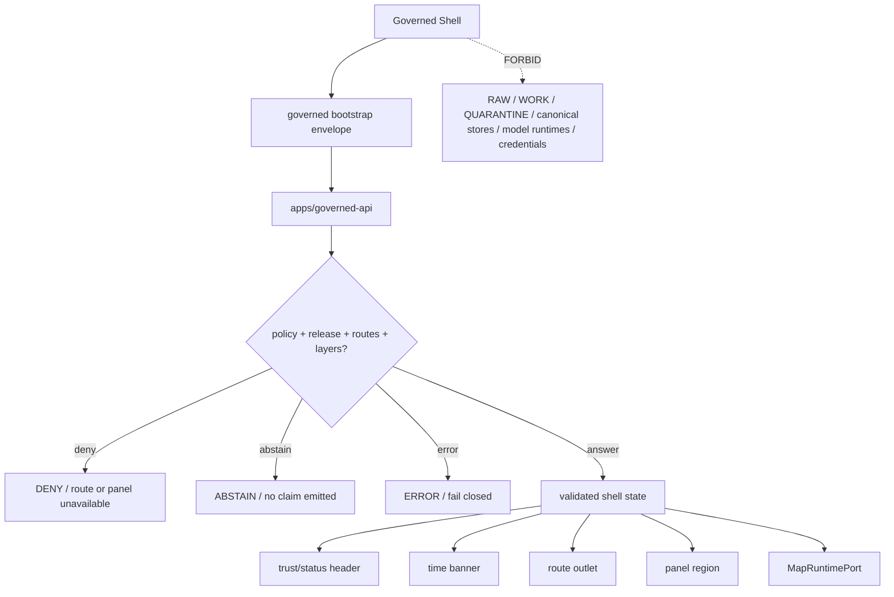

<!-- [KFM_META_BLOCK_V2]
doc_id: kfm://app/explorer-web/src/features/shell/readme
title: Explorer Web Shell Feature README
type: app-readme
version: v0.1
status: draft
owners: OWNER_TBD — Apps steward · UI steward · Shell steward · Map steward · Governed API steward · Policy steward · Accessibility steward · Docs steward
created: 2026-06-16
updated: 2026-06-16
policy_label: public
related:
  - ../README.md
  - ../../README.md
  - ../../adapters/README.md
  - ../../../README.md
  - ../../../../README.md
  - ../../../../governed-api/README.md
  - ../../../../../docs/architecture/ui/README.md
  - ../../../../../docs/architecture/ui/GOVERNED_SHELL.md
  - ../../../../../docs/architecture/ui/MAP_RUNTIME_BOUNDARY.md
  - ../../../../../docs/architecture/ui/LAYERING.md
  - ../../../../../docs/architecture/ui/EVIDENCE_DRAWER.md
  - ../../../../../docs/architecture/governed-ai/FOCUS_FLOW.md
  - ../../../../../packages/ui/README.md
  - ../../../../../packages/maplibre/README.md
  - ../../../../../policy/access/README.md
  - ../../../../../policy/decision/README.md
  - ../../../../../policy/telemetry/README.md
  - ../../../../../release/README.md
  - ../../../../../data/README.md
tags: [kfm, apps, explorer-web, features, shell, governed-shell, map-first, trust-header, time-banner, route-outlet, panel-region, finite-outcomes]
notes:
  - "Replaces the greenfield Shell feature stub with a governed feature README."
  - "Shell UI features may compose the persistent Explorer Web frame, but they must not become renderer authority, evidence resolver, policy engine, source registry, release authority, telemetry payload authority, model client, or lifecycle/canonical data path."
  - "Feature implementation files, route wiring, tests, fixtures, governed API envelopes, shell state contracts, bootstrap handling, accessibility behavior, telemetry policy wiring, and package scripts remain NEEDS VERIFICATION."
[/KFM_META_BLOCK_V2] -->

<a id="top"></a>

<div align="center">

# Explorer Web Shell Feature

`apps/explorer-web/src/features/shell/`

**App-local Explorer Web feature boundary for the governed shell: persistent map-first layout, trust/status header, time banner, route outlet, panel region, skip links, shell bootstrap state, finite outcome framing, and safe composition of Layer Catalog, Evidence Drawer, Focus Panel, Story, Review, Compare, Export, Settings, and Diagnostics.**


[Purpose](#1-purpose) · [Repo fit](#2-repo-fit) · [Boundary](#3-authority-boundary) · [Inputs](#5-inputs) · [Exclusions](#6-exclusions) · [Feature map](#7-shell-feature-map) · [Definition of done](#14-definition-of-done)

</div>

---

> [!IMPORTANT]
> **Status:** draft / `NEEDS VERIFICATION`  
> **Owners:** `OWNER_TBD` — Apps steward · UI steward · Shell steward · Map steward · Governed API steward · Policy steward · Accessibility steward · Docs steward  
> **Path:** `apps/explorer-web/src/features/shell/README.md`  
> **Responsibility root:** `apps/` — deployable application surfaces  
> **Truth posture:** CONFIRMED README path / CONFIRMED GovernedShell doctrine / PROPOSED feature contract / UNKNOWN implementation files, route wiring, tests, fixtures, schemas, and runtime behavior

> [!CAUTION]
> The Shell is the public frame, not the source of truth. It may host trust-visible UI, but it must never fetch RAW, WORK, QUARANTINE, canonical stores, graph/vector stores, object stores, unpublished candidates, model runtimes, credentials, or internal service handles. It renders governed API outcomes and released payloads only.

---

## Quick jump

- [1. Purpose](#1-purpose)
- [2. Repo fit](#2-repo-fit)
- [3. Authority boundary](#3-authority-boundary)
- [4. Default posture](#4-default-posture)
- [5. Inputs](#5-inputs)
- [6. Exclusions](#6-exclusions)
- [7. Shell feature map](#7-shell-feature-map)
- [8. Diagram](#8-diagram)
- [9. Shell UI obligations](#9-shell-ui-obligations)
- [10. Per-module contract](#10-per-module-contract)
- [11. Inspection path](#11-inspection-path)
- [12. Validation expectations](#12-validation-expectations)
- [13. Safe change pattern](#13-safe-change-pattern)
- [14. Definition of done](#14-definition-of-done)
- [15. Open verification items](#15-open-verification-items)

---

## 1. Purpose

`apps/explorer-web/src/features/shell/` is the proposed app-local feature boundary for the persistent governed shell inside Explorer Web.

It may eventually hold route modules, layout components, state bridges, finite-state renderers, bootstrap handlers, trust-header slots, time-banner slots, route outlets, panel-region orchestration, accessibility scaffolding, and feature orchestration for:

- persistent map-first layout that survives route transitions;
- trust/status header displaying release state, stale/degraded state, policy posture, review state, correction lineage, and active route/layer status;
- time banner displaying valid time, observed time, freshness, and time-scope labels;
- route outlet for Explore, Dossier, Story, Focus, Review, Compare, Export, Settings, Diagnostics, and domain panels;
- panel region for Layer Catalog, Evidence Drawer, Focus Panel, Review Console, Compare, Export, Settings, and Diagnostics;
- bootstrap envelope consumption before consequential rendering;
- governed client boundary, response validation, and finite outcome framing;
- accessibility scaffolding: skip links, landmarks, keyboard paths, focus-visible behavior, reduced motion, contrast tokens, and non-map alternatives;
- safe shell telemetry that records UI events without raw evidence, prompts, feature geometry, secrets, or restricted payloads.

This directory is not proof that any shell component, route, hook, state store, adapter, schema, fixture, test, package script, governed API route, bootstrap flow, or accessibility behavior is implemented.

[Back to top](#top)

---

## 2. Repo fit

| Concern | Owning root | Expected relationship |
|---|---|---|
| Shell feature source | `apps/explorer-web/src/features/shell/` | App-local governed shell modules, if implemented and tested |
| Feature boundary | `apps/explorer-web/src/features/` | Parent feature/root contract |
| Adapter boundary | `apps/explorer-web/src/adapters/` | Governed API, evidence, layer, map, export, diagnostics, and settings adapters |
| Explorer Web app | `apps/explorer-web/` | Map-first public/semi-public shell |
| Governed API | `apps/governed-api/` | Trust membrane and normal bootstrap/runtime payload path |
| GovernedShell doctrine | `docs/architecture/ui/GOVERNED_SHELL.md` | Persistent shell, trust header, time banner, finite outcome, and bootstrap doctrine |
| UI architecture | `docs/architecture/ui/README.md` | UI subsystem doctrine and feature-surface list |
| Map Runtime doctrine | `docs/architecture/ui/MAP_RUNTIME_BOUNDARY.md` | Renderer adapter boundary consumed by shell |
| Layering doctrine | `docs/architecture/ui/LAYERING.md` | Layer descriptor, manifest, lifecycle, and trust-badge posture |
| Shared UI components | `packages/ui/` | Reusable shell layout, banners, badges, cards, skip links, and accessibility primitives when shared |
| Renderer wrappers | `packages/maplibre/`, `packages/maplibre-runtime/` | Renderer implementation stays behind adapter boundaries |
| Policy gates | `policy/` | Access, sensitivity, rights, telemetry, release, and decision policy |
| Release authority | `release/` | Publication, correction, supersession, rollback control |
| Lifecycle artifacts | `data/` | Receipts, proofs, registry, catalog, triplets, and published artifacts; not browser-readable directly |

## 3. Authority boundary

This feature composes the governed shell frame. It does not own renderer implementation, evidence resolution, citation validation, policy decisions, sensitivity decisions, release decisions, source admission, layer publication, model invocation, telemetry payload content, schemas, contracts, lifecycle artifacts, canonical stores, graph/vector stores, audit truth, or AI output.

```text
apps/explorer-web/src/features/shell/ = app-local governed shell feature
apps/explorer-web/src/features/       = feature boundary
apps/explorer-web/src/adapters/       = adapter boundary
apps/governed-api/                    = trust membrane and bootstrap/runtime path
docs/architecture/ui/GOVERNED_SHELL.md = shell trust and finite-outcome doctrine
packages/ui/                          = shared UI primitives
policy/                               = finite policy decisions
data/                                 = lifecycle artifacts, receipts, proofs, registries
release/                              = publication, correction, rollback authority
```

## 4. Default posture

Shell feature modules should fail closed, establish trust state before consequential rendering, and preserve mandatory trust, time, accessibility, policy, and release signals.

A Shell path should not render consequential route or layer content when any of these are unresolved:

- governed bootstrap envelope and response validation;
- route availability, feature flag, policy posture, and allowed layer state;
- release state, stale/degraded state, review state, correction lineage, and rollback posture;
- time banner state, including valid time, observed time, source time, retrieval time, release time, correction time, and freshness where material;
- route outlet boundaries and panel slot ownership;
- MapRuntimePort and renderer adapter boundary;
- Evidence Drawer, Layer Catalog, Focus, Story, Review, Compare, Export, Settings, or Diagnostics handoff contracts;
- finite outcome rendering for `ANSWER`, `ABSTAIN`, `DENY`, `ERROR`, and review-only `HOLD`;
- accessibility scaffolding for skip links, landmarks, keyboard paths, focus, contrast, reduced motion, and non-map alternatives;
- safe telemetry posture.

## 5. Inputs

| Input family | Examples | Required posture |
|---|---|---|
| Bootstrap state | available routes, feature flags, allowed layers, policy posture, shell config | Governed bootstrap projection only |
| Route state | route id, active panel, domain, selected feature, selected layer, query params | Validated and bounded |
| Trust header state | release, stale/degraded, review, correction, rollback, policy posture | Visible at point of use |
| Time banner state | valid time, observed time, freshness, source/retrieval/release/correction time | Time-kind anti-collapse |
| Panel state | layer catalog, evidence drawer, focus, story, review, compare, export, settings, diagnostics | Slot-owned and finite-state aware |
| Map state | MapRuntimePort readiness, camera, selected layer refs, click candidates | Renderer boundary preserved |
| API envelope | `BootstrapEnvelope`, `DecisionEnvelope`, `RuntimeResponseEnvelope`, errors | Runtime-validated before render |
| UI state | loading, ready, denied, abstained, stale, hold, degraded, invalid, error | Finite and tested states |
| Accessibility state | skip links, landmarks, focus behavior, keyboard map alternatives, reduced motion | Required for public shell |

## 6. Exclusions

| Does not belong here | Correct home |
|---|---|
| Governed API implementation and bootstrap authority | `apps/governed-api/` |
| Renderer implementation or direct MapLibre/plugin imports | `packages/maplibre/`, `packages/maplibre-runtime/`, or accepted adapter package |
| EvidenceBundle construction, citation validation, and Evidence Drawer truth | governed API / evidence resolver / Evidence Drawer feature |
| Policy decisions, sensitivity rules, access control, or release gates | `policy/`, governed API policy runtime, `release/` |
| Layer publication, layer manifests, source registry editing | `release/`, `data/registry/`, `data/catalog/`, source/layer pipelines |
| Model adapter or direct browser-to-model calls | server-side governed AI runtime behind governed API only |
| Raw telemetry payload collection | Forbidden; telemetry must be safe UI telemetry only |
| RAW, WORK, QUARANTINE, canonical stores, graph/vector stores, object stores, unpublished candidates | Forbidden from browser Shell path |
| Changing required trust badges, finite outcomes, correction/rollback labels, policy labels, or citations | Forbidden from shell convenience logic |
| Shared reusable UI primitives | `packages/ui/` |
| Schemas and contracts | `schemas/contracts/v1/ui/`, `schemas/contracts/v1/governance/`, `contracts/` — exact homes `NEEDS VERIFICATION` |
| Lifecycle artifacts, receipts, proofs, published artifacts | `data/` |
| Secrets, credentials, tokens, private keys | Secret manager / deployment environment |

## 7. Shell feature map

Exact modules remain `NEEDS VERIFICATION`. Candidate modules should be introduced only with route inventory, fixtures, and tests.

| Candidate module | Purpose | Required safeguard | Status |
|---|---|---|---|
| `governed-shell` | Persistent layout, header, time banner, route outlet, panel region | Bootstrap-gated render | PROPOSED |
| `bootstrap-gate` | Load and validate bootstrap before consequential render | Fails closed on invalid envelope | PROPOSED |
| `trust-header` | Release, stale, review, correction, policy, citation state | Required trust labels cannot be hidden | PROPOSED |
| `time-banner` | Valid/observed/freshness/time-kind display | Time-kind anti-collapse | PROPOSED |
| `route-outlet` | Route-family composition inside shell | Route contract and finite state | PROPOSED |
| `panel-region` | Layer/Evidence/Focus/Story/Review/Compare/Export/Settings/Diagnostics slots | Slot ownership, no arbitrary children | PROPOSED |
| `skip-links-landmarks` | Keyboard and screen-reader shell navigation | Accessibility tests | PROPOSED |
| `shell-outcome-renderer` | Render `ANSWER`, `ABSTAIN`, `DENY`, `ERROR`, `HOLD` consistently | Closed finite outcome set | PROPOSED |
| `safe-telemetry-events` | Record non-content shell UI events | No raw evidence, prompts, restricted geometry | PROPOSED |
| `shell-state-provider` | Bounded shell state and route/panel coordination | No lifecycle/canonical storage | PROPOSED |

> [!WARNING]
> Candidate module names are not implementation proof. Do not document a Shell module as runnable until files, route wiring, tests, fixtures, package scripts, governed API envelopes, shell state contracts, bootstrap validation, and accessibility fixtures confirm it.

## 8. Diagram



## 9. Shell UI obligations

| Obligation | Example effect |
|---|---|
| `bootstrap_before_render` | Invalid or partial bootstrap renders `ERROR`; no consequential route proceeds |
| `governed_api_only` | Shell trust payloads come through governed client envelopes only |
| `persistent_map_first` | Map region and time banner remain stable across route transitions where implemented |
| `trust_visible_header` | Release, stale/degraded, policy, review, correction, and rollback state remain visible |
| `finite_states_required` | `ANSWER`, `ABSTAIN`, `DENY`, `ERROR`, and review-only `HOLD` are explicit |
| `renderer_adapter_boundary` | Shell speaks to `MapRuntimePort`; it never imports renderer APIs directly |
| `no_browser_model_client` | Shell never calls model providers or model runtimes directly |
| `safe_telemetry_only` | Shell telemetry never includes prompts, raw evidence, restricted geometry, secrets, or full bundle copies |
| `accessibility_scaffold_required` | Skip links, landmarks, focus-visible behavior, keyboard paths, and reduced-motion behavior are first-class |
| `no_authority_fork` | Shell code does not redefine evidence, citation, policy, release, schema, contract, source, renderer, or model authority |

## 10. Per-module contract

Every long-lived Shell module should document or encode:

- whether it is layout, state owner, route outlet, panel slot, trust header, time banner, accessibility scaffold, bootstrap gate, or outcome renderer;
- governed API envelope dependency, if any;
- bootstrap, route, feature flag, and panel state behavior;
- finite outcome and negative-state behavior;
- release, review, correction, rollback, freshness, policy, citation, and time-kind behavior;
- MapRuntimePort, Evidence Drawer, Focus, Story, Review, Compare, Export, Settings, Diagnostics, and Layer Catalog handoffs;
- accessibility behavior for skip links, landmarks, keyboard navigation, focus management, reduced motion, contrast, and non-color trust badges;
- telemetry emitted, if any;
- tests and fixtures proving trust-membrane, bootstrap, route, panel, renderer-boundary, no-browser-model, safe-telemetry, and accessibility constraints.

## 11. Inspection path

Shell implementation files, route wiring, tests, fixtures, governed API envelopes, shell state contracts, bootstrap handling, accessibility behavior, telemetry, package scripts, and downstream feature handoffs remain `NEEDS VERIFICATION`.

```bash
find apps/explorer-web/src/features/shell -maxdepth 5 -type f | sort
find apps/explorer-web/src apps/governed-api docs/architecture/ui docs/architecture/governed-ai packages/ui packages/maplibre packages/maplibre-runtime schemas contracts policy release data tests fixtures -maxdepth 6 -type f 2>/dev/null | grep -Ei 'shell|GovernedShell|BootstrapEnvelope|DecisionEnvelope|RuntimeResponseEnvelope|MapRuntimePort|TimeState|trust.?header|time.?banner|route.?outlet|panel.?region|skip.?links|accessibility|a11y|telemetry|release|rollback|correction' | sort
find data/raw data/work data/quarantine data/processed data/catalog data/triplets data/published data/receipts data/proofs -maxdepth 2 -type f 2>/dev/null | sort
```

## 12. Validation expectations

Useful validation for this feature boundary should cover:

- no Shell feature imports or reads lifecycle/canonical data roots directly;
- no browser-side model runtime calls or provider SDK use;
- Shell trust payloads consume governed API envelopes only;
- invalid bootstrap renders `ERROR` and prevents consequential route/panel render;
- finite outcomes render consistently and cannot silently downgrade into another lane;
- required trust header labels cannot be hidden by route, settings, or feature convenience;
- time-kind fields stay distinct where material;
- renderer APIs are not imported by shell code;
- route outlet and panel region preserve slot ownership;
- telemetry never includes raw prompts, raw evidence, restricted geometry, secrets, or full EvidenceBundle copies;
- accessibility tests cover skip links, landmarks, keyboard route navigation, focus management, reduced motion, contrast, and non-color trust badges.

## 13. Safe change pattern

For Shell feature changes:

1. Add or update shell module inventory and per-module contract.
2. Add fixtures for valid bootstrap, invalid bootstrap, route denied, route unavailable, panel denied, stale state, correction state, rollback state, loading, empty, and error states.
3. Test lifecycle/canonical-data denial, no-browser-model behavior, governed API-only behavior, and renderer import isolation.
4. Preserve release state, stale/degraded state, policy posture, review state, correction lineage, rollback refs, citations, time-kind labels, route state, panel state, and accessibility state through UI composition.
5. Test keyboard/screen-reader/reduced-motion paths before claiming shell usability.
6. Update this README, parent `features/README.md`, GovernedShell docs, UI README, and parent app README when public behavior changes.

## 14. Definition of done

- [ ] Owners are confirmed and `OWNER_TBD` is replaced.
- [ ] Shell feature file inventory and route/module ownership are documented.
- [ ] Governed API and adapter dependencies are explicit.
- [ ] Bootstrap schema/contract and fixtures are verified.
- [ ] Shell finite outcomes and negative states are represented in UI fixtures.
- [ ] Direct lifecycle/canonical-data import/read checks are covered.
- [ ] Browser model-runtime denial is tested.
- [ ] Renderer import isolation is tested.
- [ ] Trust header and time banner cannot be silently hidden on consequential routes.
- [ ] Layer Catalog, Evidence Drawer, Focus, Story, Review, Compare, Export, Settings, Diagnostics, and Map Runtime handoffs are tested for safe governed refs if present.
- [ ] Accessibility behavior is tested for skip links, landmarks, keyboard, focus, ARIA, reduced motion, contrast, and non-color badges.

## 15. Open verification items

| Item | Why it matters |
|---|---|
| Confirm Shell implementation files beyond README | Prevents overclaiming feature maturity |
| Confirm route inventory and launch surfaces | Required for UI boundary review |
| Confirm governed API bootstrap endpoint or equivalent | Required for trust membrane enforcement |
| Confirm shell/bootstrap schemas and fixtures | Required before shell behavior claims |
| Confirm trust header and time banner implementation | Required before public shell claims |
| Confirm route outlet and panel region ownership | Required before feature composition claims |
| Confirm no-browser-model tests | Required to protect governed-AI boundary |
| Confirm renderer import isolation | Required to protect MapRuntime boundary |
| Confirm safe telemetry behavior | Required before diagnostics/observability claims |
| Confirm accessibility tests | Required because the shell is the primary accessibility scaffold |
| Confirm package scripts beyond TODO | Required before build/test claims |

<details>
<summary>Appendix A — no-loss preservation note</summary>

The previous README was a greenfield stub. This replacement adds a bounded Shell feature contract without claiming shell components, routes, hooks, adapters, fixtures, tests, package scripts, governed API envelopes, schemas, bootstrap behavior, state ownership, accessibility behavior, telemetry behavior, route outlet behavior, panel-region behavior, or downstream handoffs are implemented.

</details>

## Status summary

`apps/explorer-web/src/features/shell/` should contain Shell feature modules only after route contracts, governed API bootstrap envelopes, schema bindings, negative-state fixtures, renderer-boundary tests, no-browser-model tests, accessibility tests, safe telemetry constraints, and downstream handoffs are verified.

It must preserve the trust membrane and shell boundary: Shell may host persistent map-first layout, trust/status header, time banner, route outlet, and panels, but it must not become renderer authority, evidence resolver, policy engine, release authority, citation authority, source registry, lifecycle storage, raw/canonical data path, model client, or direct model-output surface.

<p align="right"><a href="#top">Back to top</a></p>
