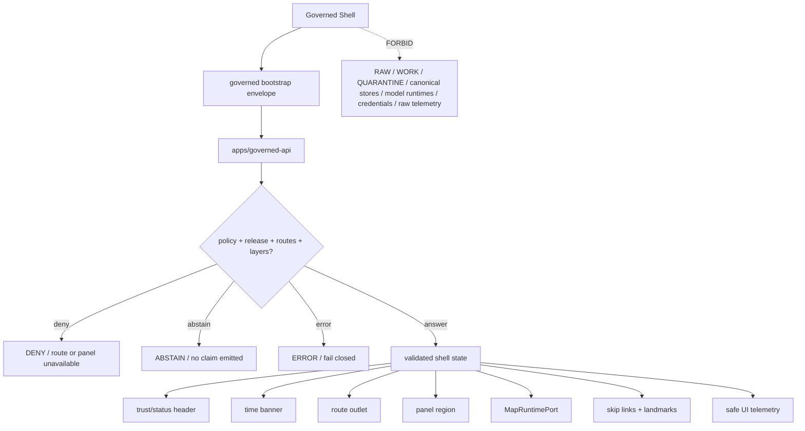

<!-- [KFM_META_BLOCK_V2]
doc_id: kfm://app/explorer-web/src/features/shell/readme
title: Explorer Web Shell Feature README
type: app-readme
version: v0.2
status: draft
owners: OWNER_TBD — Apps steward · UI steward · Shell steward · Map steward · Governed API steward · Policy steward · Accessibility steward · Telemetry steward · Docs steward
created: 2026-06-16
updated: 2026-07-09
policy_label: public
related:
  - ../README.md
  - ../../README.md
  - ../../adapters/README.md
  - ../../../README.md
  - ../../../../README.md
  - ../../../../governed-api/README.md
  - ../../../../../docs/doctrine/directory-rules.md
  - ../../../../../docs/architecture/ui/README.md
  - ../../../../../docs/architecture/ui/GOVERNED_SHELL.md
  - ../../../../../docs/architecture/ui/MAP_RUNTIME_BOUNDARY.md
  - ../../../../../docs/architecture/ui/LAYERING.md
  - ../../../../../docs/architecture/ui/EVIDENCE_DRAWER.md
  - ../../../../../docs/architecture/ui/ACCESSIBILITY.md
  - ../../../../../docs/architecture/ui/TELEMETRY.md
  - ../../../../../docs/architecture/ui/STATE_OWNERSHIP.md
  - ../../../../../docs/architecture/governed-ai/FOCUS_FLOW.md
  - ../../../../../packages/ui/README.md
  - ../../../../../packages/maplibre/README.md
  - ../../../../../policy/access/README.md
  - ../../../../../policy/decision/README.md
  - ../../../../../policy/telemetry/README.md
  - ../../../../../release/README.md
  - ../../../../../data/README.md
tags: [kfm, apps, explorer-web, features, shell, governed-shell, map-first, trust-header, time-banner, route-outlet, panel-region, finite-outcomes, bootstrap-gate]
notes:
  - "Replaces the greenfield Shell feature stub with a governed feature README."
  - "Shell UI features may compose the persistent Explorer Web frame, but they must not become renderer authority, evidence resolver, policy engine, source registry, release authority, telemetry payload authority, model client, feature-flag authority, or lifecycle/canonical data path."
  - "Feature implementation files, route wiring, tests, fixtures, governed API envelopes, shell state contracts, bootstrap handling, route outlet behavior, panel-region behavior, accessibility behavior, telemetry policy wiring, and package scripts remain NEEDS VERIFICATION."
  - "policy/telemetry/README.md currently exists as a greenfield bundle stub; executable telemetry policy wiring remains NEEDS VERIFICATION."
  - "v0.2 refreshes the evidence basis, aligns truth posture with current GitHub evidence, adds a minimum safe implementation slice, adds runtime anti-bypass checks, and strengthens bootstrap, trust-header, time-banner, renderer-boundary, accessibility, route-slot, and telemetry review gates without claiming runtime maturity."
[/KFM_META_BLOCK_V2] -->

<a id="top"></a>

<div align="center">

# Explorer Web Shell Feature

`apps/explorer-web/src/features/shell/`

**App-local Explorer Web feature boundary for the governed shell: persistent map-first layout, trust/status header, time banner, route outlet, panel region, skip links, shell bootstrap state, finite outcome framing, accessibility scaffolding, telemetry safeguards, and safe composition of Layer Catalog, Evidence Drawer, Focus Panel, Story, Review, Compare, Export, Settings, and Diagnostics.**


[Evidence](#0-evidence-basis-for-this-revision) · [Purpose](#1-purpose) · [Repo fit](#2-repo-fit) · [Boundary](#3-authority-boundary) · [Inputs](#5-inputs) · [Exclusions](#6-exclusions) · [Feature map](#7-shell-feature-map) · [Minimum slice](#8-minimum-safe-implementation-slice) · [Definition of done](#16-definition-of-done)

</div>

---

> [!IMPORTANT]
> **Status:** draft / `NEEDS VERIFICATION`  
> **Owners:** `OWNER_TBD` — Apps steward · UI steward · Shell steward · Map steward · Governed API steward · Policy steward · Accessibility steward · Telemetry steward · Docs steward  
> **Path:** `apps/explorer-web/src/features/shell/README.md`  
> **Responsibility root:** `apps/` — deployable application surfaces  
> **Directory Rules basis:** deployable application feature code belongs under `apps/`; Shell is an app-local UI composition surface, not a renderer package, evidence resolver, policy home, schema home, contract home, publication authority, source registry, feature-flag authority, telemetry policy home, model runtime, tile host, or lifecycle-data lane.  
> **Truth posture:** CONFIRMED current GitHub README path / CONFIRMED parent feature-boundary README posture / CONFIRMED GovernedShell architecture doc exists / CONFIRMED Map Runtime Boundary doc exists / CONFIRMED Accessibility and UI Telemetry docs exist / CONFIRMED `policy/telemetry/README.md` exists as greenfield stub / PROPOSED feature contract / UNKNOWN implementation files, route wiring, tests, fixtures, schemas, package scripts, governed API envelopes, shell state contracts, bootstrap handling, route outlet behavior, panel-region behavior, accessibility behavior, telemetry policy wiring, and runtime behavior

> [!CAUTION]
> The Shell is the public frame, not the source of truth. It may host trust-visible UI, but it must never fetch RAW, WORK, QUARANTINE, canonical stores, graph/vector stores, object stores, unpublished candidates, model runtimes, credentials, or internal service handles. It renders governed API outcomes and released or bounded-safe payloads only.

---

## Quick jump

- [0. Evidence basis for this revision](#0-evidence-basis-for-this-revision)
- [1. Purpose](#1-purpose)
- [2. Repo fit](#2-repo-fit)
- [3. Authority boundary](#3-authority-boundary)
- [4. Default posture](#4-default-posture)
- [5. Inputs](#5-inputs)
- [6. Exclusions](#6-exclusions)
- [7. Shell feature map](#7-shell-feature-map)
- [8. Minimum safe implementation slice](#8-minimum-safe-implementation-slice)
- [9. Diagram](#9-diagram)
- [10. Shell UI obligations](#10-shell-ui-obligations)
- [11. Per-module contract](#11-per-module-contract)
- [12. Runtime anti-bypass matrix](#12-runtime-anti-bypass-matrix)
- [13. Inspection path](#13-inspection-path)
- [14. Validation expectations](#14-validation-expectations)
- [15. Safe change pattern](#15-safe-change-pattern)
- [16. Definition of done](#16-definition-of-done)
- [17. Open verification items](#17-open-verification-items)

---

## 0. Evidence basis for this revision

This README is a documentation boundary, not runtime proof. The 2026-07-09 revision updates an existing README and keeps implementation maturity bounded while aligning the feature contract with current repository evidence.

| Evidence item | Status | What it supports | What it does not prove |
|---|---|---|---|
| `apps/explorer-web/src/features/shell/README.md` exists on `main`. | CONFIRMED | This is an existing README update, not a new path proposal. | It does not prove shell components, hooks, routes, tests, fixtures, schemas, bootstrap handling, route outlet behavior, panel-region behavior, or runtime behavior exist. |
| `apps/explorer-web/src/features/README.md` exists and defines feature modules as UI composition surfaces. | CONFIRMED | Shell belongs under the Explorer Web feature boundary when it is app-local UI composition. | It does not prove Shell is wired into routes or launch surfaces. |
| `docs/doctrine/directory-rules.md` confirms `apps/` as the deployable-application responsibility root. | CONFIRMED | The target path is within the correct responsibility root for app-local feature code. | It does not decide whether the feature is complete or release-ready. |
| `docs/architecture/ui/GOVERNED_SHELL.md` exists and defines GovernedShell doctrine. | CONFIRMED document presence and doctrine posture | Shell must preserve map-first persistence, trust/status header, time banner, route outlet, panel region, skip links, governed API, and finite outcomes. | It does not prove implementation, route tree, framework version, schemas, or tests. |
| `docs/architecture/ui/MAP_RUNTIME_BOUNDARY.md` exists and defines the renderer boundary. | CONFIRMED document presence and doctrine posture | Shell must consume `MapRuntimePort` and avoid direct renderer imports. | It does not prove import allowlists, adapter wiring, or tests. |
| `docs/architecture/ui/ACCESSIBILITY.md` exists as accessibility architecture doctrine. | CONFIRMED document presence and doctrine posture | Shell accessibility scaffolding must keep trust-visible state perceivable and operable. | It does not prove Shell accessibility implementation or tests. |
| `docs/architecture/ui/TELEMETRY.md` exists and defines safe UI telemetry posture. | CONFIRMED document presence and doctrine posture | Shell telemetry must remain safe, structured, non-authoritative, and downstream of trust. | It does not prove telemetry route, schema, policy, or validators. |
| `policy/telemetry/README.md` exists as a greenfield bundle stub. | CONFIRMED placeholder state | Telemetry policy wiring must remain `NEEDS VERIFICATION`. | It does not prove executable telemetry policy bundles or runtime wiring exist. |

[Back to top](#top)

---

## 1. Purpose

`apps/explorer-web/src/features/shell/` is the proposed app-local feature boundary for the persistent governed shell inside Explorer Web.

It may eventually hold route modules, layout components, state bridges, finite-state renderers, bootstrap handlers, trust-header slots, time-banner slots, route outlets, panel-region orchestration, accessibility scaffolding, telemetry guards, and feature orchestration for:

- persistent map-first layout that survives route transitions where accepted by the shell contract;
- trust/status header displaying release state, stale/degraded state, policy posture, review state, correction lineage, citation state, and active route/layer status;
- time banner displaying valid time, observed time, source time, retrieval time, release time, correction time, freshness, and time-scope labels where material;
- route outlet for Explore, Dossier, Story, Focus, Review, Compare, Export, Settings, Diagnostics, and domain panels;
- panel region for Layer Catalog, Evidence Drawer, Focus Panel, Review Console, Compare, Export, Settings, and Diagnostics;
- bootstrap envelope consumption before consequential rendering;
- governed client boundary, response validation, route availability, and finite outcome framing;
- accessibility scaffolding: skip links, landmarks, keyboard paths, focus-visible behavior, reduced motion, contrast tokens, non-map alternatives, and non-color trust labels;
- safe shell telemetry that records UI events without raw evidence, prompts, model outputs, feature geometry, secrets, or restricted payloads.

This directory is not proof that any shell component, route, hook, state store, adapter, schema, fixture, test, package script, governed API route, bootstrap flow, route outlet behavior, panel-region behavior, telemetry behavior, or accessibility behavior is implemented.

[Back to top](#top)

---

## 2. Repo fit

| Concern | Owning root | Expected relationship |
|---|---|---|
| Shell feature source | `apps/explorer-web/src/features/shell/` | App-local governed shell modules, if implemented and tested |
| Feature boundary | `apps/explorer-web/src/features/` | Parent feature/root contract |
| Adapter boundary | `apps/explorer-web/src/adapters/` | Governed API, evidence, layer, map, export, diagnostics, and settings adapters |
| Explorer Web app | `apps/explorer-web/` | Map-first public/semi-public shell |
| Governed API | `apps/governed-api/` | Trust membrane and normal bootstrap/runtime payload path |
| GovernedShell doctrine | `docs/architecture/ui/GOVERNED_SHELL.md` | Persistent shell, trust header, time banner, finite outcome, and bootstrap doctrine |
| UI architecture | `docs/architecture/ui/README.md` | UI subsystem doctrine and feature-surface list |
| Map Runtime doctrine | `docs/architecture/ui/MAP_RUNTIME_BOUNDARY.md` | Renderer adapter boundary consumed by shell |
| Layering doctrine | `docs/architecture/ui/LAYERING.md` | Layer descriptor, manifest, lifecycle, and trust-badge posture |
| Accessibility doctrine | `docs/architecture/ui/ACCESSIBILITY.md` | Shell accessibility, keyboard, focus, non-map alternatives, and trust-visible state posture |
| Telemetry doctrine | `docs/architecture/ui/TELEMETRY.md` | Safe UI telemetry expectations |
| Telemetry policy | `policy/telemetry/` | Current repo has greenfield stub; executable telemetry policy remains `NEEDS VERIFICATION` |
| Shared UI components | `packages/ui/` | Reusable shell layout, banners, badges, cards, skip links, and accessibility primitives when shared |
| Renderer wrapper | `packages/maplibre/` | Renderer implementation stays behind adapter boundaries |
| Policy gates | `policy/` | Access, sensitivity, rights, telemetry, release, and decision policy |
| Release authority | `release/` | Publication, correction, supersession, rollback control |
| Lifecycle artifacts | `data/` | Receipts, proofs, registry, catalog, triplets, and published artifacts; not browser-readable directly |
| Contracts and schemas | `contracts/`, `schemas/contracts/v1/` | Object meaning and machine shape; this feature references, not owns |

## 3. Authority boundary

This feature composes the governed shell frame. It does not own renderer implementation, evidence resolution, citation validation, policy decisions, sensitivity decisions, release decisions, source admission, layer publication, model invocation, telemetry payload content, feature-flag authority, schemas, contracts, lifecycle artifacts, canonical stores, graph/vector stores, audit truth, or AI output.

```text
apps/explorer-web/src/features/shell/ = app-local governed shell feature
apps/explorer-web/src/features/       = feature boundary
apps/explorer-web/src/adapters/       = adapter boundary
apps/governed-api/                    = trust membrane and bootstrap/runtime path
docs/architecture/ui/GOVERNED_SHELL.md = shell trust and finite-outcome doctrine
docs/architecture/ui/MAP_RUNTIME_BOUNDARY.md = renderer-boundary doctrine
docs/architecture/ui/ACCESSIBILITY.md = accessibility architecture doctrine
docs/architecture/ui/TELEMETRY.md     = telemetry architecture doctrine
policy/telemetry/                     = telemetry policy lane; current stub only
packages/ui/                          = shared UI primitives
packages/maplibre/                    = renderer helper/wrapper boundary
policy/                               = finite policy decisions
schemas/contracts/v1/                 = machine-readable shape
contracts/                            = object meaning
data/                                 = lifecycle artifacts, receipts, proofs, registries
release/                              = publication, correction, rollback authority
```

## 4. Default posture

Shell feature modules should fail closed, establish trust state before consequential rendering, and preserve mandatory trust, time, accessibility, policy, and release signals.

A Shell path should not render consequential route, layer, claim, export, review, Focus, Story, or diagnostic content when any of these are unresolved:

- governed bootstrap envelope and response validation;
- route availability, feature flag, policy posture, and allowed layer state;
- release state, stale/degraded state, review state, correction lineage, citation state, and rollback posture;
- time banner state, including valid time, observed time, source time, retrieval time, release time, correction time, and freshness where material;
- route outlet boundaries, panel slot ownership, and feature handoff contracts;
- MapRuntimePort and renderer adapter boundary;
- Evidence Drawer, Layer Catalog, Focus, Story, Review, Compare, Export, Settings, Diagnostics, or domain panel handoff contracts;
- finite outcome rendering for `ANSWER`, `ABSTAIN`, `DENY`, `ERROR`, and review/validator-only `HOLD`, `PASS`, `FAIL` where applicable;
- accessibility scaffolding for skip links, landmarks, keyboard paths, focus, contrast, reduced motion, non-map alternatives, and non-color labels;
- safe telemetry posture.

## 5. Inputs

| Input family | Examples | Required posture |
|---|---|---|
| Bootstrap state | available routes, feature flags, allowed layers, policy posture, shell config | Governed bootstrap projection only |
| Route state | route id, active panel, domain, selected feature, selected layer, query params | Validated and bounded |
| Trust header state | release, stale/degraded, review, correction, rollback, policy posture, citation posture | Visible at point of use |
| Time banner state | valid time, observed time, freshness, source/retrieval/release/correction time | Time-kind anti-collapse |
| Panel state | layer catalog, evidence drawer, focus, story, review, compare, export, settings, diagnostics | Slot-owned and finite-state aware |
| Map state | MapRuntimePort readiness, camera, selected layer refs, click candidates | Renderer boundary preserved |
| API envelope | `BootstrapEnvelope`, `DecisionEnvelope`, `RuntimeResponseEnvelope`, errors | Runtime-validated before render |
| UI state | loading, ready, denied, abstained, stale, hold, degraded, invalid, conflict, error | Finite and tested states |
| Accessibility state | skip links, landmarks, focus behavior, keyboard map alternatives, reduced motion | Required for public shell |
| Telemetry state | shell loaded, route changed, panel opened, denied shown, bootstrap failed | Non-secret, policy-safe, no raw evidence/prompts/model outputs/restricted geometry |

## 6. Exclusions

| Does not belong here | Correct home |
|---|---|
| Governed API implementation and bootstrap authority | `apps/governed-api/` |
| Renderer implementation or direct MapLibre/plugin imports | `packages/maplibre/`, accepted adapter package, or repo-confirmed runtime package |
| EvidenceBundle construction, citation validation, and Evidence Drawer truth | governed API / evidence resolver / Evidence Drawer feature |
| Policy decisions, sensitivity rules, access control, telemetry policy, or release gates | `policy/`, governed API policy runtime, `release/` |
| Layer publication, layer manifests, source registry editing | `release/`, `data/registry/`, `data/catalog/`, source/layer pipelines |
| Feature-flag authority | Governed bootstrap/config service, not client-side shell convenience logic |
| Model adapter or direct browser-to-model calls | server-side governed AI runtime behind governed API only |
| Raw telemetry payload collection | Forbidden; telemetry must be safe UI telemetry only |
| RAW, WORK, QUARANTINE, canonical stores, graph/vector stores, object stores, unpublished candidates | Forbidden from browser Shell path |
| Changing required trust badges, finite outcomes, correction/rollback labels, policy labels, time labels, or citations | Forbidden from shell convenience logic |
| Shared reusable UI primitives | `packages/ui/` |
| Schemas and contracts | `schemas/contracts/v1/ui/`, `schemas/contracts/v1/governance/`, `contracts/` — exact homes `NEEDS VERIFICATION` |
| Lifecycle artifacts, receipts, proofs, published artifacts | `data/` |
| Secrets, credentials, tokens, private keys | Secret manager / deployment environment |

## 7. Shell feature map

Exact modules remain `NEEDS VERIFICATION`. Candidate modules should be introduced only with route inventory, fixtures, tests, and accepted shell state contracts.

| Candidate module | Purpose | Required safeguard | Status |
|---|---|---|---|
| `governed-shell` | Persistent layout, header, time banner, route outlet, panel region | Bootstrap-gated render | PROPOSED |
| `bootstrap-gate` | Load and validate bootstrap before consequential render | Fails closed on invalid envelope | PROPOSED |
| `trust-header` | Release, stale, review, correction, policy, citation state | Required trust labels cannot be hidden | PROPOSED |
| `time-banner` | Valid/observed/source/retrieval/release/correction/freshness display | Time-kind anti-collapse | PROPOSED |
| `route-outlet` | Route-family composition inside shell | Route contract and finite state | PROPOSED |
| `panel-region` | Layer/Evidence/Focus/Story/Review/Compare/Export/Settings/Diagnostics slots | Slot ownership, no arbitrary children | PROPOSED |
| `skip-links-landmarks` | Keyboard and screen-reader shell navigation | Accessibility tests | PROPOSED |
| `shell-outcome-renderer` | Render `ANSWER`, `ABSTAIN`, `DENY`, `ERROR`, `HOLD` consistently | Closed finite outcome set | PROPOSED |
| `safe-telemetry-events` | Record non-content shell UI events | No raw evidence, prompts, model outputs, restricted geometry | PROPOSED |
| `shell-state-provider` | Bounded shell state and route/panel coordination | No lifecycle/canonical storage | PROPOSED |
| `handoff-registry` | Coordinate feature handoffs without authority collapse | Governed refs only | PROPOSED |

> [!WARNING]
> Candidate module names are not implementation proof. Do not document a Shell module as runnable until files, route wiring, tests, fixtures, package scripts, governed API envelopes, shell state contracts, bootstrap validation, route outlet behavior, panel-region behavior, telemetry constraints, and accessibility fixtures confirm it.

## 8. Minimum safe implementation slice

A smallest useful Shell slice should prove the trust membrane before adding full route breadth.

| Slice item | Minimum requirement | Why it is required |
|---|---|---|
| Bootstrap gate | Validate governed bootstrap envelope before consequential route/panel render | Prevents unknown shell state from becoming UI truth |
| Finite outcome frame | Shell can render `ANSWER`, `ABSTAIN`, `DENY`, `ERROR`, plus review/validator-only outcomes where applicable | Prevents silent fallback states |
| Trust header | Release, stale/degraded, policy, review, correction, rollback, and citation posture remain visible where material | Keeps trust visible at point of use |
| Time banner | Distinct time-kind labels are preserved | Prevents temporal truth collapse |
| Route outlet contract | Route availability and feature flags come from governed bootstrap/policy state | Prevents client-side route authority |
| Panel slot contract | Panels mount only through named slots with governed refs | Prevents arbitrary child authority collapse |
| Renderer boundary | Shell consumes `MapRuntimePort`; it does not import renderer runtime APIs | Keeps renderer downstream of trust |
| Handoff boundary | Layer Catalog, Evidence Drawer, Focus, Story, Review, Compare, Export, Settings, Diagnostics, and domains receive governed refs only | Prevents raw payload leakage |
| Accessibility scaffold | Skip links, landmarks, focus, keyboard path, reduced motion, non-map alternatives, and non-color labels are present | Makes governed truth usable |
| Safe telemetry guard | Emit non-secret event metadata only | Prevents telemetry side channel |
| Lifecycle denial test | Prove browser code does not import/read lifecycle roots, canonical stores, graph stores, vector stores, or model runtimes | Preserves public-client boundary |

This slice is still `PROPOSED` until files, fixtures, tests, route wiring, and accepted contracts are verified.

## 9. Diagram



## 10. Shell UI obligations

| Obligation | Example effect |
|---|---|
| `bootstrap_before_render` | Invalid or partial bootstrap renders `ERROR`; no consequential route proceeds |
| `governed_api_only` | Shell trust payloads come through governed client envelopes only |
| `persistent_map_first` | Map region and time banner remain stable across route transitions where implemented |
| `trust_visible_header` | Release, stale/degraded, policy, review, citation, correction, and rollback state remain visible |
| `time_kind_visible` | Valid/source/observed/retrieval/release/correction/freshness time labels remain distinct where material |
| `finite_states_required` | `ANSWER`, `ABSTAIN`, `DENY`, `ERROR`, and review/validator-specific finite states are explicit |
| `renderer_adapter_boundary` | Shell speaks to `MapRuntimePort`; it never imports renderer APIs directly |
| `no_browser_model_client` | Shell never calls model providers or model runtimes directly |
| `safe_telemetry_only` | Shell telemetry never includes prompts, raw evidence, model outputs, restricted geometry, secrets, or full bundle copies |
| `accessibility_scaffold_required` | Skip links, landmarks, focus-visible behavior, keyboard paths, non-map alternatives, and reduced-motion behavior are first-class |
| `route_flags_readonly` | Feature flags and route availability reflect governed bootstrap/policy state only |
| `no_authority_fork` | Shell code does not redefine evidence, citation, policy, release, schema, contract, source, renderer, telemetry, or model authority |

## 11. Per-module contract

Every long-lived Shell module should document or encode:

- whether it is layout, state owner, route outlet, panel slot, trust header, time banner, accessibility scaffold, bootstrap gate, handoff coordinator, or outcome renderer;
- governed API envelope dependency, if any;
- bootstrap, route, feature flag, policy, and panel state behavior;
- finite outcome and negative-state behavior;
- release, review, correction, rollback, freshness, policy, citation, and time-kind behavior;
- MapRuntimePort, Evidence Drawer, Focus, Story, Review, Compare, Export, Settings, Diagnostics, Layer Catalog, and domain handoffs;
- accessibility behavior for skip links, landmarks, keyboard navigation, focus management, reduced motion, contrast, non-map alternatives, and non-color trust badges;
- telemetry emitted, if any;
- tests and fixtures proving trust-membrane, bootstrap, route, panel, renderer-boundary, no-browser-model, route-flag-readonly, safe-telemetry, and accessibility constraints.

## 12. Runtime anti-bypass matrix

| Bypass risk | Required behavior | Review signal |
|---|---|---|
| Shell renders consequential route before bootstrap validation | Render `ERROR`, loading, denied, or unavailable state only | Invalid-bootstrap fixture blocks route/panel render |
| Required trust header hidden by route/settings | Preserve required labels outside route-owned content | Trust-header fixture stays visible across routes |
| Time kinds collapse into one display date | Preserve distinct time labels where material | Time-banner fixture keeps valid/source/observed/retrieval/release/correction/freshness distinct |
| Shell imports renderer APIs directly | Route through `MapRuntimePort` and accepted adapter only | Import scan proves renderer imports are isolated |
| Browser reads lifecycle/canonical data directly | Deny at import/build/test review; route through governed API | No direct `data/`, canonical, graph, vector, or object-store imports/fetches |
| Feature flags become client authority | Treat feature flags as read-only bootstrap/policy projection | No local feature flag mutation path |
| Panel receives raw payload instead of governed refs | Pass governed refs/envelopes only | Handoff fixture excludes raw payloads |
| Telemetry captures prompt/evidence/geometry/model output | Emit non-secret event metadata only | Telemetry fixture excludes raw prompts, evidence, model outputs, restricted geometry, secrets |
| Model output changes shell truth state | Model output may appear only through governed Focus/AI envelopes; no shell authority mutation | Shell state does not depend on model text |

## 13. Inspection path

Shell implementation files, route wiring, tests, fixtures, governed API envelopes, shell state contracts, bootstrap handling, route outlet behavior, panel-region behavior, accessibility behavior, telemetry policy wiring, package scripts, and downstream feature handoffs remain `NEEDS VERIFICATION`.

```bash
find apps/explorer-web/src/features/shell -maxdepth 5 -type f | sort
find apps/explorer-web/src apps/governed-api docs/architecture/ui docs/architecture/governed-ai packages/ui packages/maplibre packages/maplibre-runtime schemas contracts policy release data tests fixtures -maxdepth 6 -type f 2>/dev/null | grep -Ei 'shell|GovernedShell|BootstrapEnvelope|DecisionEnvelope|RuntimeResponseEnvelope|MapRuntimePort|TimeState|trust.?header|time.?banner|route.?outlet|panel.?region|skip.?links|accessibility|a11y|telemetry|release|rollback|correction|feature.?flag|bootstrap|handoff' | sort
find data/raw data/work data/quarantine data/processed data/catalog data/triplets data/published data/receipts data/proofs -maxdepth 2 -type f 2>/dev/null | sort
```

## 14. Validation expectations

Useful validation for this feature boundary should cover:

- no Shell feature imports or reads lifecycle/canonical data roots directly;
- no browser-side model runtime calls or provider SDK use;
- Shell trust payloads consume governed API envelopes only;
- invalid bootstrap renders `ERROR`, `DENY`, `ABSTAIN`, or unavailable and prevents consequential route/panel render;
- finite outcomes render consistently and cannot silently downgrade into another lane;
- required trust header labels cannot be hidden by route, settings, or feature convenience;
- time-kind fields stay distinct where material;
- renderer APIs are not imported by shell code;
- route outlet and panel region preserve slot ownership;
- feature flags and route availability are read-only bootstrap/policy projections;
- handoffs carry governed refs/envelopes only, not raw payloads;
- telemetry never includes raw prompts, raw evidence, model outputs, restricted geometry, secrets, full manifests, or full EvidenceBundle copies;
- accessibility tests cover skip links, landmarks, keyboard route navigation, focus management, reduced motion, contrast, non-map alternatives, and non-color trust badges.

## 15. Safe change pattern

For Shell feature changes:

1. Add or update shell module inventory and per-module contract.
2. Add fixtures for valid bootstrap, invalid bootstrap, route denied, route unavailable, panel denied, stale state, correction state, rollback state, feature-flag-readonly, trust-header-required, time-kind-preserved, telemetry-denied, loading, empty, conflict, and error states.
3. Test lifecycle/canonical-data denial, no-browser-model behavior, governed API-only behavior, renderer import isolation, route-flag read-only behavior, handoff ref-only behavior, and safe telemetry behavior.
4. Preserve release state, stale/degraded state, policy posture, review state, citation state, correction lineage, rollback refs, citations, time-kind labels, route state, panel state, and accessibility state through UI composition.
5. Test keyboard/screen-reader/reduced-motion paths before claiming shell usability.
6. Update this README, parent `features/README.md`, GovernedShell docs, UI README, Map Runtime Boundary docs, Accessibility docs, Telemetry docs, telemetry policy docs, and parent app README when public behavior changes.

## 16. Definition of done

- [ ] Owners are confirmed and `OWNER_TBD` is replaced.
- [ ] Evidence basis is refreshed when parent README, GovernedShell docs, Map Runtime Boundary docs, Accessibility docs, Telemetry docs, telemetry policy, governed API, schema, release, telemetry, or fixture evidence changes.
- [ ] Shell feature file inventory and route/module ownership are documented.
- [ ] Governed API and adapter dependencies are explicit.
- [ ] Bootstrap schema/contract and fixtures are verified.
- [ ] Shell finite outcomes and negative states are represented in UI fixtures.
- [ ] Direct lifecycle/canonical-data import/read checks are covered.
- [ ] Browser model-runtime denial is tested.
- [ ] Renderer import isolation is tested.
- [ ] Trust header and time banner cannot be silently hidden on consequential routes.
- [ ] Time-kind preservation is tested.
- [ ] Feature flags and route availability are tested as read-only bootstrap/policy projections.
- [ ] Route outlet and panel-region slot ownership are tested.
- [ ] Layer Catalog, Evidence Drawer, Focus, Story, Review, Compare, Export, Settings, Diagnostics, Domains, and Map Runtime handoffs are tested for safe governed refs if present.
- [ ] Safe telemetry constraints are tested.
- [ ] Accessibility behavior is tested for skip links, landmarks, keyboard, focus, ARIA, reduced motion, contrast, non-map alternatives, and non-color badges.

## 17. Open verification items

| Item | Why it matters |
|---|---|
| Confirm Shell implementation files beyond README | Prevents overclaiming feature maturity |
| Confirm route inventory and launch surfaces | Required for UI boundary review |
| Confirm governed API bootstrap endpoint or equivalent | Required for trust membrane enforcement |
| Confirm shell/bootstrap schemas and fixtures | Required before shell behavior claims |
| Confirm trust header and time banner implementation | Required before public shell claims |
| Confirm route outlet and panel region ownership | Required before feature composition claims |
| Confirm no-browser-model tests | Required to protect governed-AI boundary |
| Confirm renderer import isolation | Required to protect MapRuntime boundary |
| Confirm feature flags and routes are governed bootstrap projections | Required before route-visibility claims |
| Confirm safe telemetry behavior and `policy/telemetry/` wiring beyond stub | Required before diagnostics/observability claims |
| Confirm accessibility tests | Required because the shell is the primary accessibility scaffold |
| Confirm package scripts beyond TODO | Required before build/test claims |
| Confirm architecture-doc links and relative paths after recursive inventory | Required before treating all related paths as current implementation evidence |

<details>
<summary>Appendix A — no-loss preservation note</summary>

The previous README already contained a strong bounded Shell feature contract. This revision preserves that contract, refreshes metadata, adds a current evidence-basis section, strengthens bootstrap, trust-header, time-banner, route-slot, panel-slot, renderer-boundary, telemetry, accessibility, and anti-bypass safeguards, and keeps implementation claims bounded. It does not claim shell components, routes, hooks, adapters, fixtures, tests, package scripts, governed API envelopes, schemas, bootstrap behavior, state ownership, accessibility behavior, telemetry behavior, route outlet behavior, panel-region behavior, or downstream handoffs are implemented.

</details>

## Status summary

`apps/explorer-web/src/features/shell/` should contain Shell feature modules only after route contracts, governed API bootstrap envelopes, schema bindings, negative-state fixtures, renderer-boundary tests, no-browser-model tests, accessibility tests, safe telemetry constraints, route-slot tests, panel-region tests, and downstream handoffs are verified.

It must preserve the trust membrane and shell boundary: Shell may host persistent map-first layout, trust/status header, time banner, route outlet, and panels, but it must not become renderer authority, evidence resolver, policy engine, release authority, citation authority, source registry, lifecycle storage, raw/canonical data path, feature-flag authority, telemetry side channel, model client, or direct model-output surface.

<p align="right"><a href="#top">Back to top</a></p>
