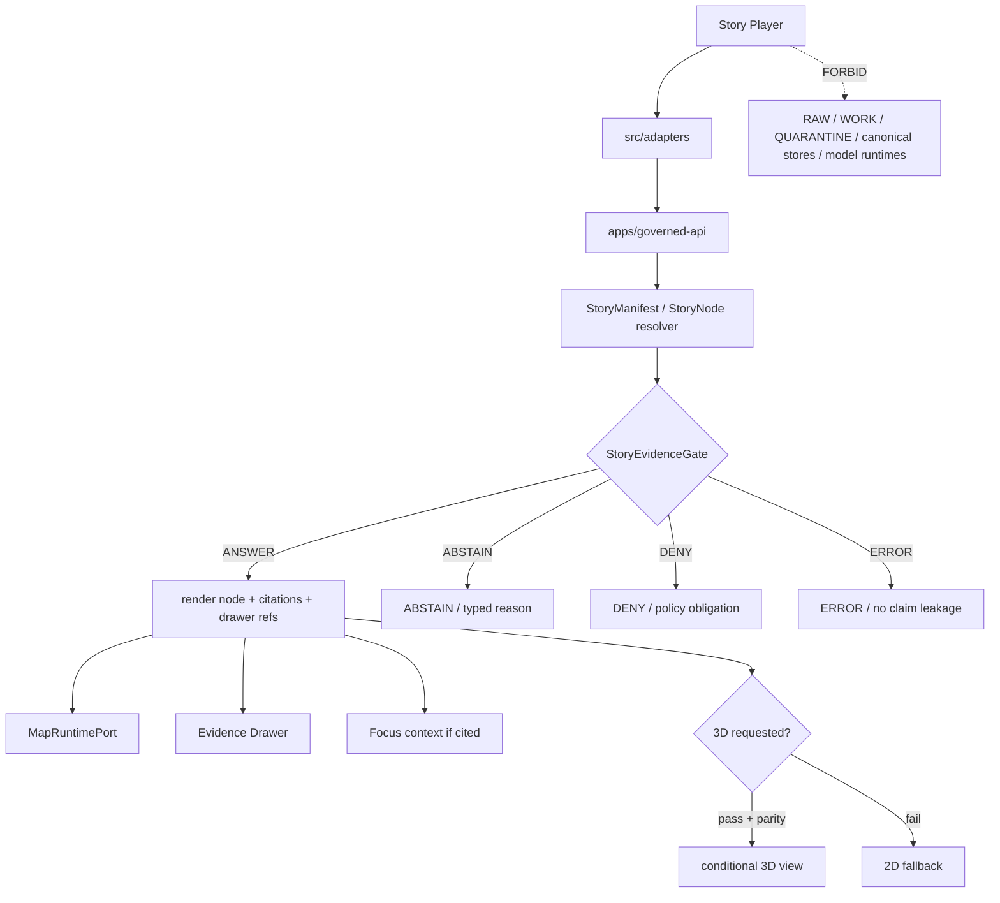

<!-- [KFM_META_BLOCK_V2]
doc_id: kfm://app/explorer-web/src/features/story_player/readme
title: Explorer Web Story Player Feature README
type: app-readme
version: v0.1
status: draft
owners: OWNER_TBD — Apps steward · UI steward · Story steward · Evidence steward · Map steward · Governed API steward · Policy steward · Accessibility steward · Docs steward
created: 2026-06-16
updated: 2026-06-16
policy_label: public
related:
  - ../README.md
  - ../../README.md
  - ../../adapters/README.md
  - ../../../README.md
  - ../../../../README.md
  - ../../../../governed-api/README.md
  - ../../../../../docs/architecture/ui/README.md
  - ../../../../../docs/architecture/ui/STORY_PLAYER.md
  - ../../../../../docs/architecture/ui/GOVERNED_SHELL.md
  - ../../../../../docs/architecture/ui/EVIDENCE_DRAWER.md
  - ../../../../../docs/architecture/ui/MAP_RUNTIME_BOUNDARY.md
  - ../../../../../docs/architecture/ui/LAYERING.md
  - ../../../../../docs/architecture/governed-ai/FOCUS_FLOW.md
  - ../../../../../packages/ui/README.md
  - ../../../../../packages/maplibre/README.md
  - ../../../../../packages/maplibre-runtime/README.md
  - ../../../../../policy/access/README.md
  - ../../../../../policy/decision/README.md
  - ../../../../../policy/story/README.md
  - ../../../../../release/README.md
  - ../../../../../data/README.md
tags: [kfm, apps, explorer-web, features, story-player, story-node, story-manifest, evidence-gate, 2d-first, conditional-3d, finite-outcomes]
notes:
  - "Replaces the greenfield Story Player feature stub with a governed feature README."
  - "This app path uses the requested underscore directory `story_player`; current architecture docs also propose StoryNodePlayer paths under `story/`. This README does not resolve that path naming split."
  - "Story Player UI features may compose released narrative/story envelopes, but they must not author stories, publish story bundles, bypass evidence gates, become renderer authority, hide sensitivity, treat 3D as alternate truth, or render direct model output as truth."
  - "Feature implementation files, route wiring, tests, fixtures, governed API envelopes, StoryManifest/StoryNode schemas, StoryEvidenceGate behavior, 3D runtime probes, accessibility behavior, telemetry, and package scripts remain NEEDS VERIFICATION."
[/KFM_META_BLOCK_V2] -->

<a id="top"></a>

<div align="center">

# Explorer Web Story Player Feature

`apps/explorer-web/src/features/story_player/`

**App-local Explorer Web feature boundary for governed story playback: StoryManifest and StoryNode sequence rendering, map/time/evidence continuity, per-node evidence gates, finite outcomes, 2D-first playback, conditional 3D handoff, Evidence Drawer links, Focus context, export lineage, accessibility-safe narrative motion, and safe telemetry.**


[Purpose](#1-purpose) · [Repo fit](#2-repo-fit) · [Boundary](#3-authority-boundary) · [Inputs](#5-inputs) · [Exclusions](#6-exclusions) · [Feature map](#7-story-player-feature-map) · [Definition of done](#14-definition-of-done)

</div>

---

> [!IMPORTANT]
> **Status:** draft / `NEEDS VERIFICATION`  
> **Owners:** `OWNER_TBD` — Apps steward · UI steward · Story steward · Evidence steward · Map steward · Governed API steward · Policy steward · Accessibility steward · Docs steward  
> **Path:** `apps/explorer-web/src/features/story_player/README.md`  
> **Responsibility root:** `apps/` — deployable application surfaces  
> **Truth posture:** CONFIRMED README path / CONFIRMED Story Player architecture doctrine / PROPOSED feature contract / UNKNOWN implementation files, route wiring, tests, fixtures, schemas, and runtime behavior

> [!CAUTION]
> Story Player is a rendering and orchestration surface, not a truth source. Narrative text, screenshots, animations, rendered features, 3D scenes, camera paths, thumbnails, and Focus excerpts do not outrank EvidenceBundle support, release state, policy, citation closure, or finite outcome gates.

---

## Quick jump

- [1. Purpose](#1-purpose)
- [2. Repo fit](#2-repo-fit)
- [3. Authority boundary](#3-authority-boundary)
- [4. Default posture](#4-default-posture)
- [5. Inputs](#5-inputs)
- [6. Exclusions](#6-exclusions)
- [7. Story Player feature map](#7-story-player-feature-map)
- [8. Diagram](#8-diagram)
- [9. Story Player UI obligations](#9-story-player-ui-obligations)
- [10. Per-module contract](#10-per-module-contract)
- [11. Inspection path](#11-inspection-path)
- [12. Validation expectations](#12-validation-expectations)
- [13. Safe change pattern](#13-safe-change-pattern)
- [14. Definition of done](#14-definition-of-done)
- [15. Open verification items](#15-open-verification-items)

---

## 1. Purpose

`apps/explorer-web/src/features/story_player/` is the proposed app-local feature boundary for Story Player source modules inside Explorer Web.

It may eventually hold route modules, panels, view models, hooks, finite-state renderers, manifest loaders, node playback controls, transition handlers, evidence-gate renderers, 2D/3D fallback controls, receipt displays, and feature orchestration for:

- loading released or fixture-marked `StoryManifest` envelopes through the governed API;
- rendering sequenced `StoryNode` content over the persistent map/time/evidence shell;
- preserving camera, layer, time, drawer, citation, release, correction, and rollback continuity between nodes;
- rendering per-node finite outcomes: `ANSWER`, `ABSTAIN`, `DENY`, and `ERROR`;
- opening Evidence Drawer payloads for consequential claims and trust badges;
- using Focus outputs only as governed, cited, finite-outcome narrative context;
- running 2D playback end-to-end by default;
- entering 3D only when runtime probe, evidence parity, release parity, and accessibility obligations pass;
- displaying reduced-motion, pause, back, forward, skip-to-drawer, exit-story, and non-map alternatives;
- emitting safe telemetry without raw evidence, prompts, exact restricted coordinates, PII, sovereign identifiers, DNA markers, secrets, or internal store handles.

This directory is not proof that any Story Player component, route, hook, adapter, schema, fixture, test, package script, governed API route, manifest resolver, 3D probe, telemetry path, or accessibility behavior is implemented.

[Back to top](#top)

---

## 2. Repo fit

| Concern | Owning root | Expected relationship |
|---|---|---|
| Story Player feature source | `apps/explorer-web/src/features/story_player/` | App-local Story Player modules, if implemented and tested |
| Feature boundary | `apps/explorer-web/src/features/` | Parent feature/root contract |
| Adapter boundary | `apps/explorer-web/src/adapters/` | Governed API, evidence, layer, map, export, diagnostics, and story adapters |
| Explorer Web app | `apps/explorer-web/` | Map-first public/semi-public shell |
| Governed API | `apps/governed-api/` | Trust membrane and normal story-manifest/node-resolution path |
| Story Player doctrine | `docs/architecture/ui/STORY_PLAYER.md` | Story playback, evidence-gate, 2D-first, 3D handoff, telemetry, and validation doctrine |
| Governed Shell doctrine | `docs/architecture/ui/GOVERNED_SHELL.md` | Persistent shell, trust header, time banner, finite outcome, and bootstrap doctrine |
| Evidence Drawer architecture | `docs/architecture/ui/EVIDENCE_DRAWER.md` | Proof inspection and evidence handoff posture |
| Map Runtime doctrine | `docs/architecture/ui/MAP_RUNTIME_BOUNDARY.md` | Renderer adapter boundary consumed by story playback |
| Story policy | `policy/story/` | Story admission/exposure policy, if accepted and verified |
| Shared UI components | `packages/ui/` | Reusable story controls, cards, badges, timelines, drawers, and accessibility primitives when shared |
| Renderer wrappers | `packages/maplibre/`, `packages/maplibre-runtime/` | Renderer behavior stays behind adapter/wrapper boundaries |
| Policy gates | `policy/` | Access, sensitivity, rights, release, and decision policy |
| Release authority | `release/` | Publication, correction, supersession, rollback control |
| Lifecycle artifacts | `data/` | Receipts, proofs, registry, catalog, story manifests, published artifacts; not browser-readable directly |

## 3. Authority boundary

This feature renders governed story playback. It does not own story authoring, story publication, evidence truth, StoryManifest schemas, StoryNode schemas, StoryEvidenceGate schema authority, policy decisions, sensitivity decisions, release decisions, source admission, citation validation, renderer implementation, model invocation, export receipts, telemetry truth, lifecycle artifacts, canonical stores, or AI output.

```text
apps/explorer-web/src/features/story_player/ = app-local Story Player UI feature
apps/explorer-web/src/features/              = feature boundary
apps/explorer-web/src/adapters/              = adapter boundary
apps/governed-api/                           = trust membrane and story-resolution path
docs/architecture/ui/STORY_PLAYER.md         = Story Player doctrine
schemas/contracts/v1/story/                  = Story machine shapes, if present and accepted
contracts/story/                             = Story object semantics, if present and accepted
packages/ui/                                 = shared UI primitives
packages/maplibre*/                          = renderer implementation/wrapper boundary, if verified
policy/                                      = finite policy decisions
data/                                        = lifecycle artifacts, receipts, proofs, manifests
release/                                     = publication, correction, rollback authority
```

## 4. Default posture

Story Player feature modules should fail closed, run 2D-first, preserve evidence continuity, expose finite outcomes, and never silently turn missing evidence into narrative continuity.

A Story Player path should not render consequential node content when any of these are unresolved:

- governed API envelope and response validation;
- `StoryManifest`, `StoryNode`, `StoryTransition`, or `StoryEvidenceGate` validation;
- node-level EvidenceRef-to-EvidenceBundle closure;
- citation validation, release state, freshness, and rollback support;
- source role, source authority, source rights, and license posture;
- sensitivity, CARE/sovereignty, living-person, DNA/genomic, archaeology, infrastructure, rare-species, or precise-location posture;
- 2D map/time/layer/evidence continuity;
- optional 3D runtime probe, asset checksum, STAC/provenance metadata, accessibility alternate, evidence parity, and release parity;
- Focus output citation and finite-outcome state, if a node uses Focus context;
- Story export lineage, version stamp, correction lineage, and rollback target;
- accessibility state for reduced motion, keyboard playback controls, focus, screen reader state announcements, and non-map alternatives;
- safe telemetry posture.

## 5. Inputs

| Input family | Examples | Required posture |
|---|---|---|
| Story manifest | story id, version, node sequence, required layers, time windows, drawer refs, optional 3D constraints | Governed API projection and schema validation |
| Story node | node id, camera/time/layer state, claims, evidence refs, drawer refs, transition requirements | Evidence-gated before consequential render |
| Story transition | to-next, trigger, timing, easing, evidence-continuity assertion, fallback behavior | No transition when dependency gate fails |
| Evidence gate | node outcome, reason codes, obligations, citation closure summary | Finite and visible |
| Map/time state | camera, bounds, layer refs, valid/observed time, freshness | Persistent shell and time-kind anti-collapse |
| 3D state | runtime probe result, asset refs, checksums, STAC metadata, fallback mode | Optional and conditional; never alternate truth |
| Policy state | rights, sensitivity, CARE/sovereignty, audience, release, review, correction, rollback | Preserved from governed API/policy |
| API envelope | story response, node response, `DecisionEnvelope`, finite outcome | Runtime-validated before render |
| UI state | loading, playing, paused, answered, denied, abstained, error, stale, cancelled, timeout | Finite and tested states |
| Accessibility state | reduced motion, keyboard controls, state announcements, non-map list, focus return | Required for narrative UI |

## 6. Exclusions

| Does not belong here | Correct home |
|---|---|
| Story authoring tools | `docs/architecture/story/`, authoring/admin workflows, not this player feature |
| Story publication, promotion, release, rollback decisions | `release/` |
| Story schemas and contracts | `schemas/contracts/v1/story/`, `contracts/story/` |
| Story policy bundles and policy decisions | `policy/story/`, `policy/decision/`, `policy/` |
| Governed API manifest/node resolver implementation | `apps/governed-api/` |
| EvidenceBundle construction or citation validation | governed API / evidence resolver / validation packages |
| Evidence Drawer payload construction | governed API / Evidence Drawer feature |
| Renderer implementation, 3D plugin admission, or raw MapLibre/plugin imports | `packages/maplibre/`, `packages/maplibre-runtime/`, accepted renderer package |
| Direct browser-to-model calls or Focus synthesis pipeline | server-side governed AI runtime behind governed API only |
| Shared reusable UI primitives | `packages/ui/` |
| Lifecycle artifacts, receipts, proofs, story manifests, and published artifacts | `data/` |
| Sensitive details in public story manifests | Denied, generalized, staged, delayed, or server-dereferenced under policy |
| RAW, WORK, QUARANTINE, canonical stores, graph/vector stores, object stores, unpublished candidates | Forbidden from browser Story Player path |
| Secrets, credentials, tokens, private keys | Secret manager / deployment environment |

## 7. Story Player feature map

Exact modules remain `NEEDS VERIFICATION`. Candidate modules should be introduced only with route inventory, fixtures, and tests.

| Candidate module | Purpose | Required safeguard | Status |
|---|---|---|---|
| `story-player-shell` | Player layout, controls, node panel, finite states | Governed manifest only | PROPOSED |
| `manifest-loader` | Load StoryManifest envelope | Schema validation and release state | PROPOSED |
| `node-renderer` | Render StoryNode narrative, map/time/layer state | Evidence gate required | PROPOSED |
| `story-evidence-gate` | Aggregate claim evidence into node outcome | No evidence, no claim | PROPOSED |
| `transition-controller` | Move between nodes | Blocks dependent nodes on gate failure | PROPOSED |
| `drawer-links` | Open Evidence Drawer for node claims and badges | EvidenceBundle-derived support only | PROPOSED |
| `focus-context-panel` | Show Focus-derived narrative context | Finite outcome and citations required | PROPOSED |
| `conditional-3d-handoff` | Probe and enter 3D when allowed | Evidence/release parity and fallback | PROPOSED |
| `a11y-playback-controls` | Pause/back/forward/exit/reduced motion/non-map alternative | Accessibility tests | PROPOSED |
| `telemetry-safe-events` | Record aggregate node/playback events | No raw evidence, PII, precise restricted coordinates | PROPOSED |

> [!WARNING]
> Candidate module names are not implementation proof. Do not document a Story Player module as runnable until files, route wiring, tests, fixtures, package scripts, governed API envelopes, schemas, evidence gates, 3D probes, and accessibility fixtures confirm it.

## 8. Diagram



## 9. Story Player UI obligations

| Obligation | Example effect |
|---|---|
| `governed_api_only` | Story state comes through governed API envelopes |
| `2d_first` | Player runs fully in 2D; 3D is optional and conditional |
| `evidence_gate_required` | Each consequential node claim must pass EvidenceBundle/citation/release/policy checks |
| `finite_outcomes_required` | `ANSWER`, `ABSTAIN`, `DENY`, and `ERROR` are explicit per node |
| `no_story_authoring` | Player cannot create, edit, approve, publish, or promote story bundles |
| `3d_not_alternate_truth` | 3D consumes same evidence/release/drawer continuity as 2D or falls back/abstains |
| `sensitive_context_only` | Sensitive nodes render generalized context or deny; no precise protected disclosure |
| `focus_context_bounded` | Focus output can appear only with finite outcome and validated citations |
| `accessibility_motion_safe` | Reduced motion, keyboard playback, state announcements, non-map alternatives, and focus safety are first-class |
| `no_authority_fork` | Feature code does not redefine evidence, citation, policy, release, renderer, schema, contract, source, or model authority |

## 10. Per-module contract

Every long-lived Story Player module should document or encode:

- whether it is manifest loading, node rendering, transition control, evidence gate, 3D handoff, playback control, receipt/lineage display, or telemetry;
- governed API envelope dependency;
- StoryManifest/StoryNode/StoryTransition/StoryEvidenceGate schema dependency;
- finite outcome and negative-state behavior;
- EvidenceRef, EvidenceBundle, citation, policy, release, review, correction, rollback, and limitation behavior;
- 2D/3D fallback and evidence-parity behavior;
- Focus context behavior, if present;
- accessibility behavior for reduced motion, keyboard, focus, screen reader announcements, state cards, and non-map alternatives;
- telemetry emitted, if any;
- tests and fixtures proving trust-membrane, evidence gate, finite outcomes, 2D-first, 3D fallback, sensitive disclosure, safe telemetry, and accessibility constraints.

## 11. Inspection path

Story Player implementation files, route wiring, tests, fixtures, governed API envelopes, Story schemas, evidence gates, 3D runtime probes, accessibility behavior, telemetry, package scripts, and downstream handoffs remain `NEEDS VERIFICATION`.

```bash
find apps/explorer-web/src/features/story_player -maxdepth 5 -type f | sort
find apps/explorer-web/src apps/governed-api docs/architecture/ui docs/architecture/story docs/architecture/governed-ai packages/ui packages/maplibre packages/maplibre-runtime schemas contracts policy release data tests fixtures tools -maxdepth 6 -type f 2>/dev/null | grep -Ei 'story|StoryManifest|StoryNode|StoryTransition|StoryEvidenceGate|EvidenceBundle|EvidenceRef|DecisionEnvelope|CitationValidationReport|MapRuntimePort|Focus|3d|runtime.?probe|release|rollback|correction|a11y|accessibility|telemetry' | sort
find data/raw data/work data/quarantine data/processed data/catalog data/triplets data/published data/receipts data/proofs -maxdepth 2 -type f 2>/dev/null | sort
```

## 12. Validation expectations

Useful validation for this feature boundary should cover:

- no Story Player feature imports or reads lifecycle/canonical data roots directly;
- no browser-side model runtime calls or provider SDK use;
- story state consumes governed API envelopes only;
- malformed story manifests render `ERROR`, never partial nodes;
- each consequential claim without EvidenceBundle/citation closure renders `ABSTAIN`;
- policy/sensitivity/rights denial renders `DENY` without protected payload;
- 3D request without runtime probe, evidence parity, release parity, checksums, or accessibility fallback stays in 2D or abstains;
- sensitive nodes do not expose precise coordinates, living-person identifiers, sovereign identifiers, DNA/genomic markers, or restricted infrastructure detail;
- Focus-derived narrative context preserves finite outcome, citations, policy, and limitations;
- telemetry never includes raw evidence, prompt text, exact restricted coordinates, PII, sovereign identifiers, DNA markers, secrets, internal handles, or full bundle copies;
- accessibility tests cover reduced motion, keyboard controls, focus management, screen-reader state announcements, non-map alternatives, and compressed layouts.

## 13. Safe change pattern

For Story Player feature changes:

1. Add or update module inventory and per-module contract.
2. Add fixtures for `ANSWER`, `ABSTAIN`, `DENY`, `ERROR`, missing citation, stale evidence, restricted sensitivity, invalid schema, 3D probe fail, 3D parity fail, reduced-motion, loading, cancelled, timeout, and empty states.
3. Test lifecycle/canonical-data denial, no-browser-model behavior, governed API-only behavior, and renderer import isolation.
4. Preserve story ids, node ids, evidence refs, drawer refs, citation reports, policy state, release refs, freshness, correction lineage, rollback targets, version stamps, and accessibility state through playback.
5. Test keyboard/screen-reader/reduced-motion paths before claiming Story Player usability.
6. Update this README, parent `features/README.md`, Story Player architecture docs, UI README, and parent app README when public behavior changes.

## 14. Definition of done

- [ ] Owners are confirmed and `OWNER_TBD` is replaced.
- [ ] Story Player feature file inventory and route/module ownership are documented.
- [ ] Governed API and adapter dependencies are explicit.
- [ ] StoryManifest, StoryNode, StoryTransition, and StoryEvidenceGate schema bindings are verified.
- [ ] Story finite outcomes and negative states are represented in UI fixtures.
- [ ] Direct lifecycle/canonical-data import/read checks are covered.
- [ ] Browser model-runtime denial is tested.
- [ ] Evidence gate, citation closure, policy denial, and stale evidence states are tested.
- [ ] 2D-first and conditional 3D fallback behavior is tested.
- [ ] Sensitive disclosure denial/generalization is tested.
- [ ] Evidence Drawer, Focus, Export, Map Runtime, and Shell handoffs are tested for safe governed refs if present.
- [ ] Accessibility behavior is tested for reduced motion, keyboard, focus, ARIA, state announcements, non-map alternatives, and non-color badges.

## 15. Open verification items

| Item | Why it matters |
|---|---|
| Confirm Story Player implementation files beyond README | Prevents overclaiming feature maturity |
| Confirm route inventory and launch surfaces | Required for UI boundary review |
| Confirm governed API story manifest/node endpoint or equivalent | Required for trust membrane enforcement |
| Confirm StoryManifest/StoryNode schemas and fixtures | Required before playback behavior claims |
| Confirm `story_player` vs `story` app path decision | Required to avoid parallel feature homes |
| Confirm StoryEvidenceGate finite outcome fixtures | Required before claim-bearing story UI claims |
| Confirm 2D-first and conditional 3D probe/fallback tests | Required before 3D path claims |
| Confirm sensitive-domain policy behavior | Required before public story releases |
| Confirm Evidence Drawer and Focus handoffs | Required before claim-support inspection claims |
| Confirm accessibility tests | Required because narrative motion is high-risk UI |
| Confirm telemetry is safe and non-secret | Required before diagnostics/observability claims |
| Confirm package scripts beyond TODO | Required before build/test claims |

<details>
<summary>Appendix A — no-loss preservation note</summary>

The previous README was a greenfield stub. This replacement adds a bounded Story Player feature contract without claiming story player components, routes, hooks, adapters, fixtures, tests, package scripts, governed API envelopes, schemas, story manifests, evidence gates, 3D probe behavior, accessibility behavior, telemetry behavior, export behavior, Focus handoff, or Evidence Drawer handoff are implemented.

</details>

## Status summary

`apps/explorer-web/src/features/story_player/` should contain Story Player feature modules only after route contracts, governed API story envelopes, schema bindings, negative-state fixtures, evidence-gate tests, 2D-first/3D-fallback tests, accessibility tests, safe telemetry constraints, and downstream handoffs are verified.

It must preserve the trust membrane and story boundary: Story Player may render released, evidence-bearing narrative sequences, but it must not author stories, publish story bundles, bypass evidence gates, treat 3D as alternate truth, hide sensitivity, read lifecycle/canonical stores, call model runtimes, or become a direct model-output surface.

<p align="right"><a href="#top">Back to top</a></p>
