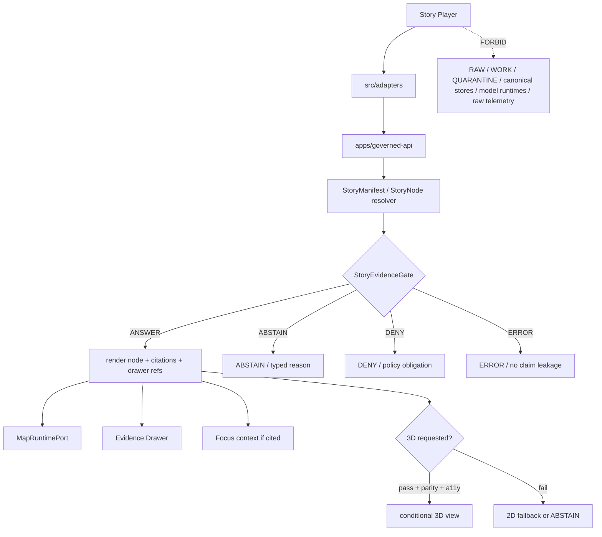

<!-- [KFM_META_BLOCK_V2]
doc_id: kfm://app/explorer-web/src/features/story_player/readme
title: Explorer Web Story Player Feature README
type: app-readme
version: v0.2
status: draft
owners: OWNER_TBD — Apps steward · UI steward · Story steward · Evidence steward · Map steward · Governed API steward · Policy steward · Accessibility steward · Telemetry steward · Docs steward
created: 2026-06-16
updated: 2026-07-09
policy_label: public
related:
  - ../README.md
  - ../../README.md
  - ../../adapters/README.md
  - ../../../README.md
  - ../../../../README.md
  - ../../../../governed-api/README.md
  - ../../../../../docs/doctrine/directory-rules.md
  - ../../../../../docs/architecture/ui/README.md
  - ../../../../../docs/architecture/ui/STORY_PLAYER.md
  - ../../../../../docs/architecture/ui/GOVERNED_SHELL.md
  - ../../../../../docs/architecture/ui/EVIDENCE_DRAWER.md
  - ../../../../../docs/architecture/ui/MAP_RUNTIME_BOUNDARY.md
  - ../../../../../docs/architecture/ui/LAYERING.md
  - ../../../../../docs/architecture/ui/ACCESSIBILITY.md
  - ../../../../../docs/architecture/ui/TELEMETRY.md
  - ../../../../../docs/architecture/governed-ai/FOCUS_FLOW.md
  - ../../../../../packages/ui/README.md
  - ../../../../../packages/maplibre/README.md
  - ../../../../../packages/maplibre-runtime/README.md
  - ../../../../../policy/access/README.md
  - ../../../../../policy/decision/README.md
  - ../../../../../policy/story/README.md
  - ../../../../../release/README.md
  - ../../../../../data/README.md
tags: [kfm, apps, explorer-web, features, story-player, story-node, story-manifest, evidence-gate, 2d-first, conditional-3d, finite-outcomes, narrative-motion]
notes:
  - "Replaces the greenfield Story Player feature stub with a governed feature README."
  - "This app path uses the requested underscore directory `story_player`; current architecture docs also propose StoryNodePlayer paths under `story/`. This README does not resolve that path naming split."
  - "Story Player UI features may compose released narrative/story envelopes, but they must not author stories, publish story bundles, bypass evidence gates, become renderer authority, hide sensitivity, treat 3D as alternate truth, expose protected detail through motion/thumbnails/telemetry, or render direct model output as truth."
  - "Feature implementation files, route wiring, tests, fixtures, governed API envelopes, StoryManifest/StoryNode schemas, StoryEvidenceGate behavior, 3D runtime probes, accessibility behavior, telemetry, and package scripts remain NEEDS VERIFICATION."
  - "policy/story/README.md currently exists as a greenfield bundle stub; executable story policy remains NEEDS VERIFICATION."
  - "packages/maplibre-runtime/README.md was not found on main during this revision, so runtime-package specifics remain NEEDS VERIFICATION."
  - "v0.2 refreshes the evidence basis, aligns truth posture with current GitHub evidence, adds a minimum safe implementation slice, adds runtime anti-bypass checks, and strengthens evidence-gate, 2D-first, conditional-3D, sensitivity, accessibility, telemetry, and path-split review gates without claiming runtime maturity."
[/KFM_META_BLOCK_V2] -->

<a id="top"></a>

<div align="center">

# Explorer Web Story Player Feature

`apps/explorer-web/src/features/story_player/`

**App-local Explorer Web feature boundary for governed story playback: StoryManifest and StoryNode sequence rendering, map/time/evidence continuity, per-node evidence gates, finite outcomes, 2D-first playback, conditional 3D handoff, Evidence Drawer links, Focus context, export lineage, accessibility-safe narrative motion, and safe telemetry.**


[Evidence](#0-evidence-basis-for-this-revision) · [Purpose](#1-purpose) · [Repo fit](#2-repo-fit) · [Boundary](#3-authority-boundary) · [Inputs](#5-inputs) · [Exclusions](#6-exclusions) · [Feature map](#7-story-player-feature-map) · [Minimum slice](#8-minimum-safe-implementation-slice) · [Definition of done](#16-definition-of-done)

</div>

---

> [!IMPORTANT]
> **Status:** draft / `NEEDS VERIFICATION`  
> **Owners:** `OWNER_TBD` — Apps steward · UI steward · Story steward · Evidence steward · Map steward · Governed API steward · Policy steward · Accessibility steward · Telemetry steward · Docs steward  
> **Path:** `apps/explorer-web/src/features/story_player/README.md`  
> **Responsibility root:** `apps/` — deployable application surfaces  
> **Directory Rules basis:** deployable application feature code belongs under `apps/`; Story Player is an app-local UI playback/composition surface, not a story authoring home, story publication authority, evidence resolver, policy home, schema home, contract home, release home, renderer package, source registry, telemetry policy home, model runtime, or lifecycle-data lane.  
> **Truth posture:** CONFIRMED current GitHub README path / CONFIRMED parent feature-boundary README posture / CONFIRMED Story Player architecture doc exists / CONFIRMED GovernedShell, Evidence Drawer, Map Runtime Boundary, Accessibility, and UI Telemetry docs exist / CONFIRMED `policy/story/README.md` exists as greenfield stub / CONFIRMED `packages/maplibre-runtime/README.md` not found on `main` in this revision / PROPOSED feature contract / UNKNOWN implementation files, route wiring, tests, fixtures, schemas, package scripts, governed API envelopes, StoryEvidenceGate behavior, 3D runtime probes, accessibility behavior, telemetry behavior, and runtime behavior

> [!CAUTION]
> Story Player is a rendering and orchestration surface, not a truth source. Narrative text, screenshots, animations, rendered features, 3D scenes, camera paths, thumbnails, Focus excerpts, and telemetry do not outrank EvidenceBundle support, release state, policy, citation closure, or finite outcome gates.

---

## Quick jump

- [0. Evidence basis for this revision](#0-evidence-basis-for-this-revision)
- [1. Purpose](#1-purpose)
- [2. Repo fit](#2-repo-fit)
- [3. Authority boundary](#3-authority-boundary)
- [4. Default posture](#4-default-posture)
- [5. Inputs](#5-inputs)
- [6. Exclusions](#6-exclusions)
- [7. Story Player feature map](#7-story-player-feature-map)
- [8. Minimum safe implementation slice](#8-minimum-safe-implementation-slice)
- [9. Diagram](#9-diagram)
- [10. Story Player UI obligations](#10-story-player-ui-obligations)
- [11. Per-module contract](#11-per-module-contract)
- [12. Runtime anti-bypass matrix](#12-runtime-anti-bypass-matrix)
- [13. Inspection path](#13-inspection-path)
- [14. Validation expectations](#14-validation-expectations)
- [15. Safe change pattern](#15-safe-change-pattern)
- [16. Definition of done](#16-definition-of-done)
- [17. Open verification items](#17-open-verification-items)

---

## 0. Evidence basis for this revision

This README is a documentation boundary, not runtime proof. The 2026-07-09 revision updates an existing README and keeps implementation maturity bounded while aligning the feature contract with current repository evidence.

| Evidence item | Status | What it supports | What it does not prove |
|---|---|---|---|
| `apps/explorer-web/src/features/story_player/README.md` exists on `main`. | CONFIRMED | This is an existing README update, not a new path proposal. | It does not prove story components, hooks, routes, tests, fixtures, schemas, evidence gates, 3D probes, telemetry, or runtime behavior exist. |
| `apps/explorer-web/src/features/README.md` exists and defines feature modules as UI composition surfaces. | CONFIRMED | Story Player belongs under the Explorer Web feature boundary when it is app-local UI playback/composition. | It does not prove Story Player is wired into routes or launch surfaces. |
| `docs/doctrine/directory-rules.md` confirms `apps/` as the deployable-application responsibility root. | CONFIRMED | The target path is within the correct responsibility root for app-local feature code. | It does not decide whether the feature is complete or release-ready. |
| `docs/architecture/ui/STORY_PLAYER.md` exists and defines Story Player doctrine. | CONFIRMED document presence and doctrine posture | Story playback must remain 2D-first, evidence-gated, governed-envelope-based, finite-outcome-based, and conditional for 3D. | It does not prove implementation, route names, schemas, validators, or tests. |
| `docs/architecture/ui/GOVERNED_SHELL.md` exists and defines the persistent shell. | CONFIRMED document presence and doctrine posture | Story Player must preserve shell map/time/drawer continuity. | It does not prove shell/player integration. |
| `docs/architecture/ui/EVIDENCE_DRAWER.md` exists. | CONFIRMED document presence | Story node claims should hand off to governed evidence inspection. | It does not prove Story Player/Evidence Drawer integration. |
| `docs/architecture/ui/MAP_RUNTIME_BOUNDARY.md` exists. | CONFIRMED document presence | Story playback must use `MapRuntimePort` and avoid direct renderer authority. | It does not prove adapter wiring or import guards. |
| `docs/architecture/ui/ACCESSIBILITY.md` and `docs/architecture/ui/TELEMETRY.md` exist. | CONFIRMED document presence | Narrative motion and telemetry must remain accessible, safe, and non-authoritative. | They do not prove Story Player accessibility or telemetry implementation. |
| `policy/story/README.md` exists as a greenfield bundle stub. | CONFIRMED placeholder state | Story policy wiring must remain `NEEDS VERIFICATION`. | It does not prove executable story policy bundles or runtime wiring exist. |
| `packages/maplibre-runtime/README.md` was not found on `main` during this revision. | CONFIRMED absence from GitHub fetch attempt | Runtime-package references remain `NEEDS VERIFICATION`. | It does not prove no runtime package will exist, or that another accepted runtime package home is absent. |

[Back to top](#top)

---

## 1. Purpose

`apps/explorer-web/src/features/story_player/` is the proposed app-local feature boundary for Story Player source modules inside Explorer Web.

It may eventually hold route modules, panels, view models, hooks, finite-state renderers, manifest loaders, node playback controls, transition handlers, evidence-gate renderers, 2D/3D fallback controls, receipt displays, accessibility behavior, telemetry guards, and feature orchestration for:

- loading released or fixture-marked `StoryManifest` envelopes through the governed API;
- rendering sequenced `StoryNode` content over the persistent map/time/evidence shell;
- preserving camera, layer, time, drawer, citation, release, correction, and rollback continuity between nodes;
- rendering per-node finite outcomes: `ANSWER`, `ABSTAIN`, `DENY`, and `ERROR`;
- opening Evidence Drawer payloads for consequential claims and trust badges;
- using Focus outputs only as governed, cited, finite-outcome narrative context;
- running 2D playback end-to-end by default;
- entering 3D only when runtime probe, evidence parity, release parity, asset integrity, policy, and accessibility obligations pass;
- displaying reduced-motion, pause, back, forward, skip-to-drawer, exit-story, and non-map alternatives;
- emitting safe telemetry without raw evidence, prompts, exact restricted coordinates, PII, sovereign identifiers, DNA markers, model outputs, secrets, or internal store handles.

This directory is not proof that any Story Player component, route, hook, adapter, schema, fixture, test, package script, governed API route, manifest resolver, evidence gate, 3D probe, telemetry path, accessibility behavior, Evidence Drawer handoff, Focus handoff, Export handoff, or runtime behavior is implemented.

[Back to top](#top)

---

## 2. Repo fit

| Concern | Owning root | Expected relationship |
|---|---|---|
| Story Player feature source | `apps/explorer-web/src/features/story_player/` | App-local Story Player modules, if implemented and tested |
| Feature boundary | `apps/explorer-web/src/features/` | Parent feature/root contract |
| Adapter boundary | `apps/explorer-web/src/adapters/` | Governed API, evidence, layer, map, export, diagnostics, and story adapters |
| Explorer Web app | `apps/explorer-web/` | Map-first public/semi-public shell |
| Governed API | `apps/governed-api/` | Trust membrane and normal story-manifest/node-resolution path |
| Story Player doctrine | `docs/architecture/ui/STORY_PLAYER.md` | Story playback, evidence gate, 2D-first, 3D handoff, telemetry, and validation doctrine |
| Governed Shell doctrine | `docs/architecture/ui/GOVERNED_SHELL.md` | Persistent shell, trust header, time banner, finite outcome, and bootstrap doctrine |
| Evidence Drawer architecture | `docs/architecture/ui/EVIDENCE_DRAWER.md` | Proof inspection and evidence handoff posture |
| Map Runtime doctrine | `docs/architecture/ui/MAP_RUNTIME_BOUNDARY.md` | Renderer adapter boundary consumed by story playback |
| Accessibility doctrine | `docs/architecture/ui/ACCESSIBILITY.md` | Narrative motion, keyboard, reduced-motion, and non-map alternative posture |
| Telemetry doctrine | `docs/architecture/ui/TELEMETRY.md` | Safe UI telemetry expectations |
| Story policy | `policy/story/` | Current repo has greenfield stub; executable story policy remains `NEEDS VERIFICATION` |
| Shared UI components | `packages/ui/` | Reusable story controls, cards, badges, timelines, drawers, and accessibility primitives when shared |
| Renderer helper package | `packages/maplibre/` | Renderer behavior stays behind adapter/wrapper boundaries |
| Renderer runtime package | `packages/maplibre-runtime/` | Referenced by earlier docs, but README not found on `main` in this revision; `NEEDS VERIFICATION` |
| Policy gates | `policy/` | Access, sensitivity, rights, release, and decision policy |
| Release authority | `release/` | Publication, correction, supersession, rollback control |
| Lifecycle artifacts | `data/` | Receipts, proofs, registry, catalog, story manifests, published artifacts; not browser-readable directly |
| Contracts and schemas | `contracts/`, `schemas/contracts/v1/` | Object meaning and machine shape; this feature references, not owns |

## 3. Authority boundary

This feature renders governed story playback. It does not own story authoring, story publication, evidence truth, StoryManifest schemas, StoryNode schemas, StoryEvidenceGate schema authority, policy decisions, sensitivity decisions, release decisions, source admission, citation validation, renderer implementation, model invocation, export receipts, telemetry truth, lifecycle artifacts, canonical stores, graph/vector stores, or AI output.

```text
apps/explorer-web/src/features/story_player/ = app-local Story Player UI feature
apps/explorer-web/src/features/              = feature boundary
apps/explorer-web/src/adapters/              = adapter boundary
apps/governed-api/                           = trust membrane and story-resolution path
docs/architecture/ui/STORY_PLAYER.md         = Story Player doctrine
docs/architecture/ui/GOVERNED_SHELL.md       = shell continuity doctrine
docs/architecture/ui/EVIDENCE_DRAWER.md      = evidence inspection doctrine
docs/architecture/ui/MAP_RUNTIME_BOUNDARY.md = renderer boundary doctrine
policy/story/                                = story policy lane; current stub only
schemas/contracts/v1/story/                  = Story machine shapes, if present and accepted
contracts/story/                             = Story object semantics, if present and accepted
packages/ui/                                 = shared UI primitives
packages/maplibre/                           = renderer helper/wrapper boundary
packages/maplibre-runtime/                   = referenced runtime package, not found on main in this revision
policy/                                      = finite policy decisions
data/                                        = lifecycle artifacts, receipts, proofs, manifests
release/                                     = publication, correction, rollback authority
```

## 4. Default posture

Story Player feature modules should fail closed, run 2D-first, preserve evidence continuity, expose finite outcomes, and never silently turn missing evidence into narrative continuity.

A Story Player path should not render consequential node content when any of these are unresolved:

- governed API envelope and response validation;
- `StoryManifest`, `StoryNode`, `StoryTransition`, or `StoryEvidenceGate` validation;
- node-level EvidenceRef-to-EvidenceBundle closure;
- citation validation, release state, freshness, and rollback support;
- source role, source authority, source rights, and license posture;
- sensitivity, CARE/sovereignty, living-person, DNA/genomic, archaeology, infrastructure, rare-species, or precise-location posture;
- 2D map/time/layer/evidence continuity;
- optional 3D runtime probe, asset checksum, STAC/provenance metadata, accessibility alternate, evidence parity, release parity, and rollback/fallback path;
- Focus output citation and finite-outcome state, if a node uses Focus context;
- Story export lineage, version stamp, correction lineage, and rollback target;
- accessibility state for reduced motion, keyboard playback controls, focus, screen reader state announcements, compressed layouts, and non-map alternatives;
- safe telemetry posture.

## 5. Inputs

| Input family | Examples | Required posture |
|---|---|---|
| Story manifest | story id, version, node sequence, required layers, time windows, drawer refs, optional 3D constraints | Governed API projection and schema validation |
| Story node | node id, camera/time/layer state, claims, evidence refs, drawer refs, transition requirements | Evidence-gated before consequential render |
| Story transition | to-next, trigger, timing, easing, evidence-continuity assertion, fallback behavior | No transition when dependency gate fails |
| Evidence gate | node outcome, reason codes, obligations, citation closure summary | Finite and visible |
| Map/time state | camera, bounds, layer refs, valid/observed/source/retrieval/release/correction time, freshness | Persistent shell and time-kind anti-collapse |
| 3D state | runtime probe result, asset refs, checksums, STAC/provenance metadata, fallback mode | Optional and conditional; never alternate truth |
| Policy state | rights, sensitivity, CARE/sovereignty, audience, release, review, correction, rollback | Preserved from governed API/policy |
| API envelope | story response, node response, `DecisionEnvelope`, finite outcome | Runtime-validated before render |
| UI state | loading, playing, paused, answered, denied, abstained, error, stale, cancelled, timeout | Finite and tested states |
| Accessibility state | reduced motion, keyboard controls, state announcements, non-map list, focus return | Required for narrative UI |
| Telemetry state | story opened, node changed, gate failed, 3D denied, drawer opened, playback cancelled | Non-secret, policy-safe, no raw claims/evidence/restricted geometry |

## 6. Exclusions

| Does not belong here | Correct home |
|---|---|
| Story authoring tools | `docs/architecture/story/`, authoring/admin workflows, not this player feature |
| Story publication, promotion, release, rollback decisions | `release/` |
| Story schemas and contracts | `schemas/contracts/v1/story/`, `contracts/story/` |
| Story policy bundles and policy decisions | `policy/story/`, `policy/decision/`, `policy/` |
| Governed API manifest/node resolver implementation | `apps/governed-api/` |
| EvidenceBundle construction or citation validation | governed API / evidence resolver / validation packages |
| Evidence Drawer payload construction | governed API / Evidence Drawer feature |
| Renderer implementation, 3D plugin admission, or raw MapLibre/plugin imports | `packages/maplibre/`, repo-confirmed runtime package, or accepted renderer package |
| Direct browser-to-model calls or Focus synthesis pipeline | server-side governed AI runtime behind governed API only |
| Shared reusable UI primitives | `packages/ui/` |
| Lifecycle artifacts, receipts, proofs, story manifests, and published artifacts | `data/` |
| Sensitive details in public story manifests | Denied, generalized, staged, delayed, or server-dereferenced under policy |
| RAW, WORK, QUARANTINE, canonical stores, graph/vector stores, object stores, unpublished candidates | Forbidden from browser Story Player path |
| Raw telemetry payload collection | Forbidden; telemetry must be safe UI telemetry only |
| Secrets, credentials, tokens, private keys | Secret manager / deployment environment |

## 7. Story Player feature map

Exact modules remain `NEEDS VERIFICATION`. Candidate modules should be introduced only with route inventory, fixtures, tests, and accepted story contracts.

| Candidate module | Purpose | Required safeguard | Status |
|---|---|---|---|
| `story-player-shell` | Player layout, controls, node panel, finite states | Governed manifest only | PROPOSED |
| `manifest-loader` | Load StoryManifest envelope | Schema validation and release state | PROPOSED |
| `node-renderer` | Render StoryNode narrative, map/time/layer state | Evidence gate required | PROPOSED |
| `story-evidence-gate` | Aggregate claim evidence into node outcome | No evidence, no claim | PROPOSED |
| `transition-controller` | Move between nodes | Blocks dependent nodes on gate failure | PROPOSED |
| `drawer-links` | Open Evidence Drawer for node claims and badges | EvidenceBundle-derived support only | PROPOSED |
| `focus-context-panel` | Show Focus-derived narrative context | Finite outcome and citations required | PROPOSED |
| `conditional-3d-handoff` | Probe and enter 3D when allowed | Evidence/release parity and fallback | PROPOSED |
| `sensitivity-guard` | Generalize, delay, redact, or deny restricted nodes | No protected disclosure through story UX | PROPOSED |
| `a11y-playback-controls` | Pause/back/forward/exit/reduced motion/non-map alternative | Accessibility tests | PROPOSED |
| `telemetry-safe-events` | Record aggregate node/playback events | No raw evidence, PII, precise restricted coordinates | PROPOSED |

> [!WARNING]
> Candidate module names are not implementation proof. Do not document a Story Player module as runnable until files, route wiring, tests, fixtures, package scripts, governed API envelopes, schemas, evidence gates, story policy, 3D probes, telemetry constraints, and accessibility fixtures confirm it.

## 8. Minimum safe implementation slice

A smallest useful Story Player slice should prove evidence-gated 2D playback before adding conditional 3D or export flows.

| Slice item | Minimum requirement | Why it is required |
|---|---|---|
| Governed story request | Story manifest/node data comes from governed API envelopes only | Prevents direct lifecycle/canonical reads |
| Manifest parser | Validate `StoryManifest`, node sequence, release refs, version, and rollback target | Prevents malformed stories becoming narrative truth |
| Node evidence gate | Each consequential node claim resolves to evidence/citation/policy outcome | Enforces cite-or-abstain |
| Finite outcome renderer | `ANSWER`, `ABSTAIN`, `DENY`, and `ERROR` are visible per node | Prevents hidden failure continuity |
| 2D-first playback | Full story path works in 2D without 3D | Keeps 3D optional, not authoritative |
| Conditional 3D guard | 3D requires runtime probe, evidence parity, release parity, asset integrity, and accessibility fallback | Prevents alternate-truth spectacle |
| Sensitivity guard | Restricted nodes generalize, delay, redact, suppress, or deny | Prevents protected detail exposure |
| Focus-context guard | Focus-derived narrative context requires finite outcome, citations, policy, and limitations | Prevents model text from becoming story truth |
| Evidence Drawer handoff | Consequential node claims open governed Evidence Drawer support | Keeps evidence inspectable |
| Accessibility path | Pause, back, forward, exit, reduced motion, state announcements, focus return, non-map alternative | Makes narrative motion usable |
| Telemetry guard | Emit non-secret event metadata only | Prevents logs from capturing raw story claims/evidence or restricted geometry |
| Lifecycle denial test | Prove browser code does not import/read lifecycle roots, canonical stores, graph stores, vector stores, or model runtimes | Preserves public-client boundary |

This slice is still `PROPOSED` until files, fixtures, tests, route wiring, and accepted contracts are verified.

## 9. Diagram



## 10. Story Player UI obligations

| Obligation | Example effect |
|---|---|
| `governed_api_only` | Story state comes through governed API envelopes |
| `2d_first` | Player runs fully in 2D; 3D is optional and conditional |
| `evidence_gate_required` | Each consequential node claim must pass EvidenceBundle/citation/release/policy checks |
| `finite_outcomes_required` | `ANSWER`, `ABSTAIN`, `DENY`, and `ERROR` are explicit per node |
| `no_story_authoring` | Player cannot create, edit, approve, publish, or promote story bundles |
| `3d_not_alternate_truth` | 3D consumes same evidence/release/drawer continuity as 2D or falls back/abstains |
| `sensitive_context_only` | Sensitive nodes render generalized context, delayed context, redacted context, or deny; no precise protected disclosure |
| `focus_context_bounded` | Focus output can appear only with finite outcome, validated citations, policy, and limitations |
| `accessibility_motion_safe` | Reduced motion, keyboard playback, state announcements, non-map alternatives, and focus safety are first-class |
| `safe_telemetry_only` | Telemetry records playback events only, never raw claims, prompts, raw evidence, restricted geometry, secrets, or model outputs |
| `no_authority_fork` | Feature code does not redefine evidence, citation, policy, release, renderer, schema, contract, source, story policy, or model authority |

## 11. Per-module contract

Every long-lived Story Player module should document or encode:

- whether it is manifest loading, node rendering, transition control, evidence gate, 3D handoff, playback control, sensitivity guard, receipt/lineage display, or telemetry;
- governed API envelope dependency;
- StoryManifest/StoryNode/StoryTransition/StoryEvidenceGate schema dependency;
- finite outcome and negative-state behavior;
- EvidenceRef, EvidenceBundle, citation, policy, release, review, correction, rollback, freshness, version, and limitation behavior;
- 2D/3D fallback and evidence-parity behavior;
- sensitive-domain generalization, redaction, delay, suppression, denial, and no-exposure-hint behavior;
- Focus context behavior, if present;
- accessibility behavior for reduced motion, keyboard, focus, screen reader announcements, state cards, compressed layouts, and non-map alternatives;
- telemetry emitted, if any;
- tests and fixtures proving trust-membrane, evidence gate, finite outcomes, 2D-first, 3D fallback, sensitive disclosure, Focus boundedness, safe telemetry, and accessibility constraints.

## 12. Runtime anti-bypass matrix

| Bypass risk | Required behavior | Review signal |
|---|---|---|
| Story node renders without evidence closure | Render `ABSTAIN` with typed reason | Missing-evidence fixture blocks claim text |
| Story policy denies node | Render `DENY` without protected payload | Policy-denied fixture hides sensitive detail |
| Malformed manifest partially plays | Render `ERROR`; no partial node playback | Invalid-manifest fixture blocks sequence |
| 3D path becomes alternate truth | Require 2D parity, evidence parity, release parity, asset integrity, and a11y fallback | 3D parity-fail fixture falls back/abstains |
| Sensitive detail leaks through camera path, thumbnail, animation, or telemetry | Generalize/redact/delay/suppress/deny before browser render and event emission | Sensitive fixture proves no protected geometry or identifiers reach UI/telemetry |
| Focus model text becomes story truth | Require finite Focus outcome, citations, policy, and limitations | Focus-context fixture cannot render uncited output |
| Browser reads lifecycle/canonical data directly | Deny at import/build/test review; route through governed API | No direct `data/`, canonical, graph, vector, or object-store imports/fetches |
| Renderer APIs imported by story feature code | Route through `MapRuntimePort` and accepted adapter only | Import scan proves renderer imports are isolated |
| Telemetry captures raw claims/evidence/prompts/model outputs | Emit non-secret event metadata only | Telemetry fixture excludes raw claims, prompts, evidence, model outputs, restricted geometry, secrets |
| Player authors or publishes story bundle | Deny; authoring/release lives elsewhere | No create/edit/publish/promote controls or calls in player |

## 13. Inspection path

Story Player implementation files, route wiring, tests, fixtures, governed API envelopes, Story schemas, evidence gates, story policy, 3D runtime probes, accessibility behavior, telemetry, package scripts, and downstream handoffs remain `NEEDS VERIFICATION`.

```bash
find apps/explorer-web/src/features/story_player -maxdepth 5 -type f | sort
find apps/explorer-web/src apps/governed-api docs/architecture/ui docs/architecture/story docs/architecture/governed-ai packages/ui packages/maplibre packages/maplibre-runtime schemas contracts policy release data tests fixtures tools -maxdepth 6 -type f 2>/dev/null | grep -Ei 'story|StoryManifest|StoryNode|StoryTransition|StoryEvidenceGate|EvidenceBundle|EvidenceRef|DecisionEnvelope|CitationValidationReport|MapRuntimePort|Focus|3d|runtime.?probe|release|rollback|correction|sensitivity|redaction|generalization|suppression|a11y|accessibility|telemetry' | sort
find data/raw data/work data/quarantine data/processed data/catalog data/triplets data/published data/receipts data/proofs -maxdepth 2 -type f 2>/dev/null | sort
```

## 14. Validation expectations

Useful validation for this feature boundary should cover:

- no Story Player feature imports or reads lifecycle/canonical data roots directly;
- no browser-side model runtime calls or provider SDK use;
- story state consumes governed API envelopes only;
- malformed story manifests render `ERROR`, never partial nodes;
- each consequential claim without EvidenceBundle/citation closure renders `ABSTAIN`;
- policy/sensitivity/rights denial renders `DENY` without protected payload;
- 3D request without runtime probe, evidence parity, release parity, checksums, or accessibility fallback stays in 2D or abstains;
- sensitive nodes do not expose precise coordinates, living-person identifiers, sovereign identifiers, DNA/genomic markers, rare-species locations, archaeology locations, or restricted infrastructure detail;
- Focus-derived narrative context preserves finite outcome, citations, policy, limitations, and no-chain-of-thought posture;
- story playback cannot create, edit, approve, publish, promote, or release story bundles;
- telemetry never includes raw story claims, raw evidence, prompt text, model outputs, exact restricted coordinates, PII, sovereign identifiers, DNA markers, secrets, internal handles, or full bundle copies;
- accessibility tests cover reduced motion, keyboard controls, focus management, screen-reader state announcements, non-map alternatives, and compressed layouts.

## 15. Safe change pattern

For Story Player feature changes:

1. Add or update module inventory and per-module contract.
2. Add fixtures for `ANSWER`, `ABSTAIN`, `DENY`, `ERROR`, missing citation, stale evidence, restricted sensitivity, invalid schema, 3D probe fail, 3D parity fail, 3D a11y fail, Focus-context denied, telemetry-denied, reduced-motion, loading, cancelled, timeout, and empty states.
3. Test lifecycle/canonical-data denial, no-browser-model behavior, governed API-only behavior, renderer import isolation, story-policy denial, sensitivity guard, telemetry guard, and no-authoring/no-publication behavior.
4. Preserve story ids, node ids, evidence refs, drawer refs, citation reports, policy state, release refs, freshness, correction lineage, rollback targets, version stamps, sensitivity transforms, and accessibility state through playback.
5. Test keyboard/screen-reader/reduced-motion paths before claiming Story Player usability.
6. Update this README, parent `features/README.md`, Story Player architecture docs, UI README, Evidence Drawer docs, Map Runtime Boundary docs, Accessibility docs, Telemetry docs, story policy docs, and parent app README when public behavior changes.

## 16. Definition of done

- [ ] Owners are confirmed and `OWNER_TBD` is replaced.
- [ ] Evidence basis is refreshed when parent README, Story Player docs, GovernedShell docs, Evidence Drawer docs, Map Runtime Boundary docs, Accessibility docs, Telemetry docs, story policy, governed API, schema, release, telemetry, or fixture evidence changes.
- [ ] Story Player feature file inventory and route/module ownership are documented.
- [ ] Governed API and adapter dependencies are explicit.
- [ ] StoryManifest, StoryNode, StoryTransition, and StoryEvidenceGate schema bindings are verified.
- [ ] Story finite outcomes and negative states are represented in UI fixtures.
- [ ] Direct lifecycle/canonical-data import/read checks are covered.
- [ ] Browser model-runtime denial is tested.
- [ ] Evidence gate, citation closure, policy denial, and stale evidence states are tested.
- [ ] 2D-first and conditional 3D fallback behavior is tested.
- [ ] Sensitive disclosure denial/generalization/redaction/suppression behavior is tested.
- [ ] Focus-derived story context is tested as finite, cited, policy-preserved, and not chain-of-thought-bearing.
- [ ] Story Player has no authoring, approval, publication, promotion, or release mutation path.
- [ ] Safe telemetry constraints are tested.
- [ ] Evidence Drawer, Focus, Export, Map Runtime, and Shell handoffs are tested for safe governed refs if present.
- [ ] Accessibility behavior is tested for reduced motion, keyboard, focus, ARIA, state announcements, non-map alternatives, compressed layouts, and non-color badges.

## 17. Open verification items

| Item | Why it matters |
|---|---|
| Confirm Story Player implementation files beyond README | Prevents overclaiming feature maturity |
| Confirm route inventory and launch surfaces | Required for UI boundary review |
| Confirm governed API story manifest/node endpoint or equivalent | Required for trust membrane enforcement |
| Confirm StoryManifest/StoryNode schemas and fixtures | Required before playback behavior claims |
| Confirm `story_player` vs `story` app path decision | Required to avoid parallel feature homes |
| Confirm `policy/story/` executable bundle beyond stub | Required before story-policy wiring claims |
| Confirm StoryEvidenceGate finite outcome fixtures | Required before claim-bearing story UI claims |
| Confirm 2D-first and conditional 3D probe/fallback tests | Required before 3D path claims |
| Confirm `packages/maplibre-runtime/` placement or replacement | Required before runtime-package claims |
| Confirm sensitive-domain policy behavior | Required before public story releases |
| Confirm Evidence Drawer and Focus handoffs | Required before claim-support inspection claims |
| Confirm accessibility tests | Required because narrative motion is high-risk UI |
| Confirm telemetry is safe and non-secret | Required before diagnostics/observability claims |
| Confirm package scripts beyond TODO | Required before build/test claims |
| Confirm architecture-doc links and relative paths after recursive inventory | Required before treating all related paths as current implementation evidence |

<details>
<summary>Appendix A — no-loss preservation note</summary>

The previous README already contained a strong bounded Story Player feature contract. This revision preserves that contract, refreshes metadata, adds a current evidence-basis section, strengthens evidence-gate, 2D-first, conditional-3D, sensitivity, telemetry, accessibility, Focus-context, no-authoring/no-publication, and anti-bypass safeguards, and keeps implementation claims bounded. It does not claim story player components, routes, hooks, adapters, fixtures, tests, package scripts, governed API envelopes, schemas, story manifests, evidence gates, 3D probe behavior, accessibility behavior, telemetry behavior, export behavior, Focus handoff, or Evidence Drawer handoff are implemented.

</details>

## Status summary

`apps/explorer-web/src/features/story_player/` should contain Story Player feature modules only after route contracts, governed API story envelopes, schema bindings, negative-state fixtures, evidence-gate tests, story-policy tests, 2D-first/3D-fallback tests, sensitive-disclosure tests, accessibility tests, safe telemetry constraints, no-authoring/no-publication tests, and downstream handoffs are verified.

It must preserve the trust membrane and story boundary: Story Player may render released, evidence-bearing narrative sequences, but it must not author stories, publish story bundles, bypass evidence gates, treat 3D as alternate truth, hide sensitivity, read lifecycle/canonical stores, call model runtimes, expose protected detail through motion/thumbnails/telemetry, or become a direct model-output surface.

<p align="right"><a href="#top">Back to top</a></p>
