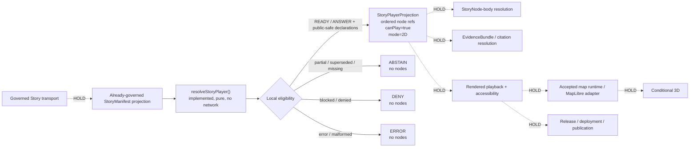

<!-- [KFM_META_BLOCK_V2]
doc_id: kfm://app/explorer-web/src/features/story_player/readme
title: Explorer Web Story Player Feature README
type: app-readme
version: v0.3
status: draft; repository-grounded; implementation-partial; projection-only; no-live-playback; no-publisher
owners:
  - "@bartytime4life — verified CODEOWNERS review route; specialist Story and UI stewardship remains NEEDS VERIFICATION"
reviewers_required:
  - "Story and UI stewardship — assignment NEEDS VERIFICATION"
  - "Evidence and citation stewardship — assignment NEEDS VERIFICATION"
  - "Policy, sensitivity, and rights review — assignment NEEDS VERIFICATION"
  - "Release, correction, and rollback review — assignment NEEDS VERIFICATION"
  - "Accessibility review — assignment NEEDS VERIFICATION"
  - "Independent review — NEEDS VERIFICATION"
created: 2026-06-16
updated: 2026-08-19
policy_label: public
owning_root: apps/
responsibility: "Document the implemented app-local StoryManifest projection consumer, its finite fail-closed output, and the boundaries that must remain closed until governed transport, evidence resolution, rendered playback, map/runtime integration, release, and publication are separately proven."
truth_posture: "CONFIRMED bounded repository code and tests / PROPOSED future playback / UNKNOWN deployed behavior; cite-or-abstain"
current_path: apps/explorer-web/src/features/story_player/README.md
evidence_snapshot:
  repository: bartytime4life/Kansas-Frontier-Matrix
  base_ref: main
  base_commit: fec1f92fde6fb7dd83c995f9984d495bb61a84bb
  target_prior_blob: 4bac3eb49bea7ee9e07d3b3e0466831d96ce2d1b
  story_player_entry_blob: 6c3b3e63b28027e9f21f859beed791e2dd16879d
  story_player_test_blob: 54195d2676ca6f125b8c661c5c52c3adb4c2b16a
  story_player_current_implementation_blob: 7566f69f0a7ff87b461b54098fb00f0c41deed63
  story_manifest_contract_blob: e0365d00a36f1aef57ed7dd1a051b4c70dec09b2
  story_manifest_schema_blob: 67fa2fae5534ffc7a277fae8adfcb9afb81e9fc0
  story_manifest_fixture_blob: 98e1ce24cacae42a19134c45ed3158a724282684
  story_manifest_validator_blob: 4122c5040d71d9098711717466cbb06f7fba2136
  story_manifest_test_blob: c8ccdb1fef0b277f759a340b993bf9c8684622e1
  story_player_architecture_blob: 526d4e0500b686f18a05426059471d5f6cc65b69
  story_subsystem_architecture_blob: 7561eec79fd79c4adedef53c9ccbf32dafe7b8e3
  story_player_receipt_blob: 3d5b6ee9cecdaee803a6bab731f2d7eab11579da
inspection_boundary: >
  Repository reads at the pinned main commit covering this feature directory,
  resolveStoryPlayer source, its focused Vitest suite, current-implementation.md,
  the UI StoryManifest contract/schema/fixtures/validator/test lineage, the Story
  Player and Story subsystem architecture pages, Story policy posture, Governed API
  route inventory, renderer ADR lineage, and the generated authoring receipt. No live
  Story transport, browser playback, StoryNode-body dereference, EvidenceBundle
  resolution, policy execution, map or renderer execution, accessibility session,
  telemetry stream, release, deployment, correction drill, rollback execution, or
  publication was exercised.
related:
  - ./index.tsx
  - ./current-implementation.md
  - ../../../tests/story-player.test.ts
  - ../README.md
  - ../../README.md
  - ../../adapters/README.md
  - ../../../README.md
  - ../../../../governed-api/README.md
  - ../../../../../docs/doctrine/directory-rules.md
  - ../../../../../docs/architecture/story/README.md
  - ../../../../../docs/architecture/ui/STORY_PLAYER.md
  - ../../../../../docs/architecture/ui/GOVERNED_SHELL.md
  - ../../../../../docs/architecture/ui/EVIDENCE_DRAWER.md
  - ../../../../../docs/architecture/ui/MAP_RUNTIME_BOUNDARY.md
  - ../../../../../docs/architecture/ui/ACCESSIBILITY.md
  - ../../../../../docs/architecture/ui/TELEMETRY.md
  - ../../../../../contracts/ui/story_manifest.md
  - ../../../../../contracts/ui/story_node.md
  - ../../../../../schemas/contracts/v1/ui/story_manifest.schema.json
  - ../../../../../fixtures/ui/story_manifest/cases.json
  - ../../../../../tools/validators/ui/validate_story_manifest.py
  - ../../../../../tests/validators/test_validate_story_manifest.py
  - ../../../../../policy/story/README.md
  - ../../../../../release/README.md
  - ../../../../../data/receipts/generated/genrec-story-player-governed-projection-20260814.json
tags: [kfm, apps, explorer-web, story-player, story-manifest, public-safe-projection, finite-outcomes, evidence, policy, 2d-only, no-live-playback, no-publisher]
notes:
  - "v0.3 replaces proposal-era and broadly unverified maturity language with the bounded implemented resolveStoryPlayer consumer and its 10 focused app tests."
  - "The consumer accepts one already-governed kfm.ui.story-manifest.public-safe.v1 candidate and returns a non-authoritative StoryPlayerProjection; it is not live Story playback."
  - "canPlay=true reports local projection eligibility only. It does not authenticate evidence, citations, policy, review, release, correction, or publication."
  - "Live governed transport, StoryNode and EvidenceBundle resolution, rendered controls, MapLibre or other renderer integration, 3D, release, deployment, and publication remain HOLD or NEEDS VERIFICATION."
  - "The app-local source performs defensive closed-profile checks but does not replace the canonical contract, schema, validator, or governed trust membrane."
[/KFM_META_BLOCK_V2] -->

<a id="top"></a>

# Explorer Web Story Player Feature

`apps/explorer-web/src/features/story_player/`

> **Current determination.** This directory is no longer an empty or one-export placeholder. It contains a pure, deterministic, **2D-only StoryManifest projection consumer** and a focused 10-case Vitest suite. The consumer creates a bounded view model from one already-governed public-safe projection; it does not fetch, resolve, render, release, or publish a story.

[](#0-evidence-basis-for-this-revision)
[](#7-story-player-feature-map)
[](#8-minimum-safe-implementation-slice)
[](#4-default-posture)
[](#12-runtime-anti-bypass-matrix)
[](#3-authority-boundary)

> [!IMPORTANT]
> `resolveStoryPlayer()` consumes a projection that must already have passed the governing contract, schema, validator, evidence, policy, review, and release processes. Its defensive checks and `canPlay` result do not perform or authenticate those processes.

> [!CAUTION]
> **`canPlay=true` is not live playback and is not publication authority.** It only means the supplied closed projection declares the exact local eligibility posture required by this consumer. Story order, narrative presentation, screenshots, maps, camera movement, 3D scenes, tests, receipts, and generated language never outrank evidence, policy, review, release, correction, or rollback.

**Quick jump:** [Evidence](#0-evidence-basis-for-this-revision) · [Purpose](#1-purpose) · [Repo fit](#2-repo-fit) · [Boundary](#3-authority-boundary) · [Posture](#4-default-posture) · [Inputs](#5-inputs) · [Exclusions](#6-exclusions) · [Feature map](#7-story-player-feature-map) · [Next slice](#8-minimum-safe-implementation-slice) · [Diagram](#9-diagram) · [Obligations](#10-story-player-ui-obligations) · [Module contract](#11-per-module-contract) · [Anti-bypass](#12-runtime-anti-bypass-matrix) · [Inspection](#13-inspection-path) · [Validation](#14-validation-expectations) · [Safe change](#15-safe-change-pattern) · [Done](#16-definition-of-done) · [Open work](#17-open-verification-items)

---

## 0. Evidence basis for this revision

This README explains app-local repository behavior; it does not create runtime, policy, release, or publication authority.

| Surface | Confirmed current state | Safe conclusion |
|---|---|---|
| [`index.tsx`](./index.tsx) | Exports `resolveStoryPlayer()` plus the bounded projection and finite-state types it uses. | The app-local projection consumer is implemented. |
| [`story-player.test.ts`](../../../tests/story-player.test.ts) | Contains 10 focused Vitest cases covering eligible, abstained, denied, error, superseded, malformed, missing-response, ordering, and anti-bypass behavior. | The bounded consumer has app-level unit proof; rendered playback is not tested. |
| [`current-implementation.md`](./current-implementation.md) | Records the executable slice and explicit non-effects. | The feature is implementation-partial, not placeholder and not live. |
| [`contracts/ui/story_manifest.md`](../../../../../contracts/ui/story_manifest.md) and its closed schema/validator lineage | Define the fixture-only public-safe projection profile and least-permissive trust posture. | They remain the semantic and machine-shape authority; this app code is only a defensive consumer. |
| [`docs/architecture/ui/STORY_PLAYER.md`](../../../../../docs/architecture/ui/STORY_PLAYER.md) | Separates projection consumption from future governed playback and preserves renderer, 3D, release, and publication gates. | Architecture prose does not prove deployed behavior. |
| [`docs/architecture/story/README.md`](../../../../../docs/architecture/story/README.md) | Records the implemented consumer separately from absent transport and rendered playback. | Story architecture remains broader than this app-local slice. |
| Generated Story Player receipt | Binds the initial authored source/test/document set. | Process memory is not evidence resolution, human review, release, or publication. |

### Five distinct maturity states

| State | Current status | Non-effect |
|---|---|---|
| Feature documentation | **Present and repository-grounded** | Documentation is not executable authority. |
| StoryManifest projection profile | **Executable; contract status remains proposed/fixture-only** | It does not resolve refs or approve policy/release. |
| App-local projection consumer | **Implemented and unit-tested** | It does not fetch, route, render, or publish. |
| Live governed Story playback | **Not established** | No browser or deployed playback behavior may be claimed. |
| Story release/publication | **None established** | A passing projection, commit, merge, test, or receipt is not publication. |

[Back to top](#top)

---

## 1. Purpose

The current responsibility of this feature directory is narrow:

1. accept one unknown candidate value supplied by an upstream caller;
2. require the exact `kfm.ui.story-manifest.public-safe.v1` closed projection shape used by the current bounded profile;
3. refuse unknown fields, malformed identity/flags, duplicate nodes, and unsorted node order;
4. return one finite, non-authoritative `StoryPlayerProjection`;
5. expose ordered node references only when the candidate declares the fully public-safe `READY / ANSWER` posture;
6. withhold nodes for every abstained, denied, errored, missing, malformed, stale, unreleased, restricted, or superseded path.

This is a projection/view-model concern. A later live player may add governed transport, StoryNode-body resolution, visible controls, map/time continuity, Evidence Drawer handoff, accessibility behavior, telemetry, export, and conditional 3D only after their own dependency-closed proofs.

[Back to top](#top)

---

## 2. Repo fit

| Concern | Current home | Relationship to this feature |
|---|---|---|
| App-local projection consumer | `apps/explorer-web/src/features/story_player/index.tsx` | Implemented here. |
| Focused app tests | `apps/explorer-web/tests/story-player.test.ts` | Exercise this consumer without transport or rendering. |
| StoryManifest semantics | `contracts/ui/story_manifest.md` | Referenced; not owned or redefined here. |
| StoryManifest machine shape | `schemas/contracts/v1/ui/story_manifest.schema.json` | Canonical closed profile; not replaced by local TypeScript checks. |
| Fixtures and deterministic validation | `fixtures/ui/story_manifest/`, `tools/validators/ui/`, `tests/validators/` | Upstream bounded profile proof. |
| Story architecture | `docs/architecture/story/README.md` and `docs/architecture/ui/STORY_PLAYER.md` | Explain the cross-root and UI boundaries. |
| Governed transport | `apps/governed-api/` plus an accepted Explorer adapter | **HOLD:** no verified Story route or transport is implemented here. |
| Evidence and citation resolution | Governed evidence/citation surfaces | **HOLD:** this feature carries public-safe refs but does not resolve them. |
| Story policy | `policy/story/` and shared policy authorities | **HOLD:** current Story policy posture is non-enforcing. |
| Map runtime | Accepted map adapter/runtime boundary | **HOLD:** this feature imports no renderer and renders no map. |
| Release and publication | `release/` and governed publication surfaces | **HOLD:** no Story release or publication state is created here. |

The underscore path `story_player/` is the current implemented app home. This README does not create a parallel `story/` feature directory, a `packages/maplibre-runtime/` package, or a story-specific schema authority.

[Back to top](#top)

---

## 3. Authority boundary

This feature may defensively project an already-governed StoryManifest candidate. It does **not** own or perform:

- Story authoring, narrative truth, source admission, or claim creation;
- StoryManifest or StoryNode semantic/schema authority;
- EvidenceRef or EvidenceBundle resolution;
- citation validation or evidence sufficiency decisions;
- rights, sensitivity, CARE/sovereignty, policy, review, or correction decisions;
- promotion, release, withdrawal, rollback, deployment, or publication;
- governed API routes, authentication, or transport envelopes;
- map renderer selection, renderer imports, adapter admission, or 3D admission;
- model invocation, Focus synthesis, export authority, or telemetry truth;
- lifecycle, canonical, graph, vector, object-store, or unpublished-candidate reads.

The browser-facing trust membrane remains intact: this feature must receive a public-safe governed projection through an accepted interface and must never reach around that interface to obtain more permissive data.

[Back to top](#top)

---

## 4. Default posture

`resolveStoryPlayer()` is fail-closed, finite, non-authoritative, and fixed to `mode: "2D"`.

### Returned codes

| Code | Outcome | Node exposure | Meaning |
|---|---|---:|---|
| `STORY_READY` | `ANSWER` | Ordered refs exposed | Candidate passed the local closed-shape and declared public-safe eligibility checks. |
| `STORY_ABSTAINED` | `ABSTAIN` | None | Candidate is valid but not locally playable, including partial, stale, unreleased, or superseded posture. |
| `STORY_DENIED` | `DENY` | None | Candidate declares denied/blocked posture. |
| `STORY_ERROR` | `ERROR` | None | Candidate declares an upstream error posture. |
| `NO_GOVERNED_RESPONSE` | `ABSTAIN` | None | No candidate was supplied. |
| `INVALID_PAYLOAD` | `ERROR` | None | Candidate fails the local closed-profile checks; untrusted content is not reflected. |

### Local `canPlay=true` conditions

The consumer exposes nodes only when all of the following are declared by a valid candidate:

- `state=READY` and `outcome=ANSWER`;
- `authoritative=false` and `projection_only=true`;
- rights `CLEARED`, sensitivity `PUBLIC`, policy `ALLOW`, review `REVIEWED`, release `RELEASED`, and freshness `CURRENT`;
- correction is not `SUPERSEDED`;
- evidence, citation-validation, policy-decision, release, and review reference arrays are non-empty;
- constituent node refs and order indexes are unique and strictly increasing.

These are defensive eligibility checks. The consumer does not dereference or authenticate any reference and does not rerun the repository validator.

[Back to top](#top)

---

## 5. Inputs

### Current accepted input

One unknown candidate representing the closed public-safe StoryManifest projection. The current function performs no network request and has no route or adapter dependency.

### Current output

A `StoryPlayerProjection` containing finite outcome/code, public-safe title and accessibility summary when valid, story/state metadata, reason and limiting-node references, evidence/citation refs, caveats, optional public replacement ref, `canPlay`, fixed `mode: "2D"`, and `authoritative: false`.

### Not current inputs

The consumer does not accept or resolve raw StoryNode bodies, claim text, geometry, coordinates, source payloads, policy inputs, release candidates, model output, map objects, renderer handles, 3D assets, telemetry payloads, credentials, or lifecycle-store paths.

[Back to top](#top)

---

## 6. Exclusions

| Excluded concern | Required authority or future dependency |
|---|---|
| Story authoring/editing | Separate governed authoring workflow |
| Live StoryManifest retrieval | Governed API route and accepted Explorer adapter |
| StoryNode-body retrieval | Governed resolver with evidence/policy closure |
| Evidence/citation resolution | EvidenceBundle and citation authorities |
| Policy execution | Repository policy engine and decision records |
| Rendered playback controls | App UI composition with accessibility proof |
| Map/time/layer orchestration | Accepted map runtime port and governed layer/time state |
| Direct MapLibre/Cesium/plugin imports | Prohibited here; renderer boundary must remain isolated |
| 3D runtime and assets | Conditional admission only after parity, integrity, policy, fallback, and accessibility proof |
| Story release, correction, rollback, publication | `release/` and governed publication authorities |
| Raw telemetry or protected detail | Prohibited; any future telemetry must be public-safe and non-authoritative |
| Direct lifecycle/canonical/model access | Prohibited from the browser feature |

[Back to top](#top)

---

## 7. Story Player feature map

### Confirmed files

| File | Current responsibility | Status |
|---|---|---|
| [`index.tsx`](./index.tsx) | Closed defensive parsing and finite StoryPlayerProjection creation | **Implemented** |
| [`README.md`](./README.md) | App-local feature boundary and contributor guidance | **Current document** |
| [`current-implementation.md`](./current-implementation.md) | First-slice implementation note and explicit non-effects | **Confirmed** |
| [`story-player.test.ts`](../../../tests/story-player.test.ts) | Focused app proof for projection eligibility and anti-bypass behavior | **10 tests implemented** |

### Held future capabilities

| Capability | Current status | Required before claiming it |
|---|---|---|
| Governed manifest loader | **HOLD** | Story route, envelope contract, authentication, adapter, negative fixtures, and no-direct-store proof |
| StoryNode resolver/rendered player | **HOLD** | Node-body contract, evidence/citation/policy resolution, finite UI states, and accessibility proof |
| Evidence Drawer handoff | **HOLD** | Governed reference resolution and drawer integration tests |
| Map/time/layer continuity | **HOLD** | Accepted runtime port, governed state contract, renderer isolation, and browser tests |
| Telemetry | **HOLD** | Safe event schema, redaction, purpose, retention, and no-authority proof |
| Conditional 3D | **HOLD** | Accepted renderer/admission decisions, asset integrity, evidence/release parity, accessibility alternate, and deterministic 2D fallback |
| Release/public playback | **HOLD** | Human review, release object, correction/rollback path, deployment proof, and publication authorization |

Do not introduce speculative module names as current files. Add a capability to the confirmed inventory only when source, tests, ownership, and authority boundaries exist together.

[Back to top](#top)

---

## 8. Minimum safe implementation slice

### Completed bounded slice

The current slice is complete only at the app-local projection boundary:

- pure/no-network candidate consumption;
- exact profile/version/identity/flag checks needed by the consumer;
- finite `ANSWER`, `ABSTAIN`, `DENY`, and `ERROR` output;
- node withholding for every non-eligible path;
- ordered node refs only for a locally eligible public-safe projection;
- fixed 2D/non-authoritative output;
- focused malformed-input and anti-bypass tests.

### Smallest coherent next slice

The next implementation slice must begin with **authority and governed transport closure**, not map animation or 3D:

1. define or adopt the Story response envelope and route ownership;
2. prove authenticated Governed API transport with no browser lifecycle/canonical reads;
3. validate the returned envelope and StoryManifest profile at the boundary;
4. preserve explicit no-response, invalid, abstain, deny, and error states;
5. keep node bodies, evidence resolution, rendering, MapLibre, 3D, release, and publication out until their dependencies are separately closed.

A local `canPlay=true` result is not permission to skip those steps.

[Back to top](#top)

---

## 9. Diagram


```mermaid
flowchart LR
    upstream["Already-governed StoryManifest projection"] --> consumer["resolveStoryPlayer()\nimplemented, pure, no network"]
    consumer --> ready{"Local eligibility"}
    ready -->|READY / ANSWER + public-safe declarations| refs["StoryPlayerProjection\nordered node refs\ncanPlay=true\nmode=2D"]
    ready -->|partial / superseded / missing| abstain["ABSTAIN\nno nodes"]
    ready -->|blocked / denied| deny["DENY\nno nodes"]
    ready -->|error / malformed| error["ERROR\nno nodes"]

    transport["Governed Story transport"] -. HOLD .-> upstream
    refs -. HOLD .-> bodies["StoryNode-body resolution"]
    refs -. HOLD .-> evidence["EvidenceBundle / citation resolution"]
    refs -. HOLD .-> rendered["Rendered playback + accessibility"]
    rendered -. HOLD .-> map["Accepted map runtime / MapLibre adapter"]
    map -. HOLD .-> three["Conditional 3D"]
    rendered -. HOLD .-> release["Release / deployment / publication"]
```

[Back to top](#top)

---

## 10. Story Player UI obligations

| Obligation | Current effect |
|---|---|
| `already_governed_input_only` | Consumer accepts a candidate; it does not fetch or widen it. |
| `closed_profile` | Unknown fields and malformed boundary flags return `INVALID_PAYLOAD`. |
| `finite_outcomes` | Every result is `ANSWER`, `ABSTAIN`, `DENY`, or `ERROR` with a bounded code. |
| `no_nodes_on_failure` | Non-eligible, denied, errored, missing, and malformed paths expose no node playback list. |
| `public_safe_ready_only` | Nodes appear only for the exact local READY/ANSWER trust/support posture. |
| `2d_only` | Output mode is fixed to `"2D"`; no renderer is imported. |
| `non_authoritative` | Output is always `authoritative: false`. |
| `no_ref_resolution` | Evidence, citation, policy, release, review, correction, and replacement refs remain opaque. |
| `no_mutation` | The feature cannot approve, override, release, deploy, or publish. |
| `no_direct_store_or_model_access` | Focused source checks deny transport, lifecycle-store, renderer, and model seams. |
| `visible_correction_posture` | A valid superseded projection may carry only its public replacement-manifest ref while withholding nodes. |

Future UI work must add accessibility, evidence inspection, map/time continuity, correction visibility, and safe finite-state rendering without weakening these obligations.

[Back to top](#top)

---

## 11. Per-module contract

Any new long-lived module in this directory must state and test:

- whether it consumes an already-governed projection, performs governed transport, renders finite states, or coordinates a downstream handoff;
- the exact contract/schema/envelope it accepts and the authority that validates it;
- behavior for missing, malformed, abstained, denied, errored, stale, unreleased, restricted, corrected, and superseded inputs;
- whether it dereferences StoryNode, EvidenceBundle, citation, policy, review, release, correction, or rollback refs;
- the browser trust-membrane and direct-store denial behavior;
- any map/runtime dependency and proof that renderer imports remain behind the accepted adapter boundary;
- accessibility behavior for motion, keyboard, focus, announcements, and non-map alternatives;
- telemetry fields, redaction, purpose, retention, and proof that telemetry remains non-authoritative;
- release/publication non-effects and rollback of the code change itself.

A module that cannot identify these dependencies remains outside the feature.

[Back to top](#top)

---

## 12. Runtime anti-bypass matrix

| Risk | Current proof or required behavior | Status |
|---|---|---|
| Missing governed response becomes optimistic playback | `resolveStoryPlayer()` returns `NO_GOVERNED_RESPONSE / ABSTAIN` with no nodes. | **Tested** |
| Malformed or open payload reflects untrusted content | Closed-key checks return `INVALID_PAYLOAD`; canary content is not reflected. | **Tested** |
| READY label bypasses stale/unreleased posture | `canPlay` remains false unless every local public-safe condition passes. | **Tested** |
| Denied rights or restricted sensitivity exposes nodes | Denied/blocked paths return no nodes. | **Tested** |
| Duplicate or unsorted constituents create ambiguous order | Candidate is rejected as invalid. | **Tested** |
| Superseded projection continues playback | Consumer abstains, withholds nodes, and may expose only the public replacement ref. | **Tested** |
| Feature performs transport or reads lifecycle stores | Focused source test denies `fetch`, XHR, WebSocket, and lifecycle-root seams. | **Tested for current source** |
| Feature mutates approval/release/publication state | Focused source test denies approval, override, publish, release, and deploy call seams. | **Tested for current source** |
| Feature imports MapLibre, Cesium, or a model client | Focused source test denies `maplibre`, `cesium`, and `ollama` seams. | **Tested for current source; renderer/3D HOLD remains** |
| Evidence refs are treated as resolved evidence | Refs are copied only; no resolution/authentication is performed. | **Boundary preserved; live resolution HOLD** |
| `canPlay` is treated as release/publication approval | Documentation and types keep output non-authoritative. | **Boundary preserved; release/publication HOLD** |

Source-text anti-bypass checks are bounded guards, not a substitute for full dependency, bundle, browser, policy, or security validation.

[Back to top](#top)

---

## 13. Inspection path

```bash
find apps/explorer-web/src/features/story_player -maxdepth 2 -type f | sort
sed -n '1,260p' apps/explorer-web/src/features/story_player/index.tsx
sed -n '1,260p' apps/explorer-web/tests/story-player.test.ts
sed -n '1,220p' contracts/ui/story_manifest.md
python tools/validators/ui/validate_story_manifest.py
```

Expected current inventory:

```text
apps/explorer-web/src/features/story_player/current-implementation.md
apps/explorer-web/src/features/story_player/README.md
apps/explorer-web/src/features/story_player/index.tsx
```

Repository search should continue to show no live Story Player call site, transport, renderer import, or publication mutation unless a later dependency-closed change deliberately adds and proves one.

[Back to top](#top)

---

## 14. Validation expectations

### Current focused proof

The existing app suite should continue to prove:

- one fully public-safe READY fixture yields `STORY_READY`, ordered refs, `canPlay=true`, `mode="2D"`, and `authoritative=false`;
- stale and unreleased inputs abstain and expose no nodes;
- unresolved rights and restricted sensitivity deny and expose no nodes;
- upstream error and malformed payload paths fail closed;
- supersession withholds nodes and exposes only the public replacement ref;
- optimistic READY posture cannot bypass freshness/release checks;
- unknown fields, invalid projection flags, duplicate refs, and unsorted order are rejected;
- missing input abstains explicitly;
- current source contains no network, lifecycle-store, mutation, renderer, or model seams.

### Proof not yet present

Do not claim completion for live transport, route authentication, StoryNode-body resolution, Evidence Drawer integration, policy execution, map/time continuity, accessibility interaction behavior, telemetry, browser playback, conditional 3D, release, deployment, or publication until focused and aggregate evidence exists for each.

### Documentation validation for this file

A documentation-only change should at minimum verify:

- one metadata block and one H1;
- balanced fenced blocks;
- unique explicit anchors and resolving internal links;
- valid repository-relative links;
- no placeholder claim for the implemented consumer;
- explicit retention of every HOLD named above;
- no app, contract, schema, policy, release, data, workflow, or repository-setting change.

[Back to top](#top)

---

## 15. Safe change pattern

1. Refresh exact main and confirm no overlapping open PR owns this path.
2. Classify the requested behavior as projection consumption, transport, ref resolution, rendering, map/runtime, accessibility, telemetry, release, or publication.
3. Change only the smallest dependency-closed layer; do not smuggle a later layer into an earlier one.
4. Add finite negative fixtures before widening an accepted input or exposing new output.
5. Preserve the governed-interface-only browser boundary and renderer import isolation.
6. Update this README, `current-implementation.md`, focused tests, and architecture docs only where the actual behavior changed.
7. Keep release, deployment, publication, source activation, policy activation, and repository settings outside an ordinary feature PR.

[Back to top](#top)

---

## 16. Definition of done

### Bounded projection consumer — current status

- [x] App-local source exists under the accepted `story_player/` path.
- [x] Exact public-safe StoryManifest profile and fixed boundary flags are checked defensively.
- [x] Finite result codes and outcomes are returned.
- [x] Nodes are withheld for every non-eligible path.
- [x] Eligible output is 2D-only and non-authoritative.
- [x] Missing, malformed, stale, unreleased, denied, errored, superseded, duplicate, unsorted, and anti-bypass cases are covered by focused app tests.
- [x] Current code performs no transport, direct lifecycle read, renderer/model import, or release/publication mutation.

### Live governed Story playback — not done

- [ ] Accountable Story/UI/evidence/policy/release/accessibility owners and independent reviewers are confirmed.
- [ ] Governed Story route, response envelope, authentication, and Explorer adapter are implemented and tested.
- [ ] StoryNode bodies and EvidenceBundle/citation refs are resolved through governed interfaces.
- [ ] Policy, review, release, correction, and rollback state is authenticated rather than trusted from declarations alone.
- [ ] Finite rendered states, Evidence Drawer handoff, and correction visibility are accessible and browser-tested.
- [ ] Map/time/layer continuity is implemented only through an accepted runtime port.
- [ ] MapLibre or any renderer dependency is admitted and isolated; direct feature imports remain prohibited.
- [ ] 3D has evidence/release parity, asset integrity, policy, accessibility, deterministic 2D fallback, and human approval.
- [ ] Telemetry is safe, minimized, non-authoritative, and reviewed.
- [ ] Story release, deployment, rollback, and publication are separately governed and proven.

[Back to top](#top)

---

## 17. Open verification items

| Priority | Open item | Why it blocks wider claims |
|---:|---|---|
| P0 | Confirm accountable owner roles and independent review | CODEOWNERS routing is not completed stewardship or approval. |
| P0 | Define/adopt governed Story transport and response envelope | Current consumer receives a candidate but fetches nothing. |
| P0 | Authenticate evidence, citation, policy, review, release, correction, and rollback refs | Current consumer treats refs and declarations as opaque inputs. |
| P1 | Add a non-map rendered finite-state player | `canPlay` is a view-model flag, not visible playback. |
| P1 | Resolve StoryNode bodies through governed interfaces | Current output exposes refs only. |
| P1 | Prove accessibility behavior and Evidence Drawer integration | Narrative interaction and evidence inspection are absent. |
| P2 | Bind governed map/time/layer continuity through the accepted runtime port | No map is rendered and no renderer is imported. |
| P2 | Define safe telemetry and export/correction lineage | Current consumer emits no telemetry and creates no export. |
| P3 | Resolve MapLibre/renderer admission and conditional 3D | Renderer ADRs and 3D proof remain HOLD. |
| P3 | Establish Story release, deployment, rollback rehearsal, and publication authorization | No Story public state exists. |

---

<details>
<summary>Appendix A — no-loss reconciliation ledger</summary>

| v0.2 posture | v0.3 disposition |
|---|---|
| Feature described broadly as `NEEDS VERIFICATION` | **Narrowed:** the projection consumer and its focused app tests are confirmed; live playback remains unverified. |
| Directory described as a proposed future home | **Corrected:** `story_player/` is the implemented app-local home. |
| Implementation files and tests said to be unknown | **Corrected:** `index.tsx`, `current-implementation.md`, and the 10-case app test are recorded. |
| Candidate modules treated as the feature map | **Replaced:** current files are separated from held future capabilities. |
| Story schemas pointed toward `schemas/contracts/v1/story/` | **Corrected:** the current executable projection lives under `schemas/contracts/v1/ui/`. |
| `packages/maplibre-runtime/` treated as an expected home | **Removed as current placement:** no package authority is created here. |
| Evidence gate described as a current separate module | **Narrowed:** current code checks bounded StoryManifest eligibility but resolves no evidence. |
| 2D-first and conditional 3D safeguards | **Retained:** current output is 2D-only; renderer and 3D remain HOLD. |
| Governed API-only, no direct stores/models | **Retained and tied to current source anti-bypass tests.** |
| Sensitivity, rights, correction, accessibility, telemetry, release, and publication safeguards | **Retained as current boundaries or future gates without claiming implementation.** |
| Stable numbered headings and `top` anchor | **Preserved.** |

</details>

## Status summary

The current Story Player feature is an **implemented, bounded, app-local projection consumer**. It can defensively produce a finite 2D view model from one already-governed public-safe StoryManifest candidate, and its focused tests prove the local fail-closed boundary. It is **not** a live player, transport client, evidence resolver, policy engine, renderer, 3D runtime, release mechanism, deployment, or publication surface.

<p align="right"><a href="#top">Back to top</a></p>
