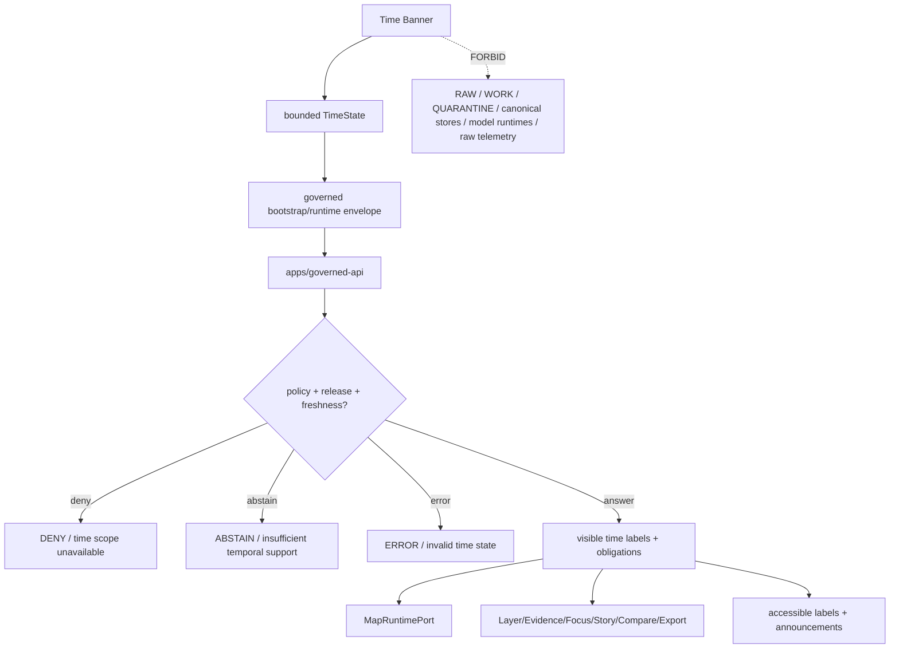

<!-- [KFM_META_BLOCK_V2]
doc_id: kfm://app/explorer-web/src/features/time_banner/readme
title: Explorer Web Time Banner Feature README
type: app-readme
version: v0.2
status: draft
owners: OWNER_TBD — Apps steward · UI steward · Time steward · Map steward · Governed API steward · Policy steward · Evidence steward · Accessibility steward · Telemetry steward · Docs steward
created: 2026-06-16
updated: 2026-07-09
policy_label: public
related:
  - ../README.md
  - ../../README.md
  - ../../adapters/README.md
  - ../../../README.md
  - ../../../../README.md
  - ../../../../governed-api/README.md
  - ../../../../../docs/doctrine/directory-rules.md
  - ../../../../../docs/architecture/ui/README.md
  - ../../../../../docs/architecture/ui/GOVERNED_SHELL.md
  - ../../../../../docs/architecture/ui/MAP_RUNTIME_BOUNDARY.md
  - ../../../../../docs/architecture/ui/ACCESSIBILITY.md
  - ../../../../../docs/architecture/ui/TELEMETRY.md
  - ../../../../../docs/architecture/ui/STATE_OWNERSHIP.md
  - ../../../../../docs/architecture/map-shell.md
  - ../../../../../packages/ui/README.md
  - ../../../../../packages/maplibre/README.md
  - ../../../../../policy/access/README.md
  - ../../../../../policy/decision/README.md
  - ../../../../../policy/telemetry/README.md
  - ../../../../../release/README.md
  - ../../../../../data/README.md
tags: [kfm, apps, explorer-web, features, time-banner, time-state, valid-time, observed-time, source-time, retrieval-time, release-time, correction-time, freshness, stale-state, map-first]
notes:
  - "Replaces the greenfield Time Banner feature stub with a governed feature README."
  - "Time Banner UI features may render time scope, valid time, observed time, source time, retrieval time, release time, correction time, freshness, stale/degraded state, and selected temporal context, but they must not rewrite source time, release time, freshness, evidence truth, policy state, or lifecycle state."
  - "Feature implementation files, route wiring, tests, fixtures, governed API envelopes, TimeState contracts, accessibility behavior, telemetry policy wiring, and package scripts remain NEEDS VERIFICATION."
  - "policy/telemetry/README.md currently exists as a greenfield bundle stub; executable telemetry policy wiring remains NEEDS VERIFICATION."
  - "v0.2 refreshes the evidence basis, aligns truth posture with current GitHub evidence, adds a minimum safe implementation slice, adds runtime anti-bypass checks, and strengthens time-kind anti-collapse, stale/freshness, delayed-release, temporal-conflict, accessibility, handoff, and telemetry review gates without claiming runtime maturity."
[/KFM_META_BLOCK_V2] -->

<a id="top"></a>

<div align="center">

# Explorer Web Time Banner Feature

`apps/explorer-web/src/features/time_banner/`

**App-local Explorer Web feature boundary for governed temporal context: viewport time, selected time, valid time, observed time, source/retrieval/release/correction time labels, freshness/stale state, delayed-release and temporal-scope warnings, timeline controls, accessible time labels, and safe handoffs to Map Runtime, Layer Catalog, Evidence Drawer, Focus Panel, Story Player, Compare, Export, Settings, and Diagnostics.**


[Evidence](#0-evidence-basis-for-this-revision) · [Purpose](#1-purpose) · [Repo fit](#2-repo-fit) · [Boundary](#3-authority-boundary) · [Inputs](#5-inputs) · [Exclusions](#6-exclusions) · [Feature map](#7-time-banner-feature-map) · [Minimum slice](#8-minimum-safe-implementation-slice) · [Definition of done](#16-definition-of-done)

</div>

---

> [!IMPORTANT]
> **Status:** draft / `NEEDS VERIFICATION`  
> **Owners:** `OWNER_TBD` — Apps steward · UI steward · Time steward · Map steward · Governed API steward · Policy steward · Evidence steward · Accessibility steward · Telemetry steward · Docs steward  
> **Path:** `apps/explorer-web/src/features/time_banner/README.md`  
> **Responsibility root:** `apps/` — deployable application surfaces  
> **Directory Rules basis:** deployable application feature code belongs under `apps/`; Time Banner is an app-local UI temporal-context surface, not a time authority, source registry, evidence resolver, freshness policy home, release home, schema home, contract home, renderer package, telemetry policy home, model runtime, or lifecycle-data lane.  
> **Truth posture:** CONFIRMED current GitHub README path / CONFIRMED parent feature-boundary README posture / CONFIRMED GovernedShell and Map Shell docs exist / CONFIRMED Map Runtime Boundary, Accessibility, and UI Telemetry docs exist / CONFIRMED `policy/telemetry/README.md` exists as greenfield stub / PROPOSED feature contract / UNKNOWN implementation files, route wiring, tests, fixtures, schemas, package scripts, governed API envelopes, TimeState contracts, accessibility behavior, telemetry policy wiring, timeline controls, and runtime behavior

> [!CAUTION]
> The Time Banner is a trust-visible temporal context surface, not a time authority. It may display and scope time state, but it must never collapse valid time, observed time, source time, retrieval time, release time, correction time, freshness, stale/degraded state, delayed-release state, or selected time into one unlabeled “current” timestamp.

---

## Quick jump

- [0. Evidence basis for this revision](#0-evidence-basis-for-this-revision)
- [1. Purpose](#1-purpose)
- [2. Repo fit](#2-repo-fit)
- [3. Authority boundary](#3-authority-boundary)
- [4. Default posture](#4-default-posture)
- [5. Inputs](#5-inputs)
- [6. Exclusions](#6-exclusions)
- [7. Time Banner feature map](#7-time-banner-feature-map)
- [8. Minimum safe implementation slice](#8-minimum-safe-implementation-slice)
- [9. Diagram](#9-diagram)
- [10. Time Banner UI obligations](#10-time-banner-ui-obligations)
- [11. Per-module contract](#11-per-module-contract)
- [12. Runtime anti-bypass matrix](#12-runtime-anti-bypass-matrix)
- [13. Inspection path](#13-inspection-path)
- [14. Validation expectations](#14-validation-expectations)
- [15. Safe change pattern](#15-safe-change-pattern)
- [16. Definition of done](#16-definition-of-done)
- [17. Open verification items](#17-open-verification-items)

---

## 0. Evidence basis for this revision

This README is a documentation boundary, not runtime proof. The 2026-07-09 revision updates an existing README and keeps implementation maturity bounded while aligning the feature contract with current repository evidence.

| Evidence item | Status | What it supports | What it does not prove |
|---|---|---|---|
| `apps/explorer-web/src/features/time_banner/README.md` exists on `main`. | CONFIRMED | This is an existing README update, not a new path proposal. | It does not prove Time Banner components, hooks, routes, tests, fixtures, schemas, TimeState ownership, timeline controls, or runtime behavior exist. |
| `apps/explorer-web/src/features/README.md` exists and defines feature modules as UI composition surfaces. | CONFIRMED | Time Banner belongs under the Explorer Web feature boundary when it is app-local UI temporal-context composition. | It does not prove Time Banner is wired into routes or launch surfaces. |
| `docs/doctrine/directory-rules.md` is referenced as the placement authority for responsibility-root decisions. | CONFIRMED document path from current repo references | The target path follows the deployable-app feature responsibility root. | It does not decide whether the feature is complete or release-ready. |
| `docs/architecture/ui/GOVERNED_SHELL.md` exists and names the time banner as part of the persistent shell. | CONFIRMED document presence and doctrine posture | Time Banner must preserve map-first persistence, shell trust visibility, governed API use, and finite outcomes. | It does not prove implementation, route tree, schemas, or tests. |
| `docs/architecture/map-shell.md` exists and describes the map-first, time-aware shell and trust membrane. | CONFIRMED document presence and doctrine posture | Time context must remain downstream of governed interfaces and released/evidence-backed state. | It does not prove TimeState schema, route wiring, or tests. |
| `docs/architecture/ui/MAP_RUNTIME_BOUNDARY.md` exists. | CONFIRMED document presence | Time Banner handoffs to map runtime must preserve the renderer boundary. | It does not prove adapter wiring or import guards. |
| `docs/architecture/ui/ACCESSIBILITY.md` and `docs/architecture/ui/TELEMETRY.md` exist. | CONFIRMED document presence | Time labels, stale/freshness state, timeline controls, and telemetry must remain accessible, safe, and non-authoritative. | They do not prove Time Banner accessibility or telemetry implementation. |
| `policy/telemetry/README.md` exists as a greenfield bundle stub. | CONFIRMED placeholder state | Telemetry policy wiring must remain `NEEDS VERIFICATION`. | It does not prove executable telemetry policy bundles or runtime wiring exist. |

[Back to top](#top)

---

## 1. Purpose

`apps/explorer-web/src/features/time_banner/` is the proposed app-local feature boundary for the Explorer Web temporal-context banner.

It may eventually hold banner components, state bridges, finite-state renderers, timeline controls, hover/detail panels, accessibility labels, telemetry guards, and feature orchestration for:

- rendering the shell-level time banner inside the persistent map-first UI;
- displaying viewport time, selected time, valid time, observed time, source time, retrieval time, release time, correction time, freshness, stale state, degraded state, delayed-release state, and temporal uncertainty when material;
- making temporal scope visible before layer, evidence, Focus, Story, Compare, Export, or diagnostics actions are interpreted;
- warning when selected layers, evidence payloads, Focus answers, Story nodes, Compare results, or Export requests have incompatible time basis or stale support;
- providing bounded time-scope controls without directly editing canonical data, layer manifests, evidence records, source metadata, policy, release, correction, rollback, or lifecycle state;
- handing time context to Map Runtime, Layer Catalog, Evidence Drawer, Focus Panel, Story Player, Compare, Export, Settings, and Diagnostics through governed state;
- preserving accessibility through clear labels, keyboard controls, screen-reader announcements, reduced-motion behavior, precision labels, and non-color trust indicators;
- emitting safe telemetry without raw evidence, exact restricted coordinates, prompts, model outputs, secrets, or full EvidenceBundle copies.

This directory is not proof that any Time Banner component, hook, state owner, adapter, schema, fixture, test, package script, governed API route, accessibility behavior, telemetry behavior, timeline control, or downstream handoff is implemented.

[Back to top](#top)

---

## 2. Repo fit

| Concern | Owning root | Expected relationship |
|---|---|---|
| Time Banner feature source | `apps/explorer-web/src/features/time_banner/` | App-local Time Banner modules, if implemented and tested |
| Feature boundary | `apps/explorer-web/src/features/` | Parent feature/root contract |
| Adapter boundary | `apps/explorer-web/src/adapters/` | Governed API, evidence, layer, map, export, diagnostics, and settings adapters |
| Explorer Web app | `apps/explorer-web/` | Map-first public/semi-public shell |
| Governed API | `apps/governed-api/` | Trust membrane and normal bootstrap/runtime/time-scope path |
| GovernedShell doctrine | `docs/architecture/ui/GOVERNED_SHELL.md` | Shell ownership, time banner, finite outcome, and bootstrap doctrine |
| Map Shell doctrine | `docs/architecture/map-shell.md` | Map-first, time-aware client surface and trust membrane posture |
| Map Runtime doctrine | `docs/architecture/ui/MAP_RUNTIME_BOUNDARY.md` | Camera/time sync and renderer adapter boundary, if verified |
| Accessibility doctrine | `docs/architecture/ui/ACCESSIBILITY.md` | Accessible time labels, timeline controls, and non-color stale/freshness posture |
| Telemetry doctrine | `docs/architecture/ui/TELEMETRY.md` | Safe UI telemetry expectations |
| Telemetry policy | `policy/telemetry/` | Current repo has greenfield stub; executable telemetry policy remains `NEEDS VERIFICATION` |
| Shared UI components | `packages/ui/` | Reusable banners, badges, popovers, timeline controls, state cards, and accessibility primitives when shared |
| Renderer wrapper | `packages/maplibre/` | Renderer implementation stays behind adapter boundaries |
| Policy gates | `policy/` | Access, sensitivity, rights, freshness, embargo, delayed release, release, and decision policy |
| Release authority | `release/` | Publication, correction, supersession, rollback control |
| Lifecycle artifacts | `data/` | Receipts, proofs, registry, catalog, triplets, and published artifacts; not browser-readable directly |
| Contracts and schemas | `contracts/`, `schemas/contracts/v1/` | Object meaning and machine shape; this feature references, not owns |

## 3. Authority boundary

This feature renders temporal context. It does not own source timestamps, evidence truth, freshness rules, stale-state policy, delayed-release policy, embargo policy, release decisions, correction decisions, layer manifests, source registry records, schemas, contracts, lifecycle artifacts, renderer authority, model invocation, telemetry truth, or AI output.

```text
apps/explorer-web/src/features/time_banner/ = app-local Time Banner UI feature
apps/explorer-web/src/features/             = feature boundary
apps/explorer-web/src/adapters/             = adapter boundary
apps/governed-api/                          = trust membrane and temporal/runtime path
docs/architecture/ui/GOVERNED_SHELL.md      = shell time-banner doctrine
docs/architecture/map-shell.md              = map-first time-aware shell doctrine
docs/architecture/ui/MAP_RUNTIME_BOUNDARY.md = renderer-boundary doctrine
docs/architecture/ui/ACCESSIBILITY.md       = accessibility architecture doctrine
docs/architecture/ui/TELEMETRY.md           = telemetry architecture doctrine
policy/telemetry/                           = telemetry policy lane; current stub only
packages/ui/                                = shared UI primitives
packages/maplibre/                          = renderer helper/wrapper boundary
policy/                                     = finite policy decisions
schemas/contracts/v1/                       = machine-readable shape
contracts/                                  = object meaning
data/                                       = lifecycle artifacts, receipts, proofs, registries
release/                                    = publication, correction, rollback authority
```

## 4. Default posture

Time Banner feature modules should fail closed, preserve time-kind labels, and prevent stale, embargoed, delayed, corrected, rolled-back, or incompatible temporal context from being rendered as a normal current claim.

A Time Banner path should not display or apply temporal state when any of these are unresolved:

- governed bootstrap/runtime envelope and response validation;
- time state owner, selected time, viewport time, route time scope, panel time scope, and layer time scope;
- valid time, observed time, source time, retrieval time, release time, correction time, freshness, selected time, and wall-clock display labels where material;
- stale/degraded state, review state, release state, correction lineage, rollback posture, embargo, and delayed-release state;
- whether a layer, evidence payload, Focus answer, Story node, Compare result, Export request, diagnostic item, or review item has incompatible temporal support;
- timezone, precision, granularity, interval/instant semantics, open-ended intervals, uncertainty labels, and date-only vs timestamp precision;
- policy restrictions on delayed release, embargo, sensitive location, living-person, archaeology, infrastructure, rare species, or sovereign/CARE context;
- accessibility state for keyboard timeline controls, screen-reader labels, reduced motion, and non-color stale/freshness indicators;
- safe telemetry posture.

## 5. Inputs

| Input family | Examples | Required posture |
|---|---|---|
| Shell time state | selected time, viewport time, active route, active panel, active layer set | Governed shell state only |
| Layer time state | layer valid time, observed time, source time, retrieval time, release time, correction time, freshness window | Distinct labels and visible limitations |
| Evidence time state | EvidenceRef time, EvidenceBundle time basis, citation date, source vintage, review/correction time | Evidence-derived projection only |
| Map time state | camera/time sync, time slider value, temporal filter, selected feature time | Scope only; not proof |
| Focus/Story time state | prompt scope, StoryNode valid/observed time, node transition time, citation freshness | Finite outcomes and citation checks required |
| Compare/Export time state | compared layer time bases, export timestamp, release refs, citation date, correction lineage | Governed refs and time labels preserved |
| Policy state | embargo, delayed release, sensitivity, stale threshold, access posture | Policy-derived labels only |
| API envelope | bootstrap response, runtime response, `DecisionEnvelope`, finite outcome | Runtime-validated before render |
| UI state | loading, ready, stale, degraded, conflict, denied, abstained, invalid, error | Finite and tested states |
| Accessibility state | labels, descriptions, keyboard timeline, reduced motion, announcements | Required for Time Banner UI |
| Telemetry state | banner rendered, time scope changed, stale warning opened, conflict shown | Non-secret, policy-safe, no raw evidence/restricted geometry |

## 6. Exclusions

| Does not belong here | Correct home |
|---|---|
| Governed API bootstrap/runtime/time implementation | `apps/governed-api/` |
| Canonical evidence time, source registry time, or catalog time | governed API / evidence resolver / `data/registry/` / `data/catalog/` as accepted |
| Freshness, stale-state, embargo, and delayed-release policy | `policy/`, governed API policy runtime, `release/` |
| Release manifests, rollback cards, correction notices | `release/`, `data/receipts/`, `data/proofs/` as accepted |
| Layer manifests and source descriptors | `release/`, `data/registry/`, `data/catalog/`, layer pipelines |
| Renderer implementation or direct MapLibre/plugin imports | `packages/maplibre/`, repo-confirmed runtime package, or accepted adapter package |
| Model adapter or direct browser-to-model calls | server-side governed AI runtime behind governed API only |
| Changing required trust badges, finite outcomes, correction/rollback labels, policy labels, citations, or evidence labels | Forbidden from banner convenience logic |
| RAW, WORK, QUARANTINE, canonical stores, graph/vector stores, object stores, unpublished candidates | Forbidden from browser Time Banner path |
| Raw telemetry payload collection | Forbidden; telemetry must be safe UI telemetry only |
| Shared reusable UI primitives | `packages/ui/` |
| Schemas and contracts | `schemas/contracts/v1/ui/`, `schemas/contracts/v1/time/`, `contracts/` — exact homes `NEEDS VERIFICATION` |
| Lifecycle artifacts, receipts, proofs, published artifacts | `data/` |
| Secrets, credentials, tokens, private keys | Secret manager / deployment environment |

## 7. Time Banner feature map

Exact modules remain `NEEDS VERIFICATION`. Candidate modules should be introduced only with route inventory, fixtures, tests, and accepted TimeState contracts.

| Candidate module | Purpose | Required safeguard | Status |
|---|---|---|---|
| `time-banner` | Banner shell and summary state | Governed time state only | PROPOSED |
| `time-kind-labels` | Valid/observed/source/retrieval/release/correction/freshness labels | No time-kind collapse | PROPOSED |
| `freshness-badges` | Fresh, stale, degraded, unknown, corrected, rolled-back labels | Text/ARIA labels required | PROPOSED |
| `time-scope-popover` | Expanded temporal basis and limitations | Evidence/release refs preserved | PROPOSED |
| `timeline-controls` | Bounded selected-time controls | Policy/release constraints visible | PROPOSED |
| `temporal-conflict-panel` | Show incompatible layer/evidence time basis | No silent merge | PROPOSED |
| `delayed-release-banner` | Show embargo/delayed-release/withheld temporal posture | No exposure hints | PROPOSED |
| `handoff-bridge` | Pass time context to map, layers, evidence, Focus, Story, Compare, Export | Governed refs only | PROPOSED |
| `a11y-time-controls` | Keyboard, focus, screen-reader and reduced-motion behavior | Accessibility tests | PROPOSED |
| `telemetry-safe-events` | Record non-content time UI events | No raw evidence, restricted geometry, prompts, or secrets | PROPOSED |
| `time-state-guard` | Validate time values, intervals, timezone, granularity | Fails closed on invalid time | PROPOSED |

> [!WARNING]
> Candidate module names are not implementation proof. Do not document a Time Banner module as runnable until files, route wiring, tests, fixtures, package scripts, governed API envelopes, TimeState contracts, timeline-control behavior, telemetry constraints, and accessibility fixtures confirm it.

## 8. Minimum safe implementation slice

A smallest useful Time Banner slice should prove temporal labels cannot collapse before adding richer timeline controls.

| Slice item | Minimum requirement | Why it is required |
|---|---|---|
| Governed time source | Time state comes from governed bootstrap/runtime envelopes or bounded shell state | Prevents direct lifecycle/canonical reads |
| TimeState parser | Validate selected time, interval/instant, timezone, precision, granularity, freshness, and source labels | Prevents malformed time state becoming UI truth |
| Time-kind anti-collapse | Valid, observed, source, retrieval, release, correction, freshness, and selected time remain distinct where material | Prevents temporal evidence collapse |
| Freshness/stale gate | Fresh, stale, degraded, unknown, corrected, rolled-back, embargoed, and delayed-release states are explicit | Prevents stale support from looking current |
| Temporal conflict gate | Incompatible layer/evidence/Focus/Story/Compare/Export time bases render conflict, abstain, or denied state | Prevents silent temporal merge |
| Policy visibility | Embargo, delayed release, sensitivity, review, correction, rollback, and access posture remain visible where allowed | Keeps time policy inspectable |
| Handoff boundary | Downstream features receive governed time refs/state only | Prevents raw payload leakage |
| Accessibility path | Keyboard timeline controls, labels, announcements, reduced motion, non-color badges | Makes temporal trust usable |
| Safe telemetry guard | Emit non-secret event metadata only | Prevents telemetry side channels |
| Lifecycle denial test | Prove browser code does not import/read lifecycle roots, canonical stores, graph stores, vector stores, or model runtimes | Preserves public-client boundary |

This slice is still `PROPOSED` until files, fixtures, tests, route wiring, and accepted contracts are verified.

## 9. Diagram



## 10. Time Banner UI obligations

| Obligation | Example effect |
|---|---|
| `time_kind_preserved` | Valid, observed, source, retrieval, release, correction, freshness, selected time, and display time are distinct where material |
| `governed_api_only` | Banner state comes from governed bootstrap/runtime envelopes or bounded shell state |
| `scope_not_proof` | Selected viewport time scopes interactions but does not prove claims |
| `freshness_visible` | Stale, degraded, unknown, corrected, rolled-back, delayed-release, embargo, and rollback states are visible and text-labeled |
| `no_silent_temporal_merge` | Incompatible layer/evidence time bases render conflict/abstain rather than one blended timestamp |
| `policy_release_visible` | Delayed release, embargo, sensitivity, review, correction, and rollback constraints remain visible where allowed |
| `finite_states_required` | Ready, stale, conflict, denied, abstained, invalid, loading, and error states are explicit |
| `safe_handoffs` | Map, Layer Catalog, Evidence Drawer, Focus, Story, Compare, Export, Settings, and Diagnostics receive governed time context only |
| `safe_telemetry_only` | Telemetry records UI time interactions only, never raw evidence, prompts, model outputs, restricted geometry, or secrets |
| `accessibility_required` | Timeline controls, labels, freshness badges, and conflict notices are usable without mouse, motion, or color-only cues |
| `no_authority_fork` | Feature code does not redefine evidence, freshness, policy, release, schema, contract, source, telemetry, or renderer authority |

## 11. Per-module contract

Every long-lived Time Banner module should document or encode:

- whether it is banner shell, label renderer, popover, control, conflict renderer, state bridge, handoff bridge, accessibility module, telemetry module, or delayed-release notice;
- governed API envelope dependency, if any;
- time-kind fields consumed and labels rendered;
- timezone, precision, granularity, interval/instant, open-ended interval, date-only, timestamp, and uncertainty behavior;
- freshness, stale, degraded, correction, rollback, release, delayed-release, embargo, and review behavior;
- policy, rights, sensitivity, embargo, delayed-release, and generalization behavior;
- handoff behavior for Map Runtime, Layer Catalog, Evidence Drawer, Focus, Story, Compare, Export, Settings, and Diagnostics;
- accessibility behavior for keyboard timeline controls, focus, screen-reader labels, reduced motion, and non-color badges;
- telemetry emitted, if any;
- tests and fixtures proving trust-membrane, time-kind, freshness, release, delayed-release, conflict, handoff, safe-telemetry, and accessibility constraints.

## 12. Runtime anti-bypass matrix

| Bypass risk | Required behavior | Review signal |
|---|---|---|
| Time kinds collapse into one “current” label | Preserve distinct labels where material | Time-kind fixture keeps valid/source/observed/retrieval/release/correction/freshness distinct |
| Stale layer appears current | Render stale/degraded/unknown/corrected/rolled-back state visibly | Freshness fixture blocks normal-current badge |
| Delayed-release or embargo time leaks protected detail | Render deny/restrict/generalized state without exposure hints | Delayed-release fixture hides withheld dates/details where required |
| Incompatible layer/evidence time bases merge silently | Render conflict/abstain and show limitation | Temporal-conflict fixture blocks blended timestamp |
| Selected time treated as claim proof | Treat selected time as scope only; resolve claims through governed API | Scope fixture cannot produce claim without EvidenceBundle |
| Browser reads lifecycle/canonical data directly | Deny at import/build/test review; route through governed API | No direct `data/`, canonical, graph, vector, or object-store imports/fetches |
| Time control hides trust/citation/correction labels | Preserve trust labels outside control convenience state | Trust-label fixture stays visible under time changes |
| Handoff sends raw evidence/time payload | Pass governed refs/envelopes/time state only | Handoff fixture excludes raw payloads |
| Telemetry captures raw evidence, prompts, model output, or restricted geometry | Emit non-secret event metadata only | Telemetry fixture excludes raw evidence, prompts, model outputs, restricted geometry, secrets |
| Model output changes time authority | Model output may discuss time only through governed Focus/AI envelopes; no time-state mutation | Time state does not depend on model text |

## 13. Inspection path

Time Banner implementation files, route wiring, tests, fixtures, governed API envelopes, TimeState contracts, accessibility behavior, telemetry policy wiring, timeline controls, package scripts, and downstream feature handoffs remain `NEEDS VERIFICATION`.

```bash
find apps/explorer-web/src/features/time_banner -maxdepth 5 -type f | sort
find apps/explorer-web/src apps/governed-api docs/architecture/ui docs/architecture packages/ui packages/maplibre packages/maplibre-runtime schemas contracts policy release data tests fixtures -maxdepth 6 -type f 2>/dev/null | grep -Ei 'time.?banner|TimeState|valid.?time|observed.?time|source.?time|retrieval.?time|release.?time|correction.?time|freshness|stale|degraded|temporal|timeline|embargo|delayed.?release|DecisionEnvelope|RuntimeResponseEnvelope|release|rollback|a11y|accessibility|telemetry' | sort
find data/raw data/work data/quarantine data/processed data/catalog data/triplets data/published data/receipts data/proofs -maxdepth 2 -type f 2>/dev/null | sort
```

## 14. Validation expectations

Useful validation for this feature boundary should cover:

- no Time Banner feature imports or reads lifecycle/canonical data roots directly;
- no browser-side model runtime calls or provider SDK use;
- time state consumes governed API envelopes or bounded shell state only;
- invalid time values, malformed intervals, missing timezone basis, and incompatible precision render `ERROR`, `DENY`, or `ABSTAIN` safely;
- valid time, observed time, source time, retrieval time, release time, correction time, freshness, selected time, and display time are not collapsed;
- stale, degraded, corrected, rolled-back, embargoed, delayed-release, and denied states remain visible where allowed;
- time-scope conflicts between layers/evidence/Focus/Story/Compare/Export cannot silently merge;
- required trust, policy, citation, correction, rollback, and evidence labels cannot be hidden by time controls;
- handoffs carry governed time refs/state only, not raw evidence payloads;
- telemetry never includes raw evidence, exact restricted geometry, prompts, model outputs, secrets, full manifests, or full EvidenceBundle copies;
- accessibility tests cover labels, keyboard timeline controls, focus management, screen-reader announcements, reduced motion, non-color freshness badges, and precision/uncertainty labels.

## 15. Safe change pattern

For Time Banner feature changes:

1. Add or update module inventory and per-module contract.
2. Add fixtures for ready, stale, degraded, corrected, rolled-back, embargoed, delayed-release, denied, abstained, invalid time, missing timezone, interval conflict, precision mismatch, uncertainty, loading, empty, telemetry-denied, and error states.
3. Test lifecycle/canonical-data denial, no-browser-model behavior, governed API/shell-state behavior, time-kind anti-collapse, temporal-conflict handling, safe handoffs, safe telemetry, and accessibility behavior.
4. Preserve valid/observed/source/retrieval/release/correction/freshness labels, policy state, release/correction/rollback refs, citations, route state, layer state, evidence refs, uncertainty labels, and accessibility state through UI composition.
5. Test keyboard/screen-reader/reduced-motion paths before claiming Time Banner usability.
6. Update this README, parent `features/README.md`, GovernedShell docs, Map Shell docs, Map Runtime Boundary docs, Accessibility docs, Telemetry docs, telemetry policy docs, and parent app README when public behavior changes.

## 16. Definition of done

- [ ] Owners are confirmed and `OWNER_TBD` is replaced.
- [ ] Evidence basis is refreshed when parent README, GovernedShell docs, Map Shell docs, Map Runtime Boundary docs, Accessibility docs, Telemetry docs, telemetry policy, governed API, schema, release, telemetry, or fixture evidence changes.
- [ ] Time Banner feature file inventory and route/module ownership are documented.
- [ ] Governed API or bounded shell-state dependencies are explicit.
- [ ] TimeState schema/contract and fixtures are verified.
- [ ] Time-kind, freshness, stale, delayed-release, temporal conflict, and negative states are represented in UI fixtures.
- [ ] Direct lifecycle/canonical-data import/read checks are covered.
- [ ] Browser model-runtime denial is tested.
- [ ] Time-kind anti-collapse is tested.
- [ ] Policy/release/correction/rollback visibility is tested.
- [ ] Delayed-release/embargo no-exposure-hint behavior is tested where applicable.
- [ ] Map Runtime, Layer Catalog, Evidence Drawer, Focus, Story, Compare, Export, Settings, Diagnostics, and Shell handoffs are tested for safe governed refs if present.
- [ ] Safe telemetry constraints are tested.
- [ ] Accessibility behavior is tested for keyboard, focus, ARIA, reduced motion, timeline controls, precision/uncertainty labels, and non-color badges.

## 17. Open verification items

| Item | Why it matters |
|---|---|
| Confirm Time Banner implementation files beyond README | Prevents overclaiming feature maturity |
| Confirm route/module inventory and launch surfaces | Required for UI boundary review |
| Confirm TimeState owner and schema/contract | Required before time behavior claims |
| Confirm governed API/bootstrap/runtime time fields | Required for trust membrane enforcement |
| Confirm time-kind fixture coverage | Required to avoid temporal evidence collapse |
| Confirm stale/freshness policy behavior | Required before public freshness claims |
| Confirm delayed-release and embargo behavior | Required before sensitive temporal disclosure claims |
| Confirm Compare/Export/Focus/Story handoff behavior | Required before downstream workflow claims |
| Confirm safe telemetry behavior and `policy/telemetry/` wiring beyond stub | Required before diagnostics/observability claims |
| Confirm accessibility tests | Required because time context must be accessible |
| Confirm package scripts beyond TODO | Required before build/test claims |
| Confirm architecture-doc links and relative paths after recursive inventory | Required before treating all related paths as current implementation evidence |

<details>
<summary>Appendix A — no-loss preservation note</summary>

The previous README already contained a strong bounded Time Banner feature contract. This revision preserves that contract, refreshes metadata, adds a current evidence-basis section, strengthens time-kind anti-collapse, freshness/stale, delayed-release, temporal-conflict, telemetry, accessibility, handoff, and anti-bypass safeguards, and keeps implementation claims bounded. It does not claim banner components, routes, hooks, adapters, fixtures, tests, package scripts, governed API envelopes, schemas, TimeState ownership, accessibility behavior, telemetry behavior, timeline controls, or downstream handoffs are implemented.

</details>

## Status summary

`apps/explorer-web/src/features/time_banner/` should contain Time Banner feature modules only after route/module contracts, governed API or shell-state envelopes, schema bindings, negative-state fixtures, time-kind anti-collapse tests, stale/freshness tests, delayed-release tests, temporal-conflict tests, accessibility tests, safe telemetry constraints, and downstream handoffs are verified.

It must preserve the trust membrane and temporal-boundary posture: Time Banner may display and scope temporal context, but it must not become source-time authority, freshness policy, release authority, evidence resolver, lifecycle storage, raw/canonical data path, model client, telemetry side channel, or a shortcut that hides stale/degraded/corrected/rolled-back/delayed-release state.

<p align="right"><a href="#top">Back to top</a></p>
