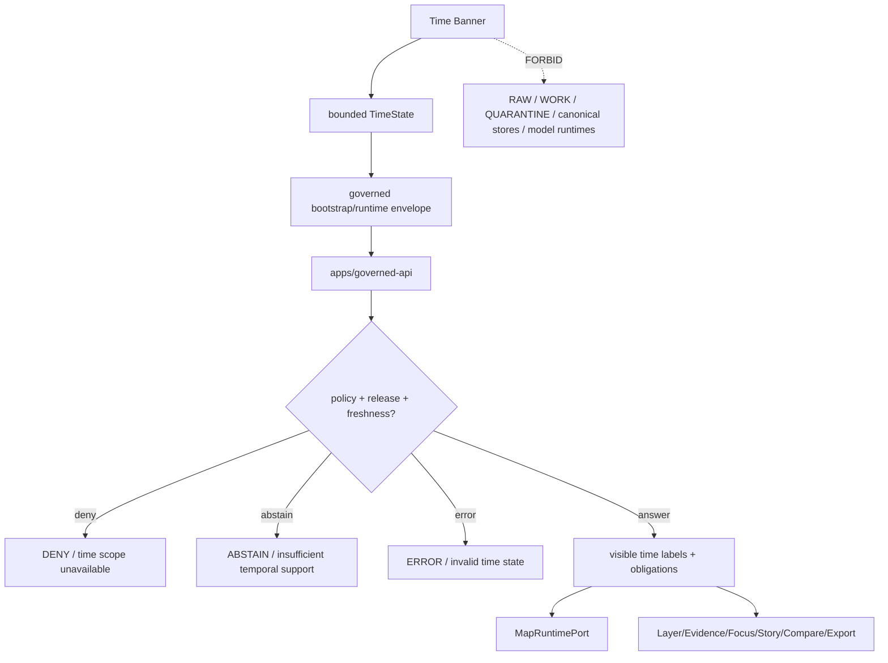

<!-- [KFM_META_BLOCK_V2]
doc_id: kfm://app/explorer-web/src/features/time_banner/readme
title: Explorer Web Time Banner Feature README
type: app-readme
version: v0.1
status: draft
owners: OWNER_TBD — Apps steward · UI steward · Time steward · Map steward · Governed API steward · Policy steward · Evidence steward · Docs steward
created: 2026-06-16
updated: 2026-06-16
policy_label: public
related:
  - ../README.md
  - ../../README.md
  - ../../adapters/README.md
  - ../../../README.md
  - ../../../../README.md
  - ../../../../governed-api/README.md
  - ../../../../../docs/architecture/ui/README.md
  - ../../../../../docs/architecture/ui/GOVERNED_SHELL.md
  - ../../../../../docs/architecture/ui/MAP_RUNTIME_BOUNDARY.md
  - ../../../../../docs/architecture/map-shell.md
  - ../../../../../packages/ui/README.md
  - ../../../../../packages/maplibre/README.md
  - ../../../../../policy/access/README.md
  - ../../../../../policy/decision/README.md
  - ../../../../../release/README.md
  - ../../../../../data/README.md
tags: [kfm, apps, explorer-web, features, time-banner, time-state, valid-time, observed-time, freshness, stale-state, map-first]
notes:
  - "Replaces the greenfield Time Banner feature stub with a governed feature README."
  - "Time Banner UI features may render time scope, valid-time, observed-time, freshness, stale/degraded state, release/correction time, and selected temporal context, but they must not rewrite source time, release time, freshness, evidence truth, policy state, or lifecycle state."
  - "Feature implementation files, route wiring, tests, fixtures, governed API envelopes, TimeState contracts, accessibility behavior, telemetry policy wiring, and package scripts remain NEEDS VERIFICATION."
[/KFM_META_BLOCK_V2] -->

<a id="top"></a>

<div align="center">

# Explorer Web Time Banner Feature

`apps/explorer-web/src/features/time_banner/`

**App-local Explorer Web feature boundary for governed temporal context: viewport time, valid time, observed time, source/retrieval/release/correction time labels, freshness/stale state, time-scope warnings, timeline controls, and safe handoffs to Map Runtime, Layer Catalog, Evidence Drawer, Focus Panel, Story Player, Compare, Export, Settings, and Diagnostics.**


[Purpose](#1-purpose) · [Repo fit](#2-repo-fit) · [Boundary](#3-authority-boundary) · [Inputs](#5-inputs) · [Exclusions](#6-exclusions) · [Feature map](#7-time-banner-feature-map) · [Definition of done](#14-definition-of-done)

</div>

---

> [!IMPORTANT]
> **Status:** draft / `NEEDS VERIFICATION`  
> **Owners:** `OWNER_TBD` — Apps steward · UI steward · Time steward · Map steward · Governed API steward · Policy steward · Evidence steward · Docs steward  
> **Path:** `apps/explorer-web/src/features/time_banner/README.md`  
> **Responsibility root:** `apps/` — deployable application surfaces  
> **Truth posture:** CONFIRMED README path / CONFIRMED GovernedShell and Map Shell time doctrine / PROPOSED feature contract / UNKNOWN implementation files, route wiring, tests, fixtures, schemas, and runtime behavior

> [!CAUTION]
> The Time Banner is a trust-visible temporal context surface, not a time authority. It may display and scope time state, but it must never collapse valid time, observed time, source time, retrieval time, release time, correction time, freshness, or stale/degraded state into one unlabeled “current” timestamp.

---

## Quick jump

- [1. Purpose](#1-purpose)
- [2. Repo fit](#2-repo-fit)
- [3. Authority boundary](#3-authority-boundary)
- [4. Default posture](#4-default-posture)
- [5. Inputs](#5-inputs)
- [6. Exclusions](#6-exclusions)
- [7. Time Banner feature map](#7-time-banner-feature-map)
- [8. Diagram](#8-diagram)
- [9. Time Banner UI obligations](#9-time-banner-ui-obligations)
- [10. Per-module contract](#10-per-module-contract)
- [11. Inspection path](#11-inspection-path)
- [12. Validation expectations](#12-validation-expectations)
- [13. Safe change pattern](#13-safe-change-pattern)
- [14. Definition of done](#14-definition-of-done)
- [15. Open verification items](#15-open-verification-items)

---

## 1. Purpose

`apps/explorer-web/src/features/time_banner/` is the proposed app-local feature boundary for the Explorer Web temporal-context banner.

It may eventually hold banner components, state bridges, finite-state renderers, timeline controls, hover/detail panels, accessibility labels, and feature orchestration for:

- rendering the shell-level time banner inside the persistent map-first UI;
- displaying viewport time, selected time, valid time, observed time, source time, retrieval time, release time, correction time, freshness, stale state, and degraded state when material;
- making temporal scope visible before layer, evidence, Focus, Story, Compare, or Export actions are interpreted;
- warning when selected layers or claims have incompatible time basis or stale evidence;
- providing bounded time-scope controls without directly editing canonical data or release state;
- handing time context to Map Runtime, Layer Catalog, Evidence Drawer, Focus Panel, Story Player, Compare, Export, Settings, and Diagnostics through governed state;
- preserving accessibility through clear labels, keyboard controls, screen-reader announcements, reduced-motion behavior, and non-color trust indicators.

This directory is not proof that any Time Banner component, hook, state owner, adapter, schema, fixture, test, package script, governed API route, or accessibility behavior is implemented.

[Back to top](#top)

---

## 2. Repo fit

| Concern | Owning root | Expected relationship |
|---|---|---|
| Time Banner feature source | `apps/explorer-web/src/features/time_banner/` | App-local Time Banner modules, if implemented and tested |
| Feature boundary | `apps/explorer-web/src/features/` | Parent feature/root contract |
| Adapter boundary | `apps/explorer-web/src/adapters/` | Governed API, evidence, layer, map, export, diagnostics, and settings adapters |
| Explorer Web app | `apps/explorer-web/` | Map-first public/semi-public shell |
| Governed API | `apps/governed-api/` | Trust membrane and normal bootstrap/runtime/time-scope path |
| GovernedShell doctrine | `docs/architecture/ui/GOVERNED_SHELL.md` | Shell ownership, time banner, finite outcome, and bootstrap doctrine |
| Map Shell doctrine | `docs/architecture/map-shell.md` | Map-first, time-aware client surface and trust membrane posture |
| Map Runtime doctrine | `docs/architecture/ui/MAP_RUNTIME_BOUNDARY.md` | Camera/time sync and renderer adapter boundary, if verified |
| Shared UI components | `packages/ui/` | Reusable banners, badges, popovers, timeline controls, state cards, and accessibility primitives when shared |
| Renderer wrappers | `packages/maplibre/`, `packages/maplibre-runtime/` | Renderer implementation stays behind adapter boundaries |
| Policy gates | `policy/` | Access, sensitivity, rights, freshness, release, and decision policy |
| Release authority | `release/` | Publication, correction, supersession, rollback control |
| Lifecycle artifacts | `data/` | Receipts, proofs, registry, catalog, triplets, and published artifacts; not browser-readable directly |

## 3. Authority boundary

This feature renders temporal context. It does not own source timestamps, evidence truth, freshness rules, stale-state policy, release decisions, correction decisions, layer manifests, source registry records, schemas, contracts, lifecycle artifacts, renderer authority, model invocation, telemetry truth, or AI output.

```text
apps/explorer-web/src/features/time_banner/ = app-local Time Banner UI feature
apps/explorer-web/src/features/             = feature boundary
apps/explorer-web/src/adapters/             = adapter boundary
apps/governed-api/                          = trust membrane and temporal/runtime path
docs/architecture/ui/GOVERNED_SHELL.md      = shell time-banner doctrine
docs/architecture/map-shell.md              = map-first time-aware shell doctrine
packages/ui/                                = shared UI primitives
policy/                                     = finite policy decisions
data/                                       = lifecycle artifacts, receipts, proofs, registries
release/                                    = publication, correction, rollback authority
```

## 4. Default posture

Time Banner feature modules should fail closed, preserve time-kind labels, and prevent stale or incompatible temporal context from being rendered as a normal current claim.

A Time Banner path should not display or apply temporal state when any of these are unresolved:

- governed bootstrap/runtime envelope and response validation;
- time state owner, selected time, viewport time, and route/layer time scope;
- valid time, observed time, source time, retrieval time, release time, correction time, and freshness labels where material;
- stale/degraded state, review state, release state, correction lineage, and rollback posture;
- whether a layer, evidence payload, Focus answer, Story node, Compare result, or Export request has incompatible temporal support;
- timezone, precision, granularity, interval/instant semantics, open-ended intervals, and uncertainty labels;
- policy restrictions on delayed release, embargo, sensitive location, living-person, archaeology, infrastructure, rare species, or sovereign/CARE context;
- accessibility state for keyboard timeline controls, screen-reader labels, reduced motion, and non-color stale/freshness indicators;
- safe telemetry posture.

## 5. Inputs

| Input family | Examples | Required posture |
|---|---|---|
| Shell time state | selected time, viewport time, active route, active panel, active layer set | Governed shell state only |
| Layer time state | layer valid time, observed time, source time, retrieval time, release time, correction time, freshness window | Distinct labels and visible limitations |
| Evidence time state | EvidenceRef time, EvidenceBundle time basis, citation date, source vintage, review/correction time | Evidence-derived projection only |
| Map time state | camera/time sync, time slider value, temporal filter, selected feature time | Scope only; not proof |
| Focus/Story time state | prompt scope, StoryNode valid/observed time, node transition time, citation freshness | Finite outcomes and citation checks required |
| Policy state | embargo, delayed release, sensitivity, stale threshold, access posture | Policy-derived labels only |
| API envelope | bootstrap response, runtime response, `DecisionEnvelope`, finite outcome | Runtime-validated before render |
| UI state | loading, ready, stale, degraded, conflict, denied, abstained, invalid, error | Finite and tested states |
| Accessibility state | labels, descriptions, keyboard timeline, reduced motion, announcements | Required for Time Banner UI |

## 6. Exclusions

| Does not belong here | Correct home |
|---|---|
| Governed API bootstrap/runtime/time implementation | `apps/governed-api/` |
| Canonical evidence time, source registry time, or catalog time | governed API / evidence resolver / `data/registry/` / `data/catalog/` as accepted |
| Freshness, stale-state, embargo, and delayed-release policy | `policy/`, governed API policy runtime, `release/` |
| Release manifests, rollback cards, correction notices | `release/`, `data/receipts/`, `data/proofs/` as accepted |
| Layer manifests and source descriptors | `release/`, `data/registry/`, `data/catalog/`, layer pipelines |
| Renderer implementation or direct MapLibre/plugin imports | `packages/maplibre/`, `packages/maplibre-runtime/`, or accepted adapter package |
| Model adapter or direct browser-to-model calls | server-side governed AI runtime behind governed API only |
| Changing required trust badges, finite outcomes, correction/rollback labels, policy labels, or citations | Forbidden from banner convenience logic |
| RAW, WORK, QUARANTINE, canonical stores, graph/vector stores, object stores, unpublished candidates | Forbidden from browser Time Banner path |
| Shared reusable UI primitives | `packages/ui/` |
| Schemas and contracts | `schemas/contracts/v1/ui/`, `schemas/contracts/v1/time/`, `contracts/` — exact homes `NEEDS VERIFICATION` |
| Lifecycle artifacts, receipts, proofs, published artifacts | `data/` |
| Secrets, credentials, tokens, private keys | Secret manager / deployment environment |

## 7. Time Banner feature map

Exact modules remain `NEEDS VERIFICATION`. Candidate modules should be introduced only with route inventory, fixtures, and tests.

| Candidate module | Purpose | Required safeguard | Status |
|---|---|---|---|
| `time-banner` | Banner shell and summary state | Governed time state only | PROPOSED |
| `time-kind-labels` | Valid/observed/source/retrieval/release/correction/freshness labels | No time-kind collapse | PROPOSED |
| `freshness-badges` | Fresh, stale, degraded, unknown, corrected labels | Text/ARIA labels required | PROPOSED |
| `time-scope-popover` | Expanded temporal basis and limitations | Evidence/release refs preserved | PROPOSED |
| `timeline-controls` | Bounded selected-time controls | Policy/release constraints visible | PROPOSED |
| `temporal-conflict-panel` | Show incompatible layer/evidence time basis | No silent merge | PROPOSED |
| `handoff-bridge` | Pass time context to map, layers, evidence, Focus, Story, Compare, Export | Governed refs only | PROPOSED |
| `a11y-time-controls` | Keyboard, focus, screen-reader and reduced-motion behavior | Accessibility tests | PROPOSED |
| `telemetry-safe-events` | Record non-content time UI events | No raw evidence or restricted geometry | PROPOSED |
| `time-state-guard` | Validate time values, intervals, timezone, granularity | Fails closed on invalid time | PROPOSED |

> [!WARNING]
> Candidate module names are not implementation proof. Do not document a Time Banner module as runnable until files, route wiring, tests, fixtures, package scripts, governed API envelopes, TimeState contracts, and accessibility fixtures confirm it.

## 8. Diagram



## 9. Time Banner UI obligations

| Obligation | Example effect |
|---|---|
| `time_kind_preserved` | Valid, observed, source, retrieval, release, correction, freshness, and selected time are distinct where material |
| `governed_api_only` | Banner state comes from governed bootstrap/runtime envelopes or bounded shell state |
| `scope_not_proof` | Selected viewport time scopes interactions but does not prove claims |
| `freshness_visible` | Stale, degraded, unknown, corrected, and rollback states are visible and text-labeled |
| `no_silent_temporal_merge` | Incompatible layer/evidence time bases render conflict/abstain rather than one blended timestamp |
| `policy_release_visible` | Delayed release, embargo, sensitivity, review, correction, and rollback constraints remain visible |
| `finite_states_required` | Ready, stale, conflict, denied, abstained, invalid, loading, and error states are explicit |
| `safe_handoffs` | Map, Layer Catalog, Evidence Drawer, Focus, Story, Compare, and Export receive governed time context only |
| `safe_telemetry_only` | Telemetry records UI time interactions only, never raw evidence, restricted geometry, or secrets |
| `no_authority_fork` | Feature code does not redefine evidence, freshness, policy, release, schema, contract, source, or renderer authority |

## 10. Per-module contract

Every long-lived Time Banner module should document or encode:

- whether it is banner shell, label renderer, popover, control, conflict renderer, state bridge, handoff bridge, accessibility module, or telemetry module;
- governed API envelope dependency, if any;
- time-kind fields consumed and labels rendered;
- timezone, precision, granularity, interval/instant, open-ended interval, and uncertainty behavior;
- freshness, stale, degraded, correction, rollback, release, and review behavior;
- policy, rights, sensitivity, embargo, delayed-release, and generalization behavior;
- handoff behavior for Map Runtime, Layer Catalog, Evidence Drawer, Focus, Story, Compare, Export, Settings, and Diagnostics;
- accessibility behavior for keyboard timeline controls, focus, screen reader labels, reduced motion, and non-color badges;
- telemetry emitted, if any;
- tests and fixtures proving trust-membrane, time-kind, freshness, release, conflict, handoff, safe-telemetry, and accessibility constraints.

## 11. Inspection path

Time Banner implementation files, route wiring, tests, fixtures, governed API envelopes, TimeState contracts, accessibility behavior, telemetry, package scripts, and downstream feature handoffs remain `NEEDS VERIFICATION`.

```bash
find apps/explorer-web/src/features/time_banner -maxdepth 5 -type f | sort
find apps/explorer-web/src apps/governed-api docs/architecture/ui docs/architecture packages/ui packages/maplibre packages/maplibre-runtime schemas contracts policy release data tests fixtures -maxdepth 6 -type f 2>/dev/null | grep -Ei 'time.?banner|TimeState|valid.?time|observed.?time|source.?time|retrieval.?time|release.?time|correction.?time|freshness|stale|degraded|temporal|timeline|DecisionEnvelope|RuntimeResponseEnvelope|release|rollback|a11y|accessibility|telemetry' | sort
find data/raw data/work data/quarantine data/processed data/catalog data/triplets data/published data/receipts data/proofs -maxdepth 2 -type f 2>/dev/null | sort
```

## 12. Validation expectations

Useful validation for this feature boundary should cover:

- no Time Banner feature imports or reads lifecycle/canonical data roots directly;
- no browser-side model runtime calls or provider SDK use;
- time state consumes governed API envelopes or bounded shell state only;
- invalid time values, malformed intervals, missing timezone basis, and incompatible precision render `ERROR` or `ABSTAIN` safely;
- valid time, observed time, source time, retrieval time, release time, correction time, freshness, and selected time are not collapsed;
- stale, degraded, corrected, rolled-back, embargoed, delayed-release, and denied states remain visible;
- time-scope conflicts between layers/evidence/Focus/Story/Compare/Export cannot silently merge;
- required trust, policy, citation, correction, and rollback labels cannot be hidden by time controls;
- telemetry never includes raw evidence, exact restricted geometry, prompts, secrets, or full EvidenceBundle copies;
- accessibility tests cover labels, keyboard timeline controls, focus management, screen-reader announcements, reduced motion, and non-color freshness badges.

## 13. Safe change pattern

For Time Banner feature changes:

1. Add or update module inventory and per-module contract.
2. Add fixtures for ready, stale, degraded, corrected, rolled-back, denied, abstained, invalid time, missing timezone, interval conflict, precision mismatch, loading, empty, and error states.
3. Test lifecycle/canonical-data denial, no-browser-model behavior, governed API/shell-state behavior, and safe handoffs.
4. Preserve valid/observed/source/retrieval/release/correction/freshness labels, policy state, release/correction/rollback refs, citations, route state, layer state, and accessibility state through UI composition.
5. Test keyboard/screen-reader/reduced-motion paths before claiming Time Banner usability.
6. Update this README, parent `features/README.md`, GovernedShell docs, Map Shell docs, and parent app README when public behavior changes.

## 14. Definition of done

- [ ] Owners are confirmed and `OWNER_TBD` is replaced.
- [ ] Time Banner feature file inventory and route/module ownership are documented.
- [ ] Governed API or bounded shell-state dependencies are explicit.
- [ ] TimeState schema/contract and fixtures are verified.
- [ ] Time-kind, freshness, stale, conflict, and negative states are represented in UI fixtures.
- [ ] Direct lifecycle/canonical-data import/read checks are covered.
- [ ] Browser model-runtime denial is tested.
- [ ] Time-kind anti-collapse is tested.
- [ ] Policy/release/correction/rollback visibility is tested.
- [ ] Map Runtime, Layer Catalog, Evidence Drawer, Focus, Story, Compare, Export, Settings, Diagnostics, and Shell handoffs are tested for safe governed refs if present.
- [ ] Accessibility behavior is tested for keyboard, focus, ARIA, reduced motion, timeline controls, and non-color badges.

## 15. Open verification items

| Item | Why it matters |
|---|---|
| Confirm Time Banner implementation files beyond README | Prevents overclaiming feature maturity |
| Confirm route/module inventory and launch surfaces | Required for UI boundary review |
| Confirm TimeState owner and schema/contract | Required before time behavior claims |
| Confirm governed API/bootstrap/runtime time fields | Required for trust membrane enforcement |
| Confirm time-kind fixture coverage | Required to avoid temporal evidence collapse |
| Confirm stale/freshness policy behavior | Required before public freshness claims |
| Confirm Compare/Export/Focus/Story handoff behavior | Required before downstream workflow claims |
| Confirm safe telemetry behavior | Required before diagnostics/observability claims |
| Confirm accessibility tests | Required because time context must be accessible |
| Confirm package scripts beyond TODO | Required before build/test claims |

<details>
<summary>Appendix A — no-loss preservation note</summary>

The previous README was a greenfield stub. This replacement adds a bounded Time Banner feature contract without claiming banner components, routes, hooks, adapters, fixtures, tests, package scripts, governed API envelopes, schemas, TimeState ownership, accessibility behavior, telemetry behavior, timeline controls, or downstream handoffs are implemented.

</details>

## Status summary

`apps/explorer-web/src/features/time_banner/` should contain Time Banner feature modules only after route/module contracts, governed API or shell-state envelopes, schema bindings, negative-state fixtures, time-kind anti-collapse tests, stale/freshness tests, accessibility tests, safe telemetry constraints, and downstream handoffs are verified.

It must preserve the trust membrane and temporal-boundary posture: Time Banner may display and scope temporal context, but it must not become source-time authority, freshness policy, release authority, evidence resolver, lifecycle storage, raw/canonical data path, model client, or a shortcut that hides stale/degraded/corrected/rolled-back state.

<p align="right"><a href="#top">Back to top</a></p>
