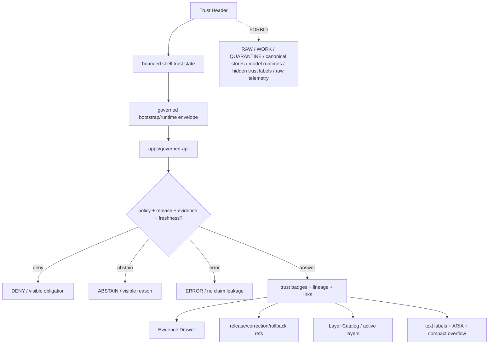

<!-- [KFM_META_BLOCK_V2]
doc_id: kfm://app/explorer-web/src/features/trust_header/readme
title: Explorer Web Trust Header Feature README
type: app-readme
version: v0.2
status: draft
owners: OWNER_TBD — Apps steward · UI steward · Trust-header steward · Governed API steward · Policy steward · Release steward · Evidence steward · Accessibility steward · Telemetry steward · Docs steward
created: 2026-06-16
updated: 2026-07-09
policy_label: public
related:
  - ../README.md
  - ../../README.md
  - ../../adapters/README.md
  - ../../../README.md
  - ../../../../README.md
  - ../../../../governed-api/README.md
  - ../../../../../docs/doctrine/directory-rules.md
  - ../../../../../docs/architecture/ui/README.md
  - ../../../../../docs/architecture/ui/GOVERNED_SHELL.md
  - ../../../../../docs/architecture/ui/EVIDENCE_DRAWER.md
  - ../../../../../docs/architecture/ui/LAYERING.md
  - ../../../../../docs/architecture/ui/MAP_RUNTIME_BOUNDARY.md
  - ../../../../../docs/architecture/ui/ACCESSIBILITY.md
  - ../../../../../docs/architecture/ui/TELEMETRY.md
  - ../../../../../docs/architecture/ui/STATE_OWNERSHIP.md
  - ../../../../../docs/architecture/map-shell.md
  - ../../../../../docs/brand/examples/trust-shell-annotated.md
  - ../../../../../packages/ui/README.md
  - ../../../../../packages/maplibre/README.md
  - ../../../../../policy/access/README.md
  - ../../../../../policy/decision/README.md
  - ../../../../../policy/telemetry/README.md
  - ../../../../../release/README.md
  - ../../../../../data/README.md
tags: [kfm, apps, explorer-web, features, trust-header, status-header, trust-badges, release-state, stale-state, review-state, correction-lineage, policy-posture, trust-visible]
notes:
  - "Replaces the greenfield Trust Header feature stub with a governed feature README."
  - "Trust Header UI features may render trust/status chrome, but they must not decide policy, compute release state, validate citations, resolve evidence, mutate corrections, promote artifacts, or hide required trust labels."
  - "Feature implementation files, route wiring, tests, fixtures, governed API envelopes, trust-state contracts, accessibility behavior, telemetry policy wiring, and package scripts remain NEEDS VERIFICATION."
  - "policy/telemetry/README.md currently exists as a greenfield bundle stub; executable telemetry policy wiring remains NEEDS VERIFICATION."
  - "v0.2 refreshes the evidence basis, aligns truth posture with current GitHub evidence, adds a minimum safe implementation slice, adds runtime anti-bypass checks, and strengthens required-label, compact-layout, correction/rollback, Evidence Drawer handoff, accessibility, and telemetry review gates without claiming runtime maturity."
[/KFM_META_BLOCK_V2] -->

<a id="top"></a>

<div align="center">

# Explorer Web Trust Header Feature

`apps/explorer-web/src/features/trust_header/`

**App-local Explorer Web feature boundary for the visible trust/status header: release state, stale/degraded state, policy posture, review state, correction lineage, rollback availability, citation/evidence status, active route/layer badges, finite outcome summaries, required trust labels, compact-layout preservation, and safe handoffs to Evidence Drawer, Layer Catalog, Focus Panel, Review, Compare, Export, Settings, Diagnostics, and Shell.**


[Evidence](#0-evidence-basis-for-this-revision) · [Purpose](#1-purpose) · [Repo fit](#2-repo-fit) · [Boundary](#3-authority-boundary) · [Inputs](#5-inputs) · [Exclusions](#6-exclusions) · [Feature map](#7-trust-header-feature-map) · [Minimum slice](#8-minimum-safe-implementation-slice) · [Definition of done](#16-definition-of-done)

</div>

---

> [!IMPORTANT]
> **Status:** draft / `NEEDS VERIFICATION`  
> **Owners:** `OWNER_TBD` — Apps steward · UI steward · Trust-header steward · Governed API steward · Policy steward · Release steward · Evidence steward · Accessibility steward · Telemetry steward · Docs steward  
> **Path:** `apps/explorer-web/src/features/trust_header/README.md`  
> **Responsibility root:** `apps/` — deployable application surfaces  
> **Directory Rules basis:** deployable application feature code belongs under `apps/`; Trust Header is an app-local UI trust/status surface, not policy authority, release authority, evidence resolver, citation validator, review authority, schema home, contract home, renderer package, telemetry policy home, model runtime, source registry, or lifecycle-data lane.  
> **Truth posture:** CONFIRMED current GitHub README path / CONFIRMED parent feature-boundary README posture / CONFIRMED GovernedShell and Map Shell docs exist / CONFIRMED Evidence Drawer, Layering, Map Runtime Boundary, Accessibility, and UI Telemetry docs exist / CONFIRMED `policy/telemetry/README.md` exists as greenfield stub / PROPOSED feature contract / UNKNOWN implementation files, route wiring, tests, fixtures, schemas, package scripts, governed API envelopes, trust-state contracts, accessibility behavior, telemetry policy wiring, compact-layout behavior, and runtime behavior

> [!CAUTION]
> The Trust Header makes governance visible; it does not make governance decisions. It must not compute allow/deny, suppress warnings, hide stale or correction state, downgrade finite outcomes, replace Evidence Drawer details, promote release state, or let settings, routes, styles, compact layouts, viewports, or layers remove required trust labels.

---

## Quick jump

- [0. Evidence basis for this revision](#0-evidence-basis-for-this-revision)
- [1. Purpose](#1-purpose)
- [2. Repo fit](#2-repo-fit)
- [3. Authority boundary](#3-authority-boundary)
- [4. Default posture](#4-default-posture)
- [5. Inputs](#5-inputs)
- [6. Exclusions](#6-exclusions)
- [7. Trust Header feature map](#7-trust-header-feature-map)
- [8. Minimum safe implementation slice](#8-minimum-safe-implementation-slice)
- [9. Diagram](#9-diagram)
- [10. Trust Header UI obligations](#10-trust-header-ui-obligations)
- [11. Per-module contract](#11-per-module-contract)
- [12. Runtime anti-bypass matrix](#12-runtime-anti-bypass-matrix)
- [13. Inspection path](#13-inspection-path)
- [14. Validation expectations](#14-validation-expectations)
- [15. Safe change pattern](#15-safe-change-pattern)
- [16. Definition of done](#16-definition-of-done)
- [17. Open verification items](#17-open-verification-items)

---

## 0. Evidence basis for this revision

This README is a documentation boundary, not runtime proof. The 2026-07-09 revision updates an existing README and keeps implementation maturity bounded while aligning the feature contract with current repository evidence.

| Evidence item | Status | What it supports | What it does not prove |
|---|---|---|---|
| `apps/explorer-web/src/features/trust_header/README.md` exists on `main`. | CONFIRMED | This is an existing README update, not a new path proposal. | It does not prove Trust Header components, hooks, routes, tests, fixtures, schemas, trust-state ownership, compact-layout behavior, or runtime behavior exist. |
| `apps/explorer-web/src/features/README.md` exists and defines feature modules as UI composition surfaces. | CONFIRMED | Trust Header belongs under the Explorer Web feature boundary when it is app-local UI trust/status composition. | It does not prove Trust Header is wired into routes or launch surfaces. |
| `docs/doctrine/directory-rules.md` is referenced as the placement authority for responsibility-root decisions. | CONFIRMED document path from current repo references | The target path follows the deployable-app feature responsibility root. | It does not decide whether the feature is complete or release-ready. |
| `docs/architecture/ui/GOVERNED_SHELL.md` exists and names the trust/status header as part of the persistent shell. | CONFIRMED document presence and doctrine posture | Trust Header must preserve map-first persistence, trust-visible shell chrome, governed API use, and finite outcomes. | It does not prove implementation, route tree, schemas, or tests. |
| `docs/architecture/map-shell.md` exists and describes the map-first, trust-visible shell and trust membrane. | CONFIRMED document presence and doctrine posture | Trust Header state must remain downstream of governed interfaces and released/evidence-backed state. | It does not prove trust-state schema, route wiring, or tests. |
| `docs/architecture/ui/EVIDENCE_DRAWER.md` exists. | CONFIRMED document presence | Trust Header evidence/citation summaries should hand off to governed Evidence Drawer detail. | It does not prove Trust Header/Evidence Drawer integration. |
| `docs/architecture/ui/LAYERING.md` and `docs/architecture/ui/MAP_RUNTIME_BOUNDARY.md` exist. | CONFIRMED document presence | Active layer trust summaries and map/runtime handoffs must preserve layer and renderer boundaries. | They do not prove adapter wiring, layer schemas, or import guards. |
| `docs/architecture/ui/ACCESSIBILITY.md` and `docs/architecture/ui/TELEMETRY.md` exist. | CONFIRMED document presence | Trust badges, compact layouts, popovers, and telemetry must remain accessible, safe, and non-authoritative. | They do not prove Trust Header accessibility or telemetry implementation. |
| `policy/telemetry/README.md` exists as a greenfield bundle stub. | CONFIRMED placeholder state | Telemetry policy wiring must remain `NEEDS VERIFICATION`. | It does not prove executable telemetry policy bundles or runtime wiring exist. |

[Back to top](#top)

---

## 1. Purpose

`apps/explorer-web/src/features/trust_header/` is the proposed app-local feature boundary for the Explorer Web trust/status header.

It may eventually hold header components, status-badge renderers, finite-state summaries, route/layer trust summaries, evidence/citation status chips, correction and rollback links, policy badges, compact-layout renderers, accessibility labels, telemetry guards, and feature orchestration for:

- rendering shell-level release state, stale/degraded state, policy posture, review state, correction lineage, rollback availability, and active route/layer status;
- displaying finite outcome summaries for `ANSWER`, `ABSTAIN`, `DENY`, `ERROR`, and review-only `HOLD` where material;
- preserving evidence, citation, release, policy, review, correction, freshness, delayed-release, embargo, and rollback visibility at the point of use;
- summarizing active layer and route trust state without replacing detail panels;
- linking to Evidence Drawer, Layer Catalog, Review Console, Compare, Export, Settings, Diagnostics, Focus context, and Shell surfaces where allowed;
- preventing trust-signal loss when routes, settings, panels, small viewports, compact mode, styles, or layer state changes;
- preserving accessibility through text-first badges, ARIA labels, keyboard navigation, focus behavior, reduced motion, compact-layout alternatives, and non-color indicators;
- emitting safe telemetry about header interactions without raw evidence, prompts, model outputs, restricted geometry, secrets, full EvidenceBundle copies, or internal handles.

This directory is not proof that any Trust Header component, hook, state owner, adapter, schema, fixture, test, package script, governed API route, compact-layout behavior, telemetry behavior, accessibility behavior, or downstream handoff is implemented.

[Back to top](#top)

---

## 2. Repo fit

| Concern | Owning root | Expected relationship |
|---|---|---|
| Trust Header feature source | `apps/explorer-web/src/features/trust_header/` | App-local Trust Header modules, if implemented and tested |
| Feature boundary | `apps/explorer-web/src/features/` | Parent feature/root contract |
| Adapter boundary | `apps/explorer-web/src/adapters/` | Governed API, evidence, layer, map, export, diagnostics, and settings adapters |
| Explorer Web app | `apps/explorer-web/` | Map-first public/semi-public shell |
| Governed API | `apps/governed-api/` | Trust membrane and normal bootstrap/runtime/trust-state path |
| GovernedShell doctrine | `docs/architecture/ui/GOVERNED_SHELL.md` | Shell ownership, trust/status header, finite outcome, and bootstrap doctrine |
| Map Shell doctrine | `docs/architecture/map-shell.md` | Map-first, time-aware, trust-visible shell posture |
| Evidence Drawer architecture | `docs/architecture/ui/EVIDENCE_DRAWER.md` | Detail inspection and evidence handoff posture |
| Layering doctrine | `docs/architecture/ui/LAYERING.md` | Layer descriptor, manifest, lifecycle, and trust-badge posture |
| Map Runtime doctrine | `docs/architecture/ui/MAP_RUNTIME_BOUNDARY.md` | Renderer boundary and clicked-feature candidate posture |
| Accessibility doctrine | `docs/architecture/ui/ACCESSIBILITY.md` | Accessible trust labels, compact layouts, keyboard paths, and non-color state posture |
| Telemetry doctrine | `docs/architecture/ui/TELEMETRY.md` | Safe UI telemetry expectations |
| Telemetry policy | `policy/telemetry/` | Current repo has greenfield stub; executable telemetry policy remains `NEEDS VERIFICATION` |
| Shared UI components | `packages/ui/` | Reusable banners, badges, chips, popovers, cards, landmarks, and accessibility primitives when shared |
| Renderer wrapper | `packages/maplibre/` | Renderer implementation stays behind adapter boundaries |
| Policy gates | `policy/` | Access, sensitivity, rights, telemetry, release, and decision policy |
| Release authority | `release/` | Publication, correction, supersession, rollback control |
| Lifecycle artifacts | `data/` | Receipts, proofs, registry, catalog, triplets, and published artifacts; not browser-readable directly |
| Contracts and schemas | `contracts/`, `schemas/contracts/v1/` | Object meaning and machine shape; this feature references, not owns |

## 3. Authority boundary

This feature renders trust/status chrome. It does not own policy decisions, release decisions, freshness rules, stale-state decisions, review decisions, correction decisions, rollback decisions, evidence resolution, citation validation, source admission, layer publication, schemas, contracts, lifecycle artifacts, renderer authority, model invocation, telemetry payload content, audit truth, or AI output.

```text
apps/explorer-web/src/features/trust_header/ = app-local Trust Header UI feature
apps/explorer-web/src/features/              = feature boundary
apps/explorer-web/src/adapters/              = adapter boundary
apps/governed-api/                           = trust membrane and trust-state path
docs/architecture/ui/GOVERNED_SHELL.md       = shell trust/status header doctrine
docs/architecture/map-shell.md               = map-first trust shell doctrine
docs/architecture/ui/EVIDENCE_DRAWER.md      = evidence inspection doctrine
docs/architecture/ui/LAYERING.md             = layer trust-badge doctrine
docs/architecture/ui/MAP_RUNTIME_BOUNDARY.md = renderer-boundary doctrine
docs/architecture/ui/ACCESSIBILITY.md        = accessibility architecture doctrine
docs/architecture/ui/TELEMETRY.md            = telemetry architecture doctrine
policy/telemetry/                            = telemetry policy lane; current stub only
packages/ui/                                 = shared UI primitives
packages/maplibre/                           = renderer helper/wrapper boundary
policy/                                      = finite policy decisions
schemas/contracts/v1/                        = machine-readable shape
contracts/                                   = object meaning
data/                                        = lifecycle artifacts, receipts, proofs, registries
release/                                     = publication, correction, rollback authority
```

## 4. Default posture

Trust Header feature modules should fail closed, remain text-first, preserve required trust labels, and make missing or blocked trust state visible instead of quietly rendering a neutral header.

A Trust Header path should not display or apply consequential trust state when any of these are unresolved:

- governed bootstrap/runtime envelope and response validation;
- active route, active layer set, selected feature, selected time, route context, panel context, and viewport/compact layout state;
- release state, release manifest reference, rollback target, withdrawal/supersession state, and correction lineage;
- stale/degraded/freshness state, source vintage, review state, policy posture, embargo, and delayed-release state;
- evidence status, EvidenceRef/EvidenceBundle support, citation state, and Evidence Drawer link availability;
- sensitivity, rights, access, embargo, delayed-release, living-person, archaeology, rare-species, infrastructure, DNA/genomic, or sovereign/CARE posture;
- finite outcome state: `ANSWER`, `ABSTAIN`, `DENY`, `ERROR`, and review-only `HOLD`;
- accessibility state for badge labels, keyboard navigation, screen-reader text, focus behavior, reduced motion, compact layouts, and non-color status;
- safe telemetry posture.

## 5. Inputs

| Input family | Examples | Required posture |
|---|---|---|
| Shell trust state | route id, active panel, active layer set, selected feature, selected time | Governed shell state only |
| Release state | release id, release refs, release time, rollback target, correction lineage, withdrawn/superseded state | Release-derived projection only |
| Policy state | access, rights, sensitivity, review, embargo, delayed-release, denial/restriction obligations | Policy-derived labels only |
| Evidence state | EvidenceRef count, EvidenceBundle availability, citation validation, Evidence Drawer link | Evidence-derived projection only |
| Freshness state | fresh, stale, degraded, corrected, withdrawn, unknown, expired, rolled-back | Text-labeled and visible |
| Layer state | LayerDescriptor, LayerManifest, source role, rights, sensitivity, stale state | Catalog/governed layer projection only |
| Outcome state | `ANSWER`, `ABSTAIN`, `DENY`, `ERROR`, `HOLD`, route unavailable, policy restricted | Finite and explicit |
| API envelope | bootstrap response, runtime response, `DecisionEnvelope`, finite outcome | Runtime-validated before render |
| UI state | loading, ready, denied, restricted, abstained, stale, degraded, compact, invalid, error | Finite and tested states |
| Accessibility state | text badges, ARIA labels, keyboard path, focus return, non-color indicators | Required for Trust Header UI |
| Telemetry state | header rendered, badge opened, drawer link clicked, compact overflow opened, denied shown | Non-secret, policy-safe, no raw evidence/restricted geometry |

## 6. Exclusions

| Does not belong here | Correct home |
|---|---|
| Governed API bootstrap/runtime/trust implementation | `apps/governed-api/` |
| Policy evaluation, access control, sensitivity rules, or release gates | `policy/`, governed API policy runtime, `release/` |
| Release manifests, rollback cards, correction notices | `release/`, `data/receipts/`, `data/proofs/` as accepted |
| EvidenceBundle construction or citation validation | governed API / evidence resolver / validation packages |
| Evidence Drawer payload construction | governed API / Evidence Drawer feature |
| Layer manifests, source descriptors, catalog records, or source registry editing | `release/`, `data/registry/`, `data/catalog/`, layer/source pipelines |
| Review decisions or correction approval | governed review/correction workflows, not header convenience logic |
| Renderer implementation or direct MapLibre/plugin imports | `packages/maplibre/`, repo-confirmed runtime package, or accepted adapter package |
| Model adapter or direct browser-to-model calls | server-side governed AI runtime behind governed API only |
| Hiding required trust labels through settings, routes, styles, compact mode, viewport collapse, or layer state | Forbidden from Trust Header behavior |
| RAW, WORK, QUARANTINE, canonical stores, graph/vector stores, object stores, unpublished candidates | Forbidden from browser Trust Header path |
| Raw telemetry payload collection | Forbidden; telemetry must be safe UI telemetry only |
| Shared reusable UI primitives | `packages/ui/` |
| Schemas and contracts | `schemas/contracts/v1/ui/`, `schemas/contracts/v1/governance/`, `contracts/` — exact homes `NEEDS VERIFICATION` |
| Lifecycle artifacts, receipts, proofs, published artifacts | `data/` |
| Secrets, credentials, tokens, private keys | Secret manager / deployment environment |

## 7. Trust Header feature map

Exact modules remain `NEEDS VERIFICATION`. Candidate modules should be introduced only with route inventory, fixtures, tests, and accepted trust-state contracts.

| Candidate module | Purpose | Required safeguard | Status |
|---|---|---|---|
| `trust-header` | Header shell and summary state | Governed trust state only | PROPOSED |
| `release-badges` | Release, rollback, correction, withdrawn, superseded labels | Release refs preserved | PROPOSED |
| `policy-badges` | Access, rights, sensitivity, review, denial/restriction labels | Text/ARIA labels required | PROPOSED |
| `freshness-badges` | Fresh, stale, degraded, unknown, corrected, rolled-back labels | No neutral hiding | PROPOSED |
| `citation-evidence-status` | Citation validation and evidence support summary | Evidence Drawer handoff required | PROPOSED |
| `active-route-layer-status` | Active route/layer trust summary | No layer trust flattening | PROPOSED |
| `negative-state-summary` | Deny, abstain, error, hold, conflict summaries | No silent fallback | PROPOSED |
| `trust-popover` | Expanded support, obligations, lineage, limitations | Detail links preserve refs | PROPOSED |
| `compact-overflow` | Preserve trust labels on narrow screens | Required labels cannot disappear | PROPOSED |
| `a11y-trust-labels` | Keyboard, focus, screen-reader, non-color labels | Accessibility tests | PROPOSED |
| `telemetry-safe-events` | Record non-content trust-header UI events | No raw evidence, prompts, restricted geometry, or secrets | PROPOSED |

> [!WARNING]
> Candidate module names are not implementation proof. Do not document a Trust Header module as runnable until files, route wiring, tests, fixtures, package scripts, governed API envelopes, trust-state contracts, compact-layout fixtures, telemetry constraints, and accessibility fixtures confirm it.

## 8. Minimum safe implementation slice

A smallest useful Trust Header slice should prove required trust labels remain visible before adding richer popovers or route-specific badge families.

| Slice item | Minimum requirement | Why it is required |
|---|---|---|
| Governed trust source | Header state comes from governed bootstrap/runtime envelopes or bounded shell state | Prevents direct lifecycle/canonical reads |
| Trust-state parser | Validate release, policy, evidence, citation, freshness, correction, rollback, review, and outcome state | Prevents malformed trust state from appearing neutral |
| Required-label preservation | Required release, policy, evidence/citation, correction, rollback, stale, degraded, and finite outcome labels cannot be hidden | Keeps governance visible |
| Compact-layout guard | Compact/narrow layout preserves text/ARIA labels or accessible overflow | Prevents responsive UI from deleting trust |
| Evidence Drawer handoff | Evidence/citation summaries open governed detail where allowed | Prevents header replacing proof inspection |
| Release-lineage guard | Correction, rollback, withdrawal, supersession, and release refs are visible where material | Keeps publication state reversible and inspectable |
| Policy visibility | Deny, restrict, embargo, delayed-release, sensitivity, review, and access posture remain visible where allowed | Keeps policy state inspectable |
| Handoff boundary | Downstream features receive governed refs/state only | Prevents raw payload leakage |
| Accessibility path | Keyboard badge access, focus return, screen-reader labels, reduced motion, non-color badges, compact overflow | Makes trust visible to all users |
| Safe telemetry guard | Emit non-secret event metadata only | Prevents telemetry side channels |
| Lifecycle denial test | Prove browser code does not import/read lifecycle roots, canonical stores, graph stores, vector stores, or model runtimes | Preserves public-client boundary |

This slice is still `PROPOSED` until files, fixtures, tests, route wiring, and accepted contracts are verified.

## 9. Diagram



## 10. Trust Header UI obligations

| Obligation | Example effect |
|---|---|
| `trust_visible_by_default` | Release, freshness, policy, review, correction, rollback, evidence, and citation state remain visible where material |
| `governed_api_only` | Header state comes from governed bootstrap/runtime envelopes or bounded shell state |
| `badges_text_first` | Badge meaning is visible as text and ARIA labels, not color alone |
| `no_trust_suppression` | Settings, route changes, viewport collapse, compact mode, styles, or layer state cannot remove required trust labels |
| `compact_layout_preserves_truth` | Narrow layouts use accessible overflow or summary, not hidden governance state |
| `finite_states_required` | `ANSWER`, `ABSTAIN`, `DENY`, `ERROR`, and `HOLD` states are explicit when header summarizes outcomes |
| `evidence_drawer_handoff` | Consequential support summaries link to Evidence Drawer rather than replacing it |
| `release_lineage_visible` | Correction, rollback, withdrawn, superseded, and release lineage remain inspectable |
| `policy_release_visible` | Delayed release, embargo, sensitivity, access, and review constraints remain visible where allowed |
| `safe_telemetry_only` | Telemetry records UI interactions only, never raw evidence, prompts, model outputs, restricted geometry, or secrets |
| `accessibility_required` | Badges, popovers, compact overflow, and required labels are usable without mouse, motion, or color-only cues |
| `no_authority_fork` | Feature code does not redefine evidence, citation, freshness, policy, release, review, correction, schema, contract, source, telemetry, renderer, or model authority |

## 11. Per-module contract

Every long-lived Trust Header module should document or encode:

- whether it is header shell, badge renderer, popover, lineaged-link renderer, active-layer summary, route summary, compact overflow, accessibility module, or telemetry module;
- governed API envelope dependency, if any;
- release, review, correction, rollback, freshness, policy, evidence, citation, sensitivity, rights, embargo, delayed-release, and access fields consumed;
- finite outcome and negative-state behavior;
- hiding/collapsing behavior on narrow viewports and compact layouts;
- Evidence Drawer, Layer Catalog, Review, Compare, Export, Focus, Settings, Diagnostics, and Shell handoff behavior;
- accessibility behavior for text labels, ARIA labels, keyboard access, focus, reduced motion, compact overflow, and non-color badges;
- telemetry emitted, if any;
- tests and fixtures proving trust-membrane, trust-label preservation, compact-layout preservation, freshness, release, policy, evidence/citation, handoff, safe-telemetry, and accessibility constraints.

## 12. Runtime anti-bypass matrix

| Bypass risk | Required behavior | Review signal |
|---|---|---|
| Required trust label hidden by route/settings/CSS | Preserve label or accessible overflow | Required-label fixture stays visible across routes/settings/styles |
| Compact layout deletes governance state | Use text summary, overflow, or expanded detail with ARIA labels | Compact fixture preserves release/policy/citation/correction state |
| Missing trust state appears neutral | Render unknown, stale, degraded, `ABSTAIN`, `DENY`, `ERROR`, `HOLD`, or unavailable | Missing-state fixture cannot render success |
| Evidence/citation summary replaces Evidence Drawer | Link to governed Evidence Drawer payload | Evidence fixture preserves refs and drawer handoff |
| Release/correction/rollback link mutates state | Display refs only; no release/correction mutation | Link fixture proves read-only lineage behavior |
| Policy/restriction badge leaks protected detail | Show allowed obligation/denial text only | Restricted fixture hides sensitive payload and exposure hints |
| Browser reads lifecycle/canonical data directly | Deny at import/build/test review; route through governed API | No direct `data/`, canonical, graph, vector, or object-store imports/fetches |
| Header depends on model text for trust state | Trust state comes from governed envelopes only | Model-output fixture cannot change header state |
| Telemetry captures raw evidence, prompts, model output, or restricted geometry | Emit non-secret event metadata only | Telemetry fixture excludes raw evidence, prompts, model outputs, restricted geometry, secrets |

## 13. Inspection path

Trust Header implementation files, route wiring, tests, fixtures, governed API envelopes, trust-state contracts, accessibility behavior, telemetry policy wiring, compact-layout behavior, package scripts, and downstream feature handoffs remain `NEEDS VERIFICATION`.

```bash
find apps/explorer-web/src/features/trust_header -maxdepth 5 -type f | sort
find apps/explorer-web/src apps/governed-api docs/architecture/ui docs/architecture docs/brand packages/ui packages/maplibre packages/maplibre-runtime schemas contracts policy release data tests fixtures -maxdepth 6 -type f 2>/dev/null | grep -Ei 'trust.?header|status.?header|trust.?badge|release.?state|stale|freshness|degraded|review.?state|correction|rollback|withdrawn|superseded|PolicyDecision|DecisionEnvelope|EvidenceBundle|EvidenceRef|CitationValidationReport|LayerDescriptor|LayerManifest|compact|overflow|a11y|accessibility|telemetry' | sort
find data/raw data/work data/quarantine data/processed data/catalog data/triplets data/published data/receipts data/proofs -maxdepth 2 -type f 2>/dev/null | sort
```

## 14. Validation expectations

Useful validation for this feature boundary should cover:

- no Trust Header feature imports or reads lifecycle/canonical data roots directly;
- no browser-side model runtime calls or provider SDK use;
- trust state consumes governed API envelopes or bounded shell state only;
- missing release, freshness, policy, evidence, citation, review, correction, or rollback state renders visible `ABSTAIN`, `DENY`, `ERROR`, `HOLD`, unknown, stale, degraded, or unavailable labels rather than neutral success;
- required trust labels cannot be hidden by settings, route transitions, viewport collapse, compact mode, CSS, or layer state;
- badge text and ARIA labels survive feature composition;
- compact layouts preserve the same governance meaning as wide layouts;
- Evidence Drawer links preserve EvidenceRef/EvidenceBundle references;
- release/correction/rollback links preserve refs without mutating state;
- policy/restriction badges do not leak protected detail or exposure hints;
- telemetry never includes raw evidence, exact restricted geometry, prompts, model outputs, secrets, internal handles, full manifests, or full EvidenceBundle copies;
- accessibility tests cover keyboard access, focus management, screen-reader labels, reduced motion, compact layouts, and non-color trust badges.

## 15. Safe change pattern

For Trust Header feature changes:

1. Add or update module inventory and per-module contract.
2. Add fixtures for released, unreleased, stale, degraded, corrected, rolled-back, withdrawn, superseded, delayed-release, embargoed, denied, abstained, restricted, held, invalid, compact, loading, empty, telemetry-denied, and error states.
3. Test lifecycle/canonical-data denial, no-browser-model behavior, governed API/shell-state behavior, required-label preservation, compact-layout preservation, safe handoffs, safe telemetry, and accessibility behavior.
4. Preserve release state, stale/degraded state, policy posture, review state, correction lineage, rollback refs, citations, EvidenceRef refs, route state, layer state, finite outcomes, compact-layout summaries, and accessibility state through UI composition.
5. Test keyboard/screen-reader/reduced-motion paths before claiming Trust Header usability.
6. Update this README, parent `features/README.md`, GovernedShell docs, Map Shell docs, Evidence Drawer docs, Layering docs, Accessibility docs, Telemetry docs, telemetry policy docs, and parent app README when public behavior changes.

## 16. Definition of done

- [ ] Owners are confirmed and `OWNER_TBD` is replaced.
- [ ] Evidence basis is refreshed when parent README, GovernedShell docs, Map Shell docs, Evidence Drawer docs, Layering docs, Accessibility docs, Telemetry docs, telemetry policy, governed API, schema, release, telemetry, or fixture evidence changes.
- [ ] Trust Header feature file inventory and route/module ownership are documented.
- [ ] Governed API or bounded shell-state dependencies are explicit.
- [ ] Trust-state schema/contract and fixtures are verified.
- [ ] Release, stale/degraded, review, correction, rollback, policy, evidence, citation, delayed-release, and negative states are represented in UI fixtures.
- [ ] Direct lifecycle/canonical-data import/read checks are covered.
- [ ] Browser model-runtime denial is tested.
- [ ] Required trust labels cannot be hidden by settings, CSS, route, viewport, compact layout, or layer state.
- [ ] Compact layout preserves the same trust meaning as wide layout.
- [ ] Evidence Drawer, Layer Catalog, Review, Compare, Export, Focus, Settings, Diagnostics, and Shell handoffs are tested for safe governed refs if present.
- [ ] Safe telemetry constraints are tested.
- [ ] Accessibility behavior is tested for keyboard, focus, ARIA, reduced motion, compact layouts, overflow behavior, and non-color badges.

## 17. Open verification items

| Item | Why it matters |
|---|---|
| Confirm Trust Header implementation files beyond README | Prevents overclaiming feature maturity |
| Confirm route/module inventory and launch surfaces | Required for UI boundary review |
| Confirm trust-state owner and schema/contract | Required before trust-header behavior claims |
| Confirm governed API/bootstrap/runtime trust fields | Required for trust membrane enforcement |
| Confirm trust-badge fixture coverage | Required to avoid invisible governance state |
| Confirm required-label preservation across compact layouts | Required before responsive UI claims |
| Confirm stale/freshness policy behavior | Required before public freshness claims |
| Confirm correction/rollback link behavior | Required before lineage UI claims |
| Confirm Evidence Drawer and Export/Compare/Focus handoff behavior | Required before downstream workflow claims |
| Confirm safe telemetry behavior and `policy/telemetry/` wiring beyond stub | Required before diagnostics/observability claims |
| Confirm accessibility tests | Required because trust state must be accessible |
| Confirm package scripts beyond TODO | Required before build/test claims |
| Confirm architecture-doc links and relative paths after recursive inventory | Required before treating all related paths as current implementation evidence |

<details>
<summary>Appendix A — no-loss preservation note</summary>

The previous README already contained a strong bounded Trust Header feature contract. This revision preserves that contract, refreshes metadata, adds a current evidence-basis section, strengthens required-label, compact-layout, correction/rollback, Evidence Drawer handoff, telemetry, accessibility, and anti-bypass safeguards, and keeps implementation claims bounded. It does not claim header components, routes, hooks, adapters, fixtures, tests, package scripts, governed API envelopes, schemas, trust-state ownership, accessibility behavior, telemetry behavior, compact-layout behavior, or downstream handoffs are implemented.

</details>

## Status summary

`apps/explorer-web/src/features/trust_header/` should contain Trust Header feature modules only after route/module contracts, governed API or shell-state envelopes, schema bindings, negative-state fixtures, required-label preservation tests, compact-layout tests, accessibility tests, safe telemetry constraints, and downstream handoffs are verified.

It must preserve the trust membrane and trust-visible-header boundary: Trust Header may display release state, stale/degraded state, policy posture, review state, correction lineage, rollback availability, evidence/citation state, and active route/layer status, but it must not become policy authority, release authority, evidence resolver, citation validator, review authority, lifecycle storage, raw/canonical data path, model client, telemetry side channel, or a shortcut that hides required trust labels.

<p align="right"><a href="#top">Back to top</a></p>
