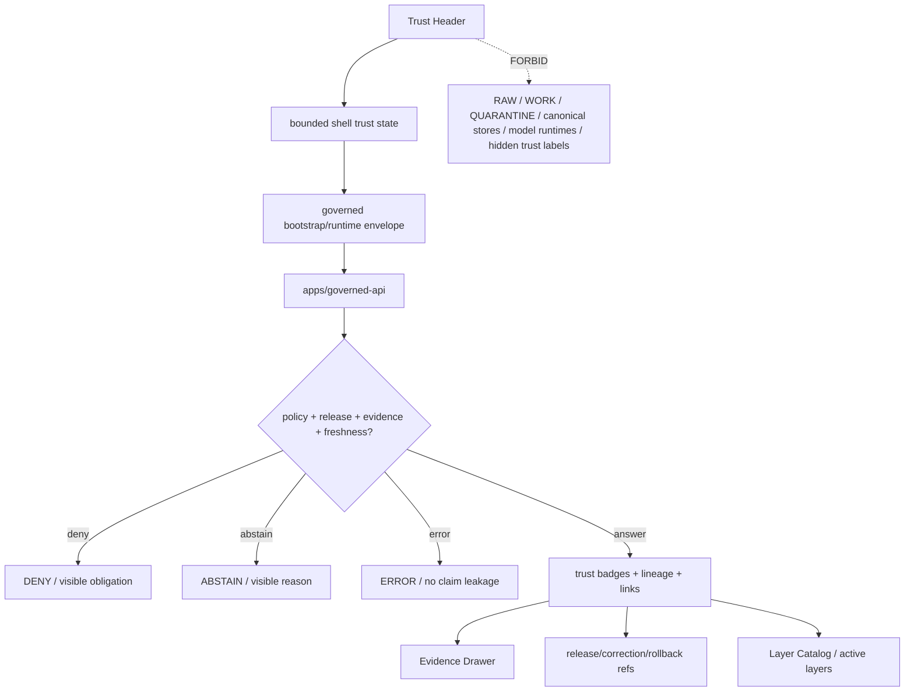

<!-- [KFM_META_BLOCK_V2]
doc_id: kfm://app/explorer-web/src/features/trust_header/readme
title: Explorer Web Trust Header Feature README
type: app-readme
version: v0.1
status: draft
owners: OWNER_TBD — Apps steward · UI steward · Trust-header steward · Governed API steward · Policy steward · Release steward · Evidence steward · Docs steward
created: 2026-06-16
updated: 2026-06-16
policy_label: public
related:
  - ../README.md
  - ../../README.md
  - ../../adapters/README.md
  - ../../../README.md
  - ../../../../README.md
  - ../../../../governed-api/README.md
  - ../../../../../docs/architecture/ui/README.md
  - ../../../../../docs/architecture/ui/GOVERNED_SHELL.md
  - ../../../../../docs/architecture/ui/EVIDENCE_DRAWER.md
  - ../../../../../docs/architecture/ui/LAYERING.md
  - ../../../../../docs/architecture/ui/MAP_RUNTIME_BOUNDARY.md
  - ../../../../../docs/architecture/map-shell.md
  - ../../../../../docs/brand/examples/trust-shell-annotated.md
  - ../../../../../packages/ui/README.md
  - ../../../../../packages/maplibre/README.md
  - ../../../../../policy/access/README.md
  - ../../../../../policy/decision/README.md
  - ../../../../../policy/telemetry/README.md
  - ../../../../../release/README.md
  - ../../../../../data/README.md
tags: [kfm, apps, explorer-web, features, trust-header, status-header, trust-badges, release-state, stale-state, review-state, correction-lineage, policy-posture]
notes:
  - "Replaces the greenfield Trust Header feature stub with a governed feature README."
  - "Trust Header UI features may render trust/status chrome, but they must not decide policy, compute release state, validate citations, resolve evidence, mutate corrections, promote artifacts, or hide required trust labels."
  - "Feature implementation files, route wiring, tests, fixtures, governed API envelopes, trust-state contracts, accessibility behavior, telemetry policy wiring, and package scripts remain NEEDS VERIFICATION."
[/KFM_META_BLOCK_V2] -->

<a id="top"></a>

<div align="center">

# Explorer Web Trust Header Feature

`apps/explorer-web/src/features/trust_header/`

**App-local Explorer Web feature boundary for the visible trust/status header: release state, stale/degraded state, policy posture, review state, correction lineage, rollback availability, citation/evidence status, active route/layer badges, finite outcome summaries, and safe handoffs to Evidence Drawer, Layer Catalog, Focus Panel, Review, Compare, Export, Settings, Diagnostics, and Shell.**


[Purpose](#1-purpose) · [Repo fit](#2-repo-fit) · [Boundary](#3-authority-boundary) · [Inputs](#5-inputs) · [Exclusions](#6-exclusions) · [Feature map](#7-trust-header-feature-map) · [Definition of done](#14-definition-of-done)

</div>

---

> [!IMPORTANT]
> **Status:** draft / `NEEDS VERIFICATION`  
> **Owners:** `OWNER_TBD` — Apps steward · UI steward · Trust-header steward · Governed API steward · Policy steward · Release steward · Evidence steward · Docs steward  
> **Path:** `apps/explorer-web/src/features/trust_header/README.md`  
> **Responsibility root:** `apps/` — deployable application surfaces  
> **Truth posture:** CONFIRMED README path / CONFIRMED GovernedShell and Map Shell trust-header doctrine / PROPOSED feature contract / UNKNOWN implementation files, route wiring, tests, fixtures, schemas, and runtime behavior

> [!CAUTION]
> The Trust Header makes governance visible; it does not make governance decisions. It must not compute allow/deny, suppress warnings, hide stale or correction state, downgrade finite outcomes, replace Evidence Drawer details, promote release state, or let settings/routes/layers remove required trust labels.

---

## Quick jump

- [1. Purpose](#1-purpose)
- [2. Repo fit](#2-repo-fit)
- [3. Authority boundary](#3-authority-boundary)
- [4. Default posture](#4-default-posture)
- [5. Inputs](#5-inputs)
- [6. Exclusions](#6-exclusions)
- [7. Trust Header feature map](#7-trust-header-feature-map)
- [8. Diagram](#8-diagram)
- [9. Trust Header UI obligations](#9-trust-header-ui-obligations)
- [10. Per-module contract](#10-per-module-contract)
- [11. Inspection path](#11-inspection-path)
- [12. Validation expectations](#12-validation-expectations)
- [13. Safe change pattern](#13-safe-change-pattern)
- [14. Definition of done](#14-definition-of-done)
- [15. Open verification items](#15-open-verification-items)

---

## 1. Purpose

`apps/explorer-web/src/features/trust_header/` is the proposed app-local feature boundary for the Explorer Web trust/status header.

It may eventually hold header components, status-badge renderers, finite-state summaries, route/layer trust summaries, evidence/citation status chips, correction and rollback links, policy badges, accessibility labels, and feature orchestration for:

- rendering shell-level release state, stale/degraded state, policy posture, review state, correction lineage, and active route/layer status;
- displaying finite outcome summaries for `ANSWER`, `ABSTAIN`, `DENY`, `ERROR`, and review-only `HOLD` where material;
- preserving evidence, citation, release, policy, review, correction, freshness, and rollback visibility at the point of use;
- summarizing active layer and route trust state without replacing detail panels;
- linking to Evidence Drawer, Layer Catalog, Review Console, Compare, Export, Settings, Diagnostics, and Focus context where allowed;
- preventing trust-signal loss when routes, settings, panels, small viewports, or layer state changes;
- preserving accessibility through text-first badges, ARIA labels, keyboard navigation, focus behavior, reduced motion, and non-color indicators;
- emitting safe telemetry about header interactions without raw evidence, prompts, restricted geometry, secrets, or internal handles.

This directory is not proof that any Trust Header component, hook, state owner, adapter, schema, fixture, test, package script, governed API route, or accessibility behavior is implemented.

[Back to top](#top)

---

## 2. Repo fit

| Concern | Owning root | Expected relationship |
|---|---|---|
| Trust Header feature source | `apps/explorer-web/src/features/trust_header/` | App-local Trust Header modules, if implemented and tested |
| Feature boundary | `apps/explorer-web/src/features/` | Parent feature/root contract |
| Adapter boundary | `apps/explorer-web/src/adapters/` | Governed API, evidence, layer, map, export, diagnostics, and settings adapters |
| Explorer Web app | `apps/explorer-web/` | Map-first public/semi-public shell |
| Governed API | `apps/governed-api/` | Trust membrane and normal bootstrap/runtime/trust-state path |
| GovernedShell doctrine | `docs/architecture/ui/GOVERNED_SHELL.md` | Shell ownership, trust/status header, finite outcome, and bootstrap doctrine |
| Map Shell doctrine | `docs/architecture/map-shell.md` | Map-first, time-aware, trust-visible shell posture |
| Evidence Drawer architecture | `docs/architecture/ui/EVIDENCE_DRAWER.md` | Detail inspection and evidence handoff posture |
| Layering doctrine | `docs/architecture/ui/LAYERING.md` | Layer descriptor, manifest, lifecycle, and trust-badge posture |
| Shared UI components | `packages/ui/` | Reusable banners, badges, chips, popovers, cards, landmarks, and accessibility primitives when shared |
| Renderer wrappers | `packages/maplibre/`, `packages/maplibre-runtime/` | Renderer implementation stays behind adapter boundaries |
| Policy gates | `policy/` | Access, sensitivity, rights, telemetry, release, and decision policy |
| Release authority | `release/` | Publication, correction, supersession, rollback control |
| Lifecycle artifacts | `data/` | Receipts, proofs, registry, catalog, triplets, and published artifacts; not browser-readable directly |

## 3. Authority boundary

This feature renders trust/status chrome. It does not own policy decisions, release decisions, freshness rules, stale-state decisions, review decisions, correction decisions, rollback decisions, evidence resolution, citation validation, source admission, layer publication, schemas, contracts, lifecycle artifacts, renderer authority, model invocation, telemetry payload content, audit truth, or AI output.

```text
apps/explorer-web/src/features/trust_header/ = app-local Trust Header UI feature
apps/explorer-web/src/features/              = feature boundary
apps/explorer-web/src/adapters/              = adapter boundary
apps/governed-api/                           = trust membrane and trust-state path
docs/architecture/ui/GOVERNED_SHELL.md       = shell trust/status header doctrine
docs/architecture/map-shell.md               = map-first trust shell doctrine
packages/ui/                                 = shared UI primitives
policy/                                      = finite policy decisions
data/                                        = lifecycle artifacts, receipts, proofs, registries
release/                                     = publication, correction, rollback authority
```

## 4. Default posture

Trust Header feature modules should fail closed, remain text-first, preserve required trust labels, and make missing or blocked trust state visible instead of quietly rendering a neutral header.

A Trust Header path should not display or apply consequential trust state when any of these are unresolved:

- governed bootstrap/runtime envelope and response validation;
- active route, active layer set, selected feature, selected time, and panel context;
- release state, release manifest reference, rollback target, and correction lineage;
- stale/degraded/freshness state, source vintage, review state, and policy posture;
- evidence status, EvidenceRef/EvidenceBundle support, citation state, and Evidence Drawer link availability;
- sensitivity, rights, access, embargo, delayed-release, living-person, archaeology, rare-species, infrastructure, DNA/genomic, or sovereign/CARE posture;
- finite outcome state: `ANSWER`, `ABSTAIN`, `DENY`, `ERROR`, and review-only `HOLD`;
- accessibility state for badge labels, keyboard navigation, screen-reader text, focus behavior, reduced motion, and non-color status;
- safe telemetry posture.

## 5. Inputs

| Input family | Examples | Required posture |
|---|---|---|
| Shell trust state | route id, active panel, active layer set, selected feature, selected time | Governed shell state only |
| Release state | release id, release refs, release time, rollback target, correction lineage | Release-derived projection only |
| Policy state | access, rights, sensitivity, review, denial/restriction obligations | Policy-derived labels only |
| Evidence state | EvidenceRef count, EvidenceBundle availability, citation validation, Evidence Drawer link | Evidence-derived projection only |
| Freshness state | fresh, stale, degraded, corrected, withdrawn, unknown, expired | Text-labeled and visible |
| Layer state | LayerDescriptor, LayerManifest, source role, rights, sensitivity, stale state | Catalog/governed layer projection only |
| API envelope | bootstrap response, runtime response, `DecisionEnvelope`, finite outcome | Runtime-validated before render |
| UI state | loading, ready, denied, restricted, abstained, stale, degraded, invalid, error | Finite and tested states |
| Accessibility state | text badges, ARIA labels, keyboard path, focus return, non-color indicators | Required for Trust Header UI |

## 6. Exclusions

| Does not belong here | Correct home |
|---|---|
| Governed API bootstrap/runtime/trust implementation | `apps/governed-api/` |
| Policy evaluation, access control, sensitivity rules, or release gates | `policy/`, governed API policy runtime, `release/` |
| Release manifests, rollback cards, correction notices | `release/`, `data/receipts/`, `data/proofs/` as accepted |
| EvidenceBundle construction or citation validation | governed API / evidence resolver / validation packages |
| Evidence Drawer payload construction | governed API / Evidence Drawer feature |
| Layer manifests, source descriptors, catalog records, or source registry editing | `release/`, `data/registry/`, `data/catalog/`, layer/source pipelines |
| Review decisions or correction approval | governed review/correction workflows, not header convenience logic |
| Renderer implementation or direct MapLibre/plugin imports | `packages/maplibre/`, `packages/maplibre-runtime/`, or accepted adapter package |
| Model adapter or direct browser-to-model calls | server-side governed AI runtime behind governed API only |
| Hiding required trust labels through settings, routes, styles, or viewport collapse | Forbidden from Trust Header behavior |
| RAW, WORK, QUARANTINE, canonical stores, graph/vector stores, object stores, unpublished candidates | Forbidden from browser Trust Header path |
| Shared reusable UI primitives | `packages/ui/` |
| Schemas and contracts | `schemas/contracts/v1/ui/`, `schemas/contracts/v1/governance/`, `contracts/` — exact homes `NEEDS VERIFICATION` |
| Lifecycle artifacts, receipts, proofs, published artifacts | `data/` |
| Secrets, credentials, tokens, private keys | Secret manager / deployment environment |

## 7. Trust Header feature map

Exact modules remain `NEEDS VERIFICATION`. Candidate modules should be introduced only with route inventory, fixtures, and tests.

| Candidate module | Purpose | Required safeguard | Status |
|---|---|---|---|
| `trust-header` | Header shell and summary state | Governed trust state only | PROPOSED |
| `release-badges` | Release, rollback, correction, withdrawn, superseded labels | Release refs preserved | PROPOSED |
| `policy-badges` | Access, rights, sensitivity, review, denial/restriction labels | Text/ARIA labels required | PROPOSED |
| `freshness-badges` | Fresh, stale, degraded, unknown, corrected labels | No neutral hiding | PROPOSED |
| `citation-evidence-status` | Citation validation and evidence support summary | Evidence Drawer handoff required | PROPOSED |
| `active-route-layer-status` | Active route/layer trust summary | No layer trust flattening | PROPOSED |
| `negative-state-summary` | Deny, abstain, error, hold, conflict summaries | No silent fallback | PROPOSED |
| `trust-popover` | Expanded support, obligations, lineage, limitations | Detail links preserve refs | PROPOSED |
| `a11y-trust-labels` | Keyboard, focus, screen-reader, non-color labels | Accessibility tests | PROPOSED |
| `telemetry-safe-events` | Record non-content trust-header UI events | No raw evidence or restricted geometry | PROPOSED |

> [!WARNING]
> Candidate module names are not implementation proof. Do not document a Trust Header module as runnable until files, route wiring, tests, fixtures, package scripts, governed API envelopes, trust-state contracts, and accessibility fixtures confirm it.

## 8. Diagram



## 9. Trust Header UI obligations

| Obligation | Example effect |
|---|---|
| `trust_visible_by_default` | Release, freshness, policy, review, correction, rollback, evidence, and citation state remain visible where material |
| `governed_api_only` | Header state comes from governed bootstrap/runtime envelopes or bounded shell state |
| `badges_text_first` | Badge meaning is visible as text and ARIA labels, not color alone |
| `no_trust_suppression` | Settings, route changes, viewport collapse, or styles cannot remove required trust labels |
| `finite_states_required` | `ANSWER`, `ABSTAIN`, `DENY`, `ERROR`, and `HOLD` states are explicit when header summarizes outcomes |
| `evidence_drawer_handoff` | Consequential support summaries link to Evidence Drawer rather than replacing it |
| `release_lineage_visible` | Correction, rollback, withdrawn, superseded, and release lineage remain inspectable |
| `policy_release_visible` | Delayed release, embargo, sensitivity, access, and review constraints remain visible |
| `safe_telemetry_only` | Telemetry records UI interactions only, never raw evidence, restricted geometry, prompts, or secrets |
| `no_authority_fork` | Feature code does not redefine evidence, citation, freshness, policy, release, review, correction, schema, contract, source, renderer, or model authority |

## 10. Per-module contract

Every long-lived Trust Header module should document or encode:

- whether it is header shell, badge renderer, popover, lineaged-link renderer, active-layer summary, route summary, accessibility module, or telemetry module;
- governed API envelope dependency, if any;
- release, review, correction, rollback, freshness, policy, evidence, citation, sensitivity, and rights fields consumed;
- finite outcome and negative-state behavior;
- hiding/collapsing behavior on narrow viewports;
- Evidence Drawer, Layer Catalog, Review, Compare, Export, Focus, Settings, Diagnostics, and Shell handoff behavior;
- accessibility behavior for text labels, ARIA labels, keyboard access, focus, reduced motion, and non-color badges;
- telemetry emitted, if any;
- tests and fixtures proving trust-membrane, trust-label preservation, freshness, release, policy, evidence/citation, handoff, safe-telemetry, and accessibility constraints.

## 11. Inspection path

Trust Header implementation files, route wiring, tests, fixtures, governed API envelopes, trust-state contracts, accessibility behavior, telemetry, package scripts, and downstream feature handoffs remain `NEEDS VERIFICATION`.

```bash
find apps/explorer-web/src/features/trust_header -maxdepth 5 -type f | sort
find apps/explorer-web/src apps/governed-api docs/architecture/ui docs/architecture packages/ui packages/maplibre packages/maplibre-runtime schemas contracts policy release data tests fixtures -maxdepth 6 -type f 2>/dev/null | grep -Ei 'trust.?header|status.?header|trust.?badge|release.?state|stale|freshness|degraded|review.?state|correction|rollback|PolicyDecision|DecisionEnvelope|EvidenceBundle|EvidenceRef|CitationValidationReport|LayerDescriptor|LayerManifest|a11y|accessibility|telemetry' | sort
find data/raw data/work data/quarantine data/processed data/catalog data/triplets data/published data/receipts data/proofs -maxdepth 2 -type f 2>/dev/null | sort
```

## 12. Validation expectations

Useful validation for this feature boundary should cover:

- no Trust Header feature imports or reads lifecycle/canonical data roots directly;
- no browser-side model runtime calls or provider SDK use;
- trust state consumes governed API envelopes or bounded shell state only;
- missing release, freshness, policy, evidence, citation, review, correction, or rollback state renders visible `ABSTAIN`, `DENY`, `ERROR`, `HOLD`, unknown, stale, degraded, or unavailable labels rather than neutral success;
- required trust labels cannot be hidden by settings, route transitions, viewport collapse, CSS, or layer state;
- badge text and ARIA labels survive feature composition;
- Evidence Drawer links preserve EvidenceRef/EvidenceBundle references;
- release/correction/rollback links preserve refs without mutating state;
- telemetry never includes raw evidence, exact restricted geometry, prompts, secrets, internal handles, or full EvidenceBundle copies;
- accessibility tests cover keyboard access, focus management, screen-reader labels, reduced motion, compact layouts, and non-color trust badges.

## 13. Safe change pattern

For Trust Header feature changes:

1. Add or update module inventory and per-module contract.
2. Add fixtures for released, unreleased, stale, degraded, corrected, withdrawn, superseded, denied, abstained, restricted, held, invalid, loading, empty, and error states.
3. Test lifecycle/canonical-data denial, no-browser-model behavior, governed API/shell-state behavior, and required-label preservation.
4. Preserve release state, stale/degraded state, policy posture, review state, correction lineage, rollback refs, citations, EvidenceRef refs, route state, layer state, and accessibility state through UI composition.
5. Test keyboard/screen-reader/reduced-motion paths before claiming Trust Header usability.
6. Update this README, parent `features/README.md`, GovernedShell docs, Map Shell docs, and parent app README when public behavior changes.

## 14. Definition of done

- [ ] Owners are confirmed and `OWNER_TBD` is replaced.
- [ ] Trust Header feature file inventory and route/module ownership are documented.
- [ ] Governed API or bounded shell-state dependencies are explicit.
- [ ] Trust-state schema/contract and fixtures are verified.
- [ ] Release, stale/degraded, review, correction, rollback, policy, evidence, citation, and negative states are represented in UI fixtures.
- [ ] Direct lifecycle/canonical-data import/read checks are covered.
- [ ] Browser model-runtime denial is tested.
- [ ] Required trust labels cannot be hidden by settings, CSS, route, viewport, or layer state.
- [ ] Evidence Drawer, Layer Catalog, Review, Compare, Export, Focus, Settings, Diagnostics, and Shell handoffs are tested for safe governed refs if present.
- [ ] Accessibility behavior is tested for keyboard, focus, ARIA, reduced motion, compact layouts, and non-color badges.

## 15. Open verification items

| Item | Why it matters |
|---|---|
| Confirm Trust Header implementation files beyond README | Prevents overclaiming feature maturity |
| Confirm route/module inventory and launch surfaces | Required for UI boundary review |
| Confirm trust-state owner and schema/contract | Required before trust-header behavior claims |
| Confirm governed API/bootstrap/runtime trust fields | Required for trust membrane enforcement |
| Confirm trust-badge fixture coverage | Required to avoid invisible governance state |
| Confirm stale/freshness policy behavior | Required before public freshness claims |
| Confirm correction/rollback link behavior | Required before lineage UI claims |
| Confirm Evidence Drawer and Export/Compare/Focus handoff behavior | Required before downstream workflow claims |
| Confirm safe telemetry behavior | Required before diagnostics/observability claims |
| Confirm accessibility tests | Required because trust state must be accessible |
| Confirm package scripts beyond TODO | Required before build/test claims |

<details>
<summary>Appendix A — no-loss preservation note</summary>

The previous README was a greenfield stub. This replacement adds a bounded Trust Header feature contract without claiming header components, routes, hooks, adapters, fixtures, tests, package scripts, governed API envelopes, schemas, trust-state ownership, accessibility behavior, telemetry behavior, or downstream handoffs are implemented.

</details>

## Status summary

`apps/explorer-web/src/features/trust_header/` should contain Trust Header feature modules only after route/module contracts, governed API or shell-state envelopes, schema bindings, negative-state fixtures, required-label preservation tests, accessibility tests, safe telemetry constraints, and downstream handoffs are verified.

It must preserve the trust membrane and trust-visible-header boundary: Trust Header may display release state, stale/degraded state, policy posture, review state, correction lineage, rollback availability, evidence/citation state, and active route/layer status, but it must not become policy authority, release authority, evidence resolver, citation validator, review authority, lifecycle storage, raw/canonical data path, model client, or a shortcut that hides required trust labels.

<p align="right"><a href="#top">Back to top</a></p>
