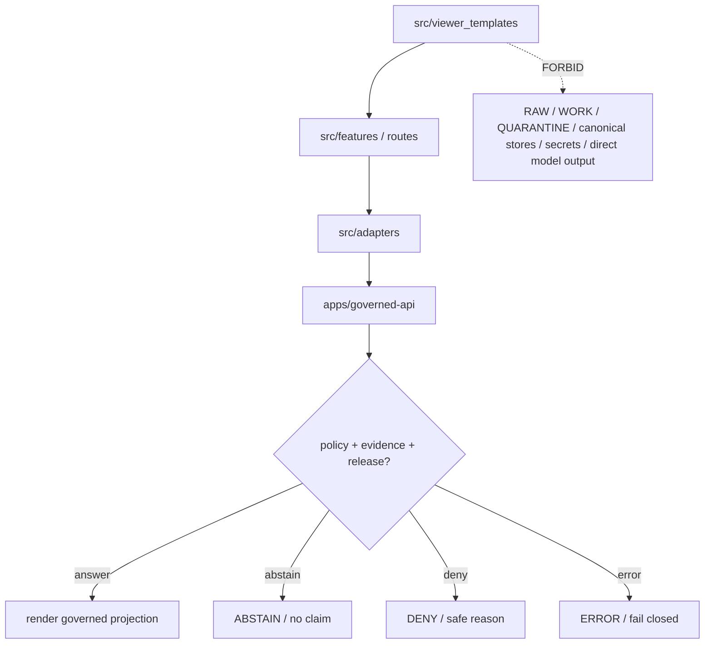

<!-- [KFM_META_BLOCK_V2]
doc_id: kfm://app/explorer-web/src/viewer_templates/readme
title: Explorer Web Viewer Templates README
type: app-readme
version: v0.1
status: draft
owners: OWNER_TBD — Apps steward · UI steward · Viewer template steward · Map steward · Governed API steward · Policy steward · Docs steward
created: 2026-06-16
updated: 2026-06-16
policy_label: public
related:
  - ../README.md
  - ../../README.md
  - ../features/shell/README.md
  - ../features/map_runtime/README.md
  - ../features/layer_catalog/README.md
  - ../features/evidence_drawer/README.md
  - ../features/focus_panel/README.md
  - ../features/story_player/README.md
  - ../features/export/README.md
  - ../../../governed-api/README.md
  - ../../../../docs/architecture/ui/GOVERNED_SHELL.md
  - ../../../../docs/architecture/ui/MAP_RUNTIME_BOUNDARY.md
  - ../../../../docs/architecture/ui/LAYERING.md
  - ../../../../docs/doctrine/directory-rules.md
  - ../../../../packages/ui/README.md
  - ../../../../packages/maplibre/README.md
  - ../../../../policy/access/README.md
  - ../../../../policy/decision/README.md
  - ../../../../release/README.md
  - ../../../../data/README.md
tags: [kfm, apps, explorer-web, src, viewer-templates, templates, governed-shell, map-first, compatibility-boundary]
notes:
  - "Replaces an empty viewer_templates README with a governed app-local template boundary."
  - "This path is under apps/explorer-web/src, so it is app-local implementation support. It must not be confused with any top-level `viewer_templates/` compatibility root or treated as a parallel shell authority."
  - "Viewer templates may scaffold governed UI views or static mock carriers, but they must not become source truth, evidence authority, policy authority, renderer authority, release authority, lifecycle storage, or direct model-output truth."
  - "Template files, route wiring, tests, fixtures, renderer bindings, export bindings, and package scripts remain NEEDS VERIFICATION."
[/KFM_META_BLOCK_V2] -->

<a id="top"></a>

<div align="center">

# Explorer Web Viewer Templates

`apps/explorer-web/src/viewer_templates/`

**App-local source boundary for viewer template files that may support the Explorer Web shell, map runtime, evidence surfaces, story/focus/export views, and static mock carriers without becoming a public truth path or a parallel UI authority.**


[Purpose](#1-purpose) · [Repo fit](#2-repo-fit) · [Boundary](#3-authority-boundary) · [Inputs](#5-inputs) · [Exclusions](#6-exclusions) · [Template map](#7-viewer-template-map) · [Definition of done](#14-definition-of-done)

</div>

---

> [!IMPORTANT]
> **Status:** draft / `NEEDS VERIFICATION`  
> **Owners:** `OWNER_TBD` — Apps steward · UI steward · Viewer template steward · Map steward · Governed API steward · Policy steward · Docs steward  
> **Path:** `apps/explorer-web/src/viewer_templates/README.md`  
> **Responsibility root:** `apps/` — deployable application surfaces  
> **Truth posture:** CONFIRMED README path / CONFIRMED Explorer Web app-source boundary / CONFIRMED top-level `viewer_templates/` is a compatibility root by doctrine / PROPOSED app-local template contract / UNKNOWN template files, route wiring, tests, fixtures, and runtime behavior

> [!CAUTION]
> Viewer templates are carriers and scaffolds, not evidence, release, policy, or renderer authority. A template may shape how a governed payload is displayed, but it must not contain authoritative claims, unpublished lifecycle content, secrets, direct model output, unreviewed source data, or hard-coded sensitive geometry.

---

## Quick jump

- [1. Purpose](#1-purpose)
- [2. Repo fit](#2-repo-fit)
- [3. Authority boundary](#3-authority-boundary)
- [4. Default posture](#4-default-posture)
- [5. Inputs](#5-inputs)
- [6. Exclusions](#6-exclusions)
- [7. Viewer template map](#7-viewer-template-map)
- [8. Diagram](#8-diagram)
- [9. Viewer template obligations](#9-viewer-template-obligations)
- [10. Per-template contract](#10-per-template-contract)
- [11. Inspection path](#11-inspection-path)
- [12. Validation expectations](#12-validation-expectations)
- [13. Safe change pattern](#13-safe-change-pattern)
- [14. Definition of done](#14-definition-of-done)
- [15. Open verification items](#15-open-verification-items)

---

## 1. Purpose

`apps/explorer-web/src/viewer_templates/` is an app-local home for viewer templates that may support Explorer Web implementation.

It may eventually hold static or generated template fragments for:

- shell and route mock carriers;
- map-first viewer mockups;
- layer legend or card templates;
- Evidence Drawer projection templates;
- Focus, Story, Compare, Export, Settings, Diagnostics, or review-display mock states;
- safe screenshots or static examples used in tests, demos, or docs;
- fixture-only HTML/Markdown/JSON carriers that demonstrate UI layout without becoming runtime truth.

This directory is not proof that any viewer template, renderer binding, route, import path, test, fixture, package script, or governed API integration is implemented.

[Back to top](#top)

---

## 2. Repo fit

| Concern | Owning root | Expected relationship |
|---|---|---|
| App-local viewer templates | `apps/explorer-web/src/viewer_templates/` | Source-local template carriers for Explorer Web, if implemented and tested |
| Explorer Web source tree | `apps/explorer-web/src/` | Implementation source boundary for the app |
| Explorer Web app | `apps/explorer-web/` | Deployable public/semi-public UI boundary |
| Feature surfaces | `apps/explorer-web/src/features/` | Runtime feature modules that may consume or supersede templates |
| Adapter boundary | `apps/explorer-web/src/adapters/` | Governed API, map, evidence, export, diagnostics, and settings adapters |
| Governed API | `apps/governed-api/` | Trust membrane and normal payload path |
| Shared UI components | `packages/ui/` | Reusable components extracted from templates only after acceptance |
| Renderer wrappers | `packages/maplibre/`, `packages/maplibre-runtime/` | Renderer behavior stays behind accepted wrappers/adapters |
| Policy gates | `policy/` | Access, sensitivity, rights, telemetry, release, and decision policy |
| Release authority | `release/` | Publication, correction, supersession, rollback control |
| Lifecycle artifacts | `data/` | Receipts, proofs, registry, catalog, triplets, and published artifacts; not browser-readable directly |
| Compatibility roots | top-level `viewer_templates/`, `ui/`, `web/`, `styles/` | Compatibility or migration roots only; not parallel app authorities |

## 3. Authority boundary

This directory may contain app-local template carriers. It does not own Explorer Web route authority, UI doctrine, shared UI primitives, renderer implementation, evidence resolution, citation validation, policy decisions, release decisions, source admission, schemas, contracts, lifecycle artifacts, canonical stores, telemetry payload content, model invocation, or AI output.

```text
apps/explorer-web/src/viewer_templates/ = app-local viewer template carriers
apps/explorer-web/src/                  = Explorer Web implementation source
apps/explorer-web/src/features/         = runtime feature modules
apps/explorer-web/src/adapters/         = adapter boundary
apps/governed-api/                      = trust membrane and runtime payload path
packages/ui/                            = shared reusable UI primitives
packages/maplibre*/                     = renderer implementation/wrapper boundary, if verified
policy/                                 = finite policy decisions
data/                                   = lifecycle artifacts, receipts, proofs, registries
release/                                = publication, correction, rollback authority
```

## 4. Default posture

Viewer templates should be treated as inert carriers unless runtime wiring proves otherwise. They should fail closed by omission: no claim-bearing, policy-significant, source-derived, or sensitive detail belongs in a template unless it is mock-only or supplied through governed runtime envelopes.

A viewer template should not be used when any of these are unresolved:

- owner and template purpose;
- whether it is mock-only, test-only, docs-only, demo-only, or runtime-bound;
- governed API envelope shape used by the template;
- evidence, citation, release, rights, sensitivity, freshness, stale-state, correction, or rollback fields surfaced by the template;
- whether the template includes static data, geometry, source excerpts, screenshots, model text, or generated copy;
- renderer adapter boundary and asset-loading behavior;
- accessibility labels, focus order, reduced-motion behavior, and non-color trust labels;
- export, screenshot, or print behavior;
- safe telemetry posture.

## 5. Inputs

| Input family | Examples | Required posture |
|---|---|---|
| Template metadata | template id, owner, status, audience, mock/runtime mode | Explicit and reviewable |
| Runtime envelope | `DecisionEnvelope`, `EvidenceDrawerPayload`, `LayerDescriptor`, `RuntimeResponseEnvelope` | Governed projection only |
| Mock fixture | placeholder map, placeholder evidence, sample finite outcome, fake source label | Marked `mock_only`; never release evidence |
| Trust state | rights, sensitivity, source role, release, review, correction, rollback, freshness | Visible and text-labeled when material |
| Renderer state | map placeholder, layer ref, style ref, static preview | No direct renderer authority |
| Export state | screenshot, print, PDF, story card, report carrier | Governed export path only if proof-bearing |
| UI state | loading, answer, abstain, deny, error, hold, stale, empty, restricted | Finite and tested states |
| Accessibility state | labels, landmarks, keyboard path, reduced motion, alt text | Required before public use |

## 6. Exclusions

| Does not belong here | Correct home |
|---|---|
| Public API implementation | `apps/governed-api/` |
| Runtime feature code that has matured beyond template support | `apps/explorer-web/src/features/` |
| Shared reusable UI primitives | `packages/ui/` |
| Renderer implementation or direct MapLibre/plugin imports | `packages/maplibre/`, `packages/maplibre-runtime/`, or accepted adapter package |
| Policy decisions or sensitivity rules | `policy/`, governed API policy runtime |
| Schemas and contracts | `schemas/contracts/v1/`, `contracts/` |
| Lifecycle artifacts, receipts, proofs, catalog, triplets, published artifacts | `data/` |
| Release manifests, rollback cards, correction notices | `release/` |
| Source acquisition or source registry editing | `connectors/`, `data/registry/`, source catalog lanes |
| Direct model runtime behavior | `runtime/` behind governed API only |
| Authoritative evidence text, raw source excerpts, unreleased data, PII, secrets, restricted geometry | Forbidden in templates unless clearly fake/mock and never released |
| Top-level compatibility root governance | top-level `viewer_templates/` migration/compatibility docs, not this app-local source path |

## 7. Viewer template map

Exact template files remain `NEEDS VERIFICATION`. Candidate template families should be introduced only with inventory, purpose, fixtures, and tests.

| Candidate template family | Purpose | Required safeguard | Status |
|---|---|---|---|
| `shell` | Static shell layout or frame examples | No trust-label suppression | PROPOSED |
| `map-runtime` | Map placeholder or renderer-state mock carriers | No raw layer data or renderer authority | PROPOSED |
| `layer-catalog` | Layer card, legend, badge, or catalog layout examples | Mock-only unless governed runtime-bound | PROPOSED |
| `evidence-drawer` | Evidence projection layout examples | EvidenceBundle-derived payload only | PROPOSED |
| `focus-panel` | Focus finite-state layout examples | No direct model output | PROPOSED |
| `story-player` | Story node/card/timeline examples | Evidence gate and 2D-first labels | PROPOSED |
| `compare-export` | Report, card, print, or download carrier examples | No uncited export; receipt path required | PROPOSED |
| `diagnostics-settings` | Safe diagnostics or settings layout examples | No secrets/raw telemetry | PROPOSED |
| `review-readonly` | Review summary mock display | No review mutation path | PROPOSED |
| `a11y-fixtures` | Keyboard, reduced-motion, screen-reader examples | Accessibility tests required | PROPOSED |

> [!WARNING]
> Candidate names are not implementation proof. Do not document a template as used by runtime, tests, docs, exports, or demos until files, references, package scripts, and fixtures confirm it.

## 8. Diagram



## 9. Viewer template obligations

| Obligation | Example effect |
|---|---|
| `mock_status_visible` | Mock/demo/test-only templates declare that status clearly |
| `governed_runtime_only` | Runtime-bound templates render governed envelopes, not local source files |
| `no_authoritative_claims` | Templates do not store real claims, evidence, release decisions, or policy decisions |
| `trust_labels_required` | Required trust, policy, release, correction, freshness, and citation labels cannot be omitted |
| `no_sensitive_payloads` | PII, precise restricted geometry, secrets, raw source excerpts, and internal handles stay out |
| `finite_states_required` | Answer, abstain, deny, error, hold, loading, stale, restricted, and empty states remain visible |
| `renderer_boundary_preserved` | Templates do not import or define renderer behavior directly |
| `export_receipt_required` | Proof-bearing export/print carriers route through governed export and receipt checks |
| `safe_telemetry_only` | Template interactions never emit raw evidence, prompts, restricted geometry, or secrets |
| `no_parallel_authority` | App-local templates do not revive top-level compatibility roots as authority roots |

## 10. Per-template contract

Every durable viewer template should document or encode:

- template id, owner, purpose, status, and audience;
- whether the template is mock-only, docs-only, test-only, demo-only, or runtime-bound;
- runtime envelope or fixture shape consumed;
- source of all copy, labels, citations, badges, and placeholders;
- evidence/citation/release/policy/freshness/correction/rollback fields displayed;
- sensitive-field denial and mock-data safeguards;
- accessibility behavior: labels, landmarks, keyboard path, focus, contrast, alt text, reduced motion, and non-color trust badges;
- export/print/screenshot behavior;
- tests or fixtures proving trust membrane, no-sensitive-payload, finite-state, accessibility, and no-parallel-authority constraints.

## 11. Inspection path

Viewer template files, imports, route usage, tests, fixtures, governed API envelope bindings, accessibility behavior, telemetry, package scripts, and export/print handoffs remain `NEEDS VERIFICATION`.

```bash
find apps/explorer-web/src/viewer_templates -maxdepth 5 -type f | sort
find apps/explorer-web/src docs/architecture/ui packages/ui packages/maplibre packages/maplibre-runtime schemas contracts policy release data tests fixtures -maxdepth 6 -type f 2>/dev/null | grep -Ei 'viewer.?template|template|mock_only|DecisionEnvelope|RuntimeResponseEnvelope|EvidenceDrawerPayload|EvidenceBundle|LayerDescriptor|StoryManifest|ExportReceipt|trust.?badge|release|rollback|correction|a11y|accessibility|telemetry' | sort
find viewer_templates ui web styles -maxdepth 4 -type f 2>/dev/null | sort
```

## 12. Validation expectations

Useful validation for this boundary should cover:

- no viewer template imports or reads lifecycle/canonical data roots directly;
- no browser-side model runtime calls or provider SDK use;
- no real raw evidence, PII, secrets, exact restricted geometry, internal handles, or source excerpts in templates;
- mock fixtures carry visible `mock_only` or equivalent labels;
- runtime-bound templates consume governed envelopes only;
- trust labels, finite outcomes, citations, redaction/generalization labels, correction lineage, and rollback labels cannot be omitted by template convenience;
- screenshots, printable templates, and report carriers are not proof-bearing KFM exports without governed ExportReceipt support;
- accessibility tests cover landmarks, headings, keyboard order, focus management, alt text, reduced motion, and non-color trust badges;
- top-level compatibility roots are not reintroduced as parallel app authorities.

## 13. Safe change pattern

For Viewer Template changes:

1. Add or update template inventory and per-template contract.
2. Mark mock/demo/test-only templates clearly.
3. Add fixtures for answer, abstain, deny, error, hold, stale, restricted, loading, empty, invalid, and sensitive-denied states when the template is consequential.
4. Test lifecycle/canonical-data denial, no-browser-model behavior, governed-envelope behavior, and no-sensitive-payload behavior.
5. Preserve trust labels, finite outcomes, policy labels, evidence refs, citation state, release/correction/rollback refs, redaction/generalization labels, and accessibility labels through template composition.
6. Update this README, parent `src/README.md`, parent app README, and affected feature READMEs when template behavior changes public UI behavior.

## 14. Definition of done

- [ ] Owners are confirmed and `OWNER_TBD` is replaced.
- [ ] Viewer template file inventory is documented.
- [ ] Each durable template has a declared purpose and mock/runtime/docs/test/demo status.
- [ ] Governed API or fixture dependencies are explicit.
- [ ] Any runtime-bound envelope schemas are verified.
- [ ] Direct lifecycle/canonical-data import/read checks are covered.
- [ ] Browser model-runtime denial is tested.
- [ ] Sensitive-payload denial is tested.
- [ ] Required trust labels and finite states are tested.
- [ ] Export/print/screenshot behavior is bounded and receipt-aware.
- [ ] Accessibility behavior is tested for headings, landmarks, keyboard, focus, ARIA, reduced motion, alt text, and non-color badges.

## 15. Open verification items

| Item | Why it matters |
|---|---|
| Confirm template file inventory beyond this README | Prevents overclaiming implementation maturity |
| Confirm whether templates are runtime-bound, fixture-bound, docs-only, or demo-only | Determines validation and release posture |
| Confirm route or feature imports | Required before claiming template usage |
| Confirm template fixture status and mock markers | Prevents mock data becoming evidence-like |
| Confirm no sensitive payloads | Required before public/demo use |
| Confirm export/print/screenshot behavior | Required before outbound carrier use |
| Confirm accessibility tests | Required because templates may become user-visible shell surfaces |
| Confirm package scripts beyond TODO | Required before build/test claims |
| Confirm top-level `viewer_templates/` relationship | Required before migration or compatibility claims |

<details>
<summary>Appendix A — no-loss preservation note</summary>

The previous README was empty. This replacement adds a bounded app-local viewer-template contract without claiming template files, route usage, tests, fixtures, package scripts, governed API envelopes, renderer wiring, accessibility behavior, telemetry behavior, export behavior, or top-level compatibility-root migration are implemented.

</details>

## Status summary

`apps/explorer-web/src/viewer_templates/` should contain app-local viewer template carriers only after template inventory, owner, purpose, fixture/mock status, governed-envelope expectations, accessibility behavior, and no-sensitive-payload checks are verified.

It must preserve the trust membrane and compatibility-root boundary: templates may scaffold user-facing displays, but they must not become source truth, policy authority, evidence resolver, release authority, renderer authority, lifecycle storage, model client, proof-bearing export, or a revival of top-level `viewer_templates/` as a parallel shell authority.

<p align="right"><a href="#top">Back to top</a></p>
