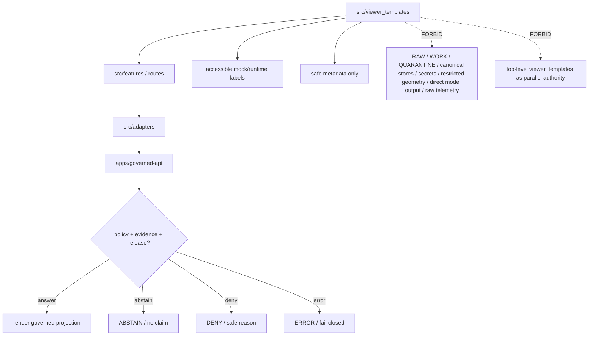

<!-- [KFM_META_BLOCK_V2]
doc_id: kfm://app/explorer-web/src/viewer_templates/readme
title: Explorer Web Viewer Templates README
type: app-readme
version: v0.2
status: draft
owners: OWNER_TBD — Apps steward · UI steward · Viewer template steward · Map steward · Governed API steward · Policy steward · Evidence steward · Release steward · Accessibility steward · Telemetry steward · Docs steward
created: 2026-06-16
updated: 2026-07-09
policy_label: public
related:
  - ../README.md
  - ../../README.md
  - ../features/README.md
  - ../features/shell/README.md
  - ../features/map_runtime/README.md
  - ../features/layer_catalog/README.md
  - ../features/evidence_drawer/README.md
  - ../features/focus_panel/README.md
  - ../features/story_player/README.md
  - ../features/export/README.md
  - ../features/settings/README.md
  - ../features/diagnostics/README.md
  - ../../../governed-api/README.md
  - ../../../../docs/doctrine/directory-rules.md
  - ../../../../docs/architecture/ui/README.md
  - ../../../../docs/architecture/ui/BOUNDARIES.md
  - ../../../../docs/architecture/ui/GOVERNED_SHELL.md
  - ../../../../docs/architecture/ui/MAP_RUNTIME_BOUNDARY.md
  - ../../../../docs/architecture/ui/LAYERING.md
  - ../../../../docs/architecture/ui/EVIDENCE_DRAWER.md
  - ../../../../docs/architecture/ui/ACCESSIBILITY.md
  - ../../../../docs/architecture/ui/TELEMETRY.md
  - ../../../../packages/ui/README.md
  - ../../../../packages/maplibre/README.md
  - ../../../../packages/maplibre-runtime/README.md
  - ../../../../policy/access/README.md
  - ../../../../policy/decision/README.md
  - ../../../../policy/telemetry/README.md
  - ../../../../release/README.md
  - ../../../../data/README.md
tags: [kfm, apps, explorer-web, src, viewer-templates, templates, governed-shell, map-first, compatibility-boundary, mock-carriers, template-not-truth, no-sensitive-payloads]
notes:
  - "Refreshes the Explorer Web app-local viewer template boundary README."
  - "This path is under apps/explorer-web/src, so it is app-local implementation support. It must not be confused with any top-level `viewer_templates/` compatibility root or treated as a parallel shell authority."
  - "Viewer templates may scaffold governed UI views, test fixtures, docs/demo mock carriers, static layout examples, or runtime-bound projection shells, but they must not become source truth, evidence authority, policy authority, renderer authority, release authority, lifecycle storage, telemetry authority, or direct model-output truth."
  - "Template files, route wiring, imports, tests, fixtures, governed API envelope bindings, renderer bindings, export/print/screenshot bindings, accessibility behavior, telemetry policy wiring, and package scripts remain NEEDS VERIFICATION."
  - "policy/telemetry/README.md currently exists as a greenfield bundle stub; executable telemetry policy wiring remains NEEDS VERIFICATION."
  - "packages/maplibre-runtime/README.md was not found on main during this revision, so runtime-package specifics remain NEEDS VERIFICATION."
  - "v0.2 adds a current evidence basis, minimum safe template slice, runtime anti-bypass matrix, stronger mock/runtime-status labels, sensitive-payload denial, export/print/screenshot receipt posture, accessibility gates, telemetry safeguards, and compatibility-root separation without claiming runtime maturity."
[/KFM_META_BLOCK_V2] -->

<a id="top"></a>

<div align="center">

# Explorer Web Viewer Templates

`apps/explorer-web/src/viewer_templates/`

**App-local source boundary for inert or bounded viewer template carriers that may support the Explorer Web shell, map runtime, evidence surfaces, story/focus/export views, screenshots, print/report mockups, test fixtures, docs/demo examples, and static UI scaffolds without becoming a public truth path, proof-bearing export path, telemetry authority, or parallel UI authority.**


[Evidence](#0-evidence-basis-for-this-revision) · [Purpose](#1-purpose) · [Repo fit](#2-repo-fit) · [Boundary](#3-authority-boundary) · [Inputs](#5-inputs) · [Exclusions](#6-exclusions) · [Template map](#7-viewer-template-map) · [Minimum slice](#8-minimum-safe-template-slice) · [Definition of done](#16-definition-of-done)

</div>

---

> [!IMPORTANT]
> **Status:** draft / `NEEDS VERIFICATION`  
> **Owners:** `OWNER_TBD` — Apps steward · UI steward · Viewer template steward · Map steward · Governed API steward · Policy steward · Evidence steward · Release steward · Accessibility steward · Telemetry steward · Docs steward  
> **Path:** `apps/explorer-web/src/viewer_templates/README.md`  
> **Responsibility root:** `apps/` — deployable application surfaces  
> **Directory Rules basis:** deployable application support under `apps/explorer-web/src/` belongs to the Explorer Web app boundary. App-local `src/viewer_templates/` is implementation support, not a canonical root. Top-level `viewer_templates/` is treated by Directory Rules as a compatibility root, not a new app authority.  
> **Truth posture:** CONFIRMED current GitHub README path / CONFIRMED Explorer Web app-source boundary / CONFIRMED Directory Rules document lists `viewer_templates/` among compatibility roots / CONFIRMED UI Boundaries doctrine exists / CONFIRMED `policy/telemetry/README.md` exists as greenfield stub / CONFIRMED `packages/maplibre-runtime/README.md` not found on `main` during this revision / PROPOSED app-local template contract / UNKNOWN template files, route wiring, imports, tests, fixtures, governed API envelope bindings, renderer bindings, export/print/screenshot bindings, accessibility behavior, telemetry policy wiring, package scripts, and runtime behavior

> [!CAUTION]
> Viewer templates are carriers and scaffolds, not evidence, release, policy, renderer, telemetry, or publication authority. A template may shape how a governed payload is displayed, but it must not contain authoritative claims, unpublished lifecycle content, secrets, direct model output, unreviewed source data, raw evidence excerpts, exact restricted geometry, or hidden sensitive identifiers.

---

## Quick jump

- [0. Evidence basis for this revision](#0-evidence-basis-for-this-revision)
- [1. Purpose](#1-purpose)
- [2. Repo fit](#2-repo-fit)
- [3. Authority boundary](#3-authority-boundary)
- [4. Default posture](#4-default-posture)
- [5. Inputs](#5-inputs)
- [6. Exclusions](#6-exclusions)
- [7. Viewer template map](#7-viewer-template-map)
- [8. Minimum safe template slice](#8-minimum-safe-template-slice)
- [9. Diagram](#9-diagram)
- [10. Viewer template obligations](#10-viewer-template-obligations)
- [11. Per-template contract](#11-per-template-contract)
- [12. Runtime anti-bypass matrix](#12-runtime-anti-bypass-matrix)
- [13. Inspection path](#13-inspection-path)
- [14. Validation expectations](#14-validation-expectations)
- [15. Safe change pattern](#15-safe-change-pattern)
- [16. Definition of done](#16-definition-of-done)
- [17. Open verification items](#17-open-verification-items)

---

## 0. Evidence basis for this revision

This README is a documentation boundary, not runtime proof. The 2026-07-09 revision updates an existing README and keeps implementation maturity bounded while aligning app-local viewer templates with the Explorer Web trust membrane and Directory Rules compatibility-root posture.

| Evidence item | Status | What it supports | What it does not prove |
|---|---|---|---|
| `apps/explorer-web/src/viewer_templates/README.md` exists on `main`. | CONFIRMED | This is an existing README update, not a new path proposal. | It does not prove template files, imports, route use, fixtures, package scripts, export/print behavior, telemetry, accessibility, or runtime behavior exist. |
| `apps/explorer-web/src/features/README.md` exists and defines app-local feature modules as UI composition surfaces. | CONFIRMED document presence | Viewer templates should support app-local feature composition only; mature runtime UI belongs under feature or shared component homes. | It does not prove any template is consumed by features. |
| `docs/doctrine/directory-rules.md` exists and states that root placement encodes ownership and lifecycle; its diagram also treats `viewer_templates/` as a compatibility root. | CONFIRMED document presence and compatibility-root posture | App-local `src/viewer_templates/` must not revive a top-level compatibility root as authority. | It does not prove a top-level `viewer_templates/` directory currently exists or is migrated. |
| `docs/architecture/ui/BOUNDARIES.md` exists and states that UI surfaces are faces for released artifacts that have passed validation, policy, and promotion gates. | CONFIRMED document presence and doctrine posture | Templates must not become a bypass around governed UI boundaries. | It does not prove template implementation or runtime wiring. |
| `docs/architecture/ui/GOVERNED_SHELL.md`, `MAP_RUNTIME_BOUNDARY.md`, `LAYERING.md`, `EVIDENCE_DRAWER.md`, `ACCESSIBILITY.md`, and `TELEMETRY.md` are referenced as UI boundary docs. | CONFIRMED path evidence where present or referenced | Template carriers should preserve shell, renderer, layer, evidence, accessibility, and telemetry boundaries. | They do not prove template conformance or tests. |
| `policy/telemetry/README.md` exists as a greenfield bundle stub. | CONFIRMED placeholder state | Telemetry policy wiring must remain `NEEDS VERIFICATION`. | It does not prove executable telemetry policy bundles, schemas, validators, or runtime wiring exist. |
| `packages/maplibre-runtime/README.md` was not found on `main` during this revision. | CONFIRMED absence from GitHub fetch attempt | Runtime-package references remain `NEEDS VERIFICATION`. | It does not prove no renderer runtime package will exist or that another accepted runtime package home is absent. |

[Back to top](#top)

---

## 1. Purpose

`apps/explorer-web/src/viewer_templates/` is an app-local home for viewer templates that may support Explorer Web implementation, tests, documentation, demos, and bounded static mock carriers.

It may eventually hold static or generated template fragments for:

- shell and route mock carriers;
- map-first viewer mockups;
- layer legend or card templates;
- Evidence Drawer projection templates;
- Focus, Story, Compare, Export, Settings, Diagnostics, or review-display mock states;
- safe screenshots, print layouts, or static examples used in tests, demos, or docs;
- fixture-only HTML, Markdown, JSON, or component-template carriers that demonstrate UI layout without becoming runtime truth.

This directory is not proof that any viewer template, renderer binding, route, import path, test, fixture, package script, export/print path, screenshot path, governed API integration, accessibility behavior, telemetry behavior, or runtime behavior is implemented.

[Back to top](#top)

---

## 2. Repo fit

| Concern | Owning root | Expected relationship |
|---|---|---|
| App-local viewer templates | `apps/explorer-web/src/viewer_templates/` | Source-local template carriers for Explorer Web, if implemented and tested |
| Explorer Web source tree | `apps/explorer-web/src/` | Implementation source boundary for the app |
| Explorer Web app | `apps/explorer-web/` | Deployable public/semi-public UI boundary |
| Feature surfaces | `apps/explorer-web/src/features/` | Runtime feature modules that may consume, replace, or supersede templates |
| Adapter boundary | `apps/explorer-web/src/adapters/` | Governed API, map, evidence, export, diagnostics, settings, and review adapters |
| Governed API | `apps/governed-api/` | Trust membrane and normal payload path |
| UI boundary doctrine | `docs/architecture/ui/BOUNDARIES.md` | UI surfaces are governed faces, not canonical-store windows |
| Shell/map/layer/evidence docs | `docs/architecture/ui/` | Governed shell, renderer, layer, evidence, accessibility, and telemetry posture |
| Shared UI components | `packages/ui/` | Reusable components extracted from templates only after acceptance |
| Renderer wrapper | `packages/maplibre/` | Renderer behavior stays behind accepted wrappers/adapters |
| Renderer runtime package | `packages/maplibre-runtime/` | Referenced by some docs/READMEs, but README not found on `main` in this revision; `NEEDS VERIFICATION` |
| Policy gates | `policy/` | Access, sensitivity, rights, telemetry, release, and decision policy |
| Telemetry policy | `policy/telemetry/` | Current repo has greenfield stub; executable telemetry policy remains `NEEDS VERIFICATION` |
| Release authority | `release/` | Publication, correction, supersession, rollback control |
| Lifecycle artifacts | `data/` | Receipts, proofs, registry, catalog, triplets, and published artifacts; not browser-readable directly |
| Compatibility roots | top-level `viewer_templates/`, `ui/`, `web/`, `styles/` | Compatibility or migration roots only; not parallel app authorities |
| Contracts and schemas | `contracts/`, `schemas/contracts/v1/` | Object meaning and machine shape; templates reference, not own |

## 3. Authority boundary

This directory may contain app-local template carriers. It does not own Explorer Web route authority, UI doctrine, shared UI primitives, renderer implementation, evidence resolution, citation validation, policy decisions, release decisions, source admission, schemas, contracts, lifecycle artifacts, canonical stores, telemetry payload content, model invocation, export receipts, audit truth, or AI output.

```text
apps/explorer-web/src/viewer_templates/ = app-local viewer template carriers
apps/explorer-web/src/                  = Explorer Web implementation source
apps/explorer-web/src/features/         = runtime feature modules
apps/explorer-web/src/adapters/         = adapter boundary
apps/governed-api/                      = trust membrane and runtime payload path
docs/architecture/ui/BOUNDARIES.md      = UI trust-membrane doctrine
packages/ui/                            = shared reusable UI primitives
packages/maplibre/                      = renderer implementation/wrapper boundary
policy/                                 = finite policy decisions
schemas/contracts/v1/                   = machine-readable shape
contracts/                              = object meaning
data/                                   = lifecycle artifacts, receipts, proofs, registries
release/                                = publication, correction, rollback authority
viewer_templates/                       = compatibility root only if present; not app-local authority
```

## 4. Default posture

Viewer templates should be treated as inert carriers unless runtime wiring proves otherwise. They should fail closed by omission: no claim-bearing, policy-significant, source-derived, or sensitive detail belongs in a template unless it is visibly fake/mock, test-scoped, and excluded from public/release pathways, or supplied at runtime through governed envelopes.

A viewer template should not be used when any of these are unresolved:

- owner and template purpose;
- whether it is mock-only, test-only, docs-only, demo-only, generated, fixture-bound, screenshot/print-only, or runtime-bound;
- governed API envelope, fixture shape, or bounded local contract used by the template;
- evidence, citation, release, rights, sensitivity, freshness, stale-state, correction, rollback, policy, or finite-outcome fields surfaced by the template;
- whether the template includes static data, geometry, source excerpts, screenshots, model text, generated copy, or placeholders that could be mistaken for evidence;
- renderer adapter boundary and asset-loading behavior;
- accessibility labels, focus order, landmarks, alt text, reduced-motion behavior, and non-color trust labels;
- export, screenshot, print, PDF, report, story, or outward-carrier behavior;
- safe telemetry posture.

## 5. Inputs

| Input family | Examples | Required posture |
|---|---|---|
| Template metadata | template id, owner, status, audience, mock/runtime mode, generated/manual marker | Explicit and reviewable |
| Runtime envelope | `DecisionEnvelope`, `EvidenceDrawerPayload`, `LayerDescriptor`, `RuntimeResponseEnvelope` | Governed projection only |
| Mock fixture | placeholder map, placeholder evidence, sample finite outcome, fake source label | Marked `mock_only`; never release evidence |
| Trust state | rights, sensitivity, source role, release, review, correction, rollback, freshness | Visible and text-labeled when material |
| Renderer state | map placeholder, layer ref, style ref, static preview, screenshot placeholder | No direct renderer authority |
| Export state | screenshot, print, PDF, story card, report carrier | Governed export path only if proof-bearing |
| UI state | loading, answer, abstain, deny, error, hold, stale, empty, restricted, invalid | Finite and tested states |
| Accessibility state | labels, landmarks, keyboard path, focus, reduced motion, alt text, contrast | Required before public/demo use |
| Telemetry state | template opened, mock state viewed, print preview clicked, screenshot requested | Non-secret metadata only |

## 6. Exclusions

| Does not belong here | Correct home |
|---|---|
| Public API implementation | `apps/governed-api/` |
| Runtime feature code that has matured beyond template support | `apps/explorer-web/src/features/` |
| Shared reusable UI primitives | `packages/ui/` |
| Renderer implementation or direct MapLibre/plugin imports | `packages/maplibre/`, repo-confirmed runtime package, or accepted adapter package |
| Policy decisions, sensitivity rules, or telemetry policy | `policy/`, governed API policy runtime |
| Schemas and contracts | `schemas/contracts/v1/`, `contracts/` |
| Lifecycle artifacts, receipts, proofs, catalog, triplets, published artifacts | `data/` |
| Release manifests, rollback cards, correction notices, export receipts | `release/`, `data/receipts/`, `data/proofs/` as accepted |
| Source acquisition or source registry editing | `connectors/`, `data/registry/`, source catalog lanes |
| Direct model runtime behavior | `runtime/` behind governed API only |
| Authoritative evidence text, raw source excerpts, unreleased data, PII, secrets, restricted geometry, internal handles | Forbidden in templates unless clearly fake/mock and never released |
| Raw telemetry payload collection | Forbidden; telemetry must be safe UI telemetry only |
| Top-level compatibility root governance | top-level `viewer_templates/` migration/compatibility docs, not this app-local source path |

## 7. Viewer template map

Exact template files remain `NEEDS VERIFICATION`. Candidate template families should be introduced only with inventory, purpose, fixtures, tests, and an accepted per-template contract.

| Candidate template family | Purpose | Required safeguard | Status |
|---|---|---|---|
| `shell` | Static shell layout or frame examples | No trust-label suppression | PROPOSED |
| `map-runtime` | Map placeholder or renderer-state mock carriers | No raw layer data or renderer authority | PROPOSED |
| `layer-catalog` | Layer card, legend, badge, or catalog layout examples | Mock-only unless governed runtime-bound | PROPOSED |
| `evidence-drawer` | Evidence projection layout examples | EvidenceBundle-derived payload only | PROPOSED |
| `focus-panel` | Focus finite-state layout examples | No direct model output | PROPOSED |
| `story-player` | Story node/card/timeline examples | Evidence gate and 2D-first labels | PROPOSED |
| `compare-export` | Report, card, print, or download carrier examples | No uncited export; receipt path required | PROPOSED |
| `diagnostics-settings` | Safe diagnostics or settings layout examples | No secrets/raw telemetry | PROPOSED |
| `review-readonly` | Review summary mock display | No review mutation path | PROPOSED |
| `trust-time` | Trust header and time banner display examples | Required labels and time-kind separation | PROPOSED |
| `a11y-fixtures` | Keyboard, reduced-motion, screen-reader examples | Accessibility tests required | PROPOSED |
| `screenshot-print` | Screenshot, print, report, or static outward carrier examples | Not proof-bearing without export receipt | PROPOSED |

> [!WARNING]
> Candidate names are not implementation proof. Do not document a template as used by runtime, tests, docs, exports, screenshots, print flows, or demos until files, references, package scripts, and fixtures confirm it.

## 8. Minimum safe template slice

A smallest useful viewer-template slice should prove templates are inert, labeled, and unable to become truth or export authority.

| Slice item | Minimum requirement | Why it is required |
|---|---|---|
| Template inventory | Every durable template has id, owner, purpose, audience, status, and mode | Prevents invisible template drift |
| Mode label | Each template is marked mock-only, test-only, docs-only, demo-only, fixture-bound, generated, screenshot/print-only, or runtime-bound | Prevents mock carriers from becoming evidence-like |
| No-sensitive-payload scan | Templates contain no real raw evidence, PII, secrets, exact restricted geometry, internal handles, source excerpts, or model outputs | Prevents protected disclosure |
| Governed runtime guard | Runtime-bound templates consume governed envelopes only | Preserves trust membrane |
| Required label guard | Required trust, release, policy, citation, correction, rollback, freshness, time, and finite-outcome labels cannot be omitted | Keeps governance visible |
| Export/print guard | Screenshot, print, PDF, report, or outward carriers are not proof-bearing exports without governed export receipt support | Prevents uncited outward artifacts |
| Renderer boundary | Templates cannot import or define renderer behavior directly | Keeps renderer downstream of adapters |
| Telemetry guard | Template interactions emit non-secret metadata only | Prevents observability side channels |
| Accessibility scaffold | Landmarks, headings, keyboard order, focus, alt text, reduced motion, contrast, and non-color labels are tested before user-visible use | Makes template-derived UI usable |
| Compatibility-root guard | App-local templates do not revive top-level `viewer_templates/` as an authority root | Prevents parallel shell authority |

This slice is still `PROPOSED` until files, fixtures, tests, import usage, package scripts, and accepted contracts are verified.

## 9. Diagram



## 10. Viewer template obligations

| Obligation | Example effect |
|---|---|
| `mock_status_visible` | Mock/demo/test-only templates declare that status clearly |
| `mode_declared` | Runtime-bound, fixture-bound, docs-only, generated, screenshot/print-only, and mock-only templates are not confused |
| `governed_runtime_only` | Runtime-bound templates render governed envelopes, not local source files |
| `no_authoritative_claims` | Templates do not store real claims, evidence, release decisions, or policy decisions |
| `trust_labels_required` | Required trust, policy, release, correction, freshness, time, and citation labels cannot be omitted |
| `no_sensitive_payloads` | PII, precise restricted geometry, secrets, raw source excerpts, model outputs, and internal handles stay out |
| `finite_states_required` | Answer, abstain, deny, error, hold, loading, stale, restricted, invalid, and empty states remain visible |
| `renderer_boundary_preserved` | Templates do not import or define renderer behavior directly |
| `export_receipt_required` | Proof-bearing export/print/screenshot/report carriers route through governed export and receipt checks |
| `safe_telemetry_only` | Template interactions never emit raw evidence, prompts, model outputs, restricted geometry, or secrets |
| `accessibility_required` | Headings, landmarks, labels, keyboard order, focus, reduced motion, alt text, and non-color badges are testable |
| `no_parallel_authority` | App-local templates do not revive top-level compatibility roots as authority roots |

## 11. Per-template contract

Every durable viewer template should document or encode:

- template id, owner, purpose, status, audience, and lifecycle of the template itself;
- whether the template is mock-only, docs-only, test-only, demo-only, generated, fixture-bound, screenshot/print-only, or runtime-bound;
- runtime envelope, bounded local contract, or fixture shape consumed;
- source of all copy, labels, citations, badges, placeholder text, geometry, images, icons, and screenshots;
- evidence/citation/release/policy/freshness/correction/rollback/time fields displayed;
- finite outcome and negative-state behavior;
- sensitive-field denial and mock-data safeguards;
- accessibility behavior: headings, labels, landmarks, keyboard path, focus, contrast, alt text, reduced motion, and non-color trust badges;
- export/print/screenshot/report behavior;
- telemetry emitted, if any;
- tests or fixtures proving trust membrane, no-sensitive-payload, finite-state, accessibility, safe-telemetry, export-receipt, and no-parallel-authority constraints.

## 12. Runtime anti-bypass matrix

| Bypass risk | Required behavior | Review signal |
|---|---|---|
| Template stores real claim/evidence text | Deny; use governed runtime envelope or visibly fake mock data | Static scan finds no real evidence/source excerpt |
| Template includes restricted geometry/PII/secrets | Deny; remove or replace with fake mock placeholder | Sensitive scan and fixture review pass |
| Mock fixture looks like release evidence | Mark `mock_only` visibly and block public/release use | Mock label fixture required |
| Runtime-bound template reads local/source/lifecycle data | Deny; route through governed API/adapter | Import/fetch scan blocks direct data roots |
| Template omits trust/citation/release labels | Deny or add visible labels | Required-label fixture passes |
| Screenshot/print/report carrier looks proof-bearing | Require governed export receipt or label as non-proof demo/mock | Export fixture preserves receipt/label state |
| Template imports renderer APIs directly | Deny; use map/runtime adapter or feature boundary | Import scan proves renderer isolation |
| Template emits raw telemetry | Emit non-secret event metadata only | Telemetry fixture excludes raw evidence, prompts, model outputs, restricted geometry, secrets |
| Template hides accessibility labels in visual mock | Require accessible labels and non-color status | Accessibility fixture passes |
| App-local template creates parallel top-level authority | Keep within `apps/explorer-web/src`; top-level roots stay compatibility/migration-only | Directory review confirms no authority fork |

## 13. Inspection path

Viewer template files, imports, route usage, tests, fixtures, governed API envelope bindings, accessibility behavior, telemetry wiring, package scripts, export/print/screenshot handoffs, and compatibility-root migration state remain `NEEDS VERIFICATION`.

```bash
find apps/explorer-web/src/viewer_templates -maxdepth 5 -type f | sort
find apps/explorer-web/src docs/architecture/ui packages/ui packages/maplibre packages/maplibre-runtime schemas contracts policy release data tests fixtures -maxdepth 6 -type f 2>/dev/null | grep -Ei 'viewer.?template|template|mock_only|DecisionEnvelope|RuntimeResponseEnvelope|EvidenceDrawerPayload|EvidenceBundle|LayerDescriptor|StoryManifest|ExportReceipt|trust.?badge|release|rollback|correction|screenshot|print|report|a11y|accessibility|telemetry' | sort
find viewer_templates ui web styles -maxdepth 4 -type f 2>/dev/null | sort
```

## 14. Validation expectations

Useful validation for this boundary should cover:

- no viewer template imports or reads lifecycle/canonical data roots directly;
- no browser-side model runtime calls or provider SDK use;
- no real raw evidence, PII, secrets, exact restricted geometry, internal handles, model outputs, or source excerpts in templates;
- mock fixtures carry visible `mock_only` or equivalent labels;
- runtime-bound templates consume governed envelopes only;
- trust labels, finite outcomes, citations, redaction/generalization labels, correction lineage, rollback labels, freshness labels, and time labels cannot be omitted by template convenience;
- screenshots, printable templates, PDFs, reports, story cards, and outward carriers are not proof-bearing KFM exports without governed ExportReceipt support;
- telemetry never includes raw prompts, raw evidence, model outputs, restricted geometry, secret URLs, internal handles, full manifests, or full EvidenceBundle copies;
- accessibility tests cover landmarks, headings, keyboard order, focus management, alt text, reduced motion, contrast, and non-color trust badges;
- top-level compatibility roots are not reintroduced as parallel app authorities.

## 15. Safe change pattern

For Viewer Template changes:

1. Add or update template inventory and per-template contract.
2. Mark mock/demo/test/docs/generated/screenshot/print/runtime status clearly.
3. Add fixtures for answer, abstain, deny, error, hold, stale, restricted, loading, empty, invalid, telemetry-denied, accessibility-baseline, sensitive-denied, mock-only, export-receipt-required, and no-receipt-demo states when the template is consequential.
4. Test lifecycle/canonical-data denial, no-browser-model behavior, governed-envelope behavior, no-sensitive-payload behavior, required-label preservation, safe telemetry, accessibility, and export/print receipt behavior.
5. Preserve trust labels, finite outcomes, policy labels, evidence refs, citation state, release/correction/rollback refs, freshness/time labels, redaction/generalization labels, mock-only labels, and accessibility labels through template composition.
6. Update this README, parent `src/README.md`, parent app README, affected feature READMEs, UI boundary docs, telemetry docs, and export docs when template behavior changes public or semi-public UI behavior.

## 16. Definition of done

- [ ] Owners are confirmed and `OWNER_TBD` is replaced.
- [ ] Evidence basis is refreshed when parent README, child feature READMEs, UI boundary docs, telemetry policy, governed API, schema, release, telemetry, accessibility, fixture, or runtime evidence changes.
- [ ] Viewer template file inventory is documented.
- [ ] Each durable template has a declared purpose and mock/runtime/docs/test/demo/generated/screenshot/print status.
- [ ] Governed API, bounded local contract, or fixture dependencies are explicit.
- [ ] Any runtime-bound envelope schemas are verified.
- [ ] Direct lifecycle/canonical-data import/read checks are covered.
- [ ] Browser model-runtime denial is tested.
- [ ] Sensitive-payload denial is tested.
- [ ] Required trust labels, time labels, export labels, and finite states are tested.
- [ ] Export/print/screenshot behavior is bounded and receipt-aware.
- [ ] Safe telemetry constraints are tested.
- [ ] Compatibility-root separation is reviewed.
- [ ] Accessibility behavior is tested for headings, landmarks, keyboard, focus, ARIA, reduced motion, contrast, alt text, and non-color badges.

## 17. Open verification items

| Item | Why it matters |
|---|---|
| Confirm template file inventory beyond this README | Prevents overclaiming implementation maturity |
| Confirm whether templates are runtime-bound, fixture-bound, docs-only, demo-only, generated, screenshot-only, or print-only | Determines validation and release posture |
| Confirm route or feature imports | Required before claiming template usage |
| Confirm template fixture status and mock markers | Prevents mock data becoming evidence-like |
| Confirm no sensitive payloads | Required before public/demo use |
| Confirm export/print/screenshot behavior | Required before outward carrier use |
| Confirm safe telemetry behavior and `policy/telemetry/` wiring beyond stub | Required before diagnostics/observability claims |
| Confirm accessibility tests | Required because templates may become user-visible shell surfaces |
| Confirm package scripts beyond TODO | Required before build/test claims |
| Confirm top-level `viewer_templates/` relationship | Required before migration or compatibility claims |
| Confirm `packages/maplibre-runtime/` placement or replacement | Required before runtime-package claims |
| Confirm architecture-doc links and relative paths after recursive inventory | Required before treating all related paths as current implementation evidence |

<details>
<summary>Appendix A — no-loss preservation note</summary>

The previous README already contained a bounded app-local viewer-template contract. This revision preserves that contract, refreshes metadata, adds a current evidence-basis section, strengthens mock/runtime status labeling, no-sensitive-payload, required-label, export/print/screenshot receipt, telemetry, accessibility, and compatibility-root separation safeguards, and keeps implementation claims bounded. It does not claim template files, route usage, imports, tests, fixtures, package scripts, governed API envelopes, renderer wiring, accessibility behavior, telemetry behavior, export behavior, screenshot behavior, print behavior, or top-level compatibility-root migration are implemented.

</details>

## Status summary

`apps/explorer-web/src/viewer_templates/` should contain app-local viewer template carriers only after template inventory, owner, purpose, fixture/mock/runtime/docs/demo/generated status, governed-envelope expectations, accessibility behavior, safe telemetry constraints, export/print/screenshot receipt posture, compatibility-root separation, and no-sensitive-payload checks are verified.

It must preserve the trust membrane and compatibility-root boundary: templates may scaffold user-facing displays, but they must not become source truth, policy authority, evidence resolver, release authority, renderer authority, lifecycle storage, model client, telemetry side channel, proof-bearing export, or a revival of top-level `viewer_templates/` as a parallel shell authority.

<p align="right"><a href="#top">Back to top</a></p>
