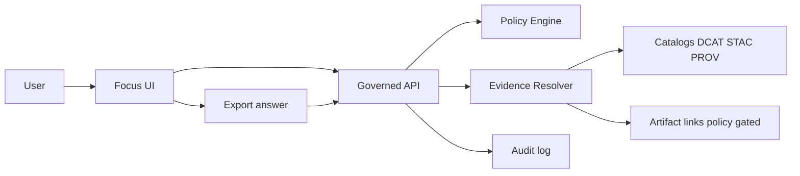

<!-- [KFM_META_BLOCK_V2]
doc_id: kfm://doc/e6d8d5de-ac1a-4f3c-985e-3c7aa5aaa358
title: apps/focus — Focus Mode UI (cite-or-abstain)
type: standard
version: v1
status: draft
owners: KFM UI Team (TBD)
created: 2026-02-23
updated: 2026-02-23
policy_label: restricted
related:
  - kfm://doc/KFM-GDG-2026-02-20
  - ../.. (repo root)
tags: [kfm, focus, ui, governance, cite-or-abstain]
notes:
  - Governed client: renders policy-filtered outputs; never bypasses API.
  - Every user-facing claim must be traceable to evidence or must abstain.
[/KFM_META_BLOCK_V2] -->

# KFM Focus Mode
_Governed, evidence-led Q&A UI (cite-or-abstain) for the Kansas Frontier Matrix._


> TODO: add real CI badges once workflows exist  
> ``  
> ``

---

## Quick nav
- [Overview](#overview)
- [Non-negotiable invariants](#non-negotiable-invariants)
- [Architecture](#architecture)
- [API dependencies](#api-dependencies)
- [Run locally](#run-locally)
- [Configuration](#configuration)
- [Governance and safety](#governance-and-safety)
- [Testing](#testing)
- [Contributing](#contributing)
- [Troubleshooting](#troubleshooting)
- [Glossary](#glossary)

---

## Overview
Focus Mode is KFM’s **governed AI-assisted interface** for asking questions and receiving:
- **Answers with inline citations** (EvidenceRefs), **or**
- A **policy-safe abstention** that explains _why_ the system cannot answer, plus an **audit_ref** for steward review.

The user loop is designed to be:
**Explore (map/time) → Focus Mode → Evidence/Provenance inspection → Story Nodes**.

This app is a **governed client**: it **renders what the governed API returns** and must not contain privileged credentials or bypass backend policy enforcement.

---

## Non-negotiable invariants
1. **Cite-or-abstain**
   - If a factual claim is shown, it must have a resolvable citation.
   - Otherwise, the UI must show an abstention state and an `audit_ref`.

2. **No ghost metadata**
   - The UI must not reveal the existence of restricted entities/records through empty placeholders, different error messages, or UI affordances.

3. **Policy is visible**
   - Users must see policy and trust surfaces (policy labels, freshness, validation status, license/attribution, redactions).

4. **UI never hits databases directly**
   - All data access is via the governed API boundary.

---

## Architecture

### System view


### Request flow
**Happy path**
1. User asks a question (optionally with context like a map view or time window).
2. Focus UI calls the governed endpoint for Focus Q&A.
3. Response includes:
   - answer text,
   - citations (EvidenceRefs),
   - `audit_ref`,
   - policy decision summary.
4. UI renders answer + inline citations.
5. When the user opens Evidence Drawer, the UI resolves EvidenceRefs (server-side) and renders Evidence Bundles.

**Abstention path**
- If policy denies or evidence cannot be resolved:
  - UI shows Policy Notice (policy-safe),
  - suggests safe alternatives (broader time window, public datasets),
  - always includes `audit_ref`.

---

## API dependencies
This UI depends on the governed API surface. The following endpoints are expected to exist in **/api/v1** (names may differ in your repo—verify against the actual OpenAPI):

| Endpoint | Purpose | UI expectation |
|---|---|---|
| `POST /api/v1/focus/ask` | Focus Mode Q&A | Returns citations **or** abstain + `audit_ref` |
| `POST /api/v1/evidence/resolve` | Resolve EvidenceRefs into EvidenceBundles | Fail closed if unauthorized/unresolvable |
| `GET /api/v1/datasets` | Dataset discovery | Policy-filtered, faceted list |
| `GET /api/v1/lineage/status` | Pipeline freshness/health | Drives “healthy/degraded/failing” badges |
| `GET/POST /api/v1/story` | Story Nodes (optional integration) | Publishing must be blocked if citations fail |

### Response contract expectations (UI-side checks)
- Successful governed operations include `audit_ref`.
- When applicable: `dataset_version_id`, artifact digests, and a public-safe `policy_label`.
- Errors follow a stable error model (e.g., `error_code`, policy-safe message, `audit_ref`) and must avoid leaking sensitive existence.

---

## Run locally

> This repo may be npm/yarn/pnpm/bun-based. **Verify by checking** `apps/focus/package.json` and the repo root tooling docs.

```bash
# from repo root
cd apps/focus

# one of:
npm install
# yarn install
# pnpm install
# bun install

# run dev server
npm run dev
# yarn dev
# pnpm dev
# bun dev
```

If the app is wired into a monorepo task runner, also try:
```bash
# examples (update to match repo)
pnpm -C apps/focus dev
# turbo run dev --filter=focus
# nx serve focus
```

---

## Configuration

### Environment variables
Create `apps/focus/.env.local` (or equivalent) and set:

| Variable | Example | Notes |
|---|---|---|
| `KFM_API_BASE_URL` | `http://localhost:8080` | Base URL for governed API |
| `KFM_AUTH_MODE` | `anonymous` \| `oidc` \| `dev` | Must not embed privileged creds |
| `KFM_ENABLE_MOCKS` | `true` | Enables mock API for UI development |
| `KFM_DEFAULT_TIME_WINDOW` | `P30D` | Default time window (ISO-8601 duration) |
| `KFM_EXPORT_FORMATS` | `pdf,json` | Export formats allowed by policy |

> WARNING: Do not store long-lived tokens in repo files. Prefer local dev auth and short-lived credentials.

---

## Governance and safety

### Required trust surfaces
- **Evidence Drawer** accessible from every claim:
  - evidence bundle id + digest
  - dataset version and dataset name
  - license and attribution
  - freshness and validation status
  - provenance chain (run receipt link)
  - redactions and obligations applied
- **Policy notices** at time of interaction (not hidden in tooltips)
- **What changed** panel (optional) comparing dataset versions by diffs, checksums, QA metrics

### Abstention UX (must be human-friendly)
When the system abstains, the UI must:
- state that it is abstaining,
- explain “why” in policy-safe terms,
- suggest safe alternatives,
- provide `audit_ref` for steward review,
- avoid hinting at restricted existence.

### Accessibility baseline
- Keyboard navigable chat + evidence drawer
- Visible focus states
- Text labels for badges (no color-only meaning)
- ARIA labels for controls
- Safe markdown rendering (sanitization + CSP)

---

## Testing

> Update commands to match the repo’s test runner.

```bash
# unit tests
npm test

# typecheck
npm run typecheck

# lint
npm run lint

# e2e (if present)
npm run e2e
```

### Minimum test gates for Focus features
- [ ] Cite-or-abstain behavior covered (citations render OR abstention card renders)
- [ ] Evidence resolution failure is fail-closed (no partial leaking)
- [ ] Error handling does not reveal restricted existence through UI differences
- [ ] Export includes citations + audit_ref and policy-safe metadata
- [ ] Keyboard navigation and focus management checks

---

## Contributing

### Pull request checklist (Focus UI)
- [ ] Includes screenshots or short recording for UI changes
- [ ] Includes tests for cite-or-abstain paths
- [ ] No new direct network calls that bypass governed API client
- [ ] No secrets or privileged credentials added
- [ ] Evidence Drawer fields present (or explicitly stubbed with TODO + issue link)
- [ ] Accessibility checks completed (keyboard, focus, labels)

---

## Troubleshooting

### “I get 403/404 and can’t tell what happened”
This is often intended: policy may align 403/404 to avoid leaking existence. Use the returned `audit_ref` and check server logs (steward/operator path).

### “Answer has no citations”
This should not ship. Either:
- the API must abstain, or
- the UI must refuse to render the answer as factual.

### “Export missing attribution/license”
Exports must include license and attribution automatically. If missing, treat as a governance bug and block release.

---

## Glossary
- **EvidenceRef**: A resolvable citation reference (scheme-based) that can be turned into an EvidenceBundle by the evidence resolver.
- **EvidenceBundle**: A policy-filtered object containing a human-readable evidence card plus machine metadata, digests, license, and provenance links.
- **audit_ref**: A stable reference used for audit/review of governed operations (Focus ask, story publish, exports).
- **policy_label**: A public-safe label indicating access/sensitivity posture.
- **dataset_version_id**: Version identifier for reproducible datasets.

---

<details>
<summary>Appendix: “Repo reality check” TODOs</summary>

- [ ] Confirm framework (Next.js vs Vite vs other) and update Run locally commands
- [ ] Add real CI badges (build, lint, test, e2e)
- [ ] Link to OpenAPI contract location and update API table with canonical routes
- [ ] Confirm export formats and policy posture
- [ ] Fill in owners/team + escalation path for audit_ref review

</details>

_Back to top: [Quick nav](#quick-nav)_
