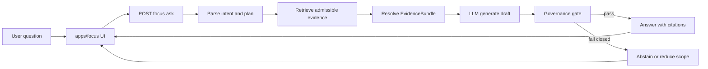

<!-- [KFM_META_BLOCK_V2]
doc_id: kfm://doc/9f0cd322-a6a1-4d63-9fef-cdc4b06ea2d2
title: Focus Mode App
type: standard
version: v1
status: draft
owners: TODO:assign-owners
created: 2026-03-03
updated: 2026-03-03
policy_label: public
related:
  - TODO:link-to-focus-spec
  - TODO:link-to-evidence-resolver-spec
  - TODO:link-to-telemetry-schema
tags: [kfm, focus, app, trust-membrane, governance]
notes:
  - This README is a contract + runbook for the Focus Mode app surface.
  - Replace TODOs after confirming repo wiring (scripts, routes, schemas).
[/KFM_META_BLOCK_V2] -->

<div align="center">

# 🧠 Focus Mode App (`apps/focus`)

**Purpose:** A **Focus Mode** surface that turns user questions into **evidence-led answers** by calling only **governed APIs** and rendering **citations, license, provenance, and abstentions** as first-class UI.


</div>

---

## Quick links

- [What this app is](#what-this-app-is)
- [Architecture](#architecture)
- [Trust membrane invariants](#trust-membrane-invariants)
- [API contracts](#api-contracts)
- [Local development](#local-development)
- [Testing & evaluation](#testing--evaluation)
- [Governance & safety](#governance--safety)
- [Telemetry](#telemetry)
- [Directory layout](#directory-layout)
- [Definition of done](#definition-of-done)

---

## What this app is

Focus Mode is the **evidence-led Q&A** surface of KFM:

- user asks a question
- backend retrieves admissible evidence (graph + spatial + docs)
- LLM drafts an answer **grounded in that evidence**
- a **hard governance/citation gate** is applied
- UI renders **answer + citations** (or **abstention**) and makes trust visible

> **Non-goal:** This app does **not** query databases directly and does **not** call the LLM directly. It is a UI surface on top of governed APIs.

---

## Architecture

### End-to-end Focus Mode control loop


```mermaid
flowchart LR
  U[User question] --> UI[apps/focus UI]
  UI --> FAPI[POST focus ask]
  FAPI --> PLAN[Parse intent and plan]
  PLAN --> R[Retrieve admissible evidence]
  R --> EV[Resolve EvidenceBundle]
  EV --> LLM[LLM generate draft]
  LLM --> GATE[Governance gate]
  GATE -->|pass| OUT[Answer with citations]
  GATE -->|fail closed| ABS[Abstain or reduce scope]
  OUT --> UI
  ABS --> UI
```

### UI trust surfaces (what users must be able to see)

Focus Mode UI should be able to render and/or link to:

- **dataset version** (and “what changed” when available)
- **freshness** (last run timestamp)
- **license + attribution**
- **policy badge / label**
- **evidence bundles** (click-to-open evidence drawer)
- **audit reference** for steward review (especially on abstentions)

---

## Trust membrane invariants

These are **hard rules** (tests should enforce them):

| Invariant | Why it exists | How we enforce |
|---|---|---|
| UI never calls DB/storage directly | prevents policy bypass | network boundary + code review + client-only API allowlist |
| UI never calls the LLM directly | keeps governance centralized | only call the governed Focus endpoint |
| Every answer must **cite or abstain** | primary anti-hallucination control | server-side citation verification gate + UI renders abstention clearly |
| Evidence links must be resolvable | “dead citations” break trust | evidence resolver contract + CI link checks |
| Errors are policy-safe | prevents restricted inference via error timing/messages | standardized error model + deny-by-default |

---

## API contracts

> **Note:** Endpoint names and payloads are intentionally “contract-first.” If the actual repo contracts differ, update this section to match the real OpenAPI/GraphQL schema.

### Required endpoints (minimum surface)

| Endpoint | Used by | Purpose | Fail posture |
|---|---|---|---|
| `POST /api/v1/focus/ask` | Focus UI | ask a question, get an answer with citations | must cite or abstain |
| `POST /api/v1/evidence/resolve` | Evidence drawer | turn an `EvidenceRef` into an `EvidenceBundle` | fail closed if unauthorized/unresolvable |
| `GET /api/v1/catalog/datasets` | “Add evidence” UI | discover datasets (policy-filtered) | hide restricted by default |
| `GET /api/v1/lineage/{dataset_id}` | provenance panel | show lineage + run receipts | redact as required |

### EvidenceBundle (shape expectations)

The UI expects an `EvidenceBundle` to contain enough information to render:

- title and dataset version identifiers
- policy decision + applied obligations/redactions
- license (SPDX id + attribution text)
- provenance (run_id) and an `audit_ref`
- artifact links **only if policy allows**

---

## Local development

### Prereqs

- Node.js (version per repo standard)
- Access to the governed API (local or remote)
- A running backend stack for end-to-end tests:
  - API service
  - Postgres/PostGIS, Neo4j, search index (if used)
  - Ollama (backend-side) for LLM calls

### Environment variables (proposed)

Create `apps/focus/.env.local` (or your repo’s standard):

```bash
# Base URL to the governed API layer (NOT to databases, NOT to Ollama)
FOCUS_API_BASE_URL=http://localhost:8000

# Optional: enable local mocks for UI-only work
FOCUS_ENABLE_MOCKS=false
```

### Run

Because build tooling differs across repos, prefer these patterns:

```bash
# Option A: monorepo workspace run (preferred if using pnpm/turborepo)
pnpm -w dev --filter focus

# Option B: run directly in the folder
cd apps/focus
npm install
npm run dev
```

> If neither option matches your repo, update this section with the real commands from `apps/focus/package.json`.

---

## Testing & evaluation

Focus Mode quality is a **merge gate**, not an aspiration.

### Test layers (recommended)

- **Unit tests (UI):** components, rendering states, keyboard navigation, evidence drawer interactions.
- **Contract tests:** typed client checks against OpenAPI/GraphQL stubs.
- **E2E tests:** run the full Q&A loop against a small seeded dataset.
- **Golden-query evaluation harness (must-have):** a stable set of questions with expected citations and regression diffs.

### Minimum “golden query” assertions

For each golden question:

- answer contains at least one citation marker (or returns abstention with policy-safe reason)
- citations resolve to EvidenceBundles
- EvidenceBundle shows license + dataset version + audit_ref
- UI renders abstention and suggests safe alternatives (no leakage)

---

## Governance & safety

### Cite-or-abstain

If citations cannot be verified or resolved, Focus Mode must:

1) **abstain** or **reduce scope**
2) explain “why” in **policy-safe terms**
3) provide an `audit_ref` for steward review
4) suggest safe alternatives (broaden time window, use public datasets)

### Sensitive data & redaction

- If evidence is restricted (CARE/sovereignty/sensitive locations), Focus UI must not display raw restricted detail.
- Prefer generalized views (aggregation, masking) and show redaction badges explaining what was applied.

---

## Telemetry

Focus Mode is a governed surface; telemetry should be PII-minimized and audit-aligned.

Recommended events (minimum):

- `version_navigated`
- `version_diffed`
- `version_locked`
- `lineage_inspected`
- `deprecated_warning_shown`

> Store/emit under the repo’s Focus telemetry schema (TODO: link schema).

---

## Directory layout

> **Directory Documentation Standard:** This section must reflect what belongs here, not what we hope exists.
> Update after running: `tree apps/focus -L 3`.

### Expected contents (proposed)

```text
apps/focus/
├─ README.md
├─ src/
│  ├─ components/           # chat UI, evidence drawer, provenance panel
│  ├─ api/                  # typed API client for /focus/ask + /evidence/resolve
│  ├─ state/                # UI state (chat sessions, selected evidence)
│  ├─ routes/               # Focus mode route(s)
│  └─ telemetry/            # event emitters + schema adapters
├─ public/
├─ tests/
│  ├─ unit/
│  └─ e2e/
└─ package.json
```

### Acceptable inputs

- UI code for Focus Mode
- typed API client wrappers for the governed endpoints
- test fixtures that do **not** embed restricted data
- telemetry emitters (PII-minimized)

### Exclusions

- direct DB credentials or DB client code
- direct Ollama / model calls from the browser
- raw restricted datasets or coordinates
- “magic” citation strings without resolvers (no dead links)

---

## Definition of done

### MVP (Focus Mode app ready for governed demos)

- [ ] Chat UI renders answer + citations
- [ ] Evidence drawer resolves citations to EvidenceBundles
- [ ] Provenance panel can show run receipts / lineage links
- [ ] Abstention UX is clear and policy-safe
- [ ] Golden-query harness exists and blocks regressions
- [ ] CI contains a merge-blocking gate for Focus Mode eval

---

## References

- **Focus Mode pipeline (parse → retrieve → generate → governance check → citations)**: see KFM AI integration docs (TODO: link to repo copy).
- **Evidence resolver + EvidenceBundle contract + `/api/v1/focus/ask`**: see the KFM blueprint snapshot (TODO: link to repo copy).
- **Work package expectations (Focus MVP + evaluation harness)**: see KFM delivery plan (TODO: link to repo copy).

---

<a id="back-to-top"></a>
[Back to top](#quick-links)
