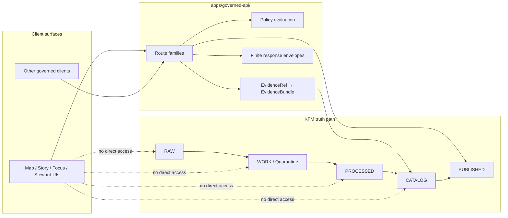

<!-- [KFM_META_BLOCK_V2]
doc_id: kfm://doc/<NEEDS_VERIFICATION_UUID>
title: Governed API
type: standard
version: v1
status: draft
owners: NEEDS_VERIFICATION
created: YYYY-MM-DD
updated: YYYY-MM-DD
policy_label: NEEDS_VERIFICATION
related: [../../contracts/, ../../schemas/, ../../policy/, ../../packages/, ../../docs/]
tags: [kfm, governed-api, api, trust-membrane]
notes: [Path/name, owners, dates, and policy label require live repo verification.]
[/KFM_META_BLOCK_V2] -->

# Governed API

Trust-bearing API boundary for KFM reads, evidence resolution, bounded assistance, exports, and steward-only actions.

> **Status:** experimental  
> **Owners:** NEEDS VERIFICATION  
> **Path:** `apps/governed-api/README.md`  
>      
> **Quick jumps:** [Scope](#scope) · [Repo fit](#repo-fit) · [Inputs](#accepted-inputs) · [Exclusions](#exclusions) · [Directory tree](#directory-tree) · [Quickstart](#quickstart) · [Usage](#usage) · [Diagram](#diagram) · [Tables](#tables) · [Task list](#task-list) · [FAQ](#faq) · [Appendix](#appendix)

> [!IMPORTANT]
> This application is the KFM trust membrane in product form. Client surfaces consume governed API responses; they do **not** talk directly to canonical stores, object storage, raw lifecycle zones, or unpublished artifacts.

## Scope

This directory is the API-side boundary for KFM’s governed read, explain, export, and stewardship flows.

At a doctrinal level, this application exists to keep five things true at once:

1. **Public and internal requests stay policy-shaped.**
2. **Evidence drill-through stays operational at point of use.**
3. **Released scope stays distinct from raw, working, or candidate scope.**
4. **Finite outcomes replace silent failure or fluent overclaiming.**
5. **Publication, correction, and review remain governed state transitions, not convenience side effects.**

In practice, this means the governed API is where KFM’s route families, policy checks, evidence resolution, and response envelopes meet.

<p align="right"><a href="#governed-api">Back to top ↑</a></p>

## Repo fit

| Item | Value |
|---|---|
| File | `apps/governed-api/README.md` |
| Directory role | Application-facing API boundary for KFM trust, policy, and evidence resolution |
| Upstream dependencies | [`../../contracts/`](../../contracts/) · [`../../schemas/`](../../schemas/) · [`../../policy/`](../../policy/) · [`../../packages/`](../../packages/) |
| Downstream consumers | [`../`](../) · [`../../docs/`](../../docs/) · [`../../tests/`](../../tests/) |
| Path/name status | **NEEDS VERIFICATION** — current repo-grounded material confirms `apps/` at repo root, but older API-shaped references surfaced as `apps/api/...`, not definitively as `apps/governed-api/` |
| Contract posture | Contract-first, policy-aware, source-bounded |
| Truth posture | **CONFIRMED** doctrine / **PROPOSED** starter layout / **UNKNOWN** mounted implementation depth |

### What this README is for

This README is meant to make the governed API’s role unambiguous even before every mounted implementation detail is verified.

It should help reviewers answer:

- What belongs in this application?
- What must stay outside it?
- Which request families are public-safe versus internal-only?
- What proof objects and gates must exist before the directory can claim maturity?

## Accepted inputs

This area should accept or orchestrate the following request classes.

| Input class | Belongs here? | Notes |
|---|---:|---|
| Catalog and discovery requests | Yes | Released metadata, discovery lists, catalog closures, release-scoped discovery |
| Feature or subject reads | Yes | Released authoritative features, place dossiers, claim/detail reads |
| Map / tile / portrayal reads | Yes | Public-safe map, tile, style, legend, and portrayal responses |
| Evidence resolution requests | Yes | `EvidenceRef -> EvidenceBundle` drill-through and related trust objects |
| Story / dossier / compare reads | Yes | Requests that remain anchored to the same released shell context |
| Export / report requests | Yes | Public-safe exports and package manifests that inherit release/policy state |
| Focus / governed assistance requests | Yes | Bounded natural-language requests over released scope only |
| Review / stewardship actions | Yes, internal only | Approval, denial, rollback, quarantine inspection, rights handling |
| Ops / status endpoints | Yes, internal only | Health, traces, metrics, audit joins, runtime status |
| Policy-evaluation adapters | Yes | Whether in-process or delegated, the governed API owns the request boundary |

## Exclusions

The following do **not** belong here.

| Out of scope | Why it stays out | Where it goes instead |
|---|---|---|
| Direct access to raw/work/quarantine storage | Breaks the trust membrane | `../../data/` plus governed workers and review flows |
| Canonical truth writes from browser clients | Public clients must not mutate authoritative stores directly | governed internal review / promotion routes |
| Contract source-of-truth documents | This app consumes contracts; it does not replace them | [`../../contracts/`](../../contracts/) and authoritative schema home once verified |
| Policy bundle authorship | This app enforces policy but should not become policy’s sovereign source | [`../../policy/`](../../policy/) |
| Shared domain logic | Prevents app-local drift and copy-paste divergence | [`../../packages/`](../../packages/) |
| UI rendering behavior | The frontend owns presentation; the API owns payload truth and enforcement | sibling app surfaces under `../` and repo UI areas |
| Free-form uncited assistant behavior | Violates cite-or-abstain and bounded assistance doctrine | not allowed |
| “Secret” second truth surfaces in telemetry or ops | Status must not become a bypass or hidden database mirror | internal ops routes with governed shaping only |

> [!WARNING]
> This directory must not become a quiet dumping ground for “temporary” bypasses, hand-shaped payloads, or undocumented route behavior. In KFM, undocumented convenience is usually hidden governance debt.

<p align="right"><a href="#governed-api">Back to top ↑</a></p>

## Directory tree

_Proposed starter shape — not a confirmed mounted tree._

```text
apps/
└── governed-api/
    ├── README.md
    ├── src/                         # NEEDS VERIFICATION
    │   ├── routes/
    │   │   ├── catalog/
    │   │   ├── feature-read/
    │   │   ├── map-portrayal/
    │   │   ├── evidence/
    │   │   ├── story-compare/
    │   │   ├── export/
    │   │   ├── focus/
    │   │   ├── review/
    │   │   └── ops/
    │   ├── policy/
    │   ├── resolvers/
    │   ├── services/
    │   ├── telemetry/
    │   └── contracts/
    ├── tests/                       # NEEDS VERIFICATION
    │   ├── contract/
    │   ├── integration/
    │   └── fixtures/
    ├── docs/                        # optional, NEEDS VERIFICATION
    └── runtime-manifest             # package.json / pyproject.toml / equivalent
```

### Why this starter shape is useful

It keeps three boundaries crisp:

- **route family surface** at `src/routes/`
- **trust mechanics** at `src/policy/` and `src/resolvers/`
- **proof and regression burden** at `tests/`

That structure matters because KFM’s doctrine repeatedly prefers named, typed, inspectable artifacts over hand-wavy behavior.

## Quickstart

### Verification-first quickstart

Before treating this application as real and governable, verify these in order:

1. **Confirm the path/name.** Determine whether the live repo uses `apps/governed-api/`, `apps/api/`, or another approved API location.
2. **Confirm schema authority.** Resolve whether `../../contracts/` or `../../schemas/` is the canonical machine-validated home.
3. **Confirm the first merge gate.** Verify that a real, required workflow exists rather than placeholder workflow documentation.
4. **Confirm first-wave artifacts.** Surface real schema files, valid/invalid fixtures, and a deterministic validator command.
5. **Confirm route inventory.** Document which route families are live, partial, or still planned.

### Starter commands

```bash
# pseudocode — replace with the repo's actual task runner and script names
repo verify-contracts
repo test governed-api
repo run governed-api
```

### Minimum local review loop

```bash
# pseudocode — intended review sequence, not a confirmed script set
repo lint governed-api
repo verify-contracts
repo test governed-api --contract --integration
repo smoke governed-api
```

> [!NOTE]
> Exact package manager, runtime, and command names are intentionally left unclaimed here until the live repo proves them.

<p align="right"><a href="#governed-api">Back to top ↑</a></p>

## Usage

### Route-family overview

The governed API should expose route families by responsibility, not by framework fashion.

| Route family | Primary objects | Boundary profile | What the route family owes callers |
|---|---|---|---|
| Catalog and discovery | release metadata, dataset/distribution discovery, catalog closures | public governed | identifier consistency, release scope, machine-readable discovery |
| Feature or subject read | authoritative released features, place dossiers, claim/detail views | public governed | stable IDs, support/time semantics, rights posture, release linkage |
| Map / tile / portrayal | released maps, tiles, legends, styles, portrayals | public governed | release linkage, policy posture, freshness, correction visibility |
| Evidence resolution | `EvidenceRef -> EvidenceBundle` and related trust objects | public governed | admissible published scope, visible rights/sensitivity, audit linkage |
| Story / dossier / compare | narrative/comparison inputs anchored in the same shell | public governed | stable spatial and temporal anchor, evidence drill-through |
| Export and report | public-safe exports, previews, packaged report objects | public governed | no export outruns release, policy, or correction state |
| Focus / governed assistance | bounded natural-language investigation over released scope | public governed | finite outcome, citations, policy-visible reasoning, audit linkage |
| Review / stewardship | moderation, quarantine inspection, approval, denial, rollback, rights handling | internal governed | explicit review/decision artifacts, no hidden approvals |
| Ops / status | health, metrics, traces, audit joins | internal governed | no raw canonical exposure, no second truth surface |

### Request handling rules

Every consequential request should pass through a sequence like this:

1. **Context and identity**
2. **Policy pre-check**
3. **Release-scope narrowing**
4. **Evidence or catalog resolution**
5. **Response shaping**
6. **Finite outcome emission**
7. **Telemetry / audit linkage**

### Public-safe outcomes

| Outcome shape | Public-safe? | Minimum burden |
|---|---:|---|
| Cited answer / cited payload | Yes | resolvable evidence, policy-allowed scope, release linkage |
| Abstain / deny | Yes | named reason, bounded scope, calm failure language |
| Review-required escalation | Internal or gated | explicit review path and decision artifact |
| Silent fallback to uncited prose | No | prohibited |
| Direct object-store / DB pass-through | No | prohibited |

## Diagram



### Reading the diagram

The point is not that the API “owns” the whole truth path. It does not.

The point is that client-visible access should enter through governed route families, inherit policy and release context, and only then resolve toward the published/evidence-bearing side of the system.

<p align="right"><a href="#governed-api">Back to top ↑</a></p>

## Tables

### Trust-bearing objects this app is expected to touch

| Object | Why it matters here | Status |
|---|---|---|
| `EvidenceBundle` | makes evidence drill-through operational | doctrinally strong; mounted implementation UNKNOWN |
| `RuntimeResponseEnvelope` | prevents free-form response drift | doctrinally strong; mounted implementation UNKNOWN |
| `ReleaseManifest` | ties outward payloads to release state | doctrinally strong; mounted implementation UNKNOWN |
| `CorrectionNotice` | keeps rollback/withdrawal visible | doctrinally strong; mounted implementation UNKNOWN |
| review / decision artifacts | keep approval and denial inspectable | doctrinally strong; mounted implementation UNKNOWN |

### Build-vs-boundary matrix

| Concern | Belongs in this app | Belongs elsewhere |
|---|---:|---:|
| Request authentication / policy boundary | ✓ |  |
| Evidence resolution orchestration | ✓ |  |
| Release-aware payload shaping | ✓ |  |
| Shared domain model ownership |  | ✓ |
| Policy bundle authoring |  | ✓ |
| Catalog authoring and dataset packaging |  | ✓ |
| Frontend rendering and interaction chrome |  | ✓ |
| Direct canonical store access from clients |  | ✓ (prohibited) |

## Task list

### Definition of done for this directory

- [ ] Path/name is verified against the live repo (`apps/governed-api` vs current API location).
- [ ] One canonical schema authority is declared and referenced here consistently.
- [ ] A real merge-blocking contracts gate exists and is required on merges.
- [ ] First-wave schema files exist as real artifacts, not only README references.
- [ ] Valid and invalid fixtures exist for the first response families.
- [ ] `EvidenceRef -> EvidenceBundle` positive and negative traces are stored as proof artifacts.
- [ ] Focus/governed-assistance responses are finite and citation-bearing.
- [ ] Review/stewardship routes are explicitly internal-only.
- [ ] UI bypass of storage/canonical stores is tested and blocked.
- [ ] Correction and rollback behavior is visible, not silent.
- [ ] Owners, dates, policy label, and related links in the meta block are verified and filled.

### First high-value gates

- [ ] **contracts gate** — schema compile + valid/invalid fixtures + non-zero CI failure
- [ ] **policy gate** — deny-by-default vocab and reason handling
- [ ] **resolver gate** — evidence bundle drill-through with policy-safe denial path
- [ ] **runtime gate** — finite envelope validation for positive and negative outcomes

## FAQ

### Why is this a “governed” API instead of just “the backend”?

Because KFM treats the API boundary as part of the trust model, not just transport plumbing. Public and steward surfaces are supposed to inherit policy, release state, evidence drill-through, and correction behavior at the request boundary.

### Why can’t the UI call the database or object store directly?

Because that would collapse the trust membrane. KFM doctrine repeatedly treats direct client access to canonical or storage surfaces as a bypass of policy, provenance, and evidence guarantees.

### Is Focus Mode just another chat endpoint?

No. It is a bounded request family over released scope. It must remain subordinate to evidence, policy, and finite outcomes, rather than acting as a free-form truth source.

### Why does this README keep saying “NEEDS VERIFICATION”?

Because the current evidence base is stronger on doctrine than on mounted implementation. This file is written to be commit-ready **without** pretending that unverified paths, scripts, or route trees are already proven.

## Appendix

<details>
<summary><strong>Status legend and working vocabulary</strong></summary>

### Truth labels used in this README

| Label | Meaning here |
|---|---|
| **CONFIRMED** | grounded in visible doctrine or repo-root evidence surfaced in current materials |
| **INFERRED** | strongly implied by multiple sources but not directly proven as mounted implementation |
| **PROPOSED** | recommended starter shape for this directory |
| **UNKNOWN** | not verified strongly enough to claim as implemented |
| **NEEDS VERIFICATION** | specifically requires live repo inspection before becoming normative |

### Short glossary

| Term | Meaning |
|---|---|
| **Trust membrane** | architectural boundary that prevents clients from bypassing governed APIs |
| **EvidenceRef** | outward-facing reference to evidence-bearing material |
| **EvidenceBundle** | resolved, inspectable evidence package with policy-safe context |
| **RuntimeResponseEnvelope** | bounded response object for governed runtime outcomes |
| **CorrectionNotice** | explicit supersession / withdrawal / correction artifact |

### Read this README with one rule in mind

A polished shell does not prove a trustworthy system. In KFM, trust is carried by contracts, evidence objects, review artifacts, and governed transitions.

<p align="right"><a href="#governed-api">Back to top ↑</a></p>
</details>
