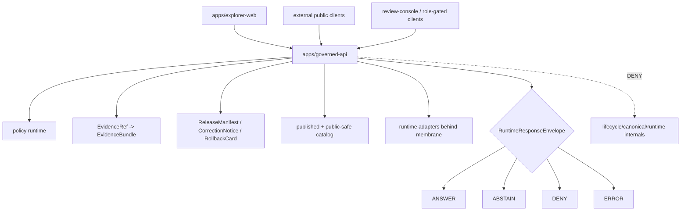

<!-- [KFM_META_BLOCK_V2]
doc_id: kfm://app/governed-api/readme
title: Governed API App README
type: app-readme
version: v0.2
status: draft
owners: OWNER_TBD — Apps steward · API steward · Policy steward · Evidence steward · Release steward · Runtime steward · Docs steward
created: 2026-06-16
updated: 2026-06-16
policy_label: public
related:
  - ../README.md
  - ../explorer-web/README.md
  - ../review-console/README.md
  - ../../docs/adr/ADR-0004-apps-governed-api-is-the-trust-membrane.md
  - ../../docs/doctrine/directory-rules.md
  - ../../contracts/runtime/runtime_response_envelope.md
  - ../../schemas/contracts/v1/runtime/
  - ../../policy/access/README.md
  - ../../policy/decision/README.md
  - ../../packages/evidence-resolver/README.md
  - ../../runtime/README.md
  - ../../release/README.md
  - ../../data/README.md
  - ../../.github/workflows/api-test.yml
tags: [kfm, apps, governed-api, trust-membrane, runtime-response-envelope, finite-outcomes, evidencebundle, policydecision, release-manifest]
notes:
  - "Expands the short governed-api README into a governed app boundary contract."
  - "Documents the intended trust-membrane role while keeping runtime maturity bounded to current-session evidence."
  - "The api-test workflow file exists and names governed-api smoke/envelope-shape commands; no workflow run status was verified in this session."
[/KFM_META_BLOCK_V2] -->

<a id="top"></a>

<div align="center">

# Governed API App

`apps/governed-api/`

**Executable trust membrane for KFM clients: finite `RuntimeResponseEnvelope` outcomes, governed evidence resolution, policy decisions, release/correction/rollback references, and citation-aware public-safe payloads.**


[Purpose](#1-purpose) · [Repo fit](#2-repo-fit) · [Boundary](#3-authority-boundary) · [Inputs](#5-inputs) · [Exclusions](#6-exclusions) · [Route families](#7-route-family-map) · [Definition of done](#14-definition-of-done)

</div>

---

> [!IMPORTANT]
> **Status:** draft / `NEEDS VERIFICATION`  
> **Owners:** `OWNER_TBD` — Apps steward · API steward · Policy steward · Evidence steward · Release steward · Runtime steward · Docs steward  
> **Path:** `apps/governed-api/README.md`  
> **Responsibility root:** `apps/` — deployable application surfaces  
> **Truth posture:** CONFIRMED README path / CONFIRMED apps-root role / CONFIRMED ADR-0004 doctrine / CONFIRMED api-test workflow file presence / UNKNOWN route handlers, DTOs, middleware, authorization, runtime behavior, deployment state, logs, dashboards, and CI pass state

> [!CAUTION]
> `apps/governed-api/` is the normal public trust path, not a shortcut around governance. It should return governed envelopes and safe projections only. Ordinary clients must not receive direct lifecycle paths, unpublished candidates, internal record paths, adapter internals, stack traces, or filesystem references.

---

## Quick jump

- [1. Purpose](#1-purpose)
- [2. Repo fit](#2-repo-fit)
- [3. Authority boundary](#3-authority-boundary)
- [4. Default posture](#4-default-posture)
- [5. Inputs](#5-inputs)
- [6. Exclusions](#6-exclusions)
- [7. Route family map](#7-route-family-map)
- [8. Diagram](#8-diagram)
- [9. Runtime outcome contract](#9-runtime-outcome-contract)
- [10. API obligations](#10-api-obligations)
- [11. Inspection path](#11-inspection-path)
- [12. Validation expectations](#12-validation-expectations)
- [13. Safe change pattern](#13-safe-change-pattern)
- [14. Definition of done](#14-definition-of-done)
- [15. Open verification items](#15-open-verification-items)

---

## 1. Purpose

`apps/governed-api/` is the proposed executable trust-membrane deployable for Kansas Frontier Matrix.

It should provide the normal public/semi-public API path for trust-bearing payloads used by Explorer Web, Evidence Drawer, Focus Mode, Story Player, Compare, Export, review retrieval, public-safe layer metadata, and generated public-safe carriers.

It may eventually contain route handlers, DTOs, middleware, adapters, response validators, authorization guards, audit hooks, envelope builders, and tests for:

- runtime/bootstrap payloads for Explorer Web and related clients;
- layer catalog, layer descriptor, legend, and release-manifest projections;
- EvidenceRef-to-EvidenceBundle resolution behind the membrane;
- Focus Mode bounded answers and server-side runtime invocation;
- Evidence Drawer payload projection and citation-aware claim detail;
- Story manifest/node retrieval and per-node finite outcomes;
- Compare and Export bounded requests with release/citation/redaction obligations;
- read-only review retrieval and role-gated stewardship payloads;
- correction notice, rollback card, release manifest, and stale/freshness lookups;
- role-gated submit paths where policy and audit allow.

This README does not prove any specific endpoint, route implementation, DTO, schema, middleware, package script, test, deployment, log, dashboard, or CI pass state exists.

[Back to top](#top)

---

## 2. Repo fit

| Concern | Owning root | Expected relationship |
|---|---|---|
| Governed API deployable | `apps/governed-api/` | Trust membrane and finite-envelope API surface |
| Apps root | `apps/` | Deployable application boundary; public clients transit governed API |
| Explorer Web | `apps/explorer-web/` | Normal public/semi-public UI consumer |
| Review Console | `apps/review-console/` | Role-gated review/steward consumer |
| Runtime contracts | `contracts/runtime/`, `schemas/contracts/v1/runtime/` | Runtime envelope meaning and machine shape |
| Evidence support | `packages/evidence-resolver/`, `data/proofs/` | EvidenceBundle support behind governed API |
| Policy support | `policy/`, `packages/policy-runtime/` | Access, sensitivity, rights, release, and decision policy |
| Runtime adapters | `runtime/` | Adapter lane behind governed API |
| Release authority | `release/` | Release decisions, correction notices, rollback cards |
| Lifecycle artifacts | `data/` | Lifecycle artifacts, receipts, proofs, registries, catalog, triplets, and published outputs |
| CI workflow | `.github/workflows/api-test.yml` | Exists and names smoke/envelope-shape commands; pass state `UNKNOWN` |

## 3. Authority boundary

The Governed API is an enforcement boundary and projection surface. It does not own canonical truth, lifecycle storage, source acquisition, release authority, schema authority, contract authority, policy authorship, EvidenceBundle authorship, renderer truth, UI truth, or direct file-mutation authority for public clients.

```text
apps/governed-api/       = executable trust membrane and finite outcome API
apps/explorer-web/       = public/semi-public UI consumer
apps/review-console/     = role-gated review consumer
policy/                  = admissibility and decision policy
schemas/contracts/v1/    = machine-readable shape
contracts/               = object meaning
data/                    = lifecycle artifacts, receipts, proofs, registries, published outputs
release/                 = release decisions, correction, rollback
runtime/                 = adapters behind governed API
packages/                = shared resolver, policy, schema, map, UI, and support packages
```

## 4. Default posture

Governed API routes should fail closed and return explicit finite outcomes. No public or semi-public request should become an unbounded direct read, silent partial response, uncited answer, or style-only redaction.

A route should not return `ANSWER` when any of these are unresolved:

- request schema and authorization context;
- endpoint policy and caller role;
- EvidenceRef-to-EvidenceBundle support for claim-bearing responses;
- citation validation for supported claims;
- release manifest refs and artifact digest/state where material;
- review state, correction notice refs, rollback refs, and stale/freshness state;
- sensitivity, rights, source terms, embargo, delayed release, redaction, or generalization posture;
- server-side runtime output constraints and citation closure for AI-assisted responses;
- response-envelope schema validation;
- audit-safe reference;
- safe error behavior without internal path or adapter internals.

## 5. Inputs

| Input family | Examples | Required posture |
|---|---|---|
| Client request | route, action, query params, selected layer/feature/evidence refs, role context | Schema-validated and bounded |
| Runtime envelope | `RuntimeResponseEnvelope`, `DecisionEnvelope`, reason codes, audit refs | Exactly one finite outcome |
| Evidence state | EvidenceRef, EvidenceBundle refs, proof-pack refs, citation bundle | Resolver behind membrane only |
| Policy state | access, role, rights, sensitivity, release, stale, embargo, redaction/generalization | Policy-derived; no client override |
| Release state | release manifest, correction notice, rollback card, digest, version, review state | Required where payload depends on released artifacts |
| Data state | published artifacts, catalog records, public-safe manifests, internal proofs where role-gated | Projected through API only |
| Runtime state | server-side adapter result, Focus response, AIReceipt ref | Behind membrane; never direct browser call |
| Error state | schema failure, adapter fault, stale support, policy deny, missing evidence | Safe reason code, no leakage |
| Audit/receipt state | request id, envelope id, decision ref, run/ref/audit reference | Audit-safe, no raw payload leakage |

## 6. Exclusions

| Does not belong here | Correct home |
|---|---|
| Shared library logic that is reusable across deployables | `packages/` |
| Source-specific fetchers and admitters | `connectors/` |
| Executable pipeline logic | `pipelines/`, `pipeline_specs/` |
| Repo-wide validators and generators | `tools/` |
| One-off operational scripts | `scripts/` |
| Canonical lifecycle storage | `data/` |
| Release decisions, correction approval, rollback authority | `release/` |
| Runtime envelope schemas and other machine shapes | `schemas/contracts/v1/` |
| Runtime object semantics and API contract prose | `contracts/` |
| Policy bundles and sensitivity rules | `policy/` |
| Local adapter harnesses | `runtime/`, behind governed API only |
| Public UI route rendering | `apps/explorer-web/` |
| Steward/admin UI surfaces | `apps/review-console/`, `apps/admin/` |
| Direct public lifecycle/canonical reads | Forbidden; use finite governed envelopes |
| Public direct calls to internal stores or runtime adapters | Forbidden |
| Deployment-only values | Deployment environment, not repo docs or app code |

## 7. Route family map

Exact route files and implementation status remain `NEEDS VERIFICATION`. Candidate route families should be introduced only with schemas, fixtures, policy tests, and audit-safe negative cases.

| Candidate route family | Purpose | Required safeguard | Status |
|---|---|---|---|
| `runtime/bootstrap` | Shell config, route availability, feature flags, policy posture | No client authority; finite envelope | PROPOSED |
| `layers` | Layer catalog, descriptors, legends, release manifest summaries | Released/bounded-safe only | PROPOSED |
| `evidence` | EvidenceRef resolution and EvidenceDrawerPayload projection | EvidenceBundle support and policy | PROPOSED |
| `focus` | Governed AI/Focus answer path | Server-side adapter, cite-or-abstain | PROPOSED |
| `story` | Story manifest/node/evidence-gate projection | 2D-first, evidence continuity | PROPOSED |
| `compare` | Compare releases, times, layers, or versions | Provenance and finite states | PROPOSED |
| `exports` | Safe export requests and receipt-linked artifacts | No uncited export | PROPOSED |
| `review` | Role-gated read-only/steward review payloads | Audited, no direct local file mutation | PROPOSED |
| `corrections` | Correction notice, supersession, rollback lookup | Release-lineage refs | PROPOSED |
| `diagnostics` | Safe version/envelope/layer/route diagnostics | No internal detail leakage | PROPOSED |

> [!WARNING]
> Candidate route names are not implementation proof. Do not document a route as live until files, tests, schemas, fixtures, policy gates, middleware, and deployment evidence confirm it.

## 8. Diagram



## 9. Runtime outcome contract

Every trust-bearing response should resolve to exactly one finite runtime status.

| Status | Meaning | Required posture |
|---|---|---|
| `ANSWER` | Request can be answered with sufficient evidence, release, policy, review, citation, and redaction support | Include support refs and limitations where material |
| `ABSTAIN` | Evidence is missing, stale, weak, conflicting, unsafe to narrow, or out of scope | Explain reason without fabricating answer |
| `DENY` | Policy, rights, sensitivity, role, release state, source terms, or exposure risk blocks response | Avoid leaking blocked material |
| `ERROR` | Runtime, adapter, schema, validation, or infrastructure fault blocks reliable response | Return audit-safe fault reference only |

## 10. API obligations

| Obligation | Example effect |
|---|---|
| `single_public_membrane` | Public/semi-public trust traffic transits `apps/governed-api/` |
| `finite_outcomes_required` | No empty success, silent partial, or untyped refusal |
| `cite_or_abstain` | Claim-bearing `ANSWER` requires EvidenceBundle support and citations |
| `policy_pre_and_postcheck` | Sensitive, rights, role, release, and export decisions fail closed |
| `no_public_lifecycle_path` | Lifecycle/canonical/internal-state requests are denied to public clients |
| `no_direct_runtime_client` | Browsers and ordinary clients never call internal stores or runtime adapters directly |
| `release_refs_required` | Responses tied to released artifacts carry release/correction/rollback refs where material |
| `safe_error_only` | Errors do not expose internal paths or adapter internals |
| `watcher_non_publisher` | Workers emit receipts/candidates; governed API does not treat them as published truth |
| `auditability_required` | Request id, envelope id, decision refs, and audit-safe refs support replay/review without leaking raw state |

## 11. Inspection path

Route handlers, middleware, DTOs, schemas, fixtures, tests, policy integration, authorization, error redaction, audit hooks, deployment state, CI pass state, logs, dashboards, and emitted artifacts remain `NEEDS VERIFICATION`.

```bash
find apps/governed-api -maxdepth 6 -type f | sort
find apps/governed-api apps/explorer-web apps/review-console runtime packages schemas contracts policy release data tests fixtures .github/workflows -maxdepth 6 -type f 2>/dev/null | grep -Ei 'governed.?api|RuntimeResponseEnvelope|DecisionEnvelope|EvidenceBundle|EvidenceRef|PolicyDecision|ReleaseManifest|CorrectionNotice|RollbackCard|AIReceipt|CitationValidationReport|runtime.?bootstrap|layers|evidence|focus|story|export|review|correction|diagnostic|abstain|deny|error|api-test|smoke' | sort
find data release -maxdepth 3 -type f 2>/dev/null | sort
```

## 12. Validation expectations

Useful validation for this app boundary should cover:

- every trust-bearing route returns exactly one `ANSWER`, `ABSTAIN`, `DENY`, or `ERROR` status;
- public attempts to resolve lifecycle/canonical/internal/runtime references return `DENY` or safe finite negative outcomes;
- missing, stale, weak, conflicting, or unresolved evidence returns `ABSTAIN`, not generated filler;
- sensitivity, rights, source terms, release-state, role, embargo, and exposure violations return `DENY` or role-gated restrictions without leakage;
- schema, adapter, resolver, or infrastructure faults return `ERROR` with audit-safe refs only;
- AI-assisted surfaces invoke adapters only server-side behind the membrane;
- response envelopes preserve evidence refs, policy decision refs, release refs, review state, correction refs, rollback refs, citations, limitations, redactions, stale state, and reason codes where material;
- CI and local smoke commands exercise finite outcomes, missing evidence, deny cases, and error redaction.

## 13. Safe change pattern

For Governed API changes:

1. Add or update route inventory and route-family contract.
2. Add schemas/contracts or link to accepted existing contracts before changing envelope shape.
3. Add fixtures for `ANSWER`, `ABSTAIN`, `DENY`, `ERROR`, missing evidence, stale evidence, policy denial, release denial, schema failure, adapter failure, no-internal-path, and no-direct-runtime cases.
4. Add policy tests and safe-error tests before exposing new client surfaces.
5. Preserve evidence refs, policy decision refs, release refs, correction refs, rollback refs, citations, limitations, redactions, stale state, and audit refs through every response.
6. Update this README, `apps/README.md`, affected client READMEs, ADR-0004, schemas/contracts, and policy docs when boundary behavior materially changes.

## 14. Definition of done

- [ ] Owners are confirmed and `OWNER_TBD` is replaced.
- [ ] Route inventory and route-family ownership are documented.
- [ ] Runtime envelope schema/contract bindings are verified.
- [ ] Middleware, authorization, policy runtime, evidence resolver, release lookup, and audit hooks are documented and tested.
- [ ] Finite outcome fixtures cover `ANSWER`, `ABSTAIN`, `DENY`, and `ERROR`.
- [ ] No-public-internal-path tests are present and passing.
- [ ] Missing-evidence and stale-evidence abstention tests are present and passing.
- [ ] Policy denial and sensitive-domain denial tests are present and passing.
- [ ] Safe-error redaction tests are present and passing.
- [ ] Server-side adapter calls are behind this boundary and client-direct calls are denied.
- [ ] CI workflow status and local commands are documented with current evidence.

## 15. Open verification items

| Item | Why it matters |
|---|---|
| Confirm route handlers beyond README | Prevents overclaiming runtime maturity |
| Confirm package/build scripts and local smoke commands | Required before developer-operation claims |
| Confirm runtime envelope schema path and validation | Required before contract claims |
| Confirm middleware and auth/role resolution | Required before access-control claims |
| Confirm policy runtime integration | Required before sensitivity/rights/release claims |
| Confirm evidence resolver integration | Required before EvidenceBundle closure claims |
| Confirm release/correction/rollback lookup | Required before publication-state claims |
| Confirm safe-error behavior | Required before public exposure |
| Confirm api-test workflow pass status | Workflow file exists; pass state is not verified here |
| Confirm `apps/api/` coexistence status, if any | Required to prevent parallel public APIs |
| Confirm deployment, logs, dashboards, and audit receipts | Required before operational claims |

<details>
<summary>Appendix A — no-loss preservation note</summary>

The previous README was a short stub. It stated that `apps/governed-api/` is the trust membrane in executable form, that public clients use it instead of raw stores, and that `.github/workflows/api-test.yml` verifies it. This replacement preserves the trust-membrane role while narrowing the workflow claim: the workflow file is confirmed to exist and contains governed-api smoke/envelope-shape commands, but no workflow run or pass status was verified in this session.

</details>

## Status summary

`apps/governed-api/` should contain the public trust-membrane deployable only after route inventory, schemas/contracts, middleware, authorization, evidence resolver integration, policy runtime integration, release/correction/rollback lookups, safe-error behavior, finite-outcome fixtures, tests, CI status, and operational evidence are verified.

It must preserve the KFM trust membrane: public clients may receive governed finite envelopes, but they must not directly read lifecycle/canonical stores, internal records, unpublished candidates, runtime adapters, source files, or deployment-only values.

<p align="right"><a href="#top">Back to top</a></p>
