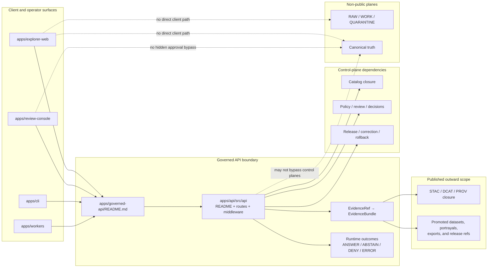

<!-- [KFM_META_BLOCK_V2]
doc_id: kfm://doc/<NEEDS_VERIFICATION_UUID>
title: Governed API
type: standard
version: v1
status: draft
owners: @bartytime4life
created: <NEEDS_VERIFICATION_DATE>
updated: 2026-04-04
policy_label: <NEEDS_VERIFICATION_POLICY_LABEL>
related: [../README.md, ../api/src/api/README.md, ../explorer-web/README.md, ../review-console/README.md, ../workers/README.md, ../../contracts/README.md, ../../schemas/README.md, ../../schemas/contracts/README.md, ../../policy/README.md, ../../packages/README.md, ../../tests/README.md, ../../.github/workflows/README.md]
tags: [kfm, governed-api, api, trust-membrane]
notes: [Mounted repository inspection was not available in this session; repo-fit details below preserve the strongest supplied signals and should be rechecked against repository-authoritative sources before publication.]
[/KFM_META_BLOCK_V2] -->

# Governed API

Trust-bearing API boundary for KFM reads, evidence resolution, bounded assistance, exports, and steward-only actions.

> **Status:** experimental  
> **Owners:** `@bartytime4life`  
> **Path:** `apps/governed-api/README.md`  
>      
> **Quick jumps:** [Scope](#scope) · [Repo fit](#repo-fit) · [Accepted inputs](#accepted-inputs) · [Exclusions](#exclusions) · [Directory tree](#directory-tree) · [Quickstart](#quickstart) · [Usage](#usage) · [Diagram](#diagram) · [Tables](#tables) · [Task list](#task-list) · [FAQ](#faq) · [Appendix](#appendix)

> [!IMPORTANT]
> In KFM, the API boundary is part of the trust model. Public and steward-facing shells consume governed responses; they do **not** bypass policy evaluation, evidence resolution, release state, or correction visibility.

> [!NOTE]
> This README is intentionally **boundary-first**. It should explain trust obligations, route families, repo fit, and proof expectations. Route-by-route handler mechanics belong in the deeper API module surface, not here.

## Scope

This directory documents the edge-facing contract boundary between KFM clients and released, policy-shaped, evidence-resolvable outputs.

The point of this README is not to describe transport plumbing in the abstract. Its job is to explain how KFM keeps the trust membrane intact at the public and steward edge: requests enter through governed surfaces, narrow to admissible released scope, resolve support-bearing objects, and leave through bounded runtime outcomes rather than uncited improvisation.

### Boundary doctrine in one view

The attached KFM manuals consistently frame the governed API as the runtime trust-surface boundary. In that posture, the API and evidence resolver serve approved discovery, read, evidence-resolution, dossier, story, export, and Focus interactions; public or external surfaces may read only through this boundary and only within promoted scope; and the boundary may not bypass catalog, policy, review, or correction control planes.

### What this README must answer

1. What belongs in the governed API boundary?
2. What must stay outside it?
3. How does this boundary fit the current repo?
4. What is doctrinally confirmed today versus still unresolved at mounted-repo level?

<p align="right"><a href="#governed-api">Back to top ↑</a></p>

## Repo fit

| Item | Value |
|---|---|
| File | `apps/governed-api/README.md` |
| Directory role | Boundary-level README for the governed API surface |
| Boundary role from corpus | Governed API and evidence resolver for approved discovery, read, evidence-resolution, dossier, story, export, and Focus interactions |
| Parallel deeper API doc surface | `apps/api/src/api/README.md` is the likeliest deeper API-module README based on the supplied draft and project notes |
| Upstream neighbors | [`../../contracts/README.md`](../../contracts/README.md), [`../../schemas/README.md`](../../schemas/README.md), [`../../schemas/contracts/README.md`](../../schemas/contracts/README.md), [`../../policy/README.md`](../../policy/README.md), [`../../packages/README.md`](../../packages/README.md), [`../../tests/README.md`](../../tests/README.md) |
| Downstream / sibling consumers | [`../explorer-web/README.md`](../explorer-web/README.md), [`../review-console/README.md`](../review-console/README.md), [`../workers/README.md`](../workers/README.md), [`../cli/README.md`](../cli/README.md) |
| Trust rule | Public or external surfaces should read only through governed API layers and only within promoted scope |
| Verification posture | Boundary doctrine is **CONFIRMED** from the attached corpus; mounted repo-tree specifics remain **NEEDS VERIFICATION** in this session |

### Current surfaced repo-fit signals

> [!CAUTION]
> The table below preserves the strongest repo-fit signals available in the supplied draft and attached project notes. It should not be upgraded into a mounted implementation claim until repository-authoritative inspection is performed.

| Surface | Current signal in supplied material | Safe reading |
|---|---|---|
| `apps/governed-api/` | Identified as a README-bearing app surface | Treat as the boundary README location unless repo inspection disproves it |
| `apps/api/src/api/` | Identified as a deeper API-shaped doc surface with `README.md`, `middleware/`, and `routes/` adjacency | Treat as the likeliest home for route/module detail, pending mounted recheck |
| `contracts/` | Named as neighboring human-readable contract law | Safe to reference as adjacent doctrinal ownership |
| `schemas/contracts/` | Named as neighboring machine-file contract lane | Safe to reference as adjacent schema ownership |
| `policy/` | Named as adjacent policy-runtime / bundle lane | Safe to reference as enforcement dependency, not sovereign home of this app |
| `tests/` | Named as adjacent verification family | Safe to reference as the likely proof lane, not as current test coverage proof |
| `.github/workflows/` | Mentioned as neighboring workflow surface | Keep workflow depth explicitly bounded until direct file inspection happens |

### Boundary-first reading

This file should describe:

- the API as a trust-bearing boundary,
- the repo neighbors it depends on,
- the contract and proof objects it is expected to touch,
- and the open reconciliation work between `apps/governed-api/` and `apps/api/src/api/`.

It should **not** duplicate route-by-route implementation notes better housed in [`../api/src/api/README.md`](../api/src/api/README.md).

<p align="right"><a href="#governed-api">Back to top ↑</a></p>

## Accepted inputs

This area should accept or orchestrate the following request classes.

| Request family | Belongs here? | Notes |
|---|---:|---|
| Catalog and discovery requests | Yes | Release-scoped discovery, catalog closure reads, outward metadata resolution |
| Feature / subject / place reads | Yes | Released authoritative reads only |
| Map / tile / style / legend / portrayal reads | Yes | Public-safe delivery over released scope |
| `EvidenceRef` resolution | Yes | Request-time drill-through to `EvidenceBundle` |
| Story / dossier / compare reads | Yes | Must stay anchored to the same geography/time/release shell |
| Export / report requests | Yes | Public-safe outward artifacts that inherit release, policy, and correction state |
| Focus / governed assistance requests | Yes | Bounded synthesis over admissible released evidence only |
| Review / stewardship actions | Yes, internal only | Approval, denial, rollback, quarantine inspection, rights/sensitivity handling |
| Ops / status endpoints | Yes, internal only | Health, traces, audit joins, runtime status; never a shadow truth surface |
| Raw store paths, DB credentials, unpublished candidate artifacts | No | Trust-membrane violation |
| Free-form uncited assistant behavior | No | Prohibited by KFM doctrine |

## Exclusions

| Out of scope | Why it stays out | Where it goes instead |
|---|---|---|
| Direct browser/client access to RAW, WORK, QUARANTINE, canonical stores, or artifact trees | Collapses the trust membrane | Intake, canonical, catalog/review, and projection planes behind governed services |
| Canonical writes from ordinary clients | Public clients are not authority writers | Steward-only review / repair / promotion lanes |
| Shared domain model ownership | Prevents app-local drift and duplicated contract semantics | [`../../packages/README.md`](../../packages/README.md) |
| Policy bundle authorship | This boundary enforces policy; it should not become policy’s sovereign home | [`../../policy/README.md`](../../policy/README.md) |
| Schema / standards-profile source of truth | This boundary consumes and validates against them | [`../../contracts/README.md`](../../contracts/README.md), [`../../schemas/contracts/README.md`](../../schemas/contracts/README.md) |
| Hidden correction or rollback behavior | KFM requires visible correction lineage | release / correction runbooks and proof objects |
| “Secret” second truth in telemetry or ops | Status endpoints must not become a bypass database | shaped governed ops surfaces only |
| Endpoint-detail duplication already maintained elsewhere | Creates drift between boundary docs and handler/module docs | [`../api/src/api/README.md`](../api/src/api/README.md) |

> [!WARNING]
> Do not let this directory become a convenience bypass. In KFM, undocumented edge behavior is usually governance debt in disguise.

<p align="right"><a href="#governed-api">Back to top ↑</a></p>

## Directory tree

### Current surfaced app sketch

```text
apps/
├── README.md
├── cli/
│   └── README.md
├── explorer-web/
│   └── README.md
├── governed-api/
│   └── README.md
├── review-console/
│   └── README.md
└── workers/
    └── README.md
```

### Parallel deeper API surface

```text
apps/
└── api/
    ├── README.md
    ├── src/
    │   └── api/
    │       ├── README.md
    │       ├── middleware/
    │       └── routes/
    └── tests/
```

### Adjacent contract / policy / verification surfaces

```text
contracts/
└── README.md

schemas/
├── README.md
└── contracts/
    ├── README.md
    ├── v1/
    │   ├── common/
    │   ├── correction/
    │   ├── data/
    │   ├── evidence/
    │   ├── policy/
    │   ├── release/
    │   ├── runtime/
    │   └── source/
    └── vocab/

policy/
├── README.md
├── bundles/
├── fixtures/
├── policy-runtime/
└── tests/

tests/
├── README.md
├── accessibility/
├── contracts/
├── e2e/
├── integration/
├── policy/
├── reproducibility/
└── unit/
```

### Working implication

The strongest surfaced signal is that the repo has **two API-facing documentation surfaces**:

1. `apps/governed-api/README.md` — boundary-facing, trust-first, repo-fit README.
2. `apps/api/src/api/README.md` — deeper API-module surface with route and middleware adjacency.

That is a documentation split to reconcile, not a fact to hide.

<p align="right"><a href="#governed-api">Back to top ↑</a></p>

## Quickstart

### Verification-first review loop

1. Read this file as the **boundary README** for the governed API surface.
2. Read [`../api/src/api/README.md`](../api/src/api/README.md) as the deeper API-module surface.
3. Check [`../../contracts/README.md`](../../contracts/README.md) and [`../../schemas/contracts/README.md`](../../schemas/contracts/README.md) before making any contract claim here.
4. Check [`../../policy/README.md`](../../policy/README.md) and [`../../tests/README.md`](../../tests/README.md) before claiming enforcement depth.
5. Promote or downgrade wording in this README only after those neighbors agree.

### Useful local inspection commands

Use these when the repository is mounted and you need to recheck boundary claims directly:

```bash
find apps/governed-api -maxdepth 2 -type f | sort
find apps/api/src/api -maxdepth 2 -type f | sort
find contracts -maxdepth 2 -type f | sort
find schemas/contracts -maxdepth 3 -type f | sort
find policy -maxdepth 2 -type f | sort
find tests -maxdepth 2 -type f | sort
find .github/workflows -maxdepth 2 -type f | sort
```

### Minimal review pass before editing boundary claims

```bash
sed -n '1,220p' apps/governed-api/README.md
sed -n '1,260p' apps/api/src/api/README.md
sed -n '1,220p' contracts/README.md
sed -n '1,260p' schemas/contracts/README.md
sed -n '1,220p' policy/README.md
sed -n '1,220p' tests/README.md
```

> [!TIP]
> The attached KFM corpus proves more doctrine than mounted implementation. Keep route names, DTOs, workflow enforcement, and live runtime depth visibly bounded unless the repo, tests, manifests, or emitted proof objects are directly rechecked.

<p align="right"><a href="#governed-api">Back to top ↑</a></p>

## Usage

### Boundary responsibilities

The governed API should expose request families by responsibility, not by framework fashion.

| Route family | Public or internal | What it owes callers |
|---|---|---|
| Catalog and discovery | Public governed | release scope, stable identifiers, outward metadata closure |
| Feature / subject / place reads | Public governed | support/time semantics, rights posture, release linkage, correction visibility |
| Map / tile / portrayal | Public governed | release linkage, freshness basis, policy posture |
| Evidence resolution | Public governed | `EvidenceRef → EvidenceBundle`, preview policy, rights/sensitivity state, audit linkage |
| Story / dossier / compare | Public governed | anchored geography/time shell, drill-through to evidence |
| Export / report | Public governed | no export outruns release, policy, or correction state |
| Focus / governed assistance | Public governed | finite outcome, citation checks, policy-visible reasoning boundary, audit linkage |
| Review / stewardship | Internal governed | explicit decision artifacts, no hidden approvals |
| Ops / status | Internal governed | health and explainability without raw-store exposure |

### Boundary request rule of thumb

1. Establish request context, audience, and allowed surface.
2. Apply policy pre-checks and scope narrowing.
3. Resolve only to release-scoped admissible material.
4. Resolve evidence, catalog, or outward portrayal objects.
5. Shape the result into a bounded runtime outcome.
6. Attach decision, audit, and correction linkage where required.
7. Preserve visible stale-state, narrowing, or denial cues instead of bluffing.

### Public-safe outcomes

| Outcome | Allowed? | Minimum burden |
|---|---:|---|
| Evidence-linked read | Yes | resolvable support, policy-allowed scope, release linkage |
| `ANSWER` | Yes | evidence resolution + citation checks |
| `ABSTAIN` | Yes | explicit bounded reason, calm failure language |
| `DENY` | Yes | policy reason + obligation visibility where applicable |
| `ERROR` | Yes | machine-meaningful failure without bluffing |
| Silent fallback to uncited prose | No | prohibited |
| Direct DB / object-store pass-through | No | prohibited |

### Boundary README vs module README

| Surface | Best use |
|---|---|
| `apps/governed-api/README.md` | explain trust obligations, repo fit, accepted inputs, exclusions, proof expectations, adjacent ownership |
| `apps/api/src/api/README.md` | explain middleware, route groups, `/api/v1` shaping, implementation-facing handler organization |
| `contracts/README.md` | explain human-readable contract law and contract families |
| `schemas/contracts/README.md` | explain machine-file contract scaffolding and vocabulary adjacency |
| `policy/README.md` | explain policy-runtime, bundle, and fixture lanes |
| `tests/README.md` | explain verification families and proof expectations |

### Repo-facing guidance

This README should remain the calm, high-signal answer to:

- “What is the governed API surface for?”
- “What does it protect?”
- “What does it consume?”
- “What must not bypass it?”

It should not become the place where route-by-route handler mechanics drift away from the actual API module docs.

<p align="right"><a href="#governed-api">Back to top ↑</a></p>

## Diagram



### Reading the diagram

The API does not “own” the whole system. It owns the public and steward edge where request context, policy evaluation, evidence resolution, and bounded runtime results meet. In the current surfaced materials, that edge is represented by a **boundary README surface** in `apps/governed-api/` and a **deeper API module surface** in `apps/api/src/api/`.

<p align="right"><a href="#governed-api">Back to top ↑</a></p>

## Tables

### Core proof-bearing objects this boundary is expected to touch

| Object family | Why it matters here | Current posture |
|---|---|---|
| `EvidenceBundle` | makes drill-through operational at point of use | doctrinally strong; concrete mounted schema/examples still need verification |
| `RuntimeResponseEnvelope` | keeps runtime outcomes finite, inspectable, and auditable | strongly named in doctrine; mounted contract/examples still need verification |
| `DecisionEnvelope` | makes policy results machine-readable | strong corpus support; exact mounted shape still needs verification |
| `ReleaseManifest` / proof pack | ties outward payloads to release state | corpus-supported; emitted live examples still need verification |
| `CorrectionNotice` | keeps rollback, supersession, narrowing, and withdrawal visible | corpus-supported; concrete public examples still need verification |

### Boundary-adjacent proof quartet

| Artifact | Why the boundary cares | Ownership note |
|---|---|---|
| `spec_hash` | joins visible runtime or release behavior back to exact input/contract state | cross-cutting proof object; not boundary-exclusive |
| `run_receipt` | provides machine-checkable audit linkage for fetch/build/publish work that shapes outward scope | usually emitted in ingest/build/release lanes, consumed at the boundary |
| `ai_receipt` | required wherever model-mediated proposal or bounded assistance participates | subordinate to evidence and policy; not a replacement for `EvidenceBundle` |
| Attestation ref / bundle | connects releases or run artifacts to signed proof | strongest as release/proof-lane object; boundary should link, not reinvent |

### Boundary ownership matrix

| Concern | This app owns it | This app consumes it | This app must not replace it |
|---|---:|---:|---:|
| Request authentication / policy edge | ✓ |  |  |
| Evidence resolution orchestration | ✓ |  |  |
| Runtime envelope emission | ✓ |  |  |
| Shared domain model ownership |  | ✓ | ✓ |
| Policy bundle authoring |  | ✓ | ✓ |
| Catalog closure authoring |  | ✓ | ✓ |
| Canonical source-of-truth writes |  |  | ✓ |
| Derived map/search/scene rebuild logic |  | ✓ | ✓ |
| Route/middleware implementation detail |  | ✓ | ✓ |

### Evidence and freshness posture

| Statement type | What to surface |
|---|---|
| Released, public-safe read | release linkage, provenance, freshness basis, correction state |
| Modeled / derived content | modeled status, limits, and release linkage |
| Partial coverage | explicit partial-state cue, not silent omission |
| Stale projection | visible stale cue or fail-closed denial depending on policy |
| Rights / sensitivity constrained read | denial or generalized output with stated obligation |

### Current verification posture

| Area | Safe reading now |
|---|---|
| Route families and trust obligations | **CONFIRMED** doctrine from attached KFM manuals |
| EvidenceBundle / RuntimeResponseEnvelope role | **CONFIRMED** doctrine, **NEEDS VERIFICATION** for mounted examples |
| Proof-object family and schema wave | **PROPOSED / INFERRED** realization guidance with strong cross-document convergence |
| Repo tree shape under `apps/`, `contracts/`, `schemas/`, `policy/`, `tests/` | **NEEDS VERIFICATION** in this session because the mounted repo was not surfaced |
| CI / workflow enforcement depth | **UNKNOWN** beyond what neighboring docs may later prove |

<p align="right"><a href="#governed-api">Back to top ↑</a></p>

## Task list

### Definition of done for this directory

- [ ] Canonical relationship between `apps/governed-api/README.md` and `apps/api/src/api/README.md` is explicitly documented in both places.
- [ ] Owners, created date, doc UUID, and policy label in the meta block are filled from repo-authoritative sources.
- [ ] One public governed-read contract surface is linked from this README.
- [ ] One internal / steward contract surface is linked from this README.
- [ ] One positive `EvidenceRef → EvidenceBundle` trace is linked.
- [ ] One negative runtime trace is linked for each of `ABSTAIN`, `DENY`, and `ERROR`.
- [ ] One correction / rollback example is linked.
- [ ] Boundary-adjacent proof quartet references are linked where relevant: `spec_hash`, `run_receipt`, `ai_receipt`, attestation ref / bundle.
- [ ] Public claims about CI gates are kept aligned with actual workflow files, not just README intent.
- [ ] Route-level duplication between this file and `apps/api/src/api/README.md` is reduced or explicitly partitioned.

### First high-value gates

- [ ] **contracts gate** — schema compile + valid/invalid fixtures + non-zero CI failure
- [ ] **policy gate** — deny-by-default reason / obligation grammar
- [ ] **resolver gate** — positive and negative `EvidenceBundle` traces
- [ ] **runtime gate** — finite envelope validation for `ANSWER`, `ABSTAIN`, `DENY`, and `ERROR`
- [ ] **correction gate** — visible supersession / withdrawal / rollback behavior
- [ ] **docs gate** — boundary README, module README, runbooks, and actual route/contract behavior stay aligned

### Immediate repo-fit follow-ups

- [ ] Decide whether `apps/governed-api/` remains README-only, becomes a parent app shell, or eventually absorbs code from `apps/api/`.
- [ ] Confirm whether `schemas/contracts/` or another path is the durable machine-file authority for runtime and evidence contracts.
- [ ] Replace scaffold-state or placeholder representative files before claiming implemented contract-family depth in prose.
- [ ] Confirm whether `.github/workflows/README.md` reflects hidden/private enforcement, public enforcement, or intended future structure only.
- [ ] Add narrower `CODEOWNERS` coverage if `apps/governed-api/` needs review routing more specific than `/apps/`.

<p align="right"><a href="#governed-api">Back to top ↑</a></p>

## FAQ

### Why “governed API” instead of just “backend”?

Because KFM treats the API boundary as part of the trust model. It is where public or steward requests inherit release state, evidence drill-through, policy posture, and fail-closed runtime behavior.

### Why can’t the UI call the database or object store directly?

Because that would collapse the trust membrane. Browser shells are supposed to inherit governed evidence, policy, and correction behavior — not bypass them.

### Why are there two API-facing documentation surfaces right now?

Because the strongest surfaced repo-fit signal points to both `apps/governed-api/README.md` and `apps/api/src/api/README.md`. The first reads best as a boundary README. The second reads best as a deeper API module surface. The split is real and should be documented rather than blurred.

### Is `apps/governed-api/` currently code-bearing on public main?

That remains **NEEDS VERIFICATION** in this session. The supplied draft presents it as README-only, but mounted repository inspection was not available here.

### Where should endpoint-level details live?

Today, the least-drifty place is `apps/api/src/api/README.md` and its adjacent `middleware/` and `routes/` structure, unless the repo later consolidates that ownership.

### Are runtime contracts already enforcement-grade?

Not safe to claim from the attached corpus alone. Contract families and proof-object expectations are strong; mounted schemas, fixtures, validators, and emitted examples still need direct recheck.

## Appendix

<details>
<summary><strong>Status legend, vocabulary, and path note</strong></summary>

### Truth labels used here

| Label | Meaning |
|---|---|
| **CONFIRMED** | directly supported by the attached KFM corpus or by supplied file-level draft content |
| **INFERRED** | strongly implied by repeated project patterns, but not directly proven as mounted behavior |
| **PROPOSED** | recommended starter shape or reconciliation move |
| **UNKNOWN** | not verified strongly enough to claim as live repo or runtime fact |
| **NEEDS VERIFICATION** | a field, repo path, or authority source that should be rechecked before publication |

### Working vocabulary

| Term | Meaning in this README |
|---|---|
| **Trust membrane** | the boundary that prevents public or ordinary UI paths from bypassing governed services |
| **EvidenceRef** | outward-facing reference to support-bearing material |
| **EvidenceBundle** | request-time package of support, lineage hints, rights/sensitivity state, and preview policy |
| **DecisionEnvelope** | machine-readable policy result with reason and obligation codes |
| **RuntimeResponseEnvelope** | bounded runtime result object carrying outcome, audit linkage, and surface state |
| **CorrectionNotice** | visible lineage object for supersession, withdrawal, narrowing, or replacement |

### Path note

Treat `apps/governed-api/README.md` as the intended target path for this README.

Treat `apps/api/src/api/README.md` as the likeliest parallel deeper API module documentation surface until direct repository inspection either confirms or revises that relationship.

</details>

<details>
<summary><strong>Current direct-recheck checklist</strong></summary>

```bash
# app surfaces
find apps -maxdepth 3 -type f | sort

# deeper API surface
find apps/api/src/api -maxdepth 3 -type f | sort

# contracts and schemas
find contracts -maxdepth 2 -type f | sort
find schemas/contracts -maxdepth 3 -type f | sort

# policy and tests
find policy -maxdepth 3 -type f | sort
find tests -maxdepth 3 -type f | sort

# workflow visibility
find .github/workflows -maxdepth 3 -type f | sort
```

</details>

[contracts]: ../../contracts/README.md
[schemas]: ../../schemas/README.md
[policy]: ../../policy/README.md
[packages]: ../../packages/README.md
[docs]: ../../docs/
