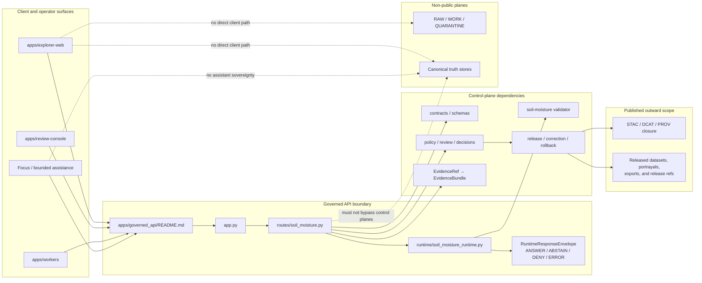

<!-- [KFM_META_BLOCK_V2]
doc_id: kfm://doc/NEEDS-VERIFICATION
title: Governed API
type: standard
version: v1
status: draft
owners: @bartytime4life
created: NEEDS-VERIFICATION
updated: 2026-04-15
policy_label: NEEDS-VERIFICATION
related: [
  ../README.md,
  ./app.py,
  ./routes/__init__.py,
  ./routes/soil_moisture.py,
  ./runtime/soil_moisture_runtime.py,
  ../api/src/api/README.md,
  ../explorer-web/README.md,
  ../review-console/README.md,
  ../workers/README.md,
  ../../contracts/README.md,
  ../../contracts/source/kansas_mesonet_source_descriptor.md,
  ../../contracts/soil_moisture/reading.schema.json,
  ../../schemas/README.md,
  ../../schemas/contracts/README.md,
  ../../schemas/contracts/v1/runtime/runtime_response_envelope.schema.json,
  ../../schemas/soil_moisture/README.md,
  ../../policy/README.md,
  ../../packages/README.md,
  ../../tests/README.md,
  ../../tests/e2e/runtime_proof/soil_moisture/README.md,
  ../../tests/e2e/runtime_proof/soil_moisture/test_runtime_soil_moisture_proof.py,
  ../../tests/e2e/runtime_proof/soil_moisture/test_runtime_route_soil_moisture.py,
  ../../tests/e2e/runtime_proof/test_governed_api_app.py,
  ../../tools/ci/render_runtime_proof_summary.py,
  ../../.github/workflows/README.md
]
tags: [kfm, governed-api, api, trust-membrane, runtime, soil-moisture]
notes: [
  This README is both a standard doc and a README-like boundary doc.
  This revision preserves the older boundary-first Governed API README while aligning it to the supplied 2026-04-15 soil-moisture governed runtime thin-slice packet.
  The older surfaced draft used apps/governed-api/ while the supplied thin-slice packet uses apps/governed_api/. That path split remains NEEDS VERIFICATION and is kept explicit instead of silently flattened.
  Mounted repository inspection was not available in this session; repo-fit details preserve the strongest supplied signals and should be rechecked against repository-authoritative sources before publication.
]
[/KFM_META_BLOCK_V2] -->

<a id="top"></a>

# Governed API

Trust-bearing API boundary for KFM reads, evidence resolution, bounded assistance, exports, runtime envelopes, and steward-only actions.

> [!NOTE]
> **Status:** experimental  
> **Owners:** `@bartytime4life`  
> **Path:** `apps/governed_api/README.md` *(older surfaced draft used `apps/governed-api/README.md`; mounted path remains NEEDS VERIFICATION)*  
>        
> **Quick jumps:** [Scope](#scope) · [Repo fit](#repo-fit) · [Accepted inputs](#accepted-inputs) · [Exclusions](#exclusions) · [Directory tree](#directory-tree) · [Quickstart](#quickstart) · [Usage](#usage) · [Diagram](#diagram) · [Tables](#tables) · [Task list](#task-list) · [FAQ](#faq) · [Appendix](#appendix)

> [!IMPORTANT]
> In KFM, the API boundary is part of the trust model. Public and steward-facing shells consume governed responses; they do **not** bypass policy evaluation, evidence resolution, release state, correction visibility, or runtime proof obligations.

> [!TIP]
> This README is intentionally **boundary-first**. It explains trust obligations, repo fit, accepted request families, exclusions, and proof expectations. Route-by-route handler mechanics belong in route/runtime modules or the deeper API module README.

---

## Scope

This directory documents the edge-facing contract boundary between KFM clients and released, policy-shaped, evidence-resolvable outputs.

The point of this README is not to describe transport plumbing in the abstract. Its job is to explain how KFM keeps the **trust membrane** intact at the public and steward edge: requests enter through governed surfaces, narrow to admissible scope, resolve support-bearing objects, and leave through bounded outcomes rather than uncited improvisation.

### Boundary doctrine in one view

KFM materials consistently frame the governed API as a **runtime trust-surface boundary**. In that posture, the API and evidence resolver serve approved discovery, read, evidence-resolution, dossier, story, export, Focus, and thin-slice runtime interactions.

Public or external surfaces may read only through this boundary and only within promoted or otherwise explicitly governed scope. The boundary may not bypass catalog, policy, review, release, correction, or evidence-control planes.

### What this README must answer

1. What belongs in the governed API boundary?
2. What must stay outside it?
3. How does this boundary fit the current repo shape?
4. What is doctrine, what is packet-supported thin-slice evidence, and what still needs mounted verification?

### Current posture snapshot

| Area | Status | Safe wording |
|---|---|---|
| Governed API as trust membrane | **CONFIRMED** from KFM doctrine | The API boundary protects public and steward request paths. |
| Public clients behind governed APIs | **CONFIRMED** doctrine | Browser shells and model surfaces should not call canonical stores directly. |
| Soil-moisture runtime thin slice | **CONFIRMED in supplied packet** | The supplied 2026-04-15 packet defines app, route, runtime, schema, and tests for a narrow soil-moisture runtime slice. |
| `apps/governed_api/` path | **NEEDS VERIFICATION** | Preferred by the supplied thin-slice packet, but not confirmed by mounted repo inspection here. |
| `apps/governed-api/` path | **NEEDS VERIFICATION** | Used by older surfaced draft; treat as a path-tension item, not a silent typo. |
| Broader runtime, workflow, and CI maturity | **UNKNOWN** | Do not claim active workflow enforcement, deployed DTOs, or live route depth without repo evidence. |

[Back to top](#top)

---

## Repo fit

| Item | Value |
|---|---|
| Target file | `apps/governed_api/README.md` |
| Older surfaced file signal | `apps/governed-api/README.md` |
| Directory role | Boundary-level README for the governed API surface |
| Boundary role | Governed API and evidence resolver for approved discovery, read, evidence-resolution, dossier, story, export, Focus, runtime, and steward-only interactions |
| Upstream app/root neighbor | [`../README.md`](../README.md) |
| Parallel deeper API surface | [`../api/src/api/README.md`](../api/src/api/README.md) |
| Downstream / sibling consumers | [`../explorer-web/README.md`](../explorer-web/README.md), [`../review-console/README.md`](../review-console/README.md), [`../workers/README.md`](../workers/README.md) |
| Contract neighbors | [`../../contracts/README.md`](../../contracts/README.md), [`../../contracts/source/kansas_mesonet_source_descriptor.md`](../../contracts/source/kansas_mesonet_source_descriptor.md), [`../../contracts/soil_moisture/reading.schema.json`](../../contracts/soil_moisture/reading.schema.json) |
| Schema neighbors | [`../../schemas/README.md`](../../schemas/README.md), [`../../schemas/contracts/README.md`](../../schemas/contracts/README.md), [`../../schemas/contracts/v1/runtime/runtime_response_envelope.schema.json`](../../schemas/contracts/v1/runtime/runtime_response_envelope.schema.json), [`../../schemas/soil_moisture/README.md`](../../schemas/soil_moisture/README.md) |
| Policy / package / proof neighbors | [`../../policy/README.md`](../../policy/README.md), [`../../packages/README.md`](../../packages/README.md), [`../../tests/README.md`](../../tests/README.md) |
| Runtime-proof neighbors | [`../../tests/e2e/runtime_proof/soil_moisture/README.md`](../../tests/e2e/runtime_proof/soil_moisture/README.md), [`../../tests/e2e/runtime_proof/test_governed_api_app.py`](../../tests/e2e/runtime_proof/test_governed_api_app.py) |
| Trust rule | Public and external surfaces should read through governed API layers, not canonical/internal stores. |
| Verification posture | Doctrine is **CONFIRMED**. Exact mounted path and implementation inventory remain **NEEDS VERIFICATION**. |

### Path split that must stay visible

> [!CAUTION]
> Do not silently normalize `governed-api` and `governed_api`. The hyphenated path appears in the older surfaced boundary README, while the underscored path appears in the supplied soil-moisture thin-slice packet. Resolve this by repo inspection and an explicit migration note, not by documentation smoothing.

| Surface | Current evidence signal | Safe reading |
|---|---|---|
| `apps/governed_api/` | Supplied thin-slice packet uses this package-style path for app, route, and runtime files. | Treat as the preferred target path for this README until repo inspection says otherwise. |
| `apps/governed-api/` | Older surfaced boundary README used this path. | Treat as an older path signal requiring reconciliation. |
| `apps/api/src/api/` | Existing deeper API-module documentation surface. | Keep route/middleware detail here or in local route docs; do not duplicate it in this boundary README. |

### Boundary-first reading

This README should describe:

- the API as a trust-bearing boundary,
- the repo neighbors it depends on,
- the runtime and proof objects it touches,
- the open reconciliation work between `apps/governed_api/`, `apps/governed-api/`, and `apps/api/src/api/`.

It should **not** duplicate endpoint mechanics better housed in route/runtime modules or [`../api/src/api/README.md`](../api/src/api/README.md).

[Back to top](#top)

---

## Accepted inputs

This area accepts request classes that can be shaped by release state, evidence resolution, policy checks, and finite outward outcomes.

| Request family | Belongs here? | Public / internal | Notes |
|---|---:|---|---|
| Catalog and discovery requests | Yes | Public governed | Release-scoped discovery, catalog closure reads, outward metadata resolution. |
| Feature / subject / place reads | Yes | Public governed | Released authoritative reads with support, time, rights, sensitivity, and correction posture. |
| Map / tile / style / legend / portrayal reads | Yes | Public governed | Public-safe delivery over released scope. |
| `EvidenceRef` resolution | Yes | Public governed | Request-time drill-through to `EvidenceBundle`. |
| Story / dossier / compare reads | Yes | Public governed | Must stay anchored to the same geography, time, release, and evidence shell. |
| Export / report requests | Yes | Public governed | Export must inherit release, policy, rights, and correction state. |
| Focus / governed assistance requests | Yes | Public governed | Bounded synthesis over admissible evidence; never assistant sovereignty. |
| Soil-moisture runtime requests | Yes | Public governed thin slice | Supplied packet supports a narrow runtime route and finite response envelope. |
| Review / stewardship actions | Yes | Internal governed | Approval, denial, rollback, quarantine inspection, rights/sensitivity handling. |
| Ops / status endpoints | Yes | Internal governed | Health, traces, audit joins, and runtime status without raw-store exposure. |

### Thin-slice soil-moisture request posture

The supplied thin-slice packet describes requests shaped around:

- request metadata such as `request_id`,
- query context such as `kind=soil_moisture`, interval, station, quantity, depth, and freshness hints,
- a bounded candidate object for runtime evaluation.

This is intentionally narrow. The route is not a general ingestion API, not a source-normalization API, and not a publication service.

[Back to top](#top)

---

## Exclusions

| Out of scope | Why it stays out | Where it goes instead |
|---|---|---|
| Direct browser/client access to RAW, WORK, QUARANTINE, canonical stores, or artifact trees | Collapses the trust membrane. | Intake, canonical, catalog/review, and projection planes behind governed services. |
| Canonical writes from ordinary clients | Public clients are not authority writers. | Steward-only review, repair, promotion, and correction lanes. |
| Source fetching inside runtime routes | Conflates source custody with request-time trust behavior. | Watchers, source descriptors, connector lanes, and normalization pipelines. |
| Shared domain model ownership | Prevents app-local drift and duplicated contract semantics. | [`../../packages/README.md`](../../packages/README.md). |
| Policy bundle authorship | This boundary enforces or consults policy; it should not become policy’s sovereign home. | [`../../policy/README.md`](../../policy/README.md). |
| Schema / standards-profile source of truth | This boundary consumes and validates against schemas. | [`../../contracts/README.md`](../../contracts/README.md), [`../../schemas/contracts/README.md`](../../schemas/contracts/README.md). |
| Hidden correction or rollback behavior | KFM requires visible correction lineage. | Release, correction, and rollback runbooks/proof objects. |
| “Secret” second truth in telemetry or ops | Status endpoints must not become a bypass database. | Governed ops surfaces with explicit scope. |
| Route-detail duplication | Creates drift between boundary docs and handler/module docs. | Route/runtime modules and [`../api/src/api/README.md`](../api/src/api/README.md). |
| Free-form uncited assistant behavior | Violates cite-or-abstain and evidence-first doctrine. | Bounded Focus / model adapter behind evidence, policy, and response-envelope checks. |

> [!WARNING]
> Do not let this directory become a convenience bypass. In KFM, undocumented edge behavior is usually governance debt in disguise.

[Back to top](#top)

---

## Directory tree

The trees below are **orientation sketches**, not mounted inventory proof. Re-run the inspection commands in [Quickstart](#quickstart) before converting any path from **NEEDS VERIFICATION** to **CONFIRMED**.

### Target governed API surface

```text
apps/
└── governed_api/
    ├── README.md
    ├── app.py
    ├── routes/
    │   ├── __init__.py
    │   └── soil_moisture.py
    └── runtime/
        └── soil_moisture_runtime.py
```

### Older surfaced path signal

```text
apps/
└── governed-api/
    └── README.md
```

### Parallel deeper API surface

```text
apps/
└── api/
    └── src/
        └── api/
            ├── README.md
            ├── middleware/
            └── routes/
```

### Adjacent contract / policy / verification surfaces

```text
contracts/
├── README.md
├── source/
│   └── kansas_mesonet_source_descriptor.md
└── soil_moisture/
    └── reading.schema.json

schemas/
├── README.md
├── soil_moisture/
│   └── README.md
└── contracts/
    ├── README.md
    └── v1/
        └── runtime/
            └── runtime_response_envelope.schema.json

tests/
└── e2e/
    └── runtime_proof/
        ├── test_governed_api_app.py
        └── soil_moisture/
            ├── README.md
            ├── test_runtime_soil_moisture_proof.py
            └── test_runtime_route_soil_moisture.py
```

### Working implication

The strongest surfaced signal is that the repo now has at least two API-facing documentation surfaces to keep distinct:

1. `apps/governed_api/README.md` — boundary-facing, trust-first README for the supplied thin slice.
2. `apps/api/src/api/README.md` — deeper API-module surface for route, middleware, and implementation-facing detail.

That is a documentation split to reconcile, not a fact to hide.

[Back to top](#top)

---

## Quickstart

### Verification-first review loop

1. Read this file as the **boundary README** for the governed API surface.
2. Read [`../api/src/api/README.md`](../api/src/api/README.md) as the deeper API-module surface.
3. Check [`../../contracts/README.md`](../../contracts/README.md), [`../../contracts/source/kansas_mesonet_source_descriptor.md`](../../contracts/source/kansas_mesonet_source_descriptor.md), and [`../../schemas/contracts/v1/runtime/runtime_response_envelope.schema.json`](../../schemas/contracts/v1/runtime/runtime_response_envelope.schema.json) before making contract claims here.
4. Check [`../../policy/README.md`](../../policy/README.md), [`../../tests/README.md`](../../tests/README.md), and [`../../tests/e2e/runtime_proof/soil_moisture/README.md`](../../tests/e2e/runtime_proof/soil_moisture/README.md) before claiming enforcement depth.
5. Promote or downgrade wording in this README only after neighboring contracts, schemas, tests, and workflow files agree.

### Mount recheck commands

Use these inspection-only commands when the repository is mounted:

```bash
find apps/governed_api -maxdepth 3 -type f | sort 2>/dev/null || true
find apps/governed-api -maxdepth 3 -type f | sort 2>/dev/null || true
find apps/api/src/api -maxdepth 3 -type f | sort 2>/dev/null || true

find contracts -maxdepth 3 -type f | sort 2>/dev/null || true
find schemas/contracts -maxdepth 5 -type f | sort 2>/dev/null || true
find schemas/soil_moisture -maxdepth 3 -type f | sort 2>/dev/null || true
find policy -maxdepth 3 -type f | sort 2>/dev/null || true
find tests/e2e/runtime_proof -maxdepth 5 -type f | sort 2>/dev/null || true
find tools/ci -maxdepth 3 -type f | sort 2>/dev/null || true
find .github/workflows -maxdepth 3 -type f | sort 2>/dev/null || true
```

### Minimal review pass before editing boundary claims

```bash
sed -n '1,260p' apps/governed_api/README.md 2>/dev/null || true
sed -n '1,260p' apps/api/src/api/README.md 2>/dev/null || true
sed -n '1,240p' apps/governed_api/app.py 2>/dev/null || true
sed -n '1,260p' apps/governed_api/routes/soil_moisture.py 2>/dev/null || true
sed -n '1,260p' apps/governed_api/runtime/soil_moisture_runtime.py 2>/dev/null || true

sed -n '1,240p' contracts/source/kansas_mesonet_source_descriptor.md 2>/dev/null || true
sed -n '1,240p' contracts/soil_moisture/reading.schema.json 2>/dev/null || true
sed -n '1,240p' schemas/contracts/v1/runtime/runtime_response_envelope.schema.json 2>/dev/null || true
sed -n '1,240p' tests/e2e/runtime_proof/soil_moisture/README.md 2>/dev/null || true
```

> [!TIP]
> The supplied KFM corpus proves more doctrine than mounted implementation. Keep route names, DTOs, workflow enforcement, and runtime maturity visibly bounded unless repo files, tests, manifests, workflow YAML, or emitted proof objects are directly rechecked.

[Back to top](#top)

---

## Usage

### Boundary responsibilities

The governed API should expose request families by responsibility, not by framework fashion.

| Route family | Public or internal | What it owes callers |
|---|---|---|
| Catalog and discovery | Public governed | Release scope, stable identifiers, outward metadata closure. |
| Feature / subject / place reads | Public governed | Support/time semantics, rights posture, release linkage, correction visibility. |
| Map / tile / portrayal | Public governed | Release linkage, freshness basis, policy posture. |
| Evidence resolution | Public governed | `EvidenceRef → EvidenceBundle`, preview policy, rights/sensitivity state, audit linkage. |
| Story / dossier / compare | Public governed | Anchored geography/time shell, drill-through to evidence. |
| Export / report | Public governed | No export outruns release, policy, or correction state. |
| Focus / governed assistance | Public governed | Finite outcome, citation checks, policy-visible reasoning boundary, audit linkage. |
| Soil-moisture runtime | Public governed thin slice | Finite runtime envelope, explicit source role, depth/unit/freshness visibility, fail-closed outcomes. |
| Review / stewardship | Internal governed | Explicit decision artifacts; no hidden approvals. |
| Ops / status | Internal governed | Health and explainability without raw-store exposure. |

### Boundary request rule of thumb

1. Establish request context, audience, and allowed surface.
2. Apply policy pre-checks and scope narrowing.
3. Resolve only to admissible released or governed material.
4. Resolve evidence, catalog, runtime, or outward portrayal objects.
5. Shape the result into a bounded runtime outcome.
6. Attach decision, audit, correction, and evidence linkage where required.
7. Preserve visible stale-state, narrowing, abstention, or denial cues instead of bluffing.

### Packet-supported soil-moisture route posture

The supplied thin-slice packet describes a route shaped like:

| Surface | Packet-supported signal | Mounted status |
|---|---|---|
| App factory | `apps/governed_api/app.py` with `create_app()` | **NEEDS VERIFICATION** |
| Health route | `GET /health` returning `{"status": "ok"}` | **NEEDS VERIFICATION** |
| Runtime route | `POST /soil-moisture/runtime` | **NEEDS VERIFICATION** |
| Request handler | `handle_soil_moisture_runtime(...)` | **NEEDS VERIFICATION** |
| Runtime delegate | `build_runtime_response(...)` | **NEEDS VERIFICATION** |
| Supported query kind | `soil_moisture` | **NEEDS VERIFICATION** |
| Finite outcomes | `ANSWER`, `ABSTAIN`, `DENY`, `ERROR` | **Packet-confirmed**, mounted recheck required |
| HTTP mapping | `ERROR → 400`, `DENY → 403`, `ANSWER/ABSTAIN → 200` | **Packet-confirmed**, active-branch convention still reviewable |

### Public-safe outcomes

| Outcome | Allowed? | Minimum burden |
|---|---:|---|
| Evidence-linked read | Yes | Resolvable support, policy-allowed scope, release linkage. |
| `ANSWER` | Yes | Evidence resolution, bounded support, source/time/unit/depth cues where applicable. |
| `ABSTAIN` | Yes | Explicit bounded reason; no false certainty. |
| `DENY` | Yes | Policy, trust, or unsupported-scope reason with obligations where applicable. |
| `ERROR` | Yes | Machine-meaningful failure without bluffing. |
| Silent fallback to uncited prose | No | Prohibited. |
| Direct DB / object-store pass-through | No | Prohibited. |
| Runtime response leaking release proof internals | No | Runtime proof must not masquerade as promotion or release proof. |

### Boundary README vs module README

| Surface | Best use |
|---|---|
| `apps/governed_api/README.md` | Trust obligations, repo fit, accepted inputs, exclusions, thin-slice runtime posture, proof expectations, adjacent ownership. |
| `apps/api/src/api/README.md` | Middleware, broader route groups, `/api/v1` shaping, implementation-facing handler organization. |
| `apps/governed_api/runtime/soil_moisture_runtime.py` | Runtime envelope assembly for the supplied thin slice. |
| `apps/governed_api/routes/soil_moisture.py` | Request handling and route behavior for the supplied thin slice. |
| `contracts/README.md` | Human-readable contract law and contract families. |
| `schemas/contracts/README.md` | Machine-file contract scaffolding and vocabulary adjacency. |
| `policy/README.md` | Policy runtime, bundles, fixtures, and deny-by-default decision logic. |
| `tests/README.md` | Verification families and proof expectations. |

[Back to top](#top)

---

## Diagram



### Reading the diagram

The governed API does not own the whole system. It owns the public and steward edge where request context, policy evaluation, evidence resolution, and bounded runtime results meet. In the supplied soil-moisture thin slice, that edge is represented by an app assembly, a route handler, a runtime module, tests, and a runtime response envelope schema — all still requiring mounted repo verification before publication claims are upgraded.

[Back to top](#top)

---

## Tables

### Core proof-bearing objects this boundary may touch

| Object family | Why the boundary cares | Current posture |
|---|---|---|
| `SourceDescriptor` | Keeps source role, cadence, rights, and access posture explicit. | Strong doctrine; Kansas Mesonet descriptor path needs mounted recheck. |
| Canonical soil-moisture candidate | Bounded support object for request-time runtime response. | Packet-supported thin-slice object. |
| Validator result | Keeps subject-level validation separate from outward runtime behavior. | Packet-supported concept; path and schema need recheck. |
| `RuntimeResponseEnvelope` | Keeps runtime outcomes finite, inspectable, and auditable. | Packet-supported and schema-referenced; mounted schema path needs recheck. |
| `run_receipt` | Provides machine-checkable process memory. | Boundary may link/consume; runtime must not confuse it with release proof. |
| `EvidenceBundle` | Makes drill-through operational at point of use. | Strong doctrine; mounted resolver traces still needed. |
| `DecisionEnvelope` | Makes policy results machine-readable. | Strong doctrine; exact active schema needs recheck. |
| `ReleaseManifest` / proof pack | Ties outward payloads to release state. | Release/proof lane owns; boundary should link, not reinvent. |

### Boundary-adjacent proof quartet

| Artifact | Boundary relationship | Must not become |
|---|---|---|
| `spec_hash` | Identity anchor joining runtime, schema, source, and artifact state. | A human-only note with no validation. |
| `run_receipt` | Process memory and audit join for fetch/build/publish work. | Release proof by itself. |
| `ai_receipt` | Record of model-mediated proposal or bounded assistance when AI participates. | Authoritative evidence. |
| Attestation ref / bundle | Cryptographic or release-grade proof surface. | Runtime payload clutter or hidden bypass. |

### Boundary ownership matrix

| Concern | This app owns | This app consumes | This app must not replace |
|---|---:|---:|---:|
| Request authentication / policy edge | ✓ |  |  |
| Evidence resolution orchestration | ✓ |  |  |
| Runtime envelope emission | ✓ |  |  |
| Shared domain model ownership |  | ✓ | ✓ |
| Policy bundle authoring |  | ✓ | ✓ |
| Catalog closure authoring |  | ✓ | ✓ |
| Canonical source-of-truth writes |  |  | ✓ |
| Derived map/search/scene rebuild logic |  | ✓ | ✓ |
| Route/middleware implementation detail |  | ✓ | ✓ |

### Evidence and freshness posture

| Statement type | What to surface |
|---|---|
| Released, public-safe read | Release linkage, provenance, freshness basis, correction state. |
| Modeled / derived content | Modeled status, limits, release linkage, and support role. |
| Partial coverage | Explicit partial-state cue, not silent omission. |
| Stale projection | Visible stale cue or fail-closed denial depending on policy. |
| Rights / sensitivity constrained read | Denial, generalization, redaction, or staged access with stated obligation. |
| Soil-moisture runtime answer | Source role, station/depth/unit/time/freshness cues, candidate support, finite outcome. |

### Current verification posture

| Area | Safe reading now |
|---|---|
| Route families and trust obligations | **CONFIRMED** doctrine from KFM materials. |
| Soil-moisture thin-slice route/runtime/test packet | **CONFIRMED as supplied packet evidence**, not mounted repo proof. |
| Runtime envelope finite outcomes | **CONFIRMED as packet-supported design**; mounted schema/test recheck required. |
| Broader `EvidenceBundle` / `DecisionEnvelope` / release proof family | **CONFIRMED doctrine**, broader mounted examples **NEEDS VERIFICATION**. |
| Repo tree under `apps/`, `contracts/`, `schemas/`, `policy/`, `tests/` | **NEEDS VERIFICATION**. |
| CI / workflow enforcement depth | **UNKNOWN** beyond neighboring docs and supplied packet intent. |

[Back to top](#top)

---

## Task list

### Definition of done for this README

- [ ] Canonical relationship between `apps/governed_api/README.md`, any surviving `apps/governed-api/README.md`, and `apps/api/src/api/README.md` is explicitly documented.
- [ ] Owners, created date, doc UUID, and policy label in the meta block are filled from repo-authoritative sources.
- [ ] The durable path choice for `governed_api` versus `governed-api` is decided and recorded.
- [ ] One public governed-read contract surface is linked from this README.
- [ ] One internal / steward contract surface is linked from this README.
- [ ] One positive runtime trace is linked.
- [ ] One negative runtime trace is linked for each of `ABSTAIN`, `DENY`, and `ERROR`.
- [ ] One correction / rollback example is linked.
- [ ] Boundary-adjacent proof quartet references are linked where relevant: `spec_hash`, `run_receipt`, `ai_receipt`, attestation ref / bundle.
- [ ] Public claims about CI gates are kept aligned with actual workflow files, not just README intent.
- [ ] Route-level duplication between this file and deeper route/module docs is reduced or explicitly partitioned.

### First high-value gates

- [ ] **Contracts gate** — schema compile + valid/invalid fixtures + non-zero CI failure.
- [ ] **Policy gate** — deny-by-default reason / obligation grammar.
- [ ] **Resolver gate** — positive and negative `EvidenceBundle` traces.
- [ ] **Runtime gate** — finite envelope validation for `ANSWER`, `ABSTAIN`, `DENY`, and `ERROR`.
- [ ] **Correction gate** — visible supersession / withdrawal / rollback behavior.
- [ ] **Docs gate** — boundary README, module README, runbooks, and actual route/contract behavior stay aligned.

### Immediate repo-fit follow-ups

- [ ] Decide whether `apps/governed_api/` remains the durable app shell path.
- [ ] Confirm whether `apps/governed-api/` exists, redirects, is removed, or is retained as historical lineage.
- [ ] Confirm whether `schemas/contracts/v1/runtime/runtime_response_envelope.schema.json` is the durable machine-file authority for runtime envelopes.
- [ ] Replace scaffold-state or placeholder representative files before claiming broader implemented contract-family depth in prose.
- [ ] Confirm whether `.github/workflows/README.md` reflects hidden/private enforcement, public enforcement, or intended future structure only.
- [ ] Add narrower `CODEOWNERS` coverage if `apps/governed_api/` needs review routing more specific than `/apps/`.

[Back to top](#top)

---

## FAQ

### Why “governed API” instead of just “backend”?

Because KFM treats the API boundary as part of the trust model. It is where public or steward requests inherit release state, evidence drill-through, policy posture, correction visibility, and fail-closed runtime behavior.

### Why can’t the UI call the database or object store directly?

Because that would collapse the trust membrane. Browser shells are supposed to inherit governed evidence, policy, and correction behavior — not bypass them.

### Why are there two API-facing documentation surfaces?

Because the surfaced materials point to both a boundary README and a deeper API-module README. The first should explain trust obligations and boundary law. The second should explain route and middleware mechanics. The split is useful if it stays explicit.

### Is `apps/governed_api/` currently code-bearing?

The supplied 2026-04-15 packet provides code-bearing thin-slice content for `apps/governed_api/`. Mounted repository verification was not available here, so current branch status remains **NEEDS VERIFICATION**.

### Where should endpoint-level details live?

In the route/runtime modules and the deeper API module docs. This README should explain why the endpoint exists, what trust burden it carries, and what it must not bypass.

### Are runtime contracts already enforcement-grade?

For the supplied soil-moisture thin slice, finite outcomes and schema-backed runtime behavior are strongly indicated by the packet. Broader enforcement depth still needs direct repo, schema, test, and CI recheck.

[Back to top](#top)

---

## Appendix

<details>
<summary><strong>Status legend and vocabulary</strong></summary>

### Truth labels used here

| Label | Meaning |
|---|---|
| **CONFIRMED** | Directly supported by KFM doctrine or supplied packet evidence. |
| **INFERRED** | Strongly implied by repeated project patterns, but not directly proven as mounted behavior. |
| **PROPOSED** | Recommended structure or reconciliation move. |
| **UNKNOWN** | Not verified strongly enough to claim as live repo or runtime fact. |
| **NEEDS VERIFICATION** | A path, owner, schema, route, workflow, or authority source that should be checked before publication. |

### Working vocabulary

| Term | Meaning in this README |
|---|---|
| **Trust membrane** | The boundary that prevents public or ordinary UI paths from bypassing governed services. |
| **SourceDescriptor** | Source-admission object for role, rights, cadence, and access posture. |
| **RuntimeResponseEnvelope** | Bounded runtime result object carrying outcome, reason, and trust cues. |
| **run_receipt** | Compact process memory for audit and replay; not release proof by itself. |
| **EvidenceBundle** | Request-time package of support, lineage hints, rights/sensitivity state, and preview policy. |
| **DecisionEnvelope** | Machine-readable policy or gate result with outcome, reason codes, obligations, and audit reference. |
| **Focus Mode** | Bounded synthesis and navigation assistance downstream of evidence, policy, and visible shell state. |
| **Boundary README** | This file: a repo-facing explanation of trust obligations and fit, not a route implementation manual. |

</details>

<details>
<summary><strong>Direct recheck checklist</strong></summary>

```bash
# App surfaces
find apps -maxdepth 3 -type f | sort

# Governed API current target
find apps/governed_api -maxdepth 4 -type f | sort

# Older path signal
find apps/governed-api -maxdepth 4 -type f | sort 2>/dev/null || true

# Deeper API surface
find apps/api/src/api -maxdepth 4 -type f | sort

# Contracts and schemas
find contracts -maxdepth 4 -type f | sort
find schemas/contracts -maxdepth 6 -type f | sort
find schemas/soil_moisture -maxdepth 4 -type f | sort 2>/dev/null || true

# Policy and proof lanes
find policy -maxdepth 4 -type f | sort
find tests/e2e/runtime_proof -maxdepth 6 -type f | sort
find tools/ci -maxdepth 4 -type f | sort 2>/dev/null || true

# Workflow visibility
find .github/workflows -maxdepth 3 -type f | sort
```

</details>

<details>
<summary><strong>Review prompts before publication</strong></summary>

- Does this README still describe the boundary without pretending route mechanics live here?
- Do all implementation claims have visible repo, test, schema, or workflow support?
- Did the path split between `governed_api` and `governed-api` get resolved or remain clearly marked?
- Are runtime responses still separate from receipts, proofs, catalog entries, and release promotion?
- Are negative outcomes treated as valid governed behavior rather than embarrassing exceptions?
- Are relative links valid from `apps/governed_api/README.md`?
- Has any placeholder in the meta block been filled from repo-authoritative evidence rather than guesswork?

</details>

[Back to top](#top)