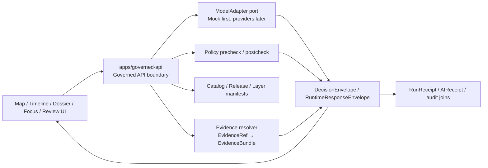
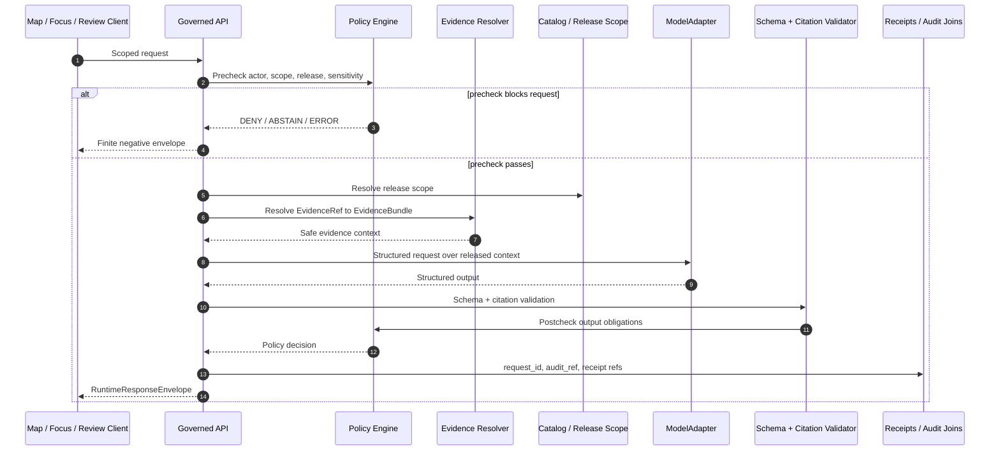

<!-- [KFM_META_BLOCK_V2]
doc_id: TODO-VERIFY(kfm://doc/<uuid>)
title: Governed API
type: standard
version: v1
status: draft
owners: TODO-VERIFY(api-owner, security-steward)
created: TODO-VERIFY(YYYY-MM-DD)
updated: TODO-VERIFY(YYYY-MM-DD)
policy_label: TODO-VERIFY(public|restricted)
related: [TODO-VERIFY:../api/src/api/README.md, TODO-VERIFY:../../contracts/README.md, TODO-VERIFY:../../schemas/contracts/README.md, TODO-VERIFY:../../policy/README.md, TODO-VERIFY:../../tests/README.md, TODO-VERIFY:../../docs/adr/]
tags: [kfm, governed-api, evidence, policy, runtime]
notes: [Boundary README for the KFM governed API surface, Exact repo path and owner fields require mounted-repo verification, Do not upgrade PROPOSED route or enforcement claims without current repo evidence]
[/KFM_META_BLOCK_V2] -->

# Governed API

The governed API is the trust boundary where KFM clients receive release-aware, evidence-resolving, policy-checked responses instead of raw data, direct model output, or unpublished project state.

<p>
  
  
  
  
</p>

> [!IMPORTANT]
> **Impact block**
>
> | Field | Value |
> |---|---|
> | Status | `experimental` until the mounted repository confirms path, route, contract, and CI reality |
> | Owners | `TODO-VERIFY(api-owner, security-steward)` |
> | Target path | `apps/governed-api/README.md` |
> | Boundary posture | Public, UI, Focus Mode, review, and export calls must cross governed interfaces |
> | Verification posture | Route names, DTOs, workflow gates, runtime behavior, deployment posture, and emitted proof objects are **NEEDS VERIFICATION** |
>
> **Quick jumps:** [Scope](#scope) · [Repo fit](#repo-fit) · [Inputs](#inputs) · [Exclusions](#exclusions) · [Directory tree](#directory-tree) · [Quickstart](#quickstart) · [Usage](#usage) · [Diagram](#diagram) · [Task list](#task-list) · [FAQ](#faq)

---

## Scope

This README documents the **governed API boundary** for Kansas Frontier Matrix.

It is not a generic backend README. Its job is to make the trust membrane legible before anyone adds routes, adapters, model calls, export jobs, or UI integrations.

### What this boundary is responsible for

The governed API should be the executable place where KFM:

- resolves `EvidenceRef → EvidenceBundle` before consequential answers;
- enforces release scope, policy posture, source authority, rights, sensitivity, and review state;
- emits finite outcomes instead of smoothing over failure;
- keeps public clients away from `RAW`, `WORK`, `QUARANTINE`, canonical stores, and direct model runtimes;
- returns response envelopes that can be audited, corrected, superseded, or rolled back.

### What this README is not allowed to claim yet

The mounted repository was not available when this draft was prepared. Keep these claims downgraded until the repo proves them:

| Claim type | Current label | Required proof before upgrade |
|---|---:|---|
| `apps/governed-api/` exists and is code-bearing | **NEEDS VERIFICATION** | mounted repo tree |
| concrete route filenames and framework conventions | **NEEDS VERIFICATION** | route source files + tests |
| OpenAPI / schema generation works | **NEEDS VERIFICATION** | contract files + CI logs |
| policy gates are enforced in runtime | **NEEDS VERIFICATION** | policy files + failing invalid fixtures |
| Focus Mode calls a real provider | **PROPOSED / DEFERRED** | adapter contract + MockAdapter tests first |
| public deployment exposure is safe | **UNKNOWN** | deployment manifests, firewall/proxy/VPN review, runtime logs |

<p align="right"><a href="#governed-api">Back to top ↑</a></p>

---

## Repo fit

### Intended location

`apps/governed-api/README.md`

### Boundary role

This directory is the API-facing trust boundary for KFM clients. It should sit between outward-facing product surfaces and lower-level evidence, catalog, policy, release, runtime, and model-adapter internals.



### Upstream and downstream references

> [!NOTE]
> The paths below are intentionally written as path text, not hard links. Convert them to relative links only after the mounted repo confirms they exist from `apps/governed-api/`.

| Relationship | Reference | Status | Why it matters |
|---|---|---:|---|
| Upstream contracts | `../../contracts/README.md` | **NEEDS VERIFICATION** | API behavior must be contract-led, not route-led. |
| Upstream schemas | `../../schemas/contracts/README.md` | **NEEDS VERIFICATION** | `EvidenceBundle`, `DecisionEnvelope`, and runtime envelopes need one canonical schema home. |
| Upstream policy | `../../policy/README.md` | **NEEDS VERIFICATION** | Runtime allow/deny behavior must mirror policy files and invalid fixtures. |
| Upstream tests | `../../tests/README.md` | **NEEDS VERIFICATION** | README claims must align with actual test coverage. |
| Adjacent API module | `../api/src/api/README.md` | **NEEDS VERIFICATION** | Likely deeper route/middleware documentation surface if the repo keeps `apps/api`. |
| Decisions | `../../docs/adr/` | **NEEDS VERIFICATION** | Path conflicts such as `governed-api` vs `governed_api` need ADR treatment. |
| Downstream UI | `apps/web`, `apps/explorer-web`, or repo-native equivalent | **UNKNOWN** | Map shell, Evidence Drawer, Focus Mode, review, and export surfaces consume this boundary. |

### Working split to verify

**INFERRED:** the strongest surfaced documentation signal points to two API-facing docs:

1. `apps/governed-api/README.md` — boundary-facing, trust-first orientation.
2. `apps/api/src/api/README.md` — deeper route and middleware adjacency.

Do not blur that split. Verify it, document it, or replace it with an ADR-backed path decision.

<p align="right"><a href="#governed-api">Back to top ↑</a></p>

---

## Inputs

### What belongs in this directory

This directory may contain or describe governed API implementation only after repo conventions are verified.

| Accepted input | Status | Belongs here when… |
|---|---:|---|
| Boundary README and route-family documentation | **CONFIRMED DOC INTENT / NEEDS REPO VERIFICATION** | it explains trust behavior without inventing implementation. |
| OpenAPI or API contract entry points | **PROPOSED** | the repo confirms this app owns contract generation or serving. |
| Route handlers for released public reads | **PROPOSED** | they enforce release scope and emit finite outcomes. |
| Evidence resolution endpoints | **PROPOSED** | they resolve `EvidenceRef → EvidenceBundle` server-side. |
| Focus Mode request endpoint | **PROPOSED / MOCK FIRST** | it uses policy, evidence, citation validation, and a `RuntimeResponseEnvelope`. |
| Review and stewardship endpoints | **PROPOSED / INTERNAL GOVERNED** | they are authenticated, audited, and do not become normal public paths. |
| Safe telemetry / status endpoints | **PROPOSED** | they expose health and explainability without raw-store leakage. |

### Runtime request inputs this boundary may accept

| Input | Required guardrail |
|---|---|
| `release_id`, `layer_id`, `claim_id`, `source_id`, or stable subject identifiers | Must resolve to published or explicitly permitted scope. |
| `EvidenceRef` | Must resolve server-side to an admissible `EvidenceBundle` or return `ABSTAIN`, `DENY`, or `ERROR`. |
| `FocusQueryRequest` | Must pass scope resolution and policy precheck before retrieval or model-adapter use. |
| `LayerManifest` / `StoryManifest` / `ExportManifest` requests | Must not outrun catalog, release, rights, sensitivity, or correction state. |
| `PolicyDecision` and obligation context | Must be emitted, not hidden, when it changes public meaning. |
| valid/invalid fixtures | Must be included before claiming implemented behavior. |

<p align="right"><a href="#governed-api">Back to top ↑</a></p>

---

## Exclusions

The governed API must be deliberately narrow. These items do **not** belong as normal public inputs or direct dependencies.

| Excluded from normal boundary | Where it belongs instead | Why |
|---|---|---|
| `RAW`, `WORK`, or `QUARANTINE` data | pipeline lifecycle stores | Public request paths must not see unpublished candidate material. |
| direct browser access to databases or object stores | governed API + released artifacts | Direct reads bypass evidence, policy, audit, and correction behavior. |
| direct browser access to Ollama or other model runtimes | provider adapter behind governed API | Model runtimes are not public truth surfaces. |
| source connectors and harvesters | ingestion / pipeline packages | Intake must happen before publication and proof gates. |
| canonical schema authority | `contracts/` or `schemas/contracts/` after ADR | Avoid duplicate contract authority. |
| policy source of truth | `policy/` | API code should consume/enforce policy, not silently redefine it. |
| UI components | repo-native web app path | Evidence Drawer and Focus Mode consume governed envelopes; they do not own API truth. |
| chain-of-thought or free-form model traces | not a KFM truth object | Persist auditable receipts and hashes, not private reasoning. |
| emergency or life-safety instructions | official source systems | KFM should cite official guidance or abstain/deny when life-safety action is requested. |

> [!WARNING]
> A fast route that bypasses evidence resolution, policy, release scope, citation validation, or audit joins is not a shortcut. It is a trust-boundary breach.

<p align="right"><a href="#governed-api">Back to top ↑</a></p>

---

## Directory tree

> [!CAUTION]
> **NEEDS VERIFICATION:** this tree is a proposed shape for review. Do not claim these files exist until a mounted repo confirms them. If the repo uses `apps/governed_api/`, `apps/api/`, or `packages/api/`, adapt through an ADR rather than duplicating authority.

```text
apps/governed-api/
  README.md                    # this boundary README

  openapi/                     # PROPOSED: generated or source OpenAPI home if repo confirms ownership
    openapi.v1.yaml

  src/                         # PROPOSED: framework-dependent
    routes/                    # route family home; filenames/extensions are examples only
      catalog.*
      layers.*
      evidence.*
      claims.*
      focus.*
      releases.*
      corrections.*
      exports.*
      review.*
      telemetry.*

    middleware/                # PROPOSED
      auth.*
      policy.*
      audit.*
      releaseScope.*
      noRawStore.*

    evidence/                  # PROPOSED
      EvidenceResolverPort.*
      PublishedScopeResolver.*

    ai/                        # PROPOSED: adapter boundary, not provider truth
      ModelAdapterPort.*
      MockAdapter.*
      CitationValidator.*

    envelopes/                 # PROPOSED
      DecisionEnvelopeMapper.*
      RuntimeResponseEnvelopeMapper.*

  fixtures/                    # PROPOSED: no-network proof fixtures
    valid/
    invalid/

  tests/                       # PROPOSED: adapt to repo-native runner
    contract/
    policy/
    integration/
    no-direct-model-client/
```

<p align="right"><a href="#governed-api">Back to top ↑</a></p>

---

## Quickstart

### Verification-first review loop

Before editing boundary claims, verify the repo reality in this order:

1. Confirm the app path and whether `apps/governed-api/` is README-only, code-bearing, or absent.
2. Confirm whether `apps/api/src/api/README.md` or another API module README already owns route-level details.
3. Confirm whether `contracts/`, `schemas/contracts/`, or another path is canonical for machine contracts.
4. Confirm policy tooling, test runner, CI workflow names, and invalid fixture behavior.
5. Only then upgrade labels from **PROPOSED** or **NEEDS VERIFICATION**.

### Useful inspection commands

Run these from the repository root after the real checkout is mounted.

```bash
find apps/governed-api -maxdepth 3 -type f | sort
find apps/governed_api -maxdepth 3 -type f | sort
find apps/api/src/api -maxdepth 3 -type f | sort
find packages -maxdepth 3 -type f | sort | sed -n '1,120p'
find contracts schemas policy tests .github/workflows -maxdepth 4 -type f | sort
```

Check for direct model or raw-store paths that should not be reachable from public clients:

```bash
grep -RInE "localhost:11434|OLLAMA_HOST|/api/generate|/api/chat|/v1/chat|/v1/responses" apps packages 2>/dev/null || true
grep -RInE "raw|quarantine|work" apps/governed-api apps/governed_api apps/api packages 2>/dev/null || true
```

Check whether README claims can be backed by actual contracts and tests:

```bash
find contracts schemas -maxdepth 5 -type f | grep -Ei "evidence|decision|runtime|policy|focus|drawer|release|catalog" || true
find tests -maxdepth 5 -type f | grep -Ei "evidence|policy|focus|runtime|citation|deny|abstain|error" || true
```

> [!TIP]
> Prefer downgrading prose over stretching evidence. A README that says **UNKNOWN** clearly is better than a polished trust-boundary document that overclaims enforcement.

<p align="right"><a href="#governed-api">Back to top ↑</a></p>

---

## Usage

### Boundary responsibilities

| Route family | Exposure | What it owes callers | Current label |
|---|---|---|---:|
| Catalog and discovery | public governed | release scope, stable identifiers, outward metadata closure | **PROPOSED** |
| Layers and map portrayal | public governed | `LayerManifest`, release linkage, freshness, policy posture | **PROPOSED** |
| Evidence resolution | public governed | `EvidenceRef → EvidenceBundle`, safe summaries, rights/sensitivity state | **PROPOSED** |
| Claims / feature drill-through | public governed | source role, support, time semantics, review state, correction visibility | **PROPOSED** |
| Focus Mode | public governed | `ANSWER`, `ABSTAIN`, `DENY`, or `ERROR` with citations/reasons/obligations | **PROPOSED / MOCK FIRST** |
| Story / dossier / compare | public governed | anchored geography/time shell with evidence drill-through | **PROPOSED** |
| Export / report | public governed | export cannot outrun release, policy, citation, or correction state | **PROPOSED** |
| Review / stewardship | internal governed | explicit decision artifacts, no hidden approval path | **PROPOSED** |
| Ops / status / telemetry | internal governed by default | health and explainability without raw-store exposure | **PROPOSED** |

### Finite response outcomes

The API should treat negative states as normal governed outputs.

| Outcome | Use when | Required response posture |
|---|---|---|
| `ANSWER` | evidence is sufficient, published, in scope, citation-valid, and policy-safe | include citations, release scope, policy state, and audit reference |
| `ABSTAIN` | evidence is missing, weak, stale, conflicted, unresolved, or scope is too broad | explain what is missing without inventing support |
| `DENY` | rights, sensitivity, role, source status, or publication state blocks response | include safe reason and obligation codes where allowed |
| `ERROR` | technical failure prevents reliable execution | fail closed; do not fall back to raw model text or partial truth |

### Focus Mode path

Focus Mode must be evidence-bounded. A compatible request path is:

```text
user request
→ scope resolution
→ policy precheck
→ release-scoped evidence retrieval
→ EvidenceRef / EvidenceBundle resolution
→ bounded context assembly
→ ModelAdapter call, MockAdapter first
→ structured-output validation
→ citation validation
→ policy postcheck
→ RuntimeResponseEnvelope
→ audit / receipt joins
```

### Model runtime placement

Provider choice is internal. The public contract should not expose whether the runtime behind the adapter is a `MockAdapter`, Ollama, OpenAI-compatible API, or another provider.

Required posture:

- define `ModelAdapterPort` before selecting providers;
- use `MockAdapter` for deterministic contract and policy tests first;
- pass only released, policy-safe evidence excerpts or safe summaries;
- validate citations before `ANSWER`;
- never let a model runtime read canonical stores, `RAW`, `WORK`, or `QUARANTINE`;
- never let browser code call a model server directly.

<p align="right"><a href="#governed-api">Back to top ↑</a></p>

---

## Diagram



<p align="right"><a href="#governed-api">Back to top ↑</a></p>

---

## Tables

### Contract objects this boundary should preserve

| Object | Boundary role | Failure behavior |
|---|---|---|
| `SourceDescriptor` | declares source role, authority, rights, cadence, and sensitivity posture | missing or conflicted source role should block authoritative claims |
| `EvidenceRef` | stable pointer used by UI, claims, Focus, exports, and review | unresolved refs produce `ABSTAIN` or `ERROR` |
| `EvidenceBundle` | admissible evidence packet used for answers and drill-through | missing bundle blocks `ANSWER` |
| `DecisionEnvelope` | finite decision and trust-state wrapper | invalid envelope is `ERROR` |
| `RuntimeResponseEnvelope` | public runtime result for Focus or model-assisted surfaces | must not contain raw model fallback |
| `CitationValidationReport` | proves cited refs exist and are permitted | invalid citations downgrade to `ABSTAIN` or `ERROR` |
| `PolicyDecision` | records allow, deny, obligations, reason codes, and actor/scope posture | unavailable policy engine fails closed |
| `RunReceipt` / `AIReceipt` | process memory and audit joins | receipts do not become public truth by themselves |
| `ReleaseManifest` / `CatalogMatrix` | release and catalog closure | missing closure blocks publication-sensitive output |
| `RollbackRef` / correction notice | rollback and supersession target | corrections remain visible, not erased |

### Boundary anti-patterns

| Anti-pattern | Why it breaks KFM | Correct pattern |
|---|---|---|
| UI calls model server directly | bypasses policy, evidence, and audit | UI → governed API → adapter |
| API reads `RAW` for user-visible answers | leaks unpublished candidate material | release-scoped evidence resolution only |
| route returns fluent uncited text | violates cite-or-abstain | validate citations or abstain |
| embeddings treated as authority | confuses acceleration with truth | embeddings are rebuildable projections |
| export ignores corrections | public artifact outruns review state | export through release/correction checks |
| policy failure becomes best-effort success | fail-open behavior | `DENY` or `ERROR` with reason/obligation |

<p align="right"><a href="#governed-api">Back to top ↑</a></p>

---

## Task list

### Definition of done for this directory

- [ ] Confirm whether `apps/governed-api/` exists, is README-only, or is code-bearing.
- [ ] Confirm whether `apps/governed-api`, `apps/governed_api`, `apps/api`, or `packages/api` is the durable API home.
- [ ] Fill `doc_id`, owners, created date, updated date, policy label, and related links in the KFM meta block from repo-authoritative sources.
- [ ] Document the canonical relationship between this README and any deeper API module README.
- [ ] Link or reference one public governed-read contract after path verification.
- [ ] Link or reference one internal / steward contract after path verification.
- [ ] Link one positive `EvidenceRef → EvidenceBundle` trace.
- [ ] Link one negative runtime trace for each of `ABSTAIN`, `DENY`, and `ERROR`.
- [ ] Link one correction, supersession, withdrawal, or rollback example.
- [ ] Confirm CI gates match actual workflow files, not README intent.
- [ ] Confirm no public or browser path directly calls Ollama, a provider API, a canonical store, or raw lifecycle paths.

### First high-value gates

- [ ] **Contracts gate** — schema compile plus valid and invalid fixtures.
- [ ] **Policy gate** — deny-by-default reason and obligation grammar.
- [ ] **Resolver gate** — positive and negative `EvidenceBundle` traces.
- [ ] **Runtime gate** — finite envelope validation for `ANSWER`, `ABSTAIN`, `DENY`, and `ERROR`.
- [ ] **Citation gate** — invalid or blocked citations prevent `ANSWER`.
- [ ] **No-direct-model-client gate** — browser and public clients cannot call provider runtimes.
- [ ] **No-raw-public-path gate** — governed routes cannot serve `RAW`, `WORK`, or `QUARANTINE`.
- [ ] **Correction gate** — visible supersession, withdrawal, or rollback behavior.
- [ ] **Docs gate** — boundary README, route docs, contracts, policy, tests, and runbooks stay aligned.

### Rollback checklist

- [ ] Disable new route family behind feature flag.
- [ ] Revert route PR while preserving fixtures and receipts for diagnosis.
- [ ] Downgrade README claims back to **PROPOSED** or **UNKNOWN**.
- [ ] Add unresolved items to the verification backlog.
- [ ] Preserve correction or withdrawal notes if any public artifact was affected.

<p align="right"><a href="#governed-api">Back to top ↑</a></p>

---

## FAQ

### Why “governed API” instead of just “backend”?

Because KFM treats this API boundary as part of the trust model. It is where client requests inherit release state, evidence drill-through, policy posture, finite outcomes, and correction visibility.

### Can the UI call the database, object store, or model server directly?

No. That would collapse the trust membrane. Browser shells consume governed envelopes, released artifacts, and safe summaries. They do not reach around the API for canonical truth, raw lifecycle stores, or model output.

### Where should endpoint-level details live?

**NEEDS VERIFICATION.** If the repo has a deeper API module README such as `apps/api/src/api/README.md`, keep endpoint implementation details there and keep this file focused on boundary law, repo fit, accepted inputs, exclusions, gates, and review posture.

### Is this directory currently implemented?

**UNKNOWN.** This README is drafted for `apps/governed-api/README.md`, but the current source workspace did not expose a mounted repository. Treat implementation-specific paths as proposed until the real checkout is inspected.

### Why is MockAdapter first?

MockAdapter lets the project test finite outcomes, schema validation, citation validation, source coverage, and policy behavior without network access, model nondeterminism, provider drift, or premature public AI behavior.

### What should happen when evidence is missing?

Return `ABSTAIN` or `ERROR`, depending on whether the issue is evidentiary or technical. Do not fabricate a plausible answer. Do not ask the model to bridge the gap.

### What should happen when policy blocks an answer?

Return `DENY` with safe reason and obligation information where permitted. Do not leak restricted details in the denial explanation.

<p align="right"><a href="#governed-api">Back to top ↑</a></p>

---

## Appendix

<details>
<summary>Glossary</summary>

| Term | Meaning in this README |
|---|---|
| Governed API | The executable trust boundary for public, UI, Focus, review, and export calls. |
| EvidenceRef | Stable reference to evidence that must resolve before consequential output. |
| EvidenceBundle | Inspectable evidence packet that outranks generated text. |
| DecisionEnvelope | Finite decision wrapper for governed responses. |
| RuntimeResponseEnvelope | Runtime result wrapper for model-assisted and Focus surfaces. |
| Focus Mode | Evidence-bounded synthesis surface, not a free-form AI tab. |
| Evidence Drawer | Trust-visible UI object showing support, policy, review, release, corrections, and caveats. |
| SourceDescriptor | Source-role and authority record for source families. |
| CatalogMatrix | Catalog closure object that helps prove release/readiness state. |
| ReleaseManifest | Published release description and linkage object. |
| AIReceipt | Audit record for adapter/model-assisted execution, not public truth. |
| RunReceipt | Process receipt for run reconstruction, not public truth by itself. |
| Trust membrane | Boundary that prevents public surfaces from bypassing evidence, policy, release, and audit controls. |

</details>

<details>
<summary>Pre-publish checklist</summary>

- [ ] Meta block values are filled or intentionally marked `TODO-VERIFY`.
- [ ] Status, owners, badges, and quick jumps are present.
- [ ] Repo fit includes path plus upstream/downstream references.
- [ ] Accepted inputs and exclusions are explicit.
- [ ] Directory tree is clearly labeled as verified or proposed.
- [ ] Mermaid diagram reflects real KFM responsibility boundaries.
- [ ] Commands are non-destructive and language-tagged.
- [ ] Route names and implementation claims are not upgraded without repo proof.
- [ ] Long reference material is inside `<details>`.
- [ ] Relative links are added only after path existence is confirmed.
- [ ] No public route bypasses evidence, policy, release state, or audit.
- [ ] No UI/client route calls a model runtime directly.
- [ ] No `RAW`, `WORK`, or `QUARANTINE` path is exposed to normal clients.

</details>
