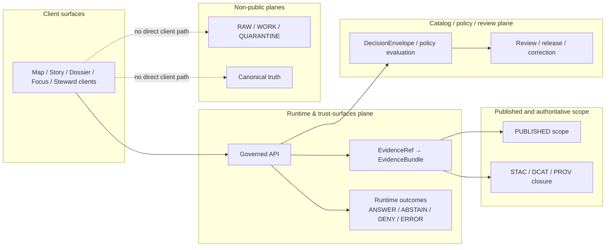

<!-- [KFM_META_BLOCK_V2]
doc_id: kfm://doc/<NEEDS_VERIFICATION_UUID>
title: Governed API
type: standard
version: v1
status: draft
owners: NEEDS_VERIFICATION
created: YYYY-MM-DD
updated: YYYY-MM-DD
policy_label: NEEDS_VERIFICATION
related: [../../contracts/, ../../schemas/, ../../policy/, ../../packages/, ../../docs/]
tags: [kfm, governed-api, api, trust-membrane]
notes: [Requested target path is apps/governed-api/README.md, but March 2026 repo-grounded material also references apps/api; owners, dates, and policy label require live repo verification.]
[/KFM_META_BLOCK_V2] -->

# Governed API

Trust-bearing API boundary for KFM reads, evidence resolution, bounded assistance, exports, and steward-only actions.

> **Status:** experimental  
> **Owners:** NEEDS VERIFICATION  
> **Path:** `apps/governed-api/README.md` *(requested target path; live repo path still needs verification)*  
>      
> **Quick jumps:** [Scope](#scope) · [Repo fit](#repo-fit) · [Accepted inputs](#accepted-inputs) · [Exclusions](#exclusions) · [Directory tree](#directory-tree) · [Quickstart](#quickstart) · [Usage](#usage) · [Diagram](#diagram) · [Tables](#tables) · [Task list](#task-list) · [FAQ](#faq) · [Appendix](#appendix)

> [!IMPORTANT]
> In KFM, the governed API is part of the trust membrane. Public and normal UI clients consume governed responses; they do **not** bypass policy evaluation, evidence resolution, release state, or correction visibility.

> [!NOTE]
> This README separates **CONFIRMED doctrine** from **NEEDS VERIFICATION repo topology**. March 2026 repo-grounded material mentions `apps/api` and `apps/api/src/api/README.md`; the requested destination here is `apps/governed-api/README.md`. Until a live repo tree is rechecked, that rename should not be stated as settled fact.

## Scope

This directory owns the edge-facing contract between KFM clients and release-scoped, policy-shaped, evidence-resolvable outputs.

The strongest March 2026 KFM manuals are consistent on the core point: KFM is a governed spatial evidence system, and the runtime edge must preserve the truth path, the trust membrane, authoritative-versus-derived separation, fail-closed behavior, visible correction lineage, and bounded runtime outcomes. This README therefore documents the API boundary as a **trust surface**, not as generic transport plumbing.

### Current reading

| Signal | Reading |
|---|---|
| Doctrine role of a governed API boundary | **CONFIRMED** |
| Need for `EvidenceRef → EvidenceBundle` resolution and runtime envelopes | **CONFIRMED** |
| Path `apps/api` in older repo-grounded docs | **INFERRED** from March 2026 repo-grounded documentation snapshots |
| Path `apps/governed-api` as mounted repo reality | **NEEDS VERIFICATION** |
| Live endpoint inventory | **UNKNOWN** |
| Live contract/schema inventory in code | **UNKNOWN** |

### What this README is for

It should let reviewers answer four questions quickly:

1. What belongs in the edge-facing KFM API boundary?
2. What must stay outside it?
3. Which request families are public-safe versus internal-only?
4. What still needs proof before this directory can claim maturity?

<p align="right"><a href="#governed-api">Back to top ↑</a></p>

## Repo fit

| Item | Value |
|---|---|
| File | `apps/governed-api/README.md` |
| Directory role | Trust-bearing API boundary for governed reads, evidence resolution, bounded assistance, exports, and steward-only operations |
| Working path status | **NEEDS VERIFICATION** — older repo-grounded material references `apps/api` and `apps/api/src/api/README.md`; this README uses the requested target path without asserting a live rename |
| Upstream doctrinal / contract neighbors | [contracts], [schemas], [policy], [packages], [docs] |
| Older repo-grounded adjacent references | `packages/evidence`, `packages/policy`, and `contracts/openapi` |
| Downstream consumers | Map / Story / Dossier / Focus / Review / Export shells and variants on the governed substrate (**NEEDS VERIFICATION** exact app paths) |
| Edge rule | Public clients talk to governed API surfaces, not directly to canonical stores, artifact trees, model runtimes, or unpublished scope |
| Evidence posture | **CONFIRMED** doctrine, **INFERRED** repo-adjacent fragments, **UNKNOWN** live implementation depth |

### Local fit note

This README is intentionally written to fit either of two realities:

1. the requested destination `apps/governed-api/README.md`, or
2. an older still-live `apps/api/...` placement that has not yet been renamed in the mounted repo.

If live verification shows the older path is still canonical, move or alias this README rather than rewriting its doctrinal substance.

## Accepted inputs

This area should accept or orchestrate the following request classes.

| Input class | Belongs here? | Notes |
|---|---:|---|
| Catalog and discovery requests | Yes | Release-scoped discovery, catalog closure reads, outward metadata resolution |
| Feature / subject / place reads | Yes | Released authoritative reads only |
| Map / tile / style / legend / portrayal reads | Yes | Public-safe delivery over released scope |
| `EvidenceRef` resolution | Yes | Request-time drill-through to `EvidenceBundle` |
| Story / dossier / compare reads | Yes | Must stay anchored to the same geography/time/release shell |
| Export / report requests | Yes | Public-safe outward artifacts that inherit release, policy, and correction state |
| Focus / governed assistance requests | Yes | Bounded synthesis over admissible released evidence only |
| Review / stewardship actions | Yes, internal only | Approval, denial, rollback, quarantine inspection, rights/sensitivity handling |
| Ops / status endpoints | Yes, internal only | Health, traces, audit joins, runtime status; no shadow truth surface |
| Raw store paths, DB credentials, unpublished candidate artifacts | No | Trust-membrane violation |
| Free-form uncited assistant behavior | No | KFM doctrine prohibits it |

## Exclusions

| Out of scope | Why it stays out | Where it goes instead |
|---|---|---|
| Direct browser/client access to RAW, WORK, QUARANTINE, canonical stores, or artifact trees | Collapses the trust membrane | Intake, canonical, catalog/review, and projection planes behind governed services |
| Canonical writes from ordinary clients | Public clients are not authority writers | Steward-only review / repair / promotion lanes |
| Shared domain logic ownership | Avoids app-local drift and copy-paste contracts | [packages] |
| Policy bundle authorship | This app enforces policy; it should not become policy’s sovereign home | [policy] and package-level policy surfaces |
| Schema / standards-profile source of truth | This app consumes and validates against them | [contracts] and [schemas] |
| Hidden correction or rollback behavior | KFM requires visible correction lineage | release / correction runbooks and proof objects |
| “Secret” second truth in telemetry or ops | Status endpoints must not become a bypass database | governed ops routes with shaped outputs only |

> [!WARNING]
> Do not let this directory become a convenience bypass. In KFM, undocumented edge behavior is usually governance debt in disguise.

## Directory tree

### Corpus-observed March 2026 path fragments

_This is **not** a live tree dump. It reflects repo-grounded March 2026 documents, not direct mounted checkout evidence._

```text
.
├── apps/
│   ├── api/
│   │   └── src/api/README.md          # older repo-grounded reference
│   └── ui/                            # older repo-grounded reference
├── contracts/
│   └── openapi/                       # older repo-grounded reference
├── packages/
│   ├── evidence/                      # older repo-grounded reference
│   └── policy/                        # older repo-grounded reference
├── policy/
├── schemas/
└── tests/
```

### Requested target placement

```text
apps/
└── governed-api/
    └── README.md
```

### Working implication

The safer documentation move is to keep the boundary description stable while leaving path migration explicit. That prevents the README from turning a requested rename into an unsupported claim.

<p align="right"><a href="#governed-api">Back to top ↑</a></p>

## Quickstart

### Verification-first starter loop

1. Verify whether the live repo still uses `apps/api`, has already renamed to `apps/governed-api`, or uses both during transition.
2. Verify whether public and internal route contracts live under `contracts/openapi/`, another contract surface, or both.
3. Verify whether `EvidenceBundle`, `RuntimeResponseEnvelope`, `DecisionEnvelope`, `ReleaseManifest`, and `CorrectionNotice` exist as real schemas, examples, or DTOs.
4. Verify whether current CI actually enforces any merge-blocking contract, policy, or docs gates.
5. Update the path, owners, dates, and policy label in this README only after that live check.

### Illustrative local verification commands

```bash
# illustrative only — replace with the repo's actual task runner and local conventions
git grep -n "apps/api/src/api/README.md\|apps/governed-api"
git grep -n "EvidenceBundle\|RuntimeResponseEnvelope\|DecisionEnvelope\|ReleaseManifest\|CorrectionNotice"
git grep -n "focus/ask\|stac/items\|datasets\|EvidenceRef"
find contracts schemas policy tests .github/workflows -maxdepth 3 -type f | sort
```

### Minimum review pass before editing this README again

```bash
# illustrative review sequence
git grep -n "README.md" apps packages contracts policy docs
git diff --name-only HEAD~1..HEAD
# then re-check whether any path, contract, or route claim in this README needs promotion or downgrade
```

> [!NOTE]
> The March 2026 corpus is much stronger on doctrine and required proof objects than on mounted commands, entrypoints, or route filenames. Keep command snippets illustrative until the live repo proves them.

## Usage

### Boundary responsibilities

The governed API should expose request families by responsibility, not by framework fashion.

| Route family | Public or internal | What it owes callers |
|---|---|---|
| Catalog and discovery | Public governed | release scope, stable identifiers, outward metadata closure |
| Feature / subject / place reads | Public governed | support/time semantics, rights posture, release linkage, correction visibility |
| Map / tile / portrayal | Public governed | release linkage, freshness basis, policy posture |
| Evidence resolution | Public governed | `EvidenceRef → EvidenceBundle`, preview policy, rights/sensitivity state, audit linkage |
| Story / dossier / compare | Public governed | anchored geography/time shell, drill-through to evidence |
| Export / report | Public governed | no export outruns release, policy, or correction state |
| Focus / governed assistance | Public governed | finite outcome, citation check, policy-visible reasoning boundary, audit linkage |
| Review / stewardship | Internal governed | explicit decision artifacts, no hidden approvals |
| Ops / status | Internal governed | health and explainability without raw-store exposure |

### Request handling rule of thumb

1. establish request context and audience;
2. apply policy pre-checks;
3. narrow to release-scoped admissible material;
4. resolve evidence or catalog objects;
5. shape the response into a bounded runtime result;
6. attach decision and audit linkage;
7. preserve visible correction and stale-state cues.

### Public-safe outcomes

| Outcome | Allowed? | Minimum burden |
|---|---:|---|
| Evidence-linked read | Yes | resolvable support, policy-allowed scope, release linkage |
| `ANSWER` | Yes | evidence resolution + citation checks |
| `ABSTAIN` | Yes | explicit bounded reason, calm failure language |
| `DENY` | Yes | policy reason + obligation visibility where applicable |
| `ERROR` | Yes | machine-meaningful failure without bluffing |
| Silent fallback to uncited prose | No | prohibited |
| Direct DB / object-store pass-through | No | prohibited |

## Diagram



### Reading the diagram

The API does not “own” the whole system. It owns the public and steward edge where request context, policy evaluation, evidence resolution, and bounded runtime results meet. That edge must stay downstream of release, review, and correction rather than becoming a shortcut around them.

<p align="right"><a href="#governed-api">Back to top ↑</a></p>

## Tables

### Core trust-bearing objects this boundary is expected to touch

| Object family | Why it matters here | Status |
|---|---|---|
| `EvidenceBundle` | makes drill-through operational at point of use | **CONFIRMED** doctrinal object; live schema/DTO **UNKNOWN** |
| `RuntimeResponseEnvelope` | keeps runtime outcomes finite and auditable | **CONFIRMED** doctrinal object; live schema/DTO **UNKNOWN** |
| `DecisionEnvelope` | makes policy results machine-readable | **CONFIRMED** doctrinal object; live schema/DTO **UNKNOWN** |
| `ReleaseManifest` / proof pack | ties outward payloads to release state | **CONFIRMED** doctrinal object; live files **UNKNOWN** |
| `CorrectionNotice` | keeps rollback, supersession, narrowing, and withdrawal visible | **CONFIRMED** doctrinal object; live files **UNKNOWN** |
| review / approval artifacts | prevents silent approvals | **CONFIRMED** doctrinal object; live workflow evidence **UNKNOWN** |

### Boundary ownership matrix

| Concern | This app owns it | This app consumes it | This app must not replace it |
|---|---:|---:|---:|
| Request authentication / policy edge | ✓ |  |  |
| Evidence resolution orchestration | ✓ |  |  |
| Runtime envelope emission | ✓ |  |  |
| Shared domain model ownership |  | ✓ | ✓ |
| Policy bundle authoring |  | ✓ | ✓ |
| Catalog closure authoring |  | ✓ | ✓ |
| Canonical source-of-truth writes |  |  | ✓ |
| Derived map/search/scene rebuild logic |  | ✓ | ✓ |

### Evidence and freshness posture

| Statement type | What to surface |
|---|---|
| Released, public-safe read | release linkage, provenance, freshness basis, correction state |
| Modeled / derived content | modeled status, limits, and release linkage |
| Partial coverage | explicit partial-state cue, not silent omission |
| Stale projection | visible stale cue or fail-closed denial depending on policy |
| Rights / sensitivity constrained read | denial or generalized output with stated obligation |

## Task list

### Definition of done for this directory

- [ ] Live path is verified (`apps/governed-api` vs `apps/api` or other).
- [ ] Owners, created date, updated date, and policy label in the meta block are filled from live repo authority.
- [ ] One public contract surface for governed reads is linked from this README.
- [ ] One internal/steward contract surface is linked from this README.
- [ ] One positive `EvidenceRef → EvidenceBundle` trace is surfaced.
- [ ] One negative runtime trace is surfaced for each of `ABSTAIN`, `DENY`, and `ERROR`.
- [ ] One correction / rollback example is linked.
- [ ] CI evidence is verified for contract or policy gating, or this README keeps that maturity explicitly marked **UNKNOWN**.
- [ ] Path links in this file are updated to actual repo neighbors after live verification.

### First high-value gates

- [ ] **contracts gate** — schema compile + valid/invalid fixtures + non-zero CI failure
- [ ] **policy gate** — deny-by-default reason / obligation grammar
- [ ] **resolver gate** — positive and negative `EvidenceBundle` traces
- [ ] **runtime gate** — finite envelope validation for `ANSWER`, `ABSTAIN`, `DENY`, and `ERROR`
- [ ] **correction gate** — visible supersession / withdrawal / rollback behavior
- [ ] **docs gate** — this README and adjacent runbooks stay aligned with actual route / contract / correction behavior

<p align="right"><a href="#governed-api">Back to top ↑</a></p>

## FAQ

### Why “governed API” instead of just “backend”?

Because KFM treats the API boundary as part of the trust model. It is where public or steward requests inherit release state, evidence drill-through, policy posture, and fail-closed runtime behavior.

### Why can’t the UI call the database or object store directly?

Because that would collapse the trust membrane. KFM repeatedly treats direct client access to canonical or storage surfaces as a bypass of policy, provenance, and evidence guarantees.

### Is Focus Mode just another chat endpoint?

No. It is a bounded runtime surface inside the governed shell. It must remain subordinate to admissible evidence, policy, release state, and finite outcomes.

### Why is path naming still marked NEEDS VERIFICATION?

Because March 2026 corpus evidence is stronger on doctrine than on live repo topology. Older repo-grounded material mentions `apps/api`; the current user request asks for `apps/governed-api`. This README keeps that distinction visible instead of choosing one path by confidence alone.

## Appendix

<details>
<summary><strong>Status legend, vocabulary, and path note</strong></summary>

### Truth labels used here

| Label | Meaning |
|---|---|
| **CONFIRMED** | directly supported by the March 2026 KFM corpus in this session |
| **INFERRED** | strongly implied by repeated corpus patterns, but not directly mounted as implementation |
| **PROPOSED** | a recommended starter shape or sequencing move |
| **UNKNOWN** | not verified strongly enough to claim as live repo or runtime fact |
| **NEEDS VERIFICATION** | a field or path that should be confirmed against live repo authority before publication |

### Working vocabulary

| Term | Meaning in this README |
|---|---|
| **Trust membrane** | the boundary that prevents public or ordinary UI paths from bypassing governed services |
| **EvidenceRef** | outward-facing reference to support-bearing material |
| **EvidenceBundle** | request-time package of support, lineage hints, rights/sensitivity state, and preview policy |
| **DecisionEnvelope** | machine-readable policy result with reason and obligation codes |
| **RuntimeResponseEnvelope** | bounded runtime result object carrying outcome, audit linkage, and surface state |
| **CorrectionNotice** | visible lineage object for supersession, withdrawal, narrowing, or replacement |

### Path note

Treat `apps/governed-api/README.md` as the requested working destination for this file. Treat `apps/api` and `apps/api/src/api/README.md` as older March 2026 repo-grounded references until a live checkout confirms whether the rename is real, partial, or still pending.

</details>

[contracts]: ../../contracts/
[schemas]: ../../schemas/
[policy]: ../../policy/
[packages]: ../../packages/
[docs]: ../../docs/
