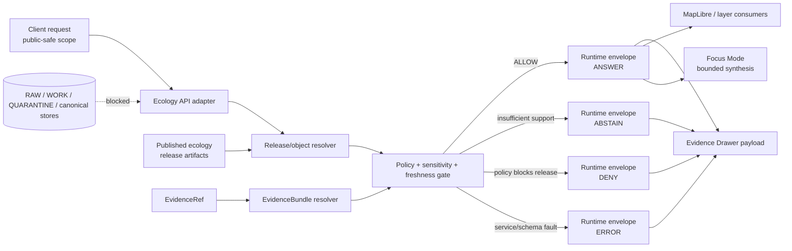

<!-- [KFM_META_BLOCK_V2]
doc_id: kfm://doc/TODO-NEEDS-UUID
title: Governed API Ecology
type: standard
version: v1
status: draft
owners: TODO-NEEDS-VERIFICATION
created: 2026-04-24
updated: 2026-04-24
policy_label: TODO-NEEDS-VERIFICATION
related: [../README.md, ../../README.md, ../../../docs/README.md, ../../../schemas/README.md, ../../../policy/README.md, ../../../tests/README.md, TODO-docs-domains-ecology-NEEDS-VERIFICATION]
tags: [kfm, governed-api, ecology, habitat, fauna, flora, evidence, policy, map-first]
notes: [Target path supplied by the current task; doc_id, owners, policy_label, adjacent link validity, route inventory, API framework, package manager, schema home, and runtime implementation state require mounted-repo verification.]
[/KFM_META_BLOCK_V2] -->

<a id="top"></a>

# Governed API Ecology

Evidence-bounded API boundary for public-safe ecology, habitat, fauna, and flora responses in KFM.


> [!IMPORTANT]
> **Status:** `experimental`  
> **Owners:** `TODO-NEEDS-VERIFICATION`  
> **Path:** `apps/governed-api/ecology/README.md`  
> **Role:** README-like directory landing page plus standard KFM Markdown surface.  
> **Quick jumps:** [Scope](#scope) · [Repo fit](#repo-fit) · [Accepted inputs](#accepted-inputs) · [Exclusions](#exclusions) · [Directory tree](#directory-tree) · [Quickstart](#quickstart) · [Usage](#usage) · [Diagram](#diagram) · [Tables](#tables) · [Task list](#task-list) · [FAQ](#faq) · [Appendix](#appendix)

> [!NOTE]
> **Current evidence posture:** this README is authored for the requested target path. Exact route files, DTO names, test commands, parent README links, CI workflows, and runtime behavior remain **NEEDS VERIFICATION** until the real repository checkout is mounted and inspected.

---

## Scope

`apps/governed-api/ecology/` is the intended governed API surface for ecology-facing runtime responses.

It should expose only released, policy-safe, evidence-resolved ecology information. In this README, **ecology** is an API-facing aggregation boundary over related KFM domain lanes such as habitat, fauna, flora, vegetation/community context, public-safe occurrence context, and habitat-assignment outputs.

This directory should help answer questions such as:

- What public-safe ecology objects or layer descriptors can a client request?
- Which EvidenceBundle supports a claim?
- What policy, sensitivity, rights, review, freshness, release, and correction state travels with the response?
- When should the API return `ANSWER`, `ABSTAIN`, `DENY`, or `ERROR` instead of a fluent but unsupported result?

It should **not** become a source connector, raw data reader, model authority, MapLibre style bucket, or canonical ecology database.

[Back to top](#top)

---

## Repo fit

### Target path

| Field | Value |
|---|---|
| Target file | `apps/governed-api/ecology/README.md` |
| Directory role | Governed runtime/API boundary for ecology responses |
| Truth posture | **PROPOSED** for implementation details; **CONFIRMED** only for the target requested by this task and KFM doctrine summarized here |
| Naming caution | **NEEDS VERIFICATION:** prior KFM lane planning has used both `apps/governed_api/` and `apps/governed-api/` as possible homes. The current task uses the hyphenated path. Do not maintain both paths without an ADR. |

### Upstream and downstream surfaces

> [!WARNING]
> Link validity is **NEEDS VERIFICATION** until this README is checked inside the mounted repo. Keep these links relative once verified.

| Direction | Link | Status | Why it matters |
|---|---|---|---|
| Parent API boundary | [`../README.md`](../README.md) | NEEDS VERIFICATION | Should define shared governed API rules, envelope conventions, and public-client constraints. |
| Apps root | [`../../README.md`](../../README.md) | NEEDS VERIFICATION | Should explain how app surfaces relate to the rest of KFM. |
| Documentation control plane | [`../../../docs/README.md`](../../../docs/README.md) | NEEDS VERIFICATION | Should define repo documentation authority and navigation. |
| Schema registry | [`../../../schemas/README.md`](../../../schemas/README.md) | NEEDS VERIFICATION | Should own shared runtime, source, evidence, release, and ecology schemas if present. |
| Policy registry | [`../../../policy/README.md`](../../../policy/README.md) | NEEDS VERIFICATION | Should own fail-closed rights, sensitivity, and publication policy. |
| Test surfaces | [`../../../tests/README.md`](../../../tests/README.md) | NEEDS VERIFICATION | Should own contract, fixture, runtime-proof, and negative-path tests. |
| Domain documentation | `../../../docs/domains/ecology/README.md` | TODO-NEEDS-VERIFICATION | Suggested future domain doc if the repo chooses an ecology documentation lane. |
| UI / Evidence Drawer consumers | `../../../ui/README.md` or `../../../web/README.md` | TODO-NEEDS-VERIFICATION | Downstream shell consumers should read governed envelopes, not raw or canonical stores. |
| Map delivery consumers | `../../../apps/maplibre/README.md` | TODO-NEEDS-VERIFICATION | MapLibre should consume released layer descriptors and drawer payloads, not internal truth stores. |

[Back to top](#top)

---

## Accepted inputs

Only inputs that have already crossed the KFM trust membrane belong at this API boundary.

| Accepted input | Belongs here when… | Minimum expectation |
|---|---|---|
| Released ecology artifact references | They point to promoted, public-safe outputs. | Release state, correction state, and rollback target are discoverable. |
| EvidenceRef / EvidenceBundle references | A response needs to justify a claim. | EvidenceRef resolves before `ANSWER`; unresolved evidence becomes `ABSTAIN` or `ERROR`. |
| Public-safe object identifiers | Querying a published ecology object, occurrence fixture, habitat assignment, or released layer descriptor. | Object identity is deterministic or explicitly versioned. |
| Policy and sensitivity decisions | The API must decide whether a response can be released. | Unknown rights, restricted sensitivity, or exact sensitive geometry fails closed. |
| Review and freshness metadata | A client needs to show confidence, staleness, correction, or review state. | The metadata travels with the response envelope. |
| Finite runtime envelopes | The handler emits a response to a normal client or UI surface. | Outcomes are constrained to `ANSWER`, `ABSTAIN`, `DENY`, or `ERROR`. |
| Negative fixtures | A route is being tested for policy and evidence failure. | At least one failing fixture exists for each new gate. |

[Back to top](#top)

---

## Exclusions

The ecology API should stay thin. It should not admit source material or implementation shortcuts that belong upstream, downstream, or behind restricted boundaries.

| Excluded material | Why it does not belong here | Put it here instead |
|---|---|---|
| `RAW`, `WORK`, or `QUARANTINE` data | Public and normal UI surfaces must not read pre-publication data. | Lifecycle data directories after repo convention is verified. |
| Live source connectors | Connectors require source descriptors, rights checks, rate limits, retries, and quarantine paths before publication. | Source pipeline / watcher homes after source activation review. |
| Canonical ecology stores | Canonical evidence-bearing stores are not public API surfaces. | Canonical domain storage or processed/catalog homes after ADR. |
| Exact sensitive species locations | Public exact geometry may expose rare, protected, or steward-controlled records. | Restricted access lanes or generalized public artifacts with transform receipts. |
| MapLibre styles, tiles, or sprites | Render assets are delivery/UI concerns, not API authority. | Map delivery or UI layer registries. |
| Free-form AI output | AI is interpretive and subordinate to released evidence and policy. | Governed Focus adapter after EvidenceBundle resolution and citation validation. |
| Unreviewed summaries | Summaries can drift into authority if released without evidence closure. | Review queue, proof pack, or candidate release area. |
| Legal/conservation status authority without source role | Occurrence aggregators and community observations are not automatically legal-status authorities. | Source-role registry and policy gates. |

[Back to top](#top)

---

## Directory tree

> [!NOTE]
> This tree is **PROPOSED** until the mounted repo confirms framework, language, package, and path conventions. Keep this directory small; shared contracts, schemas, policy, catalog, receipts, and proofs should live in their canonical repo homes.

```text
apps/governed-api/ecology/
├── README.md
├── routes/                 # PROPOSED: repo-native route adapters only
├── dto/                    # PROPOSED: API-facing DTOs / runtime envelopes
├── resolvers/              # PROPOSED: release artifact + EvidenceBundle resolvers
├── mappers/                # PROPOSED: drawer/layer/focus payload mappers
└── fixtures/               # OPTIONAL: prefer tests/fixtures/... if repo convention exists
```

Recommended adjacent homes, subject to ADR and repo verification:

```text
schemas/contracts/v1/ecology/        # PROPOSED: machine contracts, if schemas/ is canonical
policy/ecology/                      # PROPOSED: fail-closed policy mirrors
tests/e2e/runtime_proof/ecology/     # PROPOSED: emitted response and drawer payload tests
tests/fixtures/ecology/              # PROPOSED: valid and invalid public-safe fixtures
docs/domains/ecology/                # PROPOSED: domain docs, source roles, and review posture
data/published/ecology/              # PROPOSED: released ecology artifacts only
```

[Back to top](#top)

---

## Quickstart

Run these checks before adding or changing ecology API code.

```bash
# From the repository root.
git status --short

# Verify the target path and inspect current contents.
test -f apps/governed-api/ecology/README.md && sed -n '1,120p' apps/governed-api/ecology/README.md
find apps/governed-api/ecology -maxdepth 3 -type f 2>/dev/null | sort

# Check for the underscore/hyphen path ambiguity before adding files.
find apps/governed_api/ecology apps/governed-api/ecology -maxdepth 3 -type f 2>/dev/null | sort

# Inspect likely shared governance surfaces without assuming they exist.
find schemas contracts policy tests docs data -maxdepth 4 -type f 2>/dev/null \
  | grep -Ei 'ecology|habitat|fauna|flora|evidence|runtime|source|release|policy' \
  | sort || true
```

> [!CAUTION]
> Do **not** use quickstart work to activate live biodiversity, rare-species, or third-party occurrence connectors. Source activation requires source descriptors, rights review, sensitivity posture, negative fixtures, and promotion gates.

[Back to top](#top)

---

## Usage

A compliant ecology API handler should follow this order:

1. Accept a scoped request that does not ask for raw, internal, unpublished, or restricted material.
2. Resolve the requested object against a released ecology artifact or release manifest.
3. Resolve every EvidenceRef needed for a consequential claim into an EvidenceBundle.
4. Apply rights, sensitivity, geoprivacy, freshness, and review-state policy.
5. Emit a finite runtime envelope.
6. Return drawer-compatible support for every `ANSWER`.
7. Return `ABSTAIN`, `DENY`, or `ERROR` when evidence, policy, or runtime conditions are not satisfied.

Illustrative response shape only:

```json
{
  "outcome": "ANSWER",
  "object_family": "habitat_assignment",
  "claim": "Illustrative claim text; replace with a released, evidence-backed statement.",
  "scope": {
    "place_ref": "kfm://place/TODO",
    "time_basis": "as_of",
    "as_of": "YYYY-MM-DD"
  },
  "evidence_bundle_refs": [
    "kfm://evidence-bundle/TODO"
  ],
  "policy": {
    "decision": "ALLOW",
    "sensitivity": "public-safe",
    "rights": "release-reviewed"
  },
  "release": {
    "release_id": "kfm://release/TODO",
    "correction_state": "current"
  },
  "links": {
    "drawer": "TODO-NEEDS-ROUTE-VERIFICATION"
  }
}
```

Finite outcomes:

| Outcome | Meaning |
|---|---|
| `ANSWER` | Evidence resolved, policy allows release, requested use is in scope, and freshness is represented honestly. |
| `ABSTAIN` | Evidence is unresolved, source role is ambiguous, freshness cannot be represented honestly, or support is insufficient for the requested claim. |
| `DENY` | Policy forbids release, requested geometry is restricted, authorization is insufficient, or the request asks for raw/internal material. |
| `ERROR` | Service fault, schema mismatch, resolver failure, catalog linkage break, or validator failure. |

[Back to top](#top)

---

## Diagram



[Back to top](#top)

---

## Tables

### Candidate route families

> [!IMPORTANT]
> Route names below are **PROPOSED** route-family examples, not confirmed implementation. Use repo-native routing once the actual framework is verified.

| Candidate route family | Method | Status | Required behavior |
|---|---:|---|---|
| `/v1/ecology/layers` | `GET` | PROPOSED | List released ecology layer descriptors only; no raw source URLs. |
| `/v1/ecology/drawer/{object_ref}` | `GET` | PROPOSED | Return Evidence Drawer payload or finite negative envelope. |
| `/v1/ecology/occurrences/{occurrence_id}/habitat` | `GET` | PROPOSED | Return public-safe habitat assignment only after release and EvidenceBundle resolution. |
| `/v1/ecology/search` | `GET` | PROPOSED | Query released public-safe ecology objects with bounded filters and no sensitive exact-location leakage. |
| `/v1/ecology/focus` | `POST` | PROPOSED | Provide evidence-bounded Focus synthesis; no direct model, raw data, or uncited claim path. |

### Object family responsibilities

| Object family | API responsibility | Do not confuse with |
|---|---|---|
| `SourceDescriptor` | Used to understand source role and rights after activation. | Live connector, raw source file, or legal authority by itself. |
| `EvidenceBundle` | Supports claims returned by this API. | Generated summary or UI copy. |
| `DecisionEnvelope` / `RuntimeResponseEnvelope` | Constrains outcomes and failure states. | Free-form assistant answer. |
| `ReleaseManifest` | Establishes released artifact set and rollback target. | File move or unreviewed publish folder. |
| `LayerManifest` | Describes map-consumable released layers. | MapLibre style authority or canonical truth. |
| `CatalogMatrix` / catalog closure | Proves public artifact discoverability and provenance closure. | Runtime cache. |
| `CorrectionNotice` | Carries correction and supersession lineage. | Silent overwrite. |

### Ecology risk gates

| Gate | Default posture | Failure result |
|---|---|---|
| Evidence closure | Required for `ANSWER`. | `ABSTAIN` or `ERROR`. |
| Rights / attribution | Unknown rights fail closed. | `ABSTAIN` or `DENY`. |
| Sensitive geometry | Exact restricted geometry is denied for normal public clients. | `DENY`. |
| Source role | Unknown or inappropriate source role cannot support authoritative claims. | `ABSTAIN`. |
| Review state | Unreviewed consequential claim cannot be promoted as authoritative. | `ABSTAIN` or `DENY`. |
| Freshness | Stale or unknown freshness must be visible. | `ABSTAIN` when freshness is essential. |
| Correction lineage | Superseded objects must point to correction or successor state. | `ERROR` if lineage is broken. |

[Back to top](#top)

---

## Task list

### Definition of done for this README

- [ ] `doc_id` replaced with a real KFM document identifier.
- [ ] `owners` confirmed from CODEOWNERS or an approved stewardship record.
- [ ] `policy_label` confirmed.
- [ ] Related links checked from `apps/governed-api/ecology/README.md`.
- [ ] Hyphenated `apps/governed-api/` versus underscored `apps/governed_api/` path convention resolved or documented in an ADR.
- [ ] Parent governed API README linked and consistent.
- [ ] Ecology domain docs linked if created.
- [ ] README rechecked for one H1, quick jumps, accepted inputs, exclusions, directory tree, diagram, and definition of done.

### Definition of done for ecology API changes

- [ ] No public route reads `RAW`, `WORK`, `QUARANTINE`, source APIs, canonical stores, graph internals, vector indexes, model runtimes, unpublished candidates, or credentials.
- [ ] Every positive response resolves EvidenceRef to EvidenceBundle before release.
- [ ] Every positive response includes source role, time basis, freshness, review state, release state, rights/sensitivity posture, and correction/supersession state where applicable.
- [ ] Every route emits finite outcomes: `ANSWER`, `ABSTAIN`, `DENY`, `ERROR`.
- [ ] At least one negative fixture exists for evidence-missing, rights-unknown, sensitive-exact-geometry, source-role-ambiguous, unpublished-candidate, and resolver-error cases.
- [ ] Sensitive ecology locations are generalized, redacted, denied, or restricted before normal public release.
- [ ] Focus Mode consumes only released evidence context and cannot bypass this API boundary.
- [ ] Evidence Drawer payload tests cover positive, abstain, deny, stale, and corrected states.
- [ ] Rollback and correction references survive API serialization.
- [ ] Documentation, schemas, policy, and tests are updated in the same PR or explicitly deferred with a reviewable reason.

[Back to top](#top)

---

## FAQ

### Why does ecology live behind a governed API?

Because KFM’s public value is the inspectable claim, not a map tile, model output, source feed, or rendered layer alone. Ecology outputs often carry source-role, sensitivity, rights, freshness, and review burdens that must be enforced before normal clients see them.

### Why include habitat, fauna, and flora under “ecology”?

This README treats ecology as an **API aggregation boundary**, not as a replacement for the flora, fauna, or habitat domain lanes. The API may expose combined public-safe responses, but source registries, schemas, policy, and domain docs should stay in their appropriate canonical homes.

### Can this API call live biodiversity sources directly?

No. Live source calls belong in governed source pipelines after source activation review. Public and normal UI clients should receive released artifacts through governed API responses.

### Can Focus Mode answer ecology questions from this directory?

Only as a downstream governed consumer. Focus must receive released evidence context, pass policy checks, validate citations, and emit finite outcomes. It must not become a direct model-to-user authority surface.

### What happens when evidence is incomplete?

Return `ABSTAIN` when support is insufficient, `DENY` when policy blocks release, or `ERROR` when the runtime or contract fails. Do not fill gaps with plausible prose.

[Back to top](#top)

---

## Appendix

<details>
<summary>Open verification backlog</summary>

| Item | Status | Why it matters |
|---|---|---|
| Actual path convention: `apps/governed-api` vs `apps/governed_api` | NEEDS VERIFICATION | Avoid duplicate API homes. |
| API framework and language | UNKNOWN | Determines route, DTO, resolver, and test layout. |
| Parent governed API README | NEEDS VERIFICATION | Shared rules should not be duplicated here. |
| Schema home | NEEDS VERIFICATION | Avoid parallel `contracts/` and `schemas/` authority. |
| Policy engine | UNKNOWN | OPA/Rego, Python validators, or another gate may be repo-native. |
| EvidenceBundle resolver implementation | UNKNOWN | Required before `ANSWER` can be claimed. |
| Release artifact layout | UNKNOWN | Required for object lookup and rollback. |
| Ecology domain docs | UNKNOWN | Needed to avoid overloading this API README with domain doctrine. |
| MapLibre/UI consumer path | UNKNOWN | Required before linking downstream drawer/layer mappers. |
| CODEOWNERS / steward owner | NEEDS VERIFICATION | Required for `owners` metadata and review routing. |
| CI workflow names | UNKNOWN | Required before adding build badges or workflow-specific commands. |

</details>

<details>
<summary>Recommended first PR shape</summary>

A safe first PR should be small and reversible:

1. Land this README with placeholder metadata called out.
2. Add or update the parent governed API README cross-link.
3. Add an ADR resolving `apps/governed-api` versus `apps/governed_api` if both appear.
4. Add one synthetic public-safe ecology runtime fixture.
5. Add one positive `ANSWER` envelope fixture and negative `ABSTAIN`, `DENY`, and `ERROR` fixtures.
6. Add or link shared EvidenceBundle and runtime envelope schemas.
7. Add tests that prove the route cannot return `ANSWER` without evidence and policy closure.
8. Defer live source connectors, public layer generation, and Focus integration until the fixture path passes.

</details>

<details>
<summary>Rollback path</summary>

- Revert this README if it was added before route code depends on it.
- If routes or schemas are added later, deprecate with versioned successors rather than deleting silently after release.
- Disable new ecology routes behind a feature flag or route registration guard.
- Keep Evidence Drawer and Focus consumers pointed at the last known-good released envelope contract.
- Record correction or withdrawal state for any released artifact that has already become externally visible.

</details>

[Back to top](#top)
