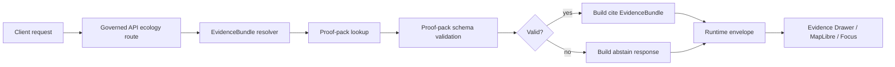

<!-- [KFM_META_BLOCK_V2]
doc_id: kfm://doc/TODO-NEEDS-UUID
title: Governed API Ecology EvidenceBundles
type: standard
version: v1
status: draft
owners: TODO-NEEDS-VERIFICATION
created: 2026-04-24
updated: 2026-04-24
policy_label: TODO-NEEDS-VERIFICATION
related: [
  ../README.md,
  ../../README.md,
  ../../../contracts/runtime/ecology_evidencebundle_resolver.md,
  ../../../schemas/ecology/ecology_proof_pack.schema.json,
  ../../../schemas/contracts/v1/runtime/runtime_response_envelope.schema.json,
  ../../../data/proofs/ecology/README.md,
  ../../../tools/proofs/ecology_proof_pack_builder.py,
  ../../../policy/README.md,
  ../../../tests/README.md
]
tags: [kfm, governed-api, ecology, evidencebundle, proof-pack, runtime, cite-or-abstain, map-first]
notes: [
  "Updated from the prior governed API ecology README.",
  "Keeps path, owner, policy label, framework, route inventory, and app registration as NEEDS VERIFICATION.",
  "Documents the proposed ecology EvidenceBundle resolver, route wrapper, FastAPI adapter, and proof-pack runtime boundary."
]
[/KFM_META_BLOCK_V2] -->

<a id="top"></a>

# Governed API Ecology EvidenceBundles

Evidence-bounded API boundary for resolving ecology proof packs into runtime EvidenceBundles.


> [!IMPORTANT]
> **Status:** `experimental`  
> **Owners:** `TODO-NEEDS-VERIFICATION`  
> **Path:** `apps/governed-api/ecology/README.md` or `apps/governed_api/ecology/README.md` — **NEEDS VERIFICATION**  
> **Role:** governed runtime resolver surface for ecology EvidenceBundles.  
> **Quick jumps:** [Scope](#scope) · [Repo fit](#repo-fit) · [Accepted inputs](#accepted-inputs) · [Exclusions](#exclusions) · [Components](#components) · [Endpoint](#endpoint) · [Responses](#responses) · [Diagram](#diagram) · [Task list](#task-list) · [FAQ](#faq)

> [!NOTE]
> This README documents the proposed ecology runtime boundary built around proof packs, EvidenceBundles, and cite-or-abstain behavior. App registration, exact framework wiring, route path, package layout, and CI enforcement remain **NEEDS VERIFICATION**.

---

## Scope

This package resolves ecology proof packs into governed API EvidenceBundles.

```text
candidate_id
  → proof pack
  → proof-pack schema validation
  → EvidenceBundle
  → cite or abstain response
```

It covers public-safe ecology, habitat, fauna, flora, vegetation, land-cover, hydrology, soil, and air-quality evidence only after those artifacts have passed the governed chain:

```text
schema
  → validator
  → receipt
  → receipt manifest
  → promotion gate
  → proof pack
  → runtime EvidenceBundle
```

It must **not** become:

- a source connector;
- a raw ecology data reader;
- a canonical ecology store;
- a MapLibre style bucket;
- a model authority surface;
- a bypass around proof packs, receipts, promotion, or policy.

[Back to top](#top)

---

## Repo fit

| Field | Value |
|---|---|
| Target directory | `apps/governed-api/ecology/` or `apps/governed_api/ecology/` |
| Path status | **NEEDS VERIFICATION** |
| Runtime role | proof-pack-backed ecology EvidenceBundle resolver |
| Truth posture | **PROPOSED** implementation details; doctrine-aligned runtime boundary |
| Naming caution | Resolve `governed-api` versus `governed_api` before adding both paths. |

### Related surfaces

| Surface | Role | Status |
|---|---|---|
| `contracts/runtime/ecology_evidencebundle_resolver.md` | resolver contract | PROPOSED |
| `schemas/ecology/ecology_proof_pack.schema.json` | proof-pack validation | PROPOSED |
| `data/proofs/ecology/` | proof-pack storage lane | PROPOSED |
| `tools/proofs/ecology_proof_pack_builder.py` | proof-pack builder | PROPOSED |
| `tools/validators/promotion_gate/ecology_manifest.py` | promotion manifest evaluator | PROPOSED |
| `schemas/contracts/v1/runtime/runtime_response_envelope.schema.json` | runtime envelope compatibility | NEEDS VERIFICATION |
| Evidence Drawer / shell consumers | downstream inspection surface | NEEDS VERIFICATION |

[Back to top](#top)

---

## Accepted inputs

Only proof-backed runtime inputs belong here.

| Accepted input | Requirement |
|---|---|
| `candidate_id` | Resolves to a proof pack or abstains |
| `spec_hash` | Optional expected deterministic identity |
| Ecology proof pack | Must validate against proof-pack schema |
| Catalog refs | Must include required provenance, especially PROV |
| Receipt summaries | May be included in EvidenceBundle response |
| Include/exclude flags | May trim receipts, catalog refs, or uncertainty blocks |
| Runtime envelope request | Must preserve cite-or-abstain behavior |

---

## Exclusions

| Excluded material | Reason |
|---|---|
| Raw, work, quarantine, or canonical data | violates trust membrane |
| Live biodiversity/source calls | belong in governed pipelines/watchers |
| Exact sensitive species geometry | requires restriction or generalization |
| Map styles, tiles, sprites | renderer concern, not evidence authority |
| Free-form AI ecological claims | must be subordinate to EvidenceBundle |
| Unreviewed summaries | may become unsupported authority |
| Direct proof-pack access by clients | clients must use governed API |

---

## Components

Proposed package shape:

```text
apps/governed_api/ecology/
├── README.md
├── evidencebundle_resolver.py
├── routes.py
├── fastapi_routes.py
└── tests/
    ├── test_evidencebundle_resolver.py
    ├── test_routes.py
    └── test_fastapi_routes.py
```

| File | Role |
|---|---|
| `evidencebundle_resolver.py` | pure resolver: proof-pack lookup, validation, cite/abstain decision |
| `routes.py` | route-adjacent wrapper with include/exclude flags |
| `fastapi_routes.py` | optional FastAPI adapter |
| `tests/test_evidencebundle_resolver.py` | resolver cite/abstain behavior |
| `tests/test_routes.py` | wrapper behavior |
| `tests/test_fastapi_routes.py` | adapter behavior if FastAPI is used |

> [!WARNING]
> The tree above is **PROPOSED**. Verify the active app path and framework before committing.

[Back to top](#top)

---

## Endpoint

Proposed route:

```text
GET /v1/ecology/evidence-bundles/{candidate_id}
```

Query parameters:

| Parameter | Default | Purpose |
|---|---|---|
| `spec_hash` | `null` | expected deterministic proof-pack identity |
| `include_receipts` | `true` | include receipt summaries |
| `include_catalog_refs` | `true` | include DCAT/STAC/PROV refs |
| `include_uncertainty` | `true` | include uncertainty block |

---

## Responses

### Cite response

```json
{
  "status": "ok",
  "data": {
    "evidence_bundle_id": "kfm.evidence.ecology.eco_index.example",
    "candidate_id": "eco_index.example",
    "spec_hash": "aaaaaaaaaaaaaaaaaaaaaaaaaaaaaaaaaaaaaaaaaaaaaaaaaaaaaaaaaaaaaaaa",
    "decision": "cite",
    "status": "resolved",
    "proof_pack_ref": "data/proofs/ecology/eco_index.example.proof_pack.json",
    "evidence": {
      "receipts": [],
      "catalog_refs": {
        "dcat": [],
        "stac": [],
        "prov": []
      }
    },
    "uncertainty": {
      "status": "declared",
      "summary": "Uncertainty inherited from proof-pack evidence where available."
    }
  },
  "meta": {
    "resolver": "ecology_evidencebundle",
    "evidence_drawer_required": true
  }
}
```

### Abstain response

```json
{
  "status": "ok",
  "data": {
    "evidence_bundle_id": "kfm.evidence.ecology.eco_index.missing",
    "candidate_id": "eco_index.missing",
    "decision": "abstain",
    "status": "unresolved",
    "reason": "proof_pack_missing",
    "error_code": "ECO_EB_PROOF_PACK_MISSING",
    "claim_text": "KFM abstained because the ecological proof pack could not be resolved."
  },
  "meta": {
    "resolver": "ecology_evidencebundle",
    "evidence_drawer_required": true
  }
}
```

### Error taxonomy

| Code | Meaning |
|---|---|
| `ECO_EB_PROOF_PACK_MISSING` | proof pack could not be located |
| `ECO_EB_PROOF_PACK_INVALID` | proof pack failed schema, structure, JSON, or status validation |
| `ECO_EB_SPEC_HASH_MISMATCH` | requested `spec_hash` differs from proof pack |
| `ECO_EB_CATALOG_REFS_UNRESOLVED` | required catalog refs are missing or unresolved |
| `ECO_EB_REVIEW_REQUIRED` | candidate is not public-runtime eligible |
| `ECO_EB_INTERNAL_ERROR` | resolver failed unexpectedly |

[Back to top](#top)

---

## Fail-closed behavior

The resolver must abstain when:

| Condition | Runtime decision |
|---|---|
| proof pack missing | `abstain` |
| malformed proof-pack JSON | `abstain` |
| proof-pack document is not an object | `abstain` |
| proof-pack schema validation fails | `abstain` |
| requested `spec_hash` mismatches | `abstain` |
| proof-pack `status != proof_complete` | `abstain` |
| required PROV catalog refs are missing | `abstain` |
| catalog refs cannot resolve | `abstain` or `review_required` |
| candidate is restricted | `review_required` or `deny` depending on policy |

---

## Diagram



---

## Trust membrane

Runtime clients must not read proof packs, receipts, raw data, processed data, catalogs, canonical stores, graph internals, vector indexes, or model runtimes directly.

They must call the governed API resolver, which:

- validates proof-pack structure;
- checks deterministic identity;
- enforces cite-or-abstain behavior;
- keeps Evidence Drawer required;
- returns bounded runtime responses;
- keeps invalid or missing evidence visible as abstention.

[Back to top](#top)

---

## Task list

### README completion

- [ ] Replace `doc_id`.
- [ ] Verify `owners`.
- [ ] Verify `policy_label`.
- [ ] Resolve `apps/governed-api` vs `apps/governed_api`.
- [ ] Verify all related links.
- [ ] Align with parent governed API README.

### Runtime implementation

- [ ] Implement `evidencebundle_resolver.py`.
- [ ] Implement route wrapper.
- [ ] Add or remove FastAPI adapter based on actual app framework.
- [ ] Validate proof-pack schema at runtime.
- [ ] Return cite response only for valid proof packs.
- [ ] Return abstain response for all missing/invalid proof states.
- [ ] Validate runtime response envelope compatibility.
- [ ] Add Evidence Drawer integration.
- [ ] Add map-layer EvidenceBundle linkage.
- [ ] Add CI/runtime proof.

[Back to top](#top)

---

## FAQ

### Why does ecology require proof packs?

Ecological claims often combine sensitive, spatial, temporal, modeled, and observational evidence. A proof pack gives the runtime resolver a frozen, inspectable evidence object.

### Can the API answer without a proof pack?

No. It must abstain for consequential ecological claims when proof-pack resolution fails.

### Can the map layer itself prove a claim?

No. A renderer can display evidence-backed layers, but it is not evidence authority.

### Can Focus Mode use this API?

Yes, as a governed consumer. It must consume the EvidenceBundle and preserve citations, uncertainty, and abstention.

### Is the FastAPI adapter confirmed?

No. It is proposed until the governed API framework and app registration are verified.

[Back to top](#top)
