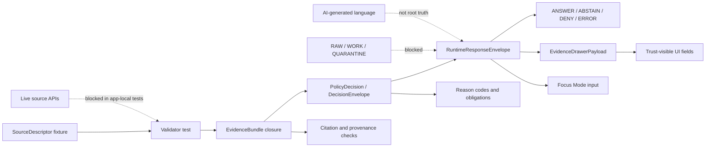

<!-- [KFM_META_BLOCK_V2]
doc_id: kfm://doc/NEEDS-VERIFICATION-UUID
title: Ecology Governed API Tests
type: standard
version: v1
status: draft
owners: <NEEDS_VERIFICATION_OWNER>
created: 2026-04-24
updated: 2026-04-24
policy_label: NEEDS_VERIFICATION
related: [../README.md, ../../README.md, ../../../../schemas/contracts/v1/ecology/README.md, ../../../../policy/ecology/README.md, ../../../../tools/validators/ecology/README.md, ../../../../tests/e2e/runtime_proof/ecology/README.md]
tags: [kfm, ecology, governed-api, tests, fixtures, evidence, policy]
notes: [Target path supplied by task; active repository checkout was not available during generation; owners, policy label, doc_id, adjacent README links, and exact test runner require verification before commit.]
[/KFM_META_BLOCK_V2] -->

<a id="top"></a>

# Ecology Governed API Tests

Test boundary for ecology-facing governed API behavior: evidence resolution, policy decisions, finite runtime outcomes, and public-safe response contracts.

> [!NOTE]
> **Status:** `experimental` · **Document status:** `draft`  
> **Owners:** `<NEEDS_VERIFICATION_OWNER>`  
> **Path:** `apps/governed-api/ecology/tests/README.md`  
> **Quick jumps:** [Scope](#scope) · [Repo fit](#repo-fit) · [Accepted inputs](#accepted-inputs) · [Exclusions](#exclusions) · [Directory tree](#directory-tree) · [Quickstart](#quickstart) · [Usage](#usage) · [Diagram](#diagram) · [Test matrix](#test-matrix) · [Definition of done](#definition-of-done) · [FAQ](#faq) · [Appendix](#appendix)


---

## Scope

This directory is for tests that prove the ecology-facing governed API does **not** bypass KFM’s trust path.

In this README, **ecology** is treated as a governed API acceptance boundary for public-safe ecological claims and derived ecology relationships, especially where habitat, fauna, flora, source rights, sensitivity, policy, and Evidence Drawer payloads meet at runtime.

**CONFIRMED:** the target path is `apps/governed-api/ecology/tests/README.md`, because it was supplied by the task.

**NEEDS VERIFICATION:** the active repository was not mounted during this drafting pass, so this README does not confirm that the surrounding directory, app framework, schemas, validators, fixtures, or CI workflow already exist.

**PROPOSED test role:** this directory should cover ecology API behavior that must be visible to maintainers before any public or semi-public ecological output is trusted:

- `EvidenceRef -> EvidenceBundle` closure
- `DecisionEnvelope` / `PolicyDecision` outcomes
- `RuntimeResponseEnvelope` finite outcomes: `ANSWER`, `ABSTAIN`, `DENY`, `ERROR`
- public-safe geometry and sensitivity handling
- source-role and rights checks
- Evidence Drawer payload compatibility
- Focus Mode compatibility, where Focus consumes only evidence-backed outputs
- rollback, correction, and release-state visibility

> [!IMPORTANT]
> The tests here should prove outward behavior. They should not become the source of canonical ecological truth.

[Back to top](#top)

---

## Repo fit

| Relationship | Relative link from this file | Role | Status |
|---|---|---|---|
| Current README | [`./README.md`](./README.md) | Local orientation for ecology governed API tests. | **CONFIRMED target** |
| Ecology API package | [`../README.md`](../README.md) | Expected parent app/module README for ecology API behavior. | **NEEDS VERIFICATION** |
| Governed API app | [`../../README.md`](../../README.md) | Expected app-level boundary for governed API routes, middleware, and runtime envelopes. | **NEEDS VERIFICATION** |
| Repo root | [`../../../../README.md`](../../../../README.md) | Expected repository orientation and KFM doctrine entry point. | **NEEDS VERIFICATION** |
| Ecology schemas | [`../../../../schemas/contracts/v1/ecology/README.md`](../../../../schemas/contracts/v1/ecology/README.md) | Expected schema/contract home for ecology runtime objects. | **NEEDS VERIFICATION** |
| Ecology policy | [`../../../../policy/ecology/README.md`](../../../../policy/ecology/README.md) | Expected policy home for rights, sensitivity, publication, and negative-outcome rules. | **NEEDS VERIFICATION** |
| Ecology validators | [`../../../../tools/validators/ecology/README.md`](../../../../tools/validators/ecology/README.md) | Expected validator home for reusable checks invoked by tests and CI. | **NEEDS VERIFICATION** |
| Runtime proof tests | [`../../../../tests/e2e/runtime_proof/ecology/README.md`](../../../../tests/e2e/runtime_proof/ecology/README.md) | Expected cross-app runtime proof home, if the repo keeps E2E tests outside app packages. | **NEEDS VERIFICATION** |

> [!WARNING]
> The task path uses `apps/governed-api/...`. Prior KFM lineage has used both `apps/governed-api` and `apps/governed_api` in proposed plans. Do **not** maintain both app roots. Verify the active checkout and record an ADR or migration note before normalizing this path.

[Back to top](#top)

---

## Accepted inputs

Only test-grade, reviewable inputs belong here.

| Input family | Accepted when | Required proof posture |
|---|---|---|
| Contract fixtures | They are minimal valid/invalid examples for ecology API request/response objects. | Schema validation must identify pass/fail reason codes. |
| Source descriptor fixtures | They model source role, citation, rights, cadence, and scope without activating live connectors. | Missing rights, citation, source role, or `spec_hash` must fail closed. |
| Evidence fixtures | They resolve `EvidenceRef` into a bounded `EvidenceBundle`. | Unsupported or stale evidence must produce `ABSTAIN`, `DENY`, or `ERROR`, not uncited `ANSWER`. |
| Policy fixtures | They exercise rights, sensitivity, public geometry, release state, and review obligations. | Negative cases must be explicit and machine-checkable. |
| Runtime envelope snapshots | They prove finite governed API outcomes. | `ANSWER`, `ABSTAIN`, `DENY`, and `ERROR` must each have valid examples. |
| Evidence Drawer payload fixtures | They prove the UI can display citations, freshness, policy, rights, provenance, review state, and correction state. | Missing trust fields must block the payload. |
| Controlled synthetic ecology data | It is public-safe, local, deterministic, and intentionally small. | It must not imply production source activation. |
| Regression fixtures | They preserve prior behavior across schema, policy, route, or payload changes. | Every regression fixture needs a reason for existence and expected outcome. |

[Back to top](#top)

---

## Exclusions

| Does **not** belong here | Goes instead | Reason |
|---|---|---|
| Live GBIF, eBird, iNaturalist, KDWP, NatureServe, USFWS, NLCD, NWI, LANDFIRE, or other source fetches | Source connector tests or source-specific validator suites after rights verification | This directory should remain no-network by default. |
| RAW, WORK, or QUARANTINE source payloads | `data/raw/`, `data/work/`, `data/quarantine/`, or source-specific fixtures | Public API tests must not normalize direct access to pre-publication stores. |
| Canonical ecological records | Domain data packages and processed/catalog layers | Tests prove behavior; they are not canonical truth stores. |
| Sensitive exact species locations | Restricted fixtures with explicit geoprivacy controls, or no public fixture at all | Exact locations can expose protected taxa, nest/den/roost sites, or steward-controlled records. |
| UI components | UI package paths such as `web/`, `ui/`, or equivalent repo-native homes | This directory may validate payload shape, not render UI. |
| Policy source of truth | `policy/ecology/` or equivalent policy bundle | Tests assert policy behavior; they do not replace policy. |
| Schema source of truth | `schemas/contracts/v1/ecology/` or repo-confirmed schema home | Tests consume schemas; they do not define schema authority. |
| Promotion or release artifacts | `data/proofs/`, `data/receipts/`, `data/published/`, or equivalent release homes | Test snapshots may reference proof objects, but must not masquerade as release state. |

[Back to top](#top)

---

## Directory tree

**PROPOSED / NEEDS VERIFICATION:** this tree is a recommended shape for the target directory, not proof that files currently exist.

```text
apps/governed-api/ecology/tests/
├── README.md
├── fixtures/
│   ├── api_outcomes/
│   │   ├── answer.valid.json
│   │   ├── abstain.valid.json
│   │   ├── deny.valid.json
│   │   └── error.valid.json
│   ├── evidence_bundles/
│   │   ├── minimal.valid.json
│   │   └── missing_citation.invalid.json
│   ├── evidence_drawer/
│   │   ├── payload.answer.valid.json
│   │   └── payload.missing_policy.invalid.json
│   ├── source_descriptors/
│   │   ├── controlled_fixture.valid.json
│   │   └── missing_rights.invalid.json
│   └── sensitivity/
│       ├── public_safe.valid.json
│       └── exact_sensitive_location.invalid.json
├── test_ecology_api_outcomes.py
├── test_ecology_evidence_bundle_closure.py
├── test_ecology_evidence_drawer_payload.py
├── test_ecology_policy_fail_closed.py
├── test_ecology_source_descriptor_fixtures.py
└── test_no_raw_or_live_source_access.py
```

### Placement rule

Keep tests near the route/runtime code **only if** the repo convention supports app-local tests. If the active checkout centralizes runtime proof under `tests/e2e/runtime_proof/`, mirror these tests there and keep this README as a pointer rather than duplicating suites.

[Back to top](#top)

---

## Quickstart

### 1. Inspect before trusting this README

Run from the repository root after the real checkout is available:

```bash
git status --short
git branch --show-current
git rev-parse --show-toplevel

find apps/governed-api/ecology -maxdepth 4 -type f 2>/dev/null | sort
find apps/governed_api/ecology -maxdepth 4 -type f 2>/dev/null | sort
find schemas contracts policy tools tests .github -maxdepth 4 -type f 2>/dev/null | sort
```

### 2. Run the local ecology API tests

**NEEDS VERIFICATION:** command depends on the repo’s package manager and test runner.

```bash
python -m pytest apps/governed-api/ecology/tests -q
```

### 3. Run the validator bundle

**PROPOSED:** use repo-native validator commands if they differ.

```bash
python tools/validators/ecology/run_all.py --root . --scope governed-api
```

### 4. Confirm no live-source access

```bash
grep -RInE \
  'requests\.|httpx\.|urllib|fetch\(|GBIF|eBird|iNaturalist|NatureServe|KDWP|USFWS|NLCD|LANDFIRE|NWI' \
  apps/governed-api/ecology/tests 2>/dev/null || true
```

> [!CAUTION]
> A no-match grep result is only a quick screen. The real gate should be an executable test or policy check that fails if app-local ecology tests call network endpoints or read RAW/WORK/QUARANTINE paths.

[Back to top](#top)

---

## Usage

### Add a new ecology governed API test

1. Identify the trust seam: source admission, evidence closure, policy decision, runtime envelope, Evidence Drawer payload, correction/rollback, or no-raw-access.
2. Add one valid fixture and at least one invalid fixture.
3. Assert a finite result: `ANSWER`, `ABSTAIN`, `DENY`, or `ERROR`.
4. Include reason codes and obligations for negative outcomes.
5. Keep the fixture no-network and public-safe.
6. Link the test to the schema, policy, validator, or route it exercises.
7. Update this README when a new fixture family, route contract, or gate becomes real.

### Naming pattern

Use names that describe the failed obligation, not just the fixture shape.

| Prefer | Avoid |
|---|---|
| `test_missing_rights_denies_public_answer` | `test_bad_payload` |
| `test_unresolved_evidence_abstains` | `test_error_case` |
| `test_exact_sensitive_location_never_public` | `test_species_location` |
| `test_runtime_envelope_allows_only_finite_outcomes` | `test_api_response` |

[Back to top](#top)

---

## Diagram



The testing obligation is simple: every outward ecology claim must be reconstructable to evidence, policy, review, release, and correction state, or it must return a governed negative outcome.

[Back to top](#top)

---

## Test matrix

| Test seam | Must prove | Positive case | Negative case | Gate posture |
|---|---|---|---|---|
| Source descriptor | Source role, rights, citation, cadence, and `spec_hash` are present. | Controlled local fixture passes. | Missing rights/citation/source role fails closed. | Blocking |
| Evidence closure | `EvidenceRef` resolves into a complete `EvidenceBundle`. | Bundle contains source, scope, support, and citation refs. | Missing citation, stale support, or unresolved ref returns `ABSTAIN` or `DENY`. | Blocking |
| Sensitivity and geoprivacy | Public outputs do not leak restricted exact locations. | Public-safe generalized fixture passes. | Exact sensitive coordinate fails or is redacted with receipt. | Blocking |
| Policy decision | Runtime result carries reasons and obligations. | Allowed public-safe request returns `ANSWER`. | Unknown rights, unresolved sensitivity, or missing review returns `DENY` or `ABSTAIN`. | Blocking |
| Runtime envelope | API returns only finite outcomes. | `ANSWER`, `ABSTAIN`, `DENY`, `ERROR` snapshots validate. | Unknown enum member or uncited answer fails. | Blocking |
| Evidence Drawer payload | UI trust payload contains citations, freshness, policy, rights, provenance, publication, and correction state. | Payload renders all required trust fields. | Missing evidence/policy/correction field fails. | Blocking |
| No raw/live access | App-local tests do not call live sources or pre-publication stores. | Tests use local fixtures only. | Direct network call or RAW/WORK read fails. | Blocking |
| Rollback/correction visibility | Changed published claim can point to correction or rollback refs. | Corrected fixture carries prior release ref. | Silent replacement fails. | Blocking |
| Focus compatibility | Focus consumes only evidence-backed, policy-safe context. | Focus input points to resolved evidence and runtime envelope. | Uncited generated output fails. | Blocking when Focus integration exists |

[Back to top](#top)

---

## Definition of done

A change touching this directory is review-ready when all applicable items are true:

- [ ] Active repo path confirmed: `apps/governed-api` versus `apps/governed_api` ambiguity resolved.
- [ ] Test runner confirmed and documented.
- [ ] No app-local test calls live external sources.
- [ ] No app-local test reads RAW, WORK, or QUARANTINE stores as a normal public path.
- [ ] Every new fixture has a valid and invalid companion where practical.
- [ ] Every outward response validates against `RuntimeResponseEnvelope`.
- [ ] Every public claim resolves `EvidenceRef -> EvidenceBundle`.
- [ ] Every negative outcome includes reason codes and obligations.
- [ ] Rights and sensitivity failures deny, abstain, quarantine, or redact; they do not silently pass.
- [ ] Evidence Drawer payload tests include citations, freshness, policy, rights, provenance, publication state, review state, and correction state.
- [ ] Focus Mode tests, if present, prove Focus does not invent ecological claims.
- [ ] Rollback/correction references are visible for changed published fixtures.
- [ ] README links, related docs, and meta block placeholders are updated or deliberately left as `NEEDS VERIFICATION`.

[Back to top](#top)

---

## FAQ

### Can these tests fetch live ecology sources?

No. This directory should default to local fixtures only. Live source activation belongs behind source descriptor review, rights verification, connector tests, and policy gates.

### Can a test fixture stand in for production evidence?

No. A fixture can prove shape, behavior, and regression expectations. It does not become an authoritative ecological record.

### What happens when evidence is incomplete?

Return `ABSTAIN`, `DENY`, or `ERROR` as appropriate. Do not manufacture an `ANSWER`.

### Should habitat, fauna, and flora collapse into one ecology truth object?

No. Ecology API tests may verify cross-domain behavior, but habitat surfaces, occurrence records, flora records, sensitivity decisions, and derived assignments should remain distinguishable and evidence-bound.

[Back to top](#top)

---

## Appendix

<details>
<summary>Suggested fixture families</summary>

| Fixture family | Purpose | Notes |
|---|---|---|
| `api_outcomes/` | Golden runtime envelope examples. | Include all finite outcomes. |
| `evidence_bundles/` | Evidence closure and citation validation. | Keep bundles small and reviewable. |
| `evidence_drawer/` | UI trust payload compatibility. | Do not test UI rendering here unless repo convention requires it. |
| `source_descriptors/` | Source role, rights, cadence, and citation behavior. | Use controlled local fixture sources first. |
| `sensitivity/` | Geoprivacy, public-safe geometry, and restricted-location behavior. | Exact sensitive coordinates should be synthetic or absent. |
| `rollback/` | Correction and rollback visibility. | Useful when release fixtures exist. |
| `focus/` | Bounded Focus Mode input/output behavior. | Only if Focus integration is present. |

</details>

<details>
<summary>Open verification backlog</summary>

- Confirm target path exists in active checkout.
- Confirm owner or CODEOWNERS coverage for `apps/governed-api/ecology/tests/`.
- Confirm whether ecology tests are app-local or centralized under `tests/e2e/runtime_proof/`.
- Confirm schema home: `schemas/contracts/v1/ecology/`, `contracts/ecology/`, or another repo-native convention.
- Confirm policy home and policy engine: Rego/OPA/Conftest, Python parity validators, or repo-native equivalent.
- Confirm route names and framework.
- Confirm runtime envelope schema location.
- Confirm Evidence Drawer payload contract location.
- Confirm whether Focus Mode ecology tests exist or remain future work.
- Confirm CI workflow names and required checks.
- Confirm sensitive-location policy before any real species, habitat, or occurrence source is admitted.

</details>

[Back to top](#top)
