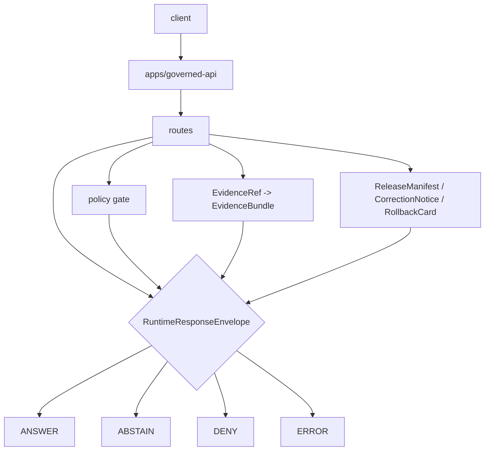

<!-- [KFM_META_BLOCK_V2]
doc_id: kfm://app/governed-api/routes/readme
title: Governed API Routes README
type: app-readme
version: v0.1
status: draft
owners: OWNER_TBD — API steward · Route steward · Policy steward · Evidence steward · Release steward · Runtime steward · Docs steward
created: 2026-06-16
updated: 2026-06-16
policy_label: public
related:
  - ../README.md
  - ../../README.md
  - ../../explorer-web/README.md
  - ../../../docs/adr/ADR-0004-apps-governed-api-is-the-trust-membrane.md
  - ../../../schemas/contracts/v1/runtime/
  - ../../../contracts/runtime/
  - ../../../policy/access/README.md
  - ../../../policy/decision/README.md
  - ../../../packages/evidence-resolver/README.md
  - ../../../packages/policy-runtime/README.md
  - ../../../runtime/README.md
  - ../../../release/README.md
  - ../../../data/README.md
  - ./domains/README.md
tags: [kfm, apps, governed-api, routes, trust-membrane, runtime-response-envelope, finite-outcomes, evidencebundle, policydecision, release-manifest]
notes:
  - "Replaces an empty routes README with a governed-api route-tree contract."
  - "This path organizes app-local route families only; it is not a schema, contract, policy, data, release, package, runtime, or UI authority root."
  - "Route handlers, DTOs, middleware, schemas, tests, fixtures, policy enforcement, deployment state, logs, dashboards, and CI pass state remain NEEDS VERIFICATION."
[/KFM_META_BLOCK_V2] -->

<a id="top"></a>

<div align="center">

# Governed API Routes

`apps/governed-api/routes/`

**App-local route tree for the Governed API trust membrane: runtime bootstrap, domain projections, layer metadata, evidence resolution, Focus, Story, Compare, Export, review retrieval, corrections, diagnostics, and every other trust-bearing request family that must return finite governed envelopes.**


[Purpose](#1-purpose) · [Repo fit](#2-repo-fit) · [Boundary](#3-authority-boundary) · [Inputs](#5-inputs) · [Exclusions](#6-exclusions) · [Route map](#7-route-family-map) · [Definition of done](#14-definition-of-done)

</div>

---

> [!IMPORTANT]
> **Status:** draft / `NEEDS VERIFICATION`  
> **Owners:** `OWNER_TBD` — API steward · Route steward · Policy steward · Evidence steward · Release steward · Runtime steward · Docs steward  
> **Path:** `apps/governed-api/routes/README.md`  
> **Responsibility root:** `apps/` — deployable application surfaces  
> **Truth posture:** CONFIRMED README path / CONFIRMED governed-api trust-membrane doctrine / CONFIRMED `routes/domains/README.md` presence / PROPOSED route-tree contract / UNKNOWN route handlers, DTOs, middleware, schemas, tests, fixtures, runtime behavior, deployment state, and CI pass state

> [!CAUTION]
> Route folders are not authority roots. Route code may enforce and project governed decisions, but schemas belong under `schemas/`, object meaning belongs under `contracts/`, policy belongs under `policy/`, lifecycle artifacts belong under `data/`, release decisions belong under `release/`, reusable helpers belong under `packages/`, and runtime adapters remain behind the governed API boundary.

---

## Quick jump

- [1. Purpose](#1-purpose)
- [2. Repo fit](#2-repo-fit)
- [3. Authority boundary](#3-authority-boundary)
- [4. Default posture](#4-default-posture)
- [5. Inputs](#5-inputs)
- [6. Exclusions](#6-exclusions)
- [7. Route family map](#7-route-family-map)
- [8. Diagram](#8-diagram)
- [9. Runtime outcome contract](#9-runtime-outcome-contract)
- [10. Route obligations](#10-route-obligations)
- [11. Inspection path](#11-inspection-path)
- [12. Validation expectations](#12-validation-expectations)
- [13. Safe change pattern](#13-safe-change-pattern)
- [14. Definition of done](#14-definition-of-done)
- [15. Open verification items](#15-open-verification-items)

---

## 1. Purpose

`apps/governed-api/routes/` is the proposed app-local route tree for `apps/governed-api/`.

It may eventually contain route-family modules and child READMEs for:

- runtime bootstrap and shell state;
- domain-specific governed projections;
- layer catalog and descriptor projections;
- EvidenceRef-to-EvidenceBundle resolution;
- Focus and AI-assisted finite responses;
- Story manifests and StoryNode projections;
- Compare and Export requests;
- review retrieval and role-gated steward payloads;
- correction, rollback, stale-state, and release lookups;
- safe diagnostics.

This directory is not proof that any route handler, DTO, middleware, schema, fixture, policy gate, authorization guard, test, deployment, log, dashboard, or CI pass state exists.

[Back to top](#top)

---

## 2. Repo fit

| Concern | Owning root | Expected relationship |
|---|---|---|
| Route tree | `apps/governed-api/routes/` | App-local route family organization |
| Governed API app | `apps/governed-api/` | Trust membrane and finite envelope API surface |
| Domain route families | `apps/governed-api/routes/domains/` | Domain route parent; implementation still `NEEDS VERIFICATION` |
| Runtime schemas | `schemas/contracts/v1/runtime/` | Machine shape for runtime envelopes |
| Runtime contracts | `contracts/runtime/` | Object meaning and envelope semantics |
| Policy support | `policy/`, `packages/policy-runtime/` | Access, sensitivity, rights, release, and decision policy |
| Evidence support | `packages/evidence-resolver/`, `data/proofs/` | EvidenceBundle support behind the membrane |
| Release authority | `release/` | Release decisions, correction notices, rollback cards |
| Lifecycle artifacts | `data/` | Source lifecycle, receipts, proofs, registry, catalog, triplets, and published outputs |
| Runtime adapters | `runtime/` | Adapter lane behind governed API |
| Client UI | `apps/explorer-web/` | Consumer of governed route responses, not route authority |

## 3. Authority boundary

This folder organizes governed API route families. It does not own schema authority, contract authority, policy authorship, EvidenceBundle authorship, release authority, lifecycle storage, source acquisition, renderer behavior, UI rendering, audit truth, or AI output.

```text
apps/governed-api/routes/ = app-local route tree
apps/governed-api/        = trust membrane and finite envelope API
schemas/contracts/v1/     = machine shape
contracts/                = object meaning
policy/                   = policy rules and policy documentation
data/                     = lifecycle artifacts, receipts, proofs, registries
release/                  = publication, correction, rollback authority
packages/                 = reusable helpers
runtime/                  = adapters behind governed API
apps/explorer-web/        = client UI consumer
```

## 4. Default posture

Route families should fail closed. A route should not return `ANSWER` when any of these are unresolved:

- request schema and route action;
- caller role and authorization context;
- endpoint policy;
- EvidenceRef-to-EvidenceBundle support for claim-bearing responses;
- release manifest, correction, rollback, review, stale, or freshness state where material;
- source role, rights, sensitivity, redaction, generalization, or transform receipt where material;
- citation validation and limitation fields;
- server-side adapter constraints for AI-assisted responses;
- response-envelope validation;
- audit-safe request and decision references.

## 5. Inputs

| Input family | Examples | Required posture |
|---|---|---|
| Request context | route action, params, selected layer, evidence ref, feature ref, caller role | Schema-validated and bounded |
| Runtime envelope | `RuntimeResponseEnvelope`, `DecisionEnvelope`, reason codes, audit refs | Exactly one finite outcome |
| Evidence context | EvidenceRef, EvidenceBundle refs, source roles, citations, limitations | Resolver behind governed API |
| Policy context | role, rights, sensitivity, release, stale-state, transform requirement | Policy gate required |
| Release context | release manifest, correction notice, rollback card, artifact digest | Required where response depends on released artifacts |
| Domain context | domain slug, object family, candidate/confirmed status, cross-domain refs | Domain-owned or explicitly referenced |
| Runtime context | server-side adapter result, Focus response, AIReceipt ref | Behind membrane; never direct browser call |
| Error context | schema failure, policy denial, missing evidence, stale support, adapter fault | Safe reason code only |

## 6. Exclusions

| Does not belong here | Correct home |
|---|---|
| Governed API app-level contract | `apps/governed-api/README.md` |
| Domain doctrine and scope | `docs/domains/<domain>/` |
| Policy rules or policy bundles | `policy/` |
| Schemas and contracts | `schemas/contracts/v1/`, `contracts/` |
| Source data, lifecycle artifacts, receipts, proofs, registry, catalog, triplets, published outputs | `data/` |
| Release decisions, correction notices, rollback cards | `release/` |
| Source acquisition and ingest adapters | `connectors/`, `pipelines/`, `pipeline_specs/` |
| Shared route helpers reusable across apps | `packages/` after extraction and review |
| Public UI rendering | `apps/explorer-web/` |
| Steward/admin UI rendering | `apps/review-console/`, `apps/admin/` |
| Direct public lifecycle/canonical reads | Forbidden; use finite governed envelopes |
| Direct public runtime/model calls | Forbidden; use governed server-side adapters only |
| Sensitive details in logs, errors, telemetry, or public payloads | Forbidden unless a reviewed, bounded, release-approved transform explicitly allows them |

## 7. Route family map

Exact route files and implementation status remain `NEEDS VERIFICATION`.

| Route family | Purpose | Required safeguard | Status |
|---|---|---|---|
| `runtime/` or `runtime/bootstrap` | Shell/bootstrap state and route availability | No client authority; finite envelope | PROPOSED |
| `domains/` | Domain-specific governed projections | Domain policy, evidence, release, and transform gates | CONFIRMED README path / implementation UNKNOWN |
| `layers/` | Layer catalog, descriptors, legends, release manifest summaries | Released/bounded-safe only | PROPOSED |
| `evidence/` | EvidenceRef resolution and EvidenceDrawerPayload projection | EvidenceBundle support and policy | PROPOSED |
| `focus/` | Governed AI/Focus answer path | Server-side adapter, cite-or-abstain | PROPOSED |
| `story/` | Story manifest/node/evidence-gate projection | 2D-first, evidence continuity | PROPOSED |
| `compare/` | Compare releases, times, layers, or versions | Provenance and finite states | PROPOSED |
| `exports/` | Safe export requests and receipt-linked artifacts | No uncited export | PROPOSED |
| `review/` | Role-gated read-only/steward review payloads | Audited and policy-gated | PROPOSED |
| `corrections/` | Correction notice, supersession, rollback lookup | Release-lineage refs required | PROPOSED |
| `diagnostics/` | Safe version/envelope/layer/route diagnostics | No internal detail leakage | PROPOSED |

> [!WARNING]
> Candidate route names are not implementation proof. Do not document a route as live until files, tests, schemas, fixtures, policy gates, middleware, authorization, and deployment evidence confirm it.

## 8. Diagram



## 9. Runtime outcome contract

Every trust-bearing route response should resolve to exactly one runtime status.

| Status | Meaning | Route posture |
|---|---|---|
| `ANSWER` | Safe, released, evidence-backed, policy-supported response exists | Include evidence, policy, release, transform, limitation, and citation refs where material |
| `ABSTAIN` | Evidence, review, freshness, source role, narrowing support, or scope is insufficient | Explain the held reason without fabricating an answer |
| `DENY` | Policy, rights, sensitivity, role, review, release, or exposure risk blocks response | Avoid leaking blocked material |
| `ERROR` | Schema, adapter, resolver, or infrastructure fault prevents reliable response | Return audit-safe fault reference only |

## 10. Route obligations

| Obligation | Example effect |
|---|---|
| `governed_membrane_only` | Trust-bearing payloads cross `apps/governed-api/` |
| `finite_outcomes_required` | No silent partial, unlabeled hold, or untyped refusal |
| `policy_required` | Sensitivity, rights, review, release, and transform obligations are checked |
| `evidence_required` | Claim-bearing `ANSWER` requires EvidenceBundle support |
| `source_role_required` | Source authority and limitations travel with the response |
| `release_refs_required` | Released public artifacts carry release/correction/rollback refs where material |
| `transform_receipt_required` | Redaction/generalization/delay/aggregation must be receipt-backed where used |
| `safe_error_only` | Errors do not expose protected details or internal route/resolver state |
| `no_parallel_authority` | Route folders do not redefine domain, policy, schema, contract, data, or release authority |
| `auditability_required` | Request, decision, release, evidence, and transform refs support later review |

## 11. Inspection path

Route handlers, DTOs, middleware, schemas, fixtures, tests, policy integration, authorization, safe-error behavior, logs, dashboards, deployment state, and emitted artifacts remain `NEEDS VERIFICATION`.

```bash
find apps/governed-api/routes -maxdepth 6 -type f | sort
find apps/governed-api runtime packages schemas contracts policy release data tests fixtures .github/workflows -maxdepth 6 -type f 2>/dev/null | grep -Ei 'RuntimeResponseEnvelope|DecisionEnvelope|EvidenceBundle|EvidenceRef|PolicyDecision|ReleaseManifest|CorrectionNotice|RollbackCard|RedactionReceipt|ReviewRecord|SensitivityTransform|runtime.?bootstrap|domains|layers|evidence|focus|story|export|review|correction|diagnostic|abstain|deny|error|route|test|fixture' | sort
```

## 12. Validation expectations

Useful validation for this route tree should cover:

- every trust-bearing route returns exactly one `ANSWER`, `ABSTAIN`, `DENY`, or `ERROR` status;
- unresolved review, rights, release, transform, sensitivity, or source-role posture fails closed;
- sensitive exact or protected details are denied unless a reviewed transform and release path explicitly allows a bounded response;
- candidate or inferred objects remain labeled and cannot become confirmed observations through route language;
- missing, stale, weak, conflicting, or unresolved evidence returns `ABSTAIN` rather than generated filler;
- policy denial returns `DENY` without blocked detail;
- schema, adapter, resolver, or infrastructure faults return `ERROR` with safe details only;
- response envelopes preserve evidence refs, policy decision refs, release refs, correction refs, rollback refs, citations, limitations, redactions, stale state, and reason codes where material.

## 13. Safe change pattern

For route-tree changes:

1. Add or update route inventory and route-family contract.
2. Link route DTOs to runtime and route-family schemas before changing response shape.
3. Add fixtures for `ANSWER`, `ABSTAIN`, `DENY`, `ERROR`, policy denial, missing evidence, stale evidence, unresolved review, transform missing, release missing, and safe error cases.
4. Add policy and safe-error tests before exposing any public route.
5. Preserve evidence refs, policy decision refs, release refs, correction refs, rollback refs, citations, limitations, redactions, stale state, and audit refs through every response.
6. Update this README, `apps/governed-api/README.md`, affected domain/feature docs, policy docs, schemas/contracts, and tests when route behavior materially changes.

## 14. Definition of done

- [ ] Owners are confirmed and `OWNER_TBD` is replaced.
- [ ] Route inventory and ownership are documented.
- [ ] Runtime envelope and route DTO/schema bindings are verified.
- [ ] Authorization, policy runtime, evidence resolver, release lookup, transform receipt, and audit hooks are documented and tested.
- [ ] Finite outcome fixtures cover `ANSWER`, `ABSTAIN`, `DENY`, and `ERROR`.
- [ ] Sensitive-detail denial tests are present and passing.
- [ ] Candidate/inferred-not-confirmed tests are present and passing.
- [ ] Missing-evidence and stale-evidence abstention tests are present and passing.
- [ ] Policy denial and domain-sensitive denial tests are present and passing.
- [ ] Safe-error tests are present and passing.

## 15. Open verification items

| Item | Why it matters |
|---|---|
| Confirm route handlers beyond READMEs | Prevents overclaiming runtime maturity |
| Confirm route DTOs and schemas | Required before route behavior claims |
| Confirm authorization and role resolution | Required before public/restricted split claims |
| Confirm policy runtime integration | Required before sensitivity/rights/release claims |
| Confirm evidence resolver integration | Required before EvidenceBundle closure claims |
| Confirm release/correction/rollback lookup | Required before publication-state claims |
| Confirm transform receipt handling | Required before redacted/generalized output claims |
| Confirm safe-error behavior | Required before public exposure |
| Confirm test and fixture coverage | Required before runtime maturity claims |
| Confirm deployment, logs, dashboards, and audit receipts | Required before operational claims |

<details>
<summary>Appendix A — no-loss preservation note</summary>

The previous README was empty. This replacement adds a bounded governed-api route-tree contract without claiming route handlers, DTOs, schemas, middleware, authorization, policy enforcement, evidence resolution, release lookup, transform receipt support, tests, fixtures, deployment, logs, dashboards, or CI pass state are implemented.

</details>

## Status summary

`apps/governed-api/routes/` should contain route-family modules and child READMEs only after route inventory, DTOs, schemas, authorization, policy runtime integration, evidence resolver integration, release/correction/rollback lookups, transform receipt support, safe-error behavior, finite-outcome fixtures, tests, and operational evidence are verified.

It must preserve the trust membrane and route-tree boundary: route folders may project governed finite envelopes, but they must not become schema authority, contract authority, policy authority, lifecycle storage, release authority, proof storage, domain doctrine, direct source access, or unsupported generated answer surfaces.

<p align="right"><a href="#top">Back to top</a></p>
