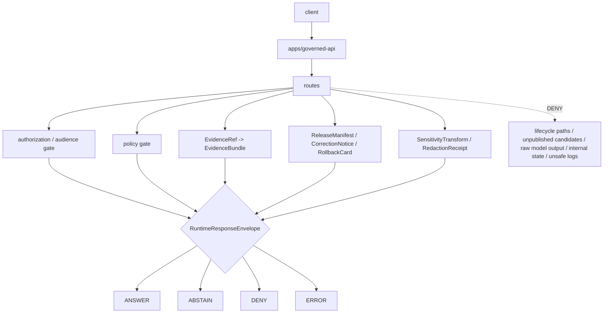

<!-- [KFM_META_BLOCK_V2]
doc_id: kfm://app/governed-api/routes/readme
title: Governed API Routes README
type: app-readme
version: v0.2
status: draft
owners: OWNER_TBD — API steward · Route steward · Policy steward · Evidence steward · Release steward · Runtime steward · Security steward · Privacy steward · Audit steward · Docs steward
created: 2026-06-16
updated: 2026-07-09
policy_label: public
related:
  - ../README.md
  - ../../README.md
  - ../../explorer-web/README.md
  - ../../../docs/doctrine/directory-rules.md
  - ../../../docs/adr/ADR-0004-apps-governed-api-is-the-trust-membrane.md
  - ../../../contracts/runtime/
  - ../../../contracts/runtime/runtime_response_envelope.md
  - ../../../schemas/contracts/v1/runtime/
  - ../../../policy/access/README.md
  - ../../../policy/decision/README.md
  - ../../../policy/telemetry/README.md
  - ../../../packages/evidence-resolver/README.md
  - ../../../packages/policy-runtime/README.md
  - ../../../runtime/README.md
  - ../../../release/README.md
  - ../../../data/README.md
  - ./domains/README.md
tags: [kfm, apps, governed-api, routes, trust-membrane, runtime-response-envelope, decision-envelope, finite-outcomes, evidencebundle, policydecision, release-manifest, safe-errors, route-tree]
notes:
  - "Refreshes the governed-api route-tree contract."
  - "This path organizes app-local route families only; it is not a schema, contract, policy, data, release, package, runtime, evidence, audit, or UI authority root."
  - "Route handlers, DTOs, middleware, schemas, tests, fixtures, authorization, policy enforcement, evidence resolution, release lookup, transform receipt support, safe logging, safe telemetry, deployment state, logs, dashboards, and CI pass state remain NEEDS VERIFICATION."
  - "policy/telemetry/README.md may be stub-level; executable telemetry policy wiring remains NEEDS VERIFICATION unless separately verified."
  - "v0.2 adds a current evidence basis, Directory Rules placement basis, minimum safe route slice, runtime anti-bypass matrix, stronger route-family map, safe-error/logging/telemetry gates, cache-key/diagnostic safeguards, and validation/definition-of-done gates without claiming runtime maturity."
[/KFM_META_BLOCK_V2] -->

<a id="top"></a>

<div align="center">

# Governed API Routes

`apps/governed-api/routes/`

**App-local route tree for the Governed API trust membrane: runtime bootstrap, domain projections, layer metadata, evidence resolution, Focus, Story, Compare, Export, review retrieval, corrections, diagnostics, and every other trust-bearing request family that must return finite governed envelopes without becoming an authority root.**


[Evidence](#0-evidence-basis-for-this-revision) · [Purpose](#1-purpose) · [Repo fit](#2-repo-fit) · [Boundary](#3-authority-boundary) · [Inputs](#5-inputs) · [Exclusions](#6-exclusions) · [Route map](#7-route-family-map) · [Minimum slice](#8-minimum-safe-route-slice) · [Definition of done](#16-definition-of-done)

</div>

---

> [!IMPORTANT]
> **Status:** draft / `NEEDS VERIFICATION`  
> **Owners:** `OWNER_TBD` — API steward · Route steward · Policy steward · Evidence steward · Release steward · Runtime steward · Security steward · Privacy steward · Audit steward · Docs steward  
> **Path:** `apps/governed-api/routes/README.md`  
> **Responsibility root:** `apps/` — deployable application surfaces  
> **Directory Rules basis:** governed API route code belongs under the deployable app root `apps/governed-api/`; `routes/` is an app-local route organization boundary, not a schema home, contract home, policy home, lifecycle-data lane, release authority, evidence store, proof store, audit store, package root, runtime adapter root, or UI surface.  
> **Truth posture:** CONFIRMED current GitHub README path / CONFIRMED governed-api trust-membrane README exists / CONFIRMED domain-route parent README exists / CONFIRMED archaeology child route README exists on `main` before the latest branch refresh / CONFIRMED Directory Rules document exists / PROPOSED route-tree contract / UNKNOWN route handlers, DTOs, middleware, schemas, tests, fixtures, authorization, policy runtime integration, evidence resolver integration, release lookup, transform receipt support, safe logging, safe telemetry, deployment state, dashboards, CI pass state, and runtime behavior

> [!CAUTION]
> Route folders are not authority roots. Route code may enforce and project governed decisions, but schemas belong under `schemas/`, object meaning belongs under `contracts/`, policy belongs under `policy/`, lifecycle artifacts belong under `data/`, release decisions belong under `release/`, reusable helpers belong under `packages/`, runtime adapters remain behind the governed API boundary, and public UI rendering belongs outside this route tree.

---

## Quick jump

- [0. Evidence basis for this revision](#0-evidence-basis-for-this-revision)
- [1. Purpose](#1-purpose)
- [2. Repo fit](#2-repo-fit)
- [3. Authority boundary](#3-authority-boundary)
- [4. Default posture](#4-default-posture)
- [5. Inputs](#5-inputs)
- [6. Exclusions](#6-exclusions)
- [7. Route family map](#7-route-family-map)
- [8. Minimum safe route slice](#8-minimum-safe-route-slice)
- [9. Diagram](#9-diagram)
- [10. Runtime outcome contract](#10-runtime-outcome-contract)
- [11. Route obligations](#11-route-obligations)
- [12. Runtime anti-bypass matrix](#12-runtime-anti-bypass-matrix)
- [13. Inspection path](#13-inspection-path)
- [14. Validation expectations](#14-validation-expectations)
- [15. Safe change pattern](#15-safe-change-pattern)
- [16. Definition of done](#16-definition-of-done)
- [17. Open verification items](#17-open-verification-items)

---

## 0. Evidence basis for this revision

This README is a documentation boundary, not runtime proof. The 2026-07-09 revision updates an existing README and keeps implementation maturity bounded while aligning the route tree with current repository evidence and the newer child-route README pattern.

| Evidence item | Status | What it supports | What it does not prove |
|---|---|---|---|
| `apps/governed-api/routes/README.md` exists on `main`. | CONFIRMED | This is an existing README update, not a new path proposal. | It does not prove route handlers, DTOs, middleware, schemas, fixtures, tests, deployment, logs, dashboards, or runtime behavior exist. |
| `apps/governed-api/README.md` exists and describes the app as the normal public trust path for finite governed envelopes. | CONFIRMED document presence and doctrine posture | Route families belong behind the Governed API trust membrane. | It does not prove route wiring or runtime enforcement. |
| `apps/governed-api/routes/domains/README.md` exists and describes domain routes as governed projections, not domain authorities. | CONFIRMED document presence and doctrine posture | The route tree may organize child route families but cannot absorb domain doctrine/policy/schema/release authority. | It does not prove child route implementation. |
| `apps/governed-api/routes/domains/archaeology/README.md` exists on `main` and sets a fail-closed archaeology route posture. | CONFIRMED child README presence before branch refresh | Child route families can add stricter domain-specific safeguards under this parent contract. | It does not prove archaeology route code or tests exist. |
| `docs/doctrine/directory-rules.md` exists and identifies root placement as ownership/lifecycle governance; `apps/` is the deployable implementation root. | CONFIRMED document presence and placement posture | `apps/governed-api/routes/` is an app-local route tree under the deployable API. | It does not prove the route tree is implemented or release-ready. |
| `policy/`, `schemas/contracts/v1/`, `contracts/`, `data/`, `release/`, `packages/`, and `runtime/` are referenced as separate authority roots in current route/app docs. | CONFIRMED from current repo docs | The route tree must project and enforce, not replace, those roots. | It does not prove concrete schemas, policies, packages, runtime adapters, or releases exist. |

[Back to top](#top)

---

## 1. Purpose

`apps/governed-api/routes/` is the proposed app-local route tree for `apps/governed-api/`.

It may eventually contain route-family modules and child READMEs for:

- runtime bootstrap and shell state;
- domain-specific governed projections;
- layer catalog and descriptor projections;
- EvidenceRef-to-EvidenceBundle resolution;
- Focus and AI-assisted finite responses;
- Story manifests and StoryNode projections;
- Compare and Export requests;
- read-only review retrieval and role-gated steward payloads;
- correction, rollback, stale-state, and release lookups;
- safe diagnostics;
- operationally safe health/version/envelope-shape probes.

This directory is not proof that any route handler, DTO, middleware, schema, fixture, policy gate, authorization guard, test, deployment, log, dashboard, CI pass state, or runtime behavior exists.

[Back to top](#top)

---

## 2. Repo fit

| Concern | Owning root | Expected relationship |
|---|---|---|
| Route tree | `apps/governed-api/routes/` | App-local route family organization |
| Governed API app | `apps/governed-api/` | Trust membrane and finite envelope API surface |
| Domain route families | `apps/governed-api/routes/domains/` | Domain route parent; implementation still `NEEDS VERIFICATION` |
| Runtime schemas | `schemas/contracts/v1/runtime/` | Machine shape for runtime envelopes |
| Runtime contracts | `contracts/runtime/` | Object meaning and envelope semantics |
| Domain schemas/contracts | `schemas/contracts/v1/domains/`, `contracts/domains/` | Domain-specific shapes and meanings, if present and accepted |
| Policy support | `policy/`, `packages/policy-runtime/` | Access, sensitivity, rights, release, and decision policy |
| Evidence support | `packages/evidence-resolver/`, `data/proofs/` | EvidenceBundle support behind the membrane |
| Release authority | `release/` | Release decisions, correction notices, rollback cards |
| Lifecycle artifacts | `data/` | Source lifecycle, receipts, proofs, registry, catalog, triplets, and published outputs |
| Runtime adapters | `runtime/` | Adapter lane behind governed API |
| Reusable route helpers | `packages/` | Shared helper code after extraction/review |
| Client UI | `apps/explorer-web/` | Consumer of governed route responses, not route authority |
| Review/admin UI | `apps/review-console/`, `apps/admin/` | Role-gated consumers where present and authorized |
| Tests and fixtures | `tests/`, `fixtures/` | Required before runtime maturity claims |
| CI workflows | `.github/workflows/` | Workflow presence/pass state must be verified separately |

## 3. Authority boundary

This folder organizes governed API route families. It does not own schema authority, contract authority, policy authorship, EvidenceBundle authorship, release authority, lifecycle storage, source acquisition, renderer behavior, UI rendering, review decisions, audit truth, proof storage, telemetry policy, runtime adapter authority, or AI output.

```text
apps/governed-api/routes/ = app-local route tree
apps/governed-api/        = trust membrane and finite envelope API
schemas/contracts/v1/     = machine shape
contracts/                = object meaning
policy/                   = policy rules and policy documentation
data/                     = lifecycle artifacts, receipts, proofs, registries
release/                  = publication, correction, rollback authority
packages/                 = reusable helpers
runtime/                  = adapters behind governed API
apps/explorer-web/        = client UI consumer
```

## 4. Default posture

Route families should fail closed. A route should not return `ANSWER` when any of these are unresolved:

- request schema, route action, and route ownership;
- caller role, session, audience, authorization context, and endpoint policy;
- EvidenceRef-to-EvidenceBundle support for claim-bearing responses;
- release manifest, correction, rollback, review, stale, or freshness state where material;
- source role, rights, sensitivity, redaction, generalization, delay, aggregation, suppression, or transform receipt where material;
- citation validation, limitation fields, and source authority posture;
- server-side adapter constraints for AI-assisted responses;
- no-chain-of-thought and direct-model-output restrictions;
- response-envelope validation;
- cache-key, logging, metrics, telemetry, and diagnostics safety;
- audit-safe request, decision, evidence, release, policy, and transform references.

## 5. Inputs

| Input family | Examples | Required posture |
|---|---|---|
| Request context | route action, params, selected layer, evidence ref, feature ref, caller role, audience | Schema-validated and bounded |
| Runtime envelope | `RuntimeResponseEnvelope`, `DecisionEnvelope`, reason codes, audit refs | Exactly one finite outcome |
| Evidence context | EvidenceRef, EvidenceBundle refs, source roles, citations, limitations | Resolver behind governed API |
| Policy context | role, rights, sensitivity, release, stale-state, transform requirement | Policy gate required |
| Release context | release manifest, correction notice, rollback card, artifact digest, stale/freshness state | Required where response depends on released artifacts |
| Domain context | domain slug, object family, candidate/confirmed status, cross-domain refs | Domain-owned or explicitly referenced |
| Runtime context | server-side adapter result, Focus response, AIReceipt ref | Behind membrane; never direct browser call |
| Export/review context | export scope, redaction profile, review state, queue/detail refs | Policy-gated and audit-safe |
| Diagnostics context | build/version/envelope/route/layer status | No secrets or internal path leakage |
| Error context | schema failure, policy denial, missing evidence, stale support, adapter fault | Safe reason code only |
| Observability context | request id, decision id, latency bucket, route family, outcome | No raw evidence, restricted geometry, prompts, model output, secrets, or blocked payloads |

## 6. Exclusions

| Does not belong here | Correct home |
|---|---|
| Governed API app-level contract | `apps/governed-api/README.md` |
| Domain doctrine and scope | `docs/domains/<domain>/` |
| Policy rules or policy bundles | `policy/` |
| Schemas and contracts | `schemas/contracts/v1/`, `contracts/` |
| Source data, lifecycle artifacts, receipts, proofs, registry, catalog, triplets, published outputs | `data/` |
| Release decisions, correction notices, rollback cards | `release/` |
| Source acquisition and ingest adapters | `connectors/`, `pipelines/`, `pipeline_specs/` |
| Shared route helpers reusable across apps | `packages/` after extraction and review |
| Runtime adapter ownership | `runtime/` behind governed API |
| Public UI rendering | `apps/explorer-web/` |
| Steward/admin UI rendering | `apps/review-console/`, `apps/admin/` |
| Review decision recording unless explicitly authorized by a dedicated mutating route family | Governed review/correction workflows, not generic public routes |
| Direct public lifecycle/canonical reads | Forbidden; use finite governed envelopes |
| Direct public runtime/model calls | Forbidden; use governed server-side adapters only |
| Raw prompts, chain-of-thought, model-provider traces, internal adapter state, internal paths, stack traces | Forbidden from public route payloads |
| Sensitive details in logs, errors, telemetry, cache keys, diagnostics, or public payloads | Forbidden unless a reviewed, bounded, release-approved transform explicitly allows them |

## 7. Route family map

Exact route files and implementation status remain `NEEDS VERIFICATION`.

| Route family | Purpose | Required safeguard | Status |
|---|---|---|---|
| `runtime/` or `runtime/bootstrap` | Shell/bootstrap state and route availability | No client authority; finite envelope | PROPOSED |
| `domains/` | Domain-specific governed projections | Domain policy, evidence, release, and transform gates | CONFIRMED README path / implementation UNKNOWN |
| `layers/` | Layer catalog, descriptors, legends, release manifest summaries | Released/bounded-safe only | PROPOSED |
| `evidence/` | EvidenceRef resolution and EvidenceDrawerPayload projection | EvidenceBundle support and policy | PROPOSED |
| `focus/` | Governed AI/Focus answer path | Server-side adapter, cite-or-abstain, no raw model truth | PROPOSED |
| `story/` | Story manifest/node/evidence-gate projection | 2D-first, evidence continuity, finite node outcomes | PROPOSED |
| `compare/` | Compare releases, times, layers, or versions | Provenance and finite states | PROPOSED |
| `exports/` | Safe export requests and receipt-linked artifacts | No uncited export; redaction/rights/release checks | PROPOSED |
| `review/` | Role-gated read-only/steward review payloads | Audited and policy-gated; mutation route must be explicit | PROPOSED |
| `corrections/` | Correction notice, supersession, rollback lookup | Release-lineage refs required | PROPOSED |
| `diagnostics/` | Safe version/envelope/layer/route diagnostics | No internal detail or secret leakage | PROPOSED |
| `health/` or `status/` | Liveness/readiness/envelope-shape checks | No policy/evidence/source data leakage | PROPOSED |

> [!WARNING]
> Candidate route names are not implementation proof. Do not document a route as live until files, tests, schemas, fixtures, policy gates, middleware, authorization, deployment evidence, and safe operational telemetry confirm it.

## 8. Minimum safe route slice

A smallest useful route-tree slice should prove finite envelopes and trust-membrane denial before adding full route breadth.

| Slice item | Minimum requirement | Why it is required |
|---|---|---|
| Route inventory | Every route family has owner, route action, request shape, response shape, finite outcomes, and handoffs | Prevents hidden endpoints and authority drift |
| Envelope parser/builder | Every trust-bearing route emits a validated runtime envelope | Prevents malformed data becoming client truth |
| Authorization gate | Caller role/audience is checked before any sensitive branch | Prevents public/restricted collapse |
| Policy gate | Access, rights, sensitivity, release, review, and transform obligations are evaluated or safely held | Preserves policy authority |
| Evidence gate | Claim-bearing `ANSWER` requires EvidenceBundle/citation support | Enforces cite-or-abstain |
| Release gate | Public-safe responses carry release/correction/rollback refs where material | Preserves publication/reversibility |
| Transform gate | Redaction/generalization/delay/aggregation/suppression uses receipt-backed transform state | Prevents untracked sensitivity edits |
| Safe-error guard | Errors expose only audit-safe fault refs and reason codes | Prevents stack/internal leakage |
| Safe observability guard | Logs, metrics, cache keys, diagnostics, and telemetry contain no blocked payloads | Prevents side-channel disclosure |
| No-direct-store guard | Routes do not expose lifecycle paths, canonical store handles, unpublished candidates, or direct file references | Preserves trust membrane |
| No-browser-model guard | Public clients never invoke models directly; route adapters stay server-side | Preserves governed AI boundary |

This slice is still `PROPOSED` until files, fixtures, tests, route wiring, middleware, and accepted contracts are verified.

## 9. Diagram



## 10. Runtime outcome contract

Every trust-bearing route response should resolve to exactly one runtime status.

| Status | Meaning | Route posture |
|---|---|---|
| `ANSWER` | Safe, released, evidence-backed, policy-supported response exists | Include evidence, policy, release, transform, limitation, citation, audit, and rollback refs where material |
| `ABSTAIN` | Evidence, review, freshness, source role, narrowing support, or scope is insufficient | Explain the held reason without fabricating an answer or leaking blocked detail |
| `DENY` | Policy, rights, sensitivity, role, review, release, or exposure risk blocks response | Return safe reason code and deny metadata only |
| `ERROR` | Schema, adapter, resolver, or infrastructure fault prevents reliable response | Return audit-safe fault reference only; no stack traces or internals |

## 11. Route obligations

| Obligation | Example effect |
|---|---|
| `governed_membrane_only` | Trust-bearing payloads cross `apps/governed-api/` |
| `finite_outcomes_required` | No silent partial, unlabeled hold, or untyped refusal |
| `authorization_required` | Caller role, audience, and endpoint authorization are evaluated before response building |
| `policy_required` | Sensitivity, rights, review, release, and transform obligations are checked |
| `evidence_required` | Claim-bearing `ANSWER` requires EvidenceBundle support |
| `source_role_required` | Source authority and limitations travel with the response |
| `release_refs_required` | Released public artifacts carry release/correction/rollback refs where material |
| `transform_receipt_required` | Redaction/generalization/delay/aggregation/suppression must be receipt-backed where used |
| `safe_error_only` | Errors do not expose protected details, stack traces, internal route/resolver state, or filesystem paths |
| `safe_observability_only` | Logs, metrics, telemetry, diagnostics, and cache keys never carry blocked payloads |
| `no_parallel_authority` | Route folders do not redefine domain, policy, schema, contract, data, release, evidence, package, or runtime authority |
| `auditability_required` | Request, decision, release, evidence, policy, and transform refs support later review |

## 12. Runtime anti-bypass matrix

| Bypass risk | Required behavior | Review signal |
|---|---|---|
| Route emits payload outside runtime envelope | Deny or return `ERROR`; all trust-bearing responses use finite envelope | Envelope-shape fixture blocks raw payload |
| Public route reads lifecycle/canonical store directly | Deny at review/build/test; route through governed resolver/adapter | Import/fetch scan blocks direct data roots and file paths |
| Claim-bearing response lacks EvidenceBundle/citation support | Return `ABSTAIN` | Missing-evidence fixture cannot render claim payload |
| Policy denial leaks blocked detail | Return `DENY` with safe reason only | Denial fixture excludes sensitive payload and exposure hints |
| Adapter/runtime fault leaks stack trace/internal path | Return `ERROR` with audit-safe fault ref | Safe-error fixture excludes internals |
| Cache key/log/metric/telemetry captures sensitive payload | Hash/generalize or omit; never include raw evidence, prompts, geometry, secrets, model outputs, or blocked fields | Observability fixture verifies redaction |
| Candidate/inferred object becomes confirmed through route language | Preserve candidate/inferred status until evidence/review promotes it | Candidate fixture checks language and status |
| Review mutation happens through generic route family | Deny; mutating review route must be explicit, role-gated, audited, and documented | Route inventory separates read-only and mutating paths |
| AI-assisted route returns raw model text | Use governed Focus/runtime envelope with citations and finite outcome | No raw model fallback fixture passes |
| Route folder redefines schema/policy/release authority | Move authority material to owning root | Review checks no parallel root content |

## 13. Inspection path

Route handlers, DTOs, middleware, schemas, fixtures, tests, policy integration, authorization, safe-error behavior, safe logging/telemetry, caches, dashboards, deployment state, emitted artifacts, and child route maturity remain `NEEDS VERIFICATION`.

```bash
find apps/governed-api/routes -maxdepth 6 -type f | sort
find apps/governed-api runtime packages schemas contracts policy release data tests fixtures .github/workflows -maxdepth 6 -type f 2>/dev/null | grep -Ei 'RuntimeResponseEnvelope|DecisionEnvelope|EvidenceBundle|EvidenceRef|PolicyDecision|ReleaseManifest|CorrectionNotice|RollbackCard|RedactionReceipt|ReviewRecord|SensitivityTransform|runtime.?bootstrap|domains|layers|evidence|focus|story|export|review|correction|diagnostic|health|status|abstain|deny|error|route|middleware|auth|authorization|telemetry|metric|cache|test|fixture' | sort
```

## 14. Validation expectations

Useful validation for this route tree should cover:

- every trust-bearing route returns exactly one `ANSWER`, `ABSTAIN`, `DENY`, or `ERROR` status;
- unresolved review, rights, release, transform, sensitivity, role, authorization, or source-role posture fails closed;
- sensitive exact or protected details are denied unless a reviewed transform and release path explicitly allows a bounded response;
- candidate or inferred objects remain labeled and cannot become confirmed observations through route language;
- missing, stale, weak, conflicting, or unresolved evidence returns `ABSTAIN` rather than generated filler;
- policy denial returns `DENY` without blocked detail;
- schema, adapter, resolver, or infrastructure faults return `ERROR` with safe details only;
- response envelopes preserve evidence refs, policy decision refs, release refs, correction refs, rollback refs, citations, limitations, redactions, stale state, transform refs, and reason codes where material;
- logs, metrics, telemetry, cache keys, diagnostics, and error refs do not include raw evidence, restricted geometry, prompts, model output, secrets, stack traces, internal handles, or blocked payloads;
- read-only routes cannot mutate review, release, evidence, policy, or lifecycle state;
- AI-assisted routes cannot return raw model output, chain-of-thought, or provider traces.

## 15. Safe change pattern

For route-tree changes:

1. Add or update route inventory and route-family contract.
2. Link route DTOs to runtime and route-family schemas before changing response shape.
3. Add fixtures for `ANSWER`, `ABSTAIN`, `DENY`, `ERROR`, policy denial, missing evidence, stale evidence, unresolved review, transform missing, release missing, safe error, unsafe logging, unsafe telemetry, unsafe cache key, candidate-not-confirmed, unauthorized caller, and read-only mutation denied cases.
4. Add policy, authorization, safe-error, safe-observability, evidence, release, and transform tests before exposing any public route.
5. Preserve evidence refs, policy decision refs, release refs, correction refs, rollback refs, citations, limitations, redactions, stale state, transform refs, and audit refs through every response.
6. Update this README, `apps/governed-api/README.md`, affected route-family READMEs, affected domain/feature docs, policy docs, schemas/contracts, fixtures, and tests when route behavior materially changes.

## 16. Definition of done

- [ ] Owners are confirmed and `OWNER_TBD` is replaced.
- [ ] Evidence basis is refreshed when parent API docs, child route READMEs, schemas, contracts, policy, evidence resolver, release, runtime, fixtures, tests, workflow, telemetry, or deployment evidence changes.
- [ ] Route inventory and ownership are documented.
- [ ] Runtime envelope and route DTO/schema bindings are verified.
- [ ] Authorization, policy runtime, evidence resolver, release lookup, transform receipt, and audit hooks are documented and tested.
- [ ] Finite outcome fixtures cover `ANSWER`, `ABSTAIN`, `DENY`, and `ERROR`.
- [ ] Sensitive-detail denial tests are present and passing.
- [ ] Candidate/inferred-not-confirmed tests are present and passing.
- [ ] Missing-evidence and stale-evidence abstention tests are present and passing.
- [ ] Policy denial and domain-sensitive denial tests are present and passing.
- [ ] Safe-error tests are present and passing.
- [ ] Safe logging, metrics, telemetry, cache-key, diagnostics, and observability tests are present and passing.
- [ ] Read-only vs mutating route boundaries are documented and tested.
- [ ] AI-assisted route no-raw-model-output and no-chain-of-thought tests are present and passing.

## 17. Open verification items

| Item | Why it matters |
|---|---|
| Confirm route handlers beyond READMEs | Prevents overclaiming runtime maturity |
| Confirm route DTOs and schemas | Required before route behavior claims |
| Confirm authorization and role resolution | Required before public/restricted split claims |
| Confirm policy runtime integration | Required before sensitivity/rights/release claims |
| Confirm evidence resolver integration | Required before EvidenceBundle closure claims |
| Confirm release/correction/rollback lookup | Required before publication-state claims |
| Confirm transform receipt handling | Required before redacted/generalized output claims |
| Confirm safe-error behavior | Required before public exposure |
| Confirm safe logging, metrics, telemetry, cache-key, and diagnostics behavior | Required to prevent side-channel leakage |
| Confirm test and fixture coverage | Required before runtime maturity claims |
| Confirm child route README status on `main` | Required before parent doc claims child maturity |
| Confirm deployment, logs, dashboards, and audit receipts | Required before operational claims |
| Confirm CI workflow presence and latest pass state | Required before CI claims |

<details>
<summary>Appendix A — no-loss preservation note</summary>

The previous README already contained a bounded governed-api route-tree contract. This revision preserves that contract, refreshes metadata, adds a current evidence-basis section, adds Directory Rules placement posture, strengthens route-family inventory, minimum route slice, finite-envelope, authorization, policy, evidence, release, transform, safe-error, safe logging/telemetry/cache, read-only/mutation, AI-boundary, and anti-bypass safeguards, and keeps implementation claims bounded. It does not claim route handlers, DTOs, schemas, middleware, authorization, policy enforcement, evidence resolution, release lookup, transform receipt support, tests, fixtures, deployment, logs, dashboards, telemetry, or CI pass state are implemented.

</details>

## Status summary

`apps/governed-api/routes/` should contain route-family modules and child READMEs only after route inventory, DTOs, schemas, authorization, policy runtime integration, evidence resolver integration, release/correction/rollback lookups, transform receipt support, safe-error behavior, safe logging/telemetry/cache behavior, finite-outcome fixtures, tests, and operational evidence are verified.

It must preserve the trust membrane and route-tree boundary: route folders may project governed finite envelopes, but they must not become schema authority, contract authority, policy authority, lifecycle storage, release authority, proof storage, domain doctrine, direct source access, raw model-output surfaces, unsafe observability channels, or unsupported generated answer surfaces.

<p align="right"><a href="#top">Back to top</a></p>
