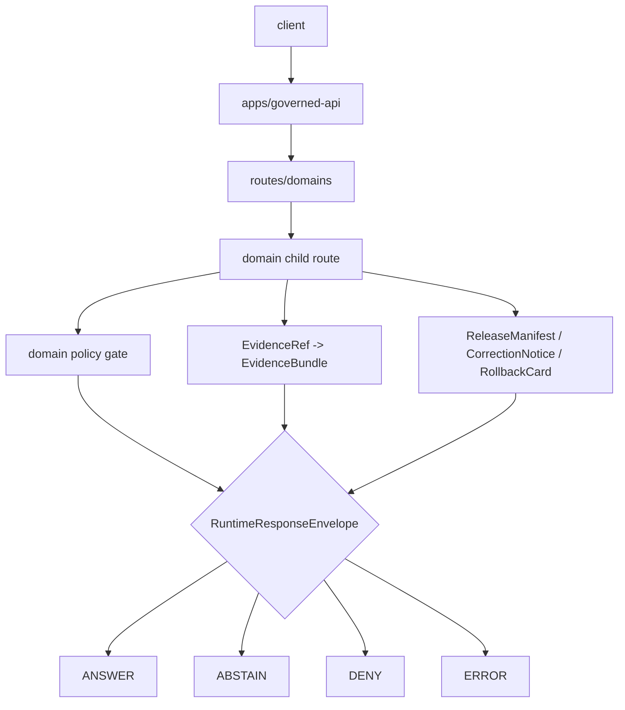

<!-- [KFM_META_BLOCK_V2]
doc_id: kfm://app/governed-api/routes/domains/readme
title: Governed API Domain Routes README
type: app-readme
version: v0.1
status: draft
owners: OWNER_TBD — API steward · Domain stewards · Policy steward · Evidence steward · Release steward · Runtime steward · Docs steward
created: 2026-06-16
updated: 2026-06-16
policy_label: public
related:
  - ../../README.md
  - ../../../README.md
  - ../../../explorer-web/README.md
  - ../../../../docs/adr/ADR-0004-apps-governed-api-is-the-trust-membrane.md
  - ../../../../docs/domains/README.md
  - ../../../../docs/domains/archaeology/README.md
  - ../../../../policy/domains/README.md
  - ../../../../policy/domains/archaeology/README.md
  - ../../../../schemas/contracts/v1/runtime/
  - ../../../../schemas/contracts/v1/domains/
  - ../../../../contracts/domains/
  - ../../../../data/README.md
  - ../../../../release/README.md
tags: [kfm, apps, governed-api, routes, domains, trust-membrane, finite-outcomes, evidencebundle, policydecision, release-manifest]
notes:
  - "Replaces an empty domain-routes README with a governed-api parent route-family contract."
  - "This path is an app-local API route organization boundary, not a domain doctrine root, schema root, policy root, lifecycle root, release root, or proof root."
  - "Child route handlers, DTOs, middleware, schemas, tests, fixtures, policy enforcement, deployment state, logs, dashboards, and CI pass state remain NEEDS VERIFICATION."
[/KFM_META_BLOCK_V2] -->

<a id="top"></a>

<div align="center">

# Governed API Domain Routes

`apps/governed-api/routes/domains/`

**App-local parent boundary for domain-specific governed API route families. Domain routes cross the trust membrane, return finite runtime outcomes, preserve EvidenceBundle / PolicyDecision / ReleaseManifest references, and keep domain-specific sensitivity rules behind governed envelopes.**


[Purpose](#1-purpose) · [Repo fit](#2-repo-fit) · [Boundary](#3-authority-boundary) · [Inputs](#5-inputs) · [Exclusions](#6-exclusions) · [Child route map](#7-child-route-map) · [Definition of done](#14-definition-of-done)

</div>

---

> [!IMPORTANT]
> **Status:** draft / `NEEDS VERIFICATION`  
> **Owners:** `OWNER_TBD` — API steward · Domain stewards · Policy steward · Evidence steward · Release steward · Runtime steward · Docs steward  
> **Path:** `apps/governed-api/routes/domains/README.md`  
> **Responsibility root:** `apps/` — deployable application surfaces  
> **Truth posture:** CONFIRMED README path / CONFIRMED governed-api trust-membrane doctrine / CONFIRMED archaeology child README presence / PROPOSED parent route-family contract / UNKNOWN route handlers, DTOs, middleware, schemas, tests, fixtures, runtime behavior, deployment state, and CI pass state

> [!CAUTION]
> Domain routes are not domain authorities. They may project domain-specific governed responses, but domain doctrine belongs under `docs/domains/`, policy belongs under `policy/domains/`, machine shape belongs under `schemas/contracts/v1/domains/`, object meaning belongs under `contracts/domains/`, release decisions belong under `release/`, and lifecycle artifacts belong under `data/`.

---

## Quick jump

- [1. Purpose](#1-purpose)
- [2. Repo fit](#2-repo-fit)
- [3. Authority boundary](#3-authority-boundary)
- [4. Default posture](#4-default-posture)
- [5. Inputs](#5-inputs)
- [6. Exclusions](#6-exclusions)
- [7. Child route map](#7-child-route-map)
- [8. Diagram](#8-diagram)
- [9. Runtime outcome contract](#9-runtime-outcome-contract)
- [10. Domain route obligations](#10-domain-route-obligations)
- [11. Inspection path](#11-inspection-path)
- [12. Validation expectations](#12-validation-expectations)
- [13. Safe change pattern](#13-safe-change-pattern)
- [14. Definition of done](#14-definition-of-done)
- [15. Open verification items](#15-open-verification-items)

---

## 1. Purpose

`apps/governed-api/routes/domains/` is the proposed parent boundary for domain-specific route families inside `apps/governed-api/`.

It may eventually contain child directories and route-family READMEs for domain lanes such as archaeology, hydrology, habitat, fauna, flora, hazards, geology, soil, agriculture, atmosphere, roads/rail/trade, settlements/infrastructure, and people/DNA/land.

Domain routes should provide governed projections for public-safe or role-gated domain requests, including:

- domain object summaries;
- domain layer metadata and release-aware descriptors;
- evidence-backed detail projections;
- source-family and provenance summaries;
- policy, sensitivity, rights, and release-state responses;
- correction, rollback, and stale/freshness lookups;
- export eligibility checks;
- read-only review projections where allowed;
- safe denial, abstention, and error responses.

This directory is not proof that any route handler, DTO, middleware, schema, fixture, policy gate, authorization guard, test, deployment, log, dashboard, or CI pass state exists.

[Back to top](#top)

---

## 2. Repo fit

| Concern | Owning root | Expected relationship |
|---|---|---|
| Domain route parent | `apps/governed-api/routes/domains/` | Parent for app-local domain route families |
| Governed API app | `apps/governed-api/` | Trust membrane and finite envelope API surface |
| Domain doctrine | `docs/domains/<domain>/` | Human-facing domain scope and sensitivity posture |
| Domain policy | `policy/domains/<domain>/` | Domain-specific admissibility, deny, restrict, hold, and abstain rules |
| Domain schemas | `schemas/contracts/v1/domains/<domain>/` | Domain machine shape, if present and accepted |
| Domain contracts | `contracts/domains/<domain>/` | Domain object meaning, if present and accepted |
| Evidence support | `data/proofs/`, evidence resolver package | EvidenceBundle support behind governed API |
| Release authority | `release/` | Release decisions, correction, supersession, rollback |
| Lifecycle artifacts | `data/` | Source lifecycle, receipts, proofs, registry, catalog, triplets, and published outputs |

## 3. Authority boundary

This parent route folder may organize domain-specific governed API projections. It does not own domain doctrine, policy authorship, schema authority, contract authority, source admission, lifecycle storage, EvidenceBundle authorship, release approval, correction approval, rollback approval, reviewer decisions, renderer behavior, or AI output.

```text
apps/governed-api/routes/domains/ = app-local domain route-family parent
apps/governed-api/                = trust membrane and finite envelope API
docs/domains/                     = domain doctrine and sensitivity posture
policy/domains/                   = domain admissibility policy
schemas/contracts/v1/domains/     = domain machine shape, if accepted
contracts/domains/                = domain object meaning, if accepted
data/                             = lifecycle artifacts, receipts, proofs, registries
release/                          = publication, correction, rollback authority
```

## 4. Default posture

Domain routes should fail closed. A route should not return `ANSWER` when any of these are unresolved:

- caller role and endpoint authorization;
- domain slug and object-family ownership;
- domain-specific policy and sensitivity posture;
- source role, provenance, and source-rights posture;
- EvidenceRef-to-EvidenceBundle support;
- release manifest, rollback target, correction path, stale-state, or review state;
- citation validation and limitation fields;
- redaction, generalization, aggregation, or delayed-release transform support where material;
- response-envelope schema validation;
- audit-safe request/decision references.

## 5. Inputs

| Input family | Examples | Required posture |
|---|---|---|
| Request context | route action, domain slug, object id, layer id, evidence ref, map feature ref, user role | Schema-validated and bounded |
| Domain context | object family, domain constraints, candidate/confirmed status, cross-domain refs | Domain-owned or explicitly referenced |
| Evidence context | EvidenceRef, EvidenceBundle refs, source roles, citations, limitations | Resolver behind governed API |
| Policy context | rights, sensitivity, access role, audience, review state, transform requirement | Domain policy gate required |
| Release context | release manifest, correction notice, rollback card, artifact digest, stale state | Required for public-safe output |
| Transform context | redaction, generalization, delay, aggregation, withheld fields, transform receipt | Required when sensitive material is transformed |
| Runtime envelope | `RuntimeResponseEnvelope`, `DecisionEnvelope`, reason codes, audit refs | Exactly one finite outcome |
| Error context | schema failure, policy denial, missing evidence, stale support, adapter fault | Safe reason code only |

## 6. Exclusions

| Does not belong here | Correct home |
|---|---|
| Domain doctrine and scope | `docs/domains/<domain>/` |
| Domain policy rules or policy bundles | `policy/domains/<domain>/` and related policy roots |
| Domain schemas and contracts | `schemas/contracts/v1/domains/<domain>/`, `contracts/domains/<domain>/` |
| Source data, lifecycle artifacts, receipts, proofs, registry, catalog, triplets, published outputs | `data/` |
| Release decisions, correction notices, rollback cards | `release/` |
| Source acquisition and ingest adapters | `connectors/`, `pipelines/`, `pipeline_specs/` |
| Shared route helpers reusable across apps | `packages/` after extraction and review |
| Public UI rendering | `apps/explorer-web/` |
| Review decision recording | governed review routes and review governance, not ordinary public projection routes |
| Direct public lifecycle/canonical reads | Forbidden; use finite governed envelopes |
| Direct public runtime/model calls | Forbidden; use governed server-side adapters only |
| Sensitive details in logs, errors, telemetry, or public payloads | Forbidden unless a reviewed, bounded, release-approved transform explicitly allows them |

## 7. Child route map

Exact child route files and implementation status remain `NEEDS VERIFICATION`.

| Child route family | Purpose | Required safeguard | Status |
|---|---|---|---|
| `archaeology/` | Archaeology and cultural heritage projections | Exact/protected exposure denial and review gates | CONFIRMED README path / implementation UNKNOWN |
| `hydrology/` | Hydrology projections | Source role, flood/risk disclaimer, release and stale-state gates | PROPOSED |
| `habitat/` | Habitat projections | Sensitive ecological geometry and restoration-state gates | PROPOSED |
| `fauna/` | Fauna projections | Rare species, den/nest/roost/spawn redaction gates | PROPOSED |
| `flora/` | Flora projections | Rare plant and private-property exposure gates | PROPOSED |
| `hazards/` | Hazard projections | Not-for-life-safety and stale-state gates | PROPOSED |
| `geology/` | Geology/resource projections | Resource, ownership, claim, and hazard caveat gates | PROPOSED |
| `soil/` | Soil projections | Source-support, private-farm, and stale-state gates | PROPOSED |
| `agriculture/` | Agriculture projections | Producer/privacy/operations exposure gates | PROPOSED |
| `atmosphere/` | Atmosphere/air projections | Sensor freshness, uncertainty, and not-alerting gates | PROPOSED |
| `roads_rail_trade/` | Roads, rail, trade-route projections | Historical/current network distinction and safety disclaimers | PROPOSED |
| `settlements_infrastructure/` | Settlement and infrastructure projections | Critical-infrastructure precision gates | PROPOSED |
| `people_dna_land/` | People, genealogy, DNA, land projections | Living-person, DNA, consent, title, and parcel-boundary gates | PROPOSED |

> [!WARNING]
> Candidate child names are not implementation proof. Do not document a child route as live until files, tests, schemas, fixtures, policy gates, middleware, authorization, and deployment evidence confirm it.

## 8. Diagram



## 9. Runtime outcome contract

Every trust-bearing domain route response should resolve to exactly one runtime status.

| Status | Meaning | Domain route posture |
|---|---|---|
| `ANSWER` | Safe, released, evidence-backed, policy-supported response exists | Include evidence, policy, release, transform, limitation, and citation refs where material |
| `ABSTAIN` | Evidence, review, freshness, source role, narrowing support, or scope is insufficient | Explain the held reason without fabricating an answer |
| `DENY` | Policy, rights, sensitivity, role, review, release, or exposure risk blocks response | Avoid leaking blocked material |
| `ERROR` | Schema, adapter, resolver, or infrastructure fault prevents reliable response | Return audit-safe fault reference only |

## 10. Domain route obligations

| Obligation | Example effect |
|---|---|
| `governed_membrane_only` | Domain payloads cross `apps/governed-api/` |
| `finite_outcomes_required` | No silent partial, unlabeled hold, or untyped refusal |
| `domain_policy_required` | Domain-specific sensitivity, rights, review, release, and transform obligations are checked |
| `evidence_required` | Claim-bearing `ANSWER` requires EvidenceBundle support |
| `source_role_required` | Source authority and limitations travel with the response |
| `release_refs_required` | Released public artifacts carry release/correction/rollback refs where material |
| `transform_receipt_required` | Redaction/generalization/delay/aggregation must be receipt-backed where used |
| `safe_error_only` | Errors do not expose protected details or internal route/resolver state |
| `cross_domain_refs_bounded` | Cross-domain context cannot become another domain's proof shortcut |
| `auditability_required` | Request, decision, release, evidence, and transform refs support later review |

## 11. Inspection path

Child route handlers, DTOs, middleware, schemas, fixtures, tests, policy integration, authorization, safe-error behavior, logs, dashboards, deployment state, and emitted artifacts remain `NEEDS VERIFICATION`.

```bash
find apps/governed-api/routes/domains -maxdepth 6 -type f | sort
find apps/governed-api docs/domains policy/domains schemas/contracts/v1/domains contracts/domains data release tests fixtures packages -maxdepth 6 -type f 2>/dev/null | grep -Ei 'RuntimeResponseEnvelope|DecisionEnvelope|EvidenceBundle|EvidenceRef|PolicyDecision|ReleaseManifest|CorrectionNotice|RollbackCard|RedactionReceipt|ReviewRecord|SensitivityTransform|abstain|deny|error|route|test|fixture' | sort
```

## 12. Validation expectations

Useful validation for this route parent should cover:

- every child domain route returns exactly one `ANSWER`, `ABSTAIN`, `DENY`, or `ERROR` status;
- unresolved review, rights, release, transform, sensitivity, or source-role posture fails closed;
- sensitive exact or protected details are denied unless a reviewed transform and release path explicitly allows a bounded response;
- candidate/inferred objects remain labeled and cannot become confirmed observations through route language;
- missing, stale, weak, conflicting, or unresolved evidence returns `ABSTAIN` rather than generated filler;
- policy denial returns `DENY` without blocked detail;
- schema, adapter, resolver, or infrastructure faults return `ERROR` with safe details only;
- response envelopes preserve evidence refs, policy decision refs, release refs, correction refs, rollback refs, citations, limitations, redactions, stale state, and reason codes where material.

## 13. Safe change pattern

For domain route changes:

1. Add or update child route inventory and route-family contract.
2. Link route DTOs to runtime and domain schemas before changing response shape.
3. Add fixtures for `ANSWER`, `ABSTAIN`, `DENY`, `ERROR`, policy denial, missing evidence, stale evidence, unresolved review, transform missing, release missing, and safe error cases.
4. Add domain-policy and safe-error tests before exposing any public route.
5. Preserve evidence refs, policy decision refs, release refs, correction refs, rollback refs, citations, limitations, redactions, stale state, and audit refs through every response.
6. Update this README, `apps/governed-api/README.md`, affected domain docs, affected policy docs, schemas/contracts, and tests when route behavior materially changes.

## 14. Definition of done

- [ ] Owners are confirmed and `OWNER_TBD` is replaced.
- [ ] Child route inventory and route ownership are documented.
- [ ] Runtime envelope and domain DTO/schema bindings are verified.
- [ ] Authorization, policy runtime, evidence resolver, release lookup, transform receipt, and audit hooks are documented and tested.
- [ ] Finite outcome fixtures cover `ANSWER`, `ABSTAIN`, `DENY`, and `ERROR`.
- [ ] Sensitive-detail denial tests are present and passing.
- [ ] Candidate/inferred-not-confirmed tests are present and passing.
- [ ] Missing-evidence and stale-evidence abstention tests are present and passing.
- [ ] Policy denial and domain-sensitive denial tests are present and passing.
- [ ] Safe-error tests are present and passing.

## 15. Open verification items

| Item | Why it matters |
|---|---|
| Confirm child route handlers beyond READMEs | Prevents overclaiming runtime maturity |
| Confirm parent `routes/README.md` exists or should be added | Needed for route tree ownership above this folder |
| Confirm child route DTOs and schemas | Required before route behavior claims |
| Confirm authorization and role resolution | Required before public/restricted split claims |
| Confirm policy runtime integration | Required before sensitivity/rights/release claims |
| Confirm evidence resolver integration | Required before EvidenceBundle closure claims |
| Confirm release/correction/rollback lookup | Required before publication-state claims |
| Confirm transform receipt handling | Required before redacted/generalized output claims |
| Confirm safe-error behavior | Required before public exposure |
| Confirm test and fixture coverage | Required before runtime maturity claims |
| Confirm deployment, logs, dashboards, and audit receipts | Required before operational claims |

<details>
<summary>Appendix A — no-loss preservation note</summary>

The previous README was empty. This replacement adds a bounded governed-api domain-routes parent contract without claiming route handlers, DTOs, schemas, middleware, authorization, policy enforcement, evidence resolution, release lookup, transform receipt support, tests, fixtures, deployment, logs, dashboards, or CI pass state are implemented.

</details>

## Status summary

`apps/governed-api/routes/domains/` should contain domain route-family modules and child READMEs only after route inventory, DTOs, schemas, authorization, policy runtime integration, evidence resolver integration, release/correction/rollback lookups, transform receipt support, safe-error behavior, finite-outcome fixtures, tests, and operational evidence are verified.

It must preserve the trust membrane and domain-placement boundaries: domain routes may project governed finite envelopes, but they must not become domain doctrine, policy authority, schema authority, contract authority, lifecycle storage, release authority, proof storage, direct source access, or unsupported generated answer surfaces.

<p align="right"><a href="#top">Back to top</a></p>
