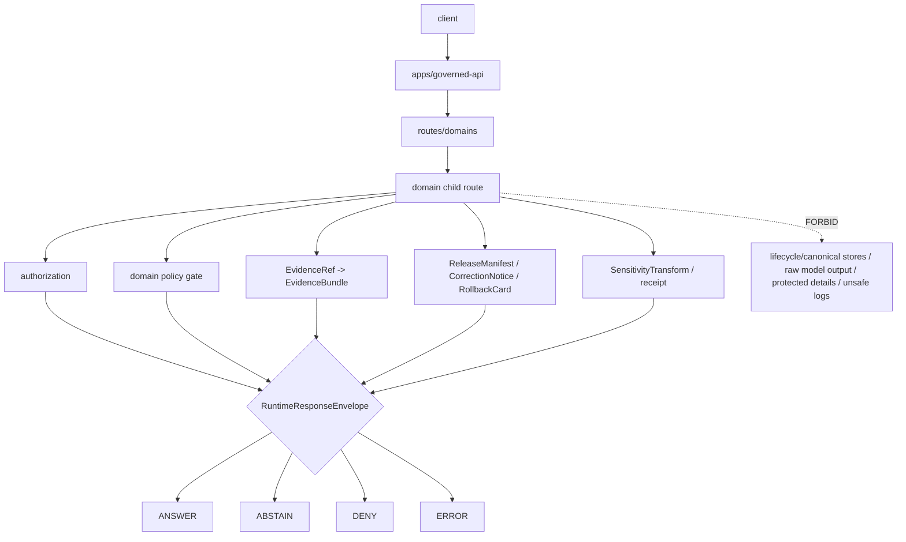

<!-- [KFM_META_BLOCK_V2]
doc_id: kfm://app/governed-api/routes/domains/readme
title: Governed API Domain Routes README
type: app-readme
version: v0.2
status: draft
owners: OWNER_TBD — API steward · Route steward · Domain stewards · Policy steward · Evidence steward · Release steward · Runtime steward · Security steward · Privacy steward · Audit steward · Docs steward
created: 2026-06-16
updated: 2026-07-09
policy_label: public
related:
  - ../../README.md
  - ../../../README.md
  - ../../../explorer-web/README.md
  - ../../../../docs/doctrine/directory-rules.md
  - ../../../../docs/adr/ADR-0004-apps-governed-api-is-the-trust-membrane.md
  - ../../../../docs/domains/README.md
  - ../../../../docs/domains/archaeology/README.md
  - ../../../../policy/domains/README.md
  - ../../../../policy/domains/archaeology/README.md
  - ../../../../policy/access/README.md
  - ../../../../policy/decision/README.md
  - ../../../../policy/telemetry/README.md
  - ../../../../schemas/contracts/v1/runtime/
  - ../../../../schemas/contracts/v1/domains/
  - ../../../../contracts/runtime/
  - ../../../../contracts/domains/
  - ../../../../packages/evidence-resolver/README.md
  - ../../../../packages/policy-runtime/README.md
  - ../../../../data/README.md
  - ../../../../release/README.md
  - ./archaeology/README.md
tags: [kfm, apps, governed-api, routes, domains, trust-membrane, finite-outcomes, domain-routes, evidencebundle, policydecision, release-manifest, safe-errors, sensitivity-gates]
notes:
  - "Refreshes the governed-api domain-routes parent contract."
  - "This path is an app-local API route organization boundary, not a domain doctrine root, schema root, contract root, policy root, lifecycle root, release root, proof root, audit store, package root, runtime adapter root, or UI surface."
  - "Child route handlers, DTOs, middleware, schemas, tests, fixtures, authorization, policy enforcement, evidence resolution, release lookup, transform receipt support, safe logging, safe telemetry, deployment state, dashboards, and CI pass state remain NEEDS VERIFICATION."
  - "Child route-family names are route-family proposals unless their files, tests, schemas, policy gates, authorization, and runtime behavior are verified on the target branch."
  - "policy/telemetry/README.md may be stub-level; executable telemetry policy wiring remains NEEDS VERIFICATION unless separately verified."
  - "v0.2 adds a current evidence basis, Directory Rules placement basis, minimum safe domain-route slice, runtime anti-bypass matrix, stronger child route map, safe-error/logging/telemetry/cache safeguards, cross-domain boundary gates, and validation/definition-of-done gates without claiming runtime maturity."
[/KFM_META_BLOCK_V2] -->

<a id="top"></a>

<div align="center">

# Governed API Domain Routes

`apps/governed-api/routes/domains/`

**App-local parent boundary for domain-specific governed API route families. Domain routes cross the trust membrane, return finite runtime outcomes, preserve EvidenceBundle / PolicyDecision / ReleaseManifest references, carry domain-specific sensitivity and rights obligations, and keep domain authority in the owning doctrine, policy, schema, contract, data, and release roots.**


[Evidence](#0-evidence-basis-for-this-revision) · [Purpose](#1-purpose) · [Repo fit](#2-repo-fit) · [Boundary](#3-authority-boundary) · [Inputs](#5-inputs) · [Exclusions](#6-exclusions) · [Child route map](#7-child-route-map) · [Minimum slice](#8-minimum-safe-domain-route-slice) · [Definition of done](#16-definition-of-done)

</div>

---

> [!IMPORTANT]
> **Status:** draft / `NEEDS VERIFICATION`  
> **Owners:** `OWNER_TBD` — API steward · Route steward · Domain stewards · Policy steward · Evidence steward · Release steward · Runtime steward · Security steward · Privacy steward · Audit steward · Docs steward  
> **Path:** `apps/governed-api/routes/domains/README.md`  
> **Responsibility root:** `apps/` — deployable application surfaces  
> **Directory Rules basis:** governed API route code belongs under the deployable app root `apps/governed-api/`; `routes/domains/` is an app-local route-family parent, not a domain doctrine root, policy root, schema root, contract root, lifecycle-data lane, release authority, evidence store, proof store, audit store, package root, runtime adapter root, or UI surface.  
> **Truth posture:** CONFIRMED current GitHub README path / CONFIRMED governed-api trust-membrane README exists / CONFIRMED route-tree README exists on `main` before the latest branch refresh / CONFIRMED archaeology child README exists on `main` before the latest branch refresh / CONFIRMED archaeology domain and policy READMEs exist / CONFIRMED Directory Rules document exists / PROPOSED parent domain-route contract / UNKNOWN child route handlers, DTOs, middleware, schemas, tests, fixtures, authorization, policy runtime integration, evidence resolver integration, release lookup, transform receipt support, safe logging, safe telemetry, deployment state, dashboards, CI pass state, and runtime behavior

> [!CAUTION]
> Domain routes are not domain authorities. They may project and enforce domain-specific governed responses, but domain doctrine belongs under `docs/domains/`, policy belongs under `policy/domains/`, machine shape belongs under `schemas/contracts/v1/domains/`, object meaning belongs under `contracts/domains/`, release decisions belong under `release/`, lifecycle artifacts belong under `data/`, and public rendering belongs outside the route tree.

---

## Quick jump

- [0. Evidence basis for this revision](#0-evidence-basis-for-this-revision)
- [1. Purpose](#1-purpose)
- [2. Repo fit](#2-repo-fit)
- [3. Authority boundary](#3-authority-boundary)
- [4. Default posture](#4-default-posture)
- [5. Inputs](#5-inputs)
- [6. Exclusions](#6-exclusions)
- [7. Child route map](#7-child-route-map)
- [8. Minimum safe domain-route slice](#8-minimum-safe-domain-route-slice)
- [9. Diagram](#9-diagram)
- [10. Runtime outcome contract](#10-runtime-outcome-contract)
- [11. Domain route obligations](#11-domain-route-obligations)
- [12. Runtime anti-bypass matrix](#12-runtime-anti-bypass-matrix)
- [13. Inspection path](#13-inspection-path)
- [14. Validation expectations](#14-validation-expectations)
- [15. Safe change pattern](#15-safe-change-pattern)
- [16. Definition of done](#16-definition-of-done)
- [17. Open verification items](#17-open-verification-items)

---

## 0. Evidence basis for this revision

This README is a documentation boundary, not runtime proof. The 2026-07-09 revision updates an existing README and keeps implementation maturity bounded while aligning the domain-route parent with current repository evidence and newer route-family README patterns.

| Evidence item | Status | What it supports | What it does not prove |
|---|---|---|---|
| `apps/governed-api/routes/domains/README.md` exists on `main`. | CONFIRMED | This is an existing README update, not a new path proposal. | It does not prove child route handlers, DTOs, middleware, schemas, fixtures, tests, deployment, logs, dashboards, or runtime behavior exist. |
| `apps/governed-api/README.md` exists and describes the app as the normal public trust path for finite governed envelopes. | CONFIRMED document presence and doctrine posture | Domain route projections belong behind the governed API trust membrane. | It does not prove domain-route wiring or runtime enforcement. |
| `apps/governed-api/routes/README.md` exists on `main` and describes route folders as app-local organization, not authority roots. | CONFIRMED document presence and doctrine posture | This child parent must stay under the route-tree boundary and defer authority to owning roots. | It does not prove route-tree implementation or child route maturity. |
| `apps/governed-api/routes/domains/archaeology/README.md` exists on `main` before the latest branch refresh. | CONFIRMED child README presence | At least one child domain-route README exists and demonstrates a stricter domain-specific route contract pattern. | It does not prove archaeology route code, tests, policy runtime integration, or deployment. |
| `docs/doctrine/directory-rules.md` exists and identifies root placement as ownership/lifecycle governance; `apps/` is the deployable implementation root. | CONFIRMED document presence and placement posture | `apps/governed-api/routes/domains/` is an app-local domain route parent under the deployable API. | It does not prove any domain route is implemented or release-ready. |
| `docs/domains/archaeology/README.md` exists and marks exact-location denial/default T4 sensitivity posture for archaeology. | CONFIRMED document presence and domain posture | Domain routes can inherit stricter domain-specific safeguards from doctrine docs. | It does not prove schemas, validators, policy bundles, or route code. |
| `policy/domains/archaeology/README.md` exists and marks runtime enforcement `UNKNOWN`. | CONFIRMED policy-lane posture | Domain route docs should reference policy gates but cannot claim executable policy enforcement unless verified. | It does not prove policy runtime integration, tests, or CI. |

[Back to top](#top)

---

## 1. Purpose

`apps/governed-api/routes/domains/` is the proposed parent boundary for domain-specific route families inside `apps/governed-api/`.

It may eventually contain child directories and route-family READMEs for domain lanes such as archaeology, hydrology, habitat, fauna, flora, hazards, geology, soil, agriculture, atmosphere, roads/rail/trade, settlements/infrastructure, and people/DNA/land.

Domain routes should provide governed projections for public-safe or role-gated domain requests, including:

- domain object summaries;
- domain layer metadata and release-aware descriptors;
- evidence-backed detail projections;
- source-family, source-role, provenance, and limitation summaries;
- policy, sensitivity, rights, audience, review, and release-state responses;
- correction, rollback, stale/freshness, withdrawal, supersession, and release-lineage lookups;
- redaction, generalization, aggregation, delayed-release, or suppression transform summaries;
- export eligibility prechecks;
- read-only review projections where allowed;
- safe denial, abstention, and error responses.

This directory is not proof that any child route handler, DTO, middleware, schema, fixture, policy gate, authorization guard, test, deployment, log, dashboard, CI pass state, or runtime behavior exists.

[Back to top](#top)

---

## 2. Repo fit

| Concern | Owning root | Expected relationship |
|---|---|---|
| Domain route parent | `apps/governed-api/routes/domains/` | Parent for app-local domain route families |
| Route tree | `apps/governed-api/routes/` | App-local route organization only |
| Governed API app | `apps/governed-api/` | Trust membrane and finite envelope API surface |
| Domain doctrine | `docs/domains/<domain>/` | Human-facing domain scope and sensitivity posture |
| Domain policy | `policy/domains/<domain>/` | Domain-specific admissibility, deny, restrict, hold, and abstain rules |
| Runtime schemas/contracts | `schemas/contracts/v1/runtime/`, `contracts/runtime/` | Runtime envelope machine shape and object meaning |
| Domain schemas/contracts | `schemas/contracts/v1/domains/<domain>/`, `contracts/domains/<domain>/` | Domain machine shape and object meaning, if present and accepted |
| Policy runtime | `packages/policy-runtime/`, `policy/` | Policy evaluation behind the governed API, if implemented |
| Evidence support | `packages/evidence-resolver/`, `data/proofs/` | EvidenceBundle support behind governed API |
| Release authority | `release/` | Release decisions, correction, supersession, rollback |
| Lifecycle artifacts | `data/` | Source lifecycle, receipts, proofs, registry, catalog, triplets, and published outputs |
| Runtime adapters | `runtime/` | Adapter lane behind governed API |
| Client UI | `apps/explorer-web/` | Consumer of governed responses, not route authority |
| Tests and fixtures | `tests/`, `fixtures/` | Required before implementation or route maturity claims |

## 3. Authority boundary

This parent route folder may organize domain-specific governed API projections. It does not own domain doctrine, policy authorship, schema authority, contract authority, source admission, lifecycle storage, EvidenceBundle authorship, release approval, correction approval, rollback approval, reviewer decisions, renderer behavior, UI rendering, audit truth, telemetry authority, or AI output.

```text
apps/governed-api/routes/domains/ = app-local domain route-family parent
apps/governed-api/routes/         = route tree organization
apps/governed-api/                = trust membrane and finite envelope API
docs/domains/                     = domain doctrine and sensitivity posture
policy/domains/                   = domain admissibility policy
schemas/contracts/v1/domains/     = domain machine shape, if accepted
contracts/domains/                = domain object meaning, if accepted
policy/                           = policy rules and policy documentation
data/                             = lifecycle artifacts, receipts, proofs, registries
release/                          = publication, correction, rollback authority
packages/                         = reusable helpers
runtime/                          = adapters behind governed API
apps/explorer-web/                = client UI consumer
```

## 4. Default posture

Domain routes should fail closed. A child domain route should not return `ANSWER` when any of these are unresolved:

- caller role and endpoint authorization;
- domain slug and object-family ownership;
- domain-specific policy and sensitivity posture;
- source role, provenance, and source-rights posture;
- EvidenceRef-to-EvidenceBundle support;
- release manifest, rollback target, correction path, stale-state, review state, withdrawal, or supersession state;
- citation validation and limitation fields;
- redaction, generalization, aggregation, suppression, or delayed-release transform support where material;
- candidate/inferred-vs-confirmed status;
- cross-domain context boundaries;
- response-envelope schema validation;
- safe error, safe logging, safe telemetry, and safe cache-key behavior;
- audit-safe request/decision references.

## 5. Inputs

| Input family | Examples | Required posture |
|---|---|---|
| Request context | route action, domain slug, object id, layer id, evidence ref, map feature ref, user role | Schema-validated and bounded |
| Domain context | object family, domain constraints, candidate/confirmed status, cross-domain refs | Domain-owned or explicitly referenced |
| Evidence context | EvidenceRef, EvidenceBundle refs, source roles, citations, limitations | Resolver behind governed API |
| Policy context | rights, sensitivity, access role, audience, review state, transform requirement | Domain policy gate required |
| Release context | release manifest, correction notice, rollback card, artifact digest, stale state, withdrawn/superseded state | Required for public-safe output |
| Transform context | redaction, generalization, delay, aggregation, suppression, withheld fields, transform receipt | Required when sensitive material is transformed |
| Runtime envelope | `RuntimeResponseEnvelope`, `DecisionEnvelope`, reason codes, audit refs | Exactly one finite outcome |
| Runtime context | server-side adapter result, Focus response, AIReceipt ref where allowed | Behind membrane; never direct browser call |
| Observability context | route id, reason code, correlation id, safe metric labels | No sensitive payloads, no raw evidence, no protected geometry |
| Error context | schema failure, policy denial, missing evidence, stale support, adapter fault | Safe reason code only |

## 6. Exclusions

| Does not belong here | Correct home |
|---|---|
| Domain doctrine and scope | `docs/domains/<domain>/` |
| Domain policy rules or policy bundles | `policy/domains/<domain>/` and related policy roots |
| Domain schemas and contracts | `schemas/contracts/v1/domains/<domain>/`, `contracts/domains/<domain>/` |
| Runtime envelope schemas/contracts | `schemas/contracts/v1/runtime/`, `contracts/runtime/` |
| Source data, lifecycle artifacts, receipts, proofs, registry, catalog, triplets, published outputs | `data/` |
| Release decisions, correction notices, rollback cards | `release/` |
| Source acquisition and ingest adapters | `connectors/`, `pipelines/`, `pipeline_specs/` |
| Shared route helpers reusable across apps | `packages/` after extraction and review |
| Runtime adapters | `runtime/`, behind governed API |
| Public UI rendering | `apps/explorer-web/` |
| Review decision recording | governed review routes and review governance, not ordinary public projection routes |
| Direct public lifecycle/canonical reads | Forbidden; use finite governed envelopes |
| Direct public runtime/model calls | Forbidden; use governed server-side adapters only |
| Sensitive details in logs, errors, telemetry, cache keys, diagnostics, metrics, or public payloads | Forbidden unless a reviewed, bounded, release-approved transform explicitly allows them |

## 7. Child route map

Exact child route files and implementation status remain `NEEDS VERIFICATION` unless verified on the target branch.

| Child route family | Purpose | Required safeguard | Status |
|---|---|---|---|
| `archaeology/` | Archaeology and cultural heritage projections | Exact/protected exposure denial and cultural/steward review gates | CONFIRMED README path on `main` before latest branch refresh / implementation UNKNOWN |
| `hydrology/` | Hydrology projections | Source role, flood/risk disclaimer, release and stale-state gates | PROPOSED |
| `habitat/` | Habitat projections | Sensitive ecological geometry and restoration-state gates | PROPOSED |
| `fauna/` | Fauna projections | Rare species, den/nest/roost/spawn redaction gates | PROPOSED |
| `flora/` | Flora projections | Rare plant and private-property exposure gates | PROPOSED |
| `hazards/` | Hazard projections | Not-for-life-safety and stale-state gates | PROPOSED |
| `geology/` | Geology/resource projections | Resource, ownership, claim, and hazard caveat gates | PROPOSED |
| `soil/` | Soil projections | Source-support, private-farm, and stale-state gates | PROPOSED |
| `agriculture/` | Agriculture projections | Producer/privacy/operations exposure gates | PROPOSED |
| `atmosphere/` | Atmosphere/air projections | Sensor freshness, uncertainty, and not-alerting gates | PROPOSED |
| `roads_rail_trade/` | Roads, rail, trade-route projections | Historical/current network distinction and safety disclaimers | PROPOSED |
| `settlements_infrastructure/` | Settlement and infrastructure projections | Critical-infrastructure precision gates | PROPOSED |
| `people_dna_land/` | People, genealogy, DNA, land projections | Living-person, DNA, consent, title, and parcel-boundary gates | PROPOSED |

> [!WARNING]
> Candidate child names are not implementation proof. Do not document a child route as live until files, tests, schemas, fixtures, policy gates, middleware, authorization, safe observability, and deployment evidence confirm it.

## 8. Minimum safe domain-route slice

A smallest useful domain-route slice should prove domain boundaries, finite outcomes, policy gates, and side-channel safety before exposing any child route publicly.

| Slice item | Minimum requirement | Why it is required |
|---|---|---|
| Child route inventory | Each domain child has owner, purpose, route actions, object families, and finite outcomes | Prevents hidden route drift |
| Runtime envelope parser | Every response validates `RuntimeResponseEnvelope` or accepted equivalent | Prevents malformed payloads |
| Domain slug/object guard | Route verifies domain slug and object family ownership | Prevents cross-domain authority collapse |
| Authorization guard | Caller role and audience are resolved before route result | Prevents public/restricted confusion |
| Domain policy gate | Rights, sensitivity, review, release, transform, and audience obligations are checked | Preserves domain-specific governance |
| Evidence gate | Claim-bearing `ANSWER` requires EvidenceBundle/citation support | Enforces cite-or-abstain |
| Release gate | Public-safe output preserves release, correction, rollback, stale, and withdrawal/supersession refs where material | Keeps publication state inspectable |
| Transform receipt gate | Redaction/generalization/delay/aggregation/suppression is receipt-backed where used | Makes sensitivity transforms auditable |
| Candidate/inferred label guard | Candidate or inferred objects cannot become confirmed through route language | Prevents proof shortcut |
| Cross-domain boundary guard | Context from another domain stays context unless evidence/policy/release supports the target claim | Prevents cross-domain proof collapse |
| Safe observability guard | Logs, metrics, telemetry, diagnostics, traces, and cache keys do not carry sensitive payloads | Prevents side-channel leakage |
| Safe error guard | Faults return safe reason codes and audit refs only | Prevents protected/internal leakage |

This slice is still `PROPOSED` until files, fixtures, tests, route wiring, and accepted contracts are verified.

## 9. Diagram



## 10. Runtime outcome contract

Every trust-bearing domain route response should resolve to exactly one runtime status.

| Status | Meaning | Domain route posture |
|---|---|---|
| `ANSWER` | Safe, released, evidence-backed, policy-supported response exists | Include evidence, policy, release, transform, limitation, and citation refs where material |
| `ABSTAIN` | Evidence, review, freshness, source role, narrowing support, or scope is insufficient | Explain the held reason without fabricating an answer or leaking protected detail |
| `DENY` | Policy, rights, sensitivity, role, review, release, or exposure risk blocks response | Avoid leaking blocked material or exposure hints |
| `ERROR` | Schema, adapter, resolver, or infrastructure fault prevents reliable response | Return audit-safe fault reference only |

## 11. Domain route obligations

| Obligation | Example effect |
|---|---|
| `governed_membrane_only` | Domain payloads cross `apps/governed-api/` |
| `finite_outcomes_required` | No silent partial, unlabeled hold, or untyped refusal |
| `domain_policy_required` | Domain-specific sensitivity, rights, review, release, and transform obligations are checked |
| `evidence_required` | Claim-bearing `ANSWER` requires EvidenceBundle support |
| `source_role_required` | Source authority and limitations travel with the response |
| `release_refs_required` | Released public artifacts carry release/correction/rollback refs where material |
| `transform_receipt_required` | Redaction/generalization/delay/aggregation/suppression must be receipt-backed where used |
| `candidate_not_confirmation` | Candidate or inferred objects stay labeled and cannot become confirmed through route language |
| `cross_domain_refs_bounded` | Cross-domain context cannot become another domain's proof shortcut |
| `safe_error_only` | Errors do not expose protected details or internal route/resolver state |
| `safe_observability_only` | Logs, metrics, telemetry, cache keys, diagnostics, and traces do not carry sensitive payloads |
| `no_parallel_authority` | Route folders do not redefine domain, policy, schema, contract, data, release, package, runtime, audit, or UI authority |
| `auditability_required` | Request, decision, release, evidence, and transform refs support later review |

## 12. Runtime anti-bypass matrix

| Bypass risk | Required behavior | Review signal |
|---|---|---|
| Child route returns claim without EvidenceBundle support | Return `ABSTAIN` or `DENY` | Missing-evidence fixture blocks `ANSWER` |
| Domain route bypasses domain policy | Apply policy gate before response construction | Policy-denial fixture returns `DENY` without blocked payload |
| Candidate/inferred object becomes confirmed | Preserve candidate/inferred status and limitations | Candidate-not-confirmed fixture passes |
| Cross-domain context becomes proof shortcut | Require target-domain evidence/policy/release support | Cross-domain fixture cannot confirm target claim alone |
| Sensitive detail leaks in response | Redact/generalize/delay/suppress/deny under policy and receipt | Sensitive-domain fixture excludes protected payload |
| Sensitive detail leaks in error/log/telemetry/cache key | Emit safe codes, opaque ids, and non-sensitive labels only | Safe-observability fixture excludes raw payloads |
| Child route reads lifecycle/canonical stores directly | Deny direct public route reads; use governed services/resolvers | Import/fetch scan blocks direct lifecycle/canonical paths |
| Route calls model/provider directly from public path | Use governed server-side adapter and finite envelope only | AI boundary fixture blocks raw model output/provider traces |
| Route mutates review/release/lifecycle state through read projection | Separate read-only from mutating route families | Read-only mutation-denied fixture passes |
| Child README claims runtime maturity without tests | Mark `NEEDS VERIFICATION` until implementation evidence exists | README review cites files/tests/fixtures or abstains |

## 13. Inspection path

Child route handlers, DTOs, middleware, schemas, fixtures, tests, policy integration, authorization, safe-error behavior, safe logging/telemetry/cache behavior, dashboards, deployment state, and emitted artifacts remain `NEEDS VERIFICATION`.

```bash
find apps/governed-api/routes/domains -maxdepth 6 -type f | sort
find apps/governed-api docs/domains policy/domains schemas/contracts/v1/domains contracts/domains data release tests fixtures packages runtime .github/workflows -maxdepth 6 -type f 2>/dev/null | grep -Ei 'RuntimeResponseEnvelope|DecisionEnvelope|EvidenceBundle|EvidenceRef|PolicyDecision|ReleaseManifest|CorrectionNotice|RollbackCard|RedactionReceipt|ReviewRecord|SensitivityTransform|domain|archaeology|hydrology|habitat|fauna|flora|hazards|geology|soil|agriculture|atmosphere|roads|rail|trade|settlements|infrastructure|people|dna|land|abstain|deny|error|route|test|fixture|telemetry|logging|cache|diagnostic' | sort
```

## 14. Validation expectations

Useful validation for this route parent should cover:

- every child domain route returns exactly one `ANSWER`, `ABSTAIN`, `DENY`, or `ERROR` status;
- unresolved review, rights, release, transform, sensitivity, or source-role posture fails closed;
- sensitive exact or protected details are denied unless a reviewed transform and release path explicitly allows a bounded response;
- candidate/inferred objects remain labeled and cannot become confirmed observations through route language;
- cross-domain context cannot become proof for another domain without target-domain evidence, policy, and release support;
- missing, stale, weak, conflicting, or unresolved evidence returns `ABSTAIN` rather than generated filler;
- policy denial returns `DENY` without blocked detail or exposure hints;
- schema, adapter, resolver, or infrastructure faults return `ERROR` with safe details only;
- response envelopes preserve evidence refs, policy decision refs, release refs, correction refs, rollback refs, citations, limitations, redactions, stale state, transform refs, and reason codes where material;
- logs, metrics, telemetry, diagnostics, traces, and cache keys do not expose sensitive domain payloads, restricted geometry, raw evidence, direct lifecycle paths, secrets, model prompts, model outputs, or provider traces;
- read-only route families cannot mutate review, release, lifecycle, evidence, policy, or correction state.

## 15. Safe change pattern

For domain route changes:

1. Add or update child route inventory and route-family contract.
2. Link route DTOs to runtime and domain schemas before changing response shape.
3. Add fixtures for `ANSWER`, `ABSTAIN`, `DENY`, `ERROR`, policy denial, missing evidence, stale evidence, unresolved review, transform missing, release missing, safe error, unsafe logging, unsafe telemetry, unsafe cache key, candidate-not-confirmed, cross-domain proof denied, unauthorized caller, and read-only mutation denied cases.
4. Add domain-policy, authorization, safe-error, safe-observability, evidence, release, transform, and candidate-not-confirmed tests before exposing any public route.
5. Preserve evidence refs, policy decision refs, release refs, correction refs, rollback refs, citations, limitations, redactions, stale state, transform refs, and audit refs through every response.
6. Update this README, `apps/governed-api/README.md`, parent `routes/README.md`, affected child route READMEs, affected domain docs, affected policy docs, schemas/contracts, fixtures, and tests when route behavior materially changes.

## 16. Definition of done

- [ ] Owners are confirmed and `OWNER_TBD` is replaced.
- [ ] Evidence basis is refreshed when parent API docs, parent route README, child route READMEs, domain docs, policy docs, schemas, contracts, evidence resolver, release, runtime, fixtures, tests, workflow, telemetry, or deployment evidence changes.
- [ ] Child route inventory and route ownership are documented.
- [ ] Runtime envelope and domain DTO/schema bindings are verified.
- [ ] Authorization, policy runtime, evidence resolver, release lookup, transform receipt, and audit hooks are documented and tested.
- [ ] Finite outcome fixtures cover `ANSWER`, `ABSTAIN`, `DENY`, and `ERROR`.
- [ ] Sensitive-detail denial tests are present and passing.
- [ ] Candidate/inferred-not-confirmed tests are present and passing.
- [ ] Cross-domain proof-boundary tests are present and passing.
- [ ] Missing-evidence and stale-evidence abstention tests are present and passing.
- [ ] Policy denial and domain-sensitive denial tests are present and passing.
- [ ] Safe-error tests are present and passing.
- [ ] Safe logging, metrics, telemetry, cache-key, diagnostics, and observability tests are present and passing.
- [ ] Read-only vs mutating route boundaries are documented and tested.
- [ ] AI-assisted route no-raw-model-output and no-chain-of-thought tests are present and passing where applicable.

## 17. Open verification items

| Item | Why it matters |
|---|---|
| Confirm child route handlers beyond READMEs | Prevents overclaiming runtime maturity |
| Confirm parent `routes/README.md` status on `main` | Needed for route tree ownership above this folder |
| Confirm child route DTOs and schemas | Required before route behavior claims |
| Confirm authorization and role resolution | Required before public/restricted split claims |
| Confirm policy runtime integration | Required before sensitivity/rights/release claims |
| Confirm evidence resolver integration | Required before EvidenceBundle closure claims |
| Confirm release/correction/rollback lookup | Required before publication-state claims |
| Confirm transform receipt handling | Required before redacted/generalized output claims |
| Confirm candidate/inferred-not-confirmed behavior | Required before domain candidate routes |
| Confirm cross-domain proof-boundary behavior | Required before cross-domain route claims |
| Confirm safe-error behavior | Required before public exposure |
| Confirm safe logging, metrics, telemetry, cache-key, and diagnostics behavior | Required to prevent side-channel leakage |
| Confirm test and fixture coverage | Required before runtime maturity claims |
| Confirm child route README status on `main` | Required before parent doc claims child maturity |
| Confirm deployment, logs, dashboards, and audit receipts | Required before operational claims |
| Confirm CI workflow presence and latest pass state | Required before CI claims |

<details>
<summary>Appendix A — no-loss preservation note</summary>

The previous README already contained a bounded governed-api domain-routes parent contract. This revision preserves that contract, refreshes metadata, adds a current evidence-basis section, adds Directory Rules placement posture, strengthens child route inventory, minimum domain-route slice, finite-envelope, authorization, domain-policy, evidence, release, transform, cross-domain, safe-error, safe logging/telemetry/cache, read-only/mutation, AI-boundary, and anti-bypass safeguards, and keeps implementation claims bounded. It does not claim child route handlers, DTOs, schemas, middleware, authorization, policy enforcement, evidence resolution, release lookup, transform receipt support, tests, fixtures, deployment, logs, dashboards, telemetry, or CI pass state are implemented.

</details>

## Status summary

`apps/governed-api/routes/domains/` should contain domain route-family modules and child READMEs only after route inventory, DTOs, schemas, authorization, policy runtime integration, evidence resolver integration, release/correction/rollback lookups, transform receipt support, safe-error behavior, safe logging/telemetry/cache behavior, finite-outcome fixtures, tests, and operational evidence are verified.

It must preserve the trust membrane and domain-placement boundaries: domain routes may project governed finite envelopes, but they must not become domain doctrine, policy authority, schema authority, contract authority, lifecycle storage, release authority, proof storage, direct source access, raw model-output surfaces, unsafe observability channels, cross-domain proof shortcuts, or unsupported generated answer surfaces.

<p align="right"><a href="#top">Back to top</a></p>
