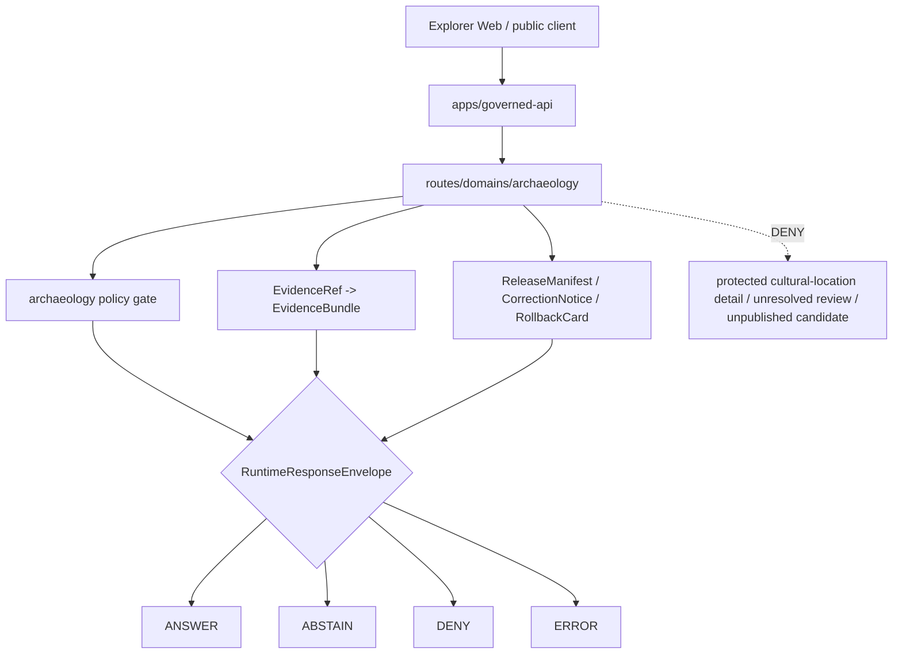

<!-- [KFM_META_BLOCK_V2]
doc_id: kfm://app/governed-api/routes/domains/archaeology/readme
title: Governed API Archaeology Domain Routes README
type: app-readme
version: v0.1
status: draft
owners: OWNER_TBD — API steward · Archaeology steward · Policy steward · Evidence steward · Release steward · Security steward · Docs steward
created: 2026-06-16
updated: 2026-06-16
policy_label: public
related:
  - ../../../README.md
  - ../../../../README.md
  - ../../../../explorer-web/README.md
  - ../../../../../docs/adr/ADR-0004-apps-governed-api-is-the-trust-membrane.md
  - ../../../../../docs/domains/archaeology/README.md
  - ../../../../../policy/domains/archaeology/README.md
  - ../../../../../schemas/contracts/v1/runtime/
  - ../../../../../schemas/contracts/v1/domains/archaeology/
  - ../../../../../contracts/domains/archaeology/
  - ../../../../../data/README.md
  - ../../../../../release/README.md
tags: [kfm, apps, governed-api, routes, domains, archaeology, cultural-heritage, finite-outcomes, deny-by-default, evidencebundle, release-manifest]
notes:
  - "Replaces an empty route README with a bounded governed-api Archaeology route-family contract."
  - "This app-local route path may describe request/response behavior, but it must not become archaeology doctrine, policy authority, schema authority, contract authority, lifecycle storage, release authority, or proof storage."
  - "Route handlers, DTOs, middleware, schemas, tests, fixtures, policy enforcement, deployment state, logs, dashboards, and CI pass state remain NEEDS VERIFICATION."
[/KFM_META_BLOCK_V2] -->

<a id="top"></a>

<div align="center">

# Governed API Archaeology Domain Routes

`apps/governed-api/routes/domains/archaeology/`

**App-local route-family boundary for Archaeology and Cultural Heritage requests crossing the governed API trust membrane: public-safe summaries, evidence-backed lookups, release-aware layer metadata, redacted/generalized outputs, review-aware negative states, and fail-closed protection for sensitive cultural-heritage material.**


[Purpose](#1-purpose) · [Repo fit](#2-repo-fit) · [Boundary](#3-authority-boundary) · [Inputs](#5-inputs) · [Exclusions](#6-exclusions) · [Route map](#7-route-family-map) · [Definition of done](#14-definition-of-done)

</div>

---

> [!IMPORTANT]
> **Status:** draft / `NEEDS VERIFICATION`  
> **Owners:** `OWNER_TBD` — API steward · Archaeology steward · Policy steward · Evidence steward · Release steward · Security steward · Docs steward  
> **Path:** `apps/governed-api/routes/domains/archaeology/README.md`  
> **Responsibility root:** `apps/` — deployable application surfaces  
> **Truth posture:** CONFIRMED README path / CONFIRMED governed-api trust-membrane doctrine / CONFIRMED archaeology domain sensitivity doctrine / PROPOSED route-family contract / UNKNOWN route handlers, DTOs, middleware, schemas, tests, fixtures, runtime behavior, and CI pass state

> [!CAUTION]
> Archaeology routes are high-sensitivity routes. When cultural review, steward review, rights, release state, evidence support, redaction/generalization, or location-exposure safety is unresolved, the route must return `ABSTAIN`, `DENY`, or `ERROR` rather than a partial public answer.

---

## Quick jump

- [1. Purpose](#1-purpose)
- [2. Repo fit](#2-repo-fit)
- [3. Authority boundary](#3-authority-boundary)
- [4. Default posture](#4-default-posture)
- [5. Inputs](#5-inputs)
- [6. Exclusions](#6-exclusions)
- [7. Route family map](#7-route-family-map)
- [8. Diagram](#8-diagram)
- [9. Runtime outcome contract](#9-runtime-outcome-contract)
- [10. Archaeology API obligations](#10-archaeology-api-obligations)
- [11. Inspection path](#11-inspection-path)
- [12. Validation expectations](#12-validation-expectations)
- [13. Safe change pattern](#13-safe-change-pattern)
- [14. Definition of done](#14-definition-of-done)
- [15. Open verification items](#15-open-verification-items)

---

## 1. Purpose

`apps/governed-api/routes/domains/archaeology/` is the proposed app-local route-family home for Archaeology and Cultural Heritage request handlers inside `apps/governed-api/`.

It may eventually hold route modules, DTOs, response mappers, middleware hooks, fixtures, and tests for governed requests such as:

- public-safe archaeology layer metadata;
- redacted or generalized site/context summaries;
- EvidenceRef-to-EvidenceBundle supported claim detail;
- source-family and provenance summaries;
- release/correction/rollback state for public-safe archaeology artifacts;
- sensitivity-transform summaries and transformation receipts;
- bounded remote-sensing candidate explanations that preserve candidate-vs-confirmed status;
- role-gated review payload retrieval where policy allows;
- denial/abstention/error responses for protected cultural-heritage material.

This directory is not proof that any route handler, DTO, middleware, schema, fixture, policy gate, authorization guard, test, deployment, log, dashboard, or CI pass state exists.

[Back to top](#top)

---

## 2. Repo fit

| Concern | Owning root | Expected relationship |
|---|---|---|
| Archaeology governed API route docs | `apps/governed-api/routes/domains/archaeology/` | App-local route-family boundary and future route files, if implemented |
| Governed API app | `apps/governed-api/` | Trust membrane and finite envelope API surface |
| Archaeology domain docs | `docs/domains/archaeology/` | Human-facing domain doctrine and sensitivity posture |
| Archaeology policy | `policy/domains/archaeology/` | Domain-specific admissibility rules and deny-by-default posture |
| Runtime schemas | `schemas/contracts/v1/runtime/` | Runtime envelope machine shape |
| Archaeology schemas | `schemas/contracts/v1/domains/archaeology/` | Domain machine shape, if present and accepted |
| Archaeology contracts | `contracts/domains/archaeology/` | Domain object meaning, if present and accepted |
| Evidence support | `data/proofs/`, evidence resolver package | EvidenceBundle support behind governed API |
| Release authority | `release/` | Release decisions, correction, supersession, rollback |
| Lifecycle artifacts | `data/` | Source lifecycle, receipts, proofs, registry, catalog, triplets, and published outputs |

## 3. Authority boundary

This route family may implement governed API projections for Archaeology. It does not own Archaeology doctrine, Archaeology policy authorship, schema authority, contract authority, source admission, lifecycle storage, EvidenceBundle authorship, release approval, correction approval, rollback approval, reviewer decisions, renderer behavior, or AI output.

```text
apps/governed-api/routes/domains/archaeology/ = app-local route family
apps/governed-api/                            = trust membrane and finite envelope API
docs/domains/archaeology/                     = domain doctrine and sensitivity posture
policy/domains/archaeology/                   = admissibility and deny/restrict/abstain policy
schemas/contracts/v1/domains/archaeology/     = machine shape, if accepted
contracts/domains/archaeology/                = object meaning, if accepted
data/                                         = lifecycle artifacts, receipts, proofs, registries
release/                                      = publication, correction, rollback authority
```

## 4. Default posture

Archaeology domain routes should fail closed and preserve exact-location denial, cultural review, steward review, sensitivity transforms, release state, evidence closure, and rollback targets.

A route should not return `ANSWER` when any of these are unresolved:

- caller role and endpoint authorization;
- object family and domain slug;
- archaeology sensitivity posture and protected-location exposure risk;
- cultural review, steward review, rights-holder review, or sovereignty/CARE posture where applicable;
- EvidenceRef-to-EvidenceBundle support;
- source role, provenance, and candidate-vs-confirmed state;
- redaction/generalization transform and receipt support;
- release manifest, rollback target, correction path, stale-state, or review state;
- citation validation and limitation fields;
- response-envelope schema validation;
- audit-safe request/decision references.

## 5. Inputs

| Input family | Examples | Required posture |
|---|---|---|
| Request context | route action, object id, layer id, evidence ref, map feature ref, user role | Schema-validated and bounded |
| Domain context | site, survey, artifact, context, candidate feature, chronology, collection, 3D/remote-sensing derivative | Domain object family checked |
| Evidence context | EvidenceRef, EvidenceBundle refs, source roles, citations, limitations | Resolver behind governed API |
| Policy context | sensitivity tier, rights, review state, sovereignty/CARE, audience, transform requirement | Domain policy gate required |
| Release context | release manifest, correction notice, rollback card, artifact digest, stale state | Required for public-safe output |
| Transform context | redaction, generalization, delay, aggregation, withheld fields, transform receipt | Required when sensitive material is transformed |
| Runtime envelope | `RuntimeResponseEnvelope`, `DecisionEnvelope`, reason codes, audit refs | Exactly one finite outcome |
| Error context | schema failure, policy denial, missing evidence, stale support, adapter fault | Safe reason code only |

## 6. Exclusions

| Does not belong here | Correct home |
|---|---|
| Archaeology doctrine and domain scope | `docs/domains/archaeology/` |
| Archaeology policy rules or policy bundles | `policy/domains/archaeology/` and related policy roots |
| Archaeology schemas and contracts | `schemas/contracts/v1/domains/archaeology/`, `contracts/domains/archaeology/` |
| Source data, lifecycle artifacts, receipts, proofs, registry, catalog, triplets, published outputs | `data/` |
| Release decisions, correction notices, rollback cards | `release/` |
| Source acquisition and ingest adapters | `connectors/`, `pipelines/`, `pipeline_specs/` |
| Shared route/helpers reusable across apps | `packages/` after extraction and review |
| Public UI rendering | `apps/explorer-web/` |
| Review decision recording | governed review routes and review governance, not public archaeology projection routes |
| Direct public lifecycle/canonical reads | Forbidden; use finite governed envelopes |
| Direct public runtime/model calls | Forbidden; use governed server-side adapters only |
| Protected cultural-location detail in logs, errors, telemetry, or public payloads | Forbidden unless a reviewed, bounded, release-approved transform explicitly allows it |

## 7. Route family map

Exact route files and implementation status remain `NEEDS VERIFICATION`. Candidate route modules should be introduced only with schemas, fixtures, domain policy gates, and safe negative cases.

| Candidate route module | Purpose | Required safeguard | Status |
|---|---|---|---|
| `summary` | Public-safe archaeology object summary | Evidence, policy, release, transform gates | PROPOSED |
| `layers` | Public-safe archaeology layer metadata | Release and sensitivity transform required | PROPOSED |
| `evidence` | Evidence-backed detail projection | EvidenceBundle and citation support | PROPOSED |
| `candidate` | Remote-sensing/LiDAR/candidate feature explanation | Candidate label preserved; no confirmation shortcut | PROPOSED |
| `sensitivity` | Sensitivity posture and transform summary | No protected detail leakage | PROPOSED |
| `release` | Release/correction/rollback lookup | Release-lineage refs required | PROPOSED |
| `review-readonly` | Role-gated review projection | Access policy and audit-safe response | PROPOSED |
| `export-scope` | Export eligibility precheck | No uncited or untransformed export | PROPOSED |
| `diagnostics` | Safe route/status diagnostics | No protected location or internal path detail | PROPOSED |

> [!WARNING]
> Candidate route names are not implementation proof. Do not document a route as live until files, tests, schemas, fixtures, policy gates, middleware, authorization, and deployment evidence confirm it.

## 8. Diagram



## 9. Runtime outcome contract

Every trust-bearing Archaeology route response should resolve to exactly one runtime status.

| Status | Meaning | Archaeology route posture |
|---|---|---|
| `ANSWER` | Safe, released, evidence-backed, policy-supported response exists | Include evidence, policy, release, transform, limitation, and citation refs where material |
| `ABSTAIN` | Evidence, review, freshness, source role, candidate status, or narrowing support is insufficient | Explain the held reason without revealing protected detail |
| `DENY` | Policy, rights, sensitivity, role, review, release, or exposure risk blocks response | Avoid leaking blocked cultural-heritage material |
| `ERROR` | Schema, adapter, resolver, or infrastructure fault prevents reliable response | Return audit-safe fault reference only |

## 10. Archaeology API obligations

| Obligation | Example effect |
|---|---|
| `governed_membrane_only` | All public archaeology payloads cross `apps/governed-api/` |
| `finite_outcomes_required` | No silent partial, unlabeled hold, or untyped refusal |
| `exact_location_denied_by_default` | Protected cultural-location detail is not exposed by default |
| `candidate_not_confirmation` | Candidate features never become confirmed observations through API language |
| `evidence_required` | Claim-bearing `ANSWER` requires EvidenceBundle support |
| `policy_required` | Sensitivity, rights, sovereignty/CARE, review, release, and transform obligations are checked |
| `release_refs_required` | Released public artifacts carry release/correction/rollback refs where material |
| `transform_receipt_required` | Redaction/generalization/delay/aggregation must be receipt-backed where used |
| `safe_error_only` | Errors do not expose protected details or internal route/resolver state |
| `auditability_required` | Request, decision, release, evidence, and transform refs support later review |

## 11. Inspection path

Route handlers, DTOs, middleware, schemas, fixtures, tests, policy integration, authorization, safe-error behavior, logs, dashboards, deployment state, and emitted artifacts remain `NEEDS VERIFICATION`.

```bash
find apps/governed-api/routes/domains/archaeology -maxdepth 6 -type f | sort
find apps/governed-api docs/domains/archaeology policy/domains/archaeology schemas contracts data release tests fixtures packages -maxdepth 6 -type f 2>/dev/null | grep -Ei 'archaeology|cultural|EvidenceBundle|EvidenceRef|PolicyDecision|ReleaseManifest|CorrectionNotice|RollbackCard|RedactionReceipt|ReviewRecord|SensitivityTransform|RuntimeResponseEnvelope|DecisionEnvelope|abstain|deny|error|route|test|fixture' | sort
```

## 12. Validation expectations

Useful validation for this route boundary should cover:

- every Archaeology route returns exactly one `ANSWER`, `ABSTAIN`, `DENY`, or `ERROR` status;
- unresolved review, rights, sovereignty/CARE, release, transform, or sensitivity posture fails closed;
- protected location, sacred-site, collection-security, and looting-risk details are denied unless a reviewed transform and release path explicitly allows a bounded response;
- candidate features stay labeled as candidates and cannot be treated as confirmed sites;
- missing, stale, weak, conflicting, or unresolved evidence returns `ABSTAIN` rather than generated filler;
- policy denial returns `DENY` without protected details;
- schema, adapter, resolver, or infrastructure faults return `ERROR` with safe details only;
- response envelopes preserve evidence refs, policy decision refs, release refs, correction refs, rollback refs, citations, limitations, redactions, stale state, and reason codes where material.

## 13. Safe change pattern

For Archaeology route changes:

1. Add or update route inventory and route-family contract.
2. Link route DTOs to runtime and Archaeology schemas before changing response shape.
3. Add fixtures for `ANSWER`, `ABSTAIN`, `DENY`, `ERROR`, policy denial, missing evidence, stale evidence, unresolved review, unreleased candidate, candidate-not-confirmed, transform missing, release missing, and safe error cases.
4. Add policy and safe-error tests before exposing any public route.
5. Preserve evidence refs, policy decision refs, release refs, correction refs, rollback refs, citations, limitations, redactions, stale state, and audit refs through every response.
6. Update this README, `apps/governed-api/README.md`, Archaeology docs, Archaeology policy docs, schemas/contracts, and tests when route behavior materially changes.

## 14. Definition of done

- [ ] Owners are confirmed and `OWNER_TBD` is replaced.
- [ ] Route inventory and route ownership are documented.
- [ ] Runtime envelope and Archaeology DTO/schema bindings are verified.
- [ ] Authorization, policy runtime, evidence resolver, release lookup, transform receipt, and audit hooks are documented and tested.
- [ ] Finite outcome fixtures cover `ANSWER`, `ABSTAIN`, `DENY`, and `ERROR`.
- [ ] Protected-location denial tests are present and passing.
- [ ] Candidate-not-confirmed tests are present and passing.
- [ ] Missing-evidence and stale-evidence abstention tests are present and passing.
- [ ] Policy denial and sensitive-domain denial tests are present and passing.
- [ ] Safe-error tests are present and passing.

## 15. Open verification items

| Item | Why it matters |
|---|---|
| Confirm route handlers beyond README | Prevents overclaiming runtime maturity |
| Confirm route DTOs and schemas | Required before route behavior claims |
| Confirm authorization and role resolution | Required before public/restricted split claims |
| Confirm policy runtime integration | Required before sensitivity/rights/release claims |
| Confirm evidence resolver integration | Required before EvidenceBundle closure claims |
| Confirm release/correction/rollback lookup | Required before publication-state claims |
| Confirm sensitivity-transform receipt handling | Required before redacted/generalized output claims |
| Confirm safe-error behavior | Required before public exposure |
| Confirm test and fixture coverage | Required before runtime maturity claims |
| Confirm deployment, logs, dashboards, and audit receipts | Required before operational claims |

<details>
<summary>Appendix A — no-loss preservation note</summary>

The previous README was empty. This replacement adds a bounded Archaeology governed-api route-family contract without claiming route handlers, DTOs, schemas, middleware, authorization, policy enforcement, evidence resolution, release lookup, transform receipt support, tests, fixtures, deployment, logs, dashboards, or CI pass state are implemented.

</details>

## Status summary

`apps/governed-api/routes/domains/archaeology/` should contain Archaeology route modules only after route inventory, DTOs, schemas, authorization, policy runtime integration, evidence resolver integration, release/correction/rollback lookups, transform receipt support, safe-error behavior, finite-outcome fixtures, tests, and operational evidence are verified.

It must preserve the trust membrane and archaeology sensitivity posture: public clients may receive governed finite envelopes, but they must not receive unreviewed protected cultural-heritage detail, candidate-as-confirmed language, unresolved review material, unpublished candidate artifacts, internal lifecycle references, or unsupported generated answers.

<p align="right"><a href="#top">Back to top</a></p>
