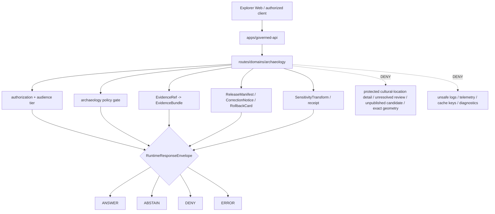

<!-- [KFM_META_BLOCK_V2]
doc_id: kfm://app/governed-api/routes/domains/archaeology/readme
title: Governed API Archaeology Domain Routes README
type: app-readme
version: v0.2
status: draft
owners: OWNER_TBD — API steward · Route steward · Archaeology steward · Cultural-review reviewer · Policy steward · Evidence steward · Release steward · Security steward · Privacy steward · Audit steward · Docs steward
created: 2026-06-16
updated: 2026-07-09
policy_label: public
related:
  - ../../../README.md
  - ../../README.md
  - ../README.md
  - ../../../../README.md
  - ../../../../explorer-web/README.md
  - ../../../../../docs/doctrine/directory-rules.md
  - ../../../../../docs/adr/ADR-0004-apps-governed-api-is-the-trust-membrane.md
  - ../../../../../docs/domains/archaeology/README.md
  - ../../../../../docs/domains/archaeology/SENSITIVITY.md
  - ../../../../../docs/domains/archaeology/PUBLICATION_AND_POLICY.md
  - ../../../../../docs/domains/archaeology/OBJECT_FAMILIES.md
  - ../../../../../policy/domains/archaeology/README.md
  - ../../../../../policy/sensitivity/archaeology/
  - ../../../../../policy/release/archaeology/
  - ../../../../../schemas/contracts/v1/runtime/
  - ../../../../../schemas/contracts/v1/domains/archaeology/
  - ../../../../../contracts/runtime/
  - ../../../../../contracts/domains/archaeology/
  - ../../../../../packages/evidence-resolver/README.md
  - ../../../../../packages/policy-runtime/README.md
  - ../../../../../data/README.md
  - ../../../../../release/README.md
  - ../../../../../tests/domains/archaeology/
  - ../../../../../fixtures/domains/archaeology/
tags: [kfm, apps, governed-api, routes, domains, archaeology, cultural-heritage, sensitive-domain, finite-outcomes, deny-by-default, evidencebundle, policydecision, release-manifest, exact-location-denial]
notes:
  - "Refreshes the bounded governed-api Archaeology route-family contract."
  - "This app-local route path may describe request/response behavior, but it must not become archaeology doctrine, policy authority, schema authority, contract authority, lifecycle storage, release authority, proof storage, review authority, audit store, or public UI."
  - "Archaeology exact site geometry, human remains, sacred sites, collection-security detail, looting-risk exposure, oral-history restrictions, sovereign/CARE-bearing cultural knowledge, private landowner detail, and unresolved cultural-review material fail closed unless a reviewed, receipt-backed, release-approved transform explicitly allows a bounded response."
  - "Route handlers, DTOs, middleware, schemas, tests, fixtures, authorization, policy enforcement, evidence resolution, release lookup, transform receipt support, logging redaction, telemetry redaction, deployment state, dashboards, and CI pass state remain NEEDS VERIFICATION."
  - "v0.2 adds a current evidence basis, Directory Rules placement basis, minimum safe route slice, runtime anti-bypass matrix, stronger exact-location denial, candidate-not-confirmed, cultural/steward review, safe-error, logging/telemetry, export-scope, and auditability gates without claiming runtime maturity."
[/KFM_META_BLOCK_V2] -->

<a id="top"></a>

<div align="center">

# Governed API Archaeology Domain Routes

`apps/governed-api/routes/domains/archaeology/`

**App-local route-family boundary for Archaeology and Cultural Heritage requests crossing the governed API trust membrane: public-safe summaries, evidence-backed lookups, release-aware layer metadata, redacted/generalized outputs, cultural/steward review gates, safe export eligibility checks, audit-safe negative states, and fail-closed protection for sensitive cultural-heritage material.**


[Evidence](#0-evidence-basis-for-this-revision) · [Purpose](#1-purpose) · [Repo fit](#2-repo-fit) · [Boundary](#3-authority-boundary) · [Inputs](#5-inputs) · [Exclusions](#6-exclusions) · [Route map](#7-route-family-map) · [Minimum slice](#8-minimum-safe-route-slice) · [Definition of done](#16-definition-of-done)

</div>

---

> [!IMPORTANT]
> **Status:** draft / `NEEDS VERIFICATION`  
> **Owners:** `OWNER_TBD` — API steward · Route steward · Archaeology steward · Cultural-review reviewer · Policy steward · Evidence steward · Release steward · Security steward · Privacy steward · Audit steward · Docs steward  
> **Path:** `apps/governed-api/routes/domains/archaeology/README.md`  
> **Responsibility root:** `apps/` — deployable application surfaces  
> **Directory Rules basis:** governed API route code belongs under the deployable app root `apps/governed-api/`; this path is an app-local route-family boundary, not a domain doctrine root, policy root, schema root, contract root, evidence store, lifecycle store, release authority, proof store, review authority, or public UI surface.  
> **Truth posture:** CONFIRMED current GitHub README path / CONFIRMED governed-api trust-membrane README exists / CONFIRMED route-tree and domain-route parent READMEs exist / CONFIRMED archaeology domain README exists and marks exact-location denial/default T4 sensitivity posture / CONFIRMED archaeology policy README exists and marks policy lane as restricted, deny-by-default, and runtime enforcement `UNKNOWN` / PROPOSED route-family contract / UNKNOWN route handlers, DTOs, middleware, schemas, tests, fixtures, authorization, policy runtime integration, evidence resolver integration, release lookup, transform receipt support, safe logging, safe telemetry, deployment state, dashboards, CI pass state, and runtime behavior

> [!CAUTION]
> Archaeology routes are high-sensitivity routes. When cultural review, steward review, rights-holder review, sovereignty/CARE posture, release state, evidence support, redaction/generalization, exact-location exposure safety, or transform receipt support is unresolved, the route must return `ABSTAIN`, `DENY`, or `ERROR` rather than a partial public answer.

---

## Quick jump

- [0. Evidence basis for this revision](#0-evidence-basis-for-this-revision)
- [1. Purpose](#1-purpose)
- [2. Repo fit](#2-repo-fit)
- [3. Authority boundary](#3-authority-boundary)
- [4. Default posture](#4-default-posture)
- [5. Inputs](#5-inputs)
- [6. Exclusions](#6-exclusions)
- [7. Route family map](#7-route-family-map)
- [8. Minimum safe route slice](#8-minimum-safe-route-slice)
- [9. Diagram](#9-diagram)
- [10. Runtime outcome contract](#10-runtime-outcome-contract)
- [11. Archaeology API obligations](#11-archaeology-api-obligations)
- [12. Runtime anti-bypass matrix](#12-runtime-anti-bypass-matrix)
- [13. Inspection path](#13-inspection-path)
- [14. Validation expectations](#14-validation-expectations)
- [15. Safe change pattern](#15-safe-change-pattern)
- [16. Definition of done](#16-definition-of-done)
- [17. Open verification items](#17-open-verification-items)

---

## 0. Evidence basis for this revision

This README is a documentation boundary, not runtime proof. The 2026-07-09 revision updates an existing README and keeps implementation maturity bounded while aligning the archaeology route contract with current repository evidence.

| Evidence item | Status | What it supports | What it does not prove |
|---|---|---|---|
| `apps/governed-api/routes/domains/archaeology/README.md` exists on `main`. | CONFIRMED | This is an existing README update, not a new path proposal. | It does not prove route handlers, DTOs, middleware, schemas, fixtures, tests, deployment, logs, dashboards, or runtime behavior exist. |
| `apps/governed-api/README.md` exists and describes the app as the trust membrane for finite runtime envelopes. | CONFIRMED document presence and doctrine posture | Archaeology route projections belong behind the governed API trust membrane. | It does not prove archaeology route wiring or runtime enforcement. |
| `apps/governed-api/routes/README.md` exists and says route folders are not authority roots. | CONFIRMED document presence and doctrine posture | This child path is app-local route organization only. | It does not prove child route implementation. |
| `apps/governed-api/routes/domains/README.md` exists and describes domain routes as governed projections, not domain authorities. | CONFIRMED document presence and doctrine posture | Archaeology routes must defer doctrine, policy, schemas, contracts, release, and data to owning roots. | It does not prove domain-route runtime maturity. |
| `docs/doctrine/directory-rules.md` exists and identifies root placement as ownership/lifecycle governance; `apps/` is the deployable implementation root. | CONFIRMED document presence and placement posture | `apps/governed-api/routes/domains/archaeology/` is an app-local route family under the deployable API. | It does not prove the route is implemented or release-ready. |
| `docs/domains/archaeology/README.md` exists and marks exact-location denial as default with archaeology sensitivity at T4. | CONFIRMED document presence and domain posture | Routes must fail closed for precise archaeology/cultural-heritage exposure unless reviewed, transformed, released, evidenced, and rollback-backed. | It does not prove schemas, validators, policy bundles, or route code exist. |
| `policy/domains/archaeology/README.md` exists and marks the policy lane as restricted, deny-by-default, with runtime enforcement `UNKNOWN`. | CONFIRMED file state and policy-lane posture | Route docs should reference policy gates but cannot claim executable policy enforcement. | It does not prove policy runtime integration, tests, or CI. |

[Back to top](#top)

---

## 1. Purpose

`apps/governed-api/routes/domains/archaeology/` is the proposed app-local route-family home for Archaeology and Cultural Heritage request handlers inside `apps/governed-api/`.

It may eventually hold route modules, DTOs, response mappers, middleware hooks, fixtures, and tests for governed requests such as:

- public-safe archaeology layer metadata;
- redacted, generalized, delayed, aggregated, or audience-restricted site/context summaries;
- EvidenceRef-to-EvidenceBundle supported claim detail;
- source-family, source-role, provenance, and limitation summaries;
- release/correction/rollback state for public-safe archaeology artifacts;
- sensitivity-transform summaries and transformation receipts;
- bounded remote-sensing, geophysics, LiDAR, or imagery candidate explanations that preserve candidate-vs-confirmed status;
- role-gated review payload retrieval where policy allows;
- export eligibility prechecks that preserve evidence, rights, release, transform, and receipt obligations;
- denial/abstention/error responses for protected cultural-heritage material.

This directory is not proof that any route handler, DTO, middleware, schema, fixture, policy gate, authorization guard, test, deployment, log, dashboard, CI pass state, or runtime behavior exists.

[Back to top](#top)

---

## 2. Repo fit

| Concern | Owning root | Expected relationship |
|---|---|---|
| Archaeology governed API route docs | `apps/governed-api/routes/domains/archaeology/` | App-local route-family boundary and future route files, if implemented |
| Governed API app | `apps/governed-api/` | Trust membrane and finite-envelope API surface |
| Route tree | `apps/governed-api/routes/` | App-local route organization only |
| Domain routes parent | `apps/governed-api/routes/domains/` | Parent for domain-specific route families |
| Archaeology domain docs | `docs/domains/archaeology/` | Human-facing domain doctrine, object families, sensitivity posture, publication posture |
| Archaeology policy | `policy/domains/archaeology/` | Domain-specific admissibility rules and deny-by-default posture |
| Runtime schemas/contracts | `schemas/contracts/v1/runtime/`, `contracts/runtime/` | Runtime envelope machine shape and object meaning |
| Archaeology schemas/contracts | `schemas/contracts/v1/domains/archaeology/`, `contracts/domains/archaeology/` | Domain machine shape and object meaning, if present and accepted |
| Policy runtime | `packages/policy-runtime/`, `policy/` | Policy evaluation behind the governed API, if implemented |
| Evidence support | `packages/evidence-resolver/`, `data/proofs/` | EvidenceBundle support behind governed API |
| Release authority | `release/` | Release decisions, correction, supersession, rollback |
| Lifecycle artifacts | `data/` | Source lifecycle, receipts, proofs, registry, catalog, triplets, and published outputs |
| Tests and fixtures | `tests/domains/archaeology/`, `fixtures/domains/archaeology/` | Required before route behavior claims |
| Public UI | `apps/explorer-web/` | Consumer of governed route envelopes, not route authority |

## 3. Authority boundary

This route family may implement governed API projections for Archaeology. It does not own Archaeology doctrine, Archaeology policy authorship, schema authority, contract authority, source admission, lifecycle storage, EvidenceBundle authorship, release approval, correction approval, rollback approval, reviewer decisions, cultural-review decisions, audit storage, renderer behavior, public UI, telemetry policy, or AI output.

```text
apps/governed-api/routes/domains/archaeology/ = app-local route family
apps/governed-api/                            = trust membrane and finite envelope API
apps/governed-api/routes/                     = route organization only
apps/governed-api/routes/domains/             = domain-route parent
docs/domains/archaeology/                     = domain doctrine and sensitivity posture
policy/domains/archaeology/                   = admissibility and deny/restrict/abstain policy
schemas/contracts/v1/runtime/                 = runtime envelope machine shape
contracts/runtime/                            = runtime envelope object meaning
schemas/contracts/v1/domains/archaeology/     = domain machine shape, if accepted
contracts/domains/archaeology/                = domain object meaning, if accepted
packages/evidence-resolver/                   = EvidenceRef resolution support, if implemented
packages/policy-runtime/                      = policy runtime support, if implemented
data/                                         = lifecycle artifacts, receipts, proofs, registries
release/                                      = publication, correction, rollback authority
```

## 4. Default posture

Archaeology domain routes should fail closed and preserve exact-location denial, cultural review, steward review, rights-holder review, sovereignty/CARE posture, sensitivity transforms, release state, evidence closure, safe error handling, safe logging, and rollback targets.

A route should not return `ANSWER` when any of these are unresolved:

- caller role, endpoint authorization, and audience tier;
- object family, domain slug, route action, and requested output mode;
- archaeology sensitivity posture and protected-location exposure risk;
- cultural review, steward review, rights-holder review, or sovereignty/CARE posture where applicable;
- EvidenceRef-to-EvidenceBundle support;
- source role, provenance, source rights, and candidate-vs-confirmed state;
- redaction, generalization, delay, aggregation, suppression, or withholding transform and receipt support;
- release manifest, rollback target, correction path, stale-state, withdrawal/supersession state, or review state;
- citation validation and limitation fields;
- response-envelope schema validation;
- safe logging, telemetry, audit, and reason-code posture;
- export eligibility, if the route feeds an outward carrier.

## 5. Inputs

| Input family | Examples | Required posture |
|---|---|---|
| Request context | route action, object id, layer id, evidence ref, map feature ref, user role, audience tier | Schema-validated and bounded |
| Domain context | site, survey, artifact, context, candidate feature, chronology, collection, geophysics, 3D/remote-sensing derivative | Domain object family checked |
| Evidence context | EvidenceRef, EvidenceBundle refs, source roles, citations, limitations, evidence age | Resolver behind governed API |
| Policy context | sensitivity tier, rights, review state, sovereignty/CARE, consent, audience, transform requirement | Domain policy gate required |
| Release context | release manifest, correction notice, rollback card, artifact digest, stale/withdrawn/superseded state | Required for public-safe output |
| Transform context | redaction, generalization, delay, aggregation, withheld fields, transform receipt | Required when sensitive material is transformed |
| Candidate context | remote-sensing anomaly, LiDAR candidate, geophysics observation, candidate confidence, review state | Candidate label preserved; no confirmation shortcut |
| Export context | requested format, bounds, fields, audience, citation support, receipt support | Export eligibility precheck only unless release-approved |
| Runtime envelope | `RuntimeResponseEnvelope`, `DecisionEnvelope`, reason codes, audit refs | Exactly one finite outcome |
| Error context | schema failure, policy denial, missing evidence, stale support, adapter fault | Safe reason code only |

## 6. Exclusions

| Does not belong here | Correct home |
|---|---|
| Archaeology doctrine and domain scope | `docs/domains/archaeology/` |
| Archaeology policy rules or policy bundles | `policy/domains/archaeology/` and related policy roots |
| Archaeology schemas and contracts | `schemas/contracts/v1/domains/archaeology/`, `contracts/domains/archaeology/` |
| Runtime envelope schemas/contracts | `schemas/contracts/v1/runtime/`, `contracts/runtime/` |
| Source data, lifecycle artifacts, receipts, proofs, registry, catalog, triplets, published outputs | `data/` |
| Release decisions, correction notices, rollback cards | `release/` |
| Source acquisition and ingest adapters | `connectors/`, `pipelines/`, `pipeline_specs/` |
| Shared route/helpers reusable across apps | `packages/` after extraction and review |
| Public UI rendering | `apps/explorer-web/` |
| Review decision recording | governed review routes and review governance, not public archaeology projection routes |
| Audit/proof storage | `data/proofs/`, `data/receipts/`, or accepted audit/proof roots |
| Direct public lifecycle/canonical reads | Forbidden; use finite governed envelopes |
| Direct public runtime/model calls | Forbidden; use governed server-side adapters only |
| Protected cultural-location detail in logs, errors, telemetry, diagnostics, cache keys, or public payloads | Forbidden unless a reviewed, bounded, release-approved transform explicitly allows it |

## 7. Route family map

Exact route files and implementation status remain `NEEDS VERIFICATION`. Candidate route modules should be introduced only with schemas, fixtures, domain policy gates, safe negative cases, and safe logging/telemetry checks.

| Candidate route module | Purpose | Required safeguard | Status |
|---|---|---|---|
| `summary` | Public-safe archaeology object summary | Evidence, policy, release, transform gates | PROPOSED |
| `layers` | Public-safe archaeology layer metadata | Release and sensitivity transform required | PROPOSED |
| `evidence` | Evidence-backed detail projection | EvidenceBundle and citation support | PROPOSED |
| `candidate` | Remote-sensing/LiDAR/geophysics/candidate feature explanation | Candidate label preserved; no confirmation shortcut | PROPOSED |
| `sensitivity` | Sensitivity posture and transform summary | No protected detail leakage | PROPOSED |
| `release` | Release/correction/rollback lookup | Release-lineage refs required | PROPOSED |
| `review-readonly` | Role-gated review projection | Access policy and audit-safe response | PROPOSED |
| `export-scope` | Export eligibility precheck | No uncited, untransformed, or unreleased export | PROPOSED |
| `diagnostics` | Safe route/status diagnostics | No protected location, internal path, token, or resolver detail | PROPOSED |
| `health` | Route-family readiness/status summary | No sensitive payloads or implementation secrets | PROPOSED |

> [!WARNING]
> Candidate route names are not implementation proof. Do not document a route as live until files, tests, schemas, fixtures, policy gates, middleware, authorization, safe logging, safe telemetry, and deployment evidence confirm it.

## 8. Minimum safe route slice

A smallest useful archaeology route slice should prove fail-closed behavior before any public-safe `ANSWER` path is exposed.

| Slice item | Minimum requirement | Why it is required |
|---|---|---|
| Route inventory | Every route has owner, action, audience, input DTO, output envelope, policy gate, and tests | Prevents hidden route drift |
| Envelope validation | Every response validates `RuntimeResponseEnvelope` / `DecisionEnvelope` shape | Prevents malformed responses |
| Exact-location denial | Precise protected geometry, sacred/burial/human-remains context, collection-security detail, and looting-risk detail deny by default | Prevents cultural-resource exposure |
| Cultural/steward review gate | Cultural review, steward review, rights-holder review, sovereignty/CARE, and consent states are checked where applicable | Preserves governance and rights posture |
| Evidence closure | Claim-bearing `ANSWER` resolves EvidenceRef to EvidenceBundle and citations | Enforces cite-or-abstain |
| Candidate-not-confirmed guard | Remote-sensing, LiDAR, geophysics, and imagery candidates remain labeled as candidates | Prevents false confirmation |
| Release/rollback gate | Public-safe output carries release refs, correction lineage, stale state, and rollback target where material | Preserves publication auditability |
| Transform receipt gate | Redaction/generalization/delay/aggregation/suppression uses receipt-backed transform state | Makes protective transformation inspectable |
| Safe error/log/telemetry guard | Errors, logs, metrics, telemetry, cache keys, and diagnostics avoid protected detail and internal paths | Prevents side-channel leakage |
| Export-scope guard | Export prechecks require evidence, policy, rights, release, transform, citation, and receipt support | Prevents outward leakage |
| Negative fixtures | `ABSTAIN`, `DENY`, and `ERROR` cases are first-class and tested | Prevents partial answers |

This slice is still `PROPOSED` until files, fixtures, tests, route wiring, runtime enforcement, and operational evidence are verified.

## 9. Diagram



## 10. Runtime outcome contract

Every trust-bearing Archaeology route response should resolve to exactly one runtime status.

| Status | Meaning | Archaeology route posture |
|---|---|---|
| `ANSWER` | Safe, released, evidence-backed, policy-supported response exists | Include evidence, policy, release, transform, limitation, citation, stale/freshness, correction, rollback, and audit refs where material |
| `ABSTAIN` | Evidence, review, freshness, source role, candidate status, transform support, or narrowing support is insufficient | Explain the held reason without revealing protected detail |
| `DENY` | Policy, rights, sensitivity, role, review, release, consent, sovereignty/CARE, export, or exposure risk blocks response | Avoid leaking blocked cultural-heritage material, exact location, or exposure hints |
| `ERROR` | Schema, adapter, resolver, policy runtime, evidence resolver, release lookup, transform lookup, or infrastructure fault prevents reliable response | Return audit-safe fault reference only; no stack trace, path, internal id, or protected payload |

## 11. Archaeology API obligations

| Obligation | Example effect |
|---|---|
| `governed_membrane_only` | All public archaeology payloads cross `apps/governed-api/` |
| `finite_outcomes_required` | No silent partial, unlabeled hold, generated filler, or untyped refusal |
| `exact_location_denied_by_default` | Protected cultural-location detail is not exposed by default |
| `cultural_review_required` | Cultural, steward, rights-holder, sovereignty/CARE, and consent states gate eligible outputs |
| `candidate_not_confirmation` | Candidate features never become confirmed observations through API language |
| `evidence_required` | Claim-bearing `ANSWER` requires EvidenceBundle support |
| `policy_required` | Sensitivity, rights, sovereignty/CARE, review, release, and transform obligations are checked |
| `release_refs_required` | Released public artifacts carry release/correction/rollback refs where material |
| `transform_receipt_required` | Redaction/generalization/delay/aggregation/suppression must be receipt-backed where used |
| `export_precheck_required` | Export-scope routes require evidence, rights, release, transform, citation, and receipt support |
| `safe_error_only` | Errors do not expose protected details or internal route/resolver state |
| `safe_logs_telemetry_only` | Logs, metrics, telemetry, diagnostics, and cache keys do not carry protected details |
| `auditability_required` | Request, decision, release, evidence, policy, transform, and safe fault refs support later review |

## 12. Runtime anti-bypass matrix

| Bypass risk | Required behavior | Review signal |
|---|---|---|
| Exact protected location requested | Return `DENY` or bounded generalized response only after reviewed transform/release | Exact-location fixture never emits geometry |
| Candidate feature requested as confirmed site | Preserve candidate label or `ABSTAIN` | Candidate-not-confirmed fixture blocks confirmation language |
| Cultural/steward review unresolved | Return `ABSTAIN` or `DENY` | Unresolved-review fixture blocks `ANSWER` |
| Missing EvidenceBundle support | Return `ABSTAIN` | Missing-evidence fixture blocks generated filler |
| Policy runtime unavailable | Return `ERROR` or `DENY` fail-closed | Policy-fault fixture avoids partial response |
| Transform receipt missing | Return `ABSTAIN` or `DENY` | Transform-missing fixture blocks redacted output without receipt |
| Release or rollback target missing | Return `ABSTAIN`, `DENY`, or internal hold state | Release-missing fixture blocks public payload |
| Error/log/telemetry leaks sensitive detail | Return safe reason and redact side channels | Log/telemetry fixtures contain no exact location, internal path, token, or stack trace |
| Export request lacks rights/evidence/release/transform/citation | Return `DENY` or export-ineligible envelope | Export-scope fixture blocks outbound carrier |
| Route reads lifecycle/canonical stores directly for public response | Deny; route through accepted adapters/resolvers and governed envelopes | Import/fetch scan blocks direct lifecycle paths |

## 13. Inspection path

Route handlers, DTOs, middleware, schemas, fixtures, tests, authorization, policy integration, evidence resolution, release lookup, transform receipt support, safe-error behavior, safe logs/telemetry, dashboards, deployment state, emitted artifacts, and CI pass state remain `NEEDS VERIFICATION`.

```bash
find apps/governed-api/routes/domains/archaeology -maxdepth 6 -type f | sort
find apps/governed-api docs/domains/archaeology policy/domains/archaeology schemas contracts data release tests fixtures packages runtime -maxdepth 6 -type f 2>/dev/null | grep -Ei 'archaeology|cultural|heritage|EvidenceBundle|EvidenceRef|PolicyDecision|ReleaseManifest|CorrectionNotice|RollbackCard|RedactionReceipt|ReviewRecord|SensitivityTransform|PublicationTransformReceipt|RuntimeResponseEnvelope|DecisionEnvelope|ABSTAIN|DENY|ERROR|candidate|location|export|route|test|fixture|telemetry|log' | sort
find data/raw data/work data/quarantine data/processed data/catalog data/triplets data/published data/receipts data/proofs -maxdepth 3 -type f 2>/dev/null | grep -Ei 'archaeology|cultural|heritage' | sort
```

## 14. Validation expectations

Useful validation for this route boundary should cover:

- every Archaeology route returns exactly one `ANSWER`, `ABSTAIN`, `DENY`, or `ERROR` status;
- unresolved review, rights, sovereignty/CARE, consent, release, transform, or sensitivity posture fails closed;
- protected location, sacred-site, burial/human-remains, collection-security, oral-history restriction, private landowner, and looting-risk details are denied unless a reviewed transform and release path explicitly allows a bounded response;
- candidate features stay labeled as candidates and cannot be treated as confirmed sites;
- missing, stale, weak, conflicting, or unresolved evidence returns `ABSTAIN` rather than generated filler;
- policy denial returns `DENY` without protected details or exposure hints;
- schema, adapter, resolver, policy runtime, evidence resolver, release lookup, transform lookup, or infrastructure faults return `ERROR` with safe details only;
- response envelopes preserve evidence refs, policy decision refs, release refs, correction refs, rollback refs, citations, limitations, redactions, stale/freshness state, transform receipt refs, and reason codes where material;
- logs, metrics, telemetry, cache keys, errors, diagnostics, and audit-safe fault refs do not expose exact locations, secret paths, internal ids, tokens, stack traces, or restricted payloads;
- export-scope routes deny or abstain unless evidence, rights, release, citation, redaction/generalization, transform receipt, and rollback requirements are satisfied.

## 15. Safe change pattern

For Archaeology route changes:

1. Add or update route inventory and route-family contract.
2. Link route DTOs to runtime and Archaeology schemas before changing response shape.
3. Add fixtures for `ANSWER`, `ABSTAIN`, `DENY`, `ERROR`, policy denial, missing evidence, stale evidence, unresolved review, unresolved sovereignty/CARE, unreleased candidate, candidate-not-confirmed, transform missing, release missing, rollback missing, export ineligible, log-redaction, telemetry-redaction, and safe error cases.
4. Add authorization, policy, safe-error, safe-log, safe-telemetry, no-direct-lifecycle-read, candidate-not-confirmed, and protected-location denial tests before exposing any public route.
5. Preserve evidence refs, policy decision refs, release refs, correction refs, rollback refs, citations, limitations, redactions, transform receipts, stale/freshness state, and audit-safe refs through every response.
6. Update this README, `apps/governed-api/README.md`, route parent READMEs, Archaeology docs, Archaeology policy docs, schemas/contracts, tests, fixtures, and release/export docs when route behavior materially changes.

## 16. Definition of done

- [ ] Owners are confirmed and `OWNER_TBD` is replaced.
- [ ] Evidence basis is refreshed when governed-api, route parent, archaeology domain, archaeology policy, schema, contract, policy runtime, evidence resolver, release, test, fixture, deployment, log, dashboard, or CI evidence changes.
- [ ] Route inventory and route ownership are documented.
- [ ] Runtime envelope and Archaeology DTO/schema bindings are verified.
- [ ] Authorization, role/audience tier resolution, policy runtime, evidence resolver, release lookup, transform receipt, safe-log, safe-telemetry, and audit hooks are documented and tested.
- [ ] Finite outcome fixtures cover `ANSWER`, `ABSTAIN`, `DENY`, and `ERROR`.
- [ ] Protected-location denial tests are present and passing.
- [ ] Cultural/steward/rights-holder/sovereignty/CARE unresolved-review tests are present and passing where applicable.
- [ ] Candidate-not-confirmed tests are present and passing.
- [ ] Missing-evidence and stale-evidence abstention tests are present and passing.
- [ ] Policy denial and sensitive-domain denial tests are present and passing.
- [ ] Transform-receipt and release/rollback-missing tests are present and passing.
- [ ] Export-scope eligibility tests are present and passing if export precheck routes exist.
- [ ] Safe-error, safe-log, and safe-telemetry tests are present and passing.

## 17. Open verification items

| Item | Why it matters |
|---|---|
| Confirm route handlers beyond README | Prevents overclaiming runtime maturity |
| Confirm route DTOs and schemas | Required before route behavior claims |
| Confirm authorization and role/audience resolution | Required before public/restricted split claims |
| Confirm policy runtime integration | Required before sensitivity/rights/release claims |
| Confirm evidence resolver integration | Required before EvidenceBundle closure claims |
| Confirm release/correction/rollback lookup | Required before publication-state claims |
| Confirm sensitivity-transform receipt handling | Required before redacted/generalized output claims |
| Confirm cultural/steward/rights-holder/sovereignty/CARE review state sources | Required before public-safe archaeology `ANSWER` claims |
| Confirm candidate-not-confirmed language guard | Required before remote-sensing/LiDAR/geophysics candidate routes |
| Confirm safe-error behavior | Required before public exposure |
| Confirm safe logging, metrics, telemetry, cache-key, and diagnostics behavior | Required to prevent side-channel leakage |
| Confirm export eligibility behavior | Required before outward carrier support |
| Confirm test and fixture coverage | Required before runtime maturity claims |
| Confirm deployment, logs, dashboards, and audit receipts | Required before operational claims |

<details>
<summary>Appendix A — no-loss preservation note</summary>

The previous README already contained a bounded Archaeology governed-api route-family contract. This revision preserves that contract, refreshes metadata, adds a current evidence-basis section, adds Directory Rules placement posture, strengthens exact-location denial, cultural/steward review, candidate-not-confirmed, export eligibility, safe logging/telemetry, safe-error, transform receipt, and anti-bypass safeguards, and keeps implementation claims bounded. It does not claim route handlers, DTOs, schemas, middleware, authorization, policy enforcement, evidence resolution, release lookup, transform receipt support, tests, fixtures, deployment, logs, dashboards, telemetry, or CI pass state are implemented.

</details>

## Status summary

`apps/governed-api/routes/domains/archaeology/` should contain Archaeology route modules only after route inventory, DTOs, schemas, authorization, policy runtime integration, evidence resolver integration, release/correction/rollback lookups, transform receipt support, safe-error behavior, safe logging/telemetry, finite-outcome fixtures, protected-location tests, candidate-not-confirmed tests, export-scope tests, and operational evidence are verified.

It must preserve the trust membrane and archaeology sensitivity posture: public clients may receive governed finite envelopes, but they must not receive unreviewed protected cultural-heritage detail, exact locations, candidate-as-confirmed language, unresolved review material, unpublished candidate artifacts, unsafe side-channel logs/telemetry, internal lifecycle references, or unsupported generated answers.

<p align="right"><a href="#top">Back to top</a></p>
