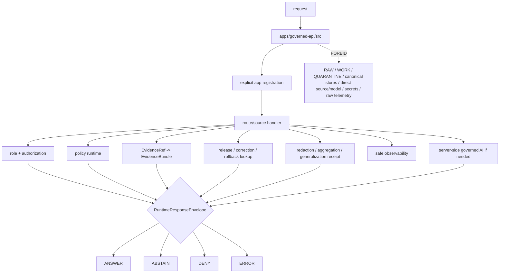

<!-- [KFM_META_BLOCK_V2]
doc_id: kfm://app/governed-api/src/readme
title: Governed API Source README
type: app-readme
version: v0.2
status: draft
owners: OWNER_TBD — API steward · Route steward · Policy steward · Evidence steward · Release steward · Runtime steward · Security steward · Privacy steward · Audit steward · Docs steward
created: 2026-06-16
updated: 2026-07-09
policy_label: public
related:
  - ../README.md
  - ../routes/README.md
  - ../routes/domains/README.md
  - ./governed_api/README.md
  - ./governed_api/routes/README.md
  - ./routes/README.md
  - ./routes/agriculture/README.md
  - ./ai/README.md
  - ../../README.md
  - ../../explorer-web/README.md
  - ../../../docs/doctrine/directory-rules.md
  - ../../../docs/adr/ADR-0004-apps-governed-api-is-the-trust-membrane.md
  - ../../../docs/architecture/governed-ai/FOCUS_FLOW.md
  - ../../../schemas/contracts/v1/runtime/
  - ../../../schemas/contracts/v1/domains/
  - ../../../schemas/contracts/v1/evidence/
  - ../../../schemas/contracts/v1/focus/
  - ../../../contracts/runtime/
  - ../../../contracts/domains/
  - ../../../contracts/evidence/
  - ../../../contracts/focus/
  - ../../../policy/access/README.md
  - ../../../policy/decision/README.md
  - ../../../policy/domains/README.md
  - ../../../policy/telemetry/README.md
  - ../../../packages/evidence-resolver/README.md
  - ../../../packages/policy-runtime/README.md
  - ../../../runtime/README.md
  - ../../../release/README.md
  - ../../../data/README.md
tags: [kfm, apps, governed-api, src, trust-membrane, runtime-response-envelope, finite-outcomes, evidencebundle, policydecision, release-manifest, safe-errors, safe-observability, source-tree-boundary]
notes:
  - "Refreshes the bounded governed-api source-tree contract."
  - "This path is app-local implementation source for the Governed API; it is not a schema, contract, policy, lifecycle, release, proof, receipt, package-extraction, runtime-adapter, telemetry-policy, audit-store, or public-UI authority root."
  - "Source files may implement app bootstrap, route registration, middleware, DTO mapping, finite envelope construction, authorization handoff, policy/evidence/release lookups, transform receipt handling, governed AI orchestration, safe errors, safe observability, and audit-safe refs, but only as implementation support beneath the app contract."
  - "Source files, route wiring, DTOs, middleware, schemas, tests, fixtures, authorization, policy enforcement, evidence resolution, release lookup, transform receipt support, safe logging, safe telemetry, deployment state, dashboards, and CI pass state remain NEEDS VERIFICATION."
  - "Child README refreshes for src/ai, src/governed_api, src/governed_api/routes, src/routes, and src/routes/agriculture may exist as separate draft PRs; this source-tree README does not claim those changes are merged unless verified on the target ref."
  - "v0.2 adds a current evidence basis, Directory Rules placement basis, child-source alignment, minimum safe source-tree slice, runtime anti-bypass matrix, stronger safe-observability and AI-boundary gates, import/registration controls, source/package route reconciliation, and validation/definition-of-done updates without claiming runtime maturity."
[/KFM_META_BLOCK_V2] -->

<a id="top"></a>

<div align="center">

# Governed API Source

`apps/governed-api/src/`

**App-local implementation source boundary for the Governed API trust membrane: app bootstrap, route registration, route-source modules, Python package modules, middleware, request parsing, DTO mapping, finite-envelope assembly, response validation, authorization handoff, policy/evidence/release/transform integration, governed AI orchestration, safe errors, safe observability, and audit-safe references — without becoming a parallel authority root.**


[Evidence](#0-evidence-basis-for-this-revision) · [Purpose](#1-purpose) · [Repo fit](#2-repo-fit) · [Boundary](#3-authority-boundary) · [Inputs](#5-inputs) · [Exclusions](#6-exclusions) · [Source map](#7-source-family-map) · [Minimum slice](#8-minimum-safe-source-tree-slice) · [Definition of done](#16-definition-of-done)

</div>

---

> [!IMPORTANT]
> **Status:** draft / `NEEDS VERIFICATION`  
> **Owners:** `OWNER_TBD` — API steward · Route steward · Policy steward · Evidence steward · Release steward · Runtime steward · Security steward · Privacy steward · Audit steward · Docs steward  
> **Path:** `apps/governed-api/src/README.md`  
> **Responsibility root:** `apps/` — deployable application surfaces  
> **Directory Rules basis:** executable app-local source belongs under the deployable Governed API app source tree. `src/` is implementation support under `apps/governed-api/`; it is not a schema home, contract home, policy home, lifecycle-data lane, release authority, proof/receipt store, package-extraction root, runtime-adapter package, public UI, telemetry policy root, or audit store.  
> **Truth posture:** CONFIRMED current GitHub README path / CONFIRMED governed-api app README exists / CONFIRMED app-level route-tree README exists / CONFIRMED source-route README exists on `main` / CONFIRMED source Agriculture route README exists on `main` / CONFIRMED Python package README exists on `main` / CONFIRMED package-local route README exists as blank on `main` at recent verification / CONFIRMED Directory Rules document exists / PROPOSED source-tree contract / UNKNOWN source files, route handlers, routers, DTOs, middleware, schemas, tests, fixtures, authorization, policy runtime integration, evidence resolver integration, release lookup, transform receipt support, safe logging, safe telemetry, deployment state, dashboards, CI pass state, and runtime behavior

> [!CAUTION]
> `src/` is implementation source, not sovereignty. Code in this tree may enforce and compose governed responses, but it must not redefine schema authority, contract meaning, policy rules, EvidenceBundle truth, release decisions, lifecycle storage, runtime-adapter authority, telemetry policy, audit truth, domain doctrine, or public UI behavior. It must not return raw lifecycle content, unpublished candidates, source-system internals, stack traces, prompt text, raw model output as truth, protected geometry, credentials, or direct filesystem references.

---

## Quick jump

- [0. Evidence basis for this revision](#0-evidence-basis-for-this-revision)
- [1. Purpose](#1-purpose)
- [2. Repo fit](#2-repo-fit)
- [3. Authority boundary](#3-authority-boundary)
- [4. Default posture](#4-default-posture)
- [5. Inputs](#5-inputs)
- [6. Exclusions](#6-exclusions)
- [7. Source family map](#7-source-family-map)
- [8. Minimum safe source-tree slice](#8-minimum-safe-source-tree-slice)
- [9. Diagram](#9-diagram)
- [10. Runtime outcome contract](#10-runtime-outcome-contract)
- [11. Source-tree obligations](#11-source-tree-obligations)
- [12. Runtime anti-bypass matrix](#12-runtime-anti-bypass-matrix)
- [13. Inspection path](#13-inspection-path)
- [14. Validation expectations](#14-validation-expectations)
- [15. Safe change pattern](#15-safe-change-pattern)
- [16. Definition of done](#16-definition-of-done)
- [17. Open verification items](#17-open-verification-items)

---

## 0. Evidence basis for this revision

This README is a documentation boundary, not runtime proof. The 2026-07-09 revision updates an existing README and keeps implementation maturity bounded while aligning the source tree with governed-api app, route-tree, Python-package, route-source, Agriculture route-source, and governed-AI source-boundary patterns.

| Evidence item | Status | What it supports | What it does not prove |
|---|---|---|---|
| `apps/governed-api/src/README.md` exists on `main`. | CONFIRMED | This is an existing README update, not a new path proposal. | It does not prove source modules, route handlers, middleware, DTOs, fixtures, tests, deployment, logs, dashboards, or runtime behavior exist. |
| `apps/governed-api/README.md` exists and describes the app as the normal public trust path for finite governed envelopes. | CONFIRMED document presence and trust-membrane posture | `src/` implementation must preserve finite governed envelopes and public-safe projections. | It does not prove runtime enforcement or endpoint behavior. |
| `apps/governed-api/routes/README.md` exists and states route folders are not authority roots. | CONFIRMED document presence and route-tree posture | Source code must implement and project, not absorb route doctrine, schemas, contracts, policy, data, release, package, runtime, or UI authority. | It does not prove route-tree implementation wiring. |
| `apps/governed-api/src/governed_api/README.md` exists on `main`. | CONFIRMED document presence | The Python package is app-local implementation support beneath this source-tree boundary. | It does not prove package import configuration or route registration behavior. |
| `apps/governed-api/src/governed_api/routes/README.md` exists as a blank file on `main` at recent verification. | CONFIRMED blank child README state | Package-local route implementation needs explicit reconciliation with `src/routes/` and app-level route docs. | It does not prove route implementation modules or that any separate child README draft has merged. |
| `apps/governed-api/src/routes/README.md` exists on `main`. | CONFIRMED document presence | `src/routes/` is a source-route implementation boundary beneath `src/`. | It does not prove route source files, handlers, tests, or registration behavior. |
| `apps/governed-api/src/routes/agriculture/README.md` exists on `main`. | CONFIRMED document presence | Agriculture route-source is a domain-specific child source boundary. | It does not prove Agriculture route source modules or policy runtime integration. |
| `apps/governed-api/src/ai/README.md` may have separate draft updates. | NEEDS VERIFICATION on `main` unless fetched at target ref | Governed AI source work must stay server-side and bounded by evidence/policy/citation gates. | It does not prove model adapters, prompt handling, AIReceipt behavior, or runtime tests. |
| `docs/doctrine/directory-rules.md` exists and identifies root placement as ownership/lifecycle governance; `apps/` is the deployable implementation root. | CONFIRMED document presence and placement posture | `apps/governed-api/src/` is app-local implementation support under a deployable app. | It does not prove source code is complete, tested, deployed, or release-ready. |

[Back to top](#top)

---

## 1. Purpose

`apps/governed-api/src/` is the proposed implementation source tree for the Governed API app.

It may eventually contain source modules for:

- application bootstrapping, app factory, dependency wiring, and route registration;
- route-family mounting, route-source modules, and package-local route modules;
- request parsing, DTO mapping, and response projection;
- authorization and caller-role resolution;
- policy precheck and postcheck orchestration;
- EvidenceRef-to-EvidenceBundle resolver orchestration;
- release, correction, rollback, stale-state, review-state, and transform projection;
- finite `RuntimeResponseEnvelope` construction and validation;
- public-safe redaction, generalization, aggregation, delay, suppression, and denial mapping;
- server-side runtime/model adapter invocation for AI-assisted surfaces;
- audit-safe request, decision, evidence, release, transform, citation, and AIReceipt references;
- safe logging, metrics, telemetry, diagnostics, cache-key, and safe error discipline.

This directory is not proof that any source module, route handler, router, middleware, adapter, DTO, schema binding, fixture, test, package script, deployment, log, dashboard, CI pass state, or runtime behavior exists.

[Back to top](#top)

---

## 2. Repo fit

| Concern | Owning root | Expected relationship |
|---|---|---|
| Governed API source | `apps/governed-api/src/` | App-local implementation source beneath the deployable Governed API app |
| Governed API app contract | `apps/governed-api/README.md` | App-level trust membrane contract |
| App-level route docs | `apps/governed-api/routes/` | Route-family documentation and organization; distinct from implementation source |
| Python package boundary | `apps/governed-api/src/governed_api/` | App-local import package boundary, if used |
| Package-local route subtree | `apps/governed-api/src/governed_api/routes/` | Package-local route-handler subtree; blank README on `main` at recent verification |
| Source-route boundary | `apps/governed-api/src/routes/` | App-local source route modules, if implemented |
| Domain source routes | `apps/governed-api/src/routes/<domain>/` | Domain-specific route-source modules, if implemented and verified |
| Governed AI source | `apps/governed-api/src/ai/` or package-local AI modules | Server-side governed AI orchestration only, not browser model path |
| Runtime schemas/contracts | `schemas/contracts/v1/runtime/`, `contracts/runtime/` | Runtime envelope machine shape and object meaning |
| Domain schemas/contracts | `schemas/contracts/v1/domains/`, `contracts/domains/` | Domain payload shape and object meaning, if present and accepted |
| Evidence schemas/contracts | `schemas/contracts/v1/evidence/`, `contracts/evidence/` | Evidence projection shape and object meaning, if present and accepted |
| Focus schemas/contracts | `schemas/contracts/v1/focus/`, `contracts/focus/` | Focus payload shape and object meaning, if present and accepted |
| Policy support | `policy/`, `packages/policy-runtime/` | Admissibility and evaluator support; source code invokes, not authors |
| Evidence support | `packages/evidence-resolver/`, `data/proofs/` | EvidenceBundle support behind the membrane |
| Release authority | `release/` | Release decisions, correction notices, rollback cards |
| Lifecycle artifacts | `data/` | Source lifecycle, receipts, proofs, registry, catalog, triplets, and published outputs |
| Runtime adapters | `runtime/` | Adapter lane behind governed API |
| Shared helpers | `packages/` | Reusable helpers only after extraction and ownership review |
| Client UI | `apps/explorer-web/` | Consumer of governed responses, not source authority |

## 3. Authority boundary

This folder may hold executable source for the app. It does not own schemas, contracts, policy, data, release decisions, proofs, receipts, source acquisition, runtime-adapter implementation, shared packages, public UI rendering, operational deployment configuration, emitted artifacts, telemetry policy, audit truth, or model truth.

```text
apps/governed-api/src/                  = app-local implementation source
apps/governed-api/src/governed_api/     = app-local Python package boundary, if used
apps/governed-api/src/governed_api/routes/ = package-local route implementation subtree, if used
apps/governed-api/src/routes/           = source-route implementation boundary, if used
apps/governed-api/routes/               = route-family docs and organization
apps/governed-api/                      = trust membrane app contract
schemas/contracts/v1/                   = machine shape
contracts/                              = object meaning
policy/                                 = policy rules and documentation
data/                                   = lifecycle artifacts, receipts, proofs, registries
release/                                = publication, correction, rollback authority
packages/                               = reusable helpers after extraction/review
runtime/                                = adapters behind governed API
apps/explorer-web/                      = client UI consumer
```

## 4. Default posture

Source modules should fail closed. No module should emit, validate, map, forward, log, cache, or observe a trust-bearing result unless it can preserve the finite envelope, policy decision, evidence support, release/correction/rollback refs, citations, redactions, stale-state, transform refs, limitations, and audit-safe references required by the app contract.

A source path should not emit or pass through `ANSWER` when any of these are unresolved:

- request schema, route action, and route-family ownership;
- caller role, endpoint authorization, and audience posture;
- endpoint policy and domain policy where applicable;
- EvidenceRef-to-EvidenceBundle support for claim-bearing responses;
- release manifest, correction, rollback, review, stale, freshness, or withdrawal/supersession state where material;
- source role, rights, sensitivity, redaction, aggregation, generalization, delay, suppression, or transform receipt where material;
- citation validation, limitation fields, and cite-or-abstain posture;
- candidate/inferred/model-derived labeling where material;
- server-side adapter constraints for AI-assisted responses;
- response-envelope validation;
- safe logging, telemetry, diagnostics, and cache-key posture;
- audit-safe request and decision references.

## 5. Inputs

| Input family | Examples | Required posture |
|---|---|---|
| Request context | route action, params, selected layer, evidence ref, feature ref, domain slug, caller role | Schema-validated and bounded |
| Runtime envelope | `RuntimeResponseEnvelope`, `DecisionEnvelope`, reason codes, audit refs | Exactly one finite outcome |
| Evidence context | EvidenceRef, EvidenceBundle refs, source roles, citations, limitations | Resolver behind governed API |
| Policy context | role, rights, sensitivity, release, stale state, transform requirement | Policy gate required |
| Release context | release manifest, correction notice, rollback card, artifact digest, withdrawal/supersession state | Required where response depends on released artifacts |
| Domain context | domain slug, object family, candidate/confirmed status, cross-domain refs | Domain-owned or explicitly referenced |
| Transform context | aggregation, redaction, generalization, delay, suppression, transform receipt | Receipt-backed or reason-coded |
| Runtime/AI context | server-side adapter result, Focus response, AIReceipt ref | Behind membrane; never direct browser call |
| Error context | schema failure, policy denial, missing evidence, stale support, adapter fault | Safe reason code only |
| Observability context | request id, route id, coarse outcome, latency bucket, safe diagnostic refs | No raw evidence, prompts, model output, restricted geometry, PII, secrets, or provider traces |

## 6. Exclusions

| Does not belong here | Correct home |
|---|---|
| App-level trust-membrane contract | `apps/governed-api/README.md` |
| Route-family docs | `apps/governed-api/routes/` |
| Domain doctrine and scope | `docs/domains/<domain>/` |
| Policy rules or policy bundles | `policy/` |
| Schemas and contracts | `schemas/contracts/v1/`, `contracts/` |
| Source data, lifecycle artifacts, receipts, proofs, registry, catalog, triplets, published outputs | `data/` |
| Release decisions, correction notices, rollback cards | `release/` |
| Source acquisition and ingest adapters | `connectors/`, `pipelines/`, `pipeline_specs/` |
| Shared helpers reusable across apps | `packages/` after extraction and review |
| Runtime/model adapter implementation authority | `runtime/` or accepted runtime package |
| Public UI rendering | `apps/explorer-web/` |
| Steward/admin UI rendering | `apps/review-console/`, `apps/admin/` |
| Telemetry policy and event schema authority | `policy/telemetry/`, schemas/contracts as accepted |
| Audit/provenance canonical stores | governance/audit/provenance roots as accepted, not ad hoc source files |
| Direct public lifecycle/canonical reads | Forbidden; use finite governed envelopes |
| Direct public runtime/model calls | Forbidden; use governed server-side adapters only |
| Prompt text, raw model output, provider traces, chain-of-thought, secrets, filesystem paths, restricted geometry, or exact sensitive payloads in errors/logs/telemetry/cache keys | Forbidden |
| Deployment-only values | Deployment environment and config channels, not source tree docs |

## 7. Source family map

Exact source files and implementation status remain `NEEDS VERIFICATION`.

| Candidate source family | Purpose | Required safeguard | Status |
|---|---|---|---|
| `app` / `server` | App bootstrap, runtime configuration, route registration | No direct trust-bearing bypass | PROPOSED |
| `governed_api` | Python import package boundary | No parallel package authority | PROPOSED |
| `governed_api/routes` | Package-local route handlers if used | Reconcile with `src/routes` and app-level route docs | PROPOSED / README blank on `main` at recent verification |
| `routes` | Route-source modules | Route contracts and envelope validation | PROPOSED |
| `routes/agriculture` | Agriculture route-source modules | Aggregate/public-safe default and field/operator denial | PROPOSED |
| `ai` | Server-side governed AI orchestration | No browser-model path, no raw model truth | PROPOSED |
| `middleware` | Auth, role, policy, request id, rate/size guards | Fail closed | PROPOSED |
| `envelopes` | Build and validate finite responses | Four outcome grammar only | PROPOSED |
| `dto` / `mappers` | Map internal support to public-safe payloads | Redaction and limitation preservation | PROPOSED |
| `policy` | Invoke policy runtime, not author policy | Policy refs preserved | PROPOSED |
| `evidence` | Invoke evidence resolver, not author proofs | EvidenceBundle refs preserved | PROPOSED |
| `release` | Lookup release/correction/rollback state | Release refs preserved | PROPOSED |
| `transforms` | Apply/report redaction, aggregation, generalization, delay, suppression | Receipt-backed or reason-coded | PROPOSED |
| `adapters` | Orchestrate server-side runtime/model adapters | No direct browser access | PROPOSED |
| `errors` | Convert faults to safe `ERROR` envelopes | No internal leakage | PROPOSED |
| `observability` | Safe logs, metrics, telemetry, diagnostics, cache keys | No raw evidence/model/secret leakage | PROPOSED |
| `audit` | Attach audit-safe request and decision refs | No raw payload leakage | PROPOSED |

> [!WARNING]
> Candidate source-family names are not implementation proof. Do not document a module as live until files, tests, schemas, fixtures, policy gates, middleware, route registration, deployment evidence, and current CI evidence confirm it.

## 8. Minimum safe source-tree slice

A smallest useful source-tree slice should prove finite envelopes and trust-membrane behavior before adding route breadth.

| Slice item | Minimum requirement | Why it is required |
|---|---|---|
| Source inventory | Document modules, owners, route registrations, and package/source-route relationship | Prevents hidden implementation authority |
| Route registration guard | Importing modules does not publish routes or mutate state without explicit app registration | Prevents import side effects |
| Finite envelope builder | Every trust-bearing path returns `ANSWER`, `ABSTAIN`, `DENY`, or `ERROR` | Prevents untyped success/failure |
| Authorization guard | Caller role and endpoint access fail closed | Prevents public/restricted collapse |
| Policy/evidence/release gate | Claims require policy, evidence, release, review, citation, and transform support where material | Preserves cite-or-abstain and release state |
| Transform receipt guard | Redaction/aggregation/generalization/delay/suppression is receipt-backed or reason-coded | Preserves auditability |
| Safe-error guard | Errors expose safe reason codes only | Prevents internal leakage |
| Safe-observability guard | Logs, metrics, telemetry, diagnostics, and cache keys exclude raw evidence, prompts, model output, restricted geometry, PII, secrets, provider traces, and full bundle copies | Prevents side-channel leakage |
| AI-boundary guard | Model/runtime adapters are server-side only; raw model output and chain-of-thought never become public truth | Preserves governed AI boundary |
| Lifecycle denial guard | Source code cannot expose RAW/WORK/QUARANTINE/canonical/internal stores directly to public routes | Preserves lifecycle law |
| Source/package route reconciliation | `src/routes`, `src/governed_api/routes`, and `apps/governed-api/routes` remain distinct and reconciled | Prevents parallel route authority |

This slice is still `PROPOSED` until files, fixtures, tests, route wiring, CI, and operational evidence are verified.

## 9. Diagram



## 10. Runtime outcome contract

Every trust-bearing source path should build or validate exactly one runtime status.

| Status | Meaning | Source-tree posture |
|---|---|---|
| `ANSWER` | Safe, released, evidence-backed, policy-supported response exists | Include evidence, policy, release, transform, limitation, citation, freshness, and audit refs where material |
| `ABSTAIN` | Evidence, review, freshness, source role, rights, transform, narrowing support, or scope is insufficient | Explain the held reason without fabricating an answer |
| `DENY` | Policy, rights, sensitivity, role, review, release, exposure risk, or source terms block response | Avoid leaking blocked material or exposure hints |
| `ERROR` | Runtime, adapter, schema, validation, or infrastructure fault prevents reliable response | Return audit-safe fault reference only |

## 11. Source-tree obligations

| Obligation | Example effect |
|---|---|
| `finite_outcomes_required` | No route emits untyped success, empty success, silent partial, or generated fallback |
| `authorization_required` | Caller role and endpoint access are resolved before sensitive work |
| `policy_required` | Sensitivity, rights, review, release, source-role, and transform obligations are checked |
| `evidence_required` | Claim-bearing `ANSWER` requires EvidenceBundle support |
| `release_refs_required` | Released public artifacts carry release/correction/rollback refs where material |
| `transform_receipt_required` | Redaction/generalization/aggregation/delay/suppression must be receipt-backed or reason-coded |
| `safe_error_only` | Errors do not expose protected details, internal routes, resolver state, stack traces, filesystem paths, or secrets |
| `safe_observability_only` | Logs, metrics, telemetry, diagnostics, and cache keys do not carry raw evidence, prompts, model output, restricted geometry, PII, provider traces, or secrets |
| `read_only_mutation_split` | Read-only routes cannot write review decisions, lifecycle state, evidence refs, releases, receipts, audit stores, or provenance stores |
| `adapter_boundary_preserved` | Runtime/model adapters are invoked server-side only behind the membrane |
| `route_docs_distinct_from_source` | `apps/governed-api/routes/` remains docs/organization; `src/` remains implementation source |
| `package_routes_distinct_from_source_routes` | `src/governed_api/routes/` is package-local implementation if used; it must not create a parallel route authority |
| `import_side_effects_controlled` | Importing source modules does not publish routes or mutate state without explicit app registration |
| `no_parallel_authority` | Source code does not redefine schema, contract, policy, release, data, proof, receipt, telemetry-policy, domain, or audit authority |

## 12. Runtime anti-bypass matrix

| Bypass risk | Required behavior | Review signal |
|---|---|---|
| Source path returns plain dict/string instead of finite envelope | Deny in review; wrap in validated `RuntimeResponseEnvelope` | Response-shape fixture rejects untyped return |
| Source path reads lifecycle/canonical/internal stores directly for public response | Deny; route through governed services and projections | Import/fetch scan and tests block direct public reads |
| Missing evidence produces generated answer | Return `ABSTAIN` with reason | Missing-evidence fixture blocks answer |
| Policy denial leaks blocked details | Return `DENY` with safe reason only | Sensitive-denial fixture hides protected payload |
| Transform lacks receipt/reference | Return `ABSTAIN`, `DENY`, or safe bounded alternative | Transform-missing fixture blocks public response |
| Source route silently diverges from package route | Require documented ownership and registration boundary | Source/package route inventory reconciles both paths |
| Import publishes routes or mutates state | Require explicit app registration and no import side effects | Import-side-effect fixture passes |
| Read-only route writes review/lifecycle/evidence/release/receipt state | Deny; split mutating route with authorization/audit | Read-only mutation fixture fails on writes |
| Error exposes stack trace/internal path/secret | Return safe `ERROR` envelope | Safe-error fixture blocks leakage |
| Logs/telemetry/cache key include prompt/raw evidence/restricted geometry | Redact, hash, bucket, or omit | Safe-observability fixture blocks leakage |
| AI-assisted route exposes browser-to-model path or raw model output | Deny; use server-side governed AI orchestration and bounded envelope | Network/import scan blocks model provider access from client route |
| Source module embeds schema/policy/release constants as authority | Move to owning roots or generated bindings | Review finds no parallel authority tables |
| Shared helper hardens inside app source | Extract to `packages/` only after ownership review | Reuse review avoids accidental shared-root drift |

## 13. Inspection path

Source files, route handlers, routers, DTOs, middleware, schemas, fixtures, tests, authorization, policy integration, evidence resolution, release lookup, transform receipt support, safe-error behavior, safe logging/telemetry/cache behavior, deployment state, dashboards, and emitted artifacts remain `NEEDS VERIFICATION`.

```bash
find apps/governed-api/src -maxdepth 6 -type f | sort
find apps/governed-api/src/governed_api/routes -maxdepth 6 -type f 2>/dev/null | sort
find apps/governed-api/src apps/governed-api/routes runtime packages schemas contracts policy release data tests fixtures .github/workflows -maxdepth 6 -type f 2>/dev/null | grep -Ei 'RuntimeResponseEnvelope|DecisionEnvelope|EvidenceBundle|EvidenceRef|PolicyDecision|ReleaseManifest|CorrectionNotice|RollbackCard|AIReceipt|CitationValidationReport|RedactionReceipt|ReviewRecord|SensitivityTransform|runtime.?bootstrap|domains|agriculture|archaeology|layers|evidence|focus|story|export|review|correction|diagnostic|abstain|deny|error|route|middleware|dto|mapper|audit|safe.?log|telemetry|cache|test|fixture' | sort
find data/raw data/work data/quarantine data/processed data/catalog data/triplets data/published data/receipts data/proofs -maxdepth 2 -type f 2>/dev/null | sort
```

## 14. Validation expectations

Useful validation for this source tree should cover:

- every trust-bearing route returns exactly one `ANSWER`, `ABSTAIN`, `DENY`, or `ERROR` status;
- request and response DTOs validate against accepted schemas/contracts;
- authorization and caller role resolution fail closed;
- unresolved review, rights, release, transform, sensitivity, source-role posture, or stale evidence fails closed;
- sensitive exact or protected details are denied unless a reviewed transform and release path explicitly allows a bounded response;
- candidate, inferred, modeled, or low-confidence objects remain labeled and cannot become confirmed observations through route language;
- missing, stale, weak, conflicting, or unresolved evidence returns `ABSTAIN` rather than generated filler;
- policy denial returns `DENY` without blocked detail or exposure hints;
- schema, adapter, resolver, or infrastructure faults return `ERROR` with safe details only;
- response envelopes preserve evidence refs, policy decision refs, release refs, correction refs, rollback refs, citations, limitations, redactions, stale state, transform refs, reason codes, and audit refs where material;
- read-only routes cannot mutate review decisions, lifecycle state, EvidenceRefs, releases, receipts, audit stores, or provenance stores;
- `src/routes`, `src/governed_api/routes`, and `apps/governed-api/routes` are reconciled so no parallel route authority emerges;
- imports do not register routes, write state, fetch sources, call models, or mutate lifecycle artifacts unless explicitly invoked by app wiring;
- logs, metrics, telemetry, diagnostics, and cache keys do not include prompts, raw evidence, raw outputs, restricted geometry, PII, secrets, provider traces, internal handles, or full bundle copies;
- AI-assisted paths do not expose raw model output, private chain-of-thought, provider traces, or browser-to-model shortcuts.

## 15. Safe change pattern

For source-tree changes:

1. Add or update source inventory and source-family contract.
2. Reconcile `apps/governed-api/src/`, `apps/governed-api/src/routes/`, `apps/governed-api/src/governed_api/`, `apps/governed-api/src/governed_api/routes/`, and `apps/governed-api/routes/` so implementation, package, and documentation responsibilities remain distinct.
3. Link DTOs to runtime, route-family, domain, evidence, policy, release, transform, export, and AI/citation schemas before changing response shape.
4. Add fixtures for `ANSWER`, `ABSTAIN`, `DENY`, `ERROR`, policy denial, missing evidence, stale evidence, unresolved review, transform missing, release missing, safe error, unsafe logging, unsafe telemetry, unsafe cache key, candidate-not-confirmed, unauthorized caller, read-only mutation denied, import side-effect denied, and browser-model denied cases.
5. Add authorization, policy, safe-error, safe-observability, evidence, release, transform, read-only/mutation-boundary, no-browser-model, and AI-boundary tests before exposing any public route.
6. Preserve evidence refs, policy decision refs, release refs, correction refs, rollback refs, citations, limitations, redactions, stale state, transform refs, AIReceipt refs where applicable, and audit refs through every response.
7. Update this README, child source READMEs, `apps/governed-api/README.md`, route READMEs, affected domain/feature docs, policy docs, schemas/contracts, fixtures, and tests when source behavior materially changes.

## 16. Definition of done

- [ ] Owners are confirmed and `OWNER_TBD` is replaced.
- [ ] Evidence basis is refreshed when app docs, route docs, package docs, child source docs, schemas, contracts, policy, evidence resolver, release, runtime, fixtures, tests, workflow, telemetry, or deployment evidence changes.
- [ ] Source inventory and module ownership are documented.
- [ ] Relationship between `src/routes`, `src/governed_api/routes`, `src/governed_api`, app-level route docs, and AI source is documented.
- [ ] Package import name, packaging config, and route registration behavior are verified.
- [ ] Import-side-effect behavior is verified.
- [ ] Runtime envelope and DTO/schema bindings are verified.
- [ ] Authorization, policy runtime, evidence resolver, release lookup, transform receipt, and audit hooks are documented and tested.
- [ ] Finite outcome fixtures cover `ANSWER`, `ABSTAIN`, `DENY`, and `ERROR`.
- [ ] Sensitive-detail denial tests are present and passing.
- [ ] Candidate/inferred/model-derived-not-confirmed tests are present and passing.
- [ ] Missing-evidence and stale-evidence abstention tests are present and passing.
- [ ] Policy denial and sensitive-domain denial tests are present and passing.
- [ ] Transform-missing and release-missing tests are present and passing.
- [ ] Safe-error tests are present and passing.
- [ ] Safe logging, metrics, telemetry, cache-key, diagnostics, and observability tests are present and passing.
- [ ] Read-only vs mutating route boundaries are documented and tested.
- [ ] AI-assisted route no-raw-model-output and no-chain-of-thought tests are present and passing where applicable.

## 17. Open verification items

| Item | Why it matters |
|---|---|
| Confirm source files beyond this README | Prevents overclaiming runtime maturity |
| Confirm package import name and packaging config | Required before import/use claims |
| Confirm relationship between `src/routes` and `src/governed_api/routes` | Required to avoid duplicate implementation authority |
| Confirm route handlers and DTOs | Required before source behavior claims |
| Confirm authorization and role resolution | Required before public/restricted split claims |
| Confirm policy runtime integration | Required before sensitivity/rights/release claims |
| Confirm evidence resolver integration | Required before EvidenceBundle closure claims |
| Confirm release/correction/rollback lookup | Required before publication-state claims |
| Confirm transform receipt handling | Required before redacted/generalized output claims |
| Confirm safe-error behavior | Required before public exposure |
| Confirm safe logging, telemetry, metrics, cache-key, and diagnostics behavior | Required to prevent side-channel leakage |
| Confirm import-side-effect behavior | Required before app factory/route registration claims |
| Confirm no-browser-model and no-chain-of-thought behavior | Required before AI-assisted route exposure |
| Confirm test and fixture coverage | Required before runtime maturity claims |
| Confirm deployment, logs, dashboards, and audit receipts | Required before operational claims |
| Confirm CI workflow presence and latest pass state | Required before CI claims |

<details>
<summary>Appendix A — no-loss preservation note</summary>

The previous README already contained a bounded governed-api source-tree contract. This revision preserves that contract, refreshes metadata, adds a current evidence-basis section, adds Directory Rules placement posture, aligns child source/package/route boundaries, strengthens minimum source-tree slice, finite-envelope, authorization, policy/evidence/release/transform, safe-error, safe observability, import/registration, AI-boundary, route-source reconciliation, and anti-bypass safeguards, and keeps implementation claims bounded. It does not claim source files, route handlers, DTOs, schemas, middleware, authorization, policy enforcement, evidence resolution, release lookup, transform receipt support, tests, fixtures, deployment, logs, dashboards, telemetry, or CI pass state are implemented.

</details>

## Status summary

`apps/governed-api/src/` should contain app-local implementation source only after source inventory, DTOs, route bindings, schemas, authorization, policy runtime integration, evidence resolver integration, release/correction/rollback lookups, transform receipt support, safe-error behavior, safe logging/telemetry/cache behavior, finite-outcome fixtures, tests, and operational evidence are verified.

It must preserve the trust membrane and source-tree boundary: source code may enforce and compose governed finite envelopes, but it must not become schema authority, contract authority, policy authority, lifecycle storage, release authority, proof storage, domain doctrine, direct source access, public UI rendering, runtime-adapter authority, unsafe observability channel, raw model-output surface, or unsupported generated answer surface.

<p align="right"><a href="#top">Back to top</a></p>
