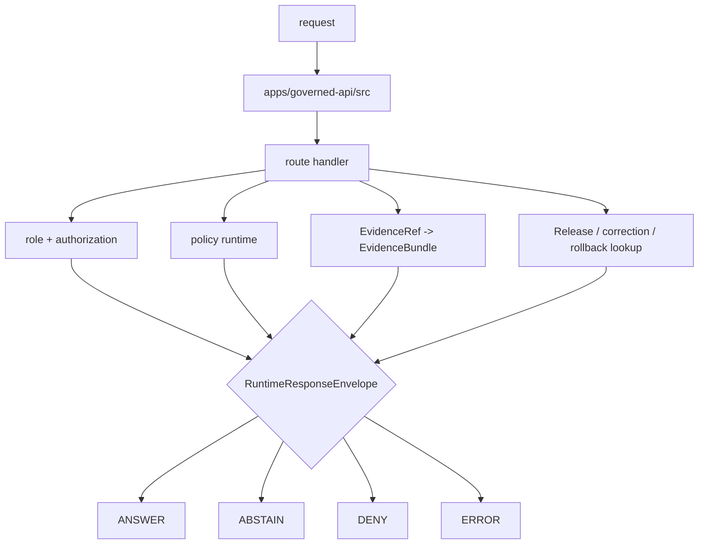

<!-- [KFM_META_BLOCK_V2]
doc_id: kfm://app/governed-api/src/readme
title: Governed API Source README
type: app-readme
version: v0.1
status: draft
owners: OWNER_TBD — API steward · Route steward · Policy steward · Evidence steward · Release steward · Runtime steward · Docs steward
created: 2026-06-16
updated: 2026-06-16
policy_label: public
related:
  - ../README.md
  - ../routes/README.md
  - ../../README.md
  - ../../explorer-web/README.md
  - ../../../docs/adr/ADR-0004-apps-governed-api-is-the-trust-membrane.md
  - ../../../schemas/contracts/v1/runtime/
  - ../../../contracts/runtime/
  - ../../../policy/access/README.md
  - ../../../policy/decision/README.md
  - ../../../packages/evidence-resolver/README.md
  - ../../../packages/policy-runtime/README.md
  - ../../../runtime/README.md
  - ../../../release/README.md
  - ../../../data/README.md
tags: [kfm, apps, governed-api, src, trust-membrane, runtime-response-envelope, finite-outcomes, evidencebundle, policydecision, release-manifest]
notes:
  - "Replaces an empty governed-api src README with a bounded source-tree contract."
  - "This path is app-local implementation source for the Governed API; it is not a schema, contract, policy, lifecycle, release, proof, package, runtime-adapter, or public-UI authority root."
  - "Source files, route wiring, DTOs, middleware, schemas, tests, fixtures, policy enforcement, deployment state, logs, dashboards, and CI pass state remain NEEDS VERIFICATION."
[/KFM_META_BLOCK_V2] -->

<a id="top"></a>

<div align="center">

# Governed API Source

`apps/governed-api/src/`

**App-local implementation source boundary for the Governed API trust membrane: route registration, request parsing, middleware, envelope construction, response validation, adapter orchestration, and safe projection logic that must preserve finite outcomes and never become a parallel authority root.**


[Purpose](#1-purpose) · [Repo fit](#2-repo-fit) · [Boundary](#3-authority-boundary) · [Inputs](#5-inputs) · [Exclusions](#6-exclusions) · [Source map](#7-source-family-map) · [Definition of done](#14-definition-of-done)

</div>

---

> [!IMPORTANT]
> **Status:** draft / `NEEDS VERIFICATION`  
> **Owners:** `OWNER_TBD` — API steward · Route steward · Policy steward · Evidence steward · Release steward · Runtime steward · Docs steward  
> **Path:** `apps/governed-api/src/README.md`  
> **Responsibility root:** `apps/` — deployable application surfaces  
> **Truth posture:** CONFIRMED README path / CONFIRMED governed-api trust-membrane doctrine / CONFIRMED route-tree README presence / PROPOSED source-tree contract / UNKNOWN source files, route handlers, DTOs, middleware, schemas, tests, fixtures, runtime behavior, deployment state, and CI pass state

> [!CAUTION]
> `src/` is implementation source, not sovereignty. Code in this tree may enforce and compose governed responses, but it must not redefine schema authority, contract meaning, policy rules, EvidenceBundle truth, release decisions, lifecycle storage, runtime-adapter authority, or public UI behavior.

---

## Quick jump

- [1. Purpose](#1-purpose)
- [2. Repo fit](#2-repo-fit)
- [3. Authority boundary](#3-authority-boundary)
- [4. Default posture](#4-default-posture)
- [5. Inputs](#5-inputs)
- [6. Exclusions](#6-exclusions)
- [7. Source family map](#7-source-family-map)
- [8. Diagram](#8-diagram)
- [9. Runtime outcome contract](#9-runtime-outcome-contract)
- [10. Source-tree obligations](#10-source-tree-obligations)
- [11. Inspection path](#11-inspection-path)
- [12. Validation expectations](#12-validation-expectations)
- [13. Safe change pattern](#13-safe-change-pattern)
- [14. Definition of done](#14-definition-of-done)
- [15. Open verification items](#15-open-verification-items)

---

## 1. Purpose

`apps/governed-api/src/` is the proposed implementation source tree for the Governed API app.

It may eventually contain source modules for:

- application bootstrapping and route registration;
- route-family mounting and request parsing;
- authorization and caller-role resolution;
- policy precheck and postcheck orchestration;
- EvidenceRef-to-EvidenceBundle resolver orchestration;
- release, correction, rollback, stale-state, and review-state projection;
- finite `RuntimeResponseEnvelope` construction and validation;
- DTO mapping and response redaction/generalization;
- server-side runtime/adapter invocation for AI-assisted surfaces;
- audit-safe request/decision references and safe error responses.

This directory is not proof that any source module, route handler, middleware, adapter, DTO, schema binding, fixture, test, package script, deployment, log, dashboard, or CI pass state exists.

[Back to top](#top)

---

## 2. Repo fit

| Concern | Owning root | Expected relationship |
|---|---|---|
| Governed API source | `apps/governed-api/src/` | App-local implementation source |
| Governed API app contract | `apps/governed-api/README.md` | App-level trust membrane contract |
| Route tree | `apps/governed-api/routes/` | Route-family organization and route docs |
| Runtime schemas | `schemas/contracts/v1/runtime/` | Machine shape for runtime envelopes |
| Runtime contracts | `contracts/runtime/` | Object meaning and envelope semantics |
| Policy support | `policy/`, `packages/policy-runtime/` | Admissibility and evaluator support |
| Evidence support | `packages/evidence-resolver/`, `data/proofs/` | EvidenceBundle support behind the membrane |
| Release authority | `release/` | Release decisions, correction notices, rollback cards |
| Lifecycle artifacts | `data/` | Source lifecycle, receipts, proofs, registry, catalog, triplets, and published outputs |
| Runtime adapters | `runtime/` | Adapter lane behind governed API |
| Client UI | `apps/explorer-web/` | Consumer of governed responses, not source authority |

## 3. Authority boundary

This folder may hold executable source for the app. It does not own schemas, contracts, policy, data, release decisions, proofs, receipts, source acquisition, runtime-adapter implementation, shared libraries, public UI rendering, operational deployment configuration, or emitted artifacts.

```text
apps/governed-api/src/ = app-local implementation source
apps/governed-api/     = trust membrane app contract
apps/governed-api/routes/ = route-family organization
schemas/contracts/v1/  = machine shape
contracts/             = object meaning
policy/                = policy rules and policy documentation
data/                  = lifecycle artifacts, receipts, proofs, registries
release/               = publication, correction, rollback authority
packages/              = reusable helpers
runtime/               = adapters behind governed API
apps/explorer-web/     = client UI consumer
```

## 4. Default posture

Source modules should fail closed. No module should return a trust-bearing result unless it can preserve the finite envelope, policy decision, evidence support, release/correction/rollback refs, citations, redactions, stale-state, limitations, and audit-safe references required by the app contract.

A source path should not emit or pass through `ANSWER` when any of these are unresolved:

- request schema and route action;
- caller role and authorization context;
- endpoint policy;
- EvidenceRef-to-EvidenceBundle support for claim-bearing responses;
- release manifest, correction, rollback, review, stale, or freshness state where material;
- source role, rights, sensitivity, redaction, generalization, or transform receipt where material;
- citation validation and limitation fields;
- server-side adapter constraints for AI-assisted responses;
- response-envelope validation;
- audit-safe request and decision references.

## 5. Inputs

| Input family | Examples | Required posture |
|---|---|---|
| Request context | route action, params, selected layer, evidence ref, feature ref, caller role | Schema-validated and bounded |
| Runtime envelope | `RuntimeResponseEnvelope`, `DecisionEnvelope`, reason codes, audit refs | Exactly one finite outcome |
| Evidence context | EvidenceRef, EvidenceBundle refs, source roles, citations, limitations | Resolver behind governed API |
| Policy context | role, rights, sensitivity, release, stale-state, transform requirement | Policy gate required |
| Release context | release manifest, correction notice, rollback card, artifact digest | Required where response depends on released artifacts |
| Domain context | domain slug, object family, candidate/confirmed status, cross-domain refs | Domain-owned or explicitly referenced |
| Runtime context | server-side adapter result, Focus response, AIReceipt ref | Behind membrane; never direct browser call |
| Error context | schema failure, policy denial, missing evidence, stale support, adapter fault | Safe reason code only |

## 6. Exclusions

| Does not belong here | Correct home |
|---|---|
| App-level trust-membrane contract | `apps/governed-api/README.md` |
| Route-family docs | `apps/governed-api/routes/` |
| Domain doctrine and scope | `docs/domains/<domain>/` |
| Policy rules or policy bundles | `policy/` |
| Schemas and contracts | `schemas/contracts/v1/`, `contracts/` |
| Source data, lifecycle artifacts, receipts, proofs, registry, catalog, triplets, published outputs | `data/` |
| Release decisions, correction notices, rollback cards | `release/` |
| Source acquisition and ingest adapters | `connectors/`, `pipelines/`, `pipeline_specs/` |
| Shared helpers reusable across apps | `packages/` after extraction and review |
| Public UI rendering | `apps/explorer-web/` |
| Steward/admin UI rendering | `apps/review-console/`, `apps/admin/` |
| Direct public lifecycle/canonical reads | Forbidden; use finite governed envelopes |
| Direct public runtime/model calls | Forbidden; use governed server-side adapters only |
| Deployment-only values | Deployment environment and config channels, not source tree docs |

## 7. Source family map

Exact source files and implementation status remain `NEEDS VERIFICATION`.

| Candidate source family | Purpose | Required safeguard | Status |
|---|---|---|---|
| `app` / `server` | App bootstrap, runtime configuration, route registration | No direct trust-bearing bypass | PROPOSED |
| `routes` | Bind route-family handlers to the app | Route contracts and envelope validation | PROPOSED |
| `middleware` | Auth, role, policy, request id, rate/size guards | Fail closed | PROPOSED |
| `envelopes` | Build and validate finite responses | Four outcome grammar only | PROPOSED |
| `dto` / `mappers` | Map internal support to public-safe payloads | Redaction and limitation preservation | PROPOSED |
| `policy` | Invoke policy runtime, not author policy | Policy refs preserved | PROPOSED |
| `evidence` | Invoke evidence resolver, not author proofs | EvidenceBundle refs preserved | PROPOSED |
| `release` | Lookup release/correction/rollback state | Release refs preserved | PROPOSED |
| `adapters` | Orchestrate server-side runtime adapters | No direct browser access | PROPOSED |
| `errors` | Convert faults to safe `ERROR` envelopes | No internal leakage | PROPOSED |
| `audit` | Attach audit-safe request and decision refs | No raw payload leakage | PROPOSED |

> [!WARNING]
> Candidate source-family names are not implementation proof. Do not document a module as live until files, tests, schemas, fixtures, policy gates, middleware, and deployment evidence confirm it.

## 8. Diagram



## 9. Runtime outcome contract

Every trust-bearing source path should build or validate exactly one runtime status.

| Status | Meaning | Source-tree posture |
|---|---|---|
| `ANSWER` | Safe, released, evidence-backed, policy-supported response exists | Include evidence, policy, release, transform, limitation, and citation refs where material |
| `ABSTAIN` | Evidence, review, freshness, source role, narrowing support, or scope is insufficient | Explain the held reason without fabricating an answer |
| `DENY` | Policy, rights, sensitivity, role, review, release, or exposure risk blocks response | Avoid leaking blocked material |
| `ERROR` | Runtime, adapter, schema, validation, or infrastructure fault prevents reliable response | Return audit-safe fault reference only |

## 10. Source-tree obligations

| Obligation | Example effect |
|---|---|
| `finite_outcomes_required` | No route emits untyped success, empty success, or silent partial |
| `policy_required` | Sensitivity, rights, review, release, and transform obligations are checked |
| `evidence_required` | Claim-bearing `ANSWER` requires EvidenceBundle support |
| `release_refs_required` | Released public artifacts carry release/correction/rollback refs where material |
| `safe_error_only` | Errors do not expose protected details or internal route/resolver state |
| `no_parallel_authority` | Source code does not redefine schema, contract, policy, release, data, or proof authority |
| `adapter_boundary_preserved` | Runtime adapters are invoked server-side only behind the membrane |
| `auditability_required` | Request, decision, release, evidence, and transform refs support later review |

## 11. Inspection path

Source files, route handlers, DTOs, middleware, schemas, fixtures, tests, policy integration, authorization, safe-error behavior, logs, dashboards, deployment state, and emitted artifacts remain `NEEDS VERIFICATION`.

```bash
find apps/governed-api/src -maxdepth 6 -type f | sort
find apps/governed-api routes runtime packages schemas contracts policy release data tests fixtures .github/workflows -maxdepth 6 -type f 2>/dev/null | grep -Ei 'RuntimeResponseEnvelope|DecisionEnvelope|EvidenceBundle|EvidenceRef|PolicyDecision|ReleaseManifest|CorrectionNotice|RollbackCard|AIReceipt|CitationValidationReport|runtime.?bootstrap|domains|layers|evidence|focus|story|export|review|correction|diagnostic|abstain|deny|error|route|middleware|dto|mapper|audit|test|fixture' | sort
```

## 12. Validation expectations

Useful validation for this source tree should cover:

- every trust-bearing route returns exactly one `ANSWER`, `ABSTAIN`, `DENY`, or `ERROR` status;
- unresolved review, rights, release, transform, sensitivity, or source-role posture fails closed;
- sensitive exact or protected details are denied unless a reviewed transform and release path explicitly allows a bounded response;
- candidate or inferred objects remain labeled and cannot become confirmed observations through route language;
- missing, stale, weak, conflicting, or unresolved evidence returns `ABSTAIN` rather than generated filler;
- policy denial returns `DENY` without blocked detail;
- schema, adapter, resolver, or infrastructure faults return `ERROR` with safe details only;
- response envelopes preserve evidence refs, policy decision refs, release refs, correction refs, rollback refs, citations, limitations, redactions, stale state, and reason codes where material.

## 13. Safe change pattern

For source-tree changes:

1. Add or update source inventory and source-family contract.
2. Link DTOs to runtime and route-family schemas before changing response shape.
3. Add fixtures for `ANSWER`, `ABSTAIN`, `DENY`, `ERROR`, policy denial, missing evidence, stale evidence, unresolved review, transform missing, release missing, and safe error cases.
4. Add policy and safe-error tests before exposing any public route.
5. Preserve evidence refs, policy decision refs, release refs, correction refs, rollback refs, citations, limitations, redactions, stale state, and audit refs through every response.
6. Update this README, `apps/governed-api/README.md`, route READMEs, affected domain/feature docs, policy docs, schemas/contracts, and tests when source behavior materially changes.

## 14. Definition of done

- [ ] Owners are confirmed and `OWNER_TBD` is replaced.
- [ ] Source inventory and module ownership are documented.
- [ ] Runtime envelope and DTO/schema bindings are verified.
- [ ] Authorization, policy runtime, evidence resolver, release lookup, transform receipt, and audit hooks are documented and tested.
- [ ] Finite outcome fixtures cover `ANSWER`, `ABSTAIN`, `DENY`, and `ERROR`.
- [ ] Sensitive-detail denial tests are present and passing.
- [ ] Candidate/inferred-not-confirmed tests are present and passing.
- [ ] Missing-evidence and stale-evidence abstention tests are present and passing.
- [ ] Policy denial and sensitive-domain denial tests are present and passing.
- [ ] Safe-error tests are present and passing.

## 15. Open verification items

| Item | Why it matters |
|---|---|
| Confirm source files beyond this README | Prevents overclaiming runtime maturity |
| Confirm route handlers and DTOs | Required before source behavior claims |
| Confirm authorization and role resolution | Required before public/restricted split claims |
| Confirm policy runtime integration | Required before sensitivity/rights/release claims |
| Confirm evidence resolver integration | Required before EvidenceBundle closure claims |
| Confirm release/correction/rollback lookup | Required before publication-state claims |
| Confirm transform receipt handling | Required before redacted/generalized output claims |
| Confirm safe-error behavior | Required before public exposure |
| Confirm test and fixture coverage | Required before runtime maturity claims |
| Confirm deployment, logs, dashboards, and audit receipts | Required before operational claims |

<details>
<summary>Appendix A — no-loss preservation note</summary>

The previous README was empty. This replacement adds a bounded governed-api source-tree contract without claiming source files, route handlers, DTOs, schemas, middleware, authorization, policy enforcement, evidence resolution, release lookup, transform receipt support, tests, fixtures, deployment, logs, dashboards, or CI pass state are implemented.

</details>

## Status summary

`apps/governed-api/src/` should contain app-local implementation source only after source inventory, DTOs, route bindings, schemas, authorization, policy runtime integration, evidence resolver integration, release/correction/rollback lookups, transform receipt support, safe-error behavior, finite-outcome fixtures, tests, and operational evidence are verified.

It must preserve the trust membrane and source-tree boundary: source code may enforce and compose governed finite envelopes, but it must not become schema authority, contract authority, policy authority, lifecycle storage, release authority, proof storage, domain doctrine, direct source access, public UI rendering, or unsupported generated answer surfaces.

<p align="right"><a href="#top">Back to top</a></p>
