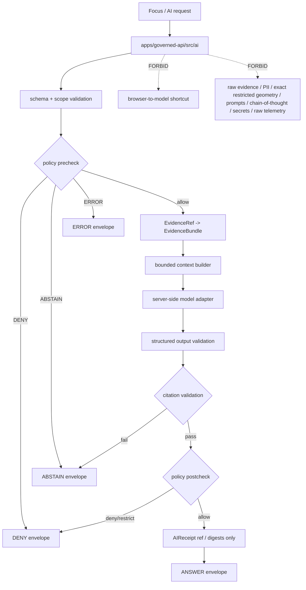

<!-- [KFM_META_BLOCK_V2]
doc_id: kfm://app/governed-api/src/ai/readme
title: Governed API AI Source README
type: app-readme
version: v0.2
status: draft
owners: OWNER_TBD — API steward · Governed AI steward · Policy steward · Evidence steward · Runtime steward · Citation steward · Security steward · Privacy steward · Audit steward · Docs steward
created: 2026-06-16
updated: 2026-07-09
policy_label: public
related:
  - ../README.md
  - ../../README.md
  - ../../routes/README.md
  - ../../routes/domains/README.md
  - ../../../README.md
  - ../../../explorer-web/README.md
  - ../../../../docs/doctrine/directory-rules.md
  - ../../../../docs/architecture/governed-ai/FOCUS_FLOW.md
  - ../../../../docs/architecture/governed-ai/BOUNDARIES.md
  - ../../../../docs/architecture/governed-ai/STATE_OWNERSHIP.md
  - ../../../../docs/architecture/governed-ai/ROUTE_MAP.md
  - ../../../../docs/adr/ADR-0004-apps-governed-api-is-the-trust-membrane.md
  - ../../../../schemas/contracts/v1/runtime/
  - ../../../../schemas/contracts/v1/focus/
  - ../../../../schemas/contracts/v1/evidence/
  - ../../../../contracts/runtime/
  - ../../../../contracts/focus/
  - ../../../../contracts/evidence/
  - ../../../../policy/focus/README.md
  - ../../../../policy/access/README.md
  - ../../../../policy/decision/README.md
  - ../../../../policy/telemetry/README.md
  - ../../../../packages/evidence-resolver/README.md
  - ../../../../packages/policy-runtime/README.md
  - ../../../../runtime/README.md
  - ../../../../data/README.md
  - ../../../../release/README.md
tags: [kfm, apps, governed-api, src, ai, governed-ai, focus-mode, model-adapter, bounded-context, citation-validation, ai-receipt, finite-outcomes, safe-errors, no-browser-model]
notes:
  - "Refreshes the bounded governed-api AI source-subtree contract."
  - "This path may orchestrate server-side governed AI flows, but it must not become model-runtime authority, evidence authority, policy authority, citation authority, schema authority, contract authority, lifecycle storage, release authority, receipt/proof storage, telemetry authority, or a browser-accessible model path."
  - "AI source files, adapter bindings, DTOs, middleware, schemas, tests, fixtures, authorization, policy enforcement, evidence resolution, citation validation, receipt handling, safe logging, safe telemetry, deployment state, logs, dashboards, and CI pass state remain NEEDS VERIFICATION."
  - "policy/focus/README.md currently exists as a greenfield bundle stub; executable Focus policy wiring remains NEEDS VERIFICATION."
  - "v0.2 adds a current evidence basis, Directory Rules placement basis, minimum safe AI source slice, runtime anti-bypass matrix, stronger bounded-context, no-browser-model, no-chain-of-thought, citation-validation, receipt-redaction, prompt/log/telemetry, safe-error, and model-adapter gates without claiming runtime maturity."
[/KFM_META_BLOCK_V2] -->

<a id="top"></a>

<div align="center">

# Governed API AI Source

`apps/governed-api/src/ai/`

**App-local source boundary for server-side governed AI orchestration inside the Governed API: Focus-style request handling, policy precheck/postcheck, EvidenceRef-to-EvidenceBundle resolution, bounded context assembly, model-adapter invocation, structured output validation, citation validation, AIReceipt reference handling, safe error handling, safe logging/telemetry posture, and finite runtime envelopes.**


[Evidence](#0-evidence-basis-for-this-revision) · [Purpose](#1-purpose) · [Repo fit](#2-repo-fit) · [Boundary](#3-authority-boundary) · [Inputs](#5-inputs) · [Exclusions](#6-exclusions) · [Source map](#7-ai-source-family-map) · [Minimum slice](#8-minimum-safe-ai-source-slice) · [Definition of done](#16-definition-of-done)

</div>

---

> [!IMPORTANT]
> **Status:** draft / `NEEDS VERIFICATION`  
> **Owners:** `OWNER_TBD` — API steward · Governed AI steward · Policy steward · Evidence steward · Runtime steward · Citation steward · Security steward · Privacy steward · Audit steward · Docs steward  
> **Path:** `apps/governed-api/src/ai/README.md`  
> **Responsibility root:** `apps/` — deployable application surfaces  
> **Directory Rules basis:** governed API source code belongs under the deployable app root `apps/governed-api/`; `src/ai/` is an app-local implementation subtree, not governed-AI doctrine, policy authority, schema authority, contract authority, evidence store, lifecycle-data lane, release authority, proof/receipt store, telemetry policy root, runtime-adapter package, public UI, or browser model path.  
> **Truth posture:** CONFIRMED current GitHub README path / CONFIRMED governed-api source-tree README exists / CONFIRMED governed-api trust-membrane README exists / CONFIRMED Focus Flow doctrine exists and requires request → policy → evidence → adapter → citation → policy → envelope / CONFIRMED Directory Rules document exists / CONFIRMED `policy/focus/README.md` exists as greenfield stub / PROPOSED AI source-subtree contract / UNKNOWN source files, adapters, DTOs, middleware, schemas, tests, fixtures, authorization, policy runtime integration, evidence resolver integration, citation validator integration, model adapter integration, receipt handling, safe logging, safe telemetry, deployment state, dashboards, CI pass state, and runtime behavior

> [!CAUTION]
> This path is for server-side governed AI orchestration only. It must not expose a browser-to-model shortcut, ship raw evidence or full EvidenceBundle copies to adapters, persist private chain-of-thought as truth, return uncited authoritative claims, leak prompts or protected context through logs/telemetry/errors, or bypass policy, evidence, citation, release, review, redaction, receipt, or finite outcome gates.

---

## Quick jump

- [0. Evidence basis for this revision](#0-evidence-basis-for-this-revision)
- [1. Purpose](#1-purpose)
- [2. Repo fit](#2-repo-fit)
- [3. Authority boundary](#3-authority-boundary)
- [4. Default posture](#4-default-posture)
- [5. Inputs](#5-inputs)
- [6. Exclusions](#6-exclusions)
- [7. AI source family map](#7-ai-source-family-map)
- [8. Minimum safe AI source slice](#8-minimum-safe-ai-source-slice)
- [9. Diagram](#9-diagram)
- [10. Runtime outcome contract](#10-runtime-outcome-contract)
- [11. Governed AI obligations](#11-governed-ai-obligations)
- [12. Runtime anti-bypass matrix](#12-runtime-anti-bypass-matrix)
- [13. Inspection path](#13-inspection-path)
- [14. Validation expectations](#14-validation-expectations)
- [15. Safe change pattern](#15-safe-change-pattern)
- [16. Definition of done](#16-definition-of-done)
- [17. Open verification items](#17-open-verification-items)

---

## 0. Evidence basis for this revision

This README is a documentation boundary, not runtime proof. The 2026-07-09 revision updates an existing README and keeps implementation maturity bounded while aligning the AI source subtree with current repository evidence and governed-AI doctrine.

| Evidence item | Status | What it supports | What it does not prove |
|---|---|---|---|
| `apps/governed-api/src/ai/README.md` exists on `main`. | CONFIRMED | This is an existing README update, not a new path proposal. | It does not prove AI source modules, adapters, DTOs, middleware, schemas, fixtures, tests, deployment, logs, dashboards, or runtime behavior exist. |
| `apps/governed-api/src/README.md` exists and describes `src/` as app-local implementation source, not sovereignty. | CONFIRMED document presence and source-tree posture | `src/ai/` is a child implementation subtree beneath the governed API source boundary. | It does not prove child source modules or route wiring exist. |
| `apps/governed-api/README.md` exists and describes the app as the normal public trust path for finite governed envelopes. | CONFIRMED document presence and trust-membrane posture | AI orchestration belongs behind the governed API trust membrane, not in the browser. | It does not prove AI runtime integration or endpoint behavior. |
| `docs/architecture/governed-ai/FOCUS_FLOW.md` exists and requires the governed request → policy → evidence → adapter → citation → policy → envelope path. | CONFIRMED document presence and doctrine posture | This subtree must preserve policy precheck, evidence resolution, adapter boundary, citation validation, policy postcheck, and finite outcomes. | It does not prove implementation paths, route names, adapter packages, schemas, or tests. |
| `docs/doctrine/directory-rules.md` exists and identifies root placement as ownership/lifecycle governance; `apps/` is the deployable implementation root. | CONFIRMED document presence and placement posture | `apps/governed-api/src/ai/` is app-local implementation support under a deployable app. | It does not prove any AI source implementation is release-ready. |
| `policy/focus/README.md` exists as a greenfield bundle stub. | CONFIRMED placeholder state | Focus policy wiring must remain `NEEDS VERIFICATION`. | It does not prove executable Focus policy bundles, schemas, validators, or runtime wiring exist. |

[Back to top](#top)

---

## 1. Purpose

`apps/governed-api/src/ai/` is the proposed app-local source subtree for governed AI orchestration inside `apps/governed-api/`.

It may eventually contain source modules for:

- Focus-style request parsing and schema validation;
- route-facing AI request coordination behind the governed API trust membrane;
- policy precheck and postcheck orchestration;
- EvidenceRef-to-EvidenceBundle resolution handoff;
- bounded admissible context assembly for model adapters;
- server-side model-adapter invocation;
- structured output validation;
- citation validation against resolved EvidenceBundle anchors;
- AIReceipt reference creation or handoff;
- finite `RuntimeResponseEnvelope` assembly;
- safe denial, abstention, and error handling;
- safe logging, metrics, telemetry, and cache-key discipline for AI-assisted flows.

This directory is not proof that any AI source module, model adapter, route handler, DTO, schema binding, citation validator, receipt writer, fixture, test, package script, deployment, log, dashboard, or CI pass state exists.

[Back to top](#top)

---

## 2. Repo fit

| Concern | Owning root | Expected relationship |
|---|---|---|
| Governed API AI source | `apps/governed-api/src/ai/` | App-local governed AI orchestration source, if implemented |
| Governed API source | `apps/governed-api/src/` | App-local implementation source tree |
| Governed API app | `apps/governed-api/` | Trust membrane and finite-envelope API surface |
| Route tree | `apps/governed-api/routes/` | Route-family docs and route organization |
| Governed AI doctrine | `docs/architecture/governed-ai/FOCUS_FLOW.md` | Request → policy → evidence → adapter → citation → policy → envelope doctrine |
| Runtime schemas/contracts | `schemas/contracts/v1/runtime/`, `contracts/runtime/` | Runtime envelope machine shape and object meaning |
| Focus schemas/contracts | `schemas/contracts/v1/focus/`, `contracts/focus/` | Focus request/response shapes and meaning, if present and accepted |
| Evidence schemas/contracts | `schemas/contracts/v1/evidence/`, `contracts/evidence/` | Evidence projection shapes and meaning, if present and accepted |
| Evidence support | `packages/evidence-resolver/`, `data/proofs/` | EvidenceBundle support behind governed API |
| Policy support | `policy/`, `packages/policy-runtime/` | Precheck/postcheck support and policy decisions |
| Focus policy | `policy/focus/` | Current README is greenfield stub; executable policy wiring remains `NEEDS VERIFICATION` |
| Runtime adapters | `runtime/` | Adapter lane invoked server-side only |
| Receipts | `data/receipts/` | AIReceipt/process receipts, if accepted and verified |
| Release authority | `release/` | Release, correction, supersession, and rollback authority |
| Client UI | `apps/explorer-web/` | Consumer of governed envelopes, never a model client |

## 3. Authority boundary

This folder may orchestrate governed AI flows. It does not own model truth, evidence truth, policy authorship, citation authority, release authority, schema authority, contract authority, lifecycle storage, receipt/proof storage, runtime-adapter implementation, client UI, public route authority, telemetry policy, audit store, or raw model output.

```text
apps/governed-api/src/ai/ = app-local governed AI orchestration source
apps/governed-api/src/    = Governed API source tree
apps/governed-api/        = trust membrane and finite envelope API
docs/architecture/governed-ai/ = governed AI doctrine
schemas/contracts/v1/     = machine-readable shape
contracts/                = object meaning
policy/                   = policy rules and policy documentation
packages/                 = reusable helpers
runtime/                  = adapters behind governed API
data/                     = lifecycle artifacts, receipts, proofs, registries
release/                  = publication, correction, rollback authority
apps/explorer-web/        = client UI consumer; never a model client
```

## 4. Default posture

AI source modules should fail closed. A governed AI path should not emit or pass through `ANSWER` when any of these are unresolved:

- request schema and bounded question scope;
- caller role and authorization context;
- policy precheck result;
- release/review state and sensitivity posture;
- EvidenceRef-to-EvidenceBundle resolution;
- admissible context construction and redaction/generalization transform state;
- prompt/context minimization and no-secret/no-raw-evidence guarantees;
- model adapter contract and structured output validation;
- citation validation against resolved EvidenceBundle anchors;
- policy postcheck on the proposed answer;
- AIReceipt reference and output digest support where required;
- response-envelope validation;
- audit-safe request, decision, and run references;
- safe log, metric, telemetry, cache-key, and diagnostic behavior.

## 5. Inputs

| Input family | Examples | Required posture |
|---|---|---|
| Focus request | question, MapContextEnvelope, evidence refs, user role, requested transform | Schema-validated and bounded |
| Evidence context | EvidenceRef, EvidenceBundle refs, source roles, citations, limitations | Resolver behind governed API |
| Policy context | role, rights, sensitivity, release, stale-state, transform obligations | Precheck and postcheck required |
| Bounded context | released/governed evidence projection, scope metadata, structured-output schema ref | No raw lifecycle data, credentials, exact restricted geometry, full bundles, or raw PII |
| Adapter request | minimized prompt, scoped context, allowed tools, adapter contract refs | Server-side only and policy-bounded |
| Adapter response | structured candidate answer, cited spans, model/provider metadata | Validated before use; not authority |
| Citation report | citation target ids, resolved bundle ids, pass/fail, unsupported claims | Must pass before `ANSWER` |
| Receipt context | AIReceipt ref, context hash, output digest, policy decisions, citation report | Process memory, not release proof |
| Runtime envelope | `RuntimeResponseEnvelope`, `DecisionEnvelope`, reason codes, audit refs | Exactly one finite outcome |
| Error context | schema failure, policy denial, missing evidence, citation failure, adapter fault | Safe reason code only |
| Observability context | event id, route id, latency class, outcome, safe reason code | No prompts, raw evidence, model output, restricted geometry, secrets, or chain-of-thought |

## 6. Exclusions

| Does not belong here | Correct home |
|---|---|
| Governed AI doctrine | `docs/architecture/governed-ai/` |
| Model/runtime adapter implementations | `runtime/` or accepted adapter packages, invoked server-side only |
| Policy rules or policy bundles | `policy/` |
| EvidenceBundle/proof storage | `data/proofs/` and accepted evidence homes |
| AIReceipt storage | `data/receipts/` or accepted receipt homes |
| Runtime/focus/evidence schemas and contracts | `schemas/contracts/v1/`, `contracts/` |
| Release decisions, correction notices, rollback cards | `release/` |
| Source data, lifecycle artifacts, registry, catalog, triplets, published outputs | `data/` |
| Public UI rendering | `apps/explorer-web/` |
| Browser-side model/runtime calls | Forbidden; all model traffic goes through governed API |
| Raw evidence bytes, raw PII, exact sensitive geometry, credentials, internal handles, provider secrets, prompt logs, or full EvidenceBundle copies in adapter context | Forbidden |
| Private chain-of-thought as truth, release proof, telemetry, receipt, debug artifact, cache value, or public payload | Forbidden |
| Uncited authoritative answer text | Forbidden; cite-or-abstain |
| Prompt/model-output telemetry | Forbidden except for bounded, reviewed, non-sensitive digests/refs where policy allows |

## 7. AI source family map

Exact source files and implementation status remain `NEEDS VERIFICATION`.

| Candidate source family | Purpose | Required safeguard | Status |
|---|---|---|---|
| `focus_handler` | Route-facing Focus orchestration | Closed request/response schema | PROPOSED |
| `policy_gate` | Invoke policy precheck/postcheck | Fail closed on deny/abstain/error | PROPOSED |
| `evidence_scope` | Resolve evidence refs and assemble support scope | No unresolved bundle, no claim | PROPOSED |
| `context_builder` | Build admissible adapter context | No raw evidence, credentials, full bundles, or sensitive geometry | PROPOSED |
| `redaction_projection` | Apply/contextualize transform state before adapter use | No client-side re-expansion | PROPOSED |
| `model_adapter_client` | Invoke server-side adapter boundary | No browser/model shortcut | PROPOSED |
| `structured_output` | Validate adapter JSON/output | No freeform authoritative pass-through | PROPOSED |
| `citation_validator` | Validate cited spans against EvidenceBundle anchors | Citation failure forces abstain | PROPOSED |
| `policy_postcheck` | Re-evaluate generated output for leakage and obligations | Deny/restrict/abstain on violation | PROPOSED |
| `receipt_ref` | Create or attach AIReceipt refs | No chain-of-thought, prompts, or raw bundles | PROPOSED |
| `envelope_builder` | Build finite RuntimeResponseEnvelope | Four outcome grammar only | PROPOSED |
| `safe_errors` | Convert faults into safe `ERROR` envelopes | No internal/prompt leakage | PROPOSED |
| `safe_observability` | Emit safe logs/metrics/telemetry/cache refs | No prompt, output, evidence, restricted geometry, or secrets | PROPOSED |

> [!WARNING]
> Candidate source-family names are not implementation proof. Do not document a module as live until files, tests, schemas, fixtures, policy gates, adapter contracts, citation validation, receipt behavior, safe observability, and deployment evidence confirm it.

## 8. Minimum safe AI source slice

A smallest useful AI source slice should prove the governed-AI trust membrane before allowing any model-adapter call.

| Slice item | Minimum requirement | Why it is required |
|---|---|---|
| Request validator | Closed request schema, bounded question scope, caller role, and route context | Prevents unbounded prompt surfaces |
| Policy precheck | Policy may `DENY`, `ABSTAIN`, or `ERROR` before evidence retrieval or model use | Avoids unnecessary exposure and cost |
| Evidence resolver handoff | EvidenceRefs resolve to EvidenceBundle support before context assembly | Keeps EvidenceBundle above generated language |
| Bounded context builder | Adapter receives only allowed projections, citations, limitations, and scope metadata | Prevents raw evidence/PII/geometry leakage |
| Model adapter boundary | Server-side adapter only; no browser/provider shortcut | Preserves governed API membrane |
| Structured output validator | Adapter output must match accepted structure before interpretation | Prevents freeform pass-through |
| Citation validator | Claims must cite resolved anchors; failures become `ABSTAIN` | Enforces cite-or-abstain |
| Policy postcheck | Candidate answer checked for restricted leakage, rights, sensitivity, and obligations | Prevents model text bypassing policy |
| Receipt ref discipline | AIReceipt refs/digests only; no chain-of-thought or raw bundle copies | Supports audit without storing unsafe payloads |
| Envelope builder | Exactly one `ANSWER`, `ABSTAIN`, `DENY`, or `ERROR` | Prevents silent partials |
| Safe observability | Logs/metrics/telemetry/cache keys exclude prompts, outputs, evidence, secrets, restricted geometry, and chain-of-thought | Prevents side-channel disclosure |
| Negative fixtures | Policy deny, missing evidence, citation failure, adapter failure, postcheck denial, safe error | Proves fail-closed behavior |

This slice is still `PROPOSED` until files, fixtures, tests, route wiring, schemas, and accepted contracts are verified.

## 9. Diagram



## 10. Runtime outcome contract

Every trust-bearing AI source path should build or validate exactly one runtime status.

| Status | Meaning | AI-source posture |
|---|---|---|
| `ANSWER` | Evidence resolves, policy allows, release/review state permits, citations validate, and postcheck passes | Include citations, policy summary, support refs, limitations, and receipt ref |
| `ABSTAIN` | Evidence is missing, insufficient, stale, conflicted, unsupported, or citations fail | Explain reason without fabricating an answer |
| `DENY` | Policy, rights, sensitivity, sovereignty/CARE, role, release, or exposure risk blocks the response | Avoid leaking blocked material |
| `ERROR` | Schema, adapter, resolver, validation, or infrastructure fault prevents reliable response | Return audit-safe fault reference only |

## 11. Governed AI obligations

| Obligation | Example effect |
|---|---|
| `server_side_only` | Browser never calls model/runtime providers directly |
| `finite_outcomes_required` | No route emits untyped success, empty success, or silent partial |
| `policy_precheck_required` | Sensitive, rights, release, and role denials can fire before evidence is touched |
| `evidence_required` | Claim-bearing `ANSWER` requires resolved EvidenceBundle support |
| `bounded_context_only` | Adapter receives only admissible governed projections, never raw lifecycle data |
| `no_prompt_or_cot_persistence` | Prompts and private chain-of-thought are not stored as receipts, telemetry, proof, or output |
| `structured_output_required` | Adapter output is schema-validated before citation validation |
| `citation_validation_required` | Citation failure forces `ABSTAIN`; no uncited answer |
| `policy_postcheck_required` | Generated text is checked for restricted leakage and obligations |
| `receipt_ref_required` | AIReceipt refs support auditability; receipts do not become release proof |
| `safe_error_only` | Errors do not expose prompts, protected details, internal routes, stack traces, or adapter internals |
| `safe_observability_only` | Logs, metrics, telemetry, cache keys, and diagnostics carry safe refs/reason codes only |

## 12. Runtime anti-bypass matrix

| Bypass risk | Required behavior | Review signal |
|---|---|---|
| Browser calls model provider directly | Deny design; route through governed API only | No client/provider SDK imports or public model endpoints |
| Model output treated as evidence | Require EvidenceBundle support and citation validation | Missing-evidence fixture returns `ABSTAIN` |
| Raw evidence sent to adapter | Send bounded projections only | Context fixture excludes raw files, full bundles, PII, and exact restricted geometry |
| Private chain-of-thought stored or exposed | Store refs/digests/validation summaries only | Receipt fixture excludes chain-of-thought and raw prompts |
| Citation failure still returns answer | Collapse to `ABSTAIN` | Citation-failure fixture blocks answer text |
| Policy postcheck finds leakage | Collapse to `DENY`, `ABSTAIN`, or restricted safe response | Postcheck-deny fixture blocks output |
| Adapter freeform output bypasses schema | Validate structured output before citation validation | Malformed-adapter fixture returns `ERROR` or `ABSTAIN` |
| Logs/telemetry/cache expose prompts or sensitive context | Emit safe ids, outcome, reason code, latency class only | Observability fixture excludes prompts, outputs, raw evidence, geometry, secrets |
| AI receipt becomes release proof | Treat receipt as process memory only | Release fixture requires ReleaseManifest separately |
| AI route returns unsupported generated filler | Return `ABSTAIN` with reason | Weak-evidence fixture cannot produce claim |

## 13. Inspection path

AI source files, adapter bindings, DTOs, middleware, schemas, fixtures, tests, policy integration, evidence resolution, citation validation, receipt handling, safe-error behavior, safe observability, logs, dashboards, deployment state, and emitted artifacts remain `NEEDS VERIFICATION`.

```bash
find apps/governed-api/src/ai -maxdepth 6 -type f | sort
find apps/governed-api/src apps/governed-api/routes docs/architecture/governed-ai runtime packages schemas contracts policy release data tests fixtures .github/workflows -maxdepth 6 -type f 2>/dev/null | grep -Ei 'FocusMode|FocusModeRequest|FocusModeResponse|MapContextEnvelope|ModelAdapter|AIReceipt|CitationValidationReport|RuntimeResponseEnvelope|DecisionEnvelope|EvidenceBundle|EvidenceRef|PolicyDecision|policy.?precheck|policy.?postcheck|citation|adapter|bounded.?context|prompt|chain.?of.?thought|abstain|deny|error|ai|focus|test|fixture|telemetry|observability|cache' | sort
```

## 14. Validation expectations

Useful validation for this source subtree should cover:

- browser/client requests cannot call model/runtime providers directly;
- every AI-assisted route returns exactly one `ANSWER`, `ABSTAIN`, `DENY`, or `ERROR` status;
- policy precheck can terminate with `DENY`, `ABSTAIN`, or `ERROR` before evidence retrieval or adapter invocation;
- missing, stale, weak, conflicting, or unresolved evidence returns `ABSTAIN` rather than generated filler;
- adapter context never includes raw lifecycle bytes, raw PII, credentials, exact sensitive geometry, internal handles, full EvidenceBundle copies, or source-system secrets;
- adapter output is structured and schema-validated;
- failed citation validation forces `ABSTAIN`;
- policy postcheck denial collapses generated output to `DENY`, `ABSTAIN`, or a reviewed bounded alternative;
- AIReceipt handling stores refs/digests/validation summaries, not private chain-of-thought, raw prompts, raw outputs, or raw bundle copies;
- logs, metrics, telemetry, cache keys, and diagnostics exclude prompts, raw outputs, raw evidence, restricted geometry, secrets, provider traces, and chain-of-thought;
- safe errors reveal no prompts, protected details, internal routes, stack traces, provider payloads, or adapter internals.

## 15. Safe change pattern

For governed AI source changes:

1. Add or update source inventory and source-family contract.
2. Link request/response DTOs to runtime, focus, evidence, policy, citation, and receipt schemas before changing response shape.
3. Add fixtures for `ANSWER`, `ABSTAIN`, `DENY`, `ERROR`, policy deny, policy abstain, missing evidence, stale evidence, citation failure, adapter schema failure, adapter timeout, postcheck denial, receipt failure, unsafe prompt/log/telemetry, unsafe cache key, browser-model denial, and safe error cases.
4. Add no-browser-model, bounded-context, citation-validation, receipt-redaction, policy, safe-observability, and safe-error tests before exposing the route.
5. Preserve evidence refs, policy decision refs, release refs, correction refs, rollback refs, citations, limitations, redactions, stale state, citation report refs, AIReceipt refs, output digests, and audit refs through every response.
6. Update this README, `apps/governed-api/src/README.md`, `apps/governed-api/README.md`, route READMEs, Focus Flow docs, policy docs, schemas/contracts, fixtures, and tests when behavior materially changes.

## 16. Definition of done

- [ ] Owners are confirmed and `OWNER_TBD` is replaced.
- [ ] Evidence basis is refreshed when parent source/app docs, Focus Flow docs, schemas, contracts, policy, evidence resolver, runtime adapter, citation validator, release, telemetry, fixtures, tests, workflow, or deployment evidence changes.
- [ ] AI source inventory and module ownership are documented.
- [ ] Focus/runtime/evidence/policy/citation/receipt DTO and schema bindings are verified.
- [ ] Policy precheck/postcheck, evidence resolver, citation validator, adapter boundary, release lookup, receipt handling, and audit hooks are documented and tested.
- [ ] Finite outcome fixtures cover `ANSWER`, `ABSTAIN`, `DENY`, and `ERROR`.
- [ ] No-browser-model tests are present and passing.
- [ ] Bounded-context tests are present and passing.
- [ ] Citation-validation failure tests are present and passing.
- [ ] Policy denial and sensitive-domain denial tests are present and passing.
- [ ] Safe-error and receipt-redaction tests are present and passing.
- [ ] Prompt, output, chain-of-thought, provider trace, raw evidence, and restricted-geometry leakage tests are present and passing.
- [ ] Safe logging, metrics, telemetry, cache-key, and diagnostics tests are present and passing.

## 17. Open verification items

| Item | Why it matters |
|---|---|
| Confirm AI source files beyond this README | Prevents overclaiming runtime maturity |
| Confirm adapter boundary and runtime package integration | Required before model invocation claims |
| Confirm request/response DTOs and schemas | Required before route behavior claims |
| Confirm authorization and role resolution | Required before public/restricted split claims |
| Confirm policy runtime integration and `policy/focus/` beyond stub | Required before sensitivity/rights/release claims |
| Confirm evidence resolver integration | Required before EvidenceBundle closure claims |
| Confirm citation validator integration | Required before answer claims |
| Confirm AIReceipt handling | Required before auditability claims |
| Confirm no-browser-model behavior | Required before public Focus/AI route exposure |
| Confirm bounded-context redaction behavior | Required before adapter invocation claims |
| Confirm safe-error behavior | Required before public exposure |
| Confirm safe logging, telemetry, metrics, cache-key, and diagnostics behavior | Required to prevent side-channel leakage |
| Confirm test and fixture coverage | Required before runtime maturity claims |
| Confirm deployment, logs, dashboards, and audit receipts | Required before operational claims |
| Confirm CI workflow presence and latest pass state | Required before CI claims |

<details>
<summary>Appendix A — no-loss preservation note</summary>

The previous README already contained a bounded governed-api AI source contract. This revision preserves that contract, refreshes metadata, adds a current evidence-basis section, adds Directory Rules placement posture, records `policy/focus/README.md` stub state, strengthens minimum source-slice, no-browser-model, bounded-context, no-chain-of-thought, citation-validation, policy postcheck, AIReceipt, safe-error, safe observability, prompt/log/telemetry/cache, and anti-bypass safeguards, and keeps implementation claims bounded. It does not claim source files, adapters, DTOs, schemas, middleware, authorization, policy enforcement, evidence resolution, citation validation, AIReceipt handling, tests, fixtures, deployment, logs, dashboards, telemetry, or CI pass state are implemented.

</details>

## Status summary

`apps/governed-api/src/ai/` should contain app-local governed AI orchestration source only after source inventory, adapter boundary, DTOs, schemas, authorization, policy runtime integration, evidence resolver integration, citation validator integration, receipt handling, safe-error behavior, safe logging/telemetry/cache behavior, finite-outcome fixtures, tests, and operational evidence are verified.

It must preserve the governed AI trust membrane: AI source code may orchestrate server-side model-adapter calls, but it must not become model truth, evidence truth, policy authority, citation authority, release authority, lifecycle storage, public UI, browser model path, raw evidence courier, private chain-of-thought carrier, prompt/output telemetry channel, unsafe cache-key channel, or unsupported generated answer surface.

<p align="right"><a href="#top">Back to top</a></p>
