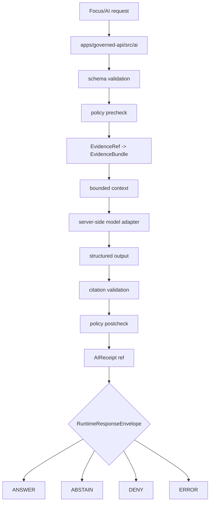

<!-- [KFM_META_BLOCK_V2]
doc_id: kfm://app/governed-api/src/ai/readme
title: Governed API AI Source README
type: app-readme
version: v0.1
status: draft
owners: OWNER_TBD — API steward · Governed AI steward · Policy steward · Evidence steward · Runtime steward · Citation steward · Docs steward
created: 2026-06-16
updated: 2026-06-16
policy_label: public
related:
  - ../README.md
  - ../../README.md
  - ../../routes/README.md
  - ../../../README.md
  - ../../../explorer-web/README.md
  - ../../../../docs/architecture/governed-ai/FOCUS_FLOW.md
  - ../../../../docs/adr/ADR-0004-apps-governed-api-is-the-trust-membrane.md
  - ../../../../schemas/contracts/v1/runtime/
  - ../../../../schemas/contracts/v1/focus/
  - ../../../../schemas/contracts/v1/evidence/
  - ../../../../policy/focus/
  - ../../../../policy/decision/README.md
  - ../../../../packages/evidence-resolver/README.md
  - ../../../../packages/policy-runtime/README.md
  - ../../../../runtime/README.md
  - ../../../../data/README.md
  - ../../../../release/README.md
tags: [kfm, apps, governed-api, src, ai, governed-ai, focus-mode, model-adapter, citation-validation, ai-receipt, finite-outcomes]
notes:
  - "Replaces an empty governed-api AI source README with a bounded source-subtree contract."
  - "This path may orchestrate server-side governed AI flows, but it must not become model-runtime authority, evidence authority, policy authority, citation authority, schema authority, contract authority, lifecycle storage, or a browser-accessible model path."
  - "AI source files, adapter bindings, DTOs, middleware, schemas, tests, fixtures, policy enforcement, citation validation, receipts, deployment state, logs, dashboards, and CI pass state remain NEEDS VERIFICATION."
[/KFM_META_BLOCK_V2] -->

<a id="top"></a>

<div align="center">

# Governed API AI Source

`apps/governed-api/src/ai/`

**App-local source boundary for server-side governed AI orchestration inside the Governed API: Focus-style request handling, policy precheck/postcheck, EvidenceRef-to-EvidenceBundle resolution, bounded context assembly, model-adapter invocation, citation validation, AIReceipt reference handling, safe error handling, and finite runtime envelopes.**


[Purpose](#1-purpose) · [Repo fit](#2-repo-fit) · [Boundary](#3-authority-boundary) · [Inputs](#5-inputs) · [Exclusions](#6-exclusions) · [Source map](#7-ai-source-family-map) · [Definition of done](#14-definition-of-done)

</div>

---

> [!IMPORTANT]
> **Status:** draft / `NEEDS VERIFICATION`  
> **Owners:** `OWNER_TBD` — API steward · Governed AI steward · Policy steward · Evidence steward · Runtime steward · Citation steward · Docs steward  
> **Path:** `apps/governed-api/src/ai/README.md`  
> **Responsibility root:** `apps/` — deployable application surfaces  
> **Truth posture:** CONFIRMED README path / CONFIRMED Focus Flow doctrine / CONFIRMED governed-api source-tree boundary / PROPOSED AI source-subtree contract / UNKNOWN source files, adapters, DTOs, middleware, schemas, tests, fixtures, runtime behavior, deployment state, and CI pass state

> [!CAUTION]
> This path is for server-side governed AI orchestration only. It must not expose a browser-to-model shortcut, ship raw evidence to adapters, persist private chain-of-thought as truth, return uncited authoritative claims, or bypass policy, evidence, citation, release, review, redaction, or finite outcome gates.

---

## Quick jump

- [1. Purpose](#1-purpose)
- [2. Repo fit](#2-repo-fit)
- [3. Authority boundary](#3-authority-boundary)
- [4. Default posture](#4-default-posture)
- [5. Inputs](#5-inputs)
- [6. Exclusions](#6-exclusions)
- [7. AI source family map](#7-ai-source-family-map)
- [8. Diagram](#8-diagram)
- [9. Runtime outcome contract](#9-runtime-outcome-contract)
- [10. Governed AI obligations](#10-governed-ai-obligations)
- [11. Inspection path](#11-inspection-path)
- [12. Validation expectations](#12-validation-expectations)
- [13. Safe change pattern](#13-safe-change-pattern)
- [14. Definition of done](#14-definition-of-done)
- [15. Open verification items](#15-open-verification-items)

---

## 1. Purpose

`apps/governed-api/src/ai/` is the proposed app-local source subtree for governed AI orchestration inside `apps/governed-api/`.

It may eventually contain source modules for:

- Focus-style request parsing and schema validation;
- policy precheck and postcheck orchestration;
- EvidenceRef-to-EvidenceBundle resolution handoff;
- admissible context assembly for model adapters;
- server-side model-adapter invocation;
- structured output validation;
- citation validation against resolved EvidenceBundle anchors;
- AIReceipt reference creation or handoff;
- finite `RuntimeResponseEnvelope` assembly;
- safe denial, abstention, and error handling.

This directory is not proof that any AI source module, model adapter, route handler, DTO, schema binding, citation validator, receipt writer, fixture, test, package script, deployment, log, dashboard, or CI pass state exists.

[Back to top](#top)

---

## 2. Repo fit

| Concern | Owning root | Expected relationship |
|---|---|---|
| Governed API AI source | `apps/governed-api/src/ai/` | App-local AI orchestration source, if implemented |
| Governed API source | `apps/governed-api/src/` | App-local implementation source tree |
| Governed API app | `apps/governed-api/` | Trust membrane and finite envelope API surface |
| Route tree | `apps/governed-api/routes/` | Route-family docs and route organization |
| Governed AI doctrine | `docs/architecture/governed-ai/FOCUS_FLOW.md` | Request → policy → evidence → adapter → citation → policy → envelope doctrine |
| Runtime schemas | `schemas/contracts/v1/runtime/` | Machine shape for runtime envelopes |
| Focus schemas | `schemas/contracts/v1/focus/` | Focus request/response shapes, if present and accepted |
| Evidence support | `packages/evidence-resolver/`, `data/proofs/` | EvidenceBundle support behind governed API |
| Policy support | `policy/`, `packages/policy-runtime/` | Precheck/postcheck support and policy decisions |
| Runtime adapters | `runtime/` | Adapter lane invoked server-side only |
| Receipts | `data/receipts/` | AIReceipt/process receipts, if accepted and verified |
| Release authority | `release/` | Release, correction, and rollback authority |

## 3. Authority boundary

This folder may orchestrate governed AI flows. It does not own model truth, evidence truth, policy authorship, citation authority, release authority, schema authority, contract authority, lifecycle storage, receipt/proof storage, runtime-adapter implementation, client UI, or public route authority.

```text
apps/governed-api/src/ai/ = app-local governed AI orchestration source
apps/governed-api/src/    = Governed API source tree
apps/governed-api/        = trust membrane and finite envelope API
docs/architecture/governed-ai/ = governed AI doctrine
schemas/contracts/v1/     = machine shape
contracts/                = object meaning
policy/                   = policy rules and policy documentation
data/                     = lifecycle artifacts, receipts, proofs, registries
release/                  = publication, correction, rollback authority
runtime/                  = adapters behind governed API
apps/explorer-web/        = client UI consumer; never a model client
```

## 4. Default posture

AI source modules should fail closed. A governed AI path should not emit or pass through `ANSWER` when any of these are unresolved:

- request schema and bounded question scope;
- caller role and authorization context;
- policy precheck result;
- release/review state and sensitivity posture;
- EvidenceRef-to-EvidenceBundle resolution;
- bounded admissible context assembly;
- model adapter contract and structured output validation;
- citation validation against resolved EvidenceBundle anchors;
- policy postcheck on the proposed answer;
- AIReceipt reference and output digest support where required;
- response-envelope validation;
- audit-safe request and decision references.

## 5. Inputs

| Input family | Examples | Required posture |
|---|---|---|
| Focus request | question, MapContextEnvelope, evidence refs, user role, requested transform | Schema-validated and bounded |
| Evidence context | EvidenceRef, EvidenceBundle refs, source roles, citations, limitations | Resolver behind governed API |
| Policy context | role, rights, sensitivity, release, stale-state, transform obligations | Precheck and postcheck required |
| Bounded context | released/governed evidence projection, scope metadata, structured-output schema ref | No raw lifecycle data or credentials |
| Adapter response | structured candidate answer, cited spans, model/provider metadata | Validated before use |
| Citation report | citation target ids, resolved bundle ids, pass/fail, unsupported claims | Must pass before `ANSWER` |
| Receipt context | AIReceipt ref, context hash, output digest, policy decisions, citation report | Process memory, not release proof |
| Runtime envelope | `RuntimeResponseEnvelope`, `DecisionEnvelope`, reason codes, audit refs | Exactly one finite outcome |
| Error context | schema failure, policy denial, missing evidence, citation failure, adapter fault | Safe reason code only |

## 6. Exclusions

| Does not belong here | Correct home |
|---|---|
| Governed AI doctrine | `docs/architecture/governed-ai/` |
| Model/runtime adapter implementations | `runtime/` or accepted adapter packages, invoked server-side only |
| Policy rules or policy bundles | `policy/` |
| EvidenceBundle/proof storage | `data/proofs/` and accepted evidence homes |
| AIReceipt storage | `data/receipts/` or accepted receipt homes |
| Runtime/focus schemas and contracts | `schemas/contracts/v1/`, `contracts/` |
| Release decisions, correction notices, rollback cards | `release/` |
| Source data, lifecycle artifacts, registry, catalog, triplets, published outputs | `data/` |
| Public UI rendering | `apps/explorer-web/` |
| Browser-side model/runtime calls | Forbidden; all model traffic goes through governed API |
| Raw evidence bytes, raw PII, exact sensitive geometry, credentials, internal handles, or full EvidenceBundle copies in adapter context | Forbidden |
| Private chain-of-thought as truth, release proof, telemetry, receipt, or public payload | Forbidden |
| Uncited authoritative answer text | Forbidden; cite-or-abstain |

## 7. AI source family map

Exact source files and implementation status remain `NEEDS VERIFICATION`.

| Candidate source family | Purpose | Required safeguard | Status |
|---|---|---|---|
| `focus_handler` | Route-facing Focus orchestration | Closed request/response schema | PROPOSED |
| `policy_gate` | Invoke policy precheck/postcheck | Fail closed on deny/abstain/error | PROPOSED |
| `evidence_scope` | Resolve evidence refs and assemble support scope | No unresolved bundle, no claim | PROPOSED |
| `context_builder` | Build admissible adapter context | No raw evidence, credentials, or sensitive geometry | PROPOSED |
| `model_adapter_client` | Invoke server-side adapter boundary | No browser/model shortcut | PROPOSED |
| `structured_output` | Validate adapter JSON/output | No freeform authoritative pass-through | PROPOSED |
| `citation_validator` | Validate cited spans against EvidenceBundle anchors | Citation failure forces abstain | PROPOSED |
| `receipt_ref` | Create or attach AIReceipt refs | No chain-of-thought or raw bundles | PROPOSED |
| `envelope_builder` | Build finite RuntimeResponseEnvelope | Four outcome grammar only | PROPOSED |
| `safe_errors` | Convert faults into safe `ERROR` envelopes | No internal leakage | PROPOSED |

> [!WARNING]
> Candidate source-family names are not implementation proof. Do not document a module as live until files, tests, schemas, fixtures, policy gates, adapter contracts, citation validation, and deployment evidence confirm it.

## 8. Diagram



## 9. Runtime outcome contract

Every trust-bearing AI source path should build or validate exactly one runtime status.

| Status | Meaning | AI-source posture |
|---|---|---|
| `ANSWER` | Evidence resolves, policy allows, release/review state permits, citations validate, and postcheck passes | Include citations, policy summary, support refs, limitations, and receipt ref |
| `ABSTAIN` | Evidence is missing, insufficient, stale, conflicted, unsupported, or citations fail | Explain reason without fabricating an answer |
| `DENY` | Policy, rights, sensitivity, sovereignty/CARE, role, release, or exposure risk blocks the response | Avoid leaking blocked material |
| `ERROR` | Schema, adapter, resolver, validation, or infrastructure fault prevents reliable response | Return audit-safe fault reference only |

## 10. Governed AI obligations

| Obligation | Example effect |
|---|---|
| `server_side_only` | Browser never calls model/runtime providers directly |
| `finite_outcomes_required` | No route emits untyped success, empty success, or silent partial |
| `policy_precheck_required` | Sensitive, rights, release, and role denials can fire before evidence is touched |
| `evidence_required` | Claim-bearing `ANSWER` requires resolved EvidenceBundle support |
| `bounded_context_only` | Adapter receives only admissible governed projections, never raw lifecycle data |
| `structured_output_required` | Adapter output is schema-validated before citation validation |
| `citation_validation_required` | Citation failure forces `ABSTAIN`; no uncited answer |
| `policy_postcheck_required` | Generated text is checked for restricted leakage and obligations |
| `receipt_ref_required` | AIReceipt refs support auditability; receipts do not become release proof |
| `safe_error_only` | Errors do not expose prompts, protected details, internal routes, or adapter internals |

## 11. Inspection path

AI source files, adapter bindings, DTOs, middleware, schemas, fixtures, tests, policy integration, evidence resolution, citation validation, receipt handling, safe-error behavior, logs, dashboards, deployment state, and emitted artifacts remain `NEEDS VERIFICATION`.

```bash
find apps/governed-api/src/ai -maxdepth 6 -type f | sort
find apps/governed-api/src apps/governed-api/routes docs/architecture/governed-ai runtime packages schemas contracts policy release data tests fixtures .github/workflows -maxdepth 6 -type f 2>/dev/null | grep -Ei 'FocusMode|FocusModeRequest|FocusModeResponse|MapContextEnvelope|ModelAdapter|AIReceipt|CitationValidationReport|RuntimeResponseEnvelope|DecisionEnvelope|EvidenceBundle|EvidenceRef|PolicyDecision|policy.?precheck|policy.?postcheck|citation|adapter|abstain|deny|error|ai|focus|test|fixture' | sort
```

## 12. Validation expectations

Useful validation for this source subtree should cover:

- browser/client requests cannot call model/runtime providers directly;
- every AI-assisted route returns exactly one `ANSWER`, `ABSTAIN`, `DENY`, or `ERROR` status;
- policy precheck can terminate with `DENY`, `ABSTAIN`, or `ERROR` before evidence retrieval;
- missing, stale, weak, conflicting, or unresolved evidence returns `ABSTAIN` rather than generated filler;
- adapter context never includes raw lifecycle bytes, raw PII, credentials, exact sensitive geometry, internal handles, or full EvidenceBundle copies;
- adapter output is structured and schema-validated;
- failed citation validation forces `ABSTAIN`;
- policy postcheck denial collapses generated output to `DENY`;
- AIReceipt handling stores refs/digests/validation summaries, not private chain-of-thought or raw bundle copies;
- safe errors reveal no prompts, protected details, internal routes, or adapter internals.

## 13. Safe change pattern

For governed AI source changes:

1. Add or update source inventory and source-family contract.
2. Link request/response DTOs to runtime, focus, evidence, policy, citation, and receipt schemas before changing response shape.
3. Add fixtures for `ANSWER`, `ABSTAIN`, `DENY`, `ERROR`, policy deny, policy abstain, missing evidence, stale evidence, citation failure, adapter schema failure, postcheck denial, receipt failure, and safe error cases.
4. Add no-browser-model, bounded-context, citation-validation, receipt-redaction, policy, and safe-error tests before exposing the route.
5. Preserve evidence refs, policy decision refs, release refs, correction refs, rollback refs, citations, limitations, redactions, stale state, citation report refs, and AIReceipt refs through every response.
6. Update this README, `apps/governed-api/src/README.md`, `apps/governed-api/README.md`, route READMEs, Focus Flow docs, policy docs, schemas/contracts, and tests when behavior materially changes.

## 14. Definition of done

- [ ] Owners are confirmed and `OWNER_TBD` is replaced.
- [ ] AI source inventory and module ownership are documented.
- [ ] Focus/runtime/evidence/policy/citation/receipt DTO and schema bindings are verified.
- [ ] Policy precheck/postcheck, evidence resolver, citation validator, adapter boundary, release lookup, receipt handling, and audit hooks are documented and tested.
- [ ] Finite outcome fixtures cover `ANSWER`, `ABSTAIN`, `DENY`, and `ERROR`.
- [ ] No-browser-model tests are present and passing.
- [ ] Bounded-context tests are present and passing.
- [ ] Citation-validation failure tests are present and passing.
- [ ] Policy denial and sensitive-domain denial tests are present and passing.
- [ ] Safe-error and receipt-redaction tests are present and passing.

## 15. Open verification items

| Item | Why it matters |
|---|---|
| Confirm AI source files beyond this README | Prevents overclaiming runtime maturity |
| Confirm adapter boundary and runtime package integration | Required before model invocation claims |
| Confirm request/response DTOs and schemas | Required before route behavior claims |
| Confirm authorization and role resolution | Required before public/restricted split claims |
| Confirm policy runtime integration | Required before sensitivity/rights/release claims |
| Confirm evidence resolver integration | Required before EvidenceBundle closure claims |
| Confirm citation validator integration | Required before answer claims |
| Confirm AIReceipt handling | Required before auditability claims |
| Confirm safe-error behavior | Required before public exposure |
| Confirm test and fixture coverage | Required before runtime maturity claims |
| Confirm deployment, logs, dashboards, and audit receipts | Required before operational claims |

<details>
<summary>Appendix A — no-loss preservation note</summary>

The previous README was empty. This replacement adds a bounded governed-api AI source contract without claiming source files, adapters, DTOs, schemas, middleware, authorization, policy enforcement, evidence resolution, citation validation, AIReceipt handling, tests, fixtures, deployment, logs, dashboards, or CI pass state are implemented.

</details>

## Status summary

`apps/governed-api/src/ai/` should contain app-local governed AI orchestration source only after source inventory, adapter boundary, DTOs, schemas, authorization, policy runtime integration, evidence resolver integration, citation validator integration, receipt handling, safe-error behavior, finite-outcome fixtures, tests, and operational evidence are verified.

It must preserve the governed AI trust membrane: AI source code may orchestrate server-side model-adapter calls, but it must not become model truth, evidence truth, policy authority, citation authority, release authority, lifecycle storage, public UI, browser model path, raw evidence courier, private chain-of-thought carrier, or unsupported generated answer surface.

<p align="right"><a href="#top">Back to top</a></p>
