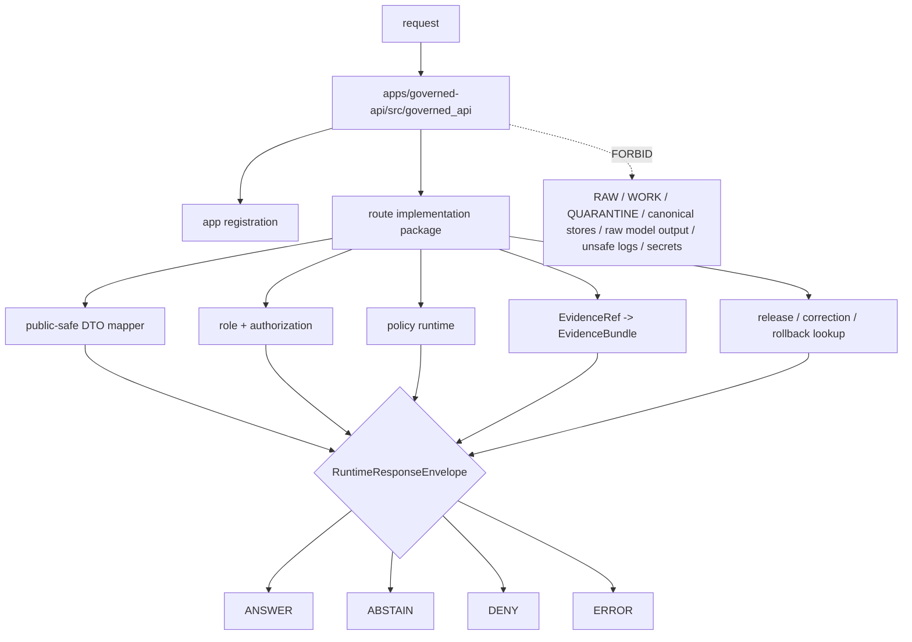

<!-- [KFM_META_BLOCK_V2]
doc_id: kfm://app/governed-api/src/governed-api-package/readme
title: Governed API Python Package README
type: app-readme
version: v0.2
status: draft
owners: OWNER_TBD — API steward · Route steward · Policy steward · Evidence steward · Release steward · Runtime steward · Security steward · Privacy steward · Audit steward · Docs steward
created: 2026-06-16
updated: 2026-07-09
policy_label: public
related:
  - ../README.md
  - ../../README.md
  - ../../routes/README.md
  - ../../routes/domains/README.md
  - ./routes/README.md
  - ../ai/README.md
  - ../../../README.md
  - ../../../explorer-web/README.md
  - ../../../../docs/doctrine/directory-rules.md
  - ../../../../docs/adr/ADR-0004-apps-governed-api-is-the-trust-membrane.md
  - ../../../../schemas/contracts/v1/runtime/
  - ../../../../schemas/contracts/v1/domains/
  - ../../../../schemas/contracts/v1/evidence/
  - ../../../../schemas/contracts/v1/focus/
  - ../../../../contracts/runtime/
  - ../../../../contracts/domains/
  - ../../../../contracts/evidence/
  - ../../../../contracts/focus/
  - ../../../../policy/access/README.md
  - ../../../../policy/decision/README.md
  - ../../../../policy/domains/README.md
  - ../../../../policy/telemetry/README.md
  - ../../../../packages/evidence-resolver/README.md
  - ../../../../packages/policy-runtime/README.md
  - ../../../../runtime/README.md
  - ../../../../release/README.md
  - ../../../../data/README.md
tags: [kfm, apps, governed-api, src, governed-api-package, python-package, trust-membrane, runtime-response-envelope, finite-outcomes, safe-errors, safe-observability, package-boundary]
notes:
  - "Refreshes the bounded governed_api package-source contract."
  - "This path is an app-local import package for the Governed API; it is not a schema, contract, policy, lifecycle, release, proof, shared-package, runtime-adapter, telemetry-policy, audit-store, or public-UI authority root."
  - "Package files, route wiring, DTOs, middleware, schemas, tests, fixtures, authorization, policy enforcement, evidence resolution, release lookup, transform receipt support, safe logging, safe telemetry, deployment state, logs, dashboards, and CI pass state remain NEEDS VERIFICATION."
  - "`apps/governed-api/src/governed_api/routes/README.md` exists as a blank file on main at the time of this parent refresh; the filled route-package README is handled in a separate draft PR unless merged before this branch."
  - "v0.2 adds a current evidence basis, Directory Rules placement basis, child-package alignment, minimum safe package slice, runtime anti-bypass matrix, stronger safe-observability and AI-boundary gates, and validation/definition-of-done updates without claiming runtime maturity."
[/KFM_META_BLOCK_V2] -->

<a id="top"></a>

<div align="center">

# Governed API Python Package

`apps/governed-api/src/governed_api/`

**App-local import package boundary for the Governed API implementation: application factory, route binding, middleware wiring, request parsing, finite envelope builders, DTO mappers, resolver orchestration, policy/runtime/release/evidence integration points, safe errors, safe observability, and audit-safe references — without becoming a parallel authority root.**


[Evidence](#0-evidence-basis-for-this-revision) · [Purpose](#1-purpose) · [Repo fit](#2-repo-fit) · [Boundary](#3-authority-boundary) · [Inputs](#5-inputs) · [Exclusions](#6-exclusions) · [Package map](#7-package-family-map) · [Minimum slice](#8-minimum-safe-package-slice) · [Definition of done](#16-definition-of-done)

</div>

---

> [!IMPORTANT]
> **Status:** draft / `NEEDS VERIFICATION`  
> **Owners:** `OWNER_TBD` — API steward · Route steward · Policy steward · Evidence steward · Release steward · Runtime steward · Security steward · Privacy steward · Audit steward · Docs steward  
> **Path:** `apps/governed-api/src/governed_api/README.md`  
> **Responsibility root:** `apps/` — deployable application surfaces  
> **Directory Rules basis:** executable app-local package code belongs under the deployable Governed API app source tree. `src/governed_api/` is implementation support for `apps/governed-api/`; it is not a canonical schema home, contract home, policy home, lifecycle-data lane, release authority, proof/receipt store, shared package extraction root, runtime-adapter package, public UI, telemetry policy root, or audit store.  
> **Truth posture:** CONFIRMED current GitHub README path / CONFIRMED parent source-tree README exists / CONFIRMED governed-api trust-membrane README exists / CONFIRMED app-level route-tree README exists / CONFIRMED `src/governed_api/routes/README.md` exists blank on `main` at this revision / CONFIRMED Directory Rules document exists / PROPOSED import-package contract / UNKNOWN package files, route handlers, DTOs, middleware, schemas, tests, fixtures, authorization, policy runtime integration, evidence resolver integration, release lookup, transform receipt support, safe logging, safe telemetry, deployment state, dashboards, CI pass state, and runtime behavior

> [!CAUTION]
> `governed_api` is an app-local package, not a shared library or authority root. Code here may enforce the trust membrane, but it must not redefine schemas, contracts, policy, EvidenceBundle truth, release decisions, lifecycle storage, runtime adapter authority, telemetry policy, audit truth, or public UI behavior.

---

## Quick jump

- [0. Evidence basis for this revision](#0-evidence-basis-for-this-revision)
- [1. Purpose](#1-purpose)
- [2. Repo fit](#2-repo-fit)
- [3. Authority boundary](#3-authority-boundary)
- [4. Default posture](#4-default-posture)
- [5. Inputs](#5-inputs)
- [6. Exclusions](#6-exclusions)
- [7. Package family map](#7-package-family-map)
- [8. Minimum safe package slice](#8-minimum-safe-package-slice)
- [9. Diagram](#9-diagram)
- [10. Runtime outcome contract](#10-runtime-outcome-contract)
- [11. Package obligations](#11-package-obligations)
- [12. Runtime anti-bypass matrix](#12-runtime-anti-bypass-matrix)
- [13. Inspection path](#13-inspection-path)
- [14. Validation expectations](#14-validation-expectations)
- [15. Safe change pattern](#15-safe-change-pattern)
- [16. Definition of done](#16-definition-of-done)
- [17. Open verification items](#17-open-verification-items)

---

## 0. Evidence basis for this revision

This README is a documentation boundary, not runtime proof. The 2026-07-09 revision updates an existing README and keeps implementation maturity bounded while aligning the Python import package with current source-tree, route-tree, and child-package README patterns.

| Evidence item | Status | What it supports | What it does not prove |
|---|---|---|---|
| `apps/governed-api/src/governed_api/README.md` exists on `main`. | CONFIRMED | This is an existing README update, not a new path proposal. | It does not prove package modules, route handlers, middleware, DTOs, fixtures, tests, deployment, logs, dashboards, or runtime behavior exist. |
| `apps/governed-api/src/README.md` exists and describes `src/` as implementation source, not sovereignty. | CONFIRMED document presence and source-tree posture | `src/governed_api/` is app-local implementation source beneath the governed API app. | It does not prove source modules, middleware, DTOs, or tests exist. |
| `apps/governed-api/README.md` exists and describes the app as the normal public trust path for finite governed envelopes. | CONFIRMED document presence and trust-membrane posture | Package code should preserve finite governed envelopes and safe projections. | It does not prove runtime enforcement or endpoint behavior. |
| `apps/governed-api/routes/README.md` exists and states route folders are not authority roots. | CONFIRMED document presence and route-tree posture | Package route code must enforce and project, not absorb schemas, contracts, policy, data, release, package, runtime, or UI authority. | It does not prove app-level route or implementation-package wiring. |
| `apps/governed-api/src/governed_api/routes/README.md` exists as a blank file on `main` at this revision. | CONFIRMED blank child README state | The parent package should reference child route implementation posture without claiming merged child documentation maturity. | It does not prove route implementation modules or the separate child README draft has merged. |
| `docs/doctrine/directory-rules.md` exists and identifies root placement as ownership/lifecycle governance; `apps/` is the deployable implementation root. | CONFIRMED document presence and placement posture | `apps/governed-api/src/governed_api/` is app-local implementation support under a deployable app. | It does not prove package code is complete, tested, deployed, or release-ready. |

[Back to top](#top)

---

## 1. Purpose

`apps/governed-api/src/governed_api/` is the proposed Python import package for the Governed API app.

It may eventually contain modules for:

- application factory and server bootstrap;
- route registration and route-family binding;
- request parsing and DTO mapping;
- middleware for request ids, role/authorization context, policy gates, size/rate guards, and safe errors;
- finite `RuntimeResponseEnvelope` construction and validation;
- EvidenceRef-to-EvidenceBundle resolver orchestration;
- release, correction, rollback, stale-state, review-state, and transform projection;
- server-side adapter orchestration for AI-assisted surfaces;
- public-safe redaction, generalization, aggregation, delayed-release, suppression, and safe denial mapping;
- audit-safe request/decision references;
- safe logging, metrics, telemetry, diagnostics, and cache-key discipline.

This directory is not proof that any package module, route handler, middleware, adapter, DTO, schema binding, fixture, test, package script, deployment, log, dashboard, CI pass state, or runtime behavior exists.

[Back to top](#top)

---

## 2. Repo fit

| Concern | Owning root | Expected relationship |
|---|---|---|
| Governed API package | `apps/governed-api/src/governed_api/` | App-local import package for Governed API implementation |
| Route implementation package | `apps/governed-api/src/governed_api/routes/` | App-local route-handler package, currently blank README on `main` at this revision |
| Governed API source tree | `apps/governed-api/src/` | App-local implementation source boundary |
| Governed API app contract | `apps/governed-api/README.md` | App-level trust membrane contract |
| Route tree docs | `apps/governed-api/routes/` | Route-family organization and route docs; distinct from implementation package |
| AI source subtree | `apps/governed-api/src/ai/` | AI orchestration source boundary if kept separate from package-local AI modules |
| Runtime schemas/contracts | `schemas/contracts/v1/runtime/`, `contracts/runtime/` | Runtime envelope shape and meaning |
| Domain schemas/contracts | `schemas/contracts/v1/domains/`, `contracts/domains/` | Domain shapes and meaning, if present and accepted |
| Evidence schemas/contracts | `schemas/contracts/v1/evidence/`, `contracts/evidence/` | Evidence projection shapes and meaning, if present and accepted |
| Policy support | `policy/`, `packages/policy-runtime/` | Admissibility and evaluator support |
| Evidence support | `packages/evidence-resolver/`, `data/proofs/` | EvidenceBundle support behind the membrane |
| Release authority | `release/` | Release decisions, correction notices, rollback cards |
| Lifecycle artifacts | `data/` | Source lifecycle, receipts, proofs, registry, catalog, triplets, and published outputs |
| Runtime adapters | `runtime/` | Adapter lane behind governed API |
| Client UI | `apps/explorer-web/` | Consumer of governed responses, not source authority |
| Shared helpers | `packages/` | Reusable code only after extraction and ownership review |

## 3. Authority boundary

This folder may hold importable application code for the Governed API. It does not own schemas, contracts, policy rules, data, release decisions, proofs, receipts, source acquisition, runtime-adapter implementation, shared packages, public UI rendering, operational deployment configuration, telemetry policy, audit storage, or emitted artifacts.

```text
apps/governed-api/src/governed_api/        = app-local import package
apps/governed-api/src/governed_api/routes/ = route implementation package
apps/governed-api/src/                     = source tree boundary
apps/governed-api/                         = trust membrane app contract
apps/governed-api/routes/                  = route-family documentation and organization
schemas/contracts/v1/                      = machine shape
contracts/                                 = object meaning
policy/                                    = policy rules and documentation
data/                                      = lifecycle artifacts, receipts, proofs, registries
release/                                   = publication, correction, rollback authority
packages/                                  = reusable helpers after extraction and review
runtime/                                   = adapters behind governed API
apps/explorer-web/                         = client UI consumer
```

## 4. Default posture

Package modules should fail closed. No module should emit, validate, map, cache, log, or forward a trust-bearing result unless it can preserve the finite envelope, authorization result, policy decision, evidence support, release/correction/rollback refs, citations, redactions, stale-state, transform refs, limitations, and audit-safe references required by the app contract.

A package path should not emit or pass through `ANSWER` when any of these are unresolved:

- request schema and route action;
- caller role and authorization context;
- endpoint policy and audience posture;
- EvidenceRef-to-EvidenceBundle support for claim-bearing responses;
- release manifest, correction, rollback, review, stale, or freshness state where material;
- source role, rights, sensitivity, redaction, generalization, aggregation, delayed-release, suppression, or transform receipt where material;
- citation validation and limitation fields;
- server-side adapter constraints for AI-assisted responses;
- response-envelope validation;
- safe logging, metrics, telemetry, diagnostics, and cache-key discipline;
- audit-safe request and decision references.

## 5. Inputs

| Input family | Examples | Required posture |
|---|---|---|
| Request context | route action, params, selected layer, evidence ref, feature ref, caller role | Schema-validated and bounded |
| Runtime envelope | `RuntimeResponseEnvelope`, `DecisionEnvelope`, reason codes, audit refs | Exactly one finite outcome |
| Evidence context | EvidenceRef, EvidenceBundle refs, source roles, citations, limitations | Resolver behind governed API |
| Policy context | role, rights, sensitivity, release, stale-state, transform requirement | Policy gate required |
| Release context | release manifest, correction notice, rollback card, artifact digest | Required where response depends on released artifacts |
| Domain context | domain slug, object family, candidate/confirmed status, cross-domain refs | Domain-owned or explicitly referenced |
| Runtime context | server-side adapter result, Focus response, AIReceipt ref | Behind membrane; never direct browser call |
| Observability context | request id, decision ref, route family, outcome, safe reason code, coarse latency bucket | No raw evidence, prompts, model output, restricted geometry, secrets, or provider traces |
| Error context | schema failure, policy denial, missing evidence, stale support, adapter fault | Safe reason code only |

## 6. Exclusions

| Does not belong here | Correct home |
|---|---|
| App-level trust-membrane contract | `apps/governed-api/README.md` |
| Source-tree contract | `apps/governed-api/src/README.md` |
| App-level route-family docs | `apps/governed-api/routes/` |
| Domain doctrine and scope | `docs/domains/<domain>/` |
| Policy rules or policy bundles | `policy/` |
| Schemas and contracts | `schemas/contracts/v1/`, `contracts/` |
| Source data, lifecycle artifacts, receipts, proofs, registry, catalog, triplets, published outputs | `data/` |
| Release decisions, correction notices, rollback cards | `release/` |
| Source acquisition and ingest adapters | `connectors/`, `pipelines/`, `pipeline_specs/` |
| Shared helpers reusable across apps | `packages/` after extraction and review |
| Runtime adapter implementation authority | `runtime/` or accepted adapter package |
| Public UI rendering | `apps/explorer-web/` |
| Steward/admin UI rendering | `apps/review-console/`, `apps/admin/` |
| Direct public lifecycle/canonical reads | Forbidden; use finite governed envelopes |
| Direct public runtime/model calls | Forbidden; use governed server-side adapters only |
| Raw prompt/output logging, chain-of-thought capture, raw telemetry, restricted geometry in cache keys | Forbidden |
| Deployment-only values | Deployment environment and config channels, not source tree docs |

## 7. Package family map

Exact package files and implementation status remain `NEEDS VERIFICATION`.

| Candidate package family | Purpose | Required safeguard | Status |
|---|---|---|---|
| `app` / `server` | App factory, runtime configuration, route registration | No direct trust-bearing bypass | PROPOSED |
| `routes` | Route handlers and router binding | Route contracts and envelope validation | PROPOSED; child README blank on `main` at this revision |
| `middleware` | Auth, role, policy, request id, rate/size guards | Fail closed | PROPOSED |
| `envelopes` | Build and validate finite responses | Four outcome grammar only | PROPOSED |
| `dto` / `mappers` | Map internal support to public-safe payloads | Redaction and limitation preservation | PROPOSED |
| `policy` | Invoke policy runtime, not author policy | Policy refs preserved | PROPOSED |
| `evidence` | Invoke evidence resolver, not author proofs | EvidenceBundle refs preserved | PROPOSED |
| `release` | Lookup release/correction/rollback state | Release refs preserved | PROPOSED |
| `ai` | Bind governed AI orchestration, if package-local | No browser model shortcut | PROPOSED |
| `errors` | Convert faults to safe `ERROR` envelopes | No internal leakage | PROPOSED |
| `audit` | Attach audit-safe request and decision refs | No raw payload leakage | PROPOSED |
| `observability` | Safe logging, metrics, telemetry, diagnostics, cache-key helpers | No prompt/evidence/model/restricted-data leakage | PROPOSED |

> [!WARNING]
> Candidate package-family names are not implementation proof. Do not document a module as live until files, tests, schemas, fixtures, policy gates, middleware, observability guards, route registration, and deployment evidence confirm it.

## 8. Minimum safe package slice

A smallest useful package slice should prove package code cannot bypass the governed API contract before adding broad route coverage.

| Slice item | Minimum requirement | Why it is required |
|---|---|---|
| Package inventory | Module list, owners, route families, imports, and side effects documented | Prevents hidden implementation authority |
| App registration guard | Importing modules does not publish routes without explicit app registration | Prevents side-effect route exposure |
| Envelope builder | All trust-bearing responses validate as `ANSWER`, `ABSTAIN`, `DENY`, or `ERROR` | Prevents untyped success |
| Authorization gate | Caller role and endpoint access resolve before sensitive work | Prevents unauthorized evidence/policy work |
| Policy/evidence/release gates | Policy runtime, evidence resolver, release lookup, and transform refs are invoked or reason-coded | Preserves trust membrane |
| Mapping/redaction guard | DTO mappers preserve redaction, generalization, delayed release, suppression, limitations, citations, and stale state | Prevents client-side re-expansion |
| Safe errors | Stack traces, filesystem paths, protected details, provider payloads, and internals stay out of responses | Prevents public leakage |
| Safe observability | Logs, metrics, telemetry, diagnostics, and cache keys carry safe metadata only | Prevents side-channel disclosure |
| AI boundary | AI-assisted code uses server-side governed adapters only and never returns raw model output or chain-of-thought | Preserves governed AI rule |
| Test fixtures | Fixtures cover answer, abstain, deny, error, missing evidence, stale evidence, policy denial, safe error, unsafe logging, unsafe cache key, and read-only mutation denial | Makes claims reviewable |

This slice is still `PROPOSED` until files, fixtures, tests, route wiring, and accepted contracts are verified.

## 9. Diagram



## 10. Runtime outcome contract

Every trust-bearing package path should build or validate exactly one runtime status.

| Status | Meaning | Package posture |
|---|---|---|
| `ANSWER` | Safe, released, evidence-backed, policy-supported response exists | Include evidence, policy, release, transform, limitation, and citation refs where material |
| `ABSTAIN` | Evidence, review, freshness, source role, narrowing support, or scope is insufficient | Explain the held reason without fabricating an answer |
| `DENY` | Policy, rights, sensitivity, role, review, release, or exposure risk blocks response | Avoid leaking blocked material or exposure hints |
| `ERROR` | Runtime, adapter, schema, validation, or infrastructure fault prevents reliable response | Return audit-safe fault reference only |

## 11. Package obligations

| Obligation | Example effect |
|---|---|
| `finite_outcomes_required` | No route emits untyped success, empty success, or silent partial |
| `authorization_required` | Caller role and endpoint access are resolved before sensitive work |
| `policy_required` | Sensitivity, rights, review, release, and transform obligations are checked |
| `evidence_required` | Claim-bearing `ANSWER` requires EvidenceBundle support |
| `release_refs_required` | Released public artifacts carry release/correction/rollback refs where material |
| `transform_receipt_required` | Redaction/generalization/delay/aggregation/suppression must be receipt-backed or reason-coded |
| `safe_error_only` | Errors do not expose protected details or internal route/resolver state |
| `safe_observability_only` | Logs, metrics, telemetry, diagnostics, and cache keys do not carry raw evidence, prompts, model output, restricted geometry, or secrets |
| `no_parallel_authority` | Package code does not redefine schema, contract, policy, release, data, proof, receipt, telemetry-policy, or audit authority |
| `adapter_boundary_preserved` | Runtime/model adapters are invoked server-side only behind the membrane |
| `auditability_required` | Request, decision, release, evidence, transform, and citation refs support later review |
| `import_side_effects_controlled` | Importing package modules does not publish routes or mutate state without explicit app registration |

## 12. Runtime anti-bypass matrix

| Bypass risk | Required behavior | Review signal |
|---|---|---|
| Package module returns plain dict/string instead of finite envelope | Deny in review; wrap in validated `RuntimeResponseEnvelope` | Response-shape fixture rejects untyped return |
| Package reads lifecycle/canonical/internal stores directly for public response | Deny; route through governed services and projections | Import/fetch scan and tests block direct public reads |
| Missing evidence produces generated answer | Return `ABSTAIN` with reason | Missing-evidence fixture blocks answer |
| Policy denial leaks blocked details | Return `DENY` with safe reason only | Sensitive-denial fixture hides protected payload |
| Transform lacks receipt/reference | Return `ABSTAIN`, `DENY`, or safe bounded alternative | Transform-missing fixture blocks public response |
| Package import publishes routes or mutates state | Require explicit app registration and no import side effects | Import-side-effect fixture passes |
| Error exposes stack trace/internal path/secret | Return safe `ERROR` envelope | Safe-error fixture blocks leakage |
| Logs/telemetry/cache key include prompt/raw evidence/restricted geometry | Redact, hash, bucket, or omit | Safe-observability fixture blocks leakage |
| AI-assisted package exposes browser-to-model path | Deny; use server-side governed AI orchestration | Network/import scan blocks model provider access from client route |
| Package embeds schema/policy/release constants as authority | Move to owning roots or generated bindings | Review finds no parallel authority tables |
| Shared utility hardens inside app package | Extract to `packages/` only after ownership review | Reuse review avoids accidental shared-root drift |

## 13. Inspection path

Package files, route handlers, DTOs, middleware, schemas, fixtures, tests, policy integration, authorization, safe-error behavior, safe logging/telemetry/cache behavior, deployment state, dashboards, and emitted artifacts remain `NEEDS VERIFICATION`.

```bash
find apps/governed-api/src/governed_api -maxdepth 6 -type f | sort
find apps/governed-api/src apps/governed-api/routes runtime packages schemas contracts policy release data tests fixtures .github/workflows -maxdepth 6 -type f 2>/dev/null | grep -Ei 'RuntimeResponseEnvelope|DecisionEnvelope|EvidenceBundle|EvidenceRef|PolicyDecision|ReleaseManifest|CorrectionNotice|RollbackCard|AIReceipt|CitationValidationReport|RedactionReceipt|ReviewRecord|SensitivityTransform|runtime.?bootstrap|domains|layers|evidence|focus|story|export|review|correction|diagnostic|abstain|deny|error|route|middleware|dto|mapper|audit|safe.?log|telemetry|cache|test|fixture' | sort
find data/raw data/work data/quarantine data/processed data/catalog data/triplets data/published data/receipts data/proofs -maxdepth 2 -type f 2>/dev/null | sort
```

## 14. Validation expectations

Useful validation for this package should cover:

- every trust-bearing route returns exactly one `ANSWER`, `ABSTAIN`, `DENY`, or `ERROR` status;
- request and response DTOs validate against accepted schemas/contracts;
- authorization and caller role resolution fail closed;
- unresolved review, rights, release, transform, sensitivity, source-role posture, or stale evidence fails closed;
- sensitive exact or protected details are denied unless a reviewed transform and release path explicitly allows a bounded response;
- candidate or inferred objects remain labeled and cannot become confirmed observations through route language;
- missing, stale, weak, conflicting, or unresolved evidence returns `ABSTAIN` rather than generated filler;
- policy denial returns `DENY` without blocked detail or exposure hints;
- schema, adapter, resolver, or infrastructure faults return `ERROR` with safe details only;
- response envelopes preserve evidence refs, policy decision refs, release refs, correction refs, rollback refs, citations, limitations, redactions, stale state, transform refs, and reason codes where material;
- package imports do not register routes, write state, fetch sources, call models, or mutate lifecycle artifacts unless explicitly invoked by app wiring;
- logs, metrics, telemetry, diagnostics, and cache keys do not include prompts, raw evidence, raw outputs, restricted geometry, PII, secrets, provider traces, internal handles, or full bundle copies;
- AI-assisted paths do not expose raw model output, private chain-of-thought, provider traces, or browser-to-model shortcuts.

## 15. Safe change pattern

For package changes:

1. Add or update package inventory and package-family contract.
2. Link DTOs to runtime, route-family, domain, evidence, policy, release, transform, and AI/citation schemas before changing response shape.
3. Add fixtures for `ANSWER`, `ABSTAIN`, `DENY`, `ERROR`, policy denial, missing evidence, stale evidence, unresolved review, transform missing, release missing, safe error, unsafe logging, unsafe telemetry, unsafe cache key, candidate-not-confirmed, unauthorized caller, read-only mutation denied, import side-effect denied, and browser-model denied cases.
4. Add authorization, policy, safe-error, safe-observability, evidence, release, transform, read-only/mutation-boundary, no-browser-model, and AI-boundary tests before exposing any public route.
5. Preserve evidence refs, policy decision refs, release refs, correction refs, rollback refs, citations, limitations, redactions, stale state, transform refs, AIReceipt refs where applicable, and audit refs through every response.
6. Update this README, `apps/governed-api/src/README.md`, `apps/governed-api/README.md`, route READMEs, affected child package READMEs, affected domain/feature docs, policy docs, schemas/contracts, fixtures, and tests when package behavior materially changes.

## 16. Definition of done

- [ ] Owners are confirmed and `OWNER_TBD` is replaced.
- [ ] Evidence basis is refreshed when parent source/app docs, route docs, child package docs, schemas, contracts, policy, evidence resolver, release, runtime, fixtures, tests, workflow, telemetry, or deployment evidence changes.
- [ ] Package inventory and module ownership are documented.
- [ ] Package import name and packaging config are verified.
- [ ] Route registration and import-side-effect behavior are verified.
- [ ] Runtime envelope and DTO/schema bindings are verified.
- [ ] Authorization, policy runtime, evidence resolver, release lookup, transform receipt, and audit hooks are documented and tested.
- [ ] Finite outcome fixtures cover `ANSWER`, `ABSTAIN`, `DENY`, and `ERROR`.
- [ ] Sensitive-detail denial tests are present and passing.
- [ ] Candidate/inferred-not-confirmed tests are present and passing.
- [ ] Missing-evidence and stale-evidence abstention tests are present and passing.
- [ ] Policy denial and sensitive-domain denial tests are present and passing.
- [ ] Safe-error tests are present and passing.
- [ ] Safe logging, metrics, telemetry, cache-key, diagnostics, and observability tests are present and passing.
- [ ] Read-only vs mutating route boundaries are documented and tested.
- [ ] AI-assisted route no-raw-model-output and no-chain-of-thought tests are present and passing where applicable.

## 17. Open verification items

| Item | Why it matters |
|---|---|
| Confirm package files beyond this README | Prevents overclaiming runtime maturity |
| Confirm package import name and packaging config | Required before import/use claims |
| Confirm route implementation package status beyond blank README on `main` | Required before child route package claims |
| Confirm route handlers and DTOs | Required before source behavior claims |
| Confirm authorization and role resolution | Required before public/restricted split claims |
| Confirm policy runtime integration | Required before sensitivity/rights/release claims |
| Confirm evidence resolver integration | Required before EvidenceBundle closure claims |
| Confirm release/correction/rollback lookup | Required before publication-state claims |
| Confirm transform receipt handling | Required before redacted/generalized output claims |
| Confirm safe-error behavior | Required before public exposure |
| Confirm safe logging, telemetry, metrics, cache-key, and diagnostics behavior | Required to prevent side-channel leakage |
| Confirm import-side-effect behavior | Required before app factory/route registration claims |
| Confirm no-browser-model and no-chain-of-thought behavior | Required before AI-assisted route exposure |
| Confirm test and fixture coverage | Required before runtime maturity claims |
| Confirm deployment, logs, dashboards, and audit receipts | Required before operational claims |
| Confirm CI workflow presence and latest pass state | Required before CI claims |

<details>
<summary>Appendix A — no-loss preservation note</summary>

The previous README already contained a bounded governed-api package contract. This revision preserves that contract, refreshes metadata, adds a current evidence-basis section, adds Directory Rules placement posture, records child route-package blank-on-main status, strengthens minimum package slice, route-package alignment, finite-envelope, authorization, policy/evidence/release/transform, safe-error, safe observability, import-side-effect, AI-boundary, and anti-bypass safeguards, and keeps implementation claims bounded. It does not claim package files, route handlers, DTOs, schemas, middleware, authorization, policy enforcement, evidence resolution, release lookup, transform receipt support, tests, fixtures, deployment, logs, dashboards, telemetry, or CI pass state are implemented.

</details>

## Status summary

`apps/governed-api/src/governed_api/` should contain app-local import package modules only after package inventory, import configuration, DTOs, route bindings, schemas, authorization, policy runtime integration, evidence resolver integration, release/correction/rollback lookups, transform receipt support, safe-error behavior, safe logging/telemetry/cache behavior, finite-outcome fixtures, tests, and operational evidence are verified.

It must preserve the trust membrane and package boundary: package code may enforce and compose governed finite envelopes, but it must not become schema authority, contract authority, policy authority, lifecycle storage, release authority, proof storage, domain doctrine, direct source access, public UI rendering, shared-package authority, unsafe observability channel, raw model-output surface, or unsupported generated answer surface.

<p align="right"><a href="#top">Back to top</a></p>
