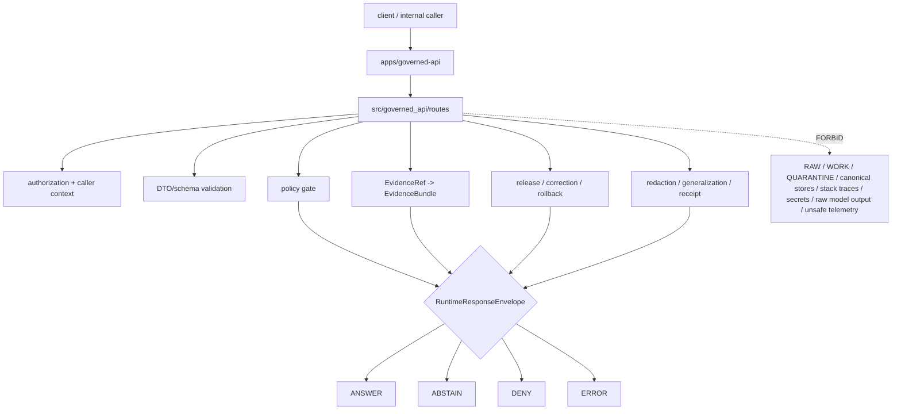

<!-- [KFM_META_BLOCK_V2]
doc_id: kfm://app/governed-api/src/governed-api-package/routes/readme
title: Governed API Python Routes Package README
type: app-readme
version: v0.1
status: draft
owners: OWNER_TBD — API steward · Route steward · Policy steward · Evidence steward · Release steward · Runtime steward · Security steward · Privacy steward · Audit steward · Docs steward
created: 2026-07-09
updated: 2026-07-09
policy_label: public
related:
  - ../README.md
  - ../../README.md
  - ../../../README.md
  - ../../../routes/README.md
  - ../../../routes/domains/README.md
  - ../../../routes/domains/archaeology/README.md
  - ../../../../README.md
  - ../../../../explorer-web/README.md
  - ../../../../../docs/doctrine/directory-rules.md
  - ../../../../../docs/adr/ADR-0004-apps-governed-api-is-the-trust-membrane.md
  - ../../../../../schemas/contracts/v1/runtime/
  - ../../../../../schemas/contracts/v1/domains/
  - ../../../../../contracts/runtime/
  - ../../../../../contracts/domains/
  - ../../../../../policy/access/README.md
  - ../../../../../policy/decision/README.md
  - ../../../../../policy/domains/README.md
  - ../../../../../policy/telemetry/README.md
  - ../../../../../packages/evidence-resolver/README.md
  - ../../../../../packages/policy-runtime/README.md
  - ../../../../../runtime/README.md
  - ../../../../../release/README.md
  - ../../../../../data/README.md
tags: [kfm, apps, governed-api, src, governed-api-package, routes, python-package, route-handlers, trust-membrane, runtime-response-envelope, finite-outcomes, safe-errors]
notes:
  - "Fills the previously blank governed_api routes package README with a bounded implementation-package contract."
  - "This path is an app-local import-package subtree for route implementation code. It is distinct from `apps/governed-api/routes/`, which is the route-family documentation/organization boundary."
  - "Route implementation modules may bind handlers, routers, middleware, DTO mapping, envelope construction, authorization, policy/evidence/release lookups, and safe errors, but they must not become schema authority, contract authority, policy authority, lifecycle storage, release authority, proof/receipt storage, runtime-adapter authority, telemetry authority, public UI, or direct source/model access."
  - "Route implementation files, DTOs, middleware, schemas, tests, fixtures, authorization, policy runtime integration, evidence resolver integration, release lookup, transform receipt support, safe logging, safe telemetry, deployment state, dashboards, and CI pass state remain NEEDS VERIFICATION."
[/KFM_META_BLOCK_V2] -->

<a id="top"></a>

<div align="center">

# Governed API Python Routes Package

`apps/governed-api/src/governed_api/routes/`

**App-local Python package boundary for Governed API route implementation modules: router binding, request parsing, DTO mapping, authorization handoff, policy/evidence/release orchestration, finite `RuntimeResponseEnvelope` assembly, safe error handling, safe observability, and route-family implementation support behind the KFM trust membrane.**


[Evidence](#0-evidence-basis-for-this-readme) · [Purpose](#1-purpose) · [Repo fit](#2-repo-fit) · [Boundary](#3-authority-boundary) · [Inputs](#5-inputs) · [Exclusions](#6-exclusions) · [Package map](#7-route-package-map) · [Minimum slice](#8-minimum-safe-route-implementation-slice) · [Definition of done](#16-definition-of-done)

</div>

---

> [!IMPORTANT]
> **Status:** draft / `NEEDS VERIFICATION`  
> **Owners:** `OWNER_TBD` — API steward · Route steward · Policy steward · Evidence steward · Release steward · Runtime steward · Security steward · Privacy steward · Audit steward · Docs steward  
> **Path:** `apps/governed-api/src/governed_api/routes/README.md`  
> **Responsibility root:** `apps/` — deployable application surfaces  
> **Directory Rules basis:** executable app-local route implementation code belongs under the deployable Governed API app source tree. This package path is implementation support under `apps/governed-api/src/governed_api/`; it is not a new canonical route authority root, schema home, contract home, policy home, lifecycle-data lane, release authority, proof/receipt store, package extraction root, runtime-adapter package, public UI, or telemetry policy root.  
> **Truth posture:** CONFIRMED target README path exists but was blank on `main` / CONFIRMED parent Python package README exists / CONFIRMED parent source-tree README exists / CONFIRMED app-level route-tree README exists / CONFIRMED Directory Rules document exists / PROPOSED route implementation-package contract / UNKNOWN route implementation files, router wiring, DTOs, middleware, schemas, tests, fixtures, authorization, policy runtime integration, evidence resolver integration, release lookup, transform receipt support, safe logging, safe telemetry, deployment state, dashboards, CI pass state, and runtime behavior

> [!CAUTION]
> `src/governed_api/routes/` may implement route handlers, but it must not become an authority root. It must project and enforce governed decisions using the owning schema, contract, policy, evidence, release, lifecycle, runtime, and audit roots. It must not return raw lifecycle content, unpublished candidates, source-system internals, stack traces, prompt text, model output as truth, protected geometry, credentials, or direct filesystem references.

---

## Quick jump

- [0. Evidence basis for this README](#0-evidence-basis-for-this-readme)
- [1. Purpose](#1-purpose)
- [2. Repo fit](#2-repo-fit)
- [3. Authority boundary](#3-authority-boundary)
- [4. Default posture](#4-default-posture)
- [5. Inputs](#5-inputs)
- [6. Exclusions](#6-exclusions)
- [7. Route package map](#7-route-package-map)
- [8. Minimum safe route implementation slice](#8-minimum-safe-route-implementation-slice)
- [9. Diagram](#9-diagram)
- [10. Runtime outcome contract](#10-runtime-outcome-contract)
- [11. Route implementation obligations](#11-route-implementation-obligations)
- [12. Runtime anti-bypass matrix](#12-runtime-anti-bypass-matrix)
- [13. Inspection path](#13-inspection-path)
- [14. Validation expectations](#14-validation-expectations)
- [15. Safe change pattern](#15-safe-change-pattern)
- [16. Definition of done](#16-definition-of-done)
- [17. Open verification items](#17-open-verification-items)

---

## 0. Evidence basis for this README

This README is a documentation boundary, not runtime proof. The 2026-07-09 revision fills a blank README path and keeps implementation maturity bounded while aligning the Python route package with the Governed API source-tree and route-tree contracts.

| Evidence item | Status | What it supports | What it does not prove |
|---|---|---|---|
| `apps/governed-api/src/governed_api/routes/README.md` exists on `main` as a blank file. | CONFIRMED | This is filling an existing path, not proposing a new path. | It does not prove route handler files, routers, middleware, tests, fixtures, schemas, or runtime behavior exist. |
| `apps/governed-api/src/governed_api/README.md` exists and describes `governed_api` as an app-local import package, not a shared library or authority root. | CONFIRMED document presence and package posture | This route package belongs under the app-local Python package boundary. | It does not prove `routes/` has implemented modules or route wiring. |
| `apps/governed-api/src/README.md` exists and describes `src/` as implementation source, not sovereignty. | CONFIRMED document presence and source-tree posture | Route implementation modules may live under app-local source when they enforce the trust membrane. | It does not prove source modules, middleware, DTOs, or tests exist. |
| `apps/governed-api/routes/README.md` exists and states that route folders are not authority roots. | CONFIRMED document presence and route-tree posture | Implementation routes must stay subordinate to schema, contract, policy, data, release, package, runtime, and UI boundaries. | It does not prove implementation package layout or handler behavior. |
| `docs/doctrine/directory-rules.md` exists and identifies root placement as ownership/lifecycle governance; `apps/` is the deployable implementation root. | CONFIRMED document presence and placement posture | `apps/governed-api/src/governed_api/routes/` is an app-local implementation package under a deployable app. | It does not prove route code is complete, tested, deployed, or release-ready. |

[Back to top](#top)

---

## 1. Purpose

`apps/governed-api/src/governed_api/routes/` is the proposed Python import-package subtree for Governed API route implementation modules.

It may eventually contain modules for:

- router registration and route-family mounting;
- request parsing, parameter validation, and DTO mapping;
- authorization and caller-role context handoff;
- policy precheck and postcheck orchestration;
- EvidenceRef-to-EvidenceBundle resolver handoff;
- release, correction, rollback, stale-state, review-state, and transform lookup handoff;
- finite `RuntimeResponseEnvelope` construction and validation;
- redaction, generalization, aggregation, delayed-release, suppression, and safe denial projections;
- AI-assisted route binding behind the governed API membrane;
- safe error mapping and audit-safe request/decision references;
- safe logging, metrics, telemetry, cache-key, and diagnostics discipline.

This directory is not proof that any route module, handler, router, DTO, middleware, policy gate, evidence resolver, release lookup, transform receipt path, fixture, test, package script, deployment, log, dashboard, CI pass state, or runtime behavior exists.

[Back to top](#top)

---

## 2. Repo fit

| Concern | Owning root | Expected relationship |
|---|---|---|
| Python route implementation package | `apps/governed-api/src/governed_api/routes/` | App-local import modules for route handlers and router binding, if implemented |
| Python app package | `apps/governed-api/src/governed_api/` | App-local import package boundary |
| Governed API source tree | `apps/governed-api/src/` | App-local implementation source boundary |
| Governed API app contract | `apps/governed-api/README.md` | App-level trust membrane contract |
| Route-family documentation | `apps/governed-api/routes/` | Route family docs and organization; distinct from implementation package |
| Domain route docs | `apps/governed-api/routes/domains/` | Domain-route contracts and child-route documentation |
| Runtime schemas/contracts | `schemas/contracts/v1/runtime/`, `contracts/runtime/` | Runtime envelope machine shape and object meaning |
| Domain schemas/contracts | `schemas/contracts/v1/domains/`, `contracts/domains/` | Domain DTO shape and meaning, if present and accepted |
| Policy support | `policy/`, `packages/policy-runtime/` | Admissibility and evaluator support |
| Evidence support | `packages/evidence-resolver/`, `data/proofs/` | EvidenceBundle support behind the membrane |
| Release authority | `release/` | Release decisions, correction notices, rollback cards |
| Lifecycle artifacts | `data/` | Source lifecycle, receipts, proofs, registry, catalog, triplets, and published outputs |
| Runtime adapters | `runtime/` | Adapter lane behind Governed API |
| Client UI | `apps/explorer-web/` | Consumer of governed responses, not source authority |
| Tests and fixtures | `tests/`, `fixtures/` | Required before route maturity claims |

## 3. Authority boundary

This folder may hold importable route implementation code. It does not own route doctrine, schemas, contracts, policy rules, data, release decisions, proof storage, receipt storage, source acquisition, runtime-adapter implementation, shared packages, public UI rendering, operational deployment configuration, observability authority, or emitted artifacts.

```text
apps/governed-api/src/governed_api/routes/ = app-local route implementation package
apps/governed-api/src/governed_api/        = Python app package boundary
apps/governed-api/src/                     = source tree boundary
apps/governed-api/                         = trust membrane app contract
apps/governed-api/routes/                  = route-family documentation boundary
schemas/contracts/v1/                      = machine shape
contracts/                                 = object meaning
policy/                                    = policy rules and policy documentation
data/                                      = lifecycle artifacts, receipts, proofs, registries
release/                                   = publication, correction, rollback authority
packages/                                  = reusable helpers after extraction and review
runtime/                                   = adapters behind governed API
apps/explorer-web/                         = client UI consumer
```

## 4. Default posture

Route implementation modules should fail closed. No route handler should emit, validate, map, cache, log, or forward a trust-bearing result unless it can preserve the finite envelope, policy decision, evidence support, release/correction/rollback refs, citations, redactions, stale-state, limitations, and audit-safe references required by the app contract.

A route implementation path should not emit or pass through `ANSWER` when any of these are unresolved:

- route action, request schema, DTO shape, and bounded parameter scope;
- caller role, endpoint authorization, and audience context;
- endpoint policy and domain policy where applicable;
- EvidenceRef-to-EvidenceBundle support for claim-bearing responses;
- release manifest, correction, rollback, review, stale, or freshness state where material;
- source role, rights, sensitivity, redaction, generalization, aggregation, delayed-release, suppression, or transform receipt where material;
- citation validation and limitation fields;
- cross-domain support boundaries and candidate/confirmed status;
- server-side adapter constraints for AI-assisted responses;
- response-envelope validation;
- safe-error mapping;
- safe logging, metrics, telemetry, diagnostics, cache keys, and audit references.

## 5. Inputs

| Input family | Examples | Required posture |
|---|---|---|
| Request context | route action, path params, query params, body DTO, selected layer, evidence ref, feature ref, caller role | Schema-validated and bounded |
| Runtime envelope | `RuntimeResponseEnvelope`, `DecisionEnvelope`, reason codes, audit refs | Exactly one finite outcome |
| Evidence context | EvidenceRef, EvidenceBundle refs, source roles, citations, limitations | Resolver behind governed API |
| Policy context | role, rights, sensitivity, release, stale state, transform requirement | Policy gate required |
| Release context | release manifest, correction notice, rollback card, artifact digest | Required where response depends on released artifacts |
| Domain context | domain slug, object family, candidate/confirmed status, cross-domain refs | Domain-owned or explicitly referenced |
| Runtime/AI context | server-side adapter result, Focus response, AIReceipt ref | Behind membrane; never direct browser call |
| Transform context | redaction, generalization, aggregation, delayed release, suppression, transform receipt | Required when sensitive material is transformed |
| Error context | schema failure, policy denial, missing evidence, stale support, adapter fault | Safe reason code only |
| Observability context | request id, decision ref, timing bucket, route family, outcome code | No raw payloads, prompts, protected details, or secrets |

## 6. Exclusions

| Does not belong here | Correct home |
|---|---|
| App-level trust-membrane contract | `apps/governed-api/README.md` |
| Source-tree or package-level contract | `apps/governed-api/src/README.md`, `apps/governed-api/src/governed_api/README.md` |
| Route-family documentation | `apps/governed-api/routes/` |
| Domain doctrine and scope | `docs/domains/<domain>/` |
| Policy rules or policy bundles | `policy/` |
| Schemas and contracts | `schemas/contracts/v1/`, `contracts/` |
| Source data, lifecycle artifacts, receipts, proofs, registry, catalog, triplets, published outputs | `data/` |
| Release decisions, correction notices, rollback cards | `release/` |
| Source acquisition and ingest adapters | `connectors/`, `pipelines/`, `pipeline_specs/` |
| Runtime/model adapter implementations | `runtime/` or accepted adapter packages |
| Shared helpers reusable across apps | `packages/` after extraction and review |
| Public UI rendering | `apps/explorer-web/` |
| Steward/admin UI rendering | accepted admin/review apps, not route package internals |
| Direct public lifecycle/canonical reads | Forbidden; use finite governed envelopes |
| Direct browser runtime/model calls | Forbidden; use governed server-side adapters only |
| Unsafe logs, metrics, telemetry, diagnostics, or cache keys | Forbidden; observability must be safe and non-secret |
| Deployment-only values | Deployment environment and config channels, not source tree docs |

## 7. Route package map

Exact implementation modules remain `NEEDS VERIFICATION`. Candidate module families should be introduced only with file inventory, DTO/schema links, fixtures, tests, and route-family contracts.

| Candidate module family | Purpose | Required safeguard | Status |
|---|---|---|---|
| `__init__` | Router package marker and exports | No side effects or route auto-publish without app registration | PROPOSED |
| `router` / `registry` | Compose route families and register routers | Explicit route inventory and finite envelopes | PROPOSED |
| `domains` | Domain route handlers and router binding | Domain policy and sensitivity gates | PROPOSED |
| `layers` | Layer catalog/descriptor/legend route handlers | Release, source-role, and stale-state gates | PROPOSED |
| `evidence` | Evidence projection and drawer-support routes | EvidenceBundle closure and citation refs | PROPOSED |
| `focus` / `ai` | AI-assisted Focus route binding | No browser-model path; cite-or-abstain | PROPOSED |
| `story` | Story manifest/node routes | Per-node evidence gates and 2D-first posture | PROPOSED |
| `compare` | Compare route handlers | Time/release/provenance compatibility gates | PROPOSED |
| `export` | Export precheck/download routes | Citation, redaction, rights, release, and receipt gates | PROPOSED |
| `review` | Read-only or role-gated review route handlers | Read-only/mutation separation and audit refs | PROPOSED |
| `diagnostics` | Safe diagnostics route handlers | No secrets, raw payloads, stack traces, or internal handles | PROPOSED |
| `errors` | Safe error mapper | No internal leakage | PROPOSED |
| `observability` | Safe logging/metrics/telemetry helpers if route-local | No raw evidence, prompts, protected details, or secrets | PROPOSED |

> [!WARNING]
> Candidate module-family names are not implementation proof. Do not document a route module as live until files, tests, schemas, fixtures, middleware, policy gates, authorization, adapter contracts, and deployment evidence confirm it.

## 8. Minimum safe route implementation slice

A smallest useful route implementation slice should prove finite envelopes and no-bypass behavior before adding broad route families.

| Slice item | Minimum requirement | Why it is required |
|---|---|---|
| Route inventory | Each implemented route has owner, path, method, DTO, response envelope, finite outcomes, policy posture, and test fixture | Prevents hidden route drift |
| DTO/schema binding | Request and response DTOs map to accepted schemas/contracts | Prevents ad hoc shape authority |
| Authorization guard | Caller role and endpoint authorization are resolved before consequential work | Prevents public/restricted collapse |
| Policy gate | Policy precheck and/or route/domain policy gate can return finite `DENY`, `ABSTAIN`, or `ERROR` | Prevents route convenience bypass |
| Evidence resolver handoff | Claim-bearing responses require EvidenceRef-to-EvidenceBundle support | Enforces cite-or-abstain |
| Release lookup | Public-safe responses preserve release, correction, rollback, freshness, and stale state where material | Keeps publication state inspectable |
| Transform receipt | Redaction/generalization/delay/aggregation/suppression has receipt or reason reference where material | Keeps sensitive transforms auditable |
| Finite envelope builder | Exactly one `ANSWER`, `ABSTAIN`, `DENY`, or `ERROR` outcome | Prevents silent partials |
| Safe error mapper | Faults expose safe reason codes and audit refs only | Prevents internal leakage |
| Safe observability | Logs, metrics, telemetry, diagnostics, and cache keys exclude raw payloads and protected context | Prevents side-channel leakage |
| No direct lifecycle/canonical reads | Route implementation does not expose direct RAW/WORK/QUARANTINE/canonical/internal stores to clients | Preserves trust membrane |
| No browser model path | AI-assisted route code invokes server-side governed orchestration only | Preserves governed AI boundary |

This slice is still `PROPOSED` until files, fixtures, tests, route wiring, and accepted contracts are verified.

## 9. Diagram



## 10. Runtime outcome contract

Every trust-bearing route implementation path should build or validate exactly one runtime status.

| Status | Meaning | Route implementation posture |
|---|---|---|
| `ANSWER` | Safe, released or review-authorized, evidence-backed, policy-supported response exists | Include evidence, policy, release, transform, limitation, citation, and audit refs where material |
| `ABSTAIN` | Evidence, review, freshness, source role, narrowing support, citation support, or scope is insufficient | Explain the held reason without fabricating an answer |
| `DENY` | Policy, rights, sensitivity, role, review, release, or exposure risk blocks response | Avoid leaking blocked material or exposure hints |
| `ERROR` | Runtime, adapter, schema, validation, resolver, or infrastructure fault prevents reliable response | Return audit-safe fault reference only |

## 11. Route implementation obligations

| Obligation | Example effect |
|---|---|
| `trust_membrane_only` | Public/semi-public clients receive governed envelopes, not raw stores or internals |
| `finite_outcomes_required` | No route emits untyped success, empty success, silent partial, or generated fallback |
| `authorization_required` | Caller role and endpoint access are resolved before sensitive work |
| `policy_required` | Rights, sensitivity, release, role, and domain obligations gate responses |
| `evidence_required` | Claim-bearing `ANSWER` requires EvidenceBundle support |
| `release_refs_required` | Public-safe responses preserve release/correction/rollback/stale refs where material |
| `transform_receipt_required` | Redaction/generalization/delay/aggregation/suppression must be receipt-backed or reason-coded |
| `safe_error_only` | Errors do not expose protected details, internal routes, stack traces, adapter internals, filesystem paths, or secrets |
| `safe_observability_only` | Logs, metrics, telemetry, diagnostics, and cache keys do not carry raw evidence, prompts, model output, restricted geometry, or secrets |
| `read_only_mutation_split` | Read-only routes cannot write review decisions, lifecycle state, evidence refs, releases, or receipts |
| `no_authority_fork` | Implementation code does not redefine schemas, contracts, policy, evidence, release, lifecycle, runtime, or UI authority |

## 12. Runtime anti-bypass matrix

| Bypass risk | Required behavior | Review signal |
|---|---|---|
| Handler returns plain dict/string instead of finite envelope | Deny in review; wrap in validated `RuntimeResponseEnvelope` | Response-shape fixture rejects untyped return |
| Handler reads lifecycle/canonical/internal stores directly for public response | Deny; route through governed services and projections | Import/fetch scan and tests block direct public reads |
| Missing evidence produces generated answer | Return `ABSTAIN` with reason | Missing-evidence fixture blocks answer |
| Policy denial leaks blocked details | Return `DENY` with safe reason only | Sensitive-denial fixture hides protected payload |
| Transform lacks receipt/reference | Return `ABSTAIN`, `DENY`, or safe bounded alternative | Transform-missing fixture blocks public response |
| Route writes state from read-only endpoint | Deny; split mutating route with authorization/audit | Read-only mutation fixture fails on writes |
| Error exposes stack trace/internal path/secret | Return safe `ERROR` envelope | Safe-error fixture blocks leakage |
| Logs/telemetry/cache key include prompt/raw evidence/restricted geometry | Redact, hash, bucket, or omit | Safe-observability fixture blocks leakage |
| AI-assisted route exposes browser-to-model path | Deny; use server-side governed AI orchestration | Network/import scan blocks model provider access from client route |
| Route module embeds schema/policy/release constants as authority | Move to owning roots or generated bindings | Review finds no parallel authority tables |

## 13. Inspection path

Route implementation files, DTOs, middleware, schemas, fixtures, tests, authorization, policy integration, evidence resolution, release lookup, transform receipt support, safe-error behavior, safe logging/telemetry/cache behavior, deployment state, dashboards, and emitted artifacts remain `NEEDS VERIFICATION`.

```bash
find apps/governed-api/src/governed_api/routes -maxdepth 6 -type f | sort
find apps/governed-api/src apps/governed-api/routes schemas contracts policy release data runtime packages tests fixtures .github/workflows -maxdepth 6 -type f 2>/dev/null | grep -Ei 'RuntimeResponseEnvelope|DecisionEnvelope|EvidenceBundle|EvidenceRef|PolicyDecision|ReleaseManifest|CorrectionNotice|RollbackCard|RedactionReceipt|ReviewRecord|SensitivityTransform|router|route|handler|middleware|dto|schema|abstain|deny|error|safe.?log|telemetry|cache|diagnostic|test|fixture' | sort
find data/raw data/work data/quarantine data/processed data/catalog data/triplets data/published data/receipts data/proofs -maxdepth 2 -type f 2>/dev/null | sort
```

## 14. Validation expectations

Useful validation for this route package should cover:

- every implemented route returns exactly one `ANSWER`, `ABSTAIN`, `DENY`, or `ERROR` status;
- request and response DTOs validate against accepted schemas/contracts;
- authorization and caller role resolution fail closed;
- unresolved review, rights, release, transform, sensitivity, source-role posture, or stale evidence fails closed;
- sensitive exact or protected details are denied unless a reviewed transform and release path explicitly allows a bounded response;
- candidate/inferred objects remain labeled and cannot become confirmed observations through route language;
- missing, stale, weak, conflicting, or unresolved evidence returns `ABSTAIN` rather than generated filler;
- policy denial returns `DENY` without blocked detail or exposure hints;
- schema, adapter, resolver, or infrastructure faults return `ERROR` with safe details only;
- response envelopes preserve evidence refs, policy decision refs, release refs, correction refs, rollback refs, citations, limitations, redactions, stale state, transform refs, and reason codes where material;
- read-only routes cannot mutate review decisions, lifecycle state, EvidenceRefs, releases, receipts, audit stores, or provenance stores;
- logs, metrics, telemetry, diagnostics, and cache keys do not include prompts, raw evidence, raw outputs, restricted geometry, PII, secrets, provider traces, internal handles, or full bundle copies;
- AI-assisted routes do not expose raw model output, private chain-of-thought, provider traces, or browser-to-model shortcuts.

## 15. Safe change pattern

For route implementation changes:

1. Add or update route inventory and route-family contract.
2. Link request/response DTOs to runtime, domain, evidence, policy, release, transform, and route-family schemas before changing response shape.
3. Add fixtures for `ANSWER`, `ABSTAIN`, `DENY`, `ERROR`, policy denial, missing evidence, stale evidence, unresolved review, transform missing, release missing, safe error, unsafe logging, unsafe telemetry, unsafe cache key, candidate-not-confirmed, unauthorized caller, and read-only mutation denied cases.
4. Add authorization, policy, safe-error, safe-observability, evidence, release, transform, read-only/mutation-boundary, no-browser-model, and AI-boundary tests before exposing any public route.
5. Preserve evidence refs, policy decision refs, release refs, correction refs, rollback refs, citations, limitations, redactions, stale state, transform refs, AIReceipt refs where applicable, and audit refs through every response.
6. Update this README, parent package/source READMEs, `apps/governed-api/README.md`, app-level route READMEs, affected domain/feature docs, policy docs, schemas/contracts, fixtures, and tests when route behavior materially changes.

## 16. Definition of done

- [ ] Owners are confirmed and `OWNER_TBD` is replaced.
- [ ] Route implementation inventory and module ownership are documented.
- [ ] Runtime envelope and route DTO/schema bindings are verified.
- [ ] Authorization, policy runtime, evidence resolver, release lookup, transform receipt, and audit hooks are documented and tested.
- [ ] Finite outcome fixtures cover `ANSWER`, `ABSTAIN`, `DENY`, and `ERROR`.
- [ ] Sensitive-detail denial tests are present and passing.
- [ ] Candidate/inferred-not-confirmed tests are present and passing.
- [ ] Missing-evidence and stale-evidence abstention tests are present and passing.
- [ ] Policy denial and domain-sensitive denial tests are present and passing.
- [ ] Safe-error tests are present and passing.
- [ ] Safe logging, metrics, telemetry, cache-key, diagnostics, and observability tests are present and passing.
- [ ] Read-only vs mutating route boundaries are documented and tested.
- [ ] AI-assisted route no-raw-model-output and no-chain-of-thought tests are present and passing where applicable.
- [ ] Package import side effects are reviewed so importing route modules does not publish routes without app registration.

## 17. Open verification items

| Item | Why it matters |
|---|---|
| Confirm route implementation modules beyond this README | Prevents overclaiming runtime maturity |
| Confirm app router registration pattern | Required before route wiring claims |
| Confirm route DTOs and schemas | Required before route behavior claims |
| Confirm authorization and role resolution | Required before public/restricted split claims |
| Confirm policy runtime integration | Required before sensitivity/rights/release claims |
| Confirm evidence resolver integration | Required before EvidenceBundle closure claims |
| Confirm release/correction/rollback lookup | Required before publication-state claims |
| Confirm transform receipt handling | Required before redacted/generalized output claims |
| Confirm candidate/inferred-not-confirmed behavior | Required before domain candidate routes |
| Confirm cross-domain proof-boundary behavior | Required before cross-domain route claims |
| Confirm safe-error behavior | Required before public exposure |
| Confirm safe logging, metrics, telemetry, cache-key, and diagnostics behavior | Required to prevent side-channel leakage |
| Confirm read-only vs mutating route separation | Required before review/export/admin route claims |
| Confirm no-browser-model and no-chain-of-thought behavior | Required before AI-assisted route exposure |
| Confirm test and fixture coverage | Required before runtime maturity claims |
| Confirm deployment, logs, dashboards, and audit receipts | Required before operational claims |
| Confirm CI workflow presence and latest pass state | Required before CI claims |

<details>
<summary>Appendix A — no-loss preservation note</summary>

The previous README at this path was blank. This replacement adds a bounded governed-api Python routes package contract without claiming route handlers, routers, DTOs, schemas, middleware, authorization, policy enforcement, evidence resolution, release lookup, transform receipt support, tests, fixtures, deployment, logs, dashboards, telemetry, or CI pass state are implemented.

</details>

## Status summary

`apps/governed-api/src/governed_api/routes/` should contain app-local route implementation modules only after route inventory, DTOs, schemas, authorization, policy runtime integration, evidence resolver integration, release/correction/rollback lookups, transform receipt support, safe-error behavior, safe logging/telemetry/cache behavior, finite-outcome fixtures, tests, and operational evidence are verified.

It must preserve the trust membrane and implementation-package boundary: route code may project governed finite envelopes, but it must not become schema authority, contract authority, policy authority, lifecycle storage, release authority, proof storage, direct source access, raw model-output surface, unsafe observability channel, public UI, or unsupported generated answer surface.

<p align="right"><a href="#top">Back to top</a></p>
