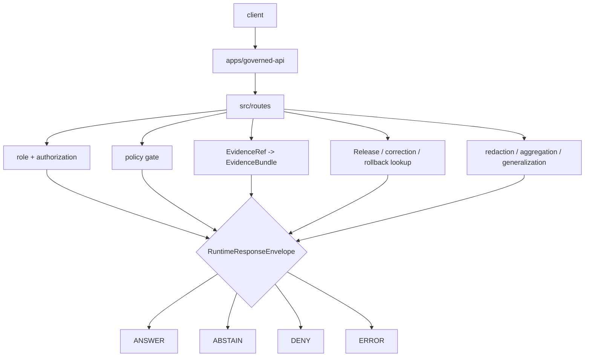

<!-- [KFM_META_BLOCK_V2]
doc_id: kfm://app/governed-api/src/routes/readme
title: Governed API Source Routes README
type: app-readme
version: v0.1
status: draft
owners: OWNER_TBD — API steward · Route steward · Policy steward · Evidence steward · Release steward · Runtime steward · Docs steward
created: 2026-06-16
updated: 2026-06-16
policy_label: public
related:
  - ../README.md
  - ../../README.md
  - ../../routes/README.md
  - ../governed_api/README.md
  - ../ai/README.md
  - ../../../README.md
  - ../../../explorer-web/README.md
  - ../../../../docs/adr/ADR-0004-apps-governed-api-is-the-trust-membrane.md
  - ../../../../schemas/contracts/v1/runtime/
  - ../../../../contracts/runtime/
  - ../../../../policy/access/README.md
  - ../../../../policy/decision/README.md
  - ../../../../packages/evidence-resolver/README.md
  - ../../../../packages/policy-runtime/README.md
  - ../../../../runtime/README.md
  - ../../../../release/README.md
  - ../../../../data/README.md
tags: [kfm, apps, governed-api, src, routes, route-handlers, trust-membrane, runtime-response-envelope, finite-outcomes]
notes:
  - "Replaces an empty governed-api src/routes README with a bounded route-source contract."
  - "This path may hold app-local route implementation modules for the Governed API; it is not a route-doctrine root, schema root, contract root, policy root, lifecycle root, release root, proof root, shared package root, runtime-adapter root, or public UI root."
  - "Route source files, handlers, DTOs, middleware, schemas, tests, fixtures, policy enforcement, deployment state, logs, dashboards, and CI pass state remain NEEDS VERIFICATION."
[/KFM_META_BLOCK_V2] -->

<a id="top"></a>

<div align="center">

# Governed API Source Routes

`apps/governed-api/src/routes/`

**App-local implementation source boundary for Governed API route handlers: runtime bootstrap, domain projections, layer metadata, evidence resolution, Focus, Story, Compare, Export, review retrieval, corrections, diagnostics, safe errors, and finite runtime envelopes.**


[Purpose](#1-purpose) · [Repo fit](#2-repo-fit) · [Boundary](#3-authority-boundary) · [Inputs](#5-inputs) · [Exclusions](#6-exclusions) · [Source map](#7-route-source-family-map) · [Definition of done](#14-definition-of-done)

</div>

---

> [!IMPORTANT]
> **Status:** draft / `NEEDS VERIFICATION`  
> **Owners:** `OWNER_TBD` — API steward · Route steward · Policy steward · Evidence steward · Release steward · Runtime steward · Docs steward  
> **Path:** `apps/governed-api/src/routes/README.md`  
> **Responsibility root:** `apps/` — deployable application surfaces  
> **Truth posture:** CONFIRMED README path / CONFIRMED governed-api source-tree boundary / CONFIRMED governed-api route-tree doctrine / PROPOSED route-source contract / UNKNOWN route handlers, DTOs, middleware, schemas, tests, fixtures, runtime behavior, deployment state, and CI pass state

> [!CAUTION]
> Route source code may enforce and project governed decisions, but it must not become a shortcut around the trust membrane. It must not redefine schema, contract, policy, data, release, proof, evidence, runtime-adapter, domain-doctrine, or public UI authority.

---

## 1. Purpose

`apps/governed-api/src/routes/` is the proposed source implementation home for route handlers inside the Governed API app.

It may eventually contain modules for:

- runtime bootstrap and shell-state handlers;
- domain route handler implementations;
- layer catalog, layer descriptor, and legend projections;
- EvidenceRef-to-EvidenceBundle lookup handlers;
- Focus and server-side AI-assisted route handlers;
- Story manifest and StoryNode projections;
- Compare and Export request handlers;
- read-only review and role-gated stewardship retrieval;
- correction, rollback, release, stale-state, and diagnostics handlers;
- safe `ABSTAIN`, `DENY`, and `ERROR` response builders.

This directory is not proof that any route handler, DTO, schema binding, middleware, policy gate, evidence resolver, release lookup, fixture, test, package script, deployment, log, dashboard, or CI pass state exists.

[Back to top](#top)

---

## 2. Repo fit

| Concern | Owning root | Expected relationship |
|---|---|---|
| Route implementation source | `apps/governed-api/src/routes/` | App-local route source modules, if implemented |
| Governed API source tree | `apps/governed-api/src/` | App-local implementation source boundary |
| Governed API package | `apps/governed-api/src/governed_api/` | Import package, if route handlers are package-local |
| Governed API route docs | `apps/governed-api/routes/` | Route-family documentation and organization |
| AI source subtree | `apps/governed-api/src/ai/` | Governed AI orchestration source, if kept separate |
| Runtime schemas | `schemas/contracts/v1/runtime/` | Machine shape for runtime envelopes |
| Runtime contracts | `contracts/runtime/` | Object meaning and envelope semantics |
| Policy support | `policy/`, `packages/policy-runtime/` | Admissibility and evaluator support |
| Evidence support | `packages/evidence-resolver/`, `data/proofs/` | EvidenceBundle support behind the membrane |
| Release authority | `release/` | Release decisions, correction notices, rollback cards |
| Lifecycle artifacts | `data/` | Source lifecycle, receipts, proofs, registry, catalog, triplets, and published outputs |
| Runtime adapters | `runtime/` | Adapter lane behind governed API |
| Client UI | `apps/explorer-web/` | Consumer of governed responses, not route authority |

## 3. Authority boundary

This folder may hold executable route source for the app. It does not own route doctrine, schemas, contracts, policy rules, data, release decisions, proofs, receipts, source acquisition, runtime-adapter implementation, shared packages, public UI rendering, operational deployment configuration, or emitted artifacts.

```text
apps/governed-api/src/routes/       = app-local route implementation source
apps/governed-api/src/              = source tree boundary
apps/governed-api/src/governed_api/ = app-local package boundary, if used
apps/governed-api/routes/           = route-family docs and organization
apps/governed-api/                  = trust membrane app contract
schemas/contracts/v1/               = machine shape
contracts/                          = object meaning
policy/                             = policy rules and documentation
data/                               = lifecycle artifacts, receipts, proofs, registries
release/                            = publication, correction, rollback authority
packages/                           = reusable helpers after extraction and review
runtime/                            = adapters behind governed API
```

## 4. Default posture

Route source modules should fail closed. No route handler should emit, validate, map, or forward a trust-bearing result unless it can preserve the finite envelope, policy decision, evidence support, release/correction/rollback refs, citations, redactions, stale-state, limitations, and audit-safe references required by the app contract.

A route source path should not emit or pass through `ANSWER` when any of these are unresolved:

- request schema and route action;
- caller role and authorization context;
- endpoint policy;
- EvidenceRef-to-EvidenceBundle support for claim-bearing responses;
- release manifest, correction, rollback, review, stale, or freshness state where material;
- source role, rights, sensitivity, redaction, generalization, or transform receipt where material;
- citation validation and limitation fields;
- server-side adapter constraints for AI-assisted responses;
- response-envelope validation;
- audit-safe request and decision references.

## 5. Inputs

| Input family | Examples | Required posture |
|---|---|---|
| Request context | route action, params, selected layer, evidence ref, feature ref, domain slug, caller role | Schema-validated and bounded |
| Runtime envelope | `RuntimeResponseEnvelope`, `DecisionEnvelope`, reason codes, audit refs | Exactly one finite outcome |
| Evidence context | EvidenceRef, EvidenceBundle refs, source roles, citations, limitations | Resolver behind governed API |
| Policy context | role, rights, sensitivity, release, stale-state, transform requirement | Policy gate required |
| Release context | release manifest, correction notice, rollback card, artifact digest | Required where response depends on released artifacts |
| Domain context | domain slug, object family, candidate/confirmed status, cross-domain refs | Domain-owned or explicitly referenced |
| Runtime context | server-side adapter result, Focus response, AIReceipt ref | Behind membrane; never direct browser call |
| Error context | schema failure, policy denial, missing evidence, stale support, adapter fault | Safe reason code only |

## 6. Exclusions

| Does not belong here | Correct home |
|---|---|
| App-level trust-membrane contract | `apps/governed-api/README.md` |
| Source-tree contract | `apps/governed-api/src/README.md` |
| Route-family docs | `apps/governed-api/routes/` |
| Domain doctrine and scope | `docs/domains/<domain>/` |
| Policy rules or policy bundles | `policy/` |
| Schemas and contracts | `schemas/contracts/v1/`, `contracts/` |
| Source data, lifecycle artifacts, receipts, proofs, registry, catalog, triplets, published outputs | `data/` |
| Release decisions, correction notices, rollback cards | `release/` |
| Source acquisition and ingest adapters | `connectors/`, `pipelines/`, `pipeline_specs/` |
| Shared route helpers reusable across apps | `packages/` after extraction and review |
| Public UI rendering | `apps/explorer-web/` |
| Steward/admin UI rendering | `apps/review-console/`, `apps/admin/` |
| Direct public lifecycle/canonical reads | Forbidden; use finite governed envelopes |
| Direct public runtime/model calls | Forbidden; use governed server-side adapters only |
| Restricted or sensitive details in logs, errors, telemetry, or public payloads | Forbidden unless a reviewed, bounded, release-approved transform explicitly allows them |

## 7. Route source family map

Exact route source files and implementation status remain `NEEDS VERIFICATION`.

| Candidate source family | Purpose | Required safeguard | Status |
|---|---|---|---|
| `runtime` / `bootstrap` | Shell/bootstrap state and route availability handlers | No client authority; finite envelope | PROPOSED |
| `domains` | Domain-specific governed projection handlers | Domain policy, evidence, release, and transform gates | PROPOSED |
| `agriculture` | Agriculture route implementation source | Aggregate/public-safe default; field/operator denial | CONFIRMED README path / implementation UNKNOWN |
| `layers` | Layer catalog, descriptors, legends, release summaries | Released/bounded-safe only | PROPOSED |
| `evidence` | EvidenceRef resolution and EvidenceDrawerPayload routes | EvidenceBundle support and policy | PROPOSED |
| `focus` | Governed AI/Focus answer routes | Server-side adapter, cite-or-abstain | PROPOSED |
| `story` | Story manifest/node/evidence-gate routes | 2D-first, evidence continuity | PROPOSED |
| `compare` | Compare releases, times, layers, or versions | Provenance and finite states | PROPOSED |
| `exports` | Safe export requests and receipt-linked artifacts | No uncited export | PROPOSED |
| `review` | Role-gated read-only/steward review payloads | Audited and policy-gated | PROPOSED |
| `corrections` | Correction notice, supersession, rollback lookup | Release-lineage refs required | PROPOSED |
| `diagnostics` | Safe version/envelope/layer/route diagnostics | No internal detail leakage | PROPOSED |
| `safe_errors` | Shared route-local error envelope helpers | No internal leakage | PROPOSED |

> [!WARNING]
> Candidate source-family names are not implementation proof. Do not document a route source module as live until files, tests, schemas, fixtures, policy gates, middleware, authorization, and deployment evidence confirm it.

## 8. Diagram



## 9. Runtime outcome contract

Every trust-bearing route source response should resolve to exactly one runtime status.

| Status | Meaning | Route-source posture |
|---|---|---|
| `ANSWER` | Safe, released, evidence-backed, policy-supported response exists | Include evidence, policy, release, transform, limitation, and citation refs where material |
| `ABSTAIN` | Evidence, review, freshness, source role, narrowing support, or scope is insufficient | Explain the held reason without fabricating an answer |
| `DENY` | Policy, rights, sensitivity, role, review, release, or exposure risk blocks response | Avoid leaking blocked material |
| `ERROR` | Runtime, adapter, schema, validation, or infrastructure fault prevents reliable response | Return audit-safe fault reference only |

## 10. Route-source obligations

| Obligation | Example effect |
|---|---|
| `finite_outcomes_required` | No route emits untyped success, empty success, or silent partial |
| `policy_required` | Sensitivity, rights, review, release, and transform obligations are checked |
| `evidence_required` | Claim-bearing `ANSWER` requires EvidenceBundle support |
| `release_refs_required` | Released public artifacts carry release/correction/rollback refs where material |
| `safe_error_only` | Errors do not expose protected details or internal route/resolver state |
| `no_parallel_authority` | Route source code does not redefine schema, contract, policy, release, data, domain, or proof authority |
| `adapter_boundary_preserved` | Runtime adapters are invoked server-side only behind the membrane |
| `auditability_required` | Request, decision, release, evidence, and transform refs support later review |

## 11. Inspection path

Route source files, handlers, DTOs, middleware, schemas, fixtures, tests, policy integration, authorization, safe-error behavior, logs, dashboards, deployment state, and emitted artifacts remain `NEEDS VERIFICATION`.

```bash
find apps/governed-api/src/routes -maxdepth 6 -type f | sort
find apps/governed-api/src apps/governed-api/routes runtime packages schemas contracts policy release data tests fixtures .github/workflows -maxdepth 6 -type f 2>/dev/null | grep -Ei 'RuntimeResponseEnvelope|DecisionEnvelope|EvidenceBundle|EvidenceRef|PolicyDecision|ReleaseManifest|CorrectionNotice|RollbackCard|AIReceipt|CitationValidationReport|runtime.?bootstrap|domains|agriculture|layers|evidence|focus|story|export|review|correction|diagnostic|abstain|deny|error|route|middleware|dto|mapper|audit|test|fixture' | sort
```

## 12. Validation expectations

Useful validation for this route-source boundary should cover:

- every trust-bearing route returns exactly one `ANSWER`, `ABSTAIN`, `DENY`, or `ERROR` status;
- unresolved review, rights, release, transform, sensitivity, or source-role posture fails closed;
- sensitive exact or protected details are denied unless a reviewed transform and release path explicitly allows a bounded response;
- candidate or inferred objects remain labeled and cannot become confirmed observations through route language;
- missing, stale, weak, conflicting, or unresolved evidence returns `ABSTAIN` rather than generated filler;
- policy denial returns `DENY` without blocked detail;
- schema, adapter, resolver, or infrastructure faults return `ERROR` with safe details only;
- response envelopes preserve evidence refs, policy decision refs, release refs, correction refs, rollback refs, citations, limitations, redactions, stale state, and reason codes where material.

## 13. Safe change pattern

For route-source changes:

1. Add or update source inventory and route-source contract.
2. Link DTOs to runtime and route-family schemas before changing response shape.
3. Add fixtures for `ANSWER`, `ABSTAIN`, `DENY`, `ERROR`, policy denial, missing evidence, stale evidence, unresolved review, transform missing, release missing, and safe error cases.
4. Add policy and safe-error tests before exposing any public route.
5. Preserve evidence refs, policy decision refs, release refs, correction refs, rollback refs, citations, limitations, redactions, stale state, and audit refs through every response.
6. Update this README, `apps/governed-api/src/README.md`, `apps/governed-api/README.md`, route READMEs, affected domain/feature docs, policy docs, schemas/contracts, and tests when route behavior materially changes.

## 14. Definition of done

- [ ] Owners are confirmed and `OWNER_TBD` is replaced.
- [ ] Route source inventory and ownership are documented.
- [ ] Runtime envelope and route DTO/schema bindings are verified.
- [ ] Authorization, policy runtime, evidence resolver, release lookup, transform receipt, and audit hooks are documented and tested.
- [ ] Finite outcome fixtures cover `ANSWER`, `ABSTAIN`, `DENY`, and `ERROR`.
- [ ] Sensitive-detail denial tests are present and passing.
- [ ] Candidate/inferred-not-confirmed tests are present and passing.
- [ ] Missing-evidence and stale-evidence abstention tests are present and passing.
- [ ] Policy denial and domain-sensitive denial tests are present and passing.
- [ ] Safe-error tests are present and passing.

## 15. Open verification items

| Item | Why it matters |
|---|---|
| Confirm route source files beyond README | Prevents overclaiming runtime maturity |
| Confirm relationship to `apps/governed-api/routes/` docs | Required to avoid parallel route homes |
| Confirm route DTOs and schemas | Required before route behavior claims |
| Confirm authorization and role resolution | Required before public/restricted split claims |
| Confirm policy runtime integration | Required before sensitivity/rights/release claims |
| Confirm evidence resolver integration | Required before EvidenceBundle closure claims |
| Confirm release/correction/rollback lookup | Required before publication-state claims |
| Confirm transform receipt handling | Required before redacted/generalized output claims |
| Confirm safe-error behavior | Required before public exposure |
| Confirm test and fixture coverage | Required before runtime maturity claims |
| Confirm deployment, logs, dashboards, and audit receipts | Required before operational claims |

<details>
<summary>Appendix A — no-loss preservation note</summary>

The previous README was empty. This replacement adds a bounded governed-api route-source contract without claiming route source files, handlers, DTOs, schemas, middleware, authorization, policy enforcement, evidence resolution, release lookup, transform receipt support, tests, fixtures, deployment, logs, dashboards, or CI pass state are implemented.

</details>

## Status summary

`apps/governed-api/src/routes/` should contain app-local route implementation source only after source inventory, DTOs, route bindings, schemas, authorization, policy runtime integration, evidence resolver integration, release/correction/rollback lookups, transform receipt support, safe-error behavior, finite-outcome fixtures, tests, and operational evidence are verified.

It must preserve the trust membrane and route-source boundary: route code may enforce and compose governed finite envelopes, but it must not become schema authority, contract authority, policy authority, lifecycle storage, release authority, proof storage, domain doctrine, direct source access, public UI rendering, runtime-adapter authority, or unsupported generated answer surface.

<p align="right"><a href="#top">Back to top</a></p>
