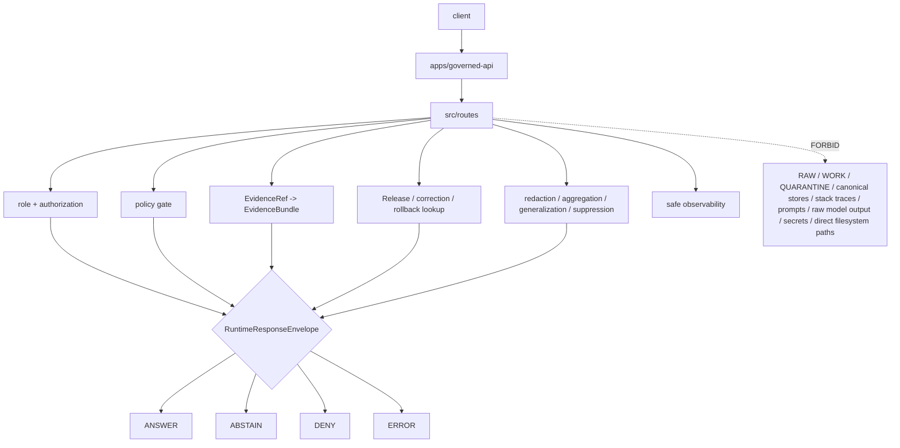

<!-- [KFM_META_BLOCK_V2]
doc_id: kfm://app/governed-api/src/routes/readme
title: Governed API Source Routes README
type: app-readme
version: v0.2
status: draft
owners: OWNER_TBD — API steward · Route steward · Policy steward · Evidence steward · Release steward · Runtime steward · Security steward · Privacy steward · Audit steward · Docs steward
created: 2026-06-16
updated: 2026-07-09
policy_label: public
related:
  - ../README.md
  - ../../README.md
  - ../../routes/README.md
  - ../../routes/domains/README.md
  - ../../routes/domains/archaeology/README.md
  - ../governed_api/README.md
  - ../governed_api/routes/README.md
  - ../ai/README.md
  - ../../../README.md
  - ../../../explorer-web/README.md
  - ../../../../docs/doctrine/directory-rules.md
  - ../../../../docs/adr/ADR-0004-apps-governed-api-is-the-trust-membrane.md
  - ../../../../schemas/contracts/v1/runtime/
  - ../../../../schemas/contracts/v1/domains/
  - ../../../../schemas/contracts/v1/evidence/
  - ../../../../schemas/contracts/v1/focus/
  - ../../../../contracts/runtime/
  - ../../../../contracts/domains/
  - ../../../../contracts/evidence/
  - ../../../../contracts/focus/
  - ../../../../policy/access/README.md
  - ../../../../policy/decision/README.md
  - ../../../../policy/domains/README.md
  - ../../../../policy/telemetry/README.md
  - ../../../../packages/evidence-resolver/README.md
  - ../../../../packages/policy-runtime/README.md
  - ../../../../runtime/README.md
  - ../../../../release/README.md
  - ../../../../data/README.md
tags: [kfm, apps, governed-api, src, routes, route-handlers, trust-membrane, runtime-response-envelope, finite-outcomes, safe-errors, safe-observability, route-source-boundary]
notes:
  - "Refreshes the bounded governed-api src/routes route-source contract."
  - "This path may hold app-local route implementation modules for the Governed API. It is distinct from `apps/governed-api/routes/`, which is the route-family documentation/organization boundary, and from `apps/governed-api/src/governed_api/routes/`, which is a Python package route-implementation subtree if used."
  - "Route source files may bind handlers, route modules, DTO mapping, authorization handoff, policy/evidence/release lookups, transform receipt handling, finite envelope construction, safe errors, and safe observability, but they must not become route doctrine, schema authority, contract authority, policy authority, lifecycle storage, release authority, proof/receipt storage, runtime-adapter authority, telemetry authority, public UI, or direct source/model access."
  - "Route source files, handlers, DTOs, middleware, schemas, tests, fixtures, authorization, policy runtime integration, evidence resolver integration, release lookup, transform receipt support, safe logging, safe telemetry, deployment state, dashboards, and CI pass state remain NEEDS VERIFICATION."
  - "v0.2 adds a current evidence basis, Directory Rules placement basis, route-source/package-route distinction, minimum safe route-source slice, runtime anti-bypass matrix, stronger safe-observability and AI-boundary gates, import/registration separation, and validation/definition-of-done updates without claiming runtime maturity."
[/KFM_META_BLOCK_V2] -->

<a id="top"></a>

<div align="center">

# Governed API Source Routes

`apps/governed-api/src/routes/`

**App-local source boundary for Governed API route implementation modules: runtime/bootstrap routes, domain projections, layer metadata, evidence resolution, Focus/AI request handlers, Story/Compare/Export/review/correction/diagnostic routes, DTO mapping, finite-envelope assembly, safe errors, safe observability, and trust-membrane route support.**


[Evidence](#0-evidence-basis-for-this-revision) · [Purpose](#1-purpose) · [Repo fit](#2-repo-fit) · [Boundary](#3-authority-boundary) · [Inputs](#5-inputs) · [Exclusions](#6-exclusions) · [Source map](#7-route-source-family-map) · [Minimum slice](#8-minimum-safe-route-source-slice) · [Definition of done](#16-definition-of-done)

</div>

---

> [!IMPORTANT]
> **Status:** draft / `NEEDS VERIFICATION`  
> **Owners:** `OWNER_TBD` — API steward · Route steward · Policy steward · Evidence steward · Release steward · Runtime steward · Security steward · Privacy steward · Audit steward · Docs steward  
> **Path:** `apps/governed-api/src/routes/README.md`  
> **Responsibility root:** `apps/` — deployable application surfaces  
> **Directory Rules basis:** executable app-local route source belongs under the deployable Governed API app source tree. `src/routes/` is implementation support under `apps/governed-api/`; it is not a route doctrine root, schema home, contract home, policy home, lifecycle-data lane, release authority, proof/receipt store, shared package extraction root, runtime-adapter package, public UI, telemetry policy root, or audit store.  
> **Truth posture:** CONFIRMED current GitHub README path / CONFIRMED parent source-tree README exists / CONFIRMED governed-api trust-membrane README exists / CONFIRMED app-level route-tree README exists / CONFIRMED parent Python package README exists / CONFIRMED `src/governed_api/routes/README.md` exists blank on `main` at this revision / CONFIRMED Directory Rules document exists / PROPOSED route-source contract / UNKNOWN route source files, route handlers, routers, DTOs, middleware, schemas, tests, fixtures, authorization, policy runtime integration, evidence resolver integration, release lookup, transform receipt support, safe logging, safe telemetry, deployment state, dashboards, CI pass state, and runtime behavior

> [!CAUTION]
> Route source code may enforce and project governed decisions, but it must not become a shortcut around the trust membrane. It must not redefine schema, contract, policy, data, release, proof, evidence, runtime-adapter, domain-doctrine, audit, telemetry-policy, or public UI authority. It must not return raw lifecycle content, unpublished candidates, source-system internals, stack traces, prompt text, model output as truth, protected geometry, credentials, or direct filesystem references.

---

## Quick jump

- [0. Evidence basis for this revision](#0-evidence-basis-for-this-revision)
- [1. Purpose](#1-purpose)
- [2. Repo fit](#2-repo-fit)
- [3. Authority boundary](#3-authority-boundary)
- [4. Default posture](#4-default-posture)
- [5. Inputs](#5-inputs)
- [6. Exclusions](#6-exclusions)
- [7. Route source family map](#7-route-source-family-map)
- [8. Minimum safe route source slice](#8-minimum-safe-route-source-slice)
- [9. Diagram](#9-diagram)
- [10. Runtime outcome contract](#10-runtime-outcome-contract)
- [11. Route-source obligations](#11-route-source-obligations)
- [12. Runtime anti-bypass matrix](#12-runtime-anti-bypass-matrix)
- [13. Inspection path](#13-inspection-path)
- [14. Validation expectations](#14-validation-expectations)
- [15. Safe change pattern](#15-safe-change-pattern)
- [16. Definition of done](#16-definition-of-done)
- [17. Open verification items](#17-open-verification-items)

---

## 0. Evidence basis for this revision

This README is a documentation boundary, not runtime proof. The 2026-07-09 revision updates an existing README and keeps implementation maturity bounded while aligning route source with the Governed API source-tree, app-level route-tree, and Python-package route posture.

| Evidence item | Status | What it supports | What it does not prove |
|---|---|---|---|
| `apps/governed-api/src/routes/README.md` exists on `main`. | CONFIRMED | This is an existing README update, not a new path proposal. | It does not prove route source files, handlers, routers, middleware, DTOs, fixtures, tests, deployment, logs, dashboards, or runtime behavior exist. |
| `apps/governed-api/src/README.md` exists and describes `src/` as implementation source, not sovereignty. | CONFIRMED document presence and source-tree posture | `src/routes/` is app-local implementation source beneath the governed API app. | It does not prove source modules, middleware, DTOs, or tests exist. |
| `apps/governed-api/README.md` exists and describes the app as the normal public trust path for finite governed envelopes. | CONFIRMED document presence and trust-membrane posture | Route source code should preserve finite governed envelopes and safe projections. | It does not prove runtime enforcement or endpoint behavior. |
| `apps/governed-api/routes/README.md` exists and states route folders are not authority roots. | CONFIRMED document presence and route-tree posture | Source route code must enforce and project, not absorb schemas, contracts, policy, data, release, package, runtime, or UI authority. | It does not prove app-level route or source-route implementation wiring. |
| `apps/governed-api/src/governed_api/README.md` exists and describes the Python package as app-local implementation support. | CONFIRMED document presence and package posture | `src/routes/` must remain coordinated with the package boundary and avoid parallel route authority. | It does not prove package import configuration or route registration behavior. |
| `apps/governed-api/src/governed_api/routes/README.md` exists as a blank file on `main` at this revision. | CONFIRMED blank child README state | `src/routes/` and package-local `src/governed_api/routes/` need explicit relationship and migration posture. | It does not prove route implementation modules or that any separate child README draft has merged. |
| `docs/doctrine/directory-rules.md` exists and identifies root placement as ownership/lifecycle governance; `apps/` is the deployable implementation root. | CONFIRMED document presence and placement posture | `apps/governed-api/src/routes/` is app-local implementation support under a deployable app. | It does not prove route code is complete, tested, deployed, or release-ready. |

[Back to top](#top)

---

## 1. Purpose

`apps/governed-api/src/routes/` is the proposed source implementation home for route handlers inside the Governed API app.

It may eventually contain modules for:

- runtime bootstrap and shell-state handlers;
- domain route handler implementations;
- layer catalog, layer descriptor, legend, and release-summary projections;
- EvidenceRef-to-EvidenceBundle lookup handlers;
- Focus and server-side AI-assisted route handlers;
- Story manifest and StoryNode projections;
- Compare and Export request handlers;
- read-only review and role-gated stewardship retrieval;
- correction, rollback, release, stale-state, and diagnostics handlers;
- safe `ABSTAIN`, `DENY`, and `ERROR` response builders;
- safe logging, metrics, telemetry, cache-key, and diagnostics discipline for route handling.

This directory is not proof that any route handler, router, DTO, schema binding, middleware, policy gate, evidence resolver, release lookup, transform receipt path, fixture, test, package script, deployment, log, dashboard, CI pass state, or runtime behavior exists.

[Back to top](#top)

---

## 2. Repo fit

| Concern | Owning root | Expected relationship |
|---|---|---|
| Route implementation source | `apps/governed-api/src/routes/` | App-local route source modules, if implemented |
| Governed API source tree | `apps/governed-api/src/` | App-local implementation source boundary |
| Governed API Python package | `apps/governed-api/src/governed_api/` | App-local import package boundary, if used |
| Python route implementation package | `apps/governed-api/src/governed_api/routes/` | Package-local route-handler subtree; blank README on `main` at this revision |
| Governed API route docs | `apps/governed-api/routes/` | Route-family documentation and organization; distinct from source implementation |
| Governed API app contract | `apps/governed-api/README.md` | App-level trust membrane contract |
| AI source subtree | `apps/governed-api/src/ai/` | Governed AI orchestration source, if kept separate |
| Runtime schemas/contracts | `schemas/contracts/v1/runtime/`, `contracts/runtime/` | Runtime envelope machine shape and object meaning |
| Domain schemas/contracts | `schemas/contracts/v1/domains/`, `contracts/domains/` | Domain route payload shape and meaning, if present and accepted |
| Evidence schemas/contracts | `schemas/contracts/v1/evidence/`, `contracts/evidence/` | Evidence projection shape and meaning, if present and accepted |
| Policy support | `policy/`, `packages/policy-runtime/` | Admissibility and evaluator support |
| Evidence support | `packages/evidence-resolver/`, `data/proofs/` | EvidenceBundle support behind the membrane |
| Release authority | `release/` | Release decisions, correction notices, rollback cards |
| Lifecycle artifacts | `data/` | Source lifecycle, receipts, proofs, registry, catalog, triplets, and published outputs |
| Runtime adapters | `runtime/` | Adapter lane behind governed API |
| Shared helpers | `packages/` | Reusable helpers only after extraction and ownership review |
| Client UI | `apps/explorer-web/` | Consumer of governed responses, not route authority |

## 3. Authority boundary

This folder may hold executable route source for the app. It does not own route doctrine, schemas, contracts, policy rules, data, release decisions, proofs, receipts, source acquisition, runtime-adapter implementation, shared packages, public UI rendering, operational deployment configuration, telemetry policy, audit truth, or emitted artifacts.

```text
apps/governed-api/src/routes/                 = app-local route implementation source
apps/governed-api/src/                        = source tree boundary
apps/governed-api/src/governed_api/           = app-local Python package boundary
apps/governed-api/src/governed_api/routes/    = package-local route implementation subtree, if used
apps/governed-api/routes/                     = route-family docs and organization
apps/governed-api/                            = trust membrane app contract
schemas/contracts/v1/                         = machine shape
contracts/                                    = object meaning
policy/                                       = policy rules and documentation
data/                                         = lifecycle artifacts, receipts, proofs, registries
release/                                      = publication, correction, rollback authority
packages/                                     = reusable helpers after extraction and review
runtime/                                      = adapters behind governed API
apps/explorer-web/                            = client UI consumer
```

## 4. Default posture

Route source modules should fail closed. No route handler should emit, validate, map, or forward a trust-bearing result unless it can preserve the finite envelope, policy decision, evidence support, release/correction/rollback refs, citations, redactions, stale-state, limitations, and audit-safe references required by the app contract.

A route source path should not emit or pass through `ANSWER` when any of these are unresolved:

- request schema and route action;
- caller role and authorization context;
- endpoint policy and rate/size safety posture;
- EvidenceRef-to-EvidenceBundle support for claim-bearing responses;
- release manifest, correction, rollback, review, stale, or freshness state where material;
- source role, rights, sensitivity, redaction, generalization, aggregation, delayed-release, suppression, or transform receipt where material;
- citation validation and limitation fields;
- server-side adapter constraints for AI-assisted responses;
- response-envelope validation;
- safe logging, metrics, telemetry, cache-key, and diagnostics behavior;
- audit-safe request and decision references.

## 5. Inputs

| Input family | Examples | Required posture |
|---|---|---|
| Request context | route action, params, selected layer, evidence ref, feature ref, domain slug, caller role | Schema-validated and bounded |
| Runtime envelope | `RuntimeResponseEnvelope`, `DecisionEnvelope`, reason codes, audit refs | Exactly one finite outcome |
| Evidence context | EvidenceRef, EvidenceBundle refs, source roles, citations, limitations | Resolver behind governed API |
| Policy context | role, rights, sensitivity, release, stale-state, transform requirement | Policy gate required |
| Release context | release manifest, correction notice, rollback card, artifact digest | Required where response depends on released artifacts |
| Domain context | domain slug, object family, candidate/confirmed status, cross-domain refs | Domain-owned or explicitly referenced |
| Transform context | redaction, generalization, aggregation, delay, suppression, coordinate rounding, transform receipt | Receipt-backed or reason-coded |
| Runtime/AI context | server-side adapter result, Focus response, AIReceipt ref | Behind membrane; never direct browser call |
| Error context | schema failure, policy denial, missing evidence, stale support, adapter fault | Safe reason code only |
| Observability context | log event, metric, cache key, telemetry event, diagnostic ref | No raw evidence, prompts, restricted geometry, secrets, or internal handles |

## 6. Exclusions

| Does not belong here | Correct home |
|---|---|
| App-level trust-membrane contract | `apps/governed-api/README.md` |
| Source-tree contract | `apps/governed-api/src/README.md` |
| Package-level contract | `apps/governed-api/src/governed_api/README.md` |
| Route-family docs | `apps/governed-api/routes/` |
| Domain doctrine and scope | `docs/domains/<domain>/` |
| Policy rules or policy bundles | `policy/` |
| Schemas and contracts | `schemas/contracts/v1/`, `contracts/` |
| Source data, lifecycle artifacts, receipts, proofs, registry, catalog, triplets, published outputs | `data/` |
| Release decisions, correction notices, rollback cards | `release/` |
| Source acquisition and ingest adapters | `connectors/`, `pipelines/`, `pipeline_specs/` |
| Shared route helpers reusable across apps | `packages/` after extraction and review |
| Runtime/model adapter implementation | `runtime/` or accepted adapter packages, invoked server-side only |
| Public UI rendering | `apps/explorer-web/` |
| Steward/admin UI rendering | `apps/review-console/`, `apps/admin/` |
| Direct public lifecycle/canonical reads | Forbidden; use finite governed envelopes |
| Direct public runtime/model calls | Forbidden; use governed server-side adapters only |
| Restricted or sensitive details in logs, errors, telemetry, cache keys, diagnostics, or public payloads | Forbidden unless a reviewed, bounded, release-approved transform explicitly allows them |
| Deployment-only values | Deployment environment and config channels, not route source docs |

## 7. Route source family map

Exact route source files and implementation status remain `NEEDS VERIFICATION`.

| Candidate source family | Purpose | Required safeguard | Status |
|---|---|---|---|
| `runtime` / `bootstrap` | Shell/bootstrap state and route availability handlers | No client authority; finite envelope | PROPOSED |
| `domains` | Domain-specific governed projection handlers | Domain policy, evidence, release, and transform gates | PROPOSED |
| `agriculture` | Agriculture route implementation source | Aggregate/public-safe default; field/operator denial | CONFIRMED README path / implementation UNKNOWN |
| `archaeology` | Archaeology route implementation source | Exact-location denial, cultural review, transform receipts | PROPOSED unless route source files verified |
| `layers` | Layer catalog, descriptors, legends, release summaries | Released/bounded-safe only | PROPOSED |
| `evidence` | EvidenceRef resolution and EvidenceDrawerPayload routes | EvidenceBundle support and policy | PROPOSED |
| `focus` | Governed AI/Focus answer routes | Server-side adapter, cite-or-abstain | PROPOSED |
| `story` | Story manifest/node/evidence-gate routes | 2D-first, evidence continuity | PROPOSED |
| `compare` | Compare releases, times, layers, or versions | Provenance and finite states | PROPOSED |
| `exports` | Safe export requests and receipt-linked artifacts | No uncited export | PROPOSED |
| `review` | Role-gated read-only/steward review payloads | Audited and policy-gated | PROPOSED |
| `corrections` | Correction notice, supersession, rollback lookup | Release-lineage refs required | PROPOSED |
| `diagnostics` | Safe version/envelope/layer/route diagnostics | No internal detail leakage | PROPOSED |
| `safe_errors` | Shared route-local error envelope helpers | No internal leakage | PROPOSED |
| `observability` | Log/metric/telemetry/cache helpers | No prompts, raw evidence, restricted geometry, secrets | PROPOSED |

> [!WARNING]
> Candidate source-family names are not implementation proof. Do not document a route source module as live until files, tests, schemas, fixtures, policy gates, middleware, authorization, and deployment evidence confirm it.

## 8. Minimum safe route source slice

A smallest useful route-source slice should prove the public trust membrane before adding route breadth.

| Slice item | Minimum requirement | Why it is required |
|---|---|---|
| Source inventory | Every implemented route module has owner, route family, method/action, DTOs, finite outcomes, and handoffs | Prevents undocumented route drift |
| Route registration boundary | App registration is explicit; importing modules does not publish routes or mutate state | Prevents import side effects |
| Request DTO validation | Parameters, body, query, role, audience, and bounds validate against accepted shapes | Prevents malformed inputs becoming claims |
| Authorization guard | Caller role and endpoint access fail closed | Prevents public/restricted collapse |
| Policy gate | Sensitivity, rights, review, release, and domain obligations gate responses | Keeps policy outside route convenience logic |
| Evidence gate | Claim-bearing `ANSWER` requires EvidenceBundle support | Preserves cite-or-abstain |
| Release/transform gate | Release refs, correction/rollback refs, transform receipts, and redaction/generalization state are preserved | Prevents publication bypass |
| Finite envelope builder | All trust-bearing responses return exactly one finite outcome | Prevents plain dict/string success |
| Safe error mapper | Faults become safe `ERROR` envelopes | Prevents stack trace/internal path leakage |
| Safe observability guard | Logs, metrics, telemetry, diagnostics, and cache keys exclude raw evidence, prompts, model output, restricted geometry, PII, secrets, provider traces, and full bundle copies | Prevents side-channel leakage |
| Read-only/mutation split | Read routes cannot write review decisions, lifecycle state, EvidenceRefs, releases, receipts, audit, or provenance | Preserves governed state transitions |
| AI boundary guard | AI-assisted routes use server-side governed AI orchestration and never expose browser-to-model or raw model-output paths | Preserves governed AI trust membrane |

This slice is still `PROPOSED` until files, fixtures, tests, route wiring, and accepted contracts are verified.

## 9. Diagram



## 10. Runtime outcome contract

Every trust-bearing route source response should resolve to exactly one runtime status.

| Status | Meaning | Route-source posture |
|---|---|---|
| `ANSWER` | Safe, released, evidence-backed, policy-supported response exists | Include evidence, policy, release, transform, limitation, and citation refs where material |
| `ABSTAIN` | Evidence, review, freshness, source role, narrowing support, or scope is insufficient | Explain the held reason without fabricating an answer |
| `DENY` | Policy, rights, sensitivity, role, review, release, or exposure risk blocks response | Avoid leaking blocked material |
| `ERROR` | Runtime, adapter, schema, validation, or infrastructure fault prevents reliable response | Return audit-safe fault reference only |

## 11. Route-source obligations

| Obligation | Example effect |
|---|---|
| `finite_outcomes_required` | No route emits untyped success, empty success, silent partial, or generated fallback |
| `authorization_required` | Caller role and endpoint access are resolved before sensitive work |
| `policy_required` | Sensitivity, rights, review, release, and transform obligations are checked |
| `evidence_required` | Claim-bearing `ANSWER` requires EvidenceBundle support |
| `release_refs_required` | Released public artifacts carry release/correction/rollback refs where material |
| `transform_receipt_required` | Redaction/generalization/delay/aggregation/suppression must be receipt-backed or reason-coded |
| `safe_error_only` | Errors do not expose protected details, internal routes, stack traces, adapter internals, filesystem paths, or secrets |
| `safe_observability_only` | Logs, metrics, telemetry, diagnostics, and cache keys do not carry raw evidence, prompts, model output, restricted geometry, PII, provider traces, or secrets |
| `read_only_mutation_split` | Read-only routes cannot write review decisions, lifecycle state, evidence refs, releases, receipts, audit stores, or provenance stores |
| `adapter_boundary_preserved` | Runtime/model adapters are invoked server-side only behind the membrane |
| `route_docs_distinct_from_source` | `apps/governed-api/routes/` remains docs/organization; `src/routes/` remains implementation source |
| `package_routes_distinct_from_source_routes` | `src/governed_api/routes/` is package-local implementation if used; it must not create a parallel route authority |
| `no_parallel_authority` | Route source code does not redefine schema, contract, policy, release, data, proof, receipt, telemetry-policy, domain, or audit authority |

## 12. Runtime anti-bypass matrix

| Bypass risk | Required behavior | Review signal |
|---|---|---|
| Handler returns plain dict/string instead of finite envelope | Deny in review; wrap in validated `RuntimeResponseEnvelope` | Response-shape fixture rejects untyped return |
| Handler reads lifecycle/canonical/internal stores directly for public response | Deny; route through governed services and projections | Import/fetch scan and tests block direct public reads |
| Missing evidence produces generated answer | Return `ABSTAIN` with reason | Missing-evidence fixture blocks answer |
| Policy denial leaks blocked details | Return `DENY` with safe reason only | Sensitive-denial fixture hides protected payload |
| Transform lacks receipt/reference | Return `ABSTAIN`, `DENY`, or safe bounded alternative | Transform-missing fixture blocks public response |
| Source route silently diverges from package route | Require documented ownership and registration boundary | Source/package route inventory reconciles both paths |
| Route import publishes routes or mutates state | Require explicit app registration and no import side effects | Import-side-effect fixture passes |
| Route writes state from read-only endpoint | Deny; split mutating route with authorization/audit | Read-only mutation fixture fails on writes |
| Error exposes stack trace/internal path/secret | Return safe `ERROR` envelope | Safe-error fixture blocks leakage |
| Logs/telemetry/cache key include prompt/raw evidence/restricted geometry | Redact, hash, bucket, or omit | Safe-observability fixture blocks leakage |
| AI-assisted route exposes browser-to-model path | Deny; use server-side governed AI orchestration | Network/import scan blocks model provider access from client route |
| Route module embeds schema/policy/release constants as authority | Move to owning roots or generated bindings | Review finds no parallel authority tables |
| Shared route helper hardens inside app route source | Extract to `packages/` only after ownership review | Reuse review avoids accidental shared-root drift |

## 13. Inspection path

Route source files, handlers, DTOs, middleware, schemas, fixtures, tests, policy integration, authorization, safe-error behavior, safe logging/telemetry/cache behavior, deployment state, dashboards, and emitted artifacts remain `NEEDS VERIFICATION`.

```bash
find apps/governed-api/src/routes -maxdepth 6 -type f | sort
find apps/governed-api/src/governed_api/routes -maxdepth 6 -type f 2>/dev/null | sort
find apps/governed-api/src apps/governed-api/routes runtime packages schemas contracts policy release data tests fixtures .github/workflows -maxdepth 6 -type f 2>/dev/null | grep -Ei 'RuntimeResponseEnvelope|DecisionEnvelope|EvidenceBundle|EvidenceRef|PolicyDecision|ReleaseManifest|CorrectionNotice|RollbackCard|AIReceipt|CitationValidationReport|RedactionReceipt|ReviewRecord|SensitivityTransform|runtime.?bootstrap|domains|agriculture|archaeology|layers|evidence|focus|story|export|review|correction|diagnostic|abstain|deny|error|route|middleware|dto|mapper|audit|safe.?log|telemetry|cache|test|fixture' | sort
find data/raw data/work data/quarantine data/processed data/catalog data/triplets data/published data/receipts data/proofs -maxdepth 2 -type f 2>/dev/null | sort
```

## 14. Validation expectations

Useful validation for this route-source boundary should cover:

- every trust-bearing route returns exactly one `ANSWER`, `ABSTAIN`, `DENY`, or `ERROR` status;
- request and response DTOs validate against accepted schemas/contracts;
- authorization and caller role resolution fail closed;
- unresolved review, rights, release, transform, sensitivity, source-role posture, or stale evidence fails closed;
- sensitive exact or protected details are denied unless a reviewed transform and release path explicitly allows a bounded response;
- candidate or inferred objects remain labeled and cannot become confirmed observations through route language;
- missing, stale, weak, conflicting, or unresolved evidence returns `ABSTAIN` rather than generated filler;
- policy denial returns `DENY` without blocked detail or exposure hints;
- schema, adapter, resolver, or infrastructure faults return `ERROR` with safe details only;
- response envelopes preserve evidence refs, policy decision refs, release refs, correction refs, rollback refs, citations, limitations, redactions, stale state, transform refs, and reason codes where material;
- read-only routes cannot mutate review decisions, lifecycle state, EvidenceRefs, releases, receipts, audit stores, or provenance stores;
- route source and `src/governed_api/routes/` package-local route modules are reconciled so no parallel implementation authority emerges;
- route imports do not register routes, write state, fetch sources, call models, or mutate lifecycle artifacts unless explicitly invoked by app wiring;
- logs, metrics, telemetry, diagnostics, and cache keys do not include prompts, raw evidence, raw outputs, restricted geometry, PII, secrets, provider traces, internal handles, or full bundle copies;
- AI-assisted routes do not expose raw model output, private chain-of-thought, provider traces, or browser-to-model shortcuts.

## 15. Safe change pattern

For route-source changes:

1. Add or update source inventory and route-source contract.
2. Reconcile `apps/governed-api/src/routes/`, `apps/governed-api/src/governed_api/routes/`, and `apps/governed-api/routes/` so implementation, package, and documentation responsibilities remain distinct.
3. Link DTOs to runtime, route-family, domain, evidence, policy, release, transform, and AI/citation schemas before changing response shape.
4. Add fixtures for `ANSWER`, `ABSTAIN`, `DENY`, `ERROR`, policy denial, missing evidence, stale evidence, unresolved review, transform missing, release missing, safe error, unsafe logging, unsafe telemetry, unsafe cache key, candidate-not-confirmed, unauthorized caller, read-only mutation denied, import side-effect denied, and browser-model denied cases.
5. Add authorization, policy, safe-error, safe-observability, evidence, release, transform, read-only/mutation-boundary, no-browser-model, and AI-boundary tests before exposing any public route.
6. Preserve evidence refs, policy decision refs, release refs, correction refs, rollback refs, citations, limitations, redactions, stale state, transform refs, AIReceipt refs where applicable, and audit refs through every response.
7. Update this README, `apps/governed-api/src/README.md`, `apps/governed-api/src/governed_api/README.md`, `apps/governed-api/README.md`, route READMEs, affected domain/feature docs, policy docs, schemas/contracts, fixtures, and tests when route behavior materially changes.

## 16. Definition of done

- [ ] Owners are confirmed and `OWNER_TBD` is replaced.
- [ ] Evidence basis is refreshed when parent source/app docs, package docs, route docs, schemas, contracts, policy, evidence resolver, release, runtime, fixtures, tests, workflow, telemetry, or deployment evidence changes.
- [ ] Route source inventory and ownership are documented.
- [ ] Relationship to `apps/governed-api/src/governed_api/routes/` and `apps/governed-api/routes/` is documented.
- [ ] Route registration and import-side-effect behavior are verified.
- [ ] Runtime envelope and route DTO/schema bindings are verified.
- [ ] Authorization, policy runtime, evidence resolver, release lookup, transform receipt, and audit hooks are documented and tested.
- [ ] Finite outcome fixtures cover `ANSWER`, `ABSTAIN`, `DENY`, and `ERROR`.
- [ ] Sensitive-detail denial tests are present and passing.
- [ ] Candidate/inferred-not-confirmed tests are present and passing.
- [ ] Missing-evidence and stale-evidence abstention tests are present and passing.
- [ ] Policy denial and domain-sensitive denial tests are present and passing.
- [ ] Safe-error tests are present and passing.
- [ ] Safe logging, metrics, telemetry, cache-key, diagnostics, and observability tests are present and passing.
- [ ] Read-only vs mutating route boundaries are documented and tested.
- [ ] AI-assisted route no-raw-model-output and no-chain-of-thought tests are present and passing where applicable.

## 17. Open verification items

| Item | Why it matters |
|---|---|
| Confirm route source files beyond README | Prevents overclaiming runtime maturity |
| Confirm relationship to `apps/governed-api/routes/` docs | Required to avoid parallel route homes |
| Confirm relationship to `apps/governed-api/src/governed_api/routes/` package route subtree | Required to avoid duplicate implementation authority |
| Confirm route DTOs and schemas | Required before route behavior claims |
| Confirm authorization and role resolution | Required before public/restricted split claims |
| Confirm policy runtime integration | Required before sensitivity/rights/release claims |
| Confirm evidence resolver integration | Required before EvidenceBundle closure claims |
| Confirm release/correction/rollback lookup | Required before publication-state claims |
| Confirm transform receipt handling | Required before redacted/generalized output claims |
| Confirm candidate/inferred-not-confirmed behavior | Required before domain candidate routes |
| Confirm cross-domain proof-boundary behavior | Required before cross-domain route claims |
| Confirm safe-error behavior | Required before public exposure |
| Confirm safe logging, metrics, telemetry, cache-key, and diagnostics behavior | Required to prevent side-channel leakage |
| Confirm read-only vs mutating route separation | Required before review/export/admin route claims |
| Confirm import-side-effect behavior | Required before app factory/route registration claims |
| Confirm no-browser-model and no-chain-of-thought behavior | Required before AI-assisted route exposure |
| Confirm test and fixture coverage | Required before runtime maturity claims |
| Confirm deployment, logs, dashboards, and audit receipts | Required before operational claims |
| Confirm CI workflow presence and latest pass state | Required before CI claims |

<details>
<summary>Appendix A — no-loss preservation note</summary>

The previous README already contained a bounded governed-api route-source contract. This revision preserves that contract, refreshes metadata, adds a current evidence-basis section, adds Directory Rules placement posture, distinguishes `src/routes/` from app-level route docs and package-local route modules, strengthens minimum route-source slice, finite-envelope, authorization, policy/evidence/release/transform, safe-error, safe observability, import/registration, AI-boundary, and anti-bypass safeguards, and keeps implementation claims bounded. It does not claim route source files, handlers, DTOs, schemas, middleware, authorization, policy enforcement, evidence resolution, release lookup, transform receipt support, tests, fixtures, deployment, logs, dashboards, telemetry, or CI pass state are implemented.

</details>

## Status summary

`apps/governed-api/src/routes/` should contain app-local route implementation source only after source inventory, DTOs, route bindings, schemas, authorization, policy runtime integration, evidence resolver integration, release/correction/rollback lookups, transform receipt support, safe-error behavior, safe logging/telemetry/cache behavior, finite-outcome fixtures, tests, and operational evidence are verified.

It must preserve the trust membrane and route-source boundary: route code may enforce and compose governed finite envelopes, but it must not become schema authority, contract authority, policy authority, lifecycle storage, release authority, proof storage, domain doctrine, direct source access, public UI rendering, runtime-adapter authority, unsafe observability channel, raw model-output surface, or unsupported generated answer surface.

<p align="right"><a href="#top">Back to top</a></p>
