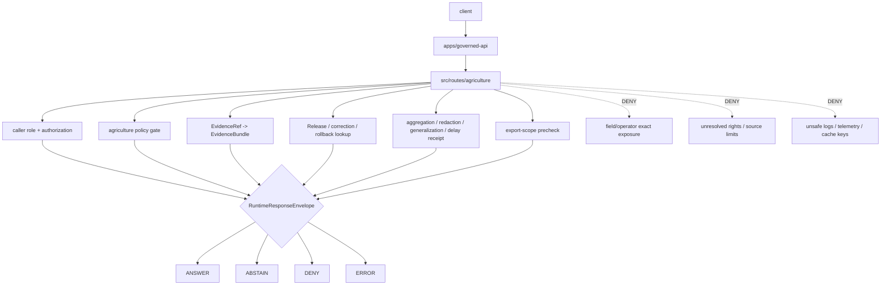

<!-- [KFM_META_BLOCK_V2]
doc_id: kfm://app/governed-api/src/routes/agriculture/readme
title: Governed API Agriculture Source Routes README
type: app-readme
version: v0.2
status: draft
owners: OWNER_TBD — API steward · Agriculture steward · Route steward · Policy steward · Evidence steward · Release steward · Runtime steward · Security steward · Privacy steward · Audit steward · Docs steward
created: 2026-06-16
updated: 2026-07-09
policy_label: public
related:
  - ../README.md
  - ../../README.md
  - ../../../README.md
  - ../../../routes/README.md
  - ../../../routes/domains/README.md
  - ../../../routes/domains/agriculture/README.md
  - ../../governed_api/README.md
  - ../../governed_api/routes/README.md
  - ../../ai/README.md
  - ../../../../README.md
  - ../../../../explorer-web/README.md
  - ../../../../../docs/doctrine/directory-rules.md
  - ../../../../../docs/adr/ADR-0004-apps-governed-api-is-the-trust-membrane.md
  - ../../../../../docs/domains/agriculture/README.md
  - ../../../../../docs/domains/agriculture/POLICY.md
  - ../../../../../docs/domains/agriculture/SENSITIVITY.md
  - ../../../../../docs/domains/agriculture/OBJECTS.md
  - ../../../../../docs/domains/agriculture/PIPELINE.md
  - ../../../../../policy/domains/agriculture/README.md
  - ../../../../../policy/access/README.md
  - ../../../../../policy/decision/README.md
  - ../../../../../policy/telemetry/README.md
  - ../../../../../schemas/contracts/v1/runtime/
  - ../../../../../schemas/contracts/v1/domains/agriculture/
  - ../../../../../schemas/contracts/v1/evidence/
  - ../../../../../contracts/runtime/
  - ../../../../../contracts/domains/agriculture/
  - ../../../../../contracts/evidence/
  - ../../../../../packages/evidence-resolver/README.md
  - ../../../../../packages/policy-runtime/README.md
  - ../../../../../runtime/README.md
  - ../../../../../release/README.md
  - ../../../../../data/README.md
tags: [kfm, apps, governed-api, src, routes, agriculture, field-privacy, operator-privacy, aggregate-release, finite-outcomes, evidencebundle, policydecision, release-manifest, safe-observability, source-rights]
notes:
  - "Refreshes the bounded governed-api src/routes/agriculture route-source contract."
  - "This path may hold app-local Agriculture route implementation modules for the Governed API. It is distinct from app-level route documentation under apps/governed-api/routes/ and from package-local route implementation under apps/governed-api/src/governed_api/routes/ if that package subtree is used."
  - "Agriculture route source files may bind handlers, DTO mapping, authorization handoff, policy/evidence/release lookups, aggregation/redaction/generalization receipts, export-scope prechecks, finite envelope construction, safe errors, and safe observability, but they must not become Agriculture doctrine, Agriculture policy authority, schema authority, contract authority, lifecycle storage, release authority, proof/receipt storage, runtime-adapter authority, telemetry authority, public UI, source-ingest code, or direct source/model access."
  - "Route source files, handlers, DTOs, middleware, schemas, tests, fixtures, authorization, policy runtime integration, evidence resolver integration, release lookup, transform receipt support, safe logging, safe telemetry, deployment state, dashboards, and CI pass state remain NEEDS VERIFICATION."
  - "v0.2 adds a current evidence basis, Directory Rules placement basis, route-source/package-route separation, minimum safe Agriculture route-source slice, runtime anti-bypass matrix, stronger field/operator denial, source-rights, candidate-labeling, export-scope, safe-observability, AI-boundary, and validation/definition-of-done gates without claiming runtime maturity."
[/KFM_META_BLOCK_V2] -->

<a id="top"></a>

<div align="center">

# Governed API Agriculture Source Routes

`apps/governed-api/src/routes/agriculture/`

**App-local implementation source boundary for Agriculture route handlers inside the Governed API: aggregate/public-safe agriculture projections, field/operator exposure denial, private parcel-adjacent protection, source-rights enforcement, candidate labeling, policy-gated redaction/generalization/aggregation, EvidenceBundle-backed claims, release/correction/rollback references, export-scope prechecks, safe errors, safe observability, and finite runtime envelopes.**


[Evidence](#0-evidence-basis-for-this-revision) · [Purpose](#1-purpose) · [Repo fit](#2-repo-fit) · [Boundary](#3-authority-boundary) · [Inputs](#5-inputs) · [Exclusions](#6-exclusions) · [Source map](#7-agriculture-route-source-map) · [Minimum slice](#8-minimum-safe-agriculture-route-source-slice) · [Definition of done](#16-definition-of-done)

</div>

---

> [!IMPORTANT]
> **Status:** draft / `NEEDS VERIFICATION`  
> **Owners:** `OWNER_TBD` — API steward · Agriculture steward · Route steward · Policy steward · Evidence steward · Release steward · Runtime steward · Security steward · Privacy steward · Audit steward · Docs steward  
> **Path:** `apps/governed-api/src/routes/agriculture/README.md`  
> **Responsibility root:** `apps/` — deployable application surfaces  
> **Directory Rules basis:** executable app-local Agriculture route source belongs under the deployable Governed API app source tree. `src/routes/agriculture/` is implementation support under `apps/governed-api/`; it is not Agriculture doctrine, Agriculture policy authority, schema home, contract home, lifecycle-data lane, release authority, proof/receipt store, shared package extraction root, runtime-adapter package, public UI, telemetry policy root, audit store, source-ingest lane, or domain package root.  
> **Truth posture:** CONFIRMED current GitHub README path / CONFIRMED parent source-route README exists / CONFIRMED governed-api trust-membrane README exists / CONFIRMED app-level route-tree README exists / CONFIRMED Agriculture domain README exists / CONFIRMED Agriculture policy README exists / CONFIRMED `src/governed_api/routes/README.md` exists blank on `main` at this revision / CONFIRMED Directory Rules document exists / PROPOSED Agriculture route-source contract / UNKNOWN route source files, route handlers, routers, DTOs, middleware, schemas, tests, fixtures, authorization, Agriculture policy runtime integration, evidence resolver integration, release lookup, transform receipt support, safe logging, safe telemetry, deployment state, dashboards, CI pass state, and runtime behavior

> [!CAUTION]
> Agriculture route code is high-risk when it approaches field polygons, operator identities, private parcel-adjacent joins, source-rights-limited material, NASS-confidential or equivalent inputs, quarantine-adjacent material, inferred field boundaries, yield/rotation inference, or economy/supply-chain details. Public exact exposure must fail closed unless policy, rights, evidence, transform receipts, release state, review state, and rollback support explicitly allow a bounded response.

---

## Quick jump

- [0. Evidence basis for this revision](#0-evidence-basis-for-this-revision)
- [1. Purpose](#1-purpose)
- [2. Repo fit](#2-repo-fit)
- [3. Authority boundary](#3-authority-boundary)
- [4. Default posture](#4-default-posture)
- [5. Inputs](#5-inputs)
- [6. Exclusions](#6-exclusions)
- [7. Agriculture route source map](#7-agriculture-route-source-map)
- [8. Minimum safe Agriculture route source slice](#8-minimum-safe-agriculture-route-source-slice)
- [9. Diagram](#9-diagram)
- [10. Runtime outcome contract](#10-runtime-outcome-contract)
- [11. Agriculture source-route obligations](#11-agriculture-source-route-obligations)
- [12. Runtime anti-bypass matrix](#12-runtime-anti-bypass-matrix)
- [13. Inspection path](#13-inspection-path)
- [14. Validation expectations](#14-validation-expectations)
- [15. Safe change pattern](#15-safe-change-pattern)
- [16. Definition of done](#16-definition-of-done)
- [17. Open verification items](#17-open-verification-items)

---

## 0. Evidence basis for this revision

This README is a documentation boundary, not runtime proof. The 2026-07-09 revision updates an existing README and keeps implementation maturity bounded while aligning Agriculture route source with the Governed API source-route parent, Agriculture domain doctrine, Agriculture policy lane, route-tree, and package-route posture.

| Evidence item | Status | What it supports | What it does not prove |
|---|---|---|---|
| `apps/governed-api/src/routes/agriculture/README.md` exists on `main`. | CONFIRMED | This is an existing README update, not a new path proposal. | It does not prove Agriculture route source files, handlers, routers, middleware, DTOs, fixtures, tests, deployment, logs, dashboards, or runtime behavior exist. |
| `apps/governed-api/src/routes/README.md` exists and describes `src/routes/` as app-local route implementation support, not route doctrine or an authority root. | CONFIRMED document presence and route-source posture | Agriculture route source belongs under this app-local route-source boundary. | It does not prove child route implementation. |
| `apps/governed-api/README.md` exists and describes the app as the normal public trust path for finite governed envelopes. | CONFIRMED document presence and trust-membrane posture | Agriculture routes must preserve finite envelopes and safe projections. | It does not prove runtime enforcement or endpoint behavior. |
| `apps/governed-api/routes/README.md` exists and states route folders are not authority roots. | CONFIRMED document presence and route-tree posture | Source route code must enforce and project, not absorb schemas, contracts, policy, data, release, package, runtime, or UI authority. | It does not prove app-level Agriculture route docs or implementation wiring. |
| `apps/governed-api/src/governed_api/routes/README.md` exists as a blank file on `main` at this revision. | CONFIRMED blank child README state | `src/routes/agriculture/` must remain reconciled with package-local route implementation if used. | It does not prove route implementation modules or that any separate child README draft has merged. |
| `docs/domains/agriculture/README.md` exists and defines Agriculture as evidence-backed crop, field, rotation, yield, suitability, irrigation, conservation, stress, and economy observations, published only as aggregate or permissioned products with field/operator detail denied by default. | CONFIRMED domain doctrine posture | Agriculture route source must preserve aggregate/public-safe and field/operator-denial defaults. | It does not prove route code or runtime policy enforcement. |
| `policy/domains/agriculture/README.md` exists and says field-level, operator-resolved, private parcel-adjacent, NASS-confidential, or quarantine-adjacent Agriculture material must fail closed for public exact exposure unless a reviewed policy path allows transformed/restricted output. | CONFIRMED policy-lane posture | Agriculture routes must gate exact exposure, rights, sensitivity, review, and transform behavior. | It does not prove executable policy bundles or policy-runtime wiring. |
| `docs/doctrine/directory-rules.md` exists and identifies root placement as ownership/lifecycle governance; `apps/` is the deployable implementation root. | CONFIRMED document presence and placement posture | `apps/governed-api/src/routes/agriculture/` is app-local implementation support under a deployable app. | It does not prove route code is complete, tested, deployed, or release-ready. |

[Back to top](#top)

---

## 1. Purpose

`apps/governed-api/src/routes/agriculture/` is the proposed source implementation home for Agriculture route handlers inside the Governed API app.

It may eventually contain modules for:

- agriculture object summary handlers;
- crop, rotation, yield, irrigation, conservation, stress, suitability, and agriculture-economy projections;
- public-safe aggregate layer metadata handlers;
- field/operator exposure denial and restricted-precision handling;
- private parcel-adjacent join denial;
- source-role, rights, license, and source-term-aware response mappers;
- EvidenceRef-to-EvidenceBundle route orchestration;
- aggregation, redaction, generalization, delay, suppression, or restriction receipt checks;
- release, correction, rollback, stale-state, review-state, and transform projection;
- export eligibility and outward-carrier prechecks;
- candidate/inferred-not-confirmed labeling;
- safe denial, abstention, and error handling;
- safe logging, metrics, telemetry, diagnostics, and cache-key discipline for Agriculture route handling.

This directory is not proof that any route handler, router, DTO, schema binding, middleware, policy gate, evidence resolver, aggregation/redaction/generalization receipt check, release lookup, fixture, test, package script, deployment, log, dashboard, CI pass state, or runtime behavior exists.

[Back to top](#top)

---

## 2. Repo fit

| Concern | Owning root | Expected relationship |
|---|---|---|
| Agriculture route source | `apps/governed-api/src/routes/agriculture/` | App-local implementation source for Agriculture routes, if implemented |
| Parent route source | `apps/governed-api/src/routes/` | App-local route-source boundary |
| Governed API source | `apps/governed-api/src/` | App-local implementation source boundary |
| Governed API Python package | `apps/governed-api/src/governed_api/` | App-local import package boundary, if used |
| Python route implementation package | `apps/governed-api/src/governed_api/routes/` | Package-local route-handler subtree; blank README on `main` at this revision |
| Governed API route docs | `apps/governed-api/routes/` | Route-family documentation and organization; distinct from source implementation |
| Agriculture route docs | `apps/governed-api/routes/domains/agriculture/` or accepted equivalent | Public route-family contract if present; path/status `NEEDS VERIFICATION` unless separately fetched |
| Agriculture domain docs | `docs/domains/agriculture/` | Domain doctrine and scope |
| Agriculture policy | `policy/domains/agriculture/` | Agriculture-specific admissibility, sensitivity, rights, release, and redaction policy lane |
| Runtime schemas/contracts | `schemas/contracts/v1/runtime/`, `contracts/runtime/` | Runtime envelope machine shape and object meaning |
| Agriculture schemas/contracts | `schemas/contracts/v1/domains/agriculture/`, `contracts/domains/agriculture/` | Agriculture machine shape and object meaning, if present and accepted |
| Evidence support | `packages/evidence-resolver/`, `data/proofs/` | EvidenceBundle support behind the membrane |
| Policy support | `policy/`, `packages/policy-runtime/` | Policy rules, bundles, and evaluator support |
| Release authority | `release/` | Release decisions, correction notices, rollback cards |
| Lifecycle artifacts | `data/` | Source lifecycle, receipts, proofs, registry, catalog, triplets, and published outputs |
| Source acquisition/transform | `connectors/`, `pipelines/`, `pipeline_specs/` | Ingest and processing lanes, not route-source code |
| Runtime adapters | `runtime/` | Adapter lane behind governed API |
| Shared helpers | `packages/` | Reusable helpers only after extraction and ownership review |
| Client UI | `apps/explorer-web/` | Consumer of governed responses, not route authority |

## 3. Authority boundary

This folder may hold source implementation for Agriculture API route handlers. It does not own Agriculture doctrine, Agriculture policy rules, schemas, contracts, lifecycle data, registry records, release decisions, EvidenceBundle truth, receipt/proof storage, ingest/pipeline code, shared libraries, public UI rendering, runtime adapters, telemetry policy, audit truth, or operational deployment configuration.

```text
apps/governed-api/src/routes/agriculture/ = app-local Agriculture route implementation source
apps/governed-api/src/routes/             = parent route-source boundary
apps/governed-api/src/governed_api/routes/ = package-local route implementation, if used
apps/governed-api/routes/                 = route-family docs and organization
apps/governed-api/                        = trust membrane app contract
docs/domains/agriculture/                 = Agriculture doctrine and scope
policy/domains/agriculture/               = Agriculture admissibility policy lane
schemas/contracts/v1/domains/agriculture/ = Agriculture machine shape, if accepted
contracts/domains/agriculture/            = Agriculture object meaning, if accepted
policy/                                   = policy rules and bundles
data/                                     = lifecycle artifacts, receipts, proofs, registries
release/                                  = publication, correction, rollback authority
packages/                                 = reusable helpers after extraction and review
runtime/                                  = adapters behind governed API
apps/explorer-web/                        = client UI consumer
```

## 4. Default posture

Agriculture route source should fail closed. A route source path should not emit or pass through `ANSWER` when any of these are unresolved:

- request schema, route action, and agriculture object family;
- caller role and authorization context;
- Agriculture policy gate and endpoint policy;
- source role, provenance, rights, license, source terms, and source vintage;
- field/operator exposure risk and private parcel-adjacent joins;
- whether a field, rotation, yield, stress, suitability, irrigation, conservation, or economy payload is confirmed, inferred, modeled, candidate, aggregate, generalized, redacted, or restricted;
- EvidenceRef-to-EvidenceBundle support for claim-bearing responses;
- validation report and citation support;
- aggregation, redaction, generalization, delay, suppression, or restriction receipt where required;
- release manifest, correction, rollback, review, stale, or freshness state where material;
- export eligibility, outward-carrier receipt, and citation support where material;
- response-envelope validation;
- audit-safe request and decision references;
- safe logging, metrics, telemetry, diagnostics, and cache-key posture.

## 5. Inputs

| Input family | Examples | Required posture |
|---|---|---|
| Request context | route action, params, crop/field/layer/evidence ref, feature ref, domain slug, caller role | Schema-validated and bounded |
| Agriculture object context | `CropObservation`, `FieldCandidate`, `CropRotation`, `YieldObservation`, `IrrigationLink`, `ConservationPractice`, `SoilCropSuitability`, stress indicators, economy indicators | Object family checked and candidate/confirmed state preserved |
| Source context | NASS, NRCS, USDA, remote sensing, Mesonet, local upload, manual curation, economy/supply-chain source | Source role, rights, confidence, and limitations explicit |
| Spatial context | field, parcel-adjacent, county, watershed, generalized tile, aggregate layer | Most restrictive precision rule wins |
| Temporal context | valid time, observed time, source time, retrieval time, release time, correction time, freshness | Time-kind separation preserved |
| Evidence context | EvidenceRef, EvidenceBundle refs, source roles, citations, limitations | Resolver behind governed API |
| Policy context | sensitivity tier, rights, review state, aggregation/redaction obligations, audience | Agriculture policy gate required |
| Release context | release manifest, correction notice, rollback card, artifact digest, stale state | Required for public-safe output |
| Transform context | aggregation receipt, redaction receipt, generalization receipt, delayed-release reason, suppression reason | Receipt-backed or reason-coded |
| Export context | requested format, area, layer set, citation set, aggregation level, release refs | Export eligibility precheck required |
| Runtime envelope | `RuntimeResponseEnvelope`, `DecisionEnvelope`, reason codes, audit refs | Exactly one finite outcome |
| Observability context | request id, route id, policy decision ref, envelope status, safe diagnostic ref | No raw evidence, prompts, exact protected geometry, PII, secrets, provider traces, or full bundle copies |
| Error context | schema failure, policy denial, missing evidence, stale support, adapter fault | Safe reason code only |

## 6. Exclusions

| Does not belong here | Correct home |
|---|---|
| Agriculture doctrine and domain scope | `docs/domains/agriculture/` |
| Agriculture policy rules or bundles | `policy/domains/agriculture/` and related policy roots |
| Agriculture schemas and contracts | `schemas/contracts/v1/domains/agriculture/`, `contracts/domains/agriculture/` |
| Agriculture source data, lifecycle artifacts, receipts, proofs, registry, catalog, triplets, published outputs | `data/` |
| Release decisions, correction notices, rollback cards | `release/` |
| Source acquisition, ingest, and transformations | `connectors/`, `pipelines/`, `pipeline_specs/` |
| Shared route helpers reusable across apps | `packages/` after extraction and review |
| Public UI rendering | `apps/explorer-web/` |
| Review decision recording | governed review routes and review governance, not ordinary Agriculture projection routes |
| Telemetry policy | `policy/telemetry/` and accepted telemetry schemas/contracts |
| Audit store or provenance store | accepted audit/provenance roots, not route convenience logic |
| Direct public lifecycle/canonical reads | Forbidden; use finite governed envelopes |
| Direct public runtime/model calls | Forbidden; use governed server-side adapters only |
| Field/operator exact details, private parcel-adjacent joins, source-rights-limited details, NASS-confidential/equivalent material, or quarantine-adjacent material in logs/errors/telemetry/public payloads | Forbidden unless a reviewed, bounded, release-approved transform explicitly allows them |

## 7. Agriculture route source map

Exact source files and implementation status remain `NEEDS VERIFICATION`.

| Candidate source module | Purpose | Required safeguard | Status |
|---|---|---|---|
| `summary` | Public-safe Agriculture object summary | Evidence, policy, release, transform gates | PROPOSED |
| `layers` | Aggregate Agriculture layer metadata | Release, aggregation, and sensitivity gates | PROPOSED |
| `evidence` | Evidence-backed detail projection | EvidenceBundle and citation support | PROPOSED |
| `stress` | Drought/pest/crop stress indicator projection | Source role, time, uncertainty, and candidate labels | PROPOSED |
| `suitability` | Soil-crop suitability projection | Cross-lane refs and source limitations | PROPOSED |
| `field_candidate` | FieldCandidate or remote-sensing candidate projection | Candidate label preserved; no field exposure shortcut | PROPOSED |
| `rotation_yield` | Crop rotation and yield observation projection | No operator identity or exact private inference leakage | PROPOSED |
| `irrigation_conservation` | Irrigation and conservation practice projection | Rights, sensitivity, and source limitation gates | PROPOSED |
| `economy` | Agriculture economy/supply-chain projection | Privacy, source-rights, aggregation, and competition-risk gates | PROPOSED |
| `sensitivity` | Sensitivity posture and transform summary | No field/operator detail leakage | PROPOSED |
| `release` | Release/correction/rollback lookup | Release-lineage refs required | PROPOSED |
| `export_scope` | Export eligibility precheck | No uncited, unaggregated, or rights-blocked export | PROPOSED |
| `safe_errors` | Convert failures to safe envelopes | No protected detail leakage | PROPOSED |
| `observability` | Route-safe logs/metrics/telemetry/cache keys | No raw evidence, exact protected geometry, prompts, PII, secrets | PROPOSED |

> [!WARNING]
> Candidate source-module names are not implementation proof. Do not document a handler as live until files, tests, schemas, fixtures, policy gates, middleware, authorization, and deployment evidence confirm it.

## 8. Minimum safe Agriculture route source slice

A smallest useful Agriculture route slice should prove the domain’s aggregate/public-safe default before exposing any field-adjacent or operator-adjacent workflow.

| Slice item | Minimum requirement | Why it is required |
|---|---|---|
| Route inventory | Every Agriculture route has owner, action, object family, audience, finite outcomes, and handoffs | Prevents route drift and hidden authority |
| Request/response DTO binding | DTOs link to runtime and Agriculture schemas/contracts where accepted | Prevents informal response shapes |
| Authorization gate | Caller role and endpoint access fail closed before sensitive lookup | Prevents unauthorized field/operator exposure |
| Agriculture policy gate | Rights, sensitivity, release, review, source-role, transform, and audience checks run before response | Preserves policy-first route behavior |
| Evidence gate | Claim-bearing `ANSWER` requires EvidenceBundle support and citations | Preserves cite-or-abstain |
| Aggregate/public-safe gate | Public outputs default to accepted aggregation/generalization and avoid exact field/operator disclosure | Enforces agriculture privacy posture |
| Candidate-label gate | `FieldCandidate`, remote-sensing inference, modeled yield, and stress indicators remain labeled | Prevents candidate-as-confirmed drift |
| Transform receipt gate | Aggregation/redaction/generalization/delay/suppression is receipt-backed or reason-coded | Makes transforms auditable |
| Release-lineage gate | Public outputs preserve release, correction, rollback, stale, and freshness refs where material | Makes publication state inspectable |
| Export-scope gate | Export routes validate aggregation, citations, rights, release refs, and transform receipts | Prevents uncited or unaggregated outward carriers |
| Safe-error gate | Deny/error/abstain responses do not leak blocked field/operator/source details | Prevents side-channel disclosure |
| Safe-observability gate | Logs, metrics, telemetry, diagnostics, and cache keys omit protected details | Prevents operational side channels |
| Route/package reconciliation | `src/routes/agriculture/`, `src/governed_api/routes/`, and app-level route docs are reconciled | Prevents parallel route authority |

This slice is still `PROPOSED` until files, fixtures, tests, route wiring, policy runtime integration, evidence resolver integration, release lookup, transform receipts, and accepted contracts are verified.

## 9. Diagram



## 10. Runtime outcome contract

Every trust-bearing Agriculture route response should resolve to exactly one runtime status.

| Status | Meaning | Agriculture source-route posture |
|---|---|---|
| `ANSWER` | Safe, released, evidence-backed, policy-supported response exists | Include evidence, policy, release, transform, limitation, citation, freshness, and audit refs where material |
| `ABSTAIN` | Evidence, review, freshness, source role, candidate status, rights, transform, or narrowing support is insufficient | Explain the held reason without fabricating an answer or exposing field detail |
| `DENY` | Policy, rights, sensitivity, role, review, release, parcel-adjacent, operator, source-rights, or field exposure risk blocks response | Avoid leaking blocked agriculture material or exposure hints |
| `ERROR` | Schema, adapter, resolver, or infrastructure fault prevents reliable response | Return audit-safe fault reference only |

## 11. Agriculture source-route obligations

| Obligation | Example effect |
|---|---|
| `governed_membrane_only` | Agriculture payloads cross `apps/governed-api/` as governed envelopes |
| `finite_outcomes_required` | No silent partial, unlabeled hold, untyped refusal, or generated fallback |
| `authorization_required` | Caller role and endpoint access are resolved before sensitive work |
| `aggregate_public_default` | Public products default to county/HUC/grid or accepted aggregate thresholds |
| `field_operator_denied_by_default` | Field/operator and parcel-adjacent exposure fails closed |
| `source_rights_required` | NASS, NRCS, USDA, remote-sensing, local upload, and economy sources carry rights posture |
| `evidence_required` | Claim-bearing `ANSWER` requires EvidenceBundle support |
| `policy_required` | Sensitivity, rights, review, release, source-role, and transform obligations are checked |
| `candidate_label_preserved` | Candidate, inferred, modeled, or low-confidence objects cannot be worded as confirmed observations |
| `release_refs_required` | Released public artifacts carry release/correction/rollback refs where material |
| `transform_receipt_required` | Aggregation/redaction/generalization/delay/suppression must be receipt-backed or reason-coded where used |
| `export_scope_required` | Public exports require aggregation, citations, rights, release refs, and transform receipts |
| `safe_error_only` | Errors do not expose field/operator details, internal routes, resolver state, stack traces, filesystem paths, or secrets |
| `safe_observability_only` | Logs, metrics, telemetry, diagnostics, and cache keys do not carry raw evidence, prompts, model output, exact protected geometry, PII, provider traces, or secrets |
| `read_only_mutation_split` | Read-only Agriculture routes cannot write review decisions, lifecycle state, evidence refs, releases, receipts, audit stores, or provenance stores |
| `route_docs_distinct_from_source` | `apps/governed-api/routes/` remains docs/organization; `src/routes/agriculture/` remains implementation source |
| `package_routes_distinct_from_source_routes` | `src/governed_api/routes/` is package-local implementation if used; it must not create a parallel route authority |
| `no_parallel_authority` | Route source code does not redefine schema, contract, policy, release, data, proof, receipt, telemetry-policy, domain, or audit authority |

## 12. Runtime anti-bypass matrix

| Bypass risk | Required behavior | Review signal |
|---|---|---|
| Handler returns plain dict/string instead of finite envelope | Deny in review; wrap in validated `RuntimeResponseEnvelope` | Response-shape fixture rejects untyped return |
| Handler reads lifecycle/canonical/internal stores directly for public response | Deny; route through governed services and projections | Import/fetch scan and tests block direct public reads |
| Field/operator exact detail reaches public route | Return `DENY` or aggregate/generalize with reviewed receipt | Field/operator denial fixture blocks exact detail |
| Private parcel-adjacent join leaks location/identity | Return `DENY` or accepted aggregate/generalized output | Parcel-adjacent fixture blocks join disclosure |
| Source rights are unresolved or restrictive | Return `ABSTAIN`, `DENY`, or bounded allowed metadata | Source-rights fixture blocks payload |
| Candidate/inferred crop/yield/stress becomes confirmed language | Preserve candidate/inferred/model-derived labels | Candidate fixture blocks confirmed wording |
| Missing evidence produces generated answer | Return `ABSTAIN` with reason | Missing-evidence fixture blocks answer |
| Transform lacks receipt/reference | Return `ABSTAIN`, `DENY`, or safe bounded alternative | Transform-missing fixture blocks public response |
| Export path emits uncited/unaggregated agriculture artifact | Deny export or require governed export receipt | Export-scope fixture blocks outward carrier |
| Policy denial leaks blocked details | Return `DENY` with safe reason only | Sensitive-denial fixture hides protected payload |
| Source route silently diverges from package route | Require documented ownership and registration boundary | Source/package route inventory reconciles both paths |
| Route import publishes routes or mutates state | Require explicit app registration and no import side effects | Import-side-effect fixture passes |
| Route writes state from read-only endpoint | Deny; split mutating route with authorization/audit | Read-only mutation fixture fails on writes |
| Error exposes stack trace/internal path/secret | Return safe `ERROR` envelope | Safe-error fixture blocks leakage |
| Logs/telemetry/cache key include prompt/raw evidence/restricted geometry | Redact, hash, bucket, or omit | Safe-observability fixture blocks leakage |
| AI-assisted route exposes browser-to-model path or raw model output | Deny; use server-side governed AI orchestration and bounded envelope | Network/import scan blocks model provider access from client route |
| Route module embeds schema/policy/release constants as authority | Move to owning roots or generated bindings | Review finds no parallel authority tables |
| Shared route helper hardens inside app route source | Extract to `packages/` only after ownership review | Reuse review avoids accidental shared-root drift |

## 13. Inspection path

Route source files, handlers, DTOs, middleware, schemas, fixtures, tests, authorization, policy integration, evidence resolution, release lookup, transform receipt support, export-scope behavior, safe-error behavior, safe logging/telemetry/cache behavior, deployment state, dashboards, and emitted artifacts remain `NEEDS VERIFICATION`.

```bash
find apps/governed-api/src/routes/agriculture -maxdepth 6 -type f | sort
find apps/governed-api/src/governed_api/routes -maxdepth 6 -type f 2>/dev/null | sort
find apps/governed-api/src apps/governed-api/routes docs/domains/agriculture policy/domains/agriculture schemas contracts data release tests fixtures packages runtime .github/workflows -maxdepth 6 -type f 2>/dev/null | grep -Ei 'agriculture|CropObservation|FieldCandidate|CropRotation|YieldObservation|IrrigationLink|ConservationPractice|SoilCropSuitability|DroughtStressIndicator|PestStressIndicator|AggregationReceipt|RedactionReceipt|GeneralizationReceipt|RuntimeResponseEnvelope|DecisionEnvelope|EvidenceBundle|EvidenceRef|PolicyDecision|ReleaseManifest|CorrectionNotice|RollbackCard|ExportReceipt|AIReceipt|CitationValidationReport|ReviewRecord|SensitivityTransform|abstain|deny|error|route|middleware|dto|mapper|audit|safe.?log|telemetry|cache|test|fixture' | sort
find data/raw data/work data/quarantine data/processed data/catalog data/triplets data/published data/receipts data/proofs -maxdepth 2 -type f 2>/dev/null | sort
```

## 14. Validation expectations

Useful validation for this route-source boundary should cover:

- every Agriculture route returns exactly one `ANSWER`, `ABSTAIN`, `DENY`, or `ERROR` status;
- request and response DTOs validate against accepted runtime and Agriculture schemas/contracts;
- authorization and caller role resolution fail closed;
- unresolved object family, rights, release, transform, sensitivity, source-role, review, or stale/freshness posture fails closed;
- public field polygons, operator identities, private parcel-adjacent joins, source-rights-limited material, NASS-confidential/equivalent material, and quarantine-adjacent material are denied unless a reviewed transform and release path explicitly allows a bounded response;
- `FieldCandidate`, remote-sensing indicators, modeled yield, stress indicators, and other inferred objects remain labeled and cannot become confirmed observations through route language;
- missing, stale, weak, conflicting, or unresolved evidence returns `ABSTAIN` rather than generated filler;
- policy denial returns `DENY` without blocked detail or exposure hints;
- schema, adapter, resolver, or infrastructure faults return `ERROR` with safe details only;
- response envelopes preserve evidence refs, policy decision refs, release refs, correction refs, rollback refs, citations, limitations, redactions, aggregation/redaction/generalization receipts, stale state, reason codes, and audit refs where material;
- read-only routes cannot mutate review decisions, lifecycle state, EvidenceRefs, releases, receipts, audit stores, or provenance stores;
- route source and `src/governed_api/routes/` package-local route modules are reconciled so no parallel implementation authority emerges;
- route imports do not register routes, write state, fetch sources, call models, or mutate lifecycle artifacts unless explicitly invoked by app wiring;
- logs, metrics, telemetry, diagnostics, and cache keys do not include prompts, raw evidence, raw outputs, exact protected geometry, PII, secrets, provider traces, internal handles, or full bundle copies;
- AI-assisted Agriculture routes do not expose raw model output, private chain-of-thought, provider traces, or browser-to-model shortcuts.

## 15. Safe change pattern

For Agriculture route-source changes:

1. Add or update source inventory and route-source contract.
2. Reconcile `apps/governed-api/src/routes/agriculture/`, `apps/governed-api/src/governed_api/routes/`, and `apps/governed-api/routes/` so implementation, package, and documentation responsibilities remain distinct.
3. Link DTOs to runtime, Agriculture, evidence, policy, release, transform, export, and AI/citation schemas before changing response shape.
4. Add fixtures for `ANSWER`, `ABSTAIN`, `DENY`, `ERROR`, policy denial, missing evidence, stale evidence, unresolved rights, unreleased candidate, field/operator exposure, private parcel-adjacent join denial, source-rights denial, transform missing, release missing, export-scope denial, safe error, unsafe logging, unsafe telemetry, unsafe cache key, candidate-not-confirmed, unauthorized caller, read-only mutation denied, import side-effect denied, and browser-model denied cases.
5. Add authorization, Agriculture policy, safe-error, safe-observability, evidence, release, transform, export-scope, read-only/mutation-boundary, no-browser-model, and AI-boundary tests before exposing any public route.
6. Preserve evidence refs, policy decision refs, release refs, correction refs, rollback refs, citations, limitations, redactions, aggregation/redaction/generalization receipts, stale state, export receipt refs, AIReceipt refs where applicable, and audit refs through every response.
7. Update this README, `apps/governed-api/src/routes/README.md`, `apps/governed-api/src/README.md`, `apps/governed-api/src/governed_api/README.md`, `apps/governed-api/README.md`, route READMEs, Agriculture docs, Agriculture policy docs, schemas/contracts, fixtures, and tests when source behavior materially changes.

## 16. Definition of done

- [ ] Owners are confirmed and `OWNER_TBD` is replaced.
- [ ] Evidence basis is refreshed when parent source/app docs, package docs, route docs, Agriculture docs, Agriculture policy docs, schemas, contracts, evidence resolver, release, runtime, fixtures, tests, workflow, telemetry, or deployment evidence changes.
- [ ] Agriculture route-source inventory and ownership are documented.
- [ ] Relationship to `apps/governed-api/src/governed_api/routes/` and `apps/governed-api/routes/` is documented.
- [ ] Route registration and import-side-effect behavior are verified.
- [ ] Runtime envelope and Agriculture DTO/schema bindings are verified.
- [ ] Authorization, Agriculture policy runtime, evidence resolver, release lookup, transform receipt, export-scope, and audit hooks are documented and tested.
- [ ] Finite outcome fixtures cover `ANSWER`, `ABSTAIN`, `DENY`, and `ERROR`.
- [ ] Field/operator and private parcel-adjacent denial tests are present and passing.
- [ ] FieldCandidate/inferred/model-derived-not-confirmed tests are present and passing.
- [ ] Missing-evidence and stale-evidence abstention tests are present and passing.
- [ ] Policy denial and source-rights denial tests are present and passing.
- [ ] Transform-missing and release-missing tests are present and passing.
- [ ] Export-scope denial tests are present and passing.
- [ ] Safe-error tests are present and passing.
- [ ] Safe logging, metrics, telemetry, cache-key, diagnostics, and observability tests are present and passing.
- [ ] Read-only vs mutating route boundaries are documented and tested.
- [ ] AI-assisted route no-raw-model-output and no-chain-of-thought tests are present and passing where applicable.

## 17. Open verification items

| Item | Why it matters |
|---|---|
| Confirm route source files beyond README | Prevents overclaiming runtime maturity |
| Confirm path relationship to `routes/domains/agriculture/` or accepted route docs | Required to avoid parallel Agriculture route homes |
| Confirm relationship to `apps/governed-api/src/governed_api/routes/` package route subtree | Required to avoid duplicate implementation authority |
| Confirm route DTOs and schemas | Required before route behavior claims |
| Confirm authorization and role resolution | Required before public/restricted split claims |
| Confirm Agriculture policy runtime integration | Required before sensitivity/rights/release claims |
| Confirm evidence resolver integration | Required before EvidenceBundle closure claims |
| Confirm release/correction/rollback lookup | Required before publication-state claims |
| Confirm aggregation/redaction/generalization receipt handling | Required before public aggregate output claims |
| Confirm export-scope and ExportReceipt behavior | Required before outward carrier claims |
| Confirm candidate/inferred-not-confirmed behavior | Required before candidate or model-derived route claims |
| Confirm cross-domain proof-boundary behavior | Required before soil/hydrology/atmosphere/economy join claims |
| Confirm safe-error behavior | Required before public exposure |
| Confirm safe logging, metrics, telemetry, cache-key, and diagnostics behavior | Required to prevent side-channel leakage |
| Confirm read-only vs mutating route separation | Required before review/export/admin route claims |
| Confirm import-side-effect behavior | Required before app factory/route registration claims |
| Confirm no-browser-model and no-chain-of-thought behavior | Required before AI-assisted route exposure |
| Confirm test and fixture coverage | Required before runtime maturity claims |
| Confirm deployment, logs, dashboards, and audit receipts | Required before operational claims |
| Confirm CI workflow presence and latest pass state | Required before CI claims |

<details>
<summary>Appendix A — no-loss preservation note</summary>

The previous README already contained a bounded Agriculture governed-api route-source contract. This revision preserves that contract, refreshes metadata, adds a current evidence-basis section, adds Directory Rules placement posture, distinguishes `src/routes/agriculture/` from app-level route docs and package-local route modules, strengthens minimum Agriculture route-source slice, field/operator denial, source-rights, candidate-labeling, export-scope, finite-envelope, authorization, policy/evidence/release/transform, safe-error, safe observability, import/registration, AI-boundary, and anti-bypass safeguards, and keeps implementation claims bounded. It does not claim route source files, handlers, DTOs, schemas, middleware, authorization, policy enforcement, evidence resolution, release lookup, transform receipt support, export behavior, tests, fixtures, deployment, logs, dashboards, telemetry, or CI pass state are implemented.

</details>

## Status summary

`apps/governed-api/src/routes/agriculture/` should contain Agriculture route implementation source only after source inventory, DTOs, schemas, authorization, Agriculture policy runtime integration, evidence resolver integration, release/correction/rollback lookups, aggregation/redaction/generalization receipt support, export-scope checks, safe-error behavior, safe logging/telemetry/cache behavior, finite-outcome fixtures, tests, and operational evidence are verified.

It must preserve the trust membrane and Agriculture privacy posture: public clients may receive governed finite envelopes, but they must not receive field/operator exact exposure, private parcel-adjacent joins, unsupported source-rights-limited material, candidate-as-confirmed language, internal lifecycle references, unsafe telemetry/log/cache side channels, raw model-output surfaces, or unsupported generated answers.

<p align="right"><a href="#top">Back to top</a></p>
