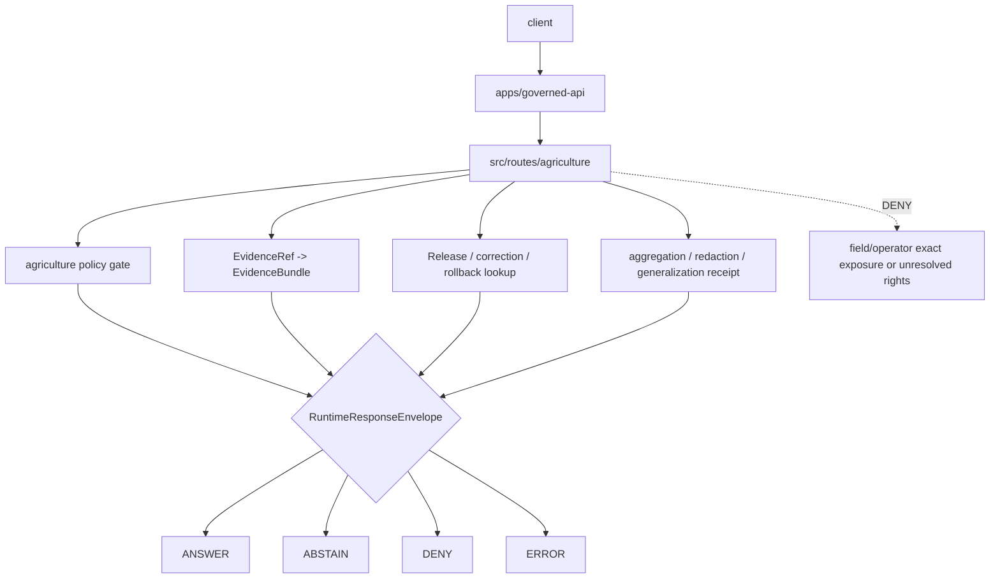

<!-- [KFM_META_BLOCK_V2]
doc_id: kfm://app/governed-api/src/routes/agriculture/readme
title: Governed API Agriculture Source Routes README
type: app-readme
version: v0.1
status: draft
owners: OWNER_TBD — API steward · Agriculture steward · Policy steward · Evidence steward · Release steward · Runtime steward · Docs steward
created: 2026-06-16
updated: 2026-06-16
policy_label: public
related:
  - ../../README.md
  - ../../../README.md
  - ../../../routes/README.md
  - ../../governed_api/README.md
  - ../../ai/README.md
  - ../../../../README.md
  - ../../../../explorer-web/README.md
  - ../../../../../docs/domains/agriculture/README.md
  - ../../../../../policy/domains/agriculture/README.md
  - ../../../../../schemas/contracts/v1/runtime/
  - ../../../../../schemas/contracts/v1/domains/agriculture/
  - ../../../../../contracts/domains/agriculture/
  - ../../../../../policy/access/README.md
  - ../../../../../policy/decision/README.md
  - ../../../../../packages/evidence-resolver/README.md
  - ../../../../../packages/policy-runtime/README.md
  - ../../../../../runtime/README.md
  - ../../../../../release/README.md
  - ../../../../../data/README.md
tags: [kfm, apps, governed-api, src, routes, agriculture, field-privacy, aggregate-release, finite-outcomes, evidencebundle, policydecision, release-manifest]
notes:
  - "Replaces an empty governed-api src/routes/agriculture README with a bounded implementation-source route contract."
  - "This path may hold app-local Agriculture route implementation modules, but it must not become Agriculture doctrine, Agriculture policy authority, schema authority, contract authority, lifecycle storage, release authority, proof storage, source-ingest code, or public UI."
  - "Route source files, handlers, DTOs, middleware, schemas, tests, fixtures, policy enforcement, deployment state, logs, dashboards, and CI pass state remain NEEDS VERIFICATION."
[/KFM_META_BLOCK_V2] -->

<a id="top"></a>

<div align="center">

# Governed API Agriculture Source Routes

`apps/governed-api/src/routes/agriculture/`

**App-local implementation source boundary for Agriculture route handlers inside the Governed API: aggregate/public-safe agriculture projections, field/operator exposure denial, policy-gated redaction and aggregation, EvidenceBundle-backed claims, release/correction/rollback references, safe errors, and finite runtime envelopes.**


[Purpose](#1-purpose) · [Repo fit](#2-repo-fit) · [Boundary](#3-authority-boundary) · [Inputs](#5-inputs) · [Exclusions](#6-exclusions) · [Source map](#7-agriculture-route-source-map) · [Definition of done](#14-definition-of-done)

</div>

---

> [!IMPORTANT]
> **Status:** draft / `NEEDS VERIFICATION`  
> **Owners:** `OWNER_TBD` — API steward · Agriculture steward · Policy steward · Evidence steward · Release steward · Runtime steward · Docs steward  
> **Path:** `apps/governed-api/src/routes/agriculture/README.md`  
> **Responsibility root:** `apps/` — deployable application surfaces  
> **Truth posture:** CONFIRMED README path / CONFIRMED governed-api source-tree boundary / CONFIRMED Agriculture domain sensitivity doctrine / CONFIRMED Agriculture policy-lane posture / PROPOSED implementation-source route contract / UNKNOWN route handlers, DTOs, middleware, schemas, tests, fixtures, runtime behavior, deployment state, and CI pass state

> [!CAUTION]
> Agriculture route code is high-risk when it approaches field polygons, operator identities, parcel-adjacent joins, source-rights-limited data, quarantine-adjacent material, or field-level inferences. Public exact exposure must fail closed unless policy, rights, evidence, aggregation/redaction receipt, release state, and rollback support explicitly allow a bounded response.

---

## Quick jump

- [1. Purpose](#1-purpose)
- [2. Repo fit](#2-repo-fit)
- [3. Authority boundary](#3-authority-boundary)
- [4. Default posture](#4-default-posture)
- [5. Inputs](#5-inputs)
- [6. Exclusions](#6-exclusions)
- [7. Agriculture route source map](#7-agriculture-route-source-map)
- [8. Diagram](#8-diagram)
- [9. Runtime outcome contract](#9-runtime-outcome-contract)
- [10. Agriculture source-route obligations](#10-agriculture-source-route-obligations)
- [11. Inspection path](#11-inspection-path)
- [12. Validation expectations](#12-validation-expectations)
- [13. Safe change pattern](#13-safe-change-pattern)
- [14. Definition of done](#14-definition-of-done)
- [15. Open verification items](#15-open-verification-items)

---

## 1. Purpose

`apps/governed-api/src/routes/agriculture/` is the proposed source implementation home for Agriculture route handlers inside the Governed API app.

It may eventually contain modules for:

- agriculture object summary handlers;
- crop, rotation, yield, irrigation, conservation, stress, suitability, and agriculture-economy projections;
- public-safe aggregate layer metadata handlers;
- field/operator exposure denial and restricted-precision handling;
- source-role and rights-aware response mappers;
- EvidenceRef-to-EvidenceBundle route orchestration;
- aggregation/redaction/generalization receipt checks;
- release, correction, rollback, stale-state, and review-state projection;
- export eligibility prechecks;
- safe denial, abstention, and error handling.

This directory is not proof that any route handler, DTO, schema binding, middleware, policy gate, evidence resolver, aggregation/redaction receipt check, release lookup, fixture, test, package script, deployment, log, dashboard, or CI pass state exists.

[Back to top](#top)

---

## 2. Repo fit

| Concern | Owning root | Expected relationship |
|---|---|---|
| Agriculture route source | `apps/governed-api/src/routes/agriculture/` | App-local implementation source for Agriculture routes, if implemented |
| Governed API source | `apps/governed-api/src/` | App-local implementation source boundary |
| Governed API package | `apps/governed-api/src/governed_api/` | Import package, if route handlers are package-local |
| Governed API route docs | `apps/governed-api/routes/` | Route-family documentation and organization |
| Agriculture route docs | `apps/governed-api/routes/domains/agriculture/` or equivalent | Public route-family contract if present; current path needs verification |
| Agriculture domain docs | `docs/domains/agriculture/` | Domain doctrine and scope |
| Agriculture policy | `policy/domains/agriculture/` | Agriculture-specific admissibility, sensitivity, rights, release, and redaction policy |
| Agriculture schemas | `schemas/contracts/v1/domains/agriculture/` | Machine shape, if present and accepted |
| Agriculture contracts | `contracts/domains/agriculture/` | Object meaning, if present and accepted |
| Evidence support | `packages/evidence-resolver/`, `data/proofs/` | EvidenceBundle support behind the membrane |
| Release authority | `release/` | Release decisions, correction notices, rollback cards |
| Lifecycle artifacts | `data/` | Source lifecycle, receipts, proofs, registry, catalog, triplets, and published outputs |

## 3. Authority boundary

This folder may hold source implementation for Agriculture API route handlers. It does not own Agriculture doctrine, Agriculture policy rules, schemas, contracts, lifecycle data, registry records, release decisions, EvidenceBundle truth, receipt/proof storage, ingest/pipeline code, shared libraries, public UI rendering, runtime adapters, or operational deployment configuration.

```text
apps/governed-api/src/routes/agriculture/ = app-local Agriculture route implementation source
apps/governed-api/src/                    = source tree boundary
apps/governed-api/                        = trust membrane app contract
apps/governed-api/routes/                 = route-family docs and organization
docs/domains/agriculture/                 = Agriculture doctrine and scope
policy/domains/agriculture/               = Agriculture admissibility policy
schemas/contracts/v1/domains/agriculture/ = Agriculture machine shape, if accepted
contracts/domains/agriculture/            = Agriculture object meaning, if accepted
data/                                     = lifecycle artifacts, receipts, proofs, registries
release/                                  = publication, correction, rollback authority
packages/                                 = reusable helpers after extraction and review
runtime/                                  = adapters behind governed API
```

## 4. Default posture

Agriculture route source should fail closed. A route source path should not emit or pass through `ANSWER` when any of these are unresolved:

- request schema, route action, and agriculture object family;
- caller role and authorization context;
- agriculture policy gate and endpoint policy;
- source role, provenance, rights, license, and source terms;
- field/operator exposure risk and private parcel-adjacent joins;
- EvidenceRef-to-EvidenceBundle support for claim-bearing responses;
- validation report and citation support;
- aggregation, redaction, generalization, delay, or restriction receipt where required;
- release manifest, correction, rollback, review, stale, or freshness state where material;
- response-envelope validation;
- audit-safe request and decision references.

## 5. Inputs

| Input family | Examples | Required posture |
|---|---|---|
| Request context | route action, params, crop/field/layer/evidence ref, feature ref, caller role | Schema-validated and bounded |
| Agriculture object context | `CropObservation`, `FieldCandidate`, `CropRotation`, `YieldObservation`, `IrrigationLink`, `ConservationPractice`, `SoilCropSuitability`, stress indicators | Object family checked |
| Source context | NASS, NRCS, USDA, remote sensing, Mesonet, local upload, manual curation | Source role and rights explicit |
| Spatial context | field, parcel-adjacent, county, watershed, generalized tile, aggregate layer | Most restrictive precision rule wins |
| Evidence context | EvidenceRef, EvidenceBundle refs, source roles, citations, limitations | Resolver behind governed API |
| Policy context | sensitivity tier, rights, review state, aggregation/redaction obligations, audience | Agriculture policy gate required |
| Release context | release manifest, correction notice, rollback card, artifact digest, stale state | Required for public-safe output |
| Runtime envelope | `RuntimeResponseEnvelope`, `DecisionEnvelope`, reason codes, audit refs | Exactly one finite outcome |
| Error context | schema failure, policy denial, missing evidence, stale support, adapter fault | Safe reason code only |

## 6. Exclusions

| Does not belong here | Correct home |
|---|---|
| Agriculture doctrine and domain scope | `docs/domains/agriculture/` |
| Agriculture policy rules or bundles | `policy/domains/agriculture/` and related policy roots |
| Agriculture schemas and contracts | `schemas/contracts/v1/domains/agriculture/`, `contracts/domains/agriculture/` |
| Agriculture source data, lifecycle artifacts, receipts, proofs, registry, catalog, triplets, published outputs | `data/` |
| Release decisions, correction notices, rollback cards | `release/` |
| Source acquisition, ingest, and transformations | `connectors/`, `pipelines/`, `pipeline_specs/` |
| Shared route helpers reusable across apps | `packages/` after extraction and review |
| Public UI rendering | `apps/explorer-web/` |
| Review decision recording | governed review routes and review governance, not ordinary Agriculture projection routes |
| Direct public lifecycle/canonical reads | Forbidden; use finite governed envelopes |
| Direct public runtime/model calls | Forbidden; use governed server-side adapters only |
| Field/operator exact details, private parcel-adjacent joins, source-rights-limited details, or quarantine-adjacent material in logs/errors/telemetry/public payloads | Forbidden unless a reviewed, bounded, release-approved transform explicitly allows them |

## 7. Agriculture route source map

Exact source files and implementation status remain `NEEDS VERIFICATION`.

| Candidate source module | Purpose | Required safeguard | Status |
|---|---|---|---|
| `summary` | Public-safe Agriculture object summary | Evidence, policy, release, transform gates | PROPOSED |
| `layers` | Aggregate Agriculture layer metadata | Release, aggregation, and sensitivity gates | PROPOSED |
| `evidence` | Evidence-backed detail projection | EvidenceBundle and citation support | PROPOSED |
| `stress` | Drought/pest/crop stress indicator projection | Source role, time, and uncertainty labels | PROPOSED |
| `suitability` | Soil-crop suitability projection | Cross-lane refs and source limitations | PROPOSED |
| `field_candidate` | FieldCandidate or remote-sensing candidate projection | Candidate label preserved; no field exposure shortcut | PROPOSED |
| `economy` | Agriculture economy/supply-chain projection | Privacy and source-rights gates | PROPOSED |
| `sensitivity` | Sensitivity posture and transform summary | No field/operator detail leakage | PROPOSED |
| `release` | Release/correction/rollback lookup | Release-lineage refs required | PROPOSED |
| `export_scope` | Export eligibility precheck | No uncited or unaggregated export | PROPOSED |
| `safe_errors` | Convert failures to safe envelopes | No protected detail leakage | PROPOSED |

> [!WARNING]
> Candidate source-module names are not implementation proof. Do not document a handler as live until files, tests, schemas, fixtures, policy gates, middleware, authorization, and deployment evidence confirm it.

## 8. Diagram



## 9. Runtime outcome contract

Every trust-bearing Agriculture route response should resolve to exactly one runtime status.

| Status | Meaning | Agriculture source-route posture |
|---|---|---|
| `ANSWER` | Safe, released, evidence-backed, policy-supported response exists | Include evidence, policy, release, transform, limitation, and citation refs where material |
| `ABSTAIN` | Evidence, review, freshness, source role, candidate status, or narrowing support is insufficient | Explain the held reason without fabricating an answer or exposing field detail |
| `DENY` | Policy, rights, sensitivity, role, review, release, parcel-adjacent, operator, or field exposure risk blocks response | Avoid leaking blocked agriculture material |
| `ERROR` | Schema, adapter, resolver, or infrastructure fault prevents reliable response | Return audit-safe fault reference only |

## 10. Agriculture source-route obligations

| Obligation | Example effect |
|---|---|
| `governed_membrane_only` | Agriculture payloads cross `apps/governed-api/` |
| `finite_outcomes_required` | No silent partial, unlabeled hold, or untyped refusal |
| `aggregate_public_default` | Public products default to county/HUC/grid or accepted aggregate thresholds |
| `field_operator_denied_by_default` | Field/operator and parcel-adjacent exposure fails closed |
| `source_rights_required` | NASS, NRCS, USDA, remote-sensing, local upload, and economy sources carry rights posture |
| `evidence_required` | Claim-bearing `ANSWER` requires EvidenceBundle support |
| `policy_required` | Sensitivity, rights, review, release, and transform obligations are checked |
| `release_refs_required` | Released public artifacts carry release/correction/rollback refs where material |
| `transform_receipt_required` | Aggregation/redaction/generalization/delay must be receipt-backed where used |
| `safe_error_only` | Errors do not expose field/operator details or internal route/resolver state |

## 11. Inspection path

Route source files, handlers, DTOs, middleware, schemas, fixtures, tests, policy integration, authorization, safe-error behavior, logs, dashboards, deployment state, and emitted artifacts remain `NEEDS VERIFICATION`.

```bash
find apps/governed-api/src/routes/agriculture -maxdepth 6 -type f | sort
find apps/governed-api/src apps/governed-api/routes docs/domains/agriculture policy/domains/agriculture schemas contracts data release tests fixtures packages -maxdepth 6 -type f 2>/dev/null | grep -Ei 'agriculture|CropObservation|FieldCandidate|CropRotation|YieldObservation|IrrigationLink|ConservationPractice|SoilCropSuitability|DroughtStressIndicator|PestStressIndicator|AggregationReceipt|RedactionReceipt|RuntimeResponseEnvelope|DecisionEnvelope|EvidenceBundle|EvidenceRef|PolicyDecision|ReleaseManifest|CorrectionNotice|RollbackCard|abstain|deny|error|route|test|fixture' | sort
```

## 12. Validation expectations

Useful validation for this route-source boundary should cover:

- every Agriculture route returns exactly one `ANSWER`, `ABSTAIN`, `DENY`, or `ERROR` status;
- unresolved object family, rights, release, transform, sensitivity, source-role, or review posture fails closed;
- public field polygons, operator identities, private parcel-adjacent joins, and source-rights-limited material are denied unless a reviewed transform and release path explicitly allows a bounded response;
- `FieldCandidate` and remote-sensing indicators remain labeled and cannot become confirmed observations through route language;
- missing, stale, weak, conflicting, or unresolved evidence returns `ABSTAIN` rather than generated filler;
- policy denial returns `DENY` without blocked detail;
- schema, adapter, resolver, or infrastructure faults return `ERROR` with safe details only;
- response envelopes preserve evidence refs, policy decision refs, release refs, correction refs, rollback refs, citations, limitations, redactions, aggregation/redaction receipts, stale state, and reason codes where material.

## 13. Safe change pattern

For Agriculture route-source changes:

1. Add or update source inventory and route-source contract.
2. Link DTOs to runtime and Agriculture schemas before changing response shape.
3. Add fixtures for `ANSWER`, `ABSTAIN`, `DENY`, `ERROR`, policy denial, missing evidence, stale evidence, unresolved rights, unreleased candidate, field/operator exposure, source-rights denial, transform missing, release missing, and safe error cases.
4. Add Agriculture policy and safe-error tests before exposing any public route.
5. Preserve evidence refs, policy decision refs, release refs, correction refs, rollback refs, citations, limitations, redactions, aggregation/redaction receipts, stale state, and audit refs through every response.
6. Update this README, `apps/governed-api/src/README.md`, `apps/governed-api/README.md`, route READMEs, Agriculture docs, Agriculture policy docs, schemas/contracts, and tests when source behavior materially changes.

## 14. Definition of done

- [ ] Owners are confirmed and `OWNER_TBD` is replaced.
- [ ] Agriculture route-source inventory and ownership are documented.
- [ ] Runtime envelope and Agriculture DTO/schema bindings are verified.
- [ ] Authorization, Agriculture policy runtime, evidence resolver, release lookup, transform receipt, and audit hooks are documented and tested.
- [ ] Finite outcome fixtures cover `ANSWER`, `ABSTAIN`, `DENY`, and `ERROR`.
- [ ] Field/operator and private parcel-adjacent denial tests are present and passing.
- [ ] FieldCandidate-not-confirmed tests are present and passing.
- [ ] Missing-evidence and stale-evidence abstention tests are present and passing.
- [ ] Policy denial and source-rights denial tests are present and passing.
- [ ] Safe-error tests are present and passing.

## 15. Open verification items

| Item | Why it matters |
|---|---|
| Confirm route source files beyond README | Prevents overclaiming runtime maturity |
| Confirm path relationship to `routes/domains/agriculture/` or accepted route docs | Required to avoid parallel Agriculture route homes |
| Confirm route DTOs and schemas | Required before route behavior claims |
| Confirm authorization and role resolution | Required before public/restricted split claims |
| Confirm Agriculture policy runtime integration | Required before sensitivity/rights/release claims |
| Confirm evidence resolver integration | Required before EvidenceBundle closure claims |
| Confirm release/correction/rollback lookup | Required before publication-state claims |
| Confirm aggregation/redaction receipt handling | Required before public aggregate output claims |
| Confirm safe-error behavior | Required before public exposure |
| Confirm test and fixture coverage | Required before runtime maturity claims |
| Confirm deployment, logs, dashboards, and audit receipts | Required before operational claims |

<details>
<summary>Appendix A — no-loss preservation note</summary>

The previous README was empty. This replacement adds a bounded Agriculture governed-api route-source contract without claiming route source files, handlers, DTOs, schemas, middleware, authorization, policy enforcement, evidence resolution, release lookup, transform receipt support, tests, fixtures, deployment, logs, dashboards, or CI pass state are implemented.

</details>

## Status summary

`apps/governed-api/src/routes/agriculture/` should contain Agriculture route implementation source only after source inventory, DTOs, schemas, authorization, Agriculture policy runtime integration, evidence resolver integration, release/correction/rollback lookups, aggregation/redaction receipt support, safe-error behavior, finite-outcome fixtures, tests, and operational evidence are verified.

It must preserve the trust membrane and Agriculture privacy posture: public clients may receive governed finite envelopes, but they must not receive field/operator exact exposure, private parcel-adjacent joins, unsupported source-rights-limited material, candidate-as-confirmed language, internal lifecycle references, or unsupported generated answers.

<p align="right"><a href="#top">Back to top</a></p>
