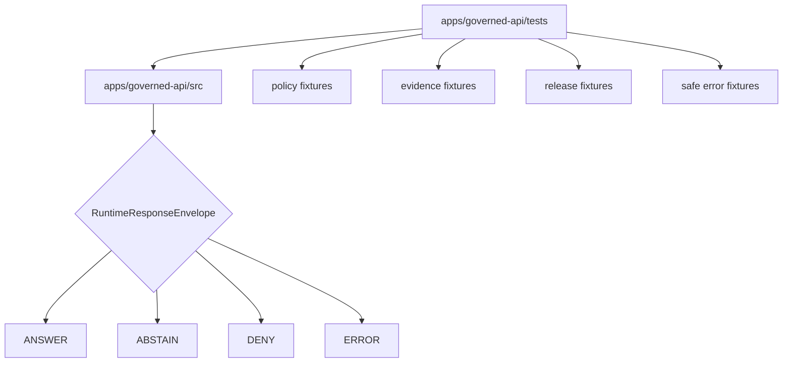

<!-- [KFM_META_BLOCK_V2]
doc_id: kfm://app/governed-api/tests/readme
title: Governed API Tests README
type: app-readme
version: v0.1
status: draft
owners: OWNER_TBD — API steward · Test steward · Policy steward · Evidence steward · Release steward · Runtime steward · Docs steward
created: 2026-06-16
updated: 2026-06-16
policy_label: public
related:
  - ../README.md
  - ../src/README.md
  - ../routes/README.md
  - ../../README.md
  - ../../explorer-web/README.md
  - ../../../docs/adr/ADR-0004-apps-governed-api-is-the-trust-membrane.md
  - ../../../schemas/contracts/v1/runtime/
  - ../../../contracts/runtime/
  - ../../../policy/access/README.md
  - ../../../policy/decision/README.md
  - ../../../packages/evidence-resolver/README.md
  - ../../../packages/policy-runtime/README.md
  - ../../../runtime/README.md
  - ../../../release/README.md
  - ../../../data/README.md
  - ../../../.github/workflows/api-test.yml
tags: [kfm, apps, governed-api, tests, trust-membrane, finite-outcomes, runtime-response-envelope, abstain, deny, error, pytest]
notes:
  - "Replaces the greenfield governed-api tests stub with a bounded test-lane contract."
  - "This directory may contain app-local tests for the Governed API trust membrane; it is not a schema, contract, policy, lifecycle, release, proof, runtime-adapter, source-data, or public-UI authority root."
  - "The api-test workflow file exists and names governed-api smoke and envelope-shape commands. Test pass state, local commands, fixtures, route coverage, middleware coverage, and runtime behavior remain NEEDS VERIFICATION."
[/KFM_META_BLOCK_V2] -->

<a id="top"></a>

<div align="center">

# Governed API Tests

`apps/governed-api/tests/`

**App-local test boundary for the Governed API trust membrane: finite runtime envelopes, abstain/deny/error cases, no direct internal reads, policy gates, evidence resolution, release/correction/rollback references, safe errors, and route/source behavior.**


[Purpose](#1-purpose) · [Repo fit](#2-repo-fit) · [Boundary](#3-authority-boundary) · [Inputs](#5-inputs) · [Exclusions](#6-exclusions) · [Test map](#7-test-family-map) · [Definition of done](#14-definition-of-done)

</div>

---

> [!IMPORTANT]
> **Status:** draft / `NEEDS VERIFICATION`  
> **Owners:** `OWNER_TBD` — API steward · Test steward · Policy steward · Evidence steward · Release steward · Runtime steward · Docs steward  
> **Path:** `apps/governed-api/tests/README.md`  
> **Responsibility root:** `apps/` — deployable application surfaces  
> **Truth posture:** CONFIRMED README path / CONFIRMED governed-api trust-membrane doctrine / CONFIRMED api-test workflow file presence / PROPOSED test-lane contract / UNKNOWN test inventory, fixtures, route coverage, middleware coverage, runtime behavior, local pass state, and CI pass state

> [!CAUTION]
> Tests prove behavior only when they are present, relevant, and passing. This README may describe required coverage, but it must not be treated as proof that routes, middleware, schemas, policy runtime, evidence resolver, release lookup, safe errors, or deployment behavior are working.

---

## 1. Purpose

`apps/governed-api/tests/` is the proposed app-local test lane for the Governed API app.

It may eventually contain tests and fixtures for:

- route registration and bootstrap behavior;
- finite `RuntimeResponseEnvelope` shape and status grammar;
- `ANSWER`, `ABSTAIN`, `DENY`, and `ERROR` cases;
- policy precheck and postcheck behavior;
- evidence resolution and citation-support behavior;
- release, correction, rollback, stale-state, and review-state projection;
- safe error redaction and audit-safe references;
- route-source modules under `apps/governed-api/src/routes/`;
- AI-assisted server-side adapter boundaries;
- domain-specific denial and transformation requirements.

This directory is not proof that any test file, fixture, route, middleware, package script, workflow pass, local command, dashboard, log, or deployment behavior exists.

[Back to top](#top)

---

## 2. Repo fit

| Concern | Owning root | Expected relationship |
|---|---|---|
| Governed API tests | `apps/governed-api/tests/` | App-local tests for the Governed API deployable |
| Governed API app | `apps/governed-api/` | App-level trust membrane contract |
| Governed API source | `apps/governed-api/src/` | Implementation source under test |
| Governed API route docs | `apps/governed-api/routes/` | Route-family documentation and route expectations |
| Runtime schemas | `schemas/contracts/v1/runtime/` | Machine shape tested by envelope tests |
| Runtime contracts | `contracts/runtime/` | Runtime outcome meaning and response semantics |
| Policy support | `policy/`, `packages/policy-runtime/` | Policy fixtures, gates, and evaluator behavior under test |
| Evidence support | `packages/evidence-resolver/`, `data/proofs/` | EvidenceBundle support behind the membrane |
| Release authority | `release/` | Release/correction/rollback state used in tests through safe fixtures |
| Lifecycle artifacts | `data/` | Lifecycle artifacts; tests should not depend on public direct reads |
| CI workflow | `.github/workflows/api-test.yml` | Workflow file exists; pass state not verified here |

## 3. Authority boundary

This directory may hold tests and test fixtures for the Governed API app. It does not own schemas, contracts, policy rules, domain doctrine, lifecycle data, release decisions, evidence/proof storage, runtime adapters, source acquisition, shared libraries, public UI rendering, deployment configuration, logs, or dashboards.

```text
apps/governed-api/tests/ = app-local test lane
apps/governed-api/src/   = implementation under test
apps/governed-api/routes/ = route-family documentation
apps/governed-api/       = trust membrane app contract
schemas/contracts/v1/    = machine shape
contracts/               = object meaning
policy/                  = policy rules and documentation
data/                    = lifecycle artifacts, receipts, proofs, registries
release/                 = publication, correction, rollback authority
packages/                = reusable helpers
runtime/                 = adapters behind governed API
```

## 4. Default posture

Tests should enforce fail-closed behavior. A passing test suite should not allow a trust-bearing route to return `ANSWER` when evidence, policy, release, citation, transform, authorization, or envelope validation is unresolved.

A test lane should cover negative cases for:

- malformed request schema;
- missing authorization or role mismatch;
- policy denial or policy infrastructure failure;
- missing, stale, weak, or conflicting EvidenceBundle support;
- missing citation support for claim-bearing answers;
- missing release/correction/rollback state where material;
- missing redaction, generalization, aggregation, delay, or transform receipt where required;
- attempted direct lifecycle/canonical/internal read by a public route;
- attempted client-direct runtime/model behavior;
- safe error behavior with no internal detail leakage.

## 5. Inputs

| Input family | Examples | Required posture |
|---|---|---|
| Test files | `test_abstain_routes.py`, route tests, middleware tests, envelope tests | Current inventory `NEEDS VERIFICATION` |
| Fixtures | request payloads, response envelopes, policy decisions, evidence refs, release refs | Mock or bounded test data only |
| Runtime envelope | `RuntimeResponseEnvelope`, `DecisionEnvelope`, reason codes | Exactly one finite outcome |
| Policy fixtures | allow, deny, abstain, error, restrict/hold where supported | No policy authorship in tests |
| Evidence fixtures | EvidenceRef, resolved/missing/stale/conflicting EvidenceBundle cases | No sensitive data |
| Release fixtures | ReleaseManifest, CorrectionNotice, RollbackCard refs | Test refs only unless verified |
| Error fixtures | schema failure, resolver failure, adapter failure, policy failure | Safe public error shape |
| CI workflow | `.github/workflows/api-test.yml` | File exists; run status `UNKNOWN` |

## 6. Exclusions

| Does not belong here | Correct home |
|---|---|
| Production route implementation | `apps/governed-api/src/` |
| Route-family documentation | `apps/governed-api/routes/` |
| Schemas and contracts | `schemas/contracts/v1/`, `contracts/` |
| Policy bundles and policy docs | `policy/` |
| Domain doctrine | `docs/domains/` |
| Lifecycle artifacts, receipts, proofs, registry, catalog, triplets, published outputs | `data/` |
| Release decisions, correction notices, rollback cards | `release/` |
| Runtime adapters | `runtime/` |
| Shared reusable test helpers for multiple apps | `packages/` or accepted test-support root after review |
| Public UI tests | `apps/explorer-web/` or UI test root |
| Operational logs and dashboards | observability/deployment systems, not this README |
| Real sensitive payloads, private data, exact protected geometry, credentials, or deployment-only values | Forbidden in app-local tests |

## 7. Test family map

Exact test files and passing status remain `NEEDS VERIFICATION`.

| Candidate test family | Purpose | Required safeguard | Status |
|---|---|---|---|
| `smoke` | App imports, route registration, baseline boot | No runtime maturity claim without pass evidence | PROPOSED |
| `envelope_shape` | Validate finite RuntimeResponseEnvelope shape | Four status grammar only | PROPOSED |
| `abstain_routes` | Missing/weak/stale/conflicting evidence cases | No generated filler | CONFIRMED workflow command / pass UNKNOWN |
| `deny_routes` | Policy, rights, role, exposure, release denial cases | No blocked detail leakage | PROPOSED |
| `error_routes` | Schema, resolver, adapter, policy infrastructure faults | Safe error only | PROPOSED |
| `policy_gates` | Precheck/postcheck behavior | Fail closed | PROPOSED |
| `evidence_resolution` | EvidenceRef resolution and missing bundle behavior | EvidenceBundle closure | PROPOSED |
| `release_lineage` | Release/correction/rollback references | Release refs preserved | PROPOSED |
| `ai_boundaries` | No browser model path and bounded context | Server-side adapter only | PROPOSED |
| `domain_sensitive` | Agriculture, archaeology, rare species, living-person/DNA, infrastructure denial cases | Domain policy gates | PROPOSED |

> [!WARNING]
> Candidate test-family names are not pass evidence. Do not claim coverage is present until test files, fixtures, commands, and passing local or CI runs are verified.

## 8. Diagram



## 9. Required outcome coverage

Every trust-bearing route family should have tests for at least these outcome classes.

| Outcome | Minimum test proof |
|---|---|
| `ANSWER` | Evidence-backed, policy-allowed, release-supported, citation-valid response |
| `ABSTAIN` | Missing/stale/weak/conflicting evidence or unsupported scope |
| `DENY` | Policy, rights, role, sensitivity, release, or exposure denial |
| `ERROR` | Schema, adapter, resolver, validation, or infrastructure fault with safe public shape |

## 10. Test obligations

| Obligation | Example effect |
|---|---|
| `finite_outcomes_required` | No route test accepts untyped success, empty success, or silent partial |
| `negative_cases_required` | Missing evidence, denial, and safe error paths are tested alongside success |
| `policy_required` | Policy allow/deny/abstain/error behavior is tested |
| `evidence_required` | Claim-bearing `ANSWER` requires EvidenceBundle support |
| `release_refs_required` | Release/correction/rollback refs are preserved where material |
| `no_public_internal_path` | Public routes cannot expose lifecycle/canonical/internal references |
| `adapter_boundary_preserved` | Runtime/model adapters are invoked server-side only behind the membrane |
| `safe_error_only` | Errors do not expose protected or internal details |
| `fixture_safety_required` | Fixtures avoid real sensitive payloads and deployment-only values |
| `ci_status_not_assumed` | Workflow presence is not treated as pass evidence |

## 11. Inspection path

Test files, fixtures, local commands, coverage, workflow pass state, logs, dashboards, and emitted artifacts remain `NEEDS VERIFICATION`.

```bash
find apps/governed-api/tests -maxdepth 6 -type f | sort
find apps/governed-api tests fixtures schemas contracts policy release data runtime packages .github/workflows -maxdepth 6 -type f 2>/dev/null | grep -Ei 'governed.?api|RuntimeResponseEnvelope|DecisionEnvelope|EvidenceBundle|EvidenceRef|PolicyDecision|ReleaseManifest|CorrectionNotice|RollbackCard|AIReceipt|CitationValidationReport|abstain|deny|error|smoke|pytest|fixture|test' | sort
python -m pytest apps/governed-api/tests -q
```

## 12. Validation expectations

Useful validation for this test lane should cover:

- every trust-bearing route returns exactly one `ANSWER`, `ABSTAIN`, `DENY`, or `ERROR` status;
- malformed requests fail safely;
- missing authorization and role mismatch fail safely;
- unresolved policy, evidence, release, transform, sensitivity, or source-role posture fails closed;
- missing, stale, weak, conflicting, or unresolved evidence returns `ABSTAIN`;
- policy denial returns `DENY` without blocked detail;
- schema, adapter, resolver, validation, or infrastructure faults return `ERROR` with safe details only;
- AI-assisted routes invoke runtime/model adapters only server-side behind the membrane;
- response envelopes preserve evidence refs, policy decision refs, release refs, correction refs, rollback refs, citations, limitations, redactions, stale state, and reason codes where material;
- test fixtures do not contain real sensitive payloads or deployment-only values.

## 13. Safe change pattern

For governed-api test changes:

1. Add or update test inventory and test-family contract.
2. Add fixtures for `ANSWER`, `ABSTAIN`, `DENY`, `ERROR`, missing evidence, stale evidence, policy denial, release denial, schema failure, adapter failure, no-internal-path, and no-direct-runtime cases.
3. Keep fixtures mock-only or public-safe unless a restricted test lane and review path is explicitly documented.
4. Add tests before exposing new route behavior.
5. Preserve evidence refs, policy decision refs, release refs, correction refs, rollback refs, citations, limitations, redactions, stale state, and audit refs through expected responses.
6. Update this README, `apps/governed-api/README.md`, route/source READMEs, schemas/contracts, and policy docs when test behavior materially changes.

## 14. Definition of done

- [ ] Owners are confirmed and `OWNER_TBD` is replaced.
- [ ] Test inventory and ownership are documented.
- [ ] Local commands are documented and verified.
- [ ] Runtime envelope and route DTO/schema bindings are tested.
- [ ] Finite outcome fixtures cover `ANSWER`, `ABSTAIN`, `DENY`, and `ERROR`.
- [ ] No-public-internal-path tests are present and passing.
- [ ] Missing-evidence and stale-evidence abstention tests are present and passing.
- [ ] Policy denial and sensitive-domain denial tests are present and passing.
- [ ] Safe-error tests are present and passing.
- [ ] Workflow pass state is cited from a current run before being claimed.

## 15. Open verification items

| Item | Why it matters |
|---|---|
| Confirm test files beyond README | Prevents overclaiming test coverage |
| Confirm fixture inventory | Required before fixture-safety claims |
| Confirm local test command | Required before developer-operation claims |
| Confirm workflow pass status | Workflow file exists; pass state is not verified here |
| Confirm route and middleware coverage | Required before route maturity claims |
| Confirm policy runtime tests | Required before sensitivity/rights/release claims |
| Confirm evidence resolver tests | Required before EvidenceBundle closure claims |
| Confirm release/correction/rollback tests | Required before publication-state claims |
| Confirm AI boundary tests | Required before governed AI runtime claims |
| Confirm safe-error tests | Required before public exposure |

<details>
<summary>Appendix A — no-loss preservation note</summary>

The previous README was a greenfield stub. This replacement adds a bounded governed-api test-lane contract without claiming test files, fixtures, local commands, route coverage, middleware coverage, policy runtime coverage, evidence resolver coverage, release lookup coverage, deployment, logs, dashboards, or CI pass state are implemented or passing.

</details>

## Status summary

`apps/governed-api/tests/` should contain app-local trust-membrane tests only after test inventory, fixtures, local commands, route coverage, middleware coverage, finite-outcome coverage, policy/evidence/release coverage, safe-error checks, and workflow pass state are verified.

It must preserve the testing boundary: tests may prove governed API behavior, but they must not become schema authority, contract authority, policy authority, lifecycle storage, release authority, proof storage, runtime-adapter authority, public UI behavior, operational logs, or a substitute for current passing evidence.

<p align="right"><a href="#top">Back to top</a></p>
