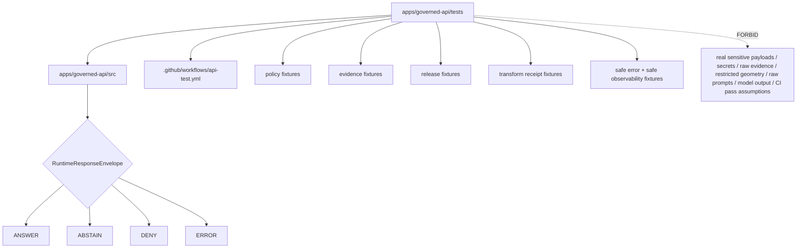

<!-- [KFM_META_BLOCK_V2]
doc_id: kfm://app/governed-api/tests/readme
title: Governed API Tests README
type: app-readme
version: v0.2
status: draft
owners: OWNER_TBD — API steward · Test steward · Policy steward · Evidence steward · Release steward · Runtime steward · Security steward · Privacy steward · Audit steward · CI steward · Docs steward
created: 2026-06-16
updated: 2026-07-09
policy_label: public
related:
  - ../README.md
  - ../src/README.md
  - ../src/ai/README.md
  - ../src/governed_api/README.md
  - ../src/governed_api/routes/README.md
  - ../src/routes/README.md
  - ../src/routes/agriculture/README.md
  - ../routes/README.md
  - ../routes/domains/README.md
  - ../../README.md
  - ../../explorer-web/README.md
  - ../../../docs/doctrine/directory-rules.md
  - ../../../docs/adr/ADR-0004-apps-governed-api-is-the-trust-membrane.md
  - ../../../docs/architecture/governed-ai/FOCUS_FLOW.md
  - ../../../schemas/contracts/v1/runtime/
  - ../../../schemas/contracts/v1/domains/
  - ../../../schemas/contracts/v1/evidence/
  - ../../../schemas/contracts/v1/focus/
  - ../../../contracts/runtime/
  - ../../../contracts/domains/
  - ../../../contracts/evidence/
  - ../../../contracts/focus/
  - ../../../policy/access/README.md
  - ../../../policy/decision/README.md
  - ../../../policy/domains/README.md
  - ../../../policy/telemetry/README.md
  - ../../../packages/evidence-resolver/README.md
  - ../../../packages/policy-runtime/README.md
  - ../../../runtime/README.md
  - ../../../release/README.md
  - ../../../data/README.md
  - ../../../fixtures/
  - ../../../tests/
  - ../../../.github/workflows/api-test.yml
tags: [kfm, apps, governed-api, tests, trust-membrane, finite-outcomes, runtime-response-envelope, abstain, deny, error, pytest, safe-fixtures, safe-observability, ci-boundary]
notes:
  - "Refreshes the bounded governed-api tests lane contract."
  - "This directory may contain app-local tests for the Governed API trust membrane. It is not a schema, contract, policy, lifecycle, release, proof, receipt, runtime-adapter, source-data, telemetry-policy, audit-store, CI-authority, or public-UI authority root."
  - "The api-test workflow file exists and names governed-api smoke and envelope-shape commands. Workflow pass state, local pass state, test inventory, fixture inventory, route coverage, middleware coverage, policy runtime coverage, evidence resolver coverage, release lookup coverage, safe-observability coverage, and runtime behavior remain NEEDS VERIFICATION."
  - "Child source README refreshes may exist as separate draft PRs; this test README does not claim those source changes are merged unless verified on the target ref."
  - "v0.2 adds a current evidence basis, Directory Rules placement basis, minimum safe test slice, runtime anti-bypass matrix, fixture-safety gates, safe-observability gates, route/source/package alignment, no-browser-model/no-chain-of-thought tests, CI/pass-state boundaries, and validation/definition-of-done updates without claiming test pass maturity."
[/KFM_META_BLOCK_V2] -->

<a id="top"></a>

<div align="center">

# Governed API Tests

`apps/governed-api/tests/`

**App-local test boundary for the Governed API trust membrane: finite runtime envelopes, `ANSWER` / `ABSTAIN` / `DENY` / `ERROR` outcomes, authorization and role gates, policy gates, evidence resolution, citation support, release/correction/rollback references, transform receipts, safe errors, safe fixtures, safe observability, route/source/package alignment, no direct internal reads, and no browser/model bypass behavior.**


[Evidence](#0-evidence-basis-for-this-revision) · [Purpose](#1-purpose) · [Repo fit](#2-repo-fit) · [Boundary](#3-authority-boundary) · [Inputs](#5-inputs) · [Exclusions](#6-exclusions) · [Test map](#7-test-family-map) · [Minimum slice](#8-minimum-safe-test-slice) · [Definition of done](#16-definition-of-done)

</div>

---

> [!IMPORTANT]
> **Status:** draft / `NEEDS VERIFICATION`  
> **Owners:** `OWNER_TBD` — API steward · Test steward · Policy steward · Evidence steward · Release steward · Runtime steward · Security steward · Privacy steward · Audit steward · CI steward · Docs steward  
> **Path:** `apps/governed-api/tests/README.md`  
> **Responsibility root:** `apps/` — deployable application surfaces  
> **Directory Rules basis:** app-local tests for a deployable app belong under that app boundary when they test app behavior. `apps/governed-api/tests/` is a governed-api test lane; it is not a schema home, contract home, policy home, lifecycle-data lane, release authority, proof/receipt store, runtime-adapter package, shared test package, telemetry policy root, audit store, CI authority, or public UI surface.  
> **Truth posture:** CONFIRMED current GitHub README path / CONFIRMED governed-api app README exists / CONFIRMED source-tree README exists on `main` / CONFIRMED app-level route-tree README exists / CONFIRMED `.github/workflows/api-test.yml` exists and names two commands / CONFIRMED Directory Rules document exists / PROPOSED test-lane contract / UNKNOWN test file inventory beyond README, fixture inventory, route coverage, middleware coverage, package/source route coverage, policy runtime coverage, evidence resolver coverage, release lookup coverage, transform receipt coverage, safe-observability coverage, local pass state, CI pass state, dashboards, emitted artifacts, and runtime behavior

> [!CAUTION]
> Tests prove behavior only when they are present, relevant, current, and passing. This README may describe required coverage, but it must not be treated as proof that routes, middleware, schemas, policy runtime, evidence resolver, release lookup, transform receipt behavior, safe errors, safe observability, deployment behavior, or CI are working.

---

## Quick jump

- [0. Evidence basis for this revision](#0-evidence-basis-for-this-revision)
- [1. Purpose](#1-purpose)
- [2. Repo fit](#2-repo-fit)
- [3. Authority boundary](#3-authority-boundary)
- [4. Default posture](#4-default-posture)
- [5. Inputs](#5-inputs)
- [6. Exclusions](#6-exclusions)
- [7. Test family map](#7-test-family-map)
- [8. Minimum safe test slice](#8-minimum-safe-test-slice)
- [9. Diagram](#9-diagram)
- [10. Required outcome coverage](#10-required-outcome-coverage)
- [11. Test obligations](#11-test-obligations)
- [12. Runtime anti-bypass matrix](#12-runtime-anti-bypass-matrix)
- [13. Inspection path](#13-inspection-path)
- [14. Validation expectations](#14-validation-expectations)
- [15. Safe change pattern](#15-safe-change-pattern)
- [16. Definition of done](#16-definition-of-done)
- [17. Open verification items](#17-open-verification-items)

---

## 0. Evidence basis for this revision

This README is a documentation boundary, not test pass proof. The 2026-07-09 revision updates an existing README and keeps maturity bounded while aligning the test lane with governed-api app, source-tree, source-route, AI-boundary, route-tree, and CI workflow evidence.

| Evidence item | Status | What it supports | What it does not prove |
|---|---|---|---|
| `apps/governed-api/tests/README.md` exists on `main`. | CONFIRMED | This is an existing README update, not a new path proposal. | It does not prove test files, fixtures, local commands, route coverage, middleware coverage, CI pass state, or runtime behavior exist. |
| `apps/governed-api/README.md` exists and describes the app as the normal public trust path for finite governed envelopes. | CONFIRMED document presence and trust-membrane posture | Tests should protect finite governed envelopes and safe projections. | It does not prove routes, tests, or runtime enforcement are working. |
| `apps/governed-api/src/README.md` exists on `main`. | CONFIRMED document presence | Tests should target app-local source behavior while keeping implementation claims bounded. | It does not prove source implementation or test coverage. |
| `apps/governed-api/routes/README.md` exists on `main`. | CONFIRMED document presence | Tests should align with app-level route-family expectations and avoid route authority drift. | It does not prove route handlers or route tests exist. |
| `.github/workflows/api-test.yml` exists and names `make governed-api-smoke` and `python -m pytest apps/governed-api/tests/test_abstain_routes.py`. | CONFIRMED workflow-file content | CI wiring intent and command names are present. | It does not prove the workflow has run, passed, has correct dependencies, or covers enough behavior. |
| `docs/doctrine/directory-rules.md` exists and identifies root placement as ownership/lifecycle governance; `apps/` is the deployable implementation root and `tests/ + fixtures/` are validation/operation surfaces in the authority diagram. | CONFIRMED document presence and placement posture | App-local governed-api tests fit under the app when they test that deployable. | It does not prove tests are complete, current, or passing. |
| Source README refreshes for `src/ai`, `src/governed_api`, `src/governed_api/routes`, `src/routes`, and `src/routes/agriculture` may exist as separate draft PRs. | NEEDS VERIFICATION on `main` unless fetched at target ref | Test expectations should align with those boundaries without claiming merged maturity. | It does not prove those source README updates have merged or that matching tests exist. |

[Back to top](#top)

---

## 1. Purpose

`apps/governed-api/tests/` is the proposed app-local test lane for the Governed API app.

It may eventually contain tests and fixtures for:

- app import, app factory, dependency wiring, and route registration behavior;
- route-source modules under `apps/governed-api/src/routes/` and package-local route modules under `apps/governed-api/src/governed_api/routes/` if both exist;
- finite `RuntimeResponseEnvelope` shape, status grammar, reason codes, and audit-safe references;
- `ANSWER`, `ABSTAIN`, `DENY`, and `ERROR` cases;
- authorization, caller role, request size, rate/shape guards, and endpoint access behavior;
- policy precheck and postcheck behavior;
- EvidenceRef-to-EvidenceBundle resolution, missing/stale/conflicting evidence, and citation-support behavior;
- release, correction, rollback, stale-state, freshness, review-state, and transform projection;
- redaction, generalization, aggregation, delay, suppression, transform receipt, and source-rights cases;
- safe error redaction, no internal-detail leakage, and audit-safe fault references;
- safe logging, metrics, telemetry, diagnostics, and cache-key behavior;
- AI-assisted server-side adapter boundaries, no-browser-model behavior, no raw model output, and no chain-of-thought exposure;
- domain-sensitive denial and transformation requirements for agriculture, archaeology, rare species, infrastructure, living-person, DNA/genomic, and other high-risk domains where relevant.

This directory is not proof that any test file, fixture, route, middleware, package script, workflow pass, local command, dashboard, log, emitted artifact, or deployment behavior exists.

[Back to top](#top)

---

## 2. Repo fit

| Concern | Owning root | Expected relationship |
|---|---|---|
| Governed API tests | `apps/governed-api/tests/` | App-local tests for the Governed API deployable |
| Governed API app | `apps/governed-api/` | App-level trust membrane contract under test |
| Governed API source | `apps/governed-api/src/` | Implementation source under test |
| Python package source | `apps/governed-api/src/governed_api/` | App-local package boundary under test if used |
| Source routes | `apps/governed-api/src/routes/` | Route-source implementation boundary under test if used |
| Package-local routes | `apps/governed-api/src/governed_api/routes/` | Package-local route implementation boundary under test if used |
| Governed API route docs | `apps/governed-api/routes/` | Route-family documentation and route expectations |
| Runtime schemas/contracts | `schemas/contracts/v1/runtime/`, `contracts/runtime/` | Envelope shape and meaning tested by fixture/contract tests |
| Domain schemas/contracts | `schemas/contracts/v1/domains/`, `contracts/domains/` | Domain payload shape and meaning where route tests use domain objects |
| Evidence schemas/contracts | `schemas/contracts/v1/evidence/`, `contracts/evidence/` | Evidence projection shape and meaning where tests use evidence payloads |
| Policy support | `policy/`, `packages/policy-runtime/` | Policy fixtures, gates, and evaluator behavior under test |
| Evidence support | `packages/evidence-resolver/`, `data/proofs/` | EvidenceBundle support behind the membrane; tests should use safe fixtures |
| Release authority | `release/` | Release/correction/rollback state used in tests through safe fixtures |
| Lifecycle artifacts | `data/` | Lifecycle artifacts; tests should not depend on public direct reads |
| Shared test helpers | `tests/`, `fixtures/`, `packages/` | Cross-app helpers only after ownership review |
| CI workflow | `.github/workflows/api-test.yml` | Workflow file exists; pass state not verified here |

## 3. Authority boundary

This directory may hold tests and test fixtures for the Governed API app. It does not own schemas, contracts, policy rules, domain doctrine, lifecycle data, release decisions, evidence/proof storage, runtime adapters, source acquisition, shared libraries, public UI rendering, deployment configuration, CI truth, logs, dashboards, or audit stores.

```text
apps/governed-api/tests/              = app-local test lane
apps/governed-api/src/                = implementation under test
apps/governed-api/src/routes/         = source-route implementation under test, if used
apps/governed-api/src/governed_api/   = package implementation under test, if used
apps/governed-api/routes/             = route-family documentation
apps/governed-api/                    = trust membrane app contract
schemas/contracts/v1/                 = machine shape
contracts/                            = object meaning
policy/                               = policy rules and documentation
data/                                 = lifecycle artifacts, receipts, proofs, registries
release/                              = publication, correction, rollback authority
packages/                             = reusable helpers
runtime/                              = adapters behind governed API
.github/workflows/api-test.yml        = CI wiring, not pass proof
```

## 4. Default posture

Tests should enforce fail-closed behavior. A passing test suite should not allow a trust-bearing route to return `ANSWER` when evidence, policy, release, citation, transform, authorization, safe-observability, or envelope validation is unresolved.

A test lane should cover negative cases for:

- malformed request schema, unsupported action, or unexpected DTO shape;
- missing authorization, role mismatch, audience mismatch, or endpoint access failure;
- policy denial, policy abstention, policy runtime failure, or policy postcheck failure;
- missing, stale, weak, conflicting, rights-limited, or unresolved EvidenceBundle support;
- missing citation support for claim-bearing answers;
- missing release/correction/rollback state where material;
- missing redaction, generalization, aggregation, delay, suppression, or transform receipt where required;
- attempted direct lifecycle/canonical/internal read by a public route;
- candidate, inferred, modeled, or low-confidence object being worded as confirmed;
- attempted client-direct runtime/model behavior;
- raw model output, private chain-of-thought, provider trace, or prompt leakage;
- unsafe logs, metrics, telemetry, diagnostics, cache keys, or audit refs;
- safe error behavior with no internal detail leakage.

## 5. Inputs

| Input family | Examples | Required posture |
|---|---|---|
| Test files | smoke tests, route tests, middleware tests, envelope tests, safe-error tests | Current inventory `NEEDS VERIFICATION` |
| Fixtures | request payloads, response envelopes, policy decisions, evidence refs, release refs | Mock, bounded, and safe only |
| Runtime envelope | `RuntimeResponseEnvelope`, `DecisionEnvelope`, reason codes, audit refs | Exactly one finite outcome |
| Policy fixtures | allow, deny, abstain, error, restrict, hold where supported | No policy authorship in tests |
| Evidence fixtures | EvidenceRef, resolved/missing/stale/conflicting EvidenceBundle cases | No sensitive raw evidence |
| Release fixtures | ReleaseManifest, CorrectionNotice, RollbackCard refs | Test refs only unless verified public-safe |
| Transform fixtures | Redaction, aggregation, generalization, delay, suppression, transform receipts | Receipt or reason-code checks required |
| Domain fixtures | agriculture, archaeology, rare species, infrastructure, living-person, DNA/genomic, or other sensitive domain cases | Least-exposure default |
| Error fixtures | schema failure, resolver failure, adapter failure, policy failure, infrastructure failure | Safe public error shape |
| Observability fixtures | log event, telemetry event, metrics label, diagnostic output, cache key | No raw evidence, prompts, model output, restricted geometry, PII, secrets, provider traces, or full bundles |
| CI workflow | `.github/workflows/api-test.yml` | File exists; run status `UNKNOWN` |

## 6. Exclusions

| Does not belong here | Correct home |
|---|---|
| Production route implementation | `apps/governed-api/src/` |
| Route-family documentation | `apps/governed-api/routes/` |
| Schemas and contracts | `schemas/contracts/v1/`, `contracts/` |
| Policy bundles and policy docs | `policy/` |
| Domain doctrine | `docs/domains/` |
| Lifecycle artifacts, receipts, proofs, registry, catalog, triplets, published outputs | `data/` |
| Release decisions, correction notices, rollback cards | `release/` |
| Runtime adapters | `runtime/` |
| Shared reusable test helpers for multiple apps | `tests/`, `fixtures/`, or `packages/` after ownership review |
| Public UI tests | `apps/explorer-web/` or UI test root |
| Operational logs and dashboards | Observability/deployment systems, not this README |
| CI status authority | GitHub Actions current run evidence, not static docs |
| Real sensitive payloads, private data, exact protected geometry, credentials, provider traces, raw prompts, raw model outputs, or deployment-only values | Forbidden in app-local tests unless a restricted fixture lane, access control, and review path are explicitly documented |

## 7. Test family map

Exact test files and passing status remain `NEEDS VERIFICATION`.

| Candidate test family | Purpose | Required safeguard | Status |
|---|---|---|---|
| `smoke` | App imports, app factory, route registration, baseline boot | No runtime maturity claim without pass evidence | CONFIRMED workflow command / pass UNKNOWN |
| `envelope_shape` | Validate finite RuntimeResponseEnvelope shape | Four status grammar only | CONFIRMED workflow command / pass UNKNOWN |
| `abstain_routes` | Missing/weak/stale/conflicting evidence cases | No generated filler | CONFIRMED workflow command / pass UNKNOWN |
| `deny_routes` | Policy, rights, role, exposure, release denial cases | No blocked detail leakage | PROPOSED |
| `error_routes` | Schema, resolver, adapter, policy infrastructure faults | Safe error only | PROPOSED |
| `authorization` | Caller role, endpoint access, audience, and operation permission | Fail closed | PROPOSED |
| `policy_gates` | Precheck/postcheck behavior | Fail closed | PROPOSED |
| `evidence_resolution` | EvidenceRef resolution and missing bundle behavior | EvidenceBundle closure | PROPOSED |
| `release_lineage` | Release/correction/rollback references | Release refs preserved | PROPOSED |
| `transform_receipts` | Redaction/aggregation/generalization/delay/suppression receipt behavior | Receipt or reason code required | PROPOSED |
| `safe_observability` | Logs, metrics, telemetry, diagnostics, cache-key safety | No protected content or side channels | PROPOSED |
| `ai_boundaries` | No browser model path, no raw model output, no chain-of-thought | Server-side governed adapter only | PROPOSED |
| `read_only_mutation` | Read-only endpoints cannot write state | Mutation denied | PROPOSED |
| `domain_sensitive` | Agriculture, archaeology, rare species, living-person/DNA, infrastructure denial cases | Domain policy gates | PROPOSED |
| `import_side_effects` | Imports do not publish routes, call sources/models, or mutate state | Explicit app registration only | PROPOSED |

> [!WARNING]
> Candidate test-family names are not pass evidence. Do not claim coverage is present until test files, fixtures, commands, and passing local or CI runs are verified.

## 8. Minimum safe test slice

A smallest useful governed-api test slice should prove the public trust membrane fails closed before broad route coverage claims.

| Slice item | Minimum requirement | Why it is required |
|---|---|---|
| Test inventory | List app-local test files and owners | Prevents coverage overclaiming |
| Safe fixtures | Fixtures are mock/bounded and free of secrets, PII, raw evidence, restricted geometry, raw prompts, and model outputs | Prevents test data leakage |
| Finite envelope tests | Response fixtures reject untyped success and require one of `ANSWER`, `ABSTAIN`, `DENY`, `ERROR` | Preserves runtime grammar |
| Authorization tests | Missing role, wrong role, and forbidden audience fail closed | Prevents protected route exposure |
| Evidence tests | Missing/stale/conflicting evidence returns `ABSTAIN` | Enforces cite-or-abstain |
| Policy tests | Policy denial returns `DENY` without exposure hints | Enforces policy boundary |
| Release/transform tests | Missing release/transform support blocks public output where material | Preserves publication and transform gates |
| Safe-error tests | Stack traces, paths, adapter internals, secrets, and blocked details are absent | Protects public error surface |
| Safe-observability tests | Logs, telemetry, metrics, diagnostics, and cache keys exclude protected content | Prevents side-channel leakage |
| AI-boundary tests | No browser model path, raw model output, chain-of-thought, or provider trace exposure | Preserves governed AI boundary |
| CI/pass evidence | Current workflow run or local command output cited before pass claims | Prevents workflow-file-as-proof mistakes |

This slice is still `PROPOSED` until files, fixtures, commands, and passing runs are verified.

## 9. Diagram



## 10. Required outcome coverage

Every trust-bearing route family should have tests for at least these outcome classes.

| Outcome | Minimum test proof |
|---|---|
| `ANSWER` | Evidence-backed, policy-allowed, release-supported, citation-valid, transform-supported response |
| `ABSTAIN` | Missing/stale/weak/conflicting evidence, unsupported scope, unresolved source role, or missing transform support |
| `DENY` | Policy, rights, role, sensitivity, release, review, exposure, or audience denial with no blocked detail leakage |
| `ERROR` | Schema, adapter, resolver, validation, policy infrastructure, or runtime fault with safe public shape |

## 11. Test obligations

| Obligation | Example effect |
|---|---|
| `finite_outcomes_required` | No route test accepts untyped success, empty success, silent partial, or generated fallback |
| `negative_cases_required` | Missing evidence, denial, and safe error paths are tested alongside success |
| `authorization_required` | Role, audience, endpoint, and operation access are tested |
| `policy_required` | Policy allow/deny/abstain/error behavior is tested |
| `evidence_required` | Claim-bearing `ANSWER` requires EvidenceBundle support |
| `release_refs_required` | Release/correction/rollback refs are preserved where material |
| `transform_receipt_required` | Redaction/generalization/aggregation/delay/suppression behavior is receipt-backed or reason-coded |
| `no_public_internal_path` | Public routes cannot expose lifecycle/canonical/internal references |
| `adapter_boundary_preserved` | Runtime/model adapters are invoked server-side only behind the membrane |
| `safe_error_only` | Errors do not expose protected or internal details |
| `safe_observability_only` | Logs, metrics, telemetry, diagnostics, and cache keys avoid raw evidence, prompts, model output, restricted geometry, PII, provider traces, secrets, and full bundles |
| `fixture_safety_required` | Fixtures avoid real sensitive payloads and deployment-only values |
| `source_package_alignment` | `src/routes`, `src/governed_api/routes`, and app-level route docs cannot drift into parallel route authority |
| `ci_status_not_assumed` | Workflow presence is not treated as pass evidence |

## 12. Runtime anti-bypass matrix

| Bypass risk | Required test posture | Review signal |
|---|---|---|
| Route returns plain dict/string instead of finite envelope | Reject in envelope tests | Response-shape fixture fails |
| Route emits `ANSWER` without evidence closure | Expect `ABSTAIN` | Missing-evidence test passes |
| Policy denial leaks blocked details | Expect safe `DENY` only | Sensitive-denial fixture hides protected payload |
| Missing transform or release support still exports/publicly answers | Expect `ABSTAIN`, `DENY`, or safe bounded alternative | Transform/release fixture blocks response |
| Public route reads lifecycle/canonical/internal stores directly | Import/fetch scan or mock trap fails | No direct public read path |
| Candidate/inferred/model-derived object becomes confirmed language | Fixture rejects confirmed wording | Candidate-label test passes |
| Error exposes stack trace/internal path/secret | Expect safe `ERROR` | Safe-error fixture blocks leakage |
| Logs/telemetry/cache key include prompt/raw evidence/restricted geometry | Expect redacted/hashed/bucketed/omitted fields | Safe-observability fixture blocks leakage |
| Read-only route writes review/lifecycle/evidence/release/receipt state | Mutation trap fails test | Read-only mutation test passes |
| Import publishes routes or mutates state | Import-side-effect test fails on mutation | Explicit app registration only |
| Browser-to-model or raw model output path appears | Network/import/output scan fails | AI-boundary fixture passes |
| Workflow file exists but no run is checked | Keep pass state `UNKNOWN` | README/PR cites workflow presence only, not pass |
| Test fixture uses real sensitive data | Fixture review fails | Mock/bounded fixture inventory passes |

## 13. Inspection path

Test files, fixtures, local commands, coverage, workflow pass state, logs, dashboards, emitted artifacts, and current CI state remain `NEEDS VERIFICATION`.

```bash
find apps/governed-api/tests -maxdepth 6 -type f | sort
find apps/governed-api/src apps/governed-api/tests apps/governed-api/routes tests fixtures schemas contracts policy release data runtime packages .github/workflows -maxdepth 6 -type f 2>/dev/null | grep -Ei 'governed.?api|RuntimeResponseEnvelope|DecisionEnvelope|EvidenceBundle|EvidenceRef|PolicyDecision|ReleaseManifest|CorrectionNotice|RollbackCard|AIReceipt|CitationValidationReport|RedactionReceipt|GeneralizationReceipt|AggregationReceipt|ReviewRecord|SensitivityTransform|abstain|deny|error|smoke|pytest|fixture|test|safe.?log|telemetry|cache|authorization|middleware|route' | sort
python -m pytest apps/governed-api/tests -q
```

## 14. Validation expectations

Useful validation for this test lane should cover:

- every trust-bearing route returns exactly one `ANSWER`, `ABSTAIN`, `DENY`, or `ERROR` status;
- malformed requests fail safely;
- missing authorization, role mismatch, audience mismatch, and forbidden operations fail safely;
- unresolved policy, evidence, release, transform, sensitivity, rights, source-role posture, review state, or stale/freshness posture fails closed;
- missing, stale, weak, conflicting, or unresolved evidence returns `ABSTAIN`;
- policy denial returns `DENY` without blocked detail or exposure hints;
- schema, adapter, resolver, validation, policy infrastructure, or runtime faults return `ERROR` with safe details only;
- AI-assisted routes invoke runtime/model adapters only server-side behind the membrane;
- AI-assisted routes do not expose raw model output, private chain-of-thought, provider traces, prompts, or browser-to-model shortcuts;
- response envelopes preserve evidence refs, policy decision refs, release refs, correction refs, rollback refs, citations, limitations, redactions, stale state, transform refs, reason codes, and audit refs where material;
- read-only routes cannot mutate review decisions, lifecycle state, EvidenceRefs, releases, receipts, audit stores, or provenance stores;
- `src/routes`, `src/governed_api/routes`, and `apps/governed-api/routes` are reconciled so no parallel route authority emerges;
- route imports do not register routes, write state, fetch sources, call models, or mutate lifecycle artifacts unless explicitly invoked by app wiring;
- logs, metrics, telemetry, diagnostics, and cache keys do not include prompts, raw evidence, raw outputs, exact protected geometry, PII, secrets, provider traces, internal handles, or full bundle copies;
- test fixtures do not contain real sensitive payloads, credentials, exact protected geometry, deployment-only values, raw prompts, or raw model outputs;
- current local command output or GitHub Actions run evidence is cited before claiming pass state.

## 15. Safe change pattern

For governed-api test changes:

1. Add or update test inventory and test-family contract.
2. Reconcile tests with `apps/governed-api/src/`, `apps/governed-api/src/routes/`, `apps/governed-api/src/governed_api/`, `apps/governed-api/src/governed_api/routes/`, and `apps/governed-api/routes/` so implementation, package, and documentation responsibilities remain distinct.
3. Add fixtures for `ANSWER`, `ABSTAIN`, `DENY`, `ERROR`, policy denial, missing evidence, stale evidence, unresolved review, transform missing, release missing, safe error, unsafe logging, unsafe telemetry, unsafe cache key, candidate-not-confirmed, unauthorized caller, read-only mutation denied, import side-effect denied, fixture-safety denied, and browser-model denied cases.
4. Keep fixtures mock-only or public-safe unless a restricted fixture lane and review path is explicitly documented.
5. Add tests before exposing new route behavior.
6. Preserve evidence refs, policy decision refs, release refs, correction refs, rollback refs, citations, limitations, redactions, stale state, transform refs, AIReceipt refs where applicable, and audit refs through expected responses.
7. Update this README, `apps/governed-api/README.md`, source READMEs, route READMEs, affected domain/feature docs, policy docs, schemas/contracts, fixtures, and tests when test behavior materially changes.
8. Cite current local output or GitHub Actions run evidence before claiming a test is passing.

## 16. Definition of done

- [ ] Owners are confirmed and `OWNER_TBD` is replaced.
- [ ] Evidence basis is refreshed when app docs, source docs, route docs, schemas, contracts, policy, evidence resolver, release, runtime, fixtures, tests, workflow, telemetry, or CI evidence changes.
- [ ] Test inventory and ownership are documented.
- [ ] Fixture inventory and fixture-safety posture are documented.
- [ ] Local commands are documented and verified.
- [ ] Runtime envelope and route DTO/schema bindings are tested.
- [ ] Authorization and role/audience fixtures are present and passing.
- [ ] Finite outcome fixtures cover `ANSWER`, `ABSTAIN`, `DENY`, and `ERROR`.
- [ ] No-public-internal-path tests are present and passing.
- [ ] Missing-evidence and stale-evidence abstention tests are present and passing.
- [ ] Policy denial and sensitive-domain denial tests are present and passing.
- [ ] Transform-missing and release-missing tests are present and passing where material.
- [ ] Candidate/inferred/model-derived-not-confirmed tests are present and passing where material.
- [ ] Safe-error tests are present and passing.
- [ ] Safe logging, metrics, telemetry, cache-key, diagnostics, and observability tests are present and passing.
- [ ] Read-only vs mutating route boundaries are documented and tested.
- [ ] AI-assisted route no-raw-model-output and no-chain-of-thought tests are present and passing where applicable.
- [ ] Workflow pass state is cited from a current run before being claimed.

## 17. Open verification items

| Item | Why it matters |
|---|---|
| Confirm test files beyond README | Prevents overclaiming test coverage |
| Confirm fixture inventory | Required before fixture-safety claims |
| Confirm local test command | Required before developer-operation claims |
| Confirm workflow pass status | Workflow file exists; pass state is not verified here |
| Confirm route and middleware coverage | Required before route maturity claims |
| Confirm package/source route coverage | Required to avoid parallel route-source drift |
| Confirm authorization tests | Required before public/restricted split claims |
| Confirm policy runtime tests | Required before sensitivity/rights/release claims |
| Confirm evidence resolver tests | Required before EvidenceBundle closure claims |
| Confirm release/correction/rollback tests | Required before publication-state claims |
| Confirm transform receipt tests | Required before redacted/generalized/aggregated output claims |
| Confirm safe logging/telemetry/cache-key tests | Required to prevent side-channel leakage |
| Confirm AI boundary tests | Required before governed AI runtime claims |
| Confirm safe-error tests | Required before public exposure |
| Confirm CI workflow current run status | Required before CI pass claims |

<details>
<summary>Appendix A — no-loss preservation note</summary>

The previous README already contained a bounded governed-api test-lane contract. This revision preserves that contract, refreshes metadata, adds a current evidence-basis section, adds Directory Rules placement posture, strengthens minimum test slice, finite-envelope, authorization, policy/evidence/release/transform, safe-error, safe-observability, fixture-safety, import/registration, AI-boundary, source/package route reconciliation, and CI/pass-state safeguards, and keeps implementation/test-pass claims bounded. It does not claim test files, fixtures, local commands, route coverage, middleware coverage, policy runtime coverage, evidence resolver coverage, release lookup coverage, transform receipt coverage, safe-observability coverage, deployment, logs, dashboards, telemetry, or CI pass state are implemented or passing.

</details>

## Status summary

`apps/governed-api/tests/` should contain app-local trust-membrane tests only after test inventory, fixtures, local commands, route coverage, middleware coverage, finite-outcome coverage, authorization coverage, policy/evidence/release/transform coverage, safe-error checks, safe logging/telemetry/cache-key checks, AI-boundary checks, and workflow pass state are verified.

It must preserve the testing boundary: tests may prove governed API behavior when current and passing, but they must not become schema authority, contract authority, policy authority, lifecycle storage, release authority, proof storage, runtime-adapter authority, public UI behavior, operational logs, CI truth, or a substitute for current passing evidence.

<p align="right"><a href="#top">Back to top</a></p>
