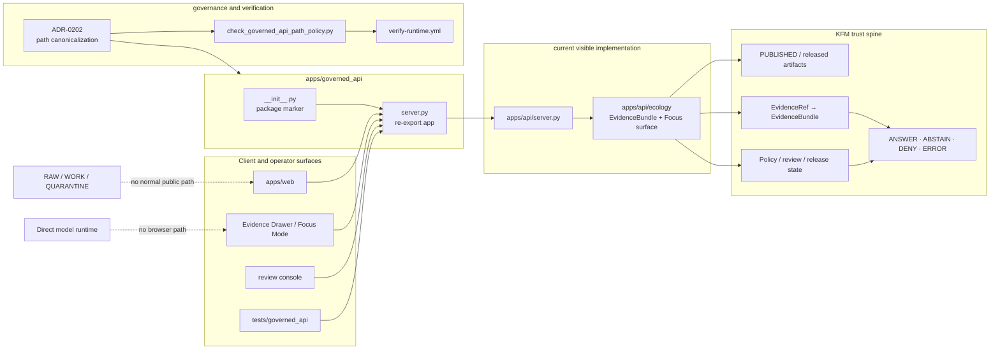

<!-- [KFM_META_BLOCK_V2]
doc_id: kfm://doc/TODO-governed-api-underscore-readme-uuid-NEEDS-VERIFICATION
title: governed_api
type: standard
version: v1
status: draft
owners: @bartytime4life
created: TODO-created-date-NEEDS-VERIFICATION
updated: 2026-05-07
policy_label: TODO-policy-label-NEEDS-VERIFICATION
related: [../../README.md, ../README.md, ./__init__.py, ./server.py, ../api/README.md, ../api/server.py, ../api/ecology/README.md, ../../docs/architecture/governed-api.md, ../../docs/adr/ADR-0202-governed-api-path-canonicalization.md, ../../tools/ci/check_governed_api_path_policy.py, ../../tests/ci/test_check_governed_api_path_policy.py, ../../tests/governed_api/README.md, ../../.github/workflows/verify-runtime.yml]
tags: [kfm, apps, governed-api, governed_api, compatibility, trust-membrane, evidence, policy, runtime]
notes: [README replaces a placeholder file; current repo evidence confirms this package is a compatibility import surface; ADR-0202 treats apps/governed_api as canonical but the active apps/api relationship still needs verification; policy label, created date, stable doc_id, and named app owner require governance confirmation.]
[/KFM_META_BLOCK_V2] -->

<a id="top"></a>

# governed_api

Compatibility and canonicalization boundary for KFM governed API imports, public-safe runtime access, and path-migration discipline.

> [!IMPORTANT]
> **Status:** `experimental / active compatibility surface`  
> **Owners:** `@bartytime4life` through current CODEOWNERS fallback coverage; named API owner **NEEDS VERIFICATION**  
> **Path:** `apps/governed_api/README.md`  
> **Boundary posture:** current `server.py` re-exports `apps.api.server.app`; deeper governed API implementation and route ownership remain a reconciliation item.  
> **Quick jumps:** [Scope](#scope) · [Repo fit](#repo-fit) · [Accepted inputs](#accepted-inputs) · [Exclusions](#exclusions) · [Directory tree](#directory-tree) · [Quickstart](#quickstart) · [Usage](#usage) · [Diagram](#diagram) · [Operating tables](#operating-tables) · [Task list](#task-list--definition-of-done) · [FAQ](#faq) · [Appendix](#appendix)

<p align="center">
  
  
  
  
  
  
</p>

> [!CAUTION]
> This directory is not a shortcut around KFM’s trust membrane. Public clients, map surfaces, Evidence Drawer, Focus Mode, exports, and review tools must remain downstream of governed evidence, policy, release, and correction state.

---

## Scope

`apps/governed_api/` is the underscore-named governed API package surface.

Current repo evidence confirms this directory is at least a Python import compatibility surface:

- `__init__.py` declares the package as backward-compatible.
- `server.py` imports and re-exports `app` from `apps.api.server`.
- `README.md` existed but contained only placeholder content before this revision.

ADR-0202 assigns `apps/governed_api/...` as the canonical governed API implementation home and treats `apps/governed-api/...` as legacy shim-only. The current code relationship between `apps/governed_api/...` and the implementation visible under `apps/api/...` is therefore **NEEDS VERIFICATION / migration reconciliation**, not something this README should smooth over.

This directory is responsible for documenting and preserving:

- the import boundary used by `uvicorn apps.governed_api.server:app`;
- the underscore path’s role in governed API canonicalization;
- the relationship to `apps/api/` while implementation remains there;
- the no-bypass rule for RAW, WORK, QUARANTINE, direct model clients, and unpublished project state;
- the finite runtime posture: `ANSWER`, `ABSTAIN`, `DENY`, and `ERROR`.

It is not responsible for silently claiming full route implementation, full schema enforcement, CI success, production deployment, or release readiness.

<p align="right"><a href="#top">Back to top ↑</a></p>

---

## Repo fit

### Placement

```text
apps/governed_api/README.md
```

`apps/` is the responsibility root for deployable systems and app-local runtime surfaces. `governed_api/` is an app-level Python package surface inside that root, not a domain folder and not a data lifecycle store.

| Relationship | Relative link | Role | Current status |
|---|---|---|---|
| Root README | [`../../README.md`](../../README.md) | Repo-wide KFM identity, trust law, lifecycle, and publication posture. | **CONFIRMED** |
| Apps README | [`../README.md`](../README.md) | Parent deployable-app boundary and naming-drift warning. | **CONFIRMED** |
| Package marker | [`./__init__.py`](./__init__.py) | Backward-compatible package declaration. | **CONFIRMED** |
| Compatibility server | [`./server.py`](./server.py) | Re-exports `app` from `apps.api.server`. | **CONFIRMED** |
| Current API README | [`../api/README.md`](../api/README.md) | Current governed API boundary documentation under `apps/api/`. | **CONFIRMED** |
| Current API server | [`../api/server.py`](../api/server.py) | FastAPI-style ecology public-safe dry-run API implementation. | **CONFIRMED** |
| Current ecology API docs | [`../api/ecology/README.md`](../api/ecology/README.md) | App-local ecology runtime surface; explicitly warns that path reconciliation is unresolved. | **CONFIRMED** |
| Architecture doc | [`../../docs/architecture/governed-api.md`](../../docs/architecture/governed-api.md) | Cross-cutting governed API trust-membrane architecture. | **CONFIRMED** |
| Path ADR | [`../../docs/adr/ADR-0202-governed-api-path-canonicalization.md`](../../docs/adr/ADR-0202-governed-api-path-canonicalization.md) | Accepted underscore-vs-hyphen path decision. | **CONFIRMED** |
| Path checker | [`../../tools/ci/check_governed_api_path_policy.py`](../../tools/ci/check_governed_api_path_policy.py) | Enforces canonical path and legacy shim mapping. | **CONFIRMED file / pass state NEEDS VERIFICATION** |
| Checker tests | [`../../tests/ci/test_check_governed_api_path_policy.py`](../../tests/ci/test_check_governed_api_path_policy.py) | Synthetic regression tests for path-policy checker behavior. | **CONFIRMED** |
| Governed API tests | [`../../tests/governed_api/README.md`](../../tests/governed_api/README.md) | Boundary tests for no-direct-model and no-raw/work/quarantine behavior. | **CONFIRMED** |
| Runtime workflow | [`../../.github/workflows/verify-runtime.yml`](../../.github/workflows/verify-runtime.yml) | Runtime verification workflow for governed API, runtime, policy, contracts, and published-state paths. | **CONFIRMED file / latest run state NEEDS VERIFICATION** |

> [!NOTE]
> This README is intentionally narrow. Deeper route behavior belongs in the current implementation docs under `apps/api/` until the repository completes or amends the canonical path migration.

<p align="right"><a href="#top">Back to top ↑</a></p>

---

## Accepted inputs

Use this directory for files that belong to the underscore governed API import and compatibility boundary.

| Accepted input | Belongs here when… | Guardrail |
|---|---|---|
| Python package marker | It keeps `apps.governed_api` importable. | Must not imply full implementation by itself. |
| Import compatibility shim | It re-exports the active governed API app without duplicating logic. | No policy, resolver, route, model, data, or source logic in the shim. |
| Boundary README | It explains the package role, repo fit, migration posture, and verification burden. | Must distinguish confirmed shim behavior from proposed canonical implementation. |
| Small compatibility tests | They prove the import boundary works or prevents bypass behavior. | Should live in `tests/governed_api/` unless app-local convention says otherwise. |
| Path migration notes | They document `apps/api` ↔ `apps/governed_api` reconciliation. | Must link ADRs and not create parallel API authority. |
| Future canonical implementation files | Only after migration is explicit and tests/policy/docs are aligned. | Must satisfy ADR-0202 and path checker expectations. |

<p align="right"><a href="#top">Back to top ↑</a></p>

---

## Exclusions

Do not treat this directory as a dumping ground for trust-critical work.

| Does not belong here as authority | Better home | Why |
|---|---|---|
| RAW, WORK, or QUARANTINE data | `../../data/raw/`, `../../data/work/`, `../../data/quarantine/` | Public/API surfaces must not bypass lifecycle gates. |
| Source connectors or harvesters | `../../connectors/`, `../../pipelines/`, `../../pipeline_specs/` | Source intake needs rights, cadence, validation, and receipts. |
| Contract meaning | `../../contracts/` | App shims do not own semantic meaning. |
| Machine schema authority | `../../schemas/` or the accepted schema home | Avoid split schema truth. |
| Policy-as-code | `../../policy/` | API code enforces policy; it does not silently redefine policy. |
| Release manifests, proof packs, and receipts | `../../release/`, `../../data/proofs/`, `../../data/receipts/` | Runtime surfaces consume trust objects; they do not become proof storage. |
| Direct browser or public model clients | Governed adapter behind the API | Focus Mode and AI behavior must remain evidence-bounded and policy-checked. |
| Duplicated route implementation | Active canonical app path after ADR/migration | Split implementation weakens the trust membrane. |
| Domain-specific app roots by topic | Responsibility roots such as `docs/domains/`, `schemas/contracts/v1/domains/`, and `policy/domains/` | Domain names should not become root or app folders by convenience. |

<p align="right"><a href="#top">Back to top ↑</a></p>

---

## Directory tree

Current evidence-bounded snapshot:

```text
apps/governed_api/
├── README.md      # this README; replaces placeholder content
├── __init__.py    # backward-compatible governed_api package marker
└── server.py      # compatibility shim: imports app from apps.api.server
```

Expected or checker-referenced canonical ecology files are **not** listed as confirmed in this README unless they are verified in the active branch.

```text
apps/governed_api/ecology/
├── evidencebundle_resolver.py   # NEEDS VERIFICATION
├── routes.py                    # NEEDS VERIFICATION
└── fastapi_routes.py            # NEEDS VERIFICATION
```

Legacy shim paths governed by ADR-0202 and the checker:

```text
apps/governed-api/ecology/
├── evidencebundle_resolver.py   # legacy shim-only if retained
├── routes.py                    # legacy shim-only if retained
└── fastapi_routes.py            # legacy shim-only if retained
```

> [!WARNING]
> Do not claim the checker passes merely because the checker exists. Run it on the active branch and record the result before upgrading enforcement claims.

<p align="right"><a href="#top">Back to top ↑</a></p>

---

## Quickstart

Run from the repository root after dependencies are available.

### 1. Inspect the boundary

```bash
find apps/governed_api -maxdepth 4 -type f | sort
sed -n '1,120p' apps/governed_api/server.py
sed -n '1,80p' apps/governed_api/__init__.py
```

### 2. Verify the import surface

```bash
python - <<'PY'
from apps.governed_api.server import app

print(getattr(app, "title", "app imported"))
PY
```

### 3. Run focused governed API checks

```bash
python -m pytest -q tests/governed_api \
  tests/ci/test_check_governed_api_path_policy.py
```

### 4. Run the path-policy checker as a diagnostic

```bash
python3 tools/ci/check_governed_api_path_policy.py --root .
```

If this fails, treat the result as a **path reconciliation finding**. Do not patch the legacy path with real implementation logic to make the failure disappear.

> [!CAUTION]
> This README documents commands that are appropriate for review. It does not assert they have passed on the current branch unless a CI run, local transcript, or maintainer verification record says so.

<p align="right"><a href="#top">Back to top ↑</a></p>

---

## Usage

### Importing the governed API app

The current compatibility import surface is:

```python
from apps.governed_api.server import app
```

This import delegates to:

```python
from apps.api.server import app
```

Use this path when a tool, test, or local run command expects `apps.governed_api.server:app`.

### Editing behavior

When changing actual API behavior, first identify the active implementation home.

| Change target | Current rule |
|---|---|
| Import compatibility only | Edit `apps/governed_api/server.py` only if the import target or compatibility contract changes. |
| Route behavior | Prefer the active implementation file under `apps/api/` until canonical migration is complete or documented. |
| Canonical path migration | Update ADR-linked docs, path checker, tests, imports, and runtime workflow together. |
| Legacy hyphen path | Keep shim-only; no primary logic. |
| Public response semantics | Preserve evidence resolution, policy checks, finite outcomes, and public-safe redaction. |
| AI or Focus Mode | Do not add direct browser/model provider calls; use governed adapter boundaries and runtime envelopes. |

<p align="right"><a href="#top">Back to top ↑</a></p>

---

## Diagram



<p align="right"><a href="#top">Back to top ↑</a></p>

---

## Operating tables

### Current evidence snapshot

| Surface | What is confirmed | What remains open |
|---|---|---|
| `apps/governed_api/README.md` | File exists and is being revised from placeholder content. | Stable doc metadata and review acceptance. |
| `apps/governed_api/__init__.py` | Declares a backward-compatible package. | Whether this package will become implementation-bearing after migration. |
| `apps/governed_api/server.py` | Re-exports `app` from `apps.api.server`. | Whether shim import remains the long-term runtime entrypoint. |
| `apps/api/server.py` | Defines a FastAPI app and public-safe ecology dry-run routes with redaction, promotion, evidence, and policy checks. | Deployment status, active route registration, full domain coverage, and CI pass state. |
| ADR-0202 | Records `apps/governed_api/...` as canonical and `apps/governed-api/...` as legacy shim-only. | Enforcement pass state and relationship to `apps/api/...`. |
| Path checker | Defines required canonical ecology files and legacy shim mappings. | Whether all mapped files exist and pass on the active branch. |
| Governed API tests | Include static no-direct-model and no-raw/work/quarantine checks against `apps/governed_api/server.py`. | Full runtime coverage and branch-protection enforcement. |
| Runtime workflow | Watches governed API, API, runtime, policy, contracts, schema, test, and published-state paths. | Latest workflow run outcome and required-check status. |

### Boundary invariants

| Invariant | Required posture |
|---|---|
| One trust membrane | Do not let `apps/api`, `apps/governed_api`, and `apps/governed-api` become competing implementations. |
| Cite or abstain | Consequential responses must resolve evidence or return `ABSTAIN`, `DENY`, or `ERROR`. |
| Fail closed | Unknown rights, unresolved sensitivity, missing promotion, or denied policy must not become public success. |
| No raw-store bypass | Normal public surfaces must not reach RAW, WORK, or QUARANTINE. |
| No direct model client | Browser/public clients must not call Ollama, OpenAI-compatible endpoints, or provider runtimes directly. |
| Release-aware output | Public payloads should be downstream of release, proof, catalog, correction, and rollback state. |
| Shims stay thin | Compatibility files should import/re-export only. Real logic belongs in the active canonical implementation home. |

<p align="right"><a href="#top">Back to top ↑</a></p>

---

## Task list / definition of done

Before treating this README as complete active canon:

- [ ] Replace `doc_id`, `created`, and `policy_label` placeholders with governance-verified values.
- [ ] Confirm whether `@bartytime4life` remains the right owner or should be narrowed to a governed API maintainer/team.
- [ ] Confirm whether `apps/governed_api/` remains shim-only, becomes implementation-bearing, or stays a transitional import surface.
- [ ] Resolve the relationship between `apps/api/...` and ADR-0202’s canonical `apps/governed_api/...` rule.
- [ ] Run `python3 tools/ci/check_governed_api_path_policy.py --root .` and record whether the current branch passes.
- [ ] Confirm whether checker-referenced canonical ecology files exist under `apps/governed_api/ecology/`.
- [ ] Confirm whether any `apps/governed-api/...` files exist and remain shim-only.
- [ ] Run or verify the latest relevant `verify-runtime` workflow result before claiming CI enforcement.
- [ ] Confirm `tests/governed_api` and path-policy tests pass under the repo-native runner.
- [ ] Align server import docs, `uvicorn` examples, OpenAPI docs, app-local tests, and client calls.
- [ ] Confirm no public/browser path directly calls a model runtime.
- [ ] Confirm no normal public path reaches RAW, WORK, QUARANTINE, unpublished candidate data, or restricted canonical stores.
- [ ] Add a migration note or ADR amendment if API implementation moves from `apps/api/` into `apps/governed_api/`.
- [ ] Update parent [`../README.md`](../README.md), architecture docs, tests, and workflow docs when the boundary changes.

<p align="right"><a href="#top">Back to top ↑</a></p>

---

## FAQ

### Is `apps/governed_api/` the implemented governed API?

**Partly confirmed, but bounded.** The package exists and currently exposes a compatibility import surface through `server.py`. Current inspected route behavior lives under `apps/api/server.py` and `apps/api/ecology/`. ADR-0202 says `apps/governed_api/...` is canonical, so implementation placement still needs reconciliation.

### Should new logic go into `apps/governed_api/server.py`?

Not unless the change is a compatibility-boundary change. Route behavior, evidence resolution, policy handling, Focus Mode, and API semantics should be changed in the active implementation home and migrated deliberately if the repo is moving toward ADR-0202’s canonical path.

### Can `apps/governed-api/` contain real Python code?

No. ADR-0202 treats the hyphenated path as legacy shim-only.

### Can the web app call a model runtime directly?

No. Focus Mode and AI-mediated behavior must cross the governed API/model-adapter boundary and return finite, evidence-bounded envelopes.

### What happens when evidence is missing?

The API should return a visible `ABSTAIN`, `DENY`, or `ERROR` outcome rather than a plausible unsupported answer.

### Why keep this README if the directory is a shim?

Because the shim is trust-significant. It is the import surface named by run instructions and tests, and it sits in the middle of an unresolved path migration. A clear README prevents that compatibility surface from becoming a hidden second API authority.

<p align="right"><a href="#top">Back to top ↑</a></p>

---

## Appendix

<details>
<summary><strong>Verification backlog</strong></summary>

| Item | Status | How to close |
|---|---|---|
| Stable document ID | **NEEDS VERIFICATION** | Assign from the document registry or governance process. |
| Policy label | **NEEDS VERIFICATION** | Confirm from document registry or policy classification rules. |
| Created date | **NEEDS VERIFICATION** | Confirm from Git history or registry metadata. |
| Owner | **NEEDS VERIFICATION** | Confirm from CODEOWNERS, team slugs, or app ownership register. |
| Active implementation home | **NEEDS VERIFICATION** | Inspect imports, route registration, tests, docs, and ADR migration status. |
| Path-policy checker pass state | **NEEDS VERIFICATION** | Run the checker on the active branch. |
| CI required-check state | **NEEDS VERIFICATION** | Inspect workflow runs and branch protection/rulesets. |
| Runtime endpoint coverage | **NEEDS VERIFICATION** | Compare server routes, OpenAPI docs, clients, tests, and emitted responses. |
| No-direct-model enforcement | **PARTLY CONFIRMED / NEEDS RUNTIME PROOF** | Static tests exist; runtime/public path behavior needs full verification. |
| No-raw-store enforcement | **PARTLY CONFIRMED / NEEDS RUNTIME PROOF** | Static tests exist; runtime/public path behavior needs full verification. |

</details>

<details>
<summary><strong>Reviewer checklist for changes touching this path</strong></summary>

- Does the PR alter import compatibility or actual runtime behavior?
- Does the PR preserve the distinction between `apps/api`, `apps/governed_api`, and `apps/governed-api`?
- Does the PR update ADR-linked docs or migration notes when path ownership changes?
- Does `apps/governed-api/...`, if present, remain shim-only?
- Does `apps/governed_api/server.py` remain free of direct model-client and raw/work/quarantine path usage?
- Are route docs, OpenAPI docs, client calls, and tests aligned?
- Are negative outcomes visible and tested?
- Are public payloads still downstream of evidence, policy, review, release, and correction state?
- Is rollback simple if the compatibility import breaks?

</details>

<p align="right"><a href="#top">Back to top ↑</a></p>
