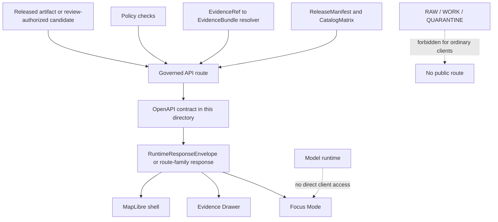

<!-- [KFM_META_BLOCK_V2]
doc_id: kfm://doc/TODO-governed-api-openapi-readme-uuid-NEEDS-VERIFICATION
title: Governed API OpenAPI
type: standard
version: v1
status: draft
owners: TODO-governed-api-owner-NEEDS-VERIFICATION
created: TODO-created-date-NEEDS-VERIFICATION
updated: 2026-04-29
policy_label: TODO-policy-label-NEEDS-VERIFICATION
related: [../, ./, TODO-related-docs-NEEDS-VERIFICATION]
tags: [kfm, governed-api, openapi, contracts, evidence-bundle, decision-envelope, runtime-response-envelope]
notes: [Generated for apps/governed_api/openapi/README.md from KFM attached doctrine and current workspace evidence. The target repo path, doc_id, owner, policy label, adjacent files, OpenAPI target version, and exact validator commands still need live-repo verification.]
[/KFM_META_BLOCK_V2] -->

<a id="top"></a>

# Governed API OpenAPI

OpenAPI contract home for KFM governed API surfaces that expose released, evidence-resolving, policy-aware runtime envelopes.


> [!IMPORTANT]
> **Status:** experimental  
> **Owners:** `TODO-governed-api-owner-NEEDS-VERIFICATION`  
> **Path:** `apps/governed_api/openapi/README.md`  
> **Role:** directory README for governed OpenAPI contracts  
> **Quick jumps:** [Scope](#scope) · [Repo fit](#repo-fit) · [Accepted inputs](#accepted-inputs) · [Exclusions](#exclusions) · [Directory tree](#directory-tree) · [Contract flow](#contract-flow) · [Route families](#route-families) · [Spec rules](#spec-rules) · [Validation](#validation) · [Task list](#task-list--definition-of-done) · [FAQ](#faq) · [Appendix](#appendix)

> [!NOTE]
> This README is contract guidance, not proof of current implementation. In the authoring workspace, the mounted repository and this target directory were **not** visible. Treat local file names, validator commands, and route names below as **PROPOSED / NEEDS VERIFICATION** until checked against the live repo.

---

## Scope

This directory is the proposed OpenAPI contract surface for `apps/governed_api`.

It should describe the governed API boundary where public, reviewer, Focus Mode, Evidence Drawer, export, map, and stewardship clients receive typed responses from released or review-authorized KFM artifacts.

The core obligation is simple:

> OpenAPI describes how clients reach governed evidence. It must not become a shortcut around evidence, policy, release state, review state, or correction lineage.

This directory is in scope for:

- KFM-specific OpenAPI specs for route families that are not fully covered by external standards.
- Contract examples for finite runtime outcomes: `ANSWER`, `ABSTAIN`, `DENY`, `ERROR`.
- Response envelopes that expose evidence, policy, freshness, release state, and audit linkage.
- Internal/stewardship API descriptions when clearly separated from public route families.
- Compatibility notes, deprecation notes, and version-pinning notes for API contracts.

This directory is not a source of canonical truth. It is a reviewable interface layer over the governed truth path.

[Back to top](#top)

---

## Repo fit

| Surface | Path or link | Status | What belongs here |
|---|---:|---|---|
| Current README | `apps/governed_api/openapi/README.md` | **TASK-PROVIDED / NEEDS VERIFICATION** | This orientation file. |
| Parent governed API app | [`../`](../) | **NEEDS VERIFICATION** | Runtime app boundary, route implementation, middleware, and service wiring. |
| Local OpenAPI specs | [`./`](./) | **NEEDS VERIFICATION** | Contract files such as `<domain>.openapi.yaml`, shared runtime specs, or an index spec once confirmed. |
| Route handlers | `../routes/` or `../src/routes/` | **UNKNOWN** | Add a relative link only after live repo inspection confirms the route home. |
| Canonical schema home | `schemas/contracts/v1/...` or `contracts/...` | **CONFLICTED / NEEDS VERIFICATION** | OpenAPI should reference the repo’s canonical schema lane, not fork it. |
| Downstream clients | `apps/<ui-app>/...`, Focus Mode, Evidence Drawer, tests | **UNKNOWN** | Consumers should use governed envelopes only; exact paths require repo inspection. |

> [!WARNING]
> Do not maintain parallel authority between `contracts/` and `schemas/contracts/v1/`. If both exist in the live repo, resolve the canonical schema home through an ADR before adding or duplicating OpenAPI component definitions.

[Back to top](#top)

---

## Accepted inputs

OpenAPI work in this directory should be small, typed, and reviewable.

Accepted inputs include:

- `*.openapi.yaml`, `*.openapi.yml`, or `*.openapi.json` files that describe KFM governed API routes.
- Operation examples using released or synthetic public-safe fixtures.
- `$ref` links to canonical schema objects after the canonical schema home is verified.
- Contract metadata for route family, evidence requirements, policy scope, sensitivity posture, release scope, and finite outcomes.
- Deprecation and compatibility notes for renamed routes, versioned specs, or route-family migrations.
- Contract test fixtures when the repo convention places small examples adjacent to OpenAPI specs.

Every accepted input should answer five review questions:

| Question | Required answer |
|---|---|
| What claim or surface does this route expose? | Route family, scope, audience, and release state. |
| What evidence supports the response? | `EvidenceRef`, `EvidenceBundle`, source role, citation, or reason for abstention/denial. |
| What policy can block it? | Rights, sensitivity, role, exact-location exposure, freshness, review state, or source-role mismatch. |
| What does failure look like? | A bounded `ABSTAIN`, `DENY`, or `ERROR` shape; no bluffing prose. |
| What can be rolled back? | Release manifest, route alias, generated client, layer descriptor, or public export link. |

[Back to top](#top)

---

## Exclusions

Do not place these here:

| Excluded item | Goes instead | Why |
|---|---|---|
| Canonical JSON Schemas | `schemas/contracts/v1/...` or repo-confirmed schema home | OpenAPI should reference canonical contracts instead of redefining them. |
| Route implementation code | `../routes/`, `../src/routes/`, or repo-confirmed API route home | Contracts and runtime behavior must remain separately testable. |
| RAW / WORK / QUARANTINE paths | Data lifecycle directories only | Public and ordinary API clients must not see internal lifecycle stores. |
| Source connector code | `pipelines/`, `packages/`, `tools/`, or repo-confirmed connector lane | Runtime routes should not fetch live source systems directly. |
| Policy-as-code rules | `policy/` or repo-confirmed policy lane | OpenAPI documents policy outcomes; policy engines decide them. |
| Evidence Drawer components | UI app path, once verified | The drawer consumes governed payloads; it is not an OpenAPI spec file. |
| Model prompts or adapter code | AI/model package lane | Focus Mode uses governed API contracts; model runtimes do not own public truth. |
| Secrets, API keys, private endpoint details | Never committed; use deployment secret management | OpenAPI must not leak operational credentials or sensitive access paths. |
| Generated clients as contract authority | Generated output path, if repo allows | Generated clients are downstream derivatives. The contract remains the reviewed source. |

[Back to top](#top)

---

## Directory tree

The live directory was not inspectable in this authoring pass. The tree below is a **PROPOSED shape**, not a claim that these files currently exist.

```text
apps/governed_api/openapi/
├── README.md                         # this file
├── index.openapi.yaml                # PROPOSED: aggregate/index spec, if repo uses one
├── governance.openapi.yaml           # PROPOSED: shared governance and evidence routes
├── runtime.openapi.yaml              # PROPOSED: runtime envelope / Focus Mode route family
├── <domain>.openapi.yaml             # PROPOSED: domain route contract, one per domain when needed
├── examples/                         # PROPOSED: small public-safe examples, if repo convention allows
│   ├── answer.example.json
│   ├── abstain.example.json
│   ├── deny.example.json
│   └── error.example.json
└── CHANGELOG.md                      # PROPOSED: only if local changelog convention is confirmed
```

Naming rule:

> Use one repo convention. Do not keep both `<domain>.openapi.yaml` and `<domain>.v1.yaml` for the same contract unless the live repo already has a documented versioning policy.

[Back to top](#top)

---

## Contract flow



The contract is healthy only when the diagram remains true after implementation:

- Public clients call governed API surfaces, not canonical/internal stores.
- Evidence resolution happens before consequential answers are released.
- Focus Mode receives bounded evidence context, not raw stores or hidden geometry.
- Negative outcomes are visible and typed.
- Release, catalog, proof, and rollback references remain traceable.

[Back to top](#top)

---

## Route families

These route families are doctrine-backed targets for OpenAPI grouping. Their concrete implementation depth is **UNKNOWN** until the live repo is inspected.

| Route family | Primary objects | OpenAPI boundary | Trust obligation |
|---|---|---|---|
| Catalog and discovery | Release metadata, dataset/distribution discovery, catalog closure lists | DCAT, STAC, OGC API Records, and KFM-specific OpenAPI where needed | Catalog closure and identifier consistency must resolve cleanly. |
| Feature or subject read | Released features, places, dossiers, claims, detail views | OGC API Features where fit; KFM-specific OpenAPI where needed | Stable subject ID, support/time semantics, rights posture, and release scope are mandatory. |
| Map / tile / portrayal | Released maps, tiles, legends, styles, portrayals | OGC API Maps/Tiles plus internal portrayal contracts | Must inherit release linkage, policy posture, freshness, and correction state. |
| Evidence resolution | `EvidenceRef`, `EvidenceBundle`, related trust objects | KFM-specific governed API described in OpenAPI | Every bundle must resolve to admissible published scope with rights, sensitivity, and audit linkage visible. |
| Story / dossier / compare | Narrative and comparison inputs anchored in the same shell | KFM-specific governed API | Must preserve spatial anchor, temporal anchor, and drill-through to evidence. |
| Export and report | Public-safe exports, previews, packaged report objects | Governed API plus release-manifest references | Exports never outrun release state, policy posture, or correction linkage. |
| Focus / governed assistance | Bounded natural-language investigation over released scope | Governed API plus `RuntimeResponseEnvelope` | Scope, citations, policy, and audit linkage must be visible in the same pane. |
| Review / stewardship | Moderation, quarantine inspection, approval, denial, rollback, rights handling | Internal governed API; not a public route family | No hidden approvals; every action emits review and decision artifacts. |
| Ops / status | Health, status, metrics, traces, audit joins | Internal ops endpoints only | Must not expose raw canonical data or become a second truth surface. |

[Back to top](#top)

---

## Spec rules

### 1. OpenAPI version posture

**NEEDS VERIFICATION:** pin the OpenAPI target version before adding CI enforcement.

Do not silently track “latest.” The target version must be chosen with:

- repo linter support,
- generated client support,
- schema dialect compatibility,
- test tooling support,
- reviewer readability,
- documented migration path.

### 2. Components should not fork canonical schemas

Use `$ref` to shared KFM contracts after the schema home is confirmed.

Preferred posture:

```yaml
# Illustrative only — verify canonical schema home before committing.
components:
  schemas:
    RuntimeResponseEnvelope:
      $ref: ../../../schemas/contracts/v1/runtime/runtime_response_envelope.schema.json
```

If relative `$ref` paths are not supported by the chosen OpenAPI tooling, document the bundling strategy rather than duplicating the schema.

### 3. KFM metadata belongs on operations

Each consequential operation should carry reviewable KFM metadata. Exact extension names are **PROPOSED** until confirmed.

```yaml
# Illustrative only — not proof of a checked-in spec.
x-kfm:
  route_family: evidence_resolution
  audience: public
  evidence_required: true
  release_required: true
  policy_checked: true
  finite_outcomes:
    - ANSWER
    - ABSTAIN
    - DENY
    - ERROR
  forbidden_lifecycle_inputs:
    - RAW
    - WORK
    - QUARANTINE
```

### 4. Negative outcomes are first-class responses

Do not hide negative states under vague success responses.

| Outcome | Use when | Minimum response burden |
|---|---|---|
| `ANSWER` | Released admissible evidence supports the claim. | Evidence refs, citations or citation-ready references, release scope, audit linkage. |
| `ABSTAIN` | Evidence is missing, partial, ambiguous, stale, or not admissible enough. | Reason code, missing support, scope limit, no unsupported substitute answer. |
| `DENY` | Policy, rights, sensitivity, role, or release rules block the response. | Safe reason class, obligations if any, no protected detail leakage. |
| `ERROR` | Resolver, validator, dependency, or runtime fails. | Correlation/audit reference, bounded failure shape, no fallback to raw properties. |

### 5. Sensitive data must fail closed

OpenAPI examples must not normalize unsafe disclosure.

Public examples must not include:

- exact restricted archaeology locations,
- exact sensitive species locations,
- living-person private data,
- DNA-derived outputs,
- critical infrastructure details beyond public-safe scope,
- hidden geometry,
- unpublished candidate paths,
- RAW / WORK / QUARANTINE links.

### 6. Review and stewardship routes are separate

Internal review routes can be documented, but they must be visibly separated from public route families.

A stewardship spec must state:

- required role or authorization class,
- audit receipt behavior,
- review action emitted,
- rollback or correction reference emitted,
- public exposure prohibition,
- sensitivity and rights obligations.

[Back to top](#top)

---

## Validation

Exact tool commands are **NEEDS VERIFICATION** because the live repo package manager and OpenAPI tooling were not visible.

Use this as a verification shape, not a confirmed command contract:

```bash
# NEEDS VERIFICATION: replace with the repo-native OpenAPI linter.
openapi-cli lint apps/governed_api/openapi/*.yaml

# NEEDS VERIFICATION: replace with the repo-native schema validator.
python tools/validators/evidence_bundle/validate.py tests/fixtures/**/*.json

# NEEDS VERIFICATION: run only after API framework and test runner are confirmed.
pytest tests/e2e/runtime_proof
```

Minimum validation gates for this directory:

| Gate | Expected result |
|---|---|
| OpenAPI parses | No invalid YAML/JSON, unresolved operation IDs, or broken component references. |
| Schema references resolve | `$ref` targets exist after bundling or repo-native schema resolution. |
| Examples validate | `ANSWER`, `ABSTAIN`, `DENY`, and `ERROR` examples validate against runtime schemas. |
| No raw lifecycle leaks | Specs and examples do not expose RAW, WORK, QUARANTINE, hidden geometry, or internal store paths to ordinary clients. |
| Evidence closure | Consequential `ANSWER` examples carry resolvable evidence references. |
| Policy visibility | `DENY` and role-gated routes include safe reason classes and obligations. |
| Focus boundary | Focus routes receive bounded context and return runtime envelopes; no direct model-client route is documented for public clients. |
| Rollback traceability | Deprecated routes and release-linked outputs preserve alias, replacement, or rollback references. |

[Back to top](#top)

---

## Task list / definition of done

Before this directory is considered ready for review:

- [ ] Confirm whether `apps/governed_api/openapi/` exists in the live repo.
- [ ] Confirm parent governed API path: `apps/governed_api`, `apps/governed-api`, `apps/api`, or another repo-native location.
- [ ] Resolve canonical schema home through repo evidence or an ADR.
- [ ] Pin OpenAPI target version and linter/toolchain.
- [ ] Add or confirm an OpenAPI index/register if the repo uses one.
- [ ] Ensure every consequential route declares route family, audience, release posture, and evidence posture.
- [ ] Add finite outcome examples for runtime routes.
- [ ] Add negative fixtures for missing evidence, rights uncertainty, sensitivity denial, schema failure, and stale/withdrawn release state.
- [ ] Prove ordinary clients cannot reach RAW, WORK, QUARANTINE, canonical restricted stores, vector indexes, graph internals, or model runtimes directly.
- [ ] Confirm Evidence Drawer and Focus Mode consume governed envelopes rather than raw feature properties.
- [ ] Add deprecation and rollback notes for renamed routes.
- [ ] Update adjacent README or register files after the live repo structure is verified.

[Back to top](#top)

---

## FAQ

### Is OpenAPI the source of truth for KFM evidence objects?

No. OpenAPI is the interface contract. Canonical governance objects such as `EvidenceBundle`, `DecisionEnvelope`, `RuntimeResponseEnvelope`, `ReleaseManifest`, `CatalogMatrix`, `PolicyDecision`, and `TrustState` should live in the repo’s canonical schema/contract lane.

### Can OpenAPI routes fetch live source systems?

Not as the normal public path. Runtime routes should return governed, validated, released, or review-authorized artifacts. Source fetching belongs in watcher, connector, source descriptor, normalization, and validation lanes.

### Can a route return a map feature without evidence?

Only if the route family and product semantics explicitly allow a non-claim portrayal. Consequential claims must remain evidence-resolving or must `ABSTAIN`.

### Can Focus Mode call a model runtime directly from the browser?

No. Focus Mode must go through governed API surfaces that apply scope resolution, evidence resolution, policy checks, citation validation, finite outcome envelopes, and receipts.

### Should this directory include generated client code?

No, unless the live repo has a documented exception. Generated clients are derived artifacts and should not become contract authority.

### What happens when an OpenAPI contract changes?

Record the compatibility impact. Breaking changes need versioning, aliases or deprecation windows, route tests, and rollback references. Silent replacement is not a governed change.

[Back to top](#top)

---

## Appendix

<details>
<summary>Open verification backlog</summary>

| Item | Status | Verification step |
|---|---|---|
| Target directory exists | **UNKNOWN** | Inspect live repo for `apps/governed_api/openapi/`. |
| Parent API framework | **UNKNOWN** | Inspect package files, app entrypoint, route modules, tests, and OpenAPI generation hooks. |
| OpenAPI target version | **NEEDS VERIFICATION** | Check repo tooling and official spec compatibility before pinning. |
| Canonical schema home | **CONFLICTED / NEEDS VERIFICATION** | Inspect `contracts/`, `schemas/`, existing ADRs, and schema tests. |
| Existing OpenAPI files | **UNKNOWN** | Inventory local specs and route mappings. |
| Validator commands | **UNKNOWN** | Inspect CI, `Makefile`, package manager, and validator scripts. |
| Owners | **UNKNOWN** | Inspect `CODEOWNERS`, team docs, or repo ownership registers. |
| Policy label | **UNKNOWN** | Confirm whether this README is public, restricted, or internal. |
| Public route status | **UNKNOWN** | Confirm which route families are public, internal, steward-only, or not implemented. |
| Generated clients | **UNKNOWN** | Confirm whether clients are generated and where generated outputs belong. |

</details>

<details>
<summary>Contract review checklist for a new spec</summary>

A new OpenAPI file should not pass review unless it can answer:

1. Which route family does each operation belong to?
2. Which audience can call it?
3. Does it expose public, internal, steward, or ops behavior?
4. Does it require release state?
5. Does it resolve `EvidenceRef -> EvidenceBundle`?
6. Does it return a finite runtime outcome where applicable?
7. Does `DENY` avoid leaking protected details?
8. Does `ABSTAIN` avoid pretending to know more than the evidence supports?
9. Does `ERROR` avoid falling back to raw feature properties?
10. Are examples public-safe?
11. Are schema references canonical?
12. Are rollback/deprecation paths documented?

</details>
